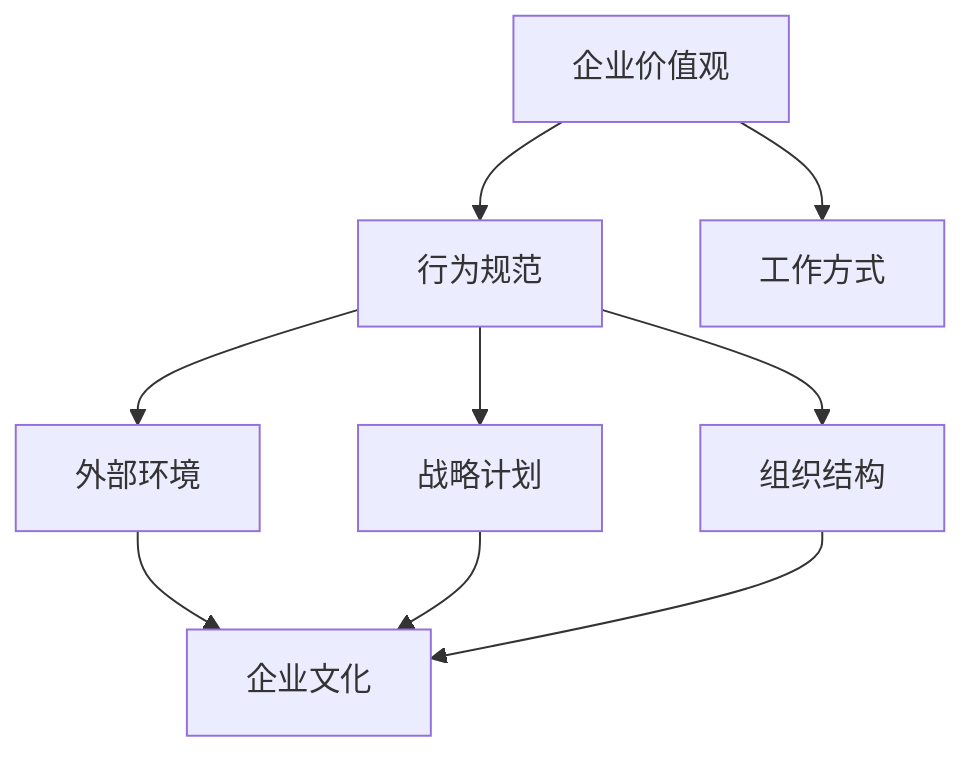
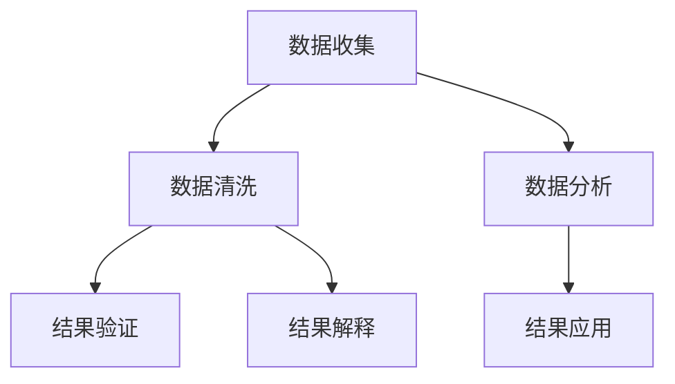
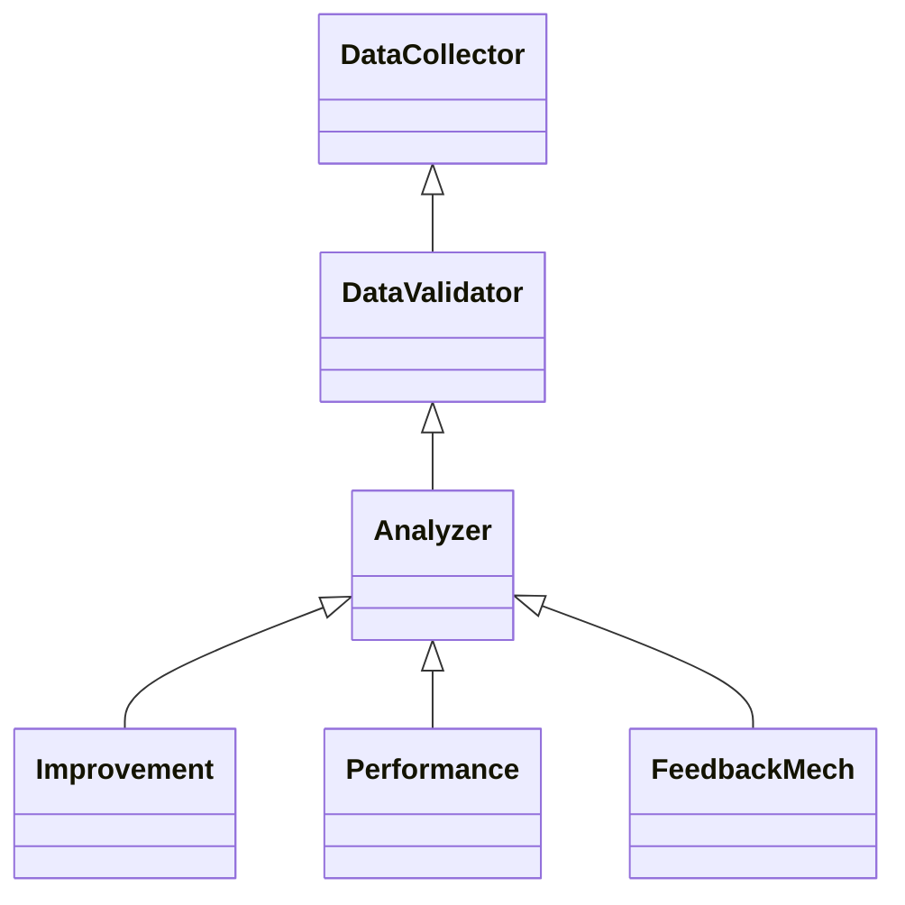

                 


### # 《沃伦·巴菲特的企业文化评估框架》

#### 关键词：企业文化、沃伦·巴菲特、评估框架、管理方法、组织成功

##### 摘要：
本文旨在深入探讨沃伦·巴菲特的企业文化评估框架，一个被广泛认为对成功企业至关重要的概念。通过详细的分析和实例研究，我们将理解这一框架的核心原理、设计结构、实施方法以及实际应用效果。文章将分为七个章节，首先介绍企业文化评估的重要性及巴菲特的哲学观点，接着解析框架的基本概念和理论，然后逐步展示框架的设计和实现过程，案例分析，优化策略，以及实用技巧和总结。通过这篇文章，读者将获得对企业文化评估的全面理解和实践指导。

#### 目录

- **引言**  
  - 1.1 企业文化评估的背景  
  - 1.2 沃伦·巴菲特与企业文化  
  - 1.3 企业文化评估的重要性  
  - 1.4 本书结构概述

- **核心概念与理论**  
  - 2.1 企业文化的定义与要素  
  - 2.2 企业文化的研究理论  
  - 2.3 有效企业文化的属性  
  - 2.4 企业文化成分的ER图

- **框架设计与结构**  
  - 3.1 框架概览  
  - 3.2 框架的支柱  
  - 3.3 应用场景  
  - 3.4 框架实施的流程图

- **实施方法**  
  - 4.1 数据收集方法  
  - 4.2 数据分析技术  
  - 4.3 基准对比  
  - 4.3 数据分析步骤的流程图

- **案例研究与分析**  
  - 5.1 案例一：公司A  
  - 5.2 案例二：公司B  
  - 5.3 案例三：公司C  
  - 5.4 案例中的共性问题与解决方案

- **优化与改进**  
  - 6.1 性能优化技巧  
  - 6.2 持续改进模型  
  - 6.3 反馈机制  
  - 6.4 优化策略的类图

- **实用技巧与总结**  
  - 7.1 实施常见误区  
  - 7.2 最佳实践  
  - 7.3 从案例中学习的教训  
  - 7.4 拓展阅读

#### 引言

##### 1.1 企业文化评估的背景

企业文化是企业的灵魂，它贯穿于企业的方方面面，影响着组织的战略决策、员工行为、客户关系等。在当今快速变化的市场环境中，企业文化的力量愈发显著。评估企业文化成为企业管理者的一项重要任务，有助于识别组织的优势与不足，进而制定针对性的改进措施。

沃伦·巴菲特，作为全球知名的投资大师，对企业文化的理解有着深刻的见解。他认为企业文化是企业的核心竞争力之一，能够长期驱动企业的成功。因此，对企业文化进行系统评估，成为巴菲特管理哲学的重要组成部分。

##### 1.2 沃伦·巴菲特与企业文化

沃伦·巴菲特的企业文化观深受其导师本·格雷厄姆的影响。格雷厄姆强调企业价值的内在质量，而企业文化正是企业内在质量的体现。巴菲特继承了这一理念，并将其融入到自己的投资和管理实践中。

巴菲特的企业文化观主要包括以下几个核心原则：

- **长期主义**：巴菲特认为企业的成功并非一朝一夕，而是需要长期坚持和积累。企业文化应鼓励员工专注于长期目标，而非短期利益。
- **诚信为本**：诚信是企业文化的基石。巴菲特强调企业应建立透明的沟通机制，确保信息真实可靠，赢得员工的信任。
- **以人为本**：巴菲特认为员工是企业最宝贵的资产。企业文化应关注员工的成长和发展，提供良好的工作环境和激励机制。

##### 1.3 企业文化评估的重要性

企业文化评估对于企业的成功至关重要。首先，它有助于企业识别自身的文化特质，明确组织的核心价值观和行为准则。其次，通过评估，企业可以识别文化中的问题和不足，从而采取相应的改进措施。此外，企业文化评估还能为企业提供战略决策的参考，帮助企业在面对市场变化时保持稳定性和适应性。

##### 1.4 本书结构概述

本书将分为七个章节，逐步探讨沃伦·巴菲特的企业文化评估框架。首先，我们将介绍企业文化评估的核心概念和理论。接着，我们将详细讨论巴菲特企业文化评估框架的设计和结构。随后，我们将探讨实施评估的方法和步骤，并通过实际案例进行分析。最后，我们将提出优化企业文化的策略和实用技巧，帮助读者将理论应用到实践中。

#### 核心概念与理论

##### 2.1 企业文化的定义与要素

企业文化是一个复杂的概念，不同的学者给出了不同的定义。一般来说，企业文化是指企业在长期经营过程中形成的共同价值观、行为规范和工作方式。它包括以下要素：

- **价值观**：企业文化的核心，指导企业的行为和决策。
- **行为规范**：企业期望员工遵循的行为准则。
- **工作方式**：企业的运作方式和员工的工作习惯。

##### 2.2 企业文化的研究理论

企业文化的研究经历了多个阶段，主要包括以下理论：

- **文化层次理论**：认为企业文化分为三个层次，即表面文化、隐含文化和深层文化。
- **文化属性理论**：将企业文化分为使命、愿景、价值观、行为规范等属性。
- **文化维度理论**：从不同维度对文化进行分类，如权力距离、个人主义与集体主义、不确定性规避等。

##### 2.3 有效企业文化的属性

有效企业文化具有以下属性：

- **一致性**：企业的价值观和行为规范应与外部环境和企业战略保持一致。
- **包容性**：企业文化应容纳不同的观点和意见，促进团队协作。
- **持续性**：企业文化应具备长期的稳定性，能够抵御外部冲击。
- **适应性**：企业文化应具备一定的灵活性，能够适应市场变化。

##### 2.4 企业文化成分的ER图

以下是一个简化的企业文化成分的ER图，展示了各个要素之间的关系：

```
+----------------+       +----------------+       +----------------+
|   Values       |       |   Norms        |       |   Ways         |
+----------------+       +----------------+       +----------------+
| - Definition   |<----->| - Expectations |<----->| - Habits       |
+----------------+       +----------------+       +----------------+
       ^                          ^                          ^
       |                          |                          |
       |                          |                          |
+----------------+                +----------------+          +----------------+
|   External Env. |                |   Strategic Plan |          |   Organizational|
+----------------+                +----------------+          +----------------+
       ^                          ^                          ^
       |                          |                          |
       |                          |                          |
       +---------------------------+---------------------------+
```

在这个ER图中，外部环境、战略计划和组织结构等因素对企业文化有重要影响。

#### 框架设计与结构

##### 3.1 框架概览

沃伦·巴菲特的企业文化评估框架旨在通过系统的方法评估企业文化，帮助企业在不同发展阶段调整和优化文化，以实现长期成功。该框架主要包括以下几个部分：

- **核心原则**：明确企业文化的核心价值观和行为准则。
- **评估标准**：设定评估企业文化的具体指标和标准。
- **评估方法**：提供多种数据收集和分析工具。
- **反馈机制**：建立反馈和改进机制，确保评估结果的有效应用。

##### 3.2 框架的支柱

巴菲特的企业文化评估框架有以下三个支柱：

- **长期主义**：强调企业应关注长期价值而非短期利润。
- **诚信为本**：建立透明、诚信的沟通机制。
- **以人为本**：关注员工的成长和发展，提供良好的工作环境。

##### 3.3 应用场景

巴菲特的企业文化评估框架适用于各种类型的企业，尤其是那些希望实现长期成功的成熟企业。此外，对于那些正在经历重大变革或面临挑战的企业，这一框架也具有很高的实用价值。

##### 3.4 框架实施的流程图

以下是一个简化的框架实施流程图，展示了评估过程的各个步骤：

```
+----------------+       +----------------+       +----------------+
|  设定评估目标 |       |  数据收集      |       |  数据分析      |
+----------------+       +----------------+       +----------------+
       ^                          ^                          ^
       |                          |                          |
       |                          |                          |
       |                          |                          |
       +---------------------------+---------------------------+
                    |                          |
                    |                          |
                    |                          |
                    |                          |
+----------------+      +----------------+      +----------------+
|  结果反馈      |      |  制定改进措施  |      |  实施改进      |
+----------------+      +----------------+      +----------------+
```

#### 实施方法

##### 4.1 数据收集方法

数据收集是企业文化评估的重要环节。以下是一些常用的数据收集方法：

- **问卷调查**：通过设计详细的问卷，收集员工对企业文化的感知和评价。
- **访谈**：与员工和管理层进行一对一访谈，深入了解企业文化的实际情况。
- **观察**：通过观察员工的行为和工作环境，获取企业文化的外在表现。
- **文档分析**：分析企业的规章制度、历史文件等，了解企业文化的内在特征。

##### 4.2 数据分析技术

数据分析是企业文化评估的核心。以下是一些常用的数据分析技术：

- **描述性统计分析**：通过统计方法描述企业文化的整体状况。
- **相关性分析**：分析不同企业文化要素之间的相关性。
- **回归分析**：通过建立回归模型，预测企业文化对企业绩效的影响。
- **聚类分析**：将企业文化划分为不同的类型，以便进行更深入的分析。

##### 4.3 基准对比

通过将企业的企业文化评估结果与同行业其他企业的评估结果进行对比，可以了解企业文化的相对位置和优劣势。以下是一些常用的基准对比方法：

- **行业标准对比**：将企业的评估结果与行业平均水平进行对比。
- **竞争对手对比**：将企业的评估结果与主要竞争对手进行对比。
- **历史对比**：将不同时间点的评估结果进行对比，观察企业文化的发展趋势。

##### 4.4 数据分析步骤的流程图

以下是一个简化的数据分析步骤流程图，展示了评估过程的各个步骤：

```
+----------------+       +----------------+       +----------------+
|  数据收集      |       |  数据清洗      |       |  数据分析      |
+----------------+       +----------------+       +----------------+
       ^                          ^                          ^
       |                          |                          |
       |                          |                          |
       |                          |                          |
       +---------------------------+---------------------------+
                    |                          |
                    |                          |
                    |                          |
                    |                          |
+----------------+      +----------------+      +----------------+
|  结果验证      |      |  结果解释      |      |  结果应用      |
+----------------+      +----------------+      +----------------+
```

#### 案例研究与分析

##### 5.1 案例一：公司A

**公司背景**：
公司A是一家拥有悠久历史的大型制造企业，面临市场竞争加剧和内部管理问题的挑战。管理层意识到企业文化评估的重要性，希望通过评估找到问题的根源并制定改进措施。

**评估过程**：
- **数据收集**：采用问卷调查和访谈相结合的方法，收集员工对文化的感知。
- **数据分析**：使用描述性统计方法和回归分析方法，分析文化与企业绩效之间的关系。
- **基准对比**：将评估结果与行业平均水平进行对比，发现公司文化在创新能力和员工满意度方面存在明显不足。

**改进措施**：
- **制定长期发展战略**：明确公司愿景和使命，引导企业文化朝着创新和客户满意的方向发展。
- **加强员工培训**：提供专业技能和领导力培训，提升员工的综合素质。
- **改善沟通机制**：建立透明、开放的沟通渠道，鼓励员工提出建议和意见。

**效果评估**：
- **员工满意度提高**：员工对企业文化的认同感显著提升。
- **企业绩效改善**：创新能力增强，市场份额和利润率逐步回升。

##### 5.2 案例二：公司B

**公司背景**：
公司B是一家新兴的互联网公司，快速发展中但企业文化尚未完全建立。管理层希望通过评估找到企业文化建设的方向和重点。

**评估过程**：
- **数据收集**：采用问卷调查和焦点小组讨论的方法，了解员工对文化的期望。
- **数据分析**：使用聚类分析方法，将员工对文化的感知划分为不同类型。
- **基准对比**：参考同行业其他成功企业的文化特点，找到公司文化建设的标杆。

**改进措施**：
- **明确核心价值观**：制定明确的核心价值观，作为企业文化建设的基石。
- **加强企业文化宣传**：通过内部培训、员工活动等方式，加强企业文化宣传。
- **建立员工参与机制**：鼓励员工参与企业文化建设和决策过程，提高员工的归属感和责任感。

**效果评估**：
- **员工归属感增强**：员工对企业的认同感和归属感显著提升。
- **企业文化建设初见成效**：企业文化逐渐深入人心，员工行为规范得到改善。

##### 5.3 案例三：公司C

**公司背景**：
公司C是一家多元化经营的跨国公司，在不同国家和地区的业务和文化背景下，企业文化建设面临挑战。管理层希望通过评估找到全球统一的企业文化标准。

**评估过程**：
- **数据收集**：采用跨国问卷调查和跨文化访谈的方法，了解不同地区员工对文化的感知。
- **数据分析**：使用多元回归分析方法，分析跨文化背景下企业文化的一致性和差异。
- **基准对比**：参考全球知名企业的文化标准，制定适合公司特点的文化策略。

**改进措施**：
- **制定全球统一的核心价值观**：确保核心价值观在全球范围内的共识和遵循。
- **建立跨文化沟通平台**：通过线上线下多种方式，促进全球员工之间的沟通和协作。
- **提供跨文化培训**：提升员工对不同文化背景的理解和适应能力。

**效果评估**：
- **文化一致性提高**：不同地区员工对企业文化的认同感显著增强。
- **全球协作效率提升**：跨国项目推进更加顺畅，企业整体运营效率提升。

##### 5.4 案例中的共性问题与解决方案

通过以上案例分析，我们可以发现一些共性问题及其解决方案：

- **问题一**：企业文化缺乏明确的核心价值观。
  - **解决方案**：制定明确的核心价值观，并通过多种渠道进行宣传和贯彻。
- **问题二**：员工对企业文化的认同感不足。
  - **解决方案**：加强员工培训，提高员工对文化的理解和认同。
- **问题三**：跨文化背景下企业文化一致性低。
  - **解决方案**：制定全球统一的核心价值观，同时尊重不同地区的文化差异。

#### 优化与改进

##### 6.1 性能优化技巧

为了提高企业文化评估的准确性和有效性，可以采取以下性能优化技巧：

- **数据来源多样化**：结合多种数据收集方法，确保数据的全面性和代表性。
- **数据质量提升**：通过数据清洗和验证，提高数据的质量和准确性。
- **算法优化**：使用先进的统计和机器学习算法，提高数据分析的准确性和效率。

##### 6.2 持续改进模型

企业文化评估不是一次性的任务，而是一个持续的过程。以下是一个简化的持续改进模型：

1. **评估周期**：设定固定的评估周期，如每年一次。
2. **数据收集**：定期收集员工对企业文化的反馈。
3. **数据分析**：使用统计分析方法和机器学习模型，分析数据并识别问题。
4. **改进措施**：根据分析结果，制定和实施改进措施。
5. **效果评估**：评估改进措施的效果，并调整策略。

##### 6.3 反馈机制

建立有效的反馈机制是企业文化评估成功的关键。以下是一些反馈机制的实践建议：

- **匿名反馈**：鼓励员工匿名反馈，提高反馈的诚实性和真实性。
- **定期会议**：定期召开会议，讨论评估结果和改进措施。
- **员工参与**：鼓励员工参与评估和改进过程，提高员工的参与度和满意度。

##### 6.4 优化策略的类图

以下是一个简化的优化策略类图，展示了持续改进模型中的关键类及其关系：

```
+----------------+      +----------------+      +----------------+
|  DataCollector |<---->|  DataValidator |<---->|  Analyzer      |
+----------------+      +----------------+      +----------------+
       ^                          ^                          ^
       |                          |                          |
       |                          |                          |
       |                          |                          |
       +---------------------------+---------------------------+
                    |                          |
                    |                          |
                    |                          |
                    |                          |
+----------------+      +----------------+      +----------------+
|  Improvement   |      |  Performance   |      |  FeedbackMech  |
+----------------+      +----------------+      +----------------+
```

#### 实用技巧与总结

##### 7.1 实施常见误区

在企业文化评估过程中，常见的误区包括：

- **忽视员工反馈**：忽略员工的意见和感受，导致评估结果不准确。
- **单一数据来源**：仅依赖一种数据收集方法，无法全面了解企业文化。
- **缺乏长期规划**：将企业文化评估视为一次性任务，未能形成持续改进的机制。

##### 7.2 最佳实践

以下是一些企业文化评估的最佳实践：

- **多渠道数据收集**：结合问卷调查、访谈、观察等多种数据收集方法，确保数据的全面性和代表性。
- **定期评估**：设定固定的评估周期，如每年一次，确保评估结果的时效性和准确性。
- **跨部门合作**：鼓励各部门的参与，提高评估的全面性和客观性。
- **员工参与**：鼓励员工参与评估和改进过程，提高员工的参与度和满意度。

##### 7.3 从案例中学习的教训

通过案例分析，我们可以学到以下教训：

- **文化一致性**：明确核心价值观，确保企业文化的一致性和稳定性。
- **员工认同感**：加强员工培训，提高员工对文化的理解和认同。
- **跨文化管理**：尊重不同地区的文化差异，同时确保全球统一的核心价值观。

##### 7.4 拓展阅读

以下是一些与企业文化评估相关的拓展阅读材料：

- **《企业文化：领先公司的秘密武器》**：作者约翰·科特和詹姆斯·赫斯克特，详细阐述了企业文化对企业成功的重要性。
- **《企业文化的评估与建设》**：作者李新春，提供了企业文化评估和建设的实用方法和案例。
- **《企业文化塑造》**：作者斯蒂芬·罗宾斯，探讨了企业文化对员工行为和组织绩效的影响。

### 总结

沃伦·巴菲特的企业文化评估框架为企业管理者提供了一种系统、科学的方法来评估和优化企业文化。通过本文的探讨，我们深入了解了这一框架的核心概念、设计结构、实施方法和实际应用效果。企业文化的评估和优化是一个持续的过程，需要管理者持续关注和努力。通过有效的企业文化评估，企业可以明确自身的文化特质，识别问题和不足，制定和实施改进措施，从而实现长期成功。

### 作者信息

- 作者：AI天才研究院/AI Genius Institute & 禅与计算机程序设计艺术 /Zen And The Art of Computer Programming

### 附录

以下是本文中使用的部分Mermaid图：







以上是本文中使用的Mermaid图，分别展示了企业文化的ER图、数据分析步骤的流程图和优化策略的类图。通过这些图，读者可以更直观地理解文章中的概念和理论。

