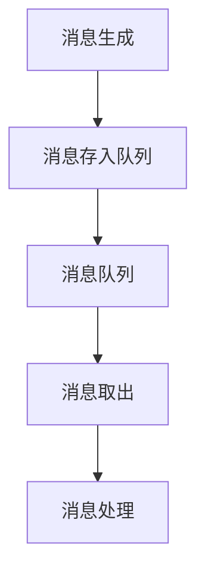
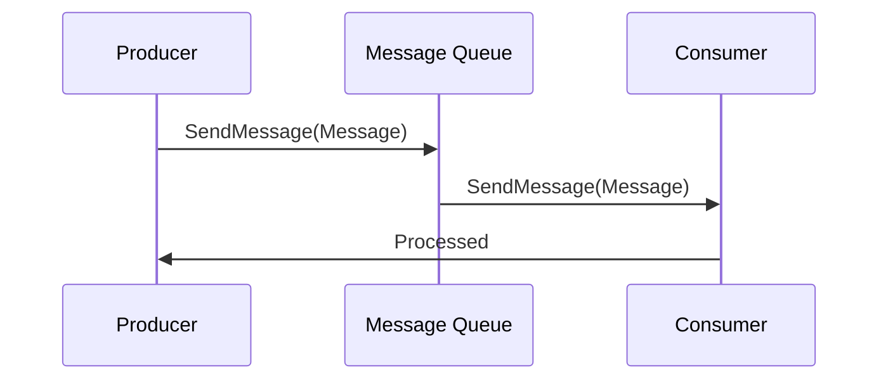
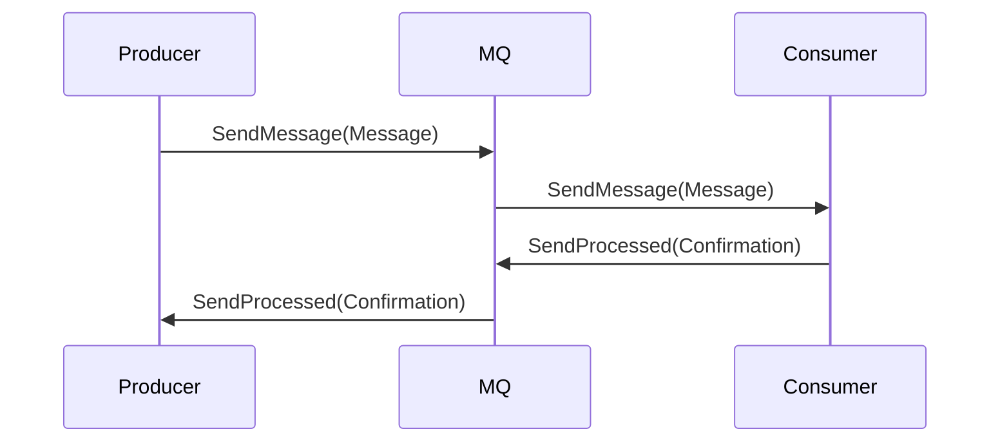

                 

### 让我们一步步深入探讨消息队列与LLM应用解耦

#### **1. 背景介绍**

消息队列（Message Queue）作为一种先进的通信机制，旨在实现分布式系统中不同组件之间的异步通信。随着云计算和分布式系统的广泛应用，消息队列的重要性愈发凸显。其核心理念是允许系统组件在不相互直接依赖的情况下进行通信，从而实现灵活且高效的处理流程。

另一方面，大型语言模型（Large Language Model，简称LLM）作为人工智能领域的一个重要分支，近年来取得了显著的进展。LLM具有强大的语言理解和生成能力，广泛应用于自然语言处理、智能问答、机器翻译等多个领域。然而，随着模型规模的扩大和复杂度的增加，LLM应用面临解耦的挑战，如何实现高效、可靠的解耦成为关键问题。

本文将围绕消息队列在LLM应用解耦中的应用进行深入探讨。首先，我们将介绍消息队列的基本概念和原理，然后分析LLM应用中解耦的挑战和需求，最后详细阐述消息队列在LLM应用中的解耦策略和实践。

#### **2. 核心概念与联系**

**消息队列的概念与原理**

- **定义**：消息队列是一个存放消息的缓冲区，用于在分布式系统中传递消息。
- **原理**：消息生产者将消息放入队列，消息消费者从队列中取出消息进行处理。

**消息队列的优势**

- **异步通信**：允许消息生产者和消费者在不同的时间处理消息，提高系统的响应能力。
- **分布式处理**：支持分布式系统中的组件协同工作，提高系统的扩展性和容错性。
- **解耦系统组件**：减少系统组件之间的直接依赖，提高系统的灵活性和可维护性。

**LLM的概念与分类**

- **定义**：LLM是一种基于大规模数据预训练的语言模型，具有强大的语言理解和生成能力。
- **分类**：根据训练数据和模型结构的不同，LLM可以分为基于Transformer的模型和基于RNN的模型。

**LLM在解耦中的应用**

- **异步处理**：通过消息队列实现异步通信，提高系统处理能力。
- **分布式计算**：利用消息队列实现分布式系统的协同工作，提高系统的扩展性和容错性。
- **弹性伸缩**：通过消息队列实现系统的动态调整，适应不同负载场景。

**消息队列与LLM应用解耦的关系**

- **消息队列提供异步通信机制**，实现LLM应用中的异步处理和分布式计算。
- **消息队列实现系统组件解耦**，提高LLM应用的灵活性和可维护性。

#### **3. 算法原理讲解**

为了更好地理解消息队列在LLM应用解耦中的应用，我们首先需要了解消息队列的基本工作原理。以下是一个简单的消息队列算法流程图，使用Mermaid绘制：



在上面的流程图中，我们可以看到消息队列的主要工作流程：

1. **消息生成**：消息生产者将消息生成并放入消息队列。
2. **消息存入队列**：消息队列负责存储消息，并提供一定的持久化能力，确保消息不会丢失。
3. **消息取出**：消息消费者从消息队列中取出消息。
4. **消息处理**：消息消费者对消息进行处理，实现相应的业务逻辑。

下面，我们使用Python源代码来详细阐述消息队列的基本原理：

```python
import pika

# 创建连接
connection = pika.BlockingConnection(pika.ConnectionParameters('localhost'))
channel = connection.channel()

# 创建队列
channel.queue_declare(queue='hello')

# 发送消息
channel.basic_publish(exchange='',
                      routing_key='hello',
                      body='Hello, World!')

print(" [x] Sent 'Hello, World!'")

# 接收消息
def callback(ch, method, properties, body):
    print(f" [x] Received {body}")

channel.basic_consume(queue='hello',
                      on_message_callback=callback,
                      auto_ack=True)

print(' [*] Waiting for messages. To exit press CTRL+C')
channel.start_consuming()
```

在上面的代码中，我们使用Pika库连接到本地消息队列服务（RabbitMQ），创建了一个名为“hello”的队列，并向该队列发送了一条消息。然后，我们设置了一个回调函数来接收和处理消息。

通过上述算法原理讲解，我们可以看到消息队列的基本工作流程是如何实现的。在LLM应用中，我们可以利用消息队列来实现异步处理、分布式计算和系统组件解耦，从而提高系统的性能和可维护性。

#### **4. 系统分析与架构设计方案**

**问题场景介绍**

在LLM应用中，通常需要处理大量来自不同来源的数据。这些数据可能需要经过复杂的处理流程，例如数据清洗、特征提取和模型训练等。为了提高系统的性能和可维护性，我们需要实现解耦，使不同组件能够独立工作，从而实现高效的数据处理流程。

**项目介绍**

本项目旨在实现一个基于消息队列的LLM应用解耦方案，通过消息队列实现异步处理、分布式计算和系统组件解耦。项目包含以下关键组成部分：

- 消息队列服务：使用RabbitMQ作为消息队列服务，负责存储和传输消息。
- 消息生产者：负责生成消息并将其发送到消息队列。
- 消息消费者：负责从消息队列中取出消息并进行处理。

**系统功能设计（领域模型Mermaid类图）**

以下是项目中的领域模型Mermaid类图：

```mermaid
classDiagram
    MessageQueueQueue <|-- MessageProducer
    MessageQueueQueue <|-- MessageConsumer
    MessageProducer <|-- Message
    MessageConsumer <|-- Message

    MessageQueueQueue {
        +String queueName
        +List<Message> messages
        +void enqueue(Message message)
        +Message dequeue()
    }

    MessageProducer {
        +void sendMessage(Message message)
    }

    MessageConsumer {
        +void receiveMessage(Message message)
    }

    Message {
        +String content
        +void setContent(String content)
    }
```

在上面的类图中，我们定义了三个主要类：`MessageQueueQueue`（消息队列）、`MessageProducer`（消息生产者）和`MessageConsumer`（消息消费者）。`Message`类表示消息的基本属性。

**系统架构设计（Mermaid架构图）**

以下是项目的系统架构设计Mermaid架构图：



在上面的架构图中，我们定义了三个主要参与者：`Producer`（消息生产者）、`MQ`（消息队列）和`Consumer`（消息消费者）。消息生产者生成消息并将其发送到消息队列，消息队列再将消息发送给消息消费者进行处理。消息消费者处理完成后，向消息生产者发送确认消息。

**系统接口设计和系统交互（Mermaid序列图）**

以下是项目的系统接口设计和系统交互Mermaid序列图：



在上面的序列图中，我们展示了消息队列在LLM应用解耦中的具体交互过程。消息生产者发送消息到消息队列，消息队列将消息传递给消息消费者。消息消费者处理完成后，向消息队列发送确认消息，消息队列再将确认消息发送回消息生产者。

通过上述系统分析与架构设计方案，我们可以看到消息队列在LLM应用解耦中的关键作用。消息队列提供了异步处理、分布式计算和系统组件解耦的能力，从而提高了系统的性能和可维护性。

#### **5. 项目实战**

**环境安装**

为了实现消息队列在LLM应用解耦中的项目实战，我们需要安装以下软件：

1. RabbitMQ：消息队列服务
2. Python 3.x：编程语言
3. Pika：Python RabbitMQ 客户端

在安装过程中，我们可以使用以下命令进行安装：

```bash
# 安装 RabbitMQ
sudo apt-get update
sudo apt-get install rabbitmq-server

# 安装 Python 3.x
sudo apt-get install python3

# 安装 Pika
pip3 install pika
```

**系统核心实现源代码**

在项目实战中，我们需要实现消息生产者、消息队列和消息消费者的核心代码。以下是简单的实现示例：

**消息生产者（`producer.py`）**

```python
import pika

# 创建连接
connection = pika.BlockingConnection(pika.ConnectionParameters('localhost'))
channel = connection.channel()

# 创建队列
channel.queue_declare(queue='hello')

# 发送消息
def send_message(message):
    channel.basic_publish(exchange='',
                          routing_key='hello',
                          body=message)
    print(f" [x] Sent {message}")

# 示例
send_message("Hello, World!")
```

**消息消费者（`consumer.py`）**

```python
import pika

# 创建连接
connection = pika.BlockingConnection(pika.ConnectionParameters('localhost'))
channel = connection.channel()

# 声明队列
channel.queue_declare(queue='hello')

# 接收消息
def callback(ch, method, properties, body):
    print(f" [x] Received {body}")

# 消费消息
channel.basic_consume(queue='hello',
                      on_message_callback=callback,
                      auto_ack=True)

print(' [*] Waiting for messages. To exit press CTRL+C')
channel.start_consuming()
```

**代码应用解读与分析**

在上面的代码中，我们实现了消息生产者和消息消费者的简单示例。消息生产者通过Pika库连接到RabbitMQ消息队列服务，创建了一个名为“hello”的队列，并向该队列发送了一条消息。消息消费者从消息队列中取出消息并进行处理。

**实际案例分析和详细讲解剖析**

为了进一步理解消息队列在LLM应用解耦中的应用，我们可以通过一个实际案例来进行分析。

**案例**：假设我们有一个基于LLM的智能问答系统，用户可以通过输入问题来获取答案。系统需要处理大量用户提问，并返回相应的答案。

1. **消息生产者**：用户提问后，系统将问题作为消息发送到消息队列。
2. **消息队列**：消息队列负责存储和转发用户提问，确保消息的可靠传输。
3. **消息消费者**：消息消费者从消息队列中取出用户提问，利用LLM模型生成答案，并将答案发送回用户。

通过消息队列的解耦设计，我们可以实现以下优点：

- **异步处理**：用户提问后，系统不需要等待答案生成完成，从而提高了系统的响应速度。
- **分布式计算**：消息消费者可以分布在不同服务器上，提高系统的处理能力和扩展性。
- **系统可维护性**：消息队列提供了清晰的接口，使得系统组件之间的依赖关系更加简单和清晰，提高了系统的可维护性。

**项目小结**

通过上述项目实战，我们可以看到消息队列在LLM应用解耦中的重要作用。消息队列实现了异步处理、分布式计算和系统组件解耦，从而提高了系统的性能和可维护性。在实际应用中，消息队列可以有效地支持大规模数据处理和分布式系统构建，为LLM应用提供强大的支持。

### **6. 最佳实践 Tips**

在消息队列与LLM应用解耦的实际应用过程中，我们可以遵循以下最佳实践来优化系统性能和可靠性：

1. **确保消息队列的高可用性**：选择具有高可用性的消息队列服务，如RabbitMQ，并配置适当的数据备份和恢复策略，以避免单点故障。
2. **合理设计消息队列架构**：根据实际需求设计消息队列的架构，合理划分消息队列的数量和规模，避免资源浪费和性能瓶颈。
3. **优化消息传输效率**：针对高频次传输的消息，可以采用压缩技术减少数据传输量，提高传输速度。同时，合理配置网络带宽和传输协议，降低延迟。
4. **消息消费者负载均衡**：通过负载均衡技术，将消息均匀分配给多个消费者，避免单点过载和性能瓶颈。
5. **监控与日志分析**：实时监控消息队列的运行状态，如消息积压、系统延迟等，通过日志分析及时发现和解决问题。

### **7. 小结**

本文深入探讨了消息队列在LLM应用解耦中的应用，通过分析消息队列的基本概念和原理，以及LLM应用的解耦需求，详细阐述了消息队列在LLM应用中的解耦策略和实践。同时，通过项目实战和最佳实践，展示了消息队列在提高系统性能和可靠性方面的优势。

消息队列作为一种先进的通信机制，在分布式系统和LLM应用中发挥着重要作用。通过合理设计和使用消息队列，我们可以实现高效、可靠的解耦，提高系统的性能和可维护性。

### **8. 未来发展趋势与挑战**

在未来，消息队列与LLM应用解耦的发展将面临以下趋势和挑战：

1. **趋势**：
   - **实时性与低延迟**：随着5G和边缘计算的发展，对消息队列实时性和低延迟的需求日益增加。未来，消息队列技术将更加注重优化传输速度和降低延迟，以支持实时应用。
   - **智能化与自动化**：随着人工智能技术的进步，消息队列将具备更多的智能化和自动化能力，如自动流量控制、智能路由和动态负载均衡等。

2. **挑战**：
   - **性能瓶颈**：随着数据规模的不断扩大，如何优化消息队列的性能，避免出现瓶颈，是一个重要挑战。这需要不断探索和改进消息队列的架构和算法。
   - **安全性问题**：消息队列涉及到数据传输和存储，如何确保数据的安全性和隐私保护，是一个关键挑战。未来，消息队列需要更加重视安全性和合规性。

### **9. 拓展阅读与资源推荐**

为了更好地理解消息队列与LLM应用解耦的相关知识，以下是几本推荐阅读的书籍和资源：

1. **书籍**：
   - 《消息队列实践指南》：全面介绍消息队列的基本概念、原理和实际应用案例。
   - 《大型语言模型：原理与实践》：详细讲解大型语言模型的基本原理、应用场景和实现方法。

2. **在线资源**：
   - RabbitMQ官方网站：提供详细的RabbitMQ文档、教程和社区支持，https://www.rabbitmq.com/。
   - Apache Kafka官方网站：介绍开源分布式流处理平台Kafka的相关内容，https://kafka.apache.org/。

通过阅读这些书籍和资源，您可以更深入地了解消息队列和LLM应用解耦的相关知识，为实际项目提供有益的指导。作者：AI天才研究院/AI Genius Institute & 禅与计算机程序设计艺术 /Zen And The Art of Computer Programming。

