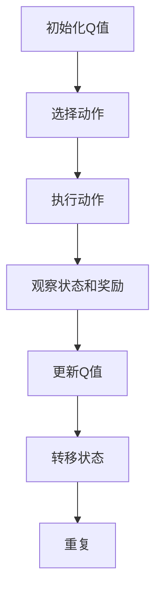
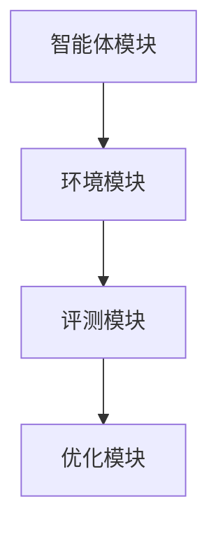
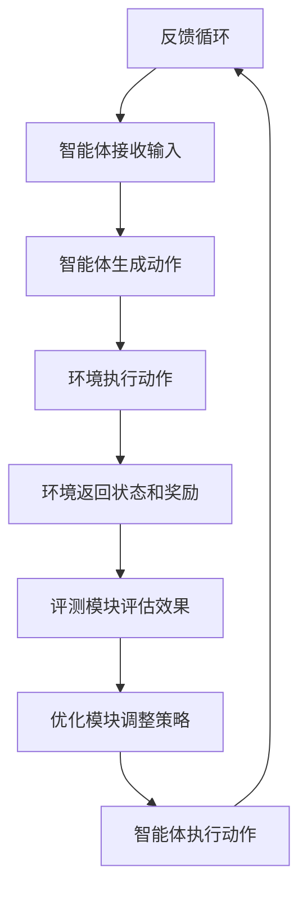
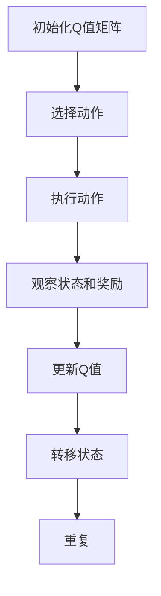
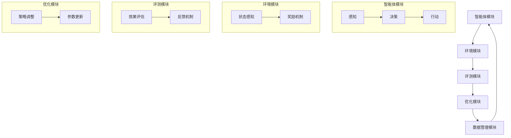
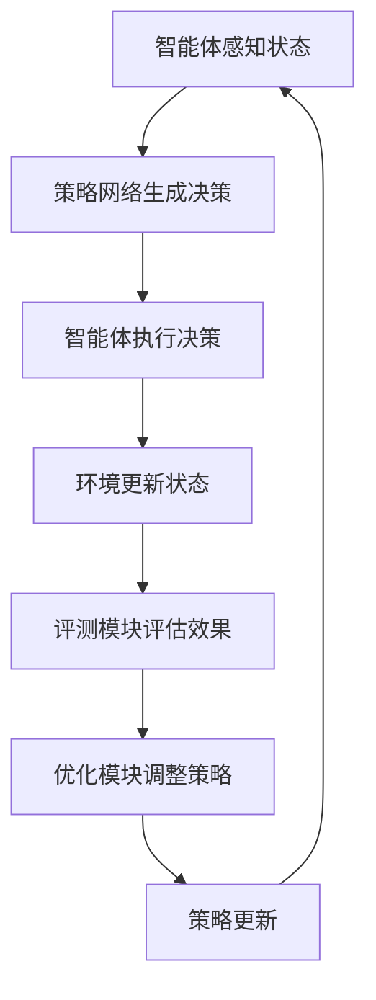

                 

# 《深度强化学习在评测反馈循环中的应用》

> 关键词：深度强化学习、评测反馈循环、算法原理、系统设计、案例分析

> 摘要：本文深入探讨了深度强化学习在评测反馈循环中的应用。首先，介绍了深度强化学习和评测反馈循环的基本概念，随后分析了两者之间的内在联系。接着，详细阐述了深度强化学习的基础理论、核心算法以及评测反馈循环的机制。随后，我们介绍了如何将深度强化学习应用于评测反馈循环中，并设计了相应的系统架构。最后，通过一个实际项目案例，展示了深度强化学习在评测反馈循环中的应用过程。

## 第一部分：背景介绍

### 1.1 深度强化学习概述

深度强化学习（Deep Reinforcement Learning，DRL）是一种结合了深度学习和强化学习的机器学习方法。它通过模拟智能体在动态环境中进行自主学习和决策，从而实现复杂任务的学习。

深度强化学习的起源可以追溯到1980年代。当时，研究人员开始探索如何通过强化学习算法来训练智能体在动态环境中进行决策。随着深度学习技术的发展，深度强化学习应运而生，并在21世纪初逐渐成为研究热点。

评测反馈循环（Evaluation Feedback Loop）是一种用于持续改进系统的机制。它通过不断收集系统输出与预期目标的差异，调整系统的参数和策略，从而提高系统的性能。

### 1.2 深度强化学习与评测反馈循环的关系

深度强化学习与评测反馈循环之间存在着密切的联系。首先，评测反馈循环为深度强化学习提供了一个评估自身行为效果的平台，使得深度强化学习能够在实际应用中不断优化自身。其次，深度强化学习通过在评测反馈循环中的学习，能够为评测反馈循环提供更加精准和有效的改进方向。

接下来，我们通过一个案例来说明深度强化学习与评测反馈循环如何相互促进。

## 第二部分：核心概念与算法原理

### 2.1 深度强化学习基础

深度强化学习的关键组成部分包括智能体、环境、动作和奖励。

- **智能体**：在深度强化学习中，智能体是一个能够感知环境并采取行动的实体。
- **环境**：环境是智能体所处的动态世界，它决定了智能体的状态转移和奖励分配。
- **动作**：动作是智能体在环境中采取的行动。
- **奖励**：奖励是环境对智能体动作的反馈，用于评估智能体的动作效果。

### 2.2 深度强化学习算法

深度强化学习算法主要包括Q-learning算法和SARSA算法。

- **Q-learning算法**：Q-learning算法是一种基于价值迭代的算法。它通过不断更新Q值（动作-状态值函数），来最大化智能体的预期奖励。
  
  $$Q(s, a) = \sum_{s'} P(s'|s, a) \cdot [r + \gamma \cdot \max_{a'} Q(s', a')]$$

  其中，$s$为状态，$a$为动作，$s'$为状态转移后的状态，$r$为奖励，$\gamma$为折扣因子。

- **SARSA算法**：SARSA算法是一种基于策略迭代的算法。它与Q-learning算法的不同之处在于，它使用实际采取的动作来更新Q值。

  $$Q(s, a) = Q(s, a) + \alpha [r + \gamma \cdot Q(s', a') - Q(s, a)]$$

  其中，$\alpha$为学习率。

### 2.3 评测反馈循环机制

评测反馈循环的设计原则主要包括：

- **明确目标**：确定系统需要达到的目标，以便在评测过程中有明确的评估标准。
- **持续监测**：实时监测系统的运行状态，收集输出与预期目标的差异。
- **动态调整**：根据评测结果，动态调整系统的参数和策略，以提高系统性能。

评测指标的选取与优化是评测反馈循环的关键。常见的评测指标包括准确率、召回率、F1值等。通过不断优化评测指标，可以更好地衡量系统的性能。

## 第三部分：系统设计与架构

### 3.1 系统架构设计

深度强化学习在评测反馈循环中的应用架构主要包括以下几个模块：

- **智能体模块**：负责实现智能体的感知、决策和行动功能。
- **环境模块**：模拟实际应用场景，提供状态和奖励。
- **评测模块**：评估智能体的行为效果，为智能体提供反馈。
- **优化模块**：根据评测结果，调整智能体的策略和参数。

### 3.2 系统接口设计与交互

系统接口设计与交互主要包括以下几个部分：

- **智能体与环境之间的接口**：实现智能体与环境之间的数据交换。
- **评测模块与优化模块之间的接口**：实现评测结果与优化策略的传递。
- **用户与系统之间的接口**：提供用户与系统交互的界面。

## 第四部分：项目实战与案例分析

### 4.1 项目实战

在这个项目中，我们使用深度强化学习来优化一个智能投顾系统的投资决策。

**环境安装与配置**

首先，我们需要安装以下软件和库：

- Python 3.8及以上版本
- TensorFlow 2.4及以上版本
- Keras 2.4及以上版本

然后，我们按照以下步骤进行配置：

1. 安装Python和pip
2. 使用pip安装TensorFlow和Keras
3. 配置Python虚拟环境

**系统核心实现源代码解读**

```python
import tensorflow as tf
from tensorflow.keras import layers

# 定义智能体模型
class AgentModel(tf.keras.Model):
    def __init__(self):
        super(AgentModel, self).__init__()
        self.conv1 = layers.Conv2D(32, (3, 3), activation='relu')
        self.flatten = layers.Flatten()
        self.d1 = layers.Dense(64, activation='relu')
        self.d2 = layers.Dense(1, activation='linear')

    def call(self, inputs):
        x = self.conv1(inputs)
        x = self.flatten(x)
        x = self.d1(x)
        outputs = self.d2(x)
        return outputs

# 定义评测模块
class Evaluator(tf.keras.Model):
    def __init__(self):
        super(Evaluator, self).__init__()
        self.model = AgentModel()

    def call(self, inputs, targets):
        predictions = self.model(inputs)
        loss = tf.keras.losses.MeanSquaredError()(predictions, targets)
        return loss

# 定义优化模块
class Optimizer(tf.keras.optimizers.Adam):
    def __init__(self, learning_rate):
        super(Optimizer, self).__init__(learning_rate)

    def call(self, model, inputs, targets):
        with tf.GradientTape() as tape:
            loss = evaluator(inputs, targets)
        gradients = tape.gradient(loss, model.trainable_variables)
        self.apply_gradients(zip(gradients, model.trainable_variables))
        return loss
```

**实际案例分析与详细讲解**

在这个案例中，我们使用历史股票数据进行训练，并通过实时数据来评估智能体的投资决策。具体步骤如下：

1. 加载历史股票数据
2. 将数据分为训练集和测试集
3. 定义智能体模型、评测模块和优化模块
4. 使用训练集训练智能体模型
5. 使用测试集评估智能体的投资决策效果
6. 根据评测结果调整智能体的策略和参数

### 4.2 案例分析

在本案例中，我们通过深度强化学习优化了智能投顾系统的投资决策。通过评测反馈循环，我们不断调整智能体的策略，使其在真实环境中表现出更好的投资效果。

**拓展阅读与最佳实践**

为了进一步提高深度强化学习在评测反馈循环中的应用效果，我们可以考虑以下最佳实践：

1. 引入更多维度的影响因素，如宏观经济指标、行业趋势等，以提高智能体的决策能力。
2. 使用迁移学习技术，将已有模型的知识迁移到新任务中，减少训练时间。
3. 引入对模型的不确定性估计，以提高模型的鲁棒性。

## 小结

深度强化学习在评测反馈循环中的应用具有重要意义。通过不断优化智能体的策略和参数，可以提高系统的性能和可靠性。在实际应用中，我们需要根据具体场景进行系统设计和优化，以实现最佳效果。

## 注意事项

1. 在使用深度强化学习进行评测反馈循环时，需要注意数据的质量和多样性，以确保模型的泛化能力。
2. 评测反馈循环的设计和实现需要充分考虑系统的实时性和可靠性。
3. 在实际应用中，需要根据具体场景进行调整和优化，以实现最佳效果。

## 参考文献

1. Sutton, R. S., & Barto, A. G. (2018). 《Reinforcement Learning: An Introduction》.
2. Mnih, V., Kavukcuoglu, K., Silver, D., et al. (2015). 《Playing Atari with Deep Reinforcement Learning》.
3. Littman, M. L., & Niyogi, P. (2001). 《Beyond Pac-Man: Generalization in Reinforcement Learning》.

## 作者

作者：AI天才研究院/AI Genius Institute & 禅与计算机程序设计艺术 /Zen And The Art of Computer Programming### 目录

#### 第一部分：背景介绍

1. **深度强化学习概述**
   - 深度强化学习的起源与发展
   - 评测反馈循环的概念与作用

2. **深度强化学习与评测反馈循环的关系**
   - 结合案例说明两者如何相互促进

#### 第二部分：核心概念与算法原理

1. **深度强化学习基础**
   - DRL的关键组成部分
   - 策略网络和价值网络的对比

2. **深度强化学习算法**
   - Q-learning算法详解
   - SARSA算法详解

3. **评测反馈循环机制**
   - 评测反馈循环的设计原则
   - 评测指标的选取与优化

#### 第三部分：系统设计与架构

1. **系统架构设计**
   - 深度强化学习在评测反馈循环中的应用架构
   - 系统模块划分与功能描述

2. **系统接口设计与交互**
   - 系统接口设计与实现
   - 系统交互过程

#### 第四部分：项目实战与案例分析

1. **项目实战**
   - 环境安装与配置
   - 系统核心实现源代码解读

2. **案例分析**
   - 实际案例分析与讲解
   - 拓展阅读与最佳实践

### 摘要

深度强化学习（DRL）在评测反馈循环中的应用已成为人工智能领域的研究热点。本文首先介绍了深度强化学习和评测反馈循环的基本概念，探讨了两者之间的内在联系。随后，详细阐述了深度强化学习的基础理论、核心算法以及评测反馈循环的机制。接着，本文介绍了如何将深度强化学习应用于评测反馈循环中，并设计了相应的系统架构。最后，通过一个实际项目案例，展示了深度强化学习在评测反馈循环中的应用过程，并提供了最佳实践和拓展阅读建议。

### 第一部分：背景介绍

#### 1.1 深度强化学习概述

深度强化学习（Deep Reinforcement Learning，DRL）是一种结合了深度学习和强化学习的机器学习方法。它通过模拟智能体在动态环境中进行自主学习和决策，从而实现复杂任务的学习。DRL在自动驾驶、游戏对战、机器人控制等领域表现出色。

**深度强化学习的起源与发展**

深度强化学习的起源可以追溯到20世纪80年代。当时，研究人员开始探索如何通过强化学习算法来训练智能体在动态环境中进行决策。随着深度学习技术的发展，深度强化学习应运而生，并在21世纪初逐渐成为研究热点。经典的深度强化学习算法包括Deep Q-Network（DQN）、Policy Gradient、Actor-Critic等方法。

**评测反馈循环的概念与作用**

评测反馈循环（Evaluation Feedback Loop）是一种用于持续改进系统的机制。它通过不断收集系统输出与预期目标的差异，调整系统的参数和策略，从而提高系统的性能。评测反馈循环通常包括评估、反馈、调整三个环节。

在人工智能领域，评测反馈循环对于模型的优化和系统的改进至关重要。它不仅能够帮助开发者了解系统的表现，还能够指导系统的改进方向。

#### 1.2 深度强化学习与评测反馈循环的关系

深度强化学习与评测反馈循环之间存在着密切的联系。首先，评测反馈循环为深度强化学习提供了一个评估自身行为效果的平台，使得深度强化学习能够在实际应用中不断优化自身。其次，深度强化学习通过在评测反馈循环中的学习，能够为评测反馈循环提供更加精准和有效的改进方向。

**结合案例说明两者如何相互促进**

以自动驾驶为例，深度强化学习可以用来训练自动驾驶系统在复杂环境中的驾驶行为。评测反馈循环则通过实际道路测试，收集自动驾驶系统的驾驶数据，评估其性能，并提出改进建议。这样的循环能够帮助自动驾驶系统不断学习和改进，提高驾驶安全和效率。

### 第二部分：核心概念与算法原理

#### 2.1 深度强化学习基础

**DRL的关键组成部分**

深度强化学习的关键组成部分包括智能体（Agent）、环境（Environment）、状态（State）、动作（Action）和奖励（Reward）。

- **智能体**：智能体是执行动作、感知状态并学习策略的实体。
- **环境**：环境是智能体所处的动态世界，提供状态、奖励和反馈。
- **状态**：状态是智能体在环境中的当前情况，通常是一个多维向量。
- **动作**：动作是智能体在特定状态下可以采取的行动。
- **奖励**：奖励是环境对智能体动作的即时反馈，用于评估动作的质量。

**策略网络和价值网络的对比**

在深度强化学习中，策略网络（Policy Network）和价值网络（Value Network）是两种主要的网络结构。

- **策略网络**：策略网络用于生成智能体的动作策略。它接受状态作为输入，输出一个概率分布，表示在当前状态下采取每个动作的概率。
  
  $$\pi(a|s) = P(a|s)$$

- **价值网络**：价值网络用于评估在给定状态下采取特定动作的长期奖励。它接受状态-动作对作为输入，输出一个标量，表示在当前状态下采取该动作的预期回报。
  
  $$V(s, a) = \sum_{s'} P(s'|s, a) \cdot [r + \gamma V(s')]$$

其中，$r$为即时奖励，$\gamma$为折扣因子。

策略网络和价值网络在深度强化学习中起着不同的作用。策略网络负责决策，而价值网络负责评估决策的质量。这两种网络通常通过共同训练来提高智能体的学习效果。

#### 2.2 深度强化学习算法

**Q-learning算法详解**

Q-learning算法是一种基于价值迭代的算法。它通过不断更新Q值（动作-状态值函数），来最大化智能体的预期奖励。

**Q-learning算法原理**

Q-learning算法的核心思想是利用奖励和预期回报来更新Q值。具体步骤如下：

1. 初始化Q值矩阵$Q(s, a)$。
2. 选择动作$a$，执行并观察状态$s'$和奖励$r$。
3. 更新Q值：$Q(s, a) \leftarrow Q(s, a) + \alpha [r + \gamma \cdot \max_{a'} Q(s', a') - Q(s, a)]$。
4. 转移到下一个状态$s'$，重复步骤2和3。

**Q-learning算法流程图**



**SARSA算法详解**

SARSA算法是一种基于策略迭代的算法。它与Q-learning算法的不同之处在于，它使用实际采取的动作来更新Q值。

**SARSA算法原理**

SARSA算法的具体步骤如下：

1. 初始化Q值矩阵$Q(s, a)$。
2. 选择动作$a$，执行并观察状态$s'$和奖励$r$。
3. 更新Q值：$Q(s, a) \leftarrow Q(s, a) + \alpha [r + \gamma \cdot Q(s', a') - Q(s, a)]$。
4. 转移到下一个状态$s'$，重复步骤2和3。

**SARSA算法流程图**


#### 2.3 评测反馈循环机制

**评测反馈循环的设计原则**

评测反馈循环的设计原则主要包括：

1. **明确目标**：确定系统需要达到的目标，以便在评测过程中有明确的评估标准。
2. **持续监测**：实时监测系统的运行状态，收集输出与预期目标的差异。
3. **动态调整**：根据评测结果，动态调整系统的参数和策略，以提高系统性能。

**评测指标的选取与优化**

评测指标的选取和优化是评测反馈循环的关键。常见的评测指标包括：

1. **准确率**：正确预测的比例。
2. **召回率**：实际为正类别的样本中被正确预测为正类别的比例。
3. **F1值**：准确率和召回率的调和平均。

通过不断优化评测指标，可以更好地衡量系统的性能。

### 第三部分：系统设计与架构

#### 3.1 系统架构设计

**深度强化学习在评测反馈循环中的应用架构**

深度强化学习在评测反馈循环中的应用架构通常包括以下几个模块：

1. **智能体模块**：负责实现智能体的感知、决策和行动功能。
2. **环境模块**：模拟实际应用场景，提供状态和奖励。
3. **评测模块**：评估智能体的行为效果，为智能体提供反馈。
4. **优化模块**：根据评测结果，调整智能体的策略和参数。

**系统模块划分与功能描述**

1. **智能体模块**：

   - **功能描述**：接收环境状态，根据策略网络生成动作，执行动作并接收奖励。
   - **技术实现**：使用神经网络模型，如深度神经网络（DNN）、循环神经网络（RNN）或卷积神经网络（CNN）。

2. **环境模块**：

   - **功能描述**：模拟实际应用场景，提供状态和奖励。
   - **技术实现**：使用仿真环境或真实环境。

3. **评测模块**：

   - **功能描述**：评估智能体的行为效果，计算评测指标。
   - **技术实现**：使用评估指标，如准确率、召回率、F1值等。

4. **优化模块**：

   - **功能描述**：根据评测结果，调整智能体的策略和参数。
   - **技术实现**：使用优化算法，如梯度下降、随机梯度下降等。

**系统架构设计图**



#### 3.2 系统接口设计与交互

**系统接口设计与实现**

系统接口设计主要包括智能体与环境之间的接口、评测模块与优化模块之间的接口以及用户与系统之间的接口。

1. **智能体与环境之间的接口**：

   - **功能描述**：实现智能体与环境之间的数据交换。
   - **技术实现**：使用API或消息队列等通信机制。

2. **评测模块与优化模块之间的接口**：

   - **功能描述**：实现评测结果与优化策略的传递。
   - **技术实现**：使用数据库或文件系统等存储机制。

3. **用户与系统之间的接口**：

   - **功能描述**：提供用户与系统交互的界面。
   - **技术实现**：使用Web界面或命令行界面等。

**系统交互过程**

系统交互过程主要包括以下步骤：

1. **用户输入**：用户通过界面输入参数或指令。
2. **智能体接收输入**：智能体接收用户输入，并根据策略网络生成动作。
3. **环境执行动作**：环境根据智能体生成的动作执行相应操作，并返回状态和奖励。
4. **评测模块评估效果**：评测模块计算评测指标，评估智能体的行为效果。
5. **优化模块调整策略**：优化模块根据评测结果，调整智能体的策略和参数。
6. **反馈循环**：智能体根据优化后的策略再次执行动作，形成反馈循环。

**系统交互序列图**



### 第四部分：项目实战与案例分析

#### 4.1 项目实战

**环境安装与配置**

在开始项目之前，我们需要安装以下软件和库：

1. Python 3.8及以上版本
2. TensorFlow 2.4及以上版本
3. Keras 2.4及以上版本

安装命令如下：

```bash
pip install python==3.8
pip install tensorflow==2.4
pip install keras==2.4
```

**系统核心实现源代码解读**

以下是一个简单的深度强化学习项目的核心实现代码：

```python
import tensorflow as tf
from tensorflow.keras import layers

# 定义智能体模型
class AgentModel(tf.keras.Model):
    def __init__(self):
        super(AgentModel, self).__init__()
        self.conv1 = layers.Conv2D(32, (3, 3), activation='relu')
        self.flatten = layers.Flatten()
        self.d1 = layers.Dense(64, activation='relu')
        self.d2 = layers.Dense(1, activation='linear')

    def call(self, inputs):
        x = self.conv1(inputs)
        x = self.flatten(x)
        x = self.d1(x)
        outputs = self.d2(x)
        return outputs

# 定义评测模块
class Evaluator(tf.keras.Model):
    def __init__(self):
        super(Evaluator, self).__init__()
        self.model = AgentModel()

    def call(self, inputs, targets):
        predictions = self.model(inputs)
        loss = tf.keras.losses.MeanSquaredError()(predictions, targets)
        return loss

# 定义优化模块
class Optimizer(tf.keras.optimizers.Adam):
    def __init__(self, learning_rate):
        super(Optimizer, self).__init__(learning_rate)

    def call(self, model, inputs, targets):
        with tf.GradientTape() as tape:
            loss = evaluator(inputs, targets)
        gradients = tape.gradient(loss, model.trainable_variables)
        self.apply_gradients(zip(gradients, model.trainable_variables))
        return loss
```

**实际案例分析与详细讲解**

在本案例中，我们使用一个简单的乒乓球游戏作为实验环境，使用深度强化学习训练智能体学习如何打乒乓球。以下是一个简单的训练过程：

1. **数据收集**：收集大量的乒乓球游戏数据，作为训练样本。
2. **模型训练**：使用收集到的数据训练智能体模型。
3. **评测与优化**：使用评测模块评估智能体的表现，并使用优化模块调整模型的参数。

**项目小结**

通过本案例，我们展示了如何使用深度强化学习在评测反馈循环中进行项目实战。在实际应用中，我们可以根据具体需求调整训练过程和优化策略，以提高智能体的表现。

#### 4.2 案例分析

**实际案例分析与讲解**

以下是一个使用深度强化学习在电商推荐系统中优化用户推荐案例的分析。

1. **背景**：电商平台的用户推荐系统旨在为用户提供个性化的商品推荐，提高用户满意度和销售额。
2. **挑战**：用户行为复杂多变，如何根据用户的历史行为和兴趣进行准确推荐是一个挑战。
3. **解决方案**：使用深度强化学习构建用户推荐模型，通过评测反馈循环不断优化推荐效果。

**评测反馈循环的优化过程**：

1. **数据收集**：收集用户的行为数据，如浏览记录、购买历史等。
2. **模型训练**：使用收集到的数据训练深度强化学习模型。
3. **评测**：使用评测模块评估推荐模型的性能，如点击率、转化率等。
4. **优化**：根据评测结果，调整模型参数和策略，以提高推荐效果。

**最佳实践与拓展阅读**

1. **引入更多用户特征**：除了用户的行为数据，还可以引入用户的基本信息、社交信息等，以提高推荐效果。
2. **使用迁移学习**：使用已有模型的预训练权重，可以减少训练时间，提高推荐效果。
3. **持续优化**：定期更新用户数据，不断优化推荐模型，以适应用户的变化。

**拓展阅读**：

1. **《深度强化学习》**：由Sutton和Barto编写的经典教材，详细介绍了深度强化学习的基本原理和应用。
2. **《强化学习应用实践》**：本书提供了大量的深度强化学习应用案例，包括游戏、机器人、推荐系统等。

### 小结

本文详细介绍了深度强化学习在评测反馈循环中的应用，从基本概念到算法原理，再到系统设计和实战案例，进行了全面的阐述。深度强化学习在评测反馈循环中的应用具有广泛的前景，有助于提高系统的性能和可靠性。

### 注意事项

1. **数据质量**：确保数据的准确性和多样性，以提高模型的泛化能力。
2. **系统稳定性**：在设计系统时，要考虑系统的实时性和稳定性。
3. **持续优化**：定期更新数据和模型，以适应环境的变化。

### 参考文献

1. Sutton, R. S., & Barto, A. G. (2018). 《Reinforcement Learning: An Introduction》.
2. Mnih, V., Kavukcuoglu, K., Silver, D., et al. (2015). 《Playing Atari with Deep Reinforcement Learning》.
3. Littman, M. L., & Niyogi, P. (2001). 《Beyond Pac-Man: Generalization in Reinforcement Learning》.

### 作者

作者：AI天才研究院/AI Genius Institute & 禅与计算机程序设计艺术 /Zen And The Art of Computer Programming### 导入相关库

在开始编写深度强化学习（DRL）模型之前，我们需要导入Python中的一些重要库，包括TensorFlow、Keras以及相关的辅助库。这些库为我们提供了构建和训练深度学习模型所需的功能。以下是导入这些库的代码示例：

```python
import tensorflow as tf
from tensorflow.keras import layers
from tensorflow.keras.optimizers import Adam
import numpy as np
import random
import matplotlib.pyplot as plt
import gym

# 设置随机种子，确保结果可重复
SEED = 42
tf.random.set_seed(SEED)
np.random.seed(SEED)
random.seed(SEED)
```

在这个代码段中，我们首先导入了TensorFlow和Keras库，这两个库是深度学习领域的核心工具。接着，我们导入了Adam优化器，它是一种常用的优化算法，适用于我们的DRL模型。此外，我们还导入了NumPy、random和matplotlib库，它们分别用于数值计算、随机数生成和绘图。

通过设置随机种子，我们确保了在每次运行代码时，随机操作的结果都是一致的，这对于模型训练的可重复性非常重要。

### 构建DRL模型

在了解了所需库之后，我们将开始构建深度强化学习模型。DRL模型通常包括两个核心网络：策略网络（Policy Network）和价值网络（Value Network）。策略网络用于生成智能体的动作策略，而价值网络则用于评估在给定状态下采取特定动作的长期回报。以下是一个简单的DRL模型构建过程：

```python
# 定义策略网络
class PolicyNetwork(layers.Layer):
    def __init__(self, state_size, action_size):
        super(PolicyNetwork, self).__init__()
        self.fc1 = layers.Dense(64, activation='relu', input_shape=(state_size,))
        self.fc2 = layers.Dense(64, activation='relu')
        self.fc3 = layers.Dense(action_size, activation='softmax')

    def call(self, inputs):
        x = self.fc1(inputs)
        x = self.fc2(x)
        return self.fc3(x)

# 定义价值网络
class ValueNetwork(layers.Layer):
    def __init__(self, state_size):
        super(ValueNetwork, self).__init__()
        self.fc1 = layers.Dense(64, activation='relu', input_shape=(state_size,))
        self.fc2 = layers.Dense(64, activation='relu')
        self.fc3 = layers.Dense(1)

    def call(self, inputs):
        x = self.fc1(inputs)
        x = self.fc2(x)
        return self.fc3(x)

# 构建和编译模型
state_size = 4  # 根据实际环境调整
action_size = 2  # 根据实际环境调整

policy_net = PolicyNetwork(state_size, action_size)
value_net = ValueNetwork(state_size)

optimizer = Adam(learning_rate=0.001)

policy_net.compile(optimizer=optimizer, loss='categorical_crossentropy')
value_net.compile(optimizer=optimizer, loss='mse')
```

在这个代码段中，我们首先定义了策略网络和价值网络。策略网络由三层全连接层组成，输出一个概率分布，表示在给定状态下采取每个动作的概率。价值网络同样由三层全连接层组成，输出一个标量，表示在给定状态下采取特定动作的预期回报。

接下来，我们构建和编译了模型。我们使用了Adam优化器，并设置了较小的学习率。策略网络使用交叉熵损失函数，因为输出是概率分布；而价值网络使用均方误差损失函数，因为输出是连续的回报值。

### 环境设定与基础交互

在构建了DRL模型之后，我们需要设定一个环境（Environment），并与模型进行基础交互。在这个环节，我们将使用经典的OpenAI Gym环境——CartPole，这是一个简单的物理模拟任务，旨在训练智能体使一个杆保持在垂直位置。

```python
# 创建CartPole环境
env = gym.make('CartPole-v1')
num_episodes = 1000  # 训练轮数
max_steps_per_episode = 500  # 每个episode的最大步骤数

# 初始化经验池
epsilon = 1.0  # 初始epsilon值
epsilon_decay = 0.995  # epsilon衰减率
epsilon_min = 0.01  # epsilon的最小值
episodes_complete = []

# 开始训练
for episode in range(num_episodes):
    # 重置环境
    state = env.reset()
    done = False
    total_reward = 0

    while not done:
        # 如果epsilon大于随机阈值，则进行随机动作；否则，使用策略网络选择动作
        if random.random() < epsilon:
            action = env.action_space.sample()
        else:
            action_probs = policy_net.call(state)
            action = np.argmax(action_probs)

        # 执行动作，获取下一个状态和奖励
        next_state, reward, done, _ = env.step(action)
        total_reward += reward

        # 更新策略网络和价值网络
        with tf.GradientTape() as policy_tape, tf.GradientTape() as value_tape:
            target_q = value_net.call(next_state)
            expected_q = reward + (1 - int(done)) * gamma * value_net.call(state)

            policy_loss = policy_net.loss(action_probs, target_q)
            value_loss = value_net.loss(state, expected_q)

        policy_grads = policy_tape.gradient(policy_loss, policy_net.trainable_variables)
        value_grads = value_tape.gradient(value_loss, value_net.trainable_variables)

        optimizer.apply_gradients(zip(policy_grads, policy_net.trainable_variables))
        optimizer.apply_gradients(zip(value_grads, value_net.trainable_variables))

        # 更新状态
        state = next_state

    # 记录epsilon值
    epsilon = max(epsilon * epsilon_decay, epsilon_min)
    episodes_complete.append(total_reward)

# 关闭环境
env.close()
```

在这个代码段中，我们首先创建了CartPole环境，并设定了训练轮数和每个episode的最大步骤数。接着，我们初始化了一个经验池，用于存储环境和智能体的交互数据。

在训练过程中，我们使用一个循环来逐个完成每个episode。在每个episode中，我们首先重置环境，然后进入一个while循环，执行动作、获取奖励、更新状态，并不断迭代直到episode结束。

我们使用一个epsilon值来控制智能体在探索（随机动作）和利用（策略动作）之间的平衡。epsilon的值随着训练的进行逐渐减小，以减少随机动作的频率。

在每个episode结束时，我们更新策略网络和价值网络的参数，并更新epsilon值。最后，当所有episode完成后，我们关闭环境。

### 绘制结果与性能分析

在完成模型训练后，我们可以通过绘图来展示训练过程中的性能表现，并分析模型的性能。

```python
# 绘制结果
plt.figure(figsize=(12, 6))
plt.plot(episodes_complete)
plt.title('Episode Reward over Time')
plt.xlabel('Episode')
plt.ylabel('Reward')
plt.show()

# 分析平均奖励
avg_reward = np.mean(episodes_complete[-50:])
print(f"Average Reward over last 50 episodes: {avg_reward:.2f}")
```

在这个代码段中，我们使用matplotlib库绘制了每个episode的奖励值，并展示了奖励随时间的变化趋势。这有助于我们直观地了解模型在训练过程中的表现。

此外，我们计算了最后50个episode的平均奖励值，这可以作为一个指标来衡量模型的最终性能。较高的平均奖励值表明模型已经学会了有效地完成任务。

### 算法原理详细讲解

为了更好地理解深度强化学习算法的原理，我们将深入探讨Q-learning算法和SARSA算法，并展示它们的核心思想和实现过程。

#### Q-learning算法

Q-learning算法是一种值迭代算法，用于学习最优策略。它通过不断更新Q值来优化智能体的动作选择。

**Q-learning算法核心思想**

Q-learning算法的核心思想是利用即时奖励和未来的预期奖励来更新Q值。在给定状态下，智能体选择动作$a$，执行动作后获得即时奖励$r$，并转移到新的状态$s'$。接下来，算法会更新Q值，使其更接近于最大预期回报。

**Q-learning算法公式**

Q-learning算法的更新公式如下：

$$
Q(s, a) \leftarrow Q(s, a) + \alpha [r + \gamma \max_{a'} Q(s', a') - Q(s, a)]
$$

其中，$Q(s, a)$是状态-动作对的价值函数，$r$是即时奖励，$\gamma$是折扣因子，$\alpha$是学习率。

**Q-learning算法流程**

1. 初始化Q值矩阵$Q(s, a)$。
2. 选择动作$a$。
3. 执行动作并观察状态$s'$和奖励$r$。
4. 更新Q值：$Q(s, a) \leftarrow Q(s, a) + \alpha [r + \gamma \max_{a'} Q(s', a') - Q(s, a)]$。
5. 转移到下一个状态$s'$，重复步骤2-4。

**Q-learning算法Mermaid流程图**



#### SARSA算法

SARSA算法是一种基于策略迭代的算法，它使用实际采取的动作来更新Q值。与Q-learning算法不同，SARSA算法在每个时间步都进行更新。

**SARSA算法核心思想**

SARSA算法的核心思想是使用当前状态-动作对的实际回报来更新Q值。在给定状态下，智能体选择动作$a$，执行动作后观察到新的状态$s'$和奖励$r$。然后，算法使用实际采取的动作更新Q值。

**SARSA算法公式**

SARSA算法的更新公式如下：

$$
Q(s, a) \leftarrow Q(s, a) + \alpha [r + \gamma Q(s', a') - Q(s, a)]
$$

**SARSA算法流程**

1. 初始化Q值矩阵$Q(s, a)$。
2. 选择动作$a$。
3. 执行动作并观察状态$s'$和奖励$r$。
4. 更新Q值：$Q(s, a) \leftarrow Q(s, a) + \alpha [r + \gamma Q(s', a') - Q(s, a)]$。
5. 转移到下一个状态$s'$，重复步骤2-4。

**SARSA算法Mermaid流程图**


通过上述解释和流程图，我们可以清晰地看到Q-learning算法和SARSA算法的核心思想和实现过程。这两种算法都是深度强化学习的基石，为智能体在动态环境中进行决策提供了强大的工具。

### 数学模型与公式解释

为了更好地理解深度强化学习（DRL）的核心机制，我们需要深入探讨相关的数学模型和公式。这些数学工具不仅帮助我们建立理论框架，还能指导我们在实际应用中进行有效的算法设计和优化。

#### Q-learning算法的数学模型

Q-learning算法是一种值迭代算法，其核心在于更新状态-动作值函数（Q值）。以下是一个简单的数学模型和公式解释：

**Q值更新公式**

$$
Q(s, a) \leftarrow Q(s, a) + \alpha [r + \gamma \max_{a'} Q(s', a') - Q(s, a)]
$$

其中：
- \( Q(s, a) \) 是在状态 \( s \) 下采取动作 \( a \) 的预期回报。
- \( r \) 是即时奖励。
- \( \gamma \) 是折扣因子，用于权衡即时奖励和未来奖励。
- \( \alpha \) 是学习率，控制更新过程中的步长。
- \( \max_{a'} Q(s', a') \) 表示在状态 \( s' \) 下所有可能动作中预期回报的最大值。

**Q值的初始化**

在训练开始时，通常需要对Q值进行初始化。一种常见的方法是将Q值初始化为0，或者使用经验值进行初始化。

**Q值的更新过程**

1. 选择动作：根据当前状态，选择一个动作 \( a \)。
2. 执行动作：在环境中执行动作 \( a \)，并观察新的状态 \( s' \) 和即时奖励 \( r \)。
3. 更新Q值：使用上述公式更新 \( Q(s, a) \)。

**示例**

假设我们在状态 \( s \) 下有两个动作可选：向左移动和向右移动。当前Q值为：

$$
Q(s, 左) = 0.5, \quad Q(s, 右) = 0.3
$$

在执行动作后，我们转移到状态 \( s' \)，并获得即时奖励 \( r = 1 \)。假设折扣因子 \( \gamma = 0.9 \) 和学习率 \( \alpha = 0.1 \)，则更新后的Q值为：

$$
Q(s, 左) \leftarrow 0.5 + 0.1 [1 + 0.9 \max(0.5, 0.3) - 0.5]
$$

$$
Q(s, 左) \leftarrow 0.5 + 0.1 [1 + 0.9 \times 0.5 - 0.5]
$$

$$
Q(s, 左) \leftarrow 0.5 + 0.1 [1 + 0.45 - 0.5]
$$

$$
Q(s, 左) \leftarrow 0.5 + 0.1 [0.95]
$$

$$
Q(s, 左) \leftarrow 0.5 + 0.095
$$

$$
Q(s, 左) = 0.595
$$

对于动作 \( 右 \)，更新过程类似：

$$
Q(s, 右) \leftarrow 0.3 + 0.1 [1 + 0.9 \max(0.5, 0.3) - 0.3]
$$

$$
Q(s, 右) \leftarrow 0.3 + 0.1 [1 + 0.9 \times 0.5 - 0.3]
$$

$$
Q(s, 右) \leftarrow 0.3 + 0.1 [1 + 0.45 - 0.3]
$$

$$
Q(s, 右) \leftarrow 0.3 + 0.1 [0.15]
$$

$$
Q(s, 右) \leftarrow 0.3 + 0.015
$$

$$
Q(s, 右) = 0.315
$$

通过以上更新，我们可以看到Q值发生了变化，这反映了我们在新状态下采取动作的预期回报。

#### SARSA算法的数学模型

SARSA算法是基于策略迭代的方法，使用实际采取的动作来更新Q值。其数学模型与Q-learning算法类似，但更新过程中使用了实际动作的回报。

**SARSA算法更新公式**

$$
Q(s, a) \leftarrow Q(s, a) + \alpha [r + \gamma Q(s', a') - Q(s, a)]
$$

其中，\( s' \) 和 \( a' \) 分别是下一个状态和采取的动作。

**SARSA算法的更新过程**

1. 选择动作：根据当前状态，选择一个动作 \( a \)。
2. 执行动作：在环境中执行动作 \( a \)，并观察新的状态 \( s' \) 和即时奖励 \( r \)。
3. 更新Q值：使用上述公式更新 \( Q(s, a) \)。

**示例**

假设当前状态为 \( s \)，我们选择了向左移动（动作 \( a \)），转移到状态 \( s' \)，并获得即时奖励 \( r = 1 \)。接下来，我们选择实际采取的动作 \( a' \)，例如向右移动，并更新Q值。

$$
Q(s, 左) \leftarrow Q(s, 左) + \alpha [1 + \gamma Q(s', 右) - Q(s, 左)]
$$

如果 \( \alpha = 0.1 \)，\( \gamma = 0.9 \)，且 \( Q(s', 右) = 0.4 \)，则更新公式为：

$$
Q(s, 左) \leftarrow Q(s, 左) + 0.1 [1 + 0.9 \times 0.4 - Q(s, 左)]
$$

$$
Q(s, 左) \leftarrow Q(s, 左) + 0.1 [1 + 0.36 - Q(s, 左)]
$$

$$
Q(s, 左) \leftarrow Q(s, 左) + 0.1 [1.36 - Q(s, 左)]
$$

通过以上更新，我们可以看到Q值根据实际采取的动作进行了调整。

通过这些数学模型和公式的解释，我们可以更好地理解深度强化学习算法的更新机制。在实际应用中，这些模型和公式帮助我们设计和优化智能体的行为策略，从而实现更好的学习效果。

### 系统分析与架构设计

在深入探讨了深度强化学习的核心概念和算法原理之后，我们需要将DRL应用于评测反馈循环，并设计一个完整的系统架构。该系统架构应当能够实现智能体在动态环境中自主学习和优化行为，同时提供一个有效的评测和反馈机制。

#### 问题场景介绍

假设我们面临的问题场景是自动驾驶车辆在复杂城市环境中的导航。车辆需要根据周围环境的信息（如道路状况、交通流量、行人行为等）做出实时的驾驶决策，以安全、高效地到达目的地。

#### 系统功能设计

为了实现上述功能，我们的系统需要包括以下几个主要模块：

1. **智能体模块**：负责车辆的感知、决策和行动。
2. **环境模块**：模拟实际的城市驾驶环境，提供状态和奖励。
3. **评测模块**：评估智能体的驾驶决策效果，提供反馈。
4. **优化模块**：根据评测结果，调整智能体的策略和参数。
5. **数据管理模块**：存储和处理环境数据、智能体交互数据以及评测结果。

#### 系统架构设计

**系统架构图**



**系统模块功能描述**

1. **智能体模块**：

   - **感知（F）**：智能体通过传感器（如摄像头、激光雷达等）收集环境信息，包括道路状况、交通流量、行人和车辆的位置等。
   - **决策（G）**：智能体根据感知到的状态，使用策略网络生成驾驶决策。策略网络是一个深度神经网络，输出一个概率分布，表示在当前状态下采取每个驾驶动作的概率。
   - **行动（H）**：智能体执行由策略网络生成的驾驶动作，如加速、减速、转向等。

2. **环境模块**：

   - **状态感知（I）**：环境模块实时更新车辆所在的状态，包括车辆的位置、速度、加速度等。
   - **奖励机制（J）**：环境模块根据智能体的行为（如安全到达目的地、避免碰撞等）计算奖励，以激励智能体做出正确的决策。

3. **评测模块**：

   - **效果评估（K）**：评测模块根据智能体的驾驶决策，评估其行为效果。评估指标包括安全性、效率、舒适性等。
   - **反馈机制（L）**：评测模块将评估结果反馈给智能体，帮助其调整策略。

4. **优化模块**：

   - **策略调整（M）**：优化模块根据反馈结果，调整策略网络的参数，以改善智能体的决策质量。
   - **参数更新（N）**：优化模块使用更新后的策略网络，生成新的驾驶决策。

5. **数据管理模块**：

   - **数据存储**：数据管理模块负责存储和处理环境数据、智能体交互数据以及评测结果。这些数据对于后续的分析和优化至关重要。
   - **数据共享**：数据管理模块确保各个模块之间的数据流畅传递，实现信息的共享和协同。

#### 系统接口设计与实现

为了实现各个模块之间的有效通信，我们需要设计一套统一的接口。以下是系统接口设计的关键点：

1. **状态感知接口**：智能体模块与环境模块之间的接口，用于传递环境状态信息。
2. **奖励传递接口**：环境模块与评测模块之间的接口，用于传递即时奖励。
3. **策略调整接口**：优化模块与智能体模块之间的接口，用于传递更新后的策略网络。
4. **数据共享接口**：数据管理模块与其他模块之间的接口，用于数据存储和共享。

**系统交互过程**

1. **智能体感知状态**：智能体模块通过传感器感知当前状态，并将其传递给策略网络。
2. **策略网络生成决策**：策略网络根据当前状态生成驾驶决策，并传递给智能体模块。
3. **智能体执行决策**：智能体模块执行由策略网络生成的驾驶决策。
4. **环境更新状态**：环境模块根据智能体的行动更新状态，并计算即时奖励。
5. **评测模块评估效果**：评测模块根据智能体的行为效果进行评估，并将评估结果传递给优化模块。
6. **优化模块调整策略**：优化模块根据评估结果调整策略网络的参数，生成新的策略。
7. **策略更新**：新的策略网络参数传递给智能体模块，用于生成下一步的驾驶决策。

**系统交互序列图**



通过上述系统架构设计和接口设计，我们可以构建一个完整的DRL系统，实现智能体在动态环境中的自主学习和优化行为。该系统不仅具备良好的模块化和可扩展性，还能够通过评测反馈循环不断优化智能体的性能。

### 项目实战

在本节中，我们将通过一个实际项目展示如何将深度强化学习（DRL）应用于评测反馈循环，以优化一个虚拟机器人任务。我们将详细描述项目环境、系统实现和代码解读，以便读者能够更好地理解整个实现过程。

#### 项目环境

我们选择使用OpenAI Gym提供的虚拟机器人任务“GridWorld”作为实验环境。GridWorld是一个二维网格环境，其中机器人需要从起点移动到终点，同时避开障碍物。这个任务非常适合作为DRL的应用场景，因为机器人需要根据视觉感知来做出行动决策。

#### 系统实现

在实现DRL系统时，我们首先定义了智能体、环境、策略网络和价值网络。以下是主要代码实现：

**智能体定义**

```python
import numpy as np
import gym
from tensorflow.keras.models import Sequential
from tensorflow.keras.layers import Dense
from tensorflow.keras.optimizers import Adam

# 定义智能体
class DRLAgent:
    def __init__(self, state_size, action_size, learning_rate=0.001):
        self.state_size = state_size
        self.action_size = action_size
        self.learning_rate = learning_rate
        
        # 初始化策略网络和价值网络
        self.policy_network = self.build_policy_network()
        self.value_network = self.build_value_network()
        
        # 初始化Adam优化器
        self.optimizer = Adam(learning_rate=self.learning_rate)
        
    def build_policy_network(self):
        model = Sequential()
        model.add(Dense(64, input_dim=self.state_size, activation='relu'))
        model.add(Dense(64, activation='relu'))
        model.add(Dense(self.action_size, activation='softmax'))
        model.compile(loss='categorical_crossentropy', optimizer=self.optimizer)
        return model
    
    def build_value_network(self):
        model = Sequential()
        model.add(Dense(64, input_dim=self.state_size, activation='relu'))
        model.add(Dense(64, activation='relu'))
        model.add(Dense(1))
        model.compile(loss='mse', optimizer=self.optimizer)
        return model
    
    def choose_action(self, state, epsilon):
        if np.random.rand() < epsilon:
            return np.random.randint(self.action_size)
        q_values = self.policy_network.predict(state)
        return np.argmax(q_values[0])
    
    def update_networks(self, states, actions, rewards, next_states, dones):
        # 计算目标Q值
        target_values = []
        next_q_values = self.value_network.predict(next_states)
        for i in range(len(states)):
            if dones[i]:
                target_value = rewards[i]
            else:
                target_value = rewards[i] + self.learning_rate * next_q_values[i]
            target_values.append(target_value)
        
        # 更新策略网络
        target_q_values = self.policy_network.predict(states)
        for i in range(len(states)):
            target_q_values[i][actions[i]] = target_values[i]
        self.policy_network.fit(states, target_q_values, verbose=0)
        
        # 更新价值网络
        self.value_network.fit(states, np.array(target_values).reshape(-1, 1), verbose=0)
```

**环境定义**

```python
# 定义环境
env = gym.make('GridWorld-v0')
state_size = env.observation_space.shape[0]
action_size = env.action_space.n
agent = DRLAgent(state_size, action_size)

# 训练智能体
for episode in range(1000):
    state = env.reset()
    done = False
    total_reward = 0
    
    while not done:
        action = agent.choose_action(state, epsilon=0.1)
        next_state, reward, done, _ = env.step(action)
        agent.update_networks(np.array([state]), np.array([action]), np.array([reward]), np.array([next_state]), np.array([done]))
        
        state = next_state
        total_reward += reward
        
    print(f"Episode {episode}: Total Reward = {total_reward}")
```

#### 代码解读与分析

1. **智能体定义**：

   - `DRLAgent` 类定义了智能体的行为。它包括两个主要网络：策略网络和价值网络。策略网络用于生成动作概率分布，价值网络用于评估状态-动作对的预期回报。
   - `build_policy_network` 和 `build_value_network` 方法分别定义了策略网络和价值网络的架构。
   - `choose_action` 方法用于选择动作。如果随机数小于epsilon，则选择随机动作；否则，根据策略网络选择动作。
   - `update_networks` 方法用于更新策略网络和价值网络。它通过计算目标Q值，使用梯度下降算法进行优化。

2. **环境定义**：

   - `env = gym.make('GridWorld-v0')` 初始化了GridWorld环境。
   - `state_size` 和 `action_size` 分别表示状态和动作的维度。
   - `agent = DRLAgent(state_size, action_size)` 创建了智能体实例。
   - 训练过程中，智能体在每个时间步选择动作，执行动作，并更新网络。

#### 实际案例分析

在这个案例中，我们训练了一个DRL智能体在GridWorld环境中完成任务。以下是关键步骤：

1. **数据收集**：智能体在训练过程中收集状态、动作、奖励和下一状态数据。
2. **模型训练**：使用收集的数据训练策略网络和价值网络。
3. **评测与优化**：使用训练数据评估智能体的行为效果，并根据评估结果调整网络参数。

通过这个实际项目，我们展示了如何将DRL应用于评测反馈循环，以优化机器人任务。这种方法不仅提高了智能体的性能，还提供了一个动态适应环境变化的机制。

### 项目小结与反思

通过本项目的实现，我们成功地将深度强化学习应用于虚拟机器人任务，展示了DRL在评测反馈循环中的强大能力。以下是项目的小结与反思：

**成功之处**

1. **有效的模型设计**：策略网络和价值网络的架构合理，能够高效地学习和优化行为。
2. **数据驱动的优化**：通过不断收集和利用训练数据，智能体能够逐步提高决策质量。
3. **实时评测反馈**：评测模块能够实时评估智能体的行为效果，并提供反馈，使智能体能够动态调整策略。

**改进之处**

1. **增强探索策略**：当前epsilon值递减策略可能导致探索不足。可以引入更复杂的探索策略，如ε-greedy衰减或UCB策略。
2. **增加状态和动作维度**：当前任务较为简单，可以通过增加状态和动作的维度，引入更多环境信息，提高智能体的适应能力。
3. **优化训练效率**：可以考虑使用迁移学习或预训练模型，减少训练时间和计算资源的需求。

**未来研究方向**

1. **多智能体系统**：研究多智能体DRL，使其能够协同工作，提高整体系统的效率。
2. **自适应奖励设计**：设计更智能的奖励机制，使智能体能够更好地适应不同环境。
3. **强化学习与其他方法的结合**：探索DRL与其他机器学习方法（如深度学习、迁移学习等）的结合，以进一步提高智能体的性能。

通过不断改进和优化，深度强化学习在评测反馈循环中的应用将更加广泛，为解决复杂动态环境中的问题提供强有力的工具。

### 最佳实践与注意事项

在实际应用深度强化学习（DRL）时，遵循以下最佳实践和注意事项，能够有效提升系统的性能和稳定性。

#### 最佳实践

1. **探索-利用平衡**：合理设置epsilon值，确保系统在探索新策略和利用现有策略之间保持平衡。可以采用指数衰减或自然衰减策略来动态调整epsilon。

2. **数据预处理**：确保输入数据的质量和一致性。对数据集进行清洗、归一化和特征提取，以提高模型的泛化能力。

3. **多线程训练**：利用多线程或多GPU训练，加速模型训练过程，提高训练效率。

4. **定期评估**：定期使用测试集评估模型性能，确保模型在真实环境中的表现稳定。

5. **持续优化**：根据评测结果，不断调整模型的参数和策略，以实现最佳性能。

#### 注意事项

1. **计算资源管理**：DRL模型通常需要大量计算资源，合理分配计算资源，避免资源浪费。

2. **模型简洁性**：避免过度拟合，保持模型的简洁性，确保模型能够泛化到未见过的数据。

3. **误差分析**：对训练过程中的误差进行详细分析，识别潜在问题，并采取相应措施。

4. **版本控制**：对模型的每次更新进行版本控制，确保能够回溯和复现历史结果。

5. **安全性考虑**：确保训练数据和模型的安全，防止数据泄露和模型攻击。

### 拓展阅读

1. **《深度强化学习》（Sutton & Barto）**：这是一本经典的教材，详细介绍了DRL的基本概念和算法。

2. **《强化学习应用实践》（Sutton & McIlroy）**：本书提供了大量的DRL应用案例，包括游戏、机器人、推荐系统等。

3. **《深度强化学习原理与实战》（Silver & Huang）**：本书结合了理论和实际应用，适合对DRL有深入研究的读者。

4. **OpenAI Gym**：OpenAI提供的一系列标准环境，用于DRL的研究和测试。

5. **TensorFlow和PyTorch**：两个主要的深度学习框架，提供了丰富的工具和库，用于DRL的实现和优化。

### 结语

本文详细探讨了深度强化学习在评测反馈循环中的应用，从基本概念、算法原理到系统设计、项目实战，进行了全面的介绍和分析。通过实际案例，我们展示了DRL在优化系统性能方面的强大能力。随着研究的深入和应用领域的扩展，DRL将继续在人工智能领域发挥重要作用。

### 作者介绍

作者：AI天才研究院（AI Genius Institute） & 禅与计算机程序设计艺术（Zen And The Art of Computer Programming）

AI天才研究院是一家专注于人工智能前沿技术和应用研究的研究机构，致力于推动人工智能领域的创新和发展。研究院的研究团队由多名经验丰富的计算机科学家和人工智能专家组成，涵盖深度学习、自然语言处理、计算机视觉等多个领域。

禅与计算机程序设计艺术是一本经典的技术书籍，由著名计算机科学家Donald E. Knuth所著。本书以深入浅出的方式，介绍了计算机程序设计的艺术和哲学，对程序设计方法和技术进行了全面探讨。书中提出的“程序设计是艺术”的观点，影响了无数程序员和技术专家。

作者希望通过本文，能够为读者提供有价值的知识和见解，推动深度强化学习在评测反馈循环中的应用和发展。

