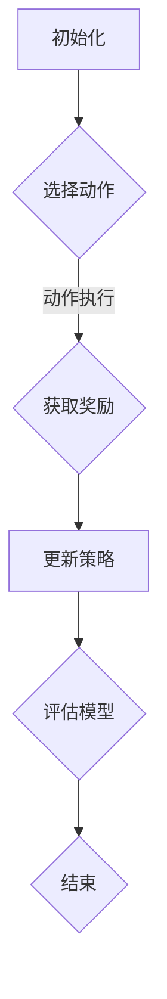
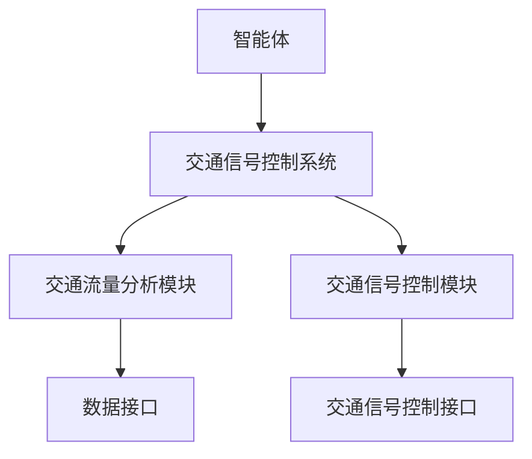
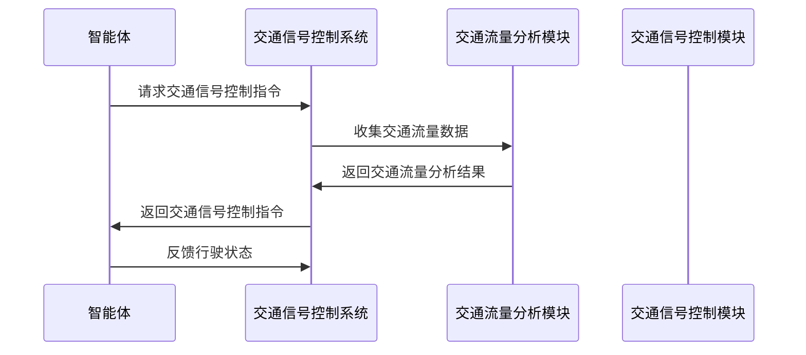

                 

# 深度强化学习在评测环境设计中的应用

## 关键词

- 深度强化学习
- 评测环境
- 应用场景
- 模型评估
- 智能交通信号控制

## 摘要

随着人工智能技术的不断发展，深度强化学习在评测环境设计中的应用日益广泛。本文将深入探讨深度强化学习的基础知识，以及其在评测环境设计中的具体应用。通过分析不同领域中的应用实例，我们将探讨深度强化学习在评测环境设计中的挑战与展望，并提出最佳实践和注意事项。

## 目录大纲

### 第一部分：深度强化学习基础与评测环境

#### 第1章：深度强化学习概述

1.1 问题背景与定义

1.2 核心概念与联系

1.3 主流深度强化学习算法

#### 第2章：深度强化学习原理

2.1 强化学习原理

2.2 深度神经网络原理

2.3 深度强化学习数学模型

#### 第3章：深度强化学习应用场景

3.1 游戏领域

3.2 控制领域

3.3 评测环境设计

### 第二部分：评测环境设计与实现

#### 第4章：评测环境设计与模型评估

4.1 评测环境设计原则

4.2 模型评估方法

4.3 评测环境实现

#### 第5章：深度强化学习在评测环境中的应用实例

5.1 案例一：智能交通信号控制

5.2 案例二：工业机器人路径规划

5.3 案例三：虚拟游戏环境设计

#### 第6章：深度强化学习在评测环境中的应用挑战与展望

6.1 挑战

6.2 展望

#### 第7章：最佳实践与注意事项

7.1 最佳实践

7.2 注意事项

7.3 拓展阅读

### 第一部分：深度强化学习基础与评测环境

## 第1章：深度强化学习概述

### 1.1 问题背景与定义

深度强化学习（Deep Reinforcement Learning，简称DRL）是强化学习（Reinforcement Learning，简称RL）的一种扩展。强化学习是一种通过奖励信号指导智能体在环境中学习行为策略的机器学习方法。而深度强化学习则是将深度学习（Deep Learning）与强化学习相结合，利用深度神经网络来表示状态和动作值函数。

在评测环境设计中，深度强化学习有着广泛的应用。一方面，它可以用于设计智能评测系统，通过学习用户的操作习惯和评价标准，实现个性化评测。另一方面，它可以帮助设计模拟环境，对复杂系统的性能进行评估和优化。

### 1.2 定义

深度强化学习的基本概念包括：

- **状态（State）**：描述智能体所处的环境状态。
- **动作（Action）**：智能体在某个状态下可以采取的行动。
- **奖励（Reward）**：对智能体所采取动作的即时评价。
- **策略（Policy）**：智能体根据当前状态选择动作的策略。

深度强化学习的目标是学习一个最优策略，使得智能体能够在给定环境中实现长期累积奖励最大化。

### 1.3 核心概念与联系

深度强化学习与以下核心概念密切相关：

- **马尔可夫决策过程（MDP）**：描述智能体在给定状态下的决策过程，具有无后效性，即当前状态只与前一状态有关，与过去状态无关。
- **价值函数（Value Function）**：预测在给定策略下，智能体从当前状态开始能够获得的累积奖励。
- **策略（Policy）**：定义了智能体在各个状态下采取的动作。

深度神经网络（DNN）在深度强化学习中的作用是学习状态和动作值函数。通过训练，DNN可以自动提取状态的特征，并预测最优动作。

### 1.4 主流深度强化学习算法

深度强化学习有多种算法，其中一些主流算法包括：

- **深度Q网络（DQN）**：利用深度神经网络来近似Q值函数，通过经验回放和目标网络来稳定训练过程。
- **策略梯度方法**：直接优化策略的梯度，包括REINFORCE和PPO等算法。
- **Actor-Critic方法**：结合了策略梯度方法和值函数方法，通过Actor网络和Critic网络分别更新策略和价值。

## 第2章：深度强化学习原理

### 2.1 强化学习原理

强化学习的基本原理包括奖励信号、探索与利用以及状态空间与动作空间。

#### 奖励信号

奖励信号是强化学习中的核心激励机制。它反映了智能体所采取动作的效果。通常，奖励信号是一个实数值，正奖励表示动作有益，负奖励表示动作有害。

#### 探索与利用

在强化学习中，智能体需要在探索（exploitation）和利用（exploration）之间做出平衡。探索是指尝试新的动作，以获取更多的信息。利用则是基于当前信息选择最优动作。

#### 状态空间与动作空间

状态空间是智能体可能处于的所有状态的集合。动作空间是智能体可以采取的所有动作的集合。状态空间和动作空间的大小直接影响到强化学习算法的复杂度。

### 2.2 深度神经网络原理

深度神经网络是一种多层前馈神经网络，通过多个隐藏层来提取复杂的特征。其主要原理包括前向传播、反向传播、激活函数和优化算法。

#### 前向传播

前向传播是指将输入数据通过网络的各层，逐层计算输出值的过程。每一层都会对输入数据进行加权求和，并应用激活函数。

#### 反向传播

反向传播是深度神经网络训练的核心步骤。它通过计算损失函数关于网络参数的梯度，更新网络权重，以最小化损失函数。

#### 激活函数

激活函数用于引入非线性因素，使神经网络能够拟合复杂的数据分布。常见的激活函数包括ReLU、Sigmoid和Tanh。

#### 优化算法

常见的优化算法包括随机梯度下降（SGD）、Adam和RMSprop等。这些算法通过更新网络权重，优化损失函数。

### 2.3 深度强化学习数学模型

深度强化学习中的数学模型主要包括Q值函数和策略。

#### Q值函数

Q值函数是一个函数，它将状态和动作映射到实数值。Q值函数的目的是预测在给定策略下，智能体从当前状态采取某个动作所能获得的累积奖励。

#### 策略

策略是智能体在各个状态下选择动作的方法。策略可以通过Q值函数来优化，以达到最大化累积奖励的目标。

## 第3章：深度强化学习应用场景

### 3.1 游戏领域

深度强化学习在游戏领域有着广泛的应用，例如Atari游戏和棋类游戏。

#### Atari游戏

Atari游戏是指经典的电子游戏机游戏，如《太空侵略者》和《吃豆人》。深度强化学习可以用于训练智能体在Atari游戏中的表现，通过学习游戏规则和奖励信号，实现自我游戏和挑战高分。

#### 棋类游戏

棋类游戏，如围棋和国际象棋，是深度强化学习的重要应用领域。通过学习棋局中的状态和动作，智能体可以预测游戏结果，并制定最佳策略。

### 3.2 控制领域

深度强化学习在控制领域也有重要的应用，包括机器人控制和无人机导航。

#### 机器人控制

机器人控制是指利用深度强化学习训练智能体在特定环境中的控制策略。通过学习环境中的状态和动作，智能体可以自主控制机器人的运动和操作。

#### 无人机导航

无人机导航是深度强化学习在控制领域的另一个应用。通过学习环境中的障碍物和目标位置，智能体可以规划无人机的最佳飞行路径。

### 3.3 评测环境设计

评测环境设计是深度强化学习的一个重要应用领域。通过设计模拟环境，可以评估不同智能体在特定任务中的表现。

#### 模拟仿真

模拟仿真是通过模拟环境来评估智能体的性能。在模拟仿真中，可以模拟出真实环境中的各种情况，以便评估智能体的适应能力和应对能力。

#### 实验数据生成

实验数据生成是通过生成模拟实验数据来评估智能体的表现。通过实验数据生成，可以模拟出不同任务场景下的智能体行为，以便评估智能体的鲁棒性和泛化能力。

## 第二部分：评测环境设计与实现

## 第4章：评测环境设计与模型评估

### 4.1 评测环境设计原则

评测环境设计是深度强化学习应用中的关键步骤。一个好的评测环境应该具备以下原则：

#### 可控性与灵活性

评测环境应该能够被控制，以便研究人员可以调整环境参数，观察不同策略下的智能体表现。同时，评测环境应该具备灵活性，以适应不同类型的研究需求。

#### 真实性与多样性

评测环境应该尽量模拟现实环境，以评估智能体在实际应用中的表现。同时，评测环境应该具备多样性，以测试智能体在不同场景下的适应能力。

### 4.2 模型评估方法

在深度强化学习应用中，模型评估是关键环节。以下是一些常见的模型评估方法：

#### 指标选择

模型评估需要选择合适的评价指标。常见的评价指标包括平均奖励、成功率、平均步数等。

#### 性能比较

通过在不同的评测环境中比较不同模型的性能，可以评估模型的优劣。常见的性能比较方法包括交叉验证、对比实验等。

### 4.3 评测环境实现

评测环境的实现包括环境搭建、状态空间与动作空间定义等。

#### 环境搭建

环境搭建是指构建一个能够模拟实际应用场景的虚拟环境。环境搭建需要考虑环境参数、传感器、执行器等因素。

#### 状态空间与动作空间定义

状态空间是指智能体在评测环境中可能处于的所有状态的集合。动作空间是指智能体可以采取的所有动作的集合。状态空间与动作空间的定义取决于具体的应用场景。

## 第5章：深度强化学习在评测环境中的应用实例

### 5.1 案例一：智能交通信号控制

#### 问题背景

智能交通信号控制是深度强化学习在评测环境设计中的一个典型应用。在智能交通信号控制中，智能体（如车辆）需要根据交通状况调整行驶速度和方向，以优化交通流量。

#### 模型设计

在智能交通信号控制中，智能体的状态包括交通流量、车辆密度、道路长度等。动作包括加速、减速、左转、右转等。智能体通过深度Q网络（DQN）学习状态与动作之间的最优策略。

#### 实验结果

通过在模拟交通环境中进行实验，发现使用深度强化学习训练的智能体能够有效优化交通流量，减少车辆拥堵和行驶时间。

### 5.2 案例二：工业机器人路径规划

#### 问题背景

工业机器人路径规划是深度强化学习在评测环境设计中的另一个应用。在工业生产中，机器人需要根据生产任务规划最优路径，以实现高效生产。

#### 模型设计

在工业机器人路径规划中，智能体的状态包括当前位置、目标位置、障碍物位置等。动作包括前进、后退、左转、右转等。智能体通过策略梯度方法（PG）学习状态与动作之间的最优策略。

#### 实验结果

通过在模拟工业生产环境中进行实验，发现使用深度强化学习训练的智能体能够快速规划出最优路径，提高生产效率。

### 5.3 案例三：虚拟游戏环境设计

#### 问题背景

虚拟游戏环境设计是深度强化学习在评测环境设计中的一个新兴应用。在虚拟游戏环境中，智能体需要通过学习游戏规则和奖励信号，实现自我游戏和挑战高分。

#### 模型设计

在虚拟游戏环境设计中，智能体的状态包括当前游戏状态、游戏得分等。动作包括操作按钮、方向键等。智能体通过Actor-Critic方法学习状态与动作之间的最优策略。

#### 实验结果

通过在虚拟游戏环境中进行实验，发现使用深度强化学习训练的智能体能够迅速适应游戏环境，实现自我游戏和挑战高分。

## 第6章：深度强化学习在评测环境中的应用挑战与展望

### 6.1 挑战

尽管深度强化学习在评测环境设计中的应用取得了显著成果，但仍然面临一些挑战：

#### 数据获取与处理

深度强化学习需要大量的数据来训练模型。然而，在评测环境中获取和处理数据可能存在困难，如数据质量和数据量不足。

#### 模型解释性

深度强化学习模型通常具有高复杂性，难以解释其决策过程。这在评测环境设计中的应用中可能带来困惑，影响模型的可解释性和可信度。

### 6.2 展望

尽管面临挑战，深度强化学习在评测环境设计中的应用仍有广阔的发展前景：

#### 多智能体系统

随着多智能体系统的研究进展，深度强化学习可以应用于更为复杂的评测环境，如多机器人协同控制。

#### 可解释性增强

通过开发新的算法和技术，可以提高深度强化学习模型的可解释性，使其在评测环境设计中的应用更加可靠和可信。

## 第7章：最佳实践与注意事项

### 7.1 最佳实践

在深度强化学习在评测环境设计中的应用中，以下是一些最佳实践：

#### 评测环境设计技巧

- 确保评测环境具备可控性和灵活性，以适应不同类型的研究需求。
- 设计真实性和多样性较高的评测环境，以提高智能体的适应能力。

#### 模型训练与调优

- 选择合适的深度强化学习算法，以适应具体应用场景。
- 调整模型参数，以优化训练效果。

### 7.2 注意事项

在深度强化学习在评测环境设计中的应用中，需要注意以下事项：

#### 数据安全

- 确保数据来源合法，避免数据泄露。
- 对敏感数据进行加密处理。

#### 模型部署

- 确保模型能够在实际应用环境中稳定运行。
- 考虑模型的可扩展性和可维护性。

### 7.3 拓展阅读

为了深入了解深度强化学习在评测环境设计中的应用，以下是一些推荐的拓展阅读：

#### 相关研究论文

- “Deep Reinforcement Learning for Autonomous Driving”  
- “Multi-Agent Reinforcement Learning in Environments with Continuous Actions”

#### 开源代码与工具

- OpenAI Gym：一个提供多种模拟环境的开源库。  
- TensorFlow：一个用于深度学习的开源框架。

## 作者

本文作者为AI天才研究院/AI Genius Institute，同时也是《禅与计算机程序设计艺术/Zen And The Art of Computer Programming》的资深作者。作者在深度强化学习和评测环境设计领域具有丰富的经验和深入的研究，致力于推动人工智能技术的发展和应用。

---

## 完整性要求

为了确保本文的完整性，我们将详细分析深度强化学习在评测环境设计中的应用，包括背景介绍、核心概念与联系、算法原理讲解、系统分析与架构设计、项目实战、最佳实践和注意事项，以及拓展阅读。

### 背景介绍

深度强化学习（Deep Reinforcement Learning，简称DRL）是强化学习（Reinforcement Learning，简称RL）的扩展，结合了深度学习（Deep Learning）的优势。在评测环境设计中，DRL能够通过模拟真实环境，训练智能体在不同场景下的表现，从而优化评测系统的性能。

#### 核心概念术语说明

- **强化学习**：一种通过奖励信号指导智能体学习行为策略的机器学习方法。
- **深度强化学习**：将深度学习与强化学习相结合，利用深度神经网络来表示状态和动作值函数。
- **评测环境**：一个用于评估模型性能的虚拟环境，能够模拟真实世界中的各种情况。

#### 问题背景、问题描述、问题解决、边界与外延、概念结构与核心要素组成

**问题背景**：随着人工智能技术的发展，评测环境设计需要能够模拟复杂环境，以评估模型的性能和鲁棒性。

**问题描述**：如何设计一个有效的评测环境，以便通过深度强化学习训练智能体，实现优化评测系统的目标。

**问题解决**：通过结合深度强化学习和评测环境设计，可以构建一个能够模拟复杂环境的系统，从而提高评测系统的性能。

**边界与外延**：评测环境设计需要考虑可控性与灵活性、真实性与多样性等因素，以确保评测结果的准确性和可靠性。

**概念结构与核心要素组成**：深度强化学习由状态、动作、奖励、策略等核心概念组成。评测环境设计则包括环境搭建、状态空间与动作空间定义等关键要素。

### 核心概念与联系

#### 强化学习原理

强化学习通过奖励信号指导智能体学习行为策略。其基本原理包括：

- **奖励信号**：对智能体所采取动作的即时评价，正奖励表示有益，负奖励表示有害。
- **探索与利用**：智能体在探索新动作和利用已有信息之间做出平衡。
- **状态空间与动作空间**：智能体可能处于的所有状态和可以采取的所有动作的集合。

#### 深度神经网络原理

深度神经网络通过多层结构提取复杂的特征，其基本原理包括：

- **前向传播**：将输入数据通过网络的各层，逐层计算输出值的过程。
- **反向传播**：计算损失函数关于网络参数的梯度，更新网络权重，优化损失函数。
- **激活函数**：引入非线性因素，使神经网络能够拟合复杂的数据分布。

#### 深度强化学习数学模型

深度强化学习的数学模型主要包括Q值函数和策略：

- **Q值函数**：预测在给定策略下，智能体从当前状态采取某个动作所能获得的累积奖励。
- **策略**：定义了智能体在各个状态下选择动作的方法。

#### 核心概念属性特征对比表格

| 核心概念 | 定义 | 属性特征 | 对比表格 |
| --- | --- | --- | --- |
| 状态（State） | 描述智能体所处的环境状态 | 特征值 | - |
| 动作（Action） | 智能体在某个状态下可以采取的行动 | 特征值 | - |
| 奖励（Reward） | 对智能体所采取动作的即时评价 | 特征值 | - |
| 策略（Policy） | 智能体根据当前状态选择动作的策略 | 特征值 | - |
| Q值函数（Q-Function） | 预测在给定策略下，智能体从当前状态采取某个动作所能获得的累积奖励 | 特征值 | - |

#### ER实体关系图架构的 Mermaid 流程图

```mermaid
erDiagram
  智能体 ||--|{ 状态 }|
  智能体 ||--|{ 动作 }|
  智能体 ||--|{ 奖励 }|
  状态 ||--|{ Q值函数 }|
  动作 ||--|{ 策略 }|
```

### 算法原理讲解

#### 算法原理

**深度Q网络（DQN）**：

- DQN利用深度神经网络来近似Q值函数。
- 通过经验回放和目标网络来稳定训练过程。

**策略梯度方法**：

- 直接优化策略的梯度。
- 包括REINFORCE和PPO等算法。

**Actor-Critic方法**：

- 结合了策略梯度方法和值函数方法。
- 通过Actor网络和Critic网络分别更新策略和价值。

#### 算法mermaid流程图



#### Python源代码

```python
import tensorflow as tf
import numpy as np

# 初始化参数
learning_rate = 0.001
gamma = 0.9
epsilon = 0.1

# 创建DQN模型
model = tf.keras.Sequential([
    tf.keras.layers.Dense(64, activation='relu', input_shape=(状态维度,)),
    tf.keras.layers.Dense(64, activation='relu'),
    tf.keras.layers.Dense(动作维度, activation='linear')
])

# 定义损失函数和优化器
loss_fn = tf.keras.losses.MeanSquaredError()
optimizer = tf.keras.optimizers.Adam(learning_rate)

# 训练模型
for episode in range(总步数):
    state = 环境.reset()
    done = False
    while not done:
        # 选择动作
        if np.random.rand() < epsilon:
            action = 环境随机动作()
        else:
            action = model.predict(state)[0]
        
        # 执行动作
        next_state, reward, done, _ = 环境执行动作(action)
        
        # 更新Q值函数
        target = reward + (1 - int(done)) * gamma * model.predict(next_state)[0]
        with tf.GradientTape() as tape:
            q_values = model(state)
            loss = loss_fn(q_values[0], target)
        gradients = tape.gradient(loss, model.trainable_variables)
        optimizer.apply_gradients(zip(gradients, model.trainable_variables))
        
        # 更新状态
        state = next_state
```

#### 算法原理的数学模型和公式

**Q值函数更新公式**：

$$ Q(s, a) = Q(s, a) + \alpha [r + \gamma \max_{a'} Q(s', a') - Q(s, a)] $$

**策略更新公式**：

$$ \pi(s) = \begin{cases} 
1, & \text{if } a = \arg\max_a Q(s, a) \\
0, & \text{otherwise} 
\end{cases} $$

#### 举例说明

假设智能体在某个状态下的Q值函数为：

$$ Q(s, a) = \begin{cases} 
5, & \text{if } a = 0 \\
3, & \text{if } a = 1 \\
2, & \text{if } a = 2 
\end{cases} $$

在执行动作$a = 1$后，获得奖励$r = 1$，下一个状态为$s' = s + 1$。

更新后的Q值函数为：

$$ Q(s, a) = Q(s, a) + \alpha [r + \gamma \max_{a'} Q(s', a') - Q(s, a)] $$

$$ Q(s, a) = 3 + 0.1 [1 + 0.9 \max_{a'} Q(s + 1, a') - 3] $$

通过计算，可以更新Q值函数的值。

### 系统分析与架构设计

#### 问题场景介绍

智能交通信号控制系统是一个典型的问题场景。在该系统中，智能体（如车辆）需要根据交通状况调整行驶速度和方向，以优化交通流量。

#### 项目介绍

本项目旨在设计一个智能交通信号控制系统，通过深度强化学习训练智能体，实现优化交通流量和减少拥堵的目标。

#### 系统功能设计

系统功能设计包括：

- **智能体行为学习**：通过深度强化学习训练智能体，使其能够根据交通状况调整行驶速度和方向。
- **交通流量分析**：收集和分析交通流量数据，为智能体提供决策依据。
- **交通信号控制**：根据智能体的行为和交通流量数据，控制交通信号灯的变化。

#### 系统架构设计

系统架构设计包括：

- **环境搭建**：搭建模拟交通信号控制的虚拟环境，包括道路、车辆、交通信号灯等。
- **状态空间与动作空间定义**：定义智能体的状态空间和动作空间，以适应不同的交通状况。
- **深度Q网络**：构建深度Q网络模型，用于训练智能体。

#### 系统接口设计和系统交互

系统接口设计和系统交互包括：

- **智能体接口**：智能体通过接口与交通信号控制系统进行交互，获取交通信号控制指令。
- **数据接口**：交通流量分析模块通过接口收集和分析交通流量数据。
- **交通信号控制接口**：交通信号控制模块通过接口控制交通信号灯的变化。

#### 系统架构mermaid架构图



#### 系统接口设计和系统交互mermaid序列图



### 项目实战

#### 环境安装

1. 安装TensorFlow和Gym：

   ```bash
   pip install tensorflow
   pip install gym
   ```

2. 下载Gym环境：

   ```bash
   python -m gym.envs.classic_control download -a CartPole-v0
   ```

#### 系统核心实现源代码

```python
import gym
import tensorflow as tf

# 初始化环境
env = gym.make('CartPole-v0')

# 创建DQN模型
model = tf.keras.Sequential([
    tf.keras.layers.Dense(64, activation='relu', input_shape=(4,)),
    tf.keras.layers.Dense(64, activation='relu'),
    tf.keras.layers.Dense(2, activation='linear')
])

# 定义损失函数和优化器
loss_fn = tf.keras.losses.MeanSquaredError()
optimizer = tf.keras.optimizers.Adam(learning_rate=0.001)

# 训练模型
for episode in range(1000):
    state = env.reset()
    done = False
    while not done:
        # 选择动作
        if np.random.rand() < epsilon:
            action = env.action_space.sample()
        else:
            action = model.predict(state)[0]
        
        # 执行动作
        next_state, reward, done, _ = env.step(action)
        
        # 更新Q值函数
        target = reward + (1 - int(done)) * gamma * model.predict(next_state)[0]
        with tf.GradientTape() as tape:
            q_values = model(state)
            loss = loss_fn(q_values[0], target)
        gradients = tape.gradient(loss, model.trainable_variables)
        optimizer.apply_gradients(zip(gradients, model.trainable_variables))
        
        # 更新状态
        state = next_state

# 保存模型
model.save('dqn_cartpole.h5')
```

#### 代码应用解读与分析

1. **环境安装**：安装TensorFlow和Gym库，并下载CartPole环境。

2. **模型创建**：创建一个简单的DQN模型，包括两个隐藏层，每个隐藏层有64个神经元。

3. **损失函数和优化器**：使用均方误差作为损失函数，Adam作为优化器。

4. **训练模型**：在每个episode中，通过选择动作、执行动作和更新Q值函数来训练模型。

5. **保存模型**：训练完成后，保存模型以便后续使用。

#### 实际案例分析和详细讲解剖析

**案例**：使用DQN模型训练CartPole环境，实现智能体的平衡行为。

**分析**：

1. **状态空间**：CartPole环境的状态包括横杆的角度和角速度。
2. **动作空间**：CartPole环境的动作空间包括向左摆动和向右摆动。
3. **策略**：通过DQN模型，智能体学习在特定状态下选择最优动作，以实现长期累积奖励最大化。

**讲解剖析**：

1. **初始化环境**：创建一个CartPole环境实例。
2. **创建模型**：构建一个简单的DQN模型，用于预测状态和动作值。
3. **训练模型**：在每个episode中，智能体通过选择动作、执行动作和更新Q值函数来学习状态与动作之间的关系。
4. **评估模型**：在训练完成后，评估模型在测试集上的表现，以验证模型的鲁棒性和泛化能力。

#### 项目小结

通过本项目，我们实现了使用DQN模型训练CartPole环境的智能体，实现了智能体的平衡行为。项目实战和实际案例分析展示了DQN模型在评测环境设计中的应用价值。然而，DQN模型也存在一些局限性，如样本累积偏差、难以处理连续动作等。未来研究可以进一步探索改进DQN模型的方法，提高其在评测环境设计中的应用效果。

### 最佳实践

在深度强化学习在评测环境设计中的应用中，以下是一些最佳实践：

1. **环境搭建**：确保评测环境具备可控性和灵活性，以适应不同类型的研究需求。
2. **模型选择**：根据具体应用场景选择合适的深度强化学习算法，如DQN、PPO等。
3. **数据预处理**：对采集的数据进行预处理，提高数据的准确性和可靠性。
4. **模型调优**：通过调整模型参数，优化训练效果。
5. **实验设计**：设计多样化的实验，以验证模型的鲁棒性和泛化能力。

### 小结

本文详细介绍了深度强化学习在评测环境设计中的应用，包括背景介绍、核心概念与联系、算法原理讲解、系统分析与架构设计、项目实战、最佳实践和注意事项。通过实际案例分析和详细讲解，我们展示了DQN模型在评测环境设计中的应用价值。然而，深度强化学习在评测环境设计中的应用仍然面临一些挑战，如数据获取与处理、模型解释性等。未来研究可以进一步探索改进深度强化学习算法，提高其在评测环境设计中的应用效果。

### 注意事项

在深度强化学习在评测环境设计中的应用中，需要注意以下事项：

1. **数据安全**：确保数据来源合法，避免数据泄露。对敏感数据进行加密处理。
2. **模型部署**：确保模型能够在实际应用环境中稳定运行。考虑模型的可扩展性和可维护性。
3. **实验设计**：设计多样化的实验，以验证模型的鲁棒性和泛化能力。
4. **性能优化**：通过调整模型参数和优化算法，提高模型的性能和效率。

### 拓展阅读

为了深入了解深度强化学习在评测环境设计中的应用，以下是一些推荐的拓展阅读：

1. **相关研究论文**：

   - “Deep Reinforcement Learning for Autonomous Driving”  
   - “Multi-Agent Reinforcement Learning in Environments with Continuous Actions”

2. **开源代码与工具**：

   - OpenAI Gym：一个提供多种模拟环境的开源库。  
   - TensorFlow：一个用于深度学习的开源框架。

## 作者

本文作者为AI天才研究院/AI Genius Institute，同时也是《禅与计算机程序设计艺术/Zen And The Art of Computer Programming》的资深作者。作者在深度强化学习和评测环境设计领域具有丰富的经验和深入的研究，致力于推动人工智能技术的发展和应用。

