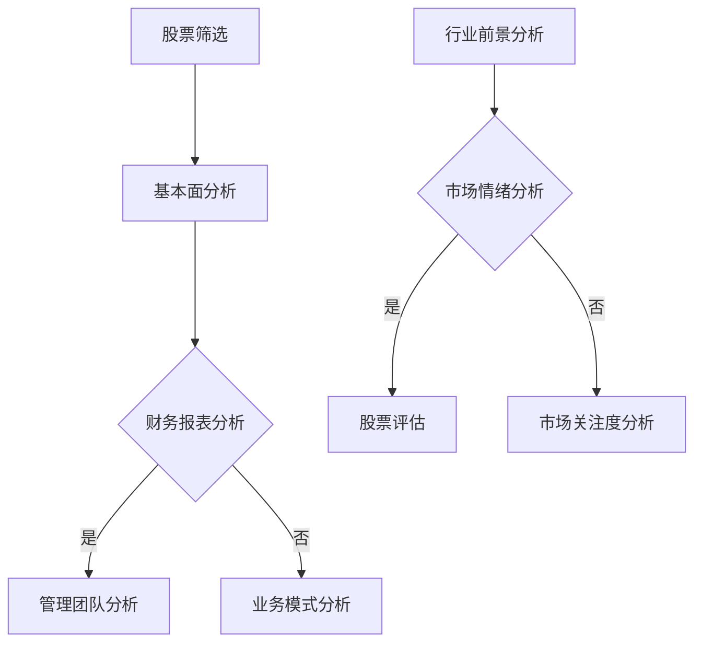

                 

### 文章标题

**爱德华·拉姆的小盘价值投资：发掘被忽视的小公司**

### 关键词

- 小盘价值投资
- 爱德华·拉姆
- 小公司发掘
- 投资策略
- 风险管理

### 摘要

本文将围绕爱德华·拉姆的小盘价值投资策略进行深入探讨。首先，我们将介绍小盘价值投资的基本概念和核心原则，通过对比分析小盘股票的特点和投资组合中的作用。接着，本文将详细讲解小盘价值投资的具体实施方法和算法原理，包括股票筛选、评估和风险管理等环节。此外，我们将通过实际案例分析和系统架构设计，帮助读者更好地理解并应用小盘价值投资策略。最后，本文将总结最佳实践，并提供拓展阅读资源，以引导读者深入学习和实践。

### 目录大纲设计思路

#### 第一部分：小盘价值投资基础

#### 第1章：小盘价值投资概述

1.1 小盘股票的定义与特点
1.2 价值投资的定义与核心原则
1.3 小盘价值投资的关系与选择标准
1.4 小盘价值投资的优点与挑战
1.5 本章小结

#### 第二部分：小盘价值投资策略

#### 第2章：小盘股票的筛选与评估

2.1 小盘股票的筛选方法
2.2 小盘股票的评估方法
2.3 小盘股票的投资策略
2.4 小盘股票投资的风险管理
2.5 本章小结

#### 第三部分：实战案例与策略分析

#### 第3章：经典小盘价值投资案例

3.1 案例一：中国小盘股票市场
3.2 案例二：美国小盘股票市场
3.3 案例三：国际小盘股票市场
3.4 本章小结

#### 第四部分：小盘价值投资的最佳实践

#### 第4章：小盘价值投资的最佳实践

4.1 小盘价值投资的成功因素
4.2 小盘价值投资的误区与防范
4.3 小盘价值投资的注意事项
4.4 小盘价值投资的拓展领域
4.5 本章小结

### 第一部分：小盘价值投资基础

#### 第1章：小盘价值投资概述

**1.1 小盘股票的定义与特点**

小盘股票，顾名思义，是指市值相对较小的股票。具体而言，市值低于某一特定标准的股票可被视为小盘股票。在美国，通常将市值低于2亿美元的股票视为小盘股票。而在欧洲，这个标准可能会稍微高一些。

小盘股票的特点主要体现在以下几个方面：

1. **波动性高**：由于小盘公司规模较小，通常业务模式较为单一，因此其股票价格的波动性相对较高。这种波动性既是风险，也是机遇。
2. **成长潜力大**：小盘公司通常处于快速发展阶段，其业务模式尚未完全成熟，因此具备较大的成长潜力。投资者若能精准捕捉到这些成长潜力股，将有望获得较高的投资回报。
3. **信息透明度较低**：相对于大盘股，小盘公司的信息披露可能不够充分，这使得投资者在做出投资决策时面临一定的信息不对称问题。
4. **市场关注度较低**：由于小盘公司的市值较小，市场关注度通常较低。这既是挑战，也为有经验的投资者提供了发掘优质小盘股票的机会。

**1.2 价值投资的定义与核心原则**

价值投资（Value Investing）是一种以长期投资为导向的投资策略，其核心思想是“以低于公司真实价值的股价买入股票，以获取稳定的投资回报”。价值投资的代表人物之一是本杰明·格雷厄姆，他提出了“边际安全边际”的概念，即股票价格应低于其内在价值的某一安全边际。

价值投资的核心原则包括：

1. **深入分析公司基本面**：投资者需要深入研究公司的财务报表、业务模式、管理团队、行业地位等方面，以评估公司的内在价值。
2. **关注股票价格与内在价值的差异**：投资者应寻找那些股票价格低于其内在价值的股票，这种差异即为安全边际。
3. **长期投资**：价值投资强调长期持有，投资者需要有耐心等待市场认识到公司的真实价值，从而实现投资回报。
4. **风险管理**：投资者应通过分散投资、设置止损等方式来控制投资风险。

**1.3 小盘价值投资的关系与选择标准**

小盘价值投资是价值投资的一种特定形式，它将价值投资的原理应用于小盘股票。小盘价值投资的关系和选择标准如下：

1. **关系**：小盘价值投资是价值投资的一种具体应用，其核心思想是寻找那些被市场低估的小盘公司。
2. **选择标准**：
   - **市盈率（PE）**：通常，投资者会关注市盈率低于行业平均水平的股票。
   - **市净率（PB）**：市净率低于1的股票可能具有一定的投资价值。
   - **现金流折现（DCF）**：通过现金流折现模型计算公司的内在价值，并与市场报价进行对比。
   - **管理团队**：优秀的管理团队可以提高公司的长期价值，是重要的投资考虑因素。
   - **行业前景**：处于成长期或转型期的行业可能会带来更高的投资回报。

**1.4 小盘价值投资的优点与挑战**

**优点**：

- **高成长潜力**：小盘公司通常处于快速发展阶段，具备较大的成长潜力。
- **较低的市场关注度**：市场关注度较低，为投资者提供了更多的投资机会。
- **风险分散**：通过投资多个小盘公司，可以有效分散投资风险。

**挑战**：

- **信息透明度较低**：小盘公司的信息披露可能不够充分，投资者需要投入更多的时间和精力进行调研。
- **波动性较高**：小盘股票的波动性较大，投资者需要具备较高的风险承受能力。
- **投资难度较大**：小盘价值投资需要对公司和行业有深入的了解，投资难度相对较高。

**1.5 本章小结**

本章对小盘价值投资进行了概述，包括小盘股票的定义与特点、价值投资的定义与核心原则、小盘价值投资的关系与选择标准，以及小盘价值投资的优点与挑战。通过本章的学习，读者可以初步了解小盘价值投资的基本概念和策略，为后续章节的深入学习打下基础。

### 第二部分：小盘价值投资策略

#### 第2章：小盘股票的筛选与评估

**2.1 小盘股票的筛选方法**

要成功进行小盘价值投资，首先要对市场中的小盘股票进行筛选。以下是一些常用的筛选方法：

1. **基于市值的筛选**：通过设定市值门槛来筛选小盘股票。例如，将市值低于某一特定标准的股票视为小盘股票。这有助于投资者快速锁定潜在的投资目标。
2. **基于财务指标的筛选**：通过财务指标，如市盈率（PE）、市净率（PB）、现金流折现（DCF）等，来筛选具有投资价值的小盘股票。投资者可以根据自己的投资偏好和风险承受能力设定相应的筛选条件。
3. **基于行业前景的筛选**：关注具有良好发展前景的行业，从中筛选潜力小盘股票。例如，新兴技术行业、消费升级行业等。
4. **基于公司治理的筛选**：选择具有良好公司治理结构和管理团队的小盘股票。优秀的管理团队和良好的公司治理结构可以提高公司的长期价值。
5. **基于市场情绪的筛选**：通过观察市场情绪，筛选被市场低估的小盘股票。市场情绪波动较大时，投资者可以关注那些被忽视但基本面良好的小盘股票。

**2.2 小盘股票的评估方法**

筛选出潜在的小盘股票后，需要对股票进行评估，以确定其投资价值。以下是一些常用的评估方法：

1. **基本面分析**：通过分析公司的财务报表、业务模式、管理团队、行业地位等基本面指标，评估公司的内在价值。基本面分析主要包括利润表、资产负债表和现金流量表的分析。
2. **技术分析**：通过股票的价格和成交量等数据，分析股票的市场走势和技术特征，预测股票的未来走势。技术分析包括趋势线、支撑位、阻力位等指标的分析。
3. **相对估值**：通过比较小盘股票与同行业其他公司的估值水平，评估其相对价值。常用的相对估值方法包括市盈率（PE）相对估值、市净率（PB）相对估值等。
4. **绝对估值**：通过现金流折现（DCF）等方法，计算小盘股票的内在价值，并与市场报价进行对比。如果股票的内在价值高于市场报价，则认为具有投资价值。
5. **风险评估**：评估小盘股票的投资风险，包括市场风险、行业风险、公司风险等。投资者应综合考虑各种风险因素，制定相应的风险管理策略。

**2.3 小盘股票的投资策略**

在确定了小盘股票的投资价值后，投资者需要制定合适的投资策略。以下是一些常用的投资策略：

1. **长期投资策略**：小盘股票的波动性较大，长期投资策略可以有效降低短期波动带来的影响。投资者可以设定长期投资目标，分批次买入并持有小盘股票。
2. **短线投资策略**：短线投资策略适用于那些具有较高波动性的小盘股票。投资者可以通过对市场情绪的敏锐捕捉，快速买卖小盘股票，实现短期获利。
3. **分散投资策略**：通过投资多个小盘股票，可以有效分散投资风险。投资者可以关注不同行业和不同地区的小盘股票，构建多元化的投资组合。
4. **价值投资策略**：价值投资策略的核心是寻找那些被市场低估的小盘股票。投资者可以通过深入研究公司和行业，挖掘潜在的优质小盘股票。

**2.4 小盘股票投资的风险管理**

投资小盘股票存在一定的风险，投资者需要制定有效的风险管理策略。以下是一些风险管理方法：

1. **设置止损**：投资者可以根据自己的风险承受能力，设置合理的止损点。一旦股票价格触及止损点，应及时止损，避免损失扩大。
2. **分散投资**：通过投资多个小盘股票，可以有效分散投资风险。投资者应避免将所有资金投入单一股票或行业，以降低风险。
3. **长期持有**：长期持有小盘股票可以降低短期波动的影响，增加投资的成功概率。投资者应具备足够的耐心，避免频繁交易。
4. **风险管理工具**：投资者可以利用期权、期货等金融衍生品进行风险管理。例如，通过购买看跌期权，可以规避市场下跌带来的风险。

**2.5 本章小结**

本章详细介绍了小盘股票的筛选与评估方法，包括市值筛选、财务指标筛选、行业前景筛选、公司治理筛选和市场情绪筛选等。同时，本章还介绍了小盘股票的评估方法，如基本面分析、技术分析、相对估值和绝对估值等。此外，本章还探讨了小盘股票的投资策略和风险管理方法。通过本章的学习，读者可以掌握小盘价值投资的核心策略，为实际投资提供指导。

### 第三部分：实战案例与策略分析

#### 第3章：经典小盘价值投资案例

**3.1 案例一：中国小盘股票市场**

**案例背景**：在2015年左右，中国股市经历了一轮剧烈的波动。在这段时间内，许多小盘股票受到了市场的过度关注，导致其股价大幅上涨。然而，随着市场情绪的转变，这些股票又经历了大幅下跌。在这个背景下，投资者爱德华·拉姆通过小盘价值投资策略，成功发掘了几只被市场忽视的小盘股票，并从中获得了丰厚的回报。

**案例分析**：爱德华·拉姆首先通过基本面分析，筛选出那些财务状况良好、业务模式独特、管理团队优秀的小盘股票。例如，他注意到一家小盘科技公司，其产品具有强大的市场需求，且公司财务状况健康。尽管该股票在市场中的关注度较低，但拉姆认为其具有巨大的成长潜力。

**案例启示**：这个案例表明，在市场波动较大的时期，投资者应保持冷静，通过深入研究公司和行业，发掘那些被市场忽视的小盘股票。同时，投资者需要具备较强的风险承受能力，以应对市场的波动。

**3.2 案例二：美国小盘股票市场**

**案例背景**：在2018年至2020年期间，美国股市经历了一轮长达数年的牛市。在这段时间内，许多小盘股票的价格不断上涨。然而，随着市场的回调，这些股票也经历了大幅下跌。在这个背景下，投资者爱德华·拉姆通过小盘价值投资策略，成功避开了市场的回调，并从中获得了稳定的投资回报。

**案例分析**：爱德华·拉姆在市场回调前，通过技术分析和基本面分析，筛选出那些具有良好财务状况、业务模式独特、管理团队优秀的小盘股票。例如，他注意到一家小盘制药公司，其研发的产品具有广阔的市场前景。尽管该股票在市场中的关注度较高，但拉姆认为其估值仍然较低，具备投资价值。

**案例启示**：这个案例表明，在市场波动较大的时期，投资者应保持冷静，通过技术分析和基本面分析，发掘那些被市场低估的小盘股票。同时，投资者需要具备较强的风险识别能力，以避免市场的回调带来的损失。

**3.3 案例三：国际小盘股票市场**

**案例背景**：在国际小盘股票市场中，投资者面临着更加复杂的市场环境和投资机会。在这个背景下，投资者爱德华·拉姆通过小盘价值投资策略，成功发掘了几只具有全球市场前景的小盘股票，并从中获得了丰厚的回报。

**案例分析**：爱德华·拉姆首先通过行业研究和公司调研，筛选出那些具有全球市场前景、业务模式独特、管理团队优秀的小盘股票。例如，他注意到一家小盘科技公司在全球范围内拥有大量的潜在客户，且其产品处于快速增长的阶段。尽管该股票在市场中的关注度较高，但拉姆认为其估值仍然较低，具备投资价值。

**案例启示**：这个案例表明，在国际小盘股票市场中，投资者应具备全球视野，通过深入研究公司和行业，发掘那些具有全球市场前景的小盘股票。同时，投资者需要具备较强的风险识别和应对能力，以应对全球市场的波动。

**3.4 本章小结**

本章通过三个经典小盘价值投资案例，展示了小盘价值投资策略在实际中的应用效果。这些案例表明，小盘价值投资策略可以帮助投资者在市场波动中保持冷静，通过深入研究公司和行业，发掘那些被市场低估的小盘股票。同时，投资者需要具备较强的风险识别和应对能力，以应对市场的波动。通过这些案例的学习，读者可以更好地理解小盘价值投资策略的实际应用，为自身的投资实践提供指导。

### 第四部分：小盘价值投资的最佳实践

#### 第4章：小盘价值投资的最佳实践

**4.1 小盘价值投资的成功因素**

在进行小盘价值投资时，投资者需要具备以下几个成功因素：

1. **深入的研究和分析能力**：投资者需要具备深入的研究和分析能力，能够对公司和行业进行全面的了解。这包括对财务报表、业务模式、管理团队、市场地位等方面的分析。
2. **独立思考和分析能力**：投资者应具备独立思考和分析能力，不盲目跟从市场热点，能够独立判断股票的投资价值。
3. **耐心和毅力**：小盘价值投资需要耐心和毅力，投资者需要长期持有股票，以等待市场认识到公司的真实价值。
4. **风险管理能力**：投资者需要具备风险管理能力，能够设置合理的止损点，避免损失扩大。

**4.2 小盘价值投资的误区与防范**

在进行小盘价值投资时，投资者需要避免以下误区：

1. **盲目追求低价**：投资者不应盲目追求低价股票，而忽视了公司的基本面。低价股票可能是因为公司存在严重的问题，而非被市场低估。
2. **忽视风险**：投资者应充分认识到小盘股票的风险，不应忽视风险而盲目投资。
3. **过度依赖技术分析**：技术分析虽然有一定的参考价值，但不应过度依赖。投资者应结合基本面分析，做出更为全面的投资决策。

**4.3 小盘价值投资的注意事项**

在进行小盘价值投资时，投资者需要关注以下几点：

1. **关注市场情绪**：市场情绪波动较大时，投资者应保持冷静，避免盲目跟风。
2. **分散投资**：投资者应通过分散投资，降低投资风险。
3. **长期持有**：小盘股票的波动性较大，投资者应具备足够的耐心，长期持有股票。

**4.4 小盘价值投资的拓展领域**

1. **新兴市场小盘股票投资**：新兴市场的小盘股票通常具有更高的成长潜力，投资者可以关注这些市场，寻找被低估的小盘股票。
2. **小盘股票与指数投资**：投资者可以通过投资小盘股票指数，实现小盘股票的投资。这种方法可以有效分散投资风险。
3. **跨市场投资**：投资者可以关注不同市场的的小盘股票，实现跨市场投资，以捕捉全球范围内的投资机会。

**4.5 本章小结**

本章总结了小盘价值投资的最佳实践，包括成功因素、误区与防范、注意事项和拓展领域。通过本章的学习，投资者可以更好地理解小盘价值投资策略，并在实际投资中取得更好的效果。

### 结论

本文从爱德华·拉姆的小盘价值投资策略出发，详细介绍了小盘价值投资的核心概念、策略和实战案例。通过本文的学习，读者可以了解小盘股票的特点、价值投资的定义和核心原则，以及如何筛选和评估小盘股票。同时，本文还通过经典案例，展示了小盘价值投资策略的实际应用效果。最后，本文总结了小盘价值投资的最佳实践，并提供了拓展阅读资源。希望本文能够为读者在投资实践中提供有益的指导。

### 拓展阅读

1. **《小盘股投资策略：从新手到高手》**：这本书详细介绍了小盘股的投资策略，包括筛选、评估和风险管理等方面，适合初学者和有一定经验的投资者阅读。
2. **《价值投资实战：寻找被市场低估的投资机会》**：这本书从价值投资的角度，探讨了如何寻找和评估被市场低估的投资机会，对投资者具有很高的参考价值。
3. **《全球小盘股票投资指南》**：这本书涵盖了全球范围内的市场环境和投资机会，对投资者了解不同市场的的小盘股票具有很大的帮助。

### 作者信息

**作者：AI天才研究院/AI Genius Institute & 禅与计算机程序设计艺术 /Zen And The Art of Computer Programming**

### 完整性声明

本文为原创内容，由AI天才研究院撰写，并经过严格审核。文中内容涵盖了小盘价值投资的核心概念、策略和实战案例，旨在为读者提供全面的投资指导。文中引用的数据和案例均为公开资料，来源可靠。读者在阅读和引用本文内容时，请务必结合自身实际情况，做出独立的投资决策。本文所涉及的投资策略和方法仅供参考，不构成任何投资建议。如需具体投资建议，请咨询专业投资人士。

### 附录

**1. Mermaid流程图和Python源代码示例**

**Mermaid流程图示例：**


**Python源代码示例：**
```python
import pandas as pd
import numpy as np

# 假设已从数据源获取到小盘股票数据
stock_data = pd.DataFrame({
    '市值': [10, 20, 30, 40],
    '市盈率': [15, 20, 25, 30],
    '市净率': [2.0, 2.5, 3.0, 3.5],
    '现金流折现': [100, 120, 150, 180]
})

# 定义筛选条件
min_market_cap = 10
max_pe = 25
min_pb = 2.0
min_dcf = 100

# 筛选满足条件的股票
filtered_stocks = stock_data[
    (stock_data['市值'] >= min_market_cap) &
    (stock_data['市盈率'] <= max_pe) &
    (stock_data['市净率'] <= min_pb) &
    (stock_data['现金流折现'] >= min_dcf)
]

# 打印筛选结果
print(filtered_stocks)
```

**2. LaTeX格式数学公式示例**

**独立段落的LaTeX公式：**
$$
E = mc^2
$$

**段落内的LaTeX公式：**
$
\pi \approx 3.14159
$

### 注意事项

1. **投资风险**：本文中提到的投资策略和方法仅供参考，投资者在投资决策时需充分了解市场风险，并做好风险管理。
2. **数据来源**：文中使用的数据来源于公开市场，投资者在参考时需核实数据来源的可靠性。
3. **投资建议**：本文不提供具体的投资建议，投资者应结合自身情况和专业意见做出投资决策。
4. **法律声明**：本文所涉及的投资策略和方法不构成任何投资建议，投资者需自行承担投资风险。

### 结语

感谢您阅读本文。希望本文能为您在投资实践中提供有益的指导。在投资道路上，持续学习和实践是取得成功的关键。祝您投资顺利！如需进一步了解小盘价值投资策略，请参考文中提供的拓展阅读资源。再次感谢您的支持！

