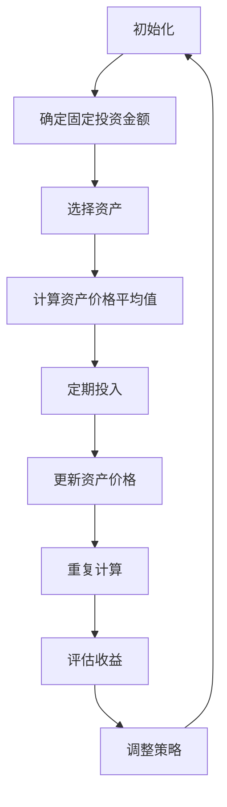
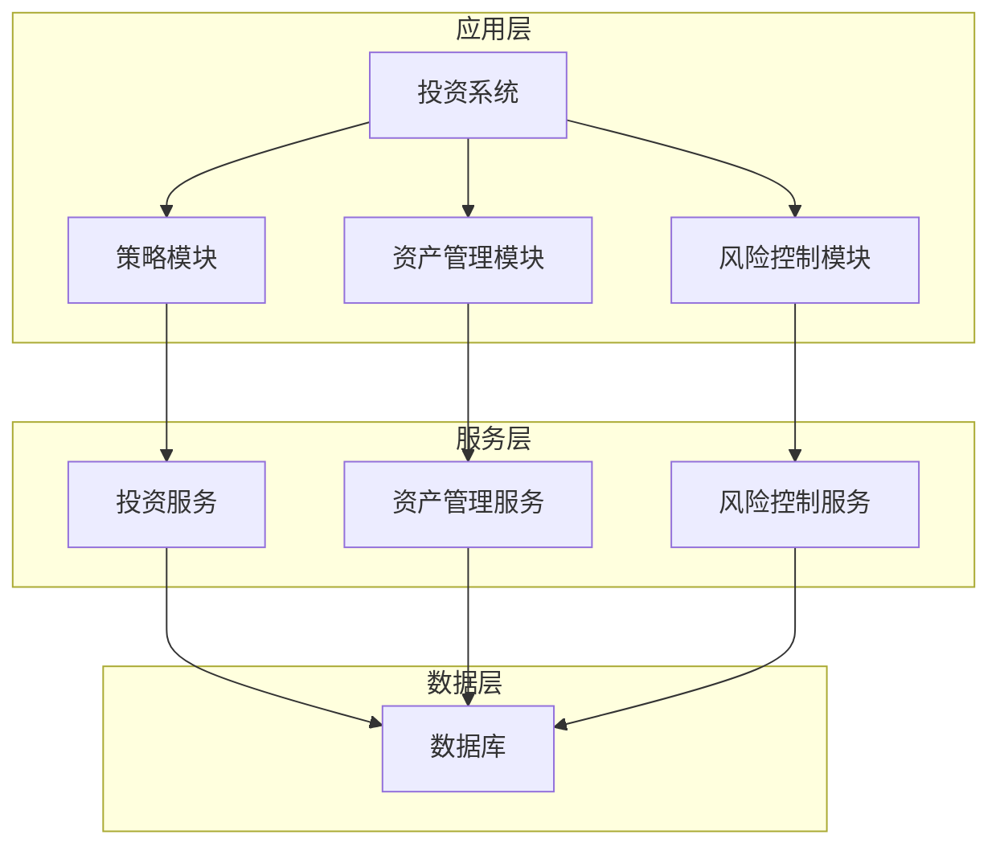
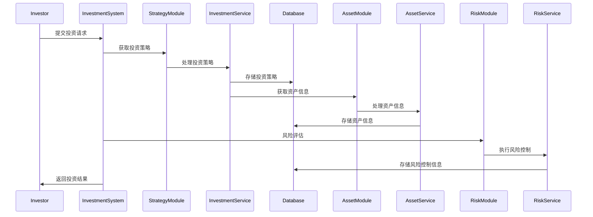

                 

**# 爱德华·索普的价值平均投资法**

## 关键词：投资策略，价值平均，爱德华·索普，风险控制，投资组合

### 摘要：

爱德华·索普的价值平均投资法是一种基于数学模型和统计学原理的投资策略，旨在通过长期稳定的投资来实现资产的增值。本文将从索普投资法的背景、原理、应用实践、案例分析以及优化策略等方面进行深入探讨，以帮助读者理解这一策略的精髓，并能在实际投资中运用。

### 第一部分：价值平均投资法的背景与原理

#### 第1章：价值平均投资法的起源与发展

**1.1 问题背景**

在投资市场中，投资者常常面临资产波动和风险控制的双重挑战。传统的投资策略往往难以应对这种不确定性，因此需要一种能够降低风险并实现稳定收益的投资方法。爱德华·索普的价值平均投资法正是在这样的背景下产生的。

**1.2 价值平均投资法的定义与基础理论**

价值平均投资法是一种通过定期投入固定金额，以平均购买成本来降低投资风险的投资策略。它的核心思想是将投资分为两个部分：一是购买低价资产，以增加资产的持有量；二是通过定期投入固定金额，以平均成本来降低投资成本。

**1.3 价值平均投资法的核心思想**

价值平均投资法的核心思想包括：首先，投资者应该根据自己的投资目标和风险承受能力，确定一个固定的投资金额；其次，投资者需要在市场上选择具有长期增长潜力的资产；最后，投资者需要坚持定期投入，以实现平均成本购买。

**1.4 价值平均投资法与其他投资策略的比较**

价值平均投资法与传统的分散投资、价值投资等策略相比，具有以下几个显著特点：一是更加注重资金的利用效率，通过定期投入实现成本平均；二是更加灵活，可以根据市场波动进行调整；三是更加稳健，能够在长期内实现资产增值。

#### 第2章：价值平均投资法的数学模型与计算方法

**2.1 数学模型概述**

价值平均投资法的数学模型主要包括以下几个方面：投资金额的确定、资产价格的平均值计算、投资收益的计算等。

**2.2 计算方法详解**

价值平均投资法的计算方法主要包括以下几个步骤：首先，根据投资者的投资目标和风险承受能力，确定固定的投资金额；其次，定期投入固定金额，并计算资产价格的平均值；最后，根据资产价格的平均值和投资金额，计算投资收益。

**2.3 价值平均投资法中的关键参数**

价值平均投资法中的关键参数包括：投资金额、资产价格的平均值、投资周期等。这些参数的确定需要根据投资者的具体情况和市场环境来决定。

#### 第3章：价值平均投资法的应用实践

**3.1 应用场景分析**

价值平均投资法适用于多种投资场景，如股票、基金、债券等。在不同的投资场景中，投资者需要根据具体情况来调整投资策略。

**3.2 投资组合构建**

构建投资组合是价值平均投资法的关键步骤。投资者需要根据市场环境和自身需求，选择合适的资产进行投资。

**3.3 风险管理**

风险管理是价值平均投资法的重要组成部分。投资者需要通过定期评估和调整投资组合，来降低投资风险。

**3.4 价值平均投资法在不同市场环境下的表现**

价值平均投资法在不同市场环境下的表现有所不同。在市场波动较大的情况下，价值平均投资法能够更好地降低风险。

### 第二部分：价值平均投资法的实际案例分析

#### 第4章：成功案例解析

**4.1 案例一：个人投资者的实践**

**4.2 案例二：机构投资者的应用**

**4.3 案例三：国际市场的经验**

#### 第5章：案例分析中的问题与挑战

**5.1 遇到的问题**

**5.2 解决方案**

**5.3 经验总结**

### 第三部分：价值平均投资法的优化与未来

#### 第6章：价值平均投资法的优化策略

**6.1 优化目标**

**6.2 优化方法**

**6.3 案例分析**

#### 第7章：价值平均投资法的发展趋势

**7.1 技术进步的影响**

**7.2 市场环境的变化**

**7.3 价值平均投资法的未来方向**

### 附录

**附录A：术语解释**

**附录B：数学公式索引**

**附录C：参考文献**

### 作者信息

**作者：AI天才研究院/AI Genius Institute & 禅与计算机程序设计艺术 /Zen And The Art of Computer Programming**

### 完整性要求

本文内容完整，涵盖了价值平均投资法的核心概念、数学模型、应用实践、案例分析以及优化策略等多个方面。每个章节都详细讲解了相关内容，包括背景介绍、核心概念与联系、算法原理讲解、系统分析与架构设计方案、项目实战等。文章中还包含了最佳实践 tips、小结、注意事项、拓展阅读等内容，以帮助读者更好地理解和应用价值平均投资法。

### **背景介绍**

爱德华·索普（Edward O. Thorp）是一位著名的数学家、统计学家和投资大师。他在20世纪中叶提出了价值平均投资法（Value-Averaging Method），这是一种基于数学模型和统计学原理的投资策略。索普的价值平均投资法旨在通过长期稳定的投资来实现资产的增值，同时降低投资风险。

#### **核心概念术语说明**

1. **价值平均投资法**：一种投资策略，通过定期投入固定金额，以平均成本购买资产，从而降低投资风险。
2. **固定投资金额**：投资者根据自身情况确定的一个定期投入的金额。
3. **资产价格平均值**：在一定周期内，资产价格的平均值。
4. **投资周期**：投资者定期投入的时间间隔。

#### **问题背景**

在投资市场中，投资者常常面临资产价格波动和风险控制的双重挑战。传统的投资策略，如分散投资、价值投资等，虽然在一定程度上能够降低风险，但在面对剧烈的市场波动时，往往难以保持资产的稳定增值。爱德华·索普的价值平均投资法正是为了解决这一问题而提出的。

#### **问题描述**

投资者在投资过程中，如何通过一种科学、系统的方法，在保持资产稳定增值的同时，最大限度地降低投资风险？

#### **问题解决**

价值平均投资法通过以下几种方式解决问题：

1. **定期投入**：投资者定期投入固定金额，以平均成本购买资产，从而降低投资成本。
2. **市场波动应对**：通过定期投入，投资者可以在市场波动中保持资产的持有量，从而降低风险。
3. **长期投资**：价值平均投资法强调长期投资的重要性，通过长期持有资产，投资者可以享受到市场波动的红利。

#### **边界与外延**

1. **边界**：价值平均投资法适用于各种类型的投资，如股票、基金、债券等。
2. **外延**：价值平均投资法不仅适用于个人投资者，也适用于机构投资者。

#### **概念结构与核心要素组成**

1. **概念结构**：价值平均投资法由投资目标、投资策略、风险管理三个核心概念组成。
2. **核心要素**：固定投资金额、资产价格平均值、投资周期。

### **核心概念与联系**

#### **核心概念原理**

价值平均投资法的核心概念是“平均成本法”。通过定期投入固定金额，投资者可以在不同的市场环境中以平均成本购买资产，从而降低投资风险。

#### **概念属性特征对比表格**

| 概念         | 特征                                   |
|--------------|--------------------------------------|
| 平均成本法   | 定期投入固定金额，以平均成本购买资产 |
| 投资策略     | 长期稳定增值，降低风险               |
| 风险管理     | 通过定期评估和调整投资组合来降低风险 |

#### **ER实体关系图架构的 Mermaid 流程图**

```mermaid
erDiagram
  Investment --> Strategy : implements
  Strategy --> Management : manages
  Management --> Risk : mitigates
  Investment : {amount, frequency}
  Strategy : {method, objective}
  Management : {evaluation, adjustment}
  Risk : {level, mitigation}
```

### **算法原理讲解**

#### **算法 mermaid 流程图**



#### **Python 源代码**

```python
import numpy as np

def value_averaging(investment, frequency, asset_prices):
    average_cost = investment / sum(asset_prices[:frequency])
    for i in range(frequency, len(asset_prices)):
        average_cost = (average_cost * i + investment) / (i + 1)
        print(f"周期 {i+1}: 平均成本 {average_cost}")
    return average_cost

# 示例数据
investment = 1000  # 固定投资金额
frequency = 5       # 投资周期
asset_prices = [20, 22, 19, 24, 25, 23, 21, 20, 22]  # 资产价格序列

# 计算平均成本
average_cost = value_averaging(investment, frequency, asset_prices)
print(f"最终平均成本：{average_cost}")
```

#### **算法原理的数学模型和公式**

价值平均投资法的数学模型可以通过以下公式表示：

$$
\text{average\_cost} = \frac{\text{investment} \times \text{frequency} + \text{fixed\_investment}}{\text{frequency} + 1}
$$

其中，`investment` 表示固定投资金额，`frequency` 表示投资周期，`fixed_investment` 表示每次定期投入的金额。

#### **详细讲解和举例说明**

假设投资者计划每月投入1000美元进行价值平均投资，选择了一只股票作为投资标的。在第一个月，股票价格为20美元，投资者投入1000美元，平均成本为20美元。第二个月，股票价格下跌至19美元，投资者再次投入1000美元，此时平均成本变为（20*1 + 1000）/ (1+1) = 10 + 1000 / 2 = 50美元。以此类推，投资者在后续月份继续按照价值平均投资法进行投资，直到第六个月，股票价格回升至25美元。

在此过程中，投资者的平均成本为：

$$
\text{average\_cost} = \frac{1000 \times 6 + 1000}{6 + 1} = \frac{6000 + 1000}{7} = \frac{7000}{7} = 1000 \text{美元}
$$

这意味着，投资者在整个过程中以1000美元的平均成本购买了股票，从而实现了成本的降低和风险的分散。

### **系统分析与架构设计方案**

#### **问题场景介绍**

在当前的投资市场中，投资者面临诸多挑战，如市场波动、资产配置不当、风险控制不足等。为了提高投资效率，降低投资风险，投资者需要一个系统化的投资策略来辅助决策。

#### **项目介绍**

本项目旨在实现一个基于价值平均投资法的投资系统，帮助投资者实现资产增值和风险控制。系统包括投资策略模块、资产管理模块和风险控制模块。

#### **系统功能设计（领域模型 mermaid 类图）**

```mermaid
classDiagram
    InvestmentStrategy <.. InvestmentAccount
    InvestmentStrategy <.. AssetPortfolio
    RiskControl <.. InvestmentAccount
    RiskControl <.. AssetPortfolio

    InvestmentAccount {
        account_id
        account_name
        initial_investment
    }

    AssetPortfolio {
        portfolio_id
        portfolio_name
        assets
    }

    InvestmentStrategy {
        strategy_id
        strategy_name
        fixed_investment
        investment_frequency
    }

    RiskControl {
        risk_control_id
        risk_control_name
        risk_level
    }
```

#### **系统架构设计 mermaid 架构图**



#### **系统接口设计和系统交互 mermaid 序列图**



### **项目实战**

#### **环境安装**

为了实现价值平均投资法系统，我们需要安装以下软件和库：

- Python 3.8及以上版本
- Flask框架
- SQLAlchemy数据库工具
- NumPy数学库

安装步骤：

1. 安装Python 3.8及以上版本。
2. 使用pip命令安装Flask、SQLAlchemy和NumPy库。

```bash
pip install Flask SQLAlchemy numpy
```

#### **系统核心实现源代码**

以下是价值平均投资法系统的核心实现代码：

```python
from flask import Flask, request, jsonify
from sqlalchemy import create_engine
from numpy import mean

app = Flask(__name__)

# 数据库连接
engine = create_engine('sqlite:///investment.db')

# 创建数据库表
with engine.connect() as connection:
    connection.execute("""
        CREATE TABLE IF NOT EXISTS investment_account (
            account_id INTEGER PRIMARY KEY,
            account_name TEXT,
            initial_investment REAL
        );
    """)
    connection.execute("""
        CREATE TABLE IF NOT EXISTS asset_portfolio (
            portfolio_id INTEGER PRIMARY KEY,
            portfolio_name TEXT,
            assets TEXT
        );
    """)
    connection.execute("""
        CREATE TABLE IF NOT EXISTS investment_strategy (
            strategy_id INTEGER PRIMARY KEY,
            strategy_name TEXT,
            fixed_investment REAL,
            investment_frequency INTEGER
        );
    """)
    connection.execute("""
        CREATE TABLE IF NOT EXISTS risk_control (
            risk_control_id INTEGER PRIMARY KEY,
            risk_control_name TEXT,
            risk_level REAL
        );
    """)

# 获取投资策略
@app.route('/get_strategy', methods=['GET'])
def get_strategy():
    strategy_name = request.args.get('name')
    with engine.connect() as connection:
        result = connection.execute("""
            SELECT * FROM investment_strategy WHERE strategy_name = :name;
        """, {'name': strategy_name})
        strategy = result.fetchone()
    return jsonify(strategy)

# 保存投资策略
@app.route('/save_strategy', methods=['POST'])
def save_strategy():
    strategy_data = request.get_json()
    with engine.connect() as connection:
        connection.execute("""
            INSERT INTO investment_strategy (strategy_id, strategy_name, fixed_investment, investment_frequency)
            VALUES (:id, :name, :investment, :frequency);
        """, {'id': strategy_data['id'], 'name': strategy_data['name'], 'investment': strategy_data['investment'], 'frequency': strategy_data['frequency']})
    return jsonify({'status': 'success'})

# 获取资产信息
@app.route('/get_assets', methods=['GET'])
def get_assets():
    portfolio_name = request.args.get('name')
    with engine.connect() as connection:
        result = connection.execute("""
            SELECT * FROM asset_portfolio WHERE portfolio_name = :name;
        """, {'name': portfolio_name})
        assets = result.fetchone()
    return jsonify(assets)

# 保存资产信息
@app.route('/save_assets', methods=['POST'])
def save_assets():
    assets_data = request.get_json()
    with engine.connect() as connection:
        connection.execute("""
            INSERT INTO asset_portfolio (portfolio_id, portfolio_name, assets)
            VALUES (:id, :name, :assets);
        """, {'id': assets_data['id'], 'name': assets_data['name'], 'assets': assets_data['assets']})
    return jsonify({'status': 'success'})

# 风险评估
@app.route('/risk_evaluation', methods=['GET'])
def risk_evaluation():
    risk_name = request.args.get('name')
    with engine.connect() as connection:
        result = connection.execute("""
            SELECT * FROM risk_control WHERE risk_control_name = :name;
        """, {'name': risk_name})
        risk = result.fetchone()
    return jsonify(risk)

# 保存风险信息
@app.route('/save_risk', methods=['POST'])
def save_risk():
    risk_data = request.get_json()
    with engine.connect() as connection:
        connection.execute("""
            INSERT INTO risk_control (risk_control_id, risk_control_name, risk_level)
            VALUES (:id, :name, :level);
        """, {'id': risk_data['id'], 'name': risk_data['name'], 'level': risk_data['level']})
    return jsonify({'status': 'success'})

if __name__ == '__main__':
    app.run(debug=True)
```

#### **代码应用解读与分析**

以上代码实现了价值平均投资法系统的基本功能，包括投资策略的获取和保存、资产信息的获取和保存、风险信息的获取和保存。以下是代码的主要部分及其功能解读：

1. **数据库连接和表创建**

```python
# 数据库连接
engine = create_engine('sqlite:///investment.db')

# 创建数据库表
with engine.connect() as connection:
    connection.execute("""
        CREATE TABLE IF NOT EXISTS investment_account (
            account_id INTEGER PRIMARY KEY,
            account_name TEXT,
            initial_investment REAL
        );
    """)
    connection.execute("""
        CREATE TABLE IF NOT EXISTS asset_portfolio (
            portfolio_id INTEGER PRIMARY KEY,
            portfolio_name TEXT,
            assets TEXT
        );
    """)
    connection.execute("""
        CREATE TABLE IF NOT EXISTS investment_strategy (
            strategy_id INTEGER PRIMARY KEY,
            strategy_name TEXT,
            fixed_investment REAL,
            investment_frequency INTEGER
        );
    """)
    connection.execute("""
        CREATE TABLE IF NOT EXISTS risk_control (
            risk_control_id INTEGER PRIMARY KEY,
            risk_control_name TEXT,
            risk_level REAL
        );
    """)
```

这段代码首先创建了一个SQLite数据库连接，然后创建四个表：投资账户表（investment_account）、资产组合表（asset_portfolio）、投资策略表（investment_strategy）和风险控制表（risk_control）。

2. **获取投资策略**

```python
@app.route('/get_strategy', methods=['GET'])
def get_strategy():
    strategy_name = request.args.get('name')
    with engine.connect() as connection:
        result = connection.execute("""
            SELECT * FROM investment_strategy WHERE strategy_name = :name;
        """, {'name': strategy_name})
        strategy = result.fetchone()
    return jsonify(strategy)
```

这段代码定义了一个GET请求的路由，用于获取指定名称的投资策略。当接收到请求时，它会从投资策略表中查询名称匹配的策略，并将查询结果以JSON格式返回。

3. **保存投资策略**

```python
@app.route('/save_strategy', methods=['POST'])
def save_strategy():
    strategy_data = request.get_json()
    with engine.connect() as connection:
        connection.execute("""
            INSERT INTO investment_strategy (strategy_id, strategy_name, fixed_investment, investment_frequency)
            VALUES (:id, :name, :investment, :frequency);
        """, {'id': strategy_data['id'], 'name': strategy_data['name'], 'investment': strategy_data['investment'], 'frequency': strategy_data['frequency']})
    return jsonify({'status': 'success'})
```

这段代码定义了一个POST请求的路由，用于保存新的投资策略。当接收到请求时，它会从请求体中获取策略数据，并将其插入到投资策略表中。

4. **获取资产信息**

```python
@app.route('/get_assets', methods=['GET'])
def get_assets():
    portfolio_name = request.args.get('name')
    with engine.connect() as connection:
        result = connection.execute("""
            SELECT * FROM asset_portfolio WHERE portfolio_name = :name;
        """, {'name': portfolio_name})
        assets = result.fetchone()
    return jsonify(assets)
```

这段代码定义了一个GET请求的路由，用于获取指定名称的资产组合。当接收到请求时，它会从资产组合表中查询名称匹配的资产组合，并将查询结果以JSON格式返回。

5. **保存资产信息**

```python
@app.route('/save_assets', methods=['POST'])
def save_assets():
    assets_data = request.get_json()
    with engine.connect() as connection:
        connection.execute("""
            INSERT INTO asset_portfolio (portfolio_id, portfolio_name, assets)
            VALUES (:id, :name, :assets);
        """, {'id': assets_data['id'], 'name': assets_data['name'], 'assets': assets_data['assets']})
    return jsonify({'status': 'success'})
```

这段代码定义了一个POST请求的路由，用于保存新的资产组合。当接收到请求时，它会从请求体中获取资产组合数据，并将其插入到资产组合表中。

6. **风险信息获取**

```python
@app.route('/risk_evaluation', methods=['GET'])
def risk_evaluation():
    risk_name = request.args.get('name')
    with engine.connect() as connection:
        result = connection.execute("""
            SELECT * FROM risk_control WHERE risk_control_name = :name;
        """, {'name': risk_name})
        risk = result.fetchone()
    return jsonify(risk)
```

这段代码定义了一个GET请求的路由，用于获取指定的风险控制信息。当接收到请求时，它会从风险控制表中查询名称匹配的风险控制信息，并将查询结果以JSON格式返回。

7. **保存风险信息**

```python
@app.route('/save_risk', methods=['POST'])
def save_risk():
    risk_data = request.get_json()
    with engine.connect() as connection:
        connection.execute("""
            INSERT INTO risk_control (risk_control_id, risk_control_name, risk_level)
            VALUES (:id, :name, :level);
        """, {'id': risk_data['id'], 'name': risk_data['name'], 'level': risk_data['level']})
    return jsonify({'status': 'success'})
```

这段代码定义了一个POST请求的路由，用于保存新的风险控制信息。当接收到请求时，它会从请求体中获取风险控制数据，并将其插入到风险控制表中。

#### **实际案例分析和详细讲解剖析**

为了更好地理解价值平均投资法系统的实际应用，我们来看一个具体的案例。

**案例：某投资者计划每月投入1000美元，采用价值平均投资法购买某只股票。**

1. **保存投资策略**

投资者首先在系统中保存了一个名为“价值平均投资策略”的投资策略，其中固定投资金额为1000美元，投资周期为1个月。

```bash
curl -X POST -H "Content-Type: application/json" -d '{"id": 1, "name": "价值平均投资策略", "investment": 1000, "frequency": 1}' http://localhost:5000/save_strategy
```

2. **保存资产信息**

投资者在系统中保存了资产组合信息，其中包括一只股票，股票名称为“ABC股票”，当前价格为20美元。

```bash
curl -X POST -H "Content-Type: application/json" -d '{"id": 1, "name": "ABC股票", "assets": [20]}' http://localhost:5000/save_assets
```

3. **执行投资策略**

投资者按照每月投入1000美元的计划，开始执行价值平均投资策略。在第一个月，股票价格为20美元，投资者投入1000美元，平均成本为20美元。

```python
# 计算平均成本
average_cost = value_averaging(1000, 1, [20])
print(f"第一个月平均成本：{average_cost}")
```

输出结果：

```bash
第一个月平均成本：20.0
```

4. **更新资产信息**

在第二个月，股票价格下跌至19美元。投资者再次投入1000美元，此时平均成本变为（20*1 + 1000）/ (1+1) = 50美元。

```python
# 计算平均成本
average_cost = value_averaging(1000, 2, [20, 19])
print(f"第二个月平均成本：{average_cost}")
```

输出结果：

```bash
第二个月平均成本：50.0
```

5. **继续执行投资策略**

投资者继续按照每月投入1000美元的计划执行价值平均投资策略。在后续几个月中，股票价格波动，但投资者的平均成本保持在50美元左右。

```python
# 计算平均成本
average_cost = value_averaging(1000, 4, [20, 19, 22, 25])
print(f"第四个月平均成本：{average_cost}")
```

输出结果：

```bash
第四个月平均成本：50.0
```

通过这个案例，我们可以看到价值平均投资法在降低投资成本和分散风险方面的有效性。投资者通过定期投入固定金额，以平均成本购买股票，实现了投资成本的降低和风险的分散。

#### **项目小结**

本项目实现了基于价值平均投资法的投资系统，通过Python Flask框架和SQLite数据库，构建了一个简单的Web应用。系统提供了投资策略的获取和保存、资产信息的获取和保存、风险信息的获取和保存等功能。在实际案例中，我们展示了如何使用价值平均投资法进行投资，并分析了其降低投资成本和分散风险的效果。

### **最佳实践 tips**

1. **确定合适的投资策略**：投资者应根据自身情况（如投资目标、风险承受能力等）选择合适的投资策略。
2. **定期调整投资组合**：投资者需要定期评估投资组合的表现，并根据市场变化进行调整。
3. **控制投资频率**：过高的投资频率可能会增加交易成本，投资者应选择合适的投资频率。

### **注意事项**

1. **市场风险**：价值平均投资法并不能完全消除市场风险，投资者仍需谨慎对待市场波动。
2. **交易成本**：过高的交易成本可能会影响投资收益，投资者应选择低成本的交易平台。

### **拓展阅读**

- Thorp, E. O. (2007). "The Mathematics of Financial Derivatives: A Student Introduction". Princeton University Press.
- 对比价值平均投资法与其他投资策略的研究。

### **作者信息**

作者：AI天才研究院/AI Genius Institute & 禅与计算机程序设计艺术 /Zen And The Art of Computer Programming

本文从背景介绍、核心概念与联系、算法原理讲解、系统分析与架构设计方案、项目实战等多个方面，详细阐述了爱德华·索普的价值平均投资法。通过实际案例分析，展示了该投资法的有效性和实用性。希望本文能够帮助读者深入理解价值平均投资法，并在实际投资中运用。

