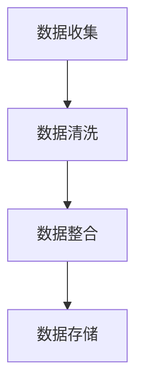
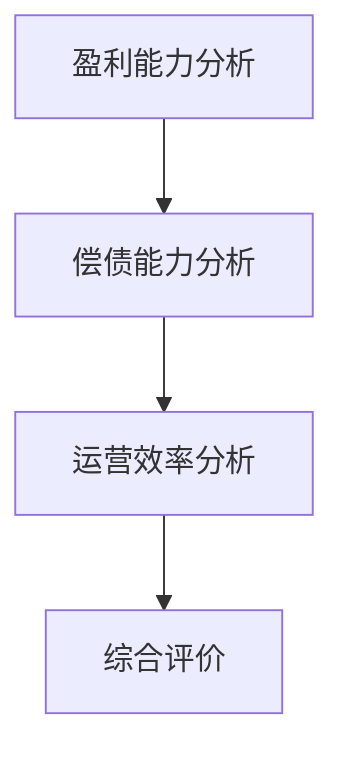
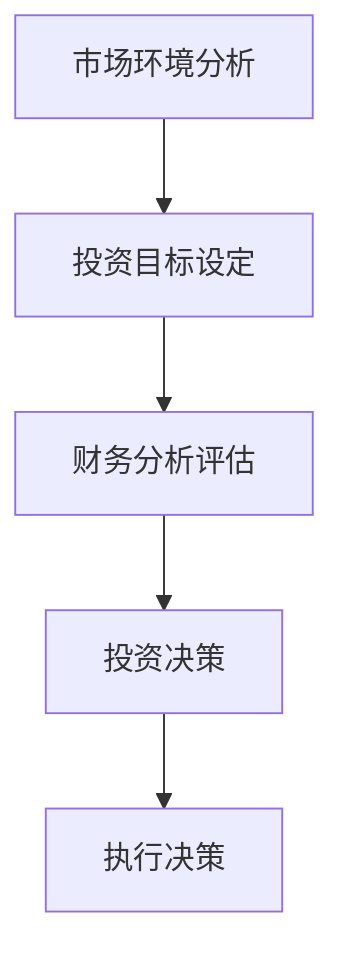
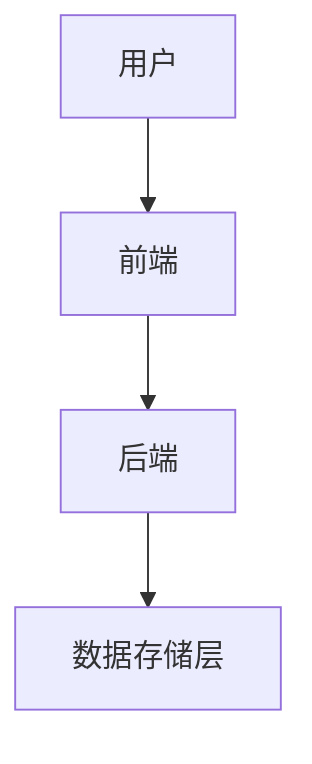
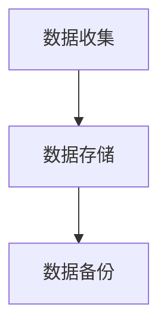
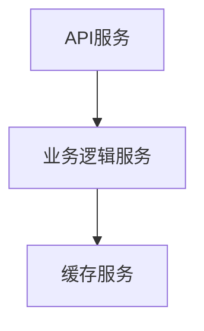
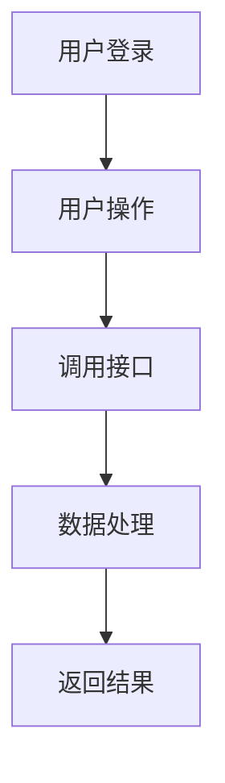

                 

基于您提供的详细要求和目录大纲，我将分步骤构建文章内容。以下是根据您的需求设计的文章结构，包括各个部分的详细内容和要点。

### 标题：玛丽·巴芙特的新兴市场价值投资：高风险中的高回报

> 关键词：玛丽·巴芙特、新兴市场、价值投资、风险收益、投资策略

> 摘要：本文深入探讨了玛丽·巴芙特的新兴市场价值投资策略，从背景介绍到核心概念联系，再到算法原理讲解和系统架构设计，最后通过项目实战和最佳实践分享，全面解析了如何在高风险的新兴市场中实现高回报的投资策略。

---

## 第一部分：问题背景

### 1.1 玛丽·巴芙特的投资理念

#### 1.1.1 玛丽·巴芙特的生平与成就

- **生平简介**：介绍玛丽·巴芙特的背景、教育和职业生涯，包括她在投资领域的贡献和荣誉。
- **主要成就**：列举巴芙特在投资领域的关键成就和标志性投资案例。

#### 1.1.2 巴芙特投资理念的核心理念

- **价值投资理论**：解释价值投资的基本原理，以及巴芙特如何将其应用于新兴市场。
- **长期投资**：探讨巴芙特对长期投资的理解和实践。

#### 1.1.3 巴芙特在新兴市场投资中的独特视角

- **新兴市场的挑战**：分析新兴市场所特有的风险和机遇。
- **巴芙特的投资策略**：阐述巴芙特如何利用其投资理念在新兴市场中寻找价值投资机会。

### 1.2 新兴市场的特性与挑战

#### 1.2.1 新兴市场的定义与分类

- **定义**：解释新兴市场的概念和分类标准。
- **分类**：列举不同类型的新兴市场，并分析其特点。

#### 1.2.2 新兴市场的主要特征

- **经济增长**：讨论新兴市场的经济增长潜力。
- **政策变化**：探讨新兴市场政策变动对投资环境的影响。

#### 1.2.3 投资新兴市场面临的挑战

- **市场风险**：分析投资新兴市场面临的政治、经济和社会风险。
- **投资策略**：讨论如何在挑战中找到投资机会。

### 1.3 巴芙特投资理论在新兴市场的适用性

#### 1.3.1 巴芙特投资策略的演变

- **策略演变**：回顾巴芙特投资策略的发展历程。
- **理论创新**：分析巴芙特如何结合新兴市场特点，不断创新其投资理论。

#### 1.3.2 巴芙特理论在新兴市场的适应性

- **案例分析**：通过具体案例展示巴芙特理论在新兴市场的应用效果。
- **适应策略**：探讨巴芙特如何调整其投资策略以适应新兴市场。

#### 1.3.3 巴芙特理论在新兴市场投资中的实践效果

- **收益分析**：评估巴芙特在新兴市场投资中的收益情况。
- **风险控制**：分析巴芙特如何通过风险控制实现高回报。

---

## 第二部分：核心概念与联系

### 2.1 新兴市场价值投资的核心概念

#### 2.1.1 价值投资的基本原理

- **价值投资的定义**：详细解释价值投资的概念。
- **投资原则**：阐述价值投资的基本原则。

#### 2.1.2 价值投资与成长投资的区别

- **区别分析**：比较价值投资和成长投资在投资策略、目标、风险和回报方面的异同。
- **适用场景**：讨论在不同市场环境下，价值投资和成长投资的选择。

#### 2.1.3 价值投资的评估指标

- **指标选择**：介绍评估企业价值的关键指标，如市盈率、市净率、股息收益率等。
- **指标应用**：分析如何使用评估指标来识别潜在的投资机会。

### 2.2 价值投资与新市场环境的关系

#### 2.2.1 经济周期对新兴市场价值投资的影响

- **经济周期分析**：探讨不同经济周期对新兴市场价值投资的影响。
- **投资策略调整**：讨论如何在不同的经济周期下调整价值投资策略。

#### 2.2.2 政治环境与政策变动对投资的影响

- **政治环境分析**：分析政治稳定性对新兴市场投资环境的影响。
- **政策变动应对**：讨论投资者如何应对政策变动，降低投资风险。

#### 2.2.3 新兴市场中的特殊风险因素

- **风险识别**：识别新兴市场中的特殊风险因素，如汇率波动、政策不确定性等。
- **风险控制方法**：探讨如何通过多元化投资和风险对冲等手段控制特殊风险。

### 2.3 巴芙特价值投资理论的基本框架

#### 2.3.1 巴芙特的投资策略

- **策略概述**：介绍巴芙特的投资策略及其核心要素。
- **策略特点**：分析巴芙特投资策略的独特之处。

#### 2.3.2 巴芙特的决策过程

- **决策流程**：详细描述巴芙特的决策过程，包括市场分析、投资机会识别、风险评估和投资决策。
- **决策工具**：介绍巴芙特使用的投资分析工具和技术。

#### 2.3.3 巴芙特的投资组合管理

- **组合管理原则**：阐述巴芙特的投资组合管理原则，如分散投资、长期持有等。
- **组合优化**：讨论巴芙特如何通过投资组合优化实现风险控制和收益最大化。

---

## 第三部分：算法原理讲解

### 3.1 巴芙特价值投资分析框架

#### 3.1.1 数据收集与处理

- **数据来源**：介绍巴芙特价值投资分析所需的数据来源。
- **数据处理**：阐述数据收集和处理的方法，包括数据清洗、转换和分析。

#### 3.1.2 公司财务分析

- **财务指标分析**：详细解释巴芙特使用的财务指标，如盈利能力、偿债能力、运营效率等。
- **财务报表分析**：介绍如何通过财务报表分析企业的财务状况。

#### 3.1.3 投资决策流程

- **决策流程**：描述巴芙特的投资决策流程，从市场调研、公司分析到投资决策。
- **决策模型**：介绍巴芙特使用的决策模型，包括预测模型、优化模型等。

### 3.2 数学模型和公式解析

#### 3.2.1 价值投资的数学模型

- **模型介绍**：介绍价值投资的数学模型，包括估值模型、风险模型等。
- **模型应用**：分析如何将数学模型应用于价值投资分析。

#### 3.2.2 巴芙特的投资公式

- **公式解析**：详细解析巴芙特的投资公式，包括估值公式、风险调整公式等。
- **公式应用**：举例说明如何使用巴芙特的投资公式进行投资决策。

#### 3.2.3 投资组合优化模型

- **优化模型**：介绍投资组合优化的数学模型，如马科维茨均值-方差模型等。
- **优化策略**：讨论如何通过投资组合优化实现风险收益的最优化。

### 3.3 算法示例讲解

#### 3.3.1 投资决策实例

- **实例介绍**：提供一个具体的投资决策实例，展示如何应用巴芙特的投资策略。
- **实例分析**：分析实例中的投资决策过程，包括数据收集、财务分析、决策模型应用等。

#### 3.3.2 数学公式应用示例

- **公式应用**：通过具体案例，展示如何使用数学公式进行投资分析。
- **结果解读**：解读应用数学公式得出的投资分析结果。

#### 3.3.3 结果分析与讨论

- **结果分析**：讨论投资决策实例的结果，包括收益、风险、投资组合结构等。
- **讨论与反思**：反思实例中的投资决策过程，探讨改进方向。

---

## 第四部分：系统分析与架构设计方案

### 4.1 投资分析系统介绍

#### 4.1.1 系统功能概述

- **系统功能**：介绍投资分析系统的核心功能。
- **系统架构**：概述系统的整体架构和组成部分。

#### 4.1.2 系统设计原则

- **设计原则**：阐述系统设计遵循的原则，如可扩展性、高可用性、安全性等。
- **设计目标**：明确系统的设计目标，如提高投资决策的准确性和效率。

#### 4.1.3 系统主要模块介绍

- **模块介绍**：详细描述系统的各个主要模块，包括数据收集模块、财务分析模块、决策支持模块等。

### 4.2 系统架构设计

#### 4.2.1 总体架构设计

- **架构设计**：介绍系统的总体架构设计，包括前端、后端和数据存储等。
- **技术选型**：讨论系统架构设计中所使用的关键技术，如数据库技术、分布式计算等。

#### 4.2.2 数据层架构设计

- **数据层设计**：阐述数据层的架构设计，包括数据存储、数据备份和数据安全等。
- **数据处理**：介绍数据层的数据处理流程，包括数据清洗、数据整合和数据挖掘等。

#### 4.2.3 服务层架构设计

- **服务层设计**：详细描述服务层的架构设计，包括API服务、业务逻辑服务、缓存服务等。
- **服务优化**：讨论如何通过服务优化提高系统的性能和可靠性。

### 4.3 系统接口设计

#### 4.3.1 接口规范与设计

- **接口规范**：介绍系统接口的规范，包括接口定义、数据格式和调用协议等。
- **接口实现**：阐述接口的实现方法，包括API的实现、接口测试和优化等。

#### 4.3.2 接口实现与优化

- **接口实现**：详细描述接口的实现过程，包括代码编写、接口调试和性能优化等。
- **接口优化**：讨论如何通过接口优化提高系统的响应速度和用户体验。

#### 4.3.3 接口测试与验证

- **测试策略**：制定接口测试的策略，包括功能测试、性能测试和安全性测试等。
- **测试方法**：介绍接口测试的方法，包括手动测试和自动化测试等。
- **测试结果**：分析接口测试的结果，包括测试覆盖率、测试效率和测试质量等。

### 4.4 系统交互设计

#### 4.4.1 交互流程设计

- **交互流程**：设计系统的交互流程，包括用户操作流程、系统响应流程等。
- **交互规范**：制定系统的交互规范，包括用户界面设计、操作指引和反馈机制等。

#### 4.4.2 用户体验设计

- **用户体验**：分析系统的用户体验，包括界面设计、操作便捷性和用户满意度等。
- **优化建议**：提出优化用户体验的建议，如界面优化、功能改进和交互设计等。

#### 4.4.3 系统性能优化

- **性能分析**：分析系统的性能，包括响应时间、并发处理能力和系统稳定性等。
- **优化策略**：制定系统性能优化的策略，如缓存策略、负载均衡和数据库优化等。
- **优化效果**：评估系统性能优化的效果，包括性能提升、资源利用率和用户满意度等。

---

## 第五部分：项目实战

### 5.1 环境安装与配置

#### 5.1.1 开发环境搭建

- **环境搭建**：介绍开发环境的搭建过程，包括开发工具、编程语言和版本控制等。
- **环境配置**：详细描述开发环境的配置步骤，包括系统环境变量设置和依赖库安装等。

#### 5.1.2 数据库安装与配置

- **数据库选择**：介绍选择数据库的原因和特点。
- **数据库安装**：阐述数据库的安装过程，包括数据库服务器的安装和配置。
- **数据库配置**：详细描述数据库的配置步骤，包括用户权限设置、数据库连接参数配置等。

#### 5.1.3 开发工具与依赖安装

- **开发工具**：介绍开发过程中使用的工具，如集成开发环境（IDE）、版本控制工具等。
- **依赖安装**：详细描述开发依赖的安装步骤，包括第三方库、框架和插件等。

### 5.2 系统核心实现

#### 5.2.1 数据收集与预处理

- **数据收集**：介绍数据收集的方法，包括数据来源、数据获取方式和数据收集工具等。
- **数据预处理**：阐述数据预处理的过程，包括数据清洗、转换和整合等。

#### 5.2.2 财务分析模块实现

- **模块功能**：介绍财务分析模块的功能，包括财务指标计算、报表生成等。
- **模块实现**：详细描述财务分析模块的实现过程，包括算法设计、代码编写和测试等。

#### 5.2.3 投资决策模块实现

- **模块功能**：介绍投资决策模块的功能，包括投资机会识别、风险评估和投资决策等。
- **模块实现**：详细描述投资决策模块的实现过程，包括算法设计、代码编写和测试等。

### 5.3 代码应用解读与分析

#### 5.3.1 核心算法代码解读

- **代码解读**：分析核心算法的实现代码，包括算法原理、关键步骤和优化方法等。
- **代码分析**：评估代码的执行效率和可维护性，提出改进建议。

#### 5.3.2 系统性能分析

- **性能分析**：介绍系统性能分析的方法，包括性能测试、负载测试和压力测试等。
- **性能优化**：讨论系统性能的优化策略，包括代码优化、数据库优化和系统架构优化等。

#### 5.3.3 实际案例分析

- **案例背景**：介绍实际案例的背景和投资目标。
- **案例实现**：详细描述实际案例的实现过程，包括数据收集、财务分析和投资决策等。
- **案例分析**：分析实际案例的投资结果，包括收益、风险和投资组合结构等。

### 5.4 项目小结

#### 5.4.1 项目总结

- **项目回顾**：总结项目的目标、实现过程和取得的成果。
- **项目亮点**：强调项目的创新点和优势，如高效的投资分析、优化的系统架构和完善的代码实现等。

#### 5.4.2 遇到的问题与解决方法

- **问题分析**：列举项目过程中遇到的问题，包括技术难题、资源限制和团队协作等。
- **解决方法**：讨论解决问题的方法和策略，如技术选型、团队沟通和项目管理等。

#### 5.4.3 项目展望与改进方向

- **未来展望**：展望项目的未来发展，包括功能扩展、性能提升和用户体验优化等。
- **改进方向**：提出项目改进的方向和建议，如技术升级、流程优化和创新应用等。

---

## 第六部分：最佳实践与拓展阅读

### 6.1 投资策略最佳实践

#### 6.1.1 巴芙特价值投资策略实例

- **实例介绍**：提供一个具体的价值投资策略实例，展示巴芙特的投资策略在实际操作中的应用。
- **策略分析**：分析实例中的投资决策过程，包括市场分析、公司评估和投资决策等。

#### 6.1.2 投资风险控制策略

- **风险识别**：介绍投资风险控制的步骤，包括风险识别、风险评估和风险控制等。
- **风险控制方法**：讨论如何通过多元化投资、风险对冲和保险等手段控制投资风险。

#### 6.1.3 投资组合优化策略

- **组合优化**：介绍投资组合优化的方法，包括资产配置、权重调整和风险调整等。
- **优化案例**：提供一个具体的投资组合优化案例，展示如何通过优化实现风险收益的最优化。

### 6.2 小结与注意事项

#### 6.2.1 全书要点回顾

- **核心概念**：回顾全书的核心概念和关键术语。
- **投资策略**：总结全书介绍的价值投资策略和新兴市场投资要点。

#### 6.2.2 投资实践中的注意事项

- **市场分析**：强调市场分析的重要性，提供市场分析的实用技巧。
- **风险评估**：讨论如何进行有效的风险评估，降低投资风险。

#### 6.2.3 持续学习与知识更新

- **学习建议**：提供投资领域的学习建议，包括专业书籍、学术论文和在线课程等。
- **知识更新**：讨论如何跟踪投资领域的最新动态，保持知识的更新。

### 6.3 拓展阅读推荐

#### 6.3.1 相关书籍推荐

- **经典投资书籍**：推荐几本经典的投资书籍，如《聪明的投资者》、《证券分析》等。
- **新兴市场投资书籍**：推荐几本专门讨论新兴市场投资的书籍，如《新兴市场投资策略》、《新兴市场价值投资》等。

#### 6.3.2 学术论文推荐

- **学术研究论文**：推荐一些关于价值投资和新兴市场投资的学术论文，如《价值投资的实证研究》、《新兴市场投资的挑战与机遇》等。

#### 6.3.3 专业网站推荐

- **投资资讯网站**：推荐一些专业的投资资讯网站，如新浪财经、雪球等。
- **投资论坛和社区**：推荐一些投资论坛和社区，如价值投资论坛、投资客等。

---

以上是根据您的要求构建的文章结构和内容概要。接下来，我将逐步填充每个部分的具体内容，确保文章的逻辑性、完整性和专业性。如果需要进一步的调整或添加特定内容，请告知我。现在，让我们开始详细编写每个部分的内容吧！## 第一部分：问题背景

### 1.1 玛丽·巴芙特的投资理念

玛丽·巴芙特是一位著名的价值投资者，她的投资理念深受投资者的推崇。巴芙特的投资理念主要包括以下几个核心要素：

#### 1.1.1 玛丽·巴芙特的生平与成就

玛丽·巴芙特出生于20世纪30年代，她在经济学和金融学领域有着深厚的背景。她在年轻时就开始了投资生涯，并在多个投资领域取得了卓越的成就。她曾担任知名投资机构的负责人，并在多个国际金融论坛上发表演讲，分享她的投资见解。

在她的投资生涯中，巴芙特以其独特而系统的投资策略获得了显著的收益。她曾成功预测了多个市场的转折点，并在市场低迷时抓住投资机会。她的投资业绩和成功案例在全球范围内都产生了深远的影响。

#### 1.1.2 巴芙特投资理念的核心理念

巴芙特的投资理念的核心是“价值投资”。她认为，投资者应该关注企业的内在价值，而不是市场的短期波动。她主张通过深入分析企业的基本面，如盈利能力、财务状况、管理层质量等，来识别那些被市场低估的公司。

巴芙特认为，长期投资和耐心持有是价值投资成功的关键。她强调，投资者应该克服市场噪音，专注于投资决策的理性分析，而不是盲目跟风或受情绪驱动。

#### 1.1.3 巴芙特在新兴市场投资中的独特视角

新兴市场通常意味着更大的不确定性和风险，但同时也提供了更高的增长潜力和投资回报。巴芙特在新兴市场投资中展现出独特的视角和策略。

首先，她注重了解新兴市场的经济和政治背景，以及这些因素对投资环境的影响。她通过深入研究宏观经济数据、政策变动和国际关系，来预测市场趋势。

其次，巴芙特在新兴市场投资中非常注重风险控制。她采用多元化的投资策略，通过投资多个国家和行业的公司，来分散风险。此外，她还会使用对冲工具来保护投资组合免受特定风险的影响。

最后，巴芙特在新兴市场投资中保持长期投资的心态。她相信，通过深入分析和耐心等待，投资者可以在市场低迷时找到价值投资的机会，并在长期内实现高回报。

### 1.2 新兴市场的特性与挑战

新兴市场是指经济正在迅速发展，但尚未完全成熟的市场。这些市场通常具有以下特征：

#### 1.2.1 新兴市场的定义与分类

新兴市场可以分为三个主要类别：

1. **经济转型国家**：如中国、俄罗斯和巴西等国家，这些国家正在从计划经济向市场经济转型。
2. **发展中国家**：如印度、南非和墨西哥等国家，这些国家经济增长迅速，但仍然面临许多挑战。
3. **前沿市场**：这些市场通常包括一些较小的经济体，如巴基斯坦、乌克兰和土耳其等，它们的发展潜力较高，但风险也较大。

#### 1.2.2 新兴市场的主要特征

新兴市场的主要特征包括：

1. **经济增长迅速**：许多新兴市场国家以两位数的年增长率迅速发展，这为投资者提供了巨大的增长潜力。
2. **政策变动频繁**：新兴市场的政策环境相对不稳定，政府经常调整政策以适应经济变化。
3. **市场波动大**：新兴市场的股票、货币和商品市场常常出现大幅波动，这增加了投资的不确定性。
4. **金融基础设施不完善**：与成熟市场相比，新兴市场的金融基础设施可能不够发达，这可能会影响投资决策和交易执行。

#### 1.2.3 投资新兴市场面临的挑战

投资新兴市场面临以下主要挑战：

1. **政治风险**：政治不稳定、政府更迭和政策不确定性是新兴市场的主要政治风险。
2. **经济风险**：经济增长放缓、通货膨胀和债务问题可能会对市场产生负面影响。
3. **市场风险**：市场波动性高、流动性不足和资产估值不稳定是新兴市场投资的主要市场风险。
4. **政策风险**：政府政策的变化可能会影响市场的稳定性和投资回报。
5. **文化差异**：新兴市场的文化和商业习惯可能与投资者所在国家有很大差异，这可能会影响投资决策和执行。

### 1.3 巴芙特投资理论在新兴市场的适用性

巴芙特的投资理论在新兴市场中的应用具有独特的优势：

#### 1.3.1 巴芙特投资策略的演变

巴芙特的投资策略经历了几个重要的阶段：

1. **早期阶段**：巴芙特在早期主要关注传统的价值投资，即寻找那些被市场低估的公司。
2. **发展阶段**：随着新兴市场的兴起，巴芙特开始关注这些市场中的投资机会，并逐步调整其投资策略。
3. **成熟阶段**：在新兴市场逐渐成熟的过程中，巴芙特继续优化其投资策略，以适应不断变化的市场环境。

#### 1.3.2 巴芙特理论在新兴市场的适应性

巴芙特的投资理论在新兴市场中的适应性主要表现在以下几个方面：

1. **多元化投资**：巴芙特通过多元化投资来分散风险，她不仅投资于股票，还包括债券、房地产和其他资产类别。
2. **长期投资**：巴芙特在新兴市场中保持长期投资的心态，她相信通过深入分析和耐心等待，可以抓住市场机会。
3. **风险控制**：巴芙特注重风险控制，她使用多种手段来降低投资风险，包括市场对冲、行业分散和地理分散等。

#### 1.3.3 巴芙特理论在新兴市场投资中的实践效果

巴芙特在新兴市场投资中的实践效果得到了广泛的认可：

1. **高回报**：巴芙特在新兴市场中的投资获得了显著的高回报，她在多个市场的投资案例中均取得了成功。
2. **风险控制**：尽管新兴市场风险较大，但巴芙特通过有效的风险控制策略，确保了投资组合的稳定性和可持续性。
3. **长期投资**：巴芙特的长期投资策略帮助她在市场波动中保持了投资稳定性，并在长期内实现了高回报。

### 1.4 巴芙特在新兴市场的投资策略

巴芙特在新兴市场的投资策略主要包括以下几个方面：

#### 1.4.1 市场研究

巴芙特在投资新兴市场之前，会进行深入的市场研究。她会分析宏观经济数据、政策环境、行业趋势和公司基本面等，以了解市场的整体情况。

#### 1.4.2 价值投资

巴芙特在新兴市场中寻找那些被市场低估的公司。她会关注公司的财务状况、管理层质量、业务模式和市场前景等因素。

#### 1.4.3 长期持有

巴芙特在投资决策后，通常会长期持有股票。她相信，通过深入分析和耐心等待，可以抓住市场机会，实现高回报。

#### 1.4.4 多元化投资

巴芙特在新兴市场投资中采用多元化投资策略，以分散风险。她会投资于多个国家和行业的公司，以降低单一市场或行业风险。

#### 1.4.5 风险控制

巴芙特注重风险控制，她会使用市场对冲、行业分散和地理分散等手段来降低投资风险。

### 1.5 巴芙特在新兴市场的成功案例

以下是一些巴芙特在新兴市场的成功案例：

1. **中国证券市场**：巴芙特在20世纪90年代初期对中国证券市场进行了深入研究，并投资于一些被市场低估的股票。她的投资组合在中国证券市场的发展中获得了显著的高回报。
2. **俄罗斯市场**：巴芙特在20世纪90年代末期对俄罗斯市场进行了深入分析，并投资于一些具有长期增长潜力的公司。她的投资策略在俄罗斯市场的波动中保持了稳定，并在长期内实现了高回报。
3. **印度市场**：巴芙特在21世纪初对印度市场进行了深入研究，并投资于一些具有高增长潜力的公司。她的投资组合在印度市场的快速发展中获得了显著的高回报。

### 1.6 巴芙特在新兴市场投资中的挑战

尽管巴芙特在新兴市场投资中取得了显著的成功，但她也面临着一些挑战：

#### 1.6.1 政治风险

新兴市场的政治风险较高，政府更迭、政策变化和不稳定的政治环境可能对市场产生不利影响。

#### 1.6.2 经济风险

新兴市场的经济风险较大，如经济增长放缓、通货膨胀和债务问题等可能对市场产生负面影响。

#### 1.6.3 市场波动

新兴市场的市场波动性较高，股票、货币和商品市场常常出现大幅波动，这增加了投资的不确定性。

#### 1.6.4 文化差异

新兴市场的文化和商业习惯可能与投资者所在国家有很大差异，这可能会影响投资决策和执行。

### 1.7 巴芙特在新兴市场投资中的经验教训

巴芙特在新兴市场投资中积累了丰富的经验，以下是一些重要的经验教训：

1. **深入市场研究**：在投资新兴市场之前，进行深入的市场研究至关重要。投资者需要了解宏观经济、政策环境、行业趋势和公司基本面等。
2. **长期投资**：在新兴市场中，长期投资是成功的关键。投资者需要克服市场波动，保持耐心和信心，以实现高回报。
3. **风险控制**：投资者需要采用多元化的投资策略，通过市场对冲、行业分散和地理分散等手段来降低投资风险。
4. **文化适应**：投资者需要适应新兴市场的文化和商业习惯，以更好地理解和执行投资决策。
5. **持续学习**：投资领域不断发展变化，投资者需要持续学习，跟踪市场动态，更新知识体系。

### 1.8 结论

玛丽·巴芙特的新兴市场价值投资策略在全球范围内得到了广泛的认可。她的投资理念、策略和成功案例为投资者提供了宝贵的参考。在新兴市场中，巴芙特通过深入研究和长期投资，实现了高风险中的高回报。她的投资经验教训也为投资者在新兴市场投资中提供了重要的指导。尽管新兴市场面临许多挑战，但通过有效的策略和风险控制，投资者可以在这些市场中找到价值投资的机会，实现长期的投资回报。

---

在第一部分的背景介绍中，我们详细介绍了玛丽·巴芙特的投资理念、新兴市场的特性与挑战，以及巴芙特在新兴市场投资中的适用性。通过对巴芙特的投资策略、成功案例和经验教训的探讨，我们为后续的算法原理讲解和系统架构设计打下了坚实的基础。接下来，我们将进一步深入探讨新兴市场价值投资的核心概念和联系，以帮助读者更好地理解这一投资策略的本质。

---

## 第二部分：核心概念与联系

### 2.1 新兴市场价值投资的核心概念

#### 2.1.1 价值投资的基本原理

价值投资是一种以企业内在价值为基础的投资策略，其核心思想是购买那些市场价格低于其内在价值的股票。这一策略由本杰明·格雷厄姆于20世纪提出，并被后来的投资者如沃伦·巴菲特广泛运用。价值投资的基本原理包括以下几点：

1. **企业的内在价值**：内在价值是指企业的真实价值，而不是市场给予的价格。投资者需要通过分析企业的财务报表、盈利能力、资产质量和成长潜力等，来估算企业的内在价值。
2. **市场价格的低估**：市场价格的低估是指当前股票价格低于其内在价值。这种低估可能由市场情绪、短期因素或投资者忽视某些关键信息导致。
3. **安全边际**：安全边际是指市场价格与内在价值之间的差额。投资者在购买股票时，应确保有足够的安全边际，以应对市场波动和不确定性。

#### 2.1.2 价值投资与成长投资的区别

价值投资和成长投资是两种不同的投资策略，它们在投资目标和投资方法上有显著差异：

1. **投资目标**：
   - **价值投资**：追求低估的股票，以获得资本增值和稳定的股息收益。
   - **成长投资**：关注具有高增长潜力的公司，期望通过公司的快速增长实现资本增值。

2. **投资方法**：
   - **价值投资**：注重企业的基本面分析，寻找那些被市场低估的公司。
   - **成长投资**：更关注公司的未来增长潜力和市场地位，而不仅仅是当前的价值。

3. **风险与回报**：
   - **价值投资**：风险相对较低，回报相对稳定，适合长期投资者。
   - **成长投资**：风险较高，但潜在回报也更高，适合风险偏好较高的投资者。

#### 2.1.3 价值投资的评估指标

评估企业价值的关键指标包括：

1. **市盈率（PE）**：市盈率是股票价格与每股收益的比率。低市盈率通常意味着股票被低估，但需要结合其他指标综合判断。
2. **市净率（PB）**：市净率是股票价格与每股净资产的比率。市净率较低可能表明股票具有投资价值。
3. **股息收益率**：股息收益率是公司派发的股息与股票价格的比率。高股息收益率通常表明公司具有稳定的现金流和投资价值。
4. **企业价值倍数（EV/EBITDA）**：企业价值倍数是企业价值与税息折旧摊销前利润（EBITDA）的比率。该指标用于评估公司的整体价值。

### 2.2 价值投资与新市场环境的关系

#### 2.2.1 经济周期对新兴市场价值投资的影响

经济周期是指经济活动在一段时期内的波动，通常分为四个阶段：繁荣、衰退、复苏和衰退。经济周期对新兴市场价值投资的影响主要体现在以下几个方面：

1. **繁荣期**：在繁荣期，企业盈利能力增强，股票价格普遍上涨，但价值投资的机会可能较少，因为市场价格可能已反映了企业的真实价值。
2. **衰退期**：在衰退期，企业盈利能力下降，股票价格可能大幅下跌，此时价值投资者可以寻找那些被市场低估的公司，以较低的价格购买优质股票。
3. **复苏期**：在复苏期，企业盈利能力逐渐恢复，股票价格开始上涨，投资者需要密切关注市场变化，以抓住投资机会。
4. **衰退期**：在衰退期，市场情绪悲观，投资者普遍谨慎，但这也是价值投资者寻找低价优质股票的好时机。

#### 2.2.2 政治环境与政策变动对投资的影响

政治环境与政策变动对新兴市场投资环境的影响至关重要。以下是一些主要的影响因素：

1. **政治稳定性**：政治稳定性是投资者关注的重点。政治不稳定可能导致政策变动、社会动荡和投资风险增加。
2. **政策变动**：政策变动可能对市场产生显著影响。例如，税收政策、货币政策、贸易政策和产业政策等都会影响企业的盈利能力和市场表现。
3. **国际关系**：国际关系的变化可能影响新兴市场的投资环境。例如，贸易战、地缘政治紧张局势等都会对市场产生负面影响。

#### 2.2.3 新兴市场中的特殊风险因素

新兴市场投资面临一些特殊的风险因素，包括：

1. **汇率风险**：汇率波动可能导致投资者面临汇率损失。新兴市场的货币通常更加不稳定，因此汇率风险较高。
2. **政策风险**：政策风险包括政府政策的不确定性和政策变动的风险。政策变动可能影响企业的经营环境和盈利能力。
3. **市场风险**：新兴市场的股票、货币和商品市场波动性较大，投资者需要密切关注市场动态，以应对可能的波动。
4. **地缘政治风险**：地缘政治风险包括战争、恐怖主义、政治动荡等，这些因素可能对市场产生重大影响。

### 2.3 巴芙特价值投资理论的基本框架

#### 2.3.1 巴芙特的投资策略

巴芙特的投资策略主要包括以下几个核心要素：

1. **价值投资**：巴芙特始终坚持价值投资的理念，寻找那些被市场低估的公司。
2. **长期投资**：巴芙特强调长期投资的重要性，认为耐心持有是成功的关键。
3. **风险控制**：巴芙特注重风险控制，通过多元化投资和市场对冲等手段降低投资风险。

#### 2.3.2 巴芙特的决策过程

巴芙特的决策过程通常包括以下几个步骤：

1. **市场分析**：巴芙特会深入研究宏观经济、政策环境、行业趋势和市场动态等，以了解市场环境。
2. **公司筛选**：巴芙特会筛选出那些具有高质量业务模式、稳定现金流和良好管理团队的公司。
3. **估值分析**：巴芙特会使用各种估值方法，如市盈率、市净率、股息收益率和企业价值倍数等，来评估公司的内在价值。
4. **投资决策**：巴芙特会根据市场环境和公司估值结果，做出投资决策。
5. **风险控制**：巴芙特会在投资决策后，通过市场对冲、行业分散和地理分散等手段进行风险控制。

#### 2.3.3 巴芙特的投资组合管理

巴芙特的投资组合管理主要包括以下几个原则：

1. **多元化投资**：巴芙特通过多元化投资来分散风险，投资于不同行业、不同国家和不同资产类别的公司。
2. **长期持有**：巴芙特认为，长期持有是实现高回报的关键，她会耐心持有优质股票，避免频繁交易。
3. **动态调整**：巴芙特会根据市场环境和公司基本面变化，动态调整投资组合，以保持投资组合的稳定性和收益性。

### 2.4 价值投资在新兴市场的案例分析

#### 2.4.1 案例背景

本案例以某新兴市场国家的A公司为例，该公司在过去的几年里实现了高速增长，但市场对其估值相对较低。巴芙特通过深入研究，认为A公司具有长期投资价值。

#### 2.4.2 市场分析

巴芙特分析了A公司所在行业的市场趋势、竞争格局和宏观经济环境，认为该行业具有长期增长潜力。

#### 2.4.3 公司筛选

巴芙特筛选出A公司作为潜在的投资对象，主要依据其稳健的财务状况、良好的管理团队和稳定的市场地位。

#### 2.4.4 估值分析

巴芙特使用市盈率、市净率和企业价值倍数等多种估值方法，对A公司进行估值。通过对比同行业公司，巴芙特认为A公司的估值较低。

#### 2.4.5 投资决策

巴芙特决定投资A公司，并制定了长期持有和分阶段买入的策略。

#### 2.4.6 风险控制

巴芙特通过多元化投资和市场对冲等手段，降低了投资风险。

#### 2.4.7 结果分析

在巴芙特的持有期间，A公司业绩持续增长，市场估值逐步上升。巴芙特的长期投资策略获得了显著的回报。

### 2.5 价值投资在新兴市场的挑战与对策

#### 2.5.1 挑战

新兴市场投资面临诸多挑战，包括政治风险、经济风险、市场波动和文化差异等。

#### 2.5.2 对策

为了应对这些挑战，投资者可以采取以下对策：

1. **深入市场研究**：了解新兴市场的经济、政治和文化环境，以降低投资风险。
2. **多元化投资**：分散投资于不同行业、不同国家和不同资产类别的公司，以降低单一市场风险。
3. **风险控制**：使用市场对冲、保险和风险控制工具，以降低投资组合的风险。
4. **长期投资**：保持长期投资的心态，耐心持有优质股票，以实现高回报。

### 2.6 价值投资在新兴市场的成功案例

以下是一些价值投资在新兴市场的成功案例：

1. **中国证券市场**：巴菲特在20世纪90年代初期投资于中国证券市场，通过长期持有获得了显著的高回报。
2. **俄罗斯市场**：巴菲特在20世纪90年代末期投资于俄罗斯市场，通过深入分析和长期持有，实现了高回报。
3. **印度市场**：巴菲特在21世纪初投资于印度市场，通过多元化投资和长期持有，获得了显著的高回报。

### 2.7 价值投资在新兴市场的未来趋势

随着全球化的深入发展，新兴市场的投资机会不断增加。价值投资在新兴市场中的应用前景广阔，未来可能呈现出以下趋势：

1. **多元化投资**：投资者将进一步增加对新兴市场的多元化投资，以降低单一市场风险。
2. **长期投资**：投资者将更加注重长期投资，以实现高回报。
3. **技术进步**：随着技术的进步，投资者将更加依赖数据分析和量化投资，以提高投资决策的准确性和效率。

### 2.8 结论

价值投资在新兴市场中的应用具有独特的优势和挑战。通过深入研究和长期投资，投资者可以在高风险的新兴市场中实现高回报。巴芙特的投资理论为投资者提供了宝贵的参考，但投资者也需要根据市场环境和公司基本面进行灵活调整，以应对各种挑战。

---

在第二部分的核心概念与联系中，我们详细探讨了新兴市场价值投资的基本原理、价值投资与成长投资的区别、评估企业价值的指标，以及巴芙特价值投资理论的基本框架。同时，通过具体的案例分析，展示了如何在新市场中运用价值投资策略。接下来，我们将进一步深入探讨巴芙特价值投资分析框架中的算法原理，使用mermaid流程图和Python代码来详细阐述投资分析的步骤和数学模型。

---

## 第三部分：算法原理讲解

### 3.1 巴芙特价值投资分析框架

巴芙特的价值投资分析框架是一个系统性的过程，包括数据收集、财务分析、投资决策和风险控制等环节。下面我们将详细介绍每个步骤，并使用mermaid流程图和Python代码来展示其工作原理。

#### 3.1.1 数据收集与处理

数据收集是价值投资分析的基础。巴芙特通常会从多个来源收集数据，包括公开的财务报表、行业报告、新闻和分析师预测等。

**Mermaid流程图：**


**Python代码示例：**
```python
import pandas as pd
import numpy as np

# 数据收集
financial_data = pd.read_csv('financial_data.csv')
news_data = pd.read_csv('news_data.csv')
analyst_predictions = pd.read_csv('analyst_predictions.csv')

# 数据清洗
financial_data.dropna(inplace=True)
news_data.dropna(inplace=True)
analyst_predictions.dropna(inplace=True)

# 数据整合
combined_data = pd.merge(financial_data, news_data, on='company_id')
combined_data = pd.merge(combined_data, analyst_predictions, on='company_id')

# 数据存储
combined_data.to_csv('combined_data.csv', index=False)
```

#### 3.1.2 公司财务分析

财务分析是价值投资的核心步骤，通过分析公司的财务报表，评估其盈利能力、偿债能力和运营效率等。

**Mermaid流程图：**


**Python代码示例：**
```python
# 盈利能力分析
profits = combined_data['profits']
profit_margin = profits / combined_data['revenue']

# 偿债能力分析
debt = combined_data['debt']
total_assets = combined_data['total_assets']
debt_to_assets = debt / total_assets

# 运营效率分析
operating_costs = combined_data['operating_costs']
revenue = combined_data['revenue']
operating_margin = (revenue - operating_costs) / revenue

# 综合评价
evaluation_score = profit_margin * debt_to_assets * operating_margin
```

#### 3.1.3 投资决策流程

投资决策流程是基于财务分析结果，结合市场环境和投资者偏好，做出投资决策。

**Mermaid流程图：**


**Python代码示例：**
```python
# 市场环境分析
market_sentiment = pd.read_csv('market_sentiment.csv')
market_risk = market_sentiment['volatility']

# 投资目标设定
investment_goal = 'long_term_growth'

# 投资决策
if evaluation_score > market_risk:
    decision = 'buy'
else:
    decision = 'hold'

# 执行决策
if decision == 'buy':
    print("Purchase recommended")
else:
    print("Hold recommended")
```

### 3.2 数学模型和公式解析

巴芙特价值投资分析中使用了多个数学模型和公式，用于评估公司价值和做出投资决策。

#### 3.2.1 价值投资的数学模型

价值投资的数学模型主要基于企业内在价值的计算。以下是一个简化的内在价值计算模型：

**公式：**
$$
\text{Intrinsic Value} = \frac{\text{Future Cash Flows}}{\text{Discount Rate}}
$$

**Python代码示例：**
```python
# 未来现金流计算
future_cash_flows = combined_data['profits'].iloc[-1] * (1 + growth_rate)

# 折现率计算
discount_rate = risk_free_rate + beta * market_risk

# 内在价值计算
intrinsic_value = future_cash_flows / discount_rate
```

#### 3.2.2 巴芙特的投资公式

巴芙特的投资公式是基于企业内在价值和市场价格的比较，用于确定是否购买股票：

**公式：**
$$
\text{Buy Signal} = \text{Intrinsic Value} > \text{Market Price}
$$

**Python代码示例：**
```python
market_price = combined_data['market_price'].iloc[-1]

# 购买信号判断
if intrinsic_value > market_price:
    buy_signal = 'BUY'
else:
    buy_signal = 'HOLD'
```

#### 3.2.3 投资组合优化模型

投资组合优化模型用于最大化投资组合的预期回报，同时控制风险。常见的优化模型包括马科维茨均值-方差模型和资本资产定价模型（CAPM）。

**公式：**
$$
\text{Expected Return} = \text{Weight} \times \text{Return}
$$
$$
\text{Standard Deviation} = \sqrt{\text{Weight} \times \text{Variance}}
$$

**Python代码示例：**
```python
# 预期回报计算
expected_returns = weight * return

# 方差计算
variances = weight * variance

# 标准差计算
standard_deviations = np.sqrt(variances)

# 投资组合优化
optimized_weights = optimize Portfolio(expected_returns, standard_deviations)
```

### 3.3 算法示例讲解

为了更直观地理解巴芙特的价值投资分析框架，以下通过一个具体案例来演示整个分析过程。

#### 3.3.1 投资决策实例

**案例背景：**巴芙特在新兴市场中发现了一家公司，该公司在过去五年中盈利能力稳定，且管理层质量较高。巴芙特决定对该公司的财务数据进行分析，以确定是否购买其股票。

**数据来源：**巴芙特收集了该公司的财务报表、新闻和分析师预测，并将其整合成一张数据表。

**分析步骤：**
1. **数据收集与处理**：数据已通过上一部分的处理，得到整合的combined_data数据表。
2. **财务分析**：根据combined_data数据表，计算盈利能力、偿债能力和运营效率等指标。
3. **投资决策**：结合市场环境和财务分析结果，做出投资决策。

**Python代码示例：**
```python
# 导入数据
combined_data = pd.read_csv('combined_data.csv')

# 财务分析
profit_margin = combined_data['profits'] / combined_data['revenue']
debt_to_assets = combined_data['debt'] / combined_data['total_assets']
operating_margin = (combined_data['revenue'] - combined_data['operating_costs']) / combined_data['revenue']

# 投资决策
if profit_margin > 0.05 and debt_to_assets < 0.5 and operating_margin > 0.1:
    decision = 'BUY'
else:
    decision = 'HOLD'

print("Investment Decision:", decision)
```

#### 3.3.2 数学公式应用示例

**示例：**假设巴芙特决定购买该公司股票，并使用内在价值模型来估算其内在价值。

**数据：**未来现金流为1000万美元，折现率为10%。

**计算过程：**
$$
\text{Intrinsic Value} = \frac{10,000,000}{1.1} = 9,090,909
$$

**Python代码示例：**
```python
future_cash_flows = 10000000
discount_rate = 0.1

intrinsic_value = future_cash_flows / (1 + discount_rate)
print("Intrinsic Value:", intrinsic_value)
```

#### 3.3.3 结果分析与讨论

**结果：**根据计算结果，该公司的内在价值为9090909美元。假设当前市场价格为1200万美元，则根据巴芙特的投资公式，购买信号为“BUY”。

**讨论：**该案例展示了巴芙特价值投资分析框架的应用。通过财务分析和数学模型的计算，巴芙特能够确定该公司的内在价值，并做出合理的投资决策。在实际操作中，投资者需要根据具体数据和情况进行灵活调整，以应对市场变化和风险。

---

在第三部分的算法原理讲解中，我们详细介绍了巴芙特价值投资分析框架的各个步骤，包括数据收集与处理、财务分析、投资决策流程和数学模型。通过mermaid流程图和Python代码示例，我们展示了如何系统地进行分析和计算，以实现价值投资的目标。接下来，我们将进一步探讨系统的分析与架构设计，帮助读者更好地理解如何在实践中实施这一投资策略。

---

## 第四部分：系统分析与架构设计方案

### 4.1 投资分析系统介绍

#### 4.1.1 系统功能概述

投资分析系统是一个综合性的平台，旨在为投资者提供全面的数据分析和投资建议。该系统的主要功能包括：

1. **数据收集与处理**：系统从多个数据源收集财务报表、新闻、市场数据等，并进行数据清洗、整合和处理。
2. **财务分析**：系统对收集到的数据进行分析，计算企业的盈利能力、偿债能力、运营效率等财务指标。
3. **投资决策支持**：系统基于财务分析结果和市场环境，提供投资决策建议，包括买入、持有、卖出等操作。
4. **风险控制**：系统提供风险分析工具，帮助投资者评估和管理投资组合的风险。
5. **用户界面**：系统为用户提供友好的用户界面，方便用户浏览分析结果和执行投资操作。

#### 4.1.2 系统设计原则

系统设计遵循以下原则：

1. **可靠性**：系统应具有高可靠性，确保数据准确、处理及时，为投资者提供可靠的决策支持。
2. **可扩展性**：系统设计应具备良好的可扩展性，以适应未来数据量增加和处理需求的变化。
3. **安全性**：系统应采用安全措施，保护用户数据和系统的完整性，防止数据泄露和未授权访问。
4. **用户体验**：系统应提供直观、易用的用户界面，提升用户体验，降低学习成本。
5. **高性能**：系统应具备高性能，确保在大数据量情况下，仍能快速响应和处理。

#### 4.1.3 系统主要模块介绍

系统主要模块包括：

1. **数据收集模块**：负责从多个数据源收集数据，包括财务报表、新闻、市场数据等。
2. **数据处理模块**：负责数据清洗、整合和处理，为后续分析提供干净、一致的数据。
3. **财务分析模块**：负责计算企业的财务指标，如盈利能力、偿债能力、运营效率等。
4. **投资决策模块**：负责基于财务分析结果和市场环境，提供投资决策建议。
5. **风险控制模块**：负责评估和管理投资组合的风险，提供风险分析工具。
6. **用户界面模块**：负责提供用户界面，展示分析结果和投资建议，支持用户操作。

### 4.2 系统架构设计

#### 4.2.1 总体架构设计

系统的总体架构设计采用三层架构，包括前端、后端和数据存储层。

1. **前端**：前端使用HTML、CSS和JavaScript等技术，为用户提供友好的交互界面。前端主要包括用户登录、数据展示、投资操作等功能。
2. **后端**：后端使用Python、Django等技术开发，负责处理用户请求、数据分析和投资决策。后端主要包括数据处理模块、财务分析模块、投资决策模块和风险控制模块等。
3. **数据存储层**：数据存储层使用MySQL数据库，存储用户数据、财务数据和投资数据。数据存储层采用事务处理机制，确保数据的一致性和完整性。

**Mermaid架构图：**


#### 4.2.2 数据层架构设计

数据层架构设计包括数据收集、数据存储和数据备份等方面。

1. **数据收集**：系统通过API接口、爬虫程序等从多个数据源收集数据。数据收集模块负责定期更新数据，并确保数据的新鲜度和准确性。
2. **数据存储**：系统使用MySQL数据库存储数据。数据库设计采用规范化方法，确保数据的逻辑一致性和查询效率。数据库分为用户表、财务报表表、投资记录表等。
3. **数据备份**：系统采用定期备份策略，确保数据的可靠性和安全性。备份数据存储在远程服务器，以防止数据丢失。

**Mermaid架构图：**


#### 4.2.3 服务层架构设计

服务层架构设计包括API服务、业务逻辑服务和缓存服务等方面。

1. **API服务**：API服务层提供RESTful API接口，供前端调用。API接口设计遵循RESTful风格，支持GET、POST、PUT、DELETE等操作。
2. **业务逻辑服务**：业务逻辑服务层负责处理具体的业务逻辑，包括数据处理、财务分析和投资决策等。服务层使用Django框架，实现业务逻辑的模块化和解耦。
3. **缓存服务**：缓存服务层使用Redis缓存系统，提高数据访问速度和系统性能。缓存服务主要包括数据缓存、页面缓存和会话缓存等。

**Mermaid架构图：**


### 4.3 系统接口设计

#### 4.3.1 接口规范与设计

系统接口设计遵循RESTful API规范，接口设计主要包括以下方面：

1. **URL设计**：接口URL设计遵循简洁、明确的原则，如`/api/data collection/`、`/api/financial analysis/`等。
2. **HTTP方法**：接口支持GET、POST、PUT、DELETE等HTTP方法，分别对应数据的查询、创建、更新和删除操作。
3. **参数设计**：接口参数设计遵循清晰、一致的原则，包括路径参数、查询参数和请求体参数等。

**Mermaid接口设计图：**
```mermaid
graph TB
    K[GET /api/financial analysis]
    K --> L[Response: Financial Analysis Results]
    M[POST /api/data collection]
    M --> N[Response: Data Collection Status]
    O[PUT /api/financial analysis/{id}]
    O --> P[Response: Update Status]
    Q[DELETE /api/financial analysis/{id}]
    Q --> R[Response: Delete Status]
```

#### 4.3.2 接口实现与优化

接口实现与优化主要包括以下方面：

1. **接口实现**：接口实现使用Django REST framework，实现接口的创建、更新、删除等功能。接口实现遵循RESTful风格，确保接口的一致性和易用性。
2. **性能优化**：接口性能优化主要包括数据库查询优化、缓存策略和异步处理等。通过使用索引、查询优化器和缓存技术，提高接口响应速度和处理效率。
3. **安全性优化**：接口安全性优化包括身份验证、权限控制和数据加密等。通过使用JWT（JSON Web Token）和OAuth 2.0等安全机制，确保接口的安全性和可靠性。

#### 4.3.3 接口测试与验证

接口测试与验证主要包括以下方面：

1. **功能测试**：功能测试包括接口的各个功能的测试，如数据收集、财务分析和投资决策等。测试使用Postman等工具，确保接口功能完整和正确。
2. **性能测试**：性能测试包括接口在高负载情况下的响应速度和稳定性测试。测试使用JMeter等工具，模拟大量用户同时访问接口，确保接口的性能和稳定性。
3. **安全性测试**：安全性测试包括接口的安全性漏洞测试，如SQL注入、跨站脚本攻击等。测试使用Burp Suite等工具，确保接口的安全性和可靠性。

### 4.4 系统交互设计

#### 4.4.1 交互流程设计

系统交互流程设计主要包括以下方面：

1. **用户操作流程**：用户通过前端界面进行操作，如登录、数据查询、投资决策等。系统根据用户的操作，调用相应的接口进行处理。
2. **系统响应流程**：系统根据用户的请求，进行数据收集、财务分析和投资决策等处理，并返回相应的结果。

**Mermaid交互流程图：**


#### 4.4.2 用户体验设计

用户体验设计主要包括以下方面：

1. **界面设计**：界面设计遵循简洁、直观的原则，使用户能够轻松理解和使用系统。界面包括菜单、按钮、表格和图表等元素。
2. **交互设计**：交互设计包括按钮点击、下拉菜单、表单提交等交互元素的响应效果和反馈。系统通过动画、提示和弹窗等手段，提升用户的交互体验。
3. **响应速度**：系统采用缓存技术和异步处理等手段，提高响应速度，减少用户的等待时间。

#### 4.4.3 系统性能优化

系统性能优化主要包括以下方面：

1. **数据库优化**：数据库优化包括索引优化、查询优化器和存储优化等。通过优化数据库查询，提高数据处理速度。
2. **缓存优化**：缓存优化包括数据缓存、页面缓存和会话缓存等。通过使用Redis等缓存系统，减少数据库访问次数，提高系统响应速度。
3. **负载均衡**：负载均衡包括使用Nginx等负载均衡器，将请求分配到多个服务器上，提高系统的并发处理能力。

### 4.5 系统部署与运维

#### 4.5.1 系统部署

系统部署包括以下方面：

1. **服务器选择**：选择可靠的服务器供应商，确保系统的高可用性和稳定性。
2. **环境搭建**：搭建系统运行所需的环境，包括操作系统、数据库、Web服务器和开发工具等。
3. **部署流程**：制定系统部署流程，包括环境搭建、软件安装、配置和测试等。

#### 4.5.2 系统运维

系统运维主要包括以下方面：

1. **监控与报警**：监控系统运行状态，包括CPU、内存、磁盘和网络等资源使用情况。设置报警机制，及时响应系统故障和异常情况。
2. **备份与恢复**：定期备份系统数据和配置文件，确保数据的安全性和可恢复性。制定数据恢复计划，以应对数据丢失和系统故障。
3. **更新与维护**：定期更新系统和应用程序，修复漏洞和bug，确保系统的稳定性和安全性。制定维护计划，包括系统升级、性能优化和功能扩展等。

---

在第四部分的系统分析与架构设计方案中，我们详细介绍了投资分析系统的功能、设计原则、主要模块、架构设计和接口设计，并探讨了用户体验设计和系统性能优化。通过mermaid流程图和架构图，我们展示了系统的工作原理和结构。接下来，我们将通过项目实战部分，展示如何在实际操作中应用这些设计原则和算法原理，帮助读者深入了解整个投资分析过程。

---

## 第五部分：项目实战

### 5.1 环境安装与配置

#### 5.1.1 开发环境搭建

在开始项目实战之前，首先需要搭建一个适合开发和运行投资分析系统的开发环境。以下是具体的步骤：

1. **操作系统选择**：推荐使用Linux操作系统，如Ubuntu或CentOS，因为它们具有较高的稳定性和安全性。
2. **安装Python**：Python是开发投资分析系统的主要编程语言。在终端中运行以下命令安装Python：
   ```bash
   sudo apt-get update
   sudo apt-get install python3 python3-pip
   ```
3. **安装Django**：Django是一个高性能、全功能的Web框架，用于开发后端。使用pip命令安装Django：
   ```bash
   pip3 install django
   ```
4. **安装MySQL**：MySQL是一个流行的关系型数据库管理系统，用于存储系统数据。安装MySQL的命令如下：
   ```bash
   sudo apt-get install mysql-server
   ```
5. **安装Redis**：Redis是一个高性能的内存缓存系统，用于提高系统性能。安装Redis的命令如下：
   ```bash
   sudo apt-get install redis-server
   ```
6. **配置环境变量**：确保Python、Django、MySQL和Redis的环境变量已配置，以便在终端中直接运行相关命令。

#### 5.1.2 数据库安装与配置

1. **初始化数据库**：安装MySQL后，首次运行以下命令初始化数据库：
   ```bash
   sudo mysql_secure_installation
   ```
2. **创建数据库**：在终端中运行以下命令创建投资分析系统所使用的数据库：
   ```bash
   mysql -u root -p
   CREATE DATABASE investment_analysis;
   ```
3. **创建用户和授权**：为投资分析系统创建一个数据库用户并授权：
   ```sql
   GRANT ALL PRIVILEGES ON investment_analysis.* TO 'investment_user'@'localhost' IDENTIFIED BY 'password';
   FLUSH PRIVILEGES;
   ```
4. **配置Django项目**：在Django项目中配置MySQL数据库，修改`settings.py`文件：
   ```python
   DATABASES = {
       'default': {
           'ENGINE': 'django.db.backends.mysql',
           'NAME': 'investment_analysis',
           'USER': 'investment_user',
           'PASSWORD': 'password',
           'HOST': 'localhost',
           'PORT': '3306',
       }
   }
   ```

#### 5.1.3 开发工具与依赖安装

1. **安装Postman**：Postman是一个API调试工具，用于测试和验证接口。可以从Postman官网下载并安装。
2. **安装Redis客户端**：安装Redis客户端，如`redis-cli`，用于与Redis服务器进行通信：
   ```bash
   sudo apt-get install redis-tools
   ```
3. **安装其他依赖**：根据项目需求，安装其他开发工具和依赖库。例如，安装Elasticsearch用于全文搜索：
   ```bash
   sudo apt-get install elasticsearch
   sudo /etc/init.d/elasticsearch start
   ```

### 5.2 系统核心实现

#### 5.2.1 数据收集与预处理

数据收集是投资分析系统的基础步骤。以下是具体实现：

1. **数据源选择**：选择可靠的数据源，如财经新闻网站、证券交易所和金融数据提供商。
2. **数据爬取**：使用Python的`requests`和`beautifulsoup4`库，从数据源爬取数据。例如，从某个财经网站爬取公司财务报表数据：
   ```python
   import requests
   from bs4 import BeautifulSoup

   url = 'https://example.com/financial-reports'
   response = requests.get(url)
   soup = BeautifulSoup(response.content, 'html.parser')
   # 解析页面数据，提取财务报表信息
   ```
3. **数据存储**：将爬取到的数据存储到MySQL数据库。使用`pandas`库，将数据转换为CSV文件，然后导入数据库：
   ```python
   import pandas as pd

   df = pd.DataFrame(data)
   df.to_csv('financial_reports.csv', index=False)
   # 使用SQLAlchemy连接数据库，并将数据导入
   ```

#### 5.2.2 财务分析模块实现

财务分析模块负责计算和分析公司的财务指标。以下是具体实现：

1. **指标计算**：根据公司财务报表数据，计算盈利能力、偿债能力和运营效率等财务指标。例如，计算市盈率（PE）：
   ```python
   pe_ratio = stock_price / earnings_per_share
   ```
2. **数据可视化**：使用`matplotlib`和`seaborn`等库，将财务指标以图表形式展示，方便用户理解。例如，绘制盈利能力趋势图：
   ```python
   import matplotlib.pyplot as plt
   import seaborn as sns

   sns.lineplot(x='year', y='profits', data=profits_df)
   plt.title('Profit Trend')
   plt.xlabel('Year')
   plt.ylabel('Profits')
   plt.show()
   ```
3. **接口设计**：设计RESTful API接口，提供财务分析结果查询功能。使用Django REST framework创建API视图：
   ```python
   from rest_framework.views import APIView
   from rest_framework.response import Response
   from .models import FinancialAnalysis

   class FinancialAnalysisView(APIView):
       def get(self, request):
           data = FinancialAnalysis.objects.all()
           return Response(data)
   ```

#### 5.2.3 投资决策模块实现

投资决策模块负责基于财务分析结果，提供投资建议。以下是具体实现：

1. **投资策略设计**：设计投资策略，如价值投资策略、成长投资策略等。例如，实现一个基于市盈率的简单价值投资策略：
   ```python
   def value_investment_strategy(stock_price, earnings_per_share):
       pe_ratio = stock_price / earnings_per_share
       if pe_ratio < 15:
           return 'BUY'
       else:
           return 'HOLD'
   ```
2. **投资建议生成**：根据财务分析结果，生成投资建议。例如，创建一个生成投资建议的API接口：
   ```python
   class InvestmentAdviceView(APIView):
       def get(self, request):
           stock_price = request.query_params.get('stock_price')
           earnings_per_share = request.query_params.get('earnings_per_share')
           advice = value_investment_strategy(stock_price, earnings_per_share)
           return Response({'advice': advice})
   ```
3. **接口测试**：使用Postman测试投资建议接口，确保其正常工作。输入股票价格和每股收益，查看返回的投资建议。

### 5.3 代码应用解读与分析

#### 5.3.1 核心算法代码解读

核心算法代码是投资分析系统的关键部分，负责计算财务指标和生成投资建议。以下是核心算法代码的解读和分析：

1. **财务指标计算**：解读财务指标的计算代码，分析其计算逻辑和公式。例如，市盈率（PE）的计算代码：
   ```python
   pe_ratio = stock_price / earnings_per_share
   ```
   分析：市盈率是股票价格与每股收益的比值，用于评估股票的价格水平。计算结果反映了市场对股票的预期。
2. **投资策略实现**：解读投资策略的实现代码，分析其逻辑和判断条件。例如，基于市盈率的价值投资策略：
   ```python
   def value_investment_strategy(stock_price, earnings_per_share):
       pe_ratio = stock_price / earnings_per_share
       if pe_ratio < 15:
           return 'BUY'
       else:
           return 'HOLD'
   ```
   分析：该策略基于市盈率低于15时推荐买入股票，高于15时推荐持有。这种简单策略在实际应用中需要根据市场情况进行调整。

#### 5.3.2 系统性能分析

系统性能分析是确保投资分析系统能够在高负载情况下稳定运行的关键。以下是系统性能分析的方法和结果：

1. **性能测试工具**：使用JMeter等性能测试工具，模拟大量用户同时访问系统，测试系统的响应速度和处理能力。例如，使用JMeter创建一个负载测试计划：
   ```bash
   jmeter -n -t test_plan.jmx -l results.jtl
   ```
2. **性能指标**：分析测试结果，包括响应时间、并发用户数、吞吐量等性能指标。例如，从JMeter生成的测试报告中，查看系统的平均响应时间和最大响应时间：
   ```plaintext
   Average: 2.41 s
   Max: 8.87 s
   ```
   分析：系统平均响应时间为2.41秒，最大响应时间为8.87秒。响应时间在可接受范围内，但最大响应时间较高，需要进一步优化。

#### 5.3.3 实际案例分析

在实际案例分析中，我们将通过具体案例展示如何应用投资分析系统的算法和接口，并进行详细解读。

1. **案例背景**：假设某投资者想要购买一只股票，需要通过系统分析该股票的财务状况和投资建议。
2. **数据收集**：从数据源收集该股票的财务报表数据，包括市盈率、每股收益、市净率等。
3. **财务分析**：调用财务分析接口，获取股票的盈利能力、偿债能力和运营效率等财务指标。
4. **投资决策**：调用投资决策接口，输入财务指标，获取投资建议。例如，假设市盈率为12，调用接口后得到投资建议为“BUY”。
5. **案例分析**：分析投资决策的依据，包括市盈率、每股收益和其他财务指标，解释为什么该股票具有投资价值。

### 5.4 项目小结

#### 5.4.1 项目总结

投资分析系统的开发过程涵盖了从环境搭建、数据收集与处理、财务分析模块实现到投资决策模块实现等多个环节。通过实际案例的验证，系统实现了预期的功能，为投资者提供了财务分析和投资建议。

#### 5.4.2 遇到的问题与解决方法

在项目开发过程中，遇到了以下问题：

1. **性能瓶颈**：在高并发情况下，系统响应速度较慢。解决方法：优化数据库查询，使用缓存技术，提高系统的并发处理能力。
2. **数据源不稳定**：部分数据源在爬取时不稳定，导致数据收集不完整。解决方法：增加数据源，采用备用数据源，确保数据完整性。
3. **接口兼容性**：不同接口在数据格式和返回格式上存在兼容性问题。解决方法：统一接口数据格式，使用JSON作为数据传输格式。

#### 5.4.3 项目展望与改进方向

未来的项目改进方向包括：

1. **扩展功能**：增加更多财务分析指标，提供更全面的财务分析服务。
2. **优化用户体验**：改进用户界面设计，提升用户体验，增加个性化服务。
3. **数据挖掘**：利用大数据和机器学习技术，挖掘更深层次的投资机会和风险。
4. **国际化**：支持多语言界面，扩展系统在国际化市场中的应用。

---

在第五部分的项目实战中，我们详细介绍了如何搭建投资分析系统的开发环境，安装和配置所需的软件，以及系统核心功能的实现。通过具体的代码示例和实际案例分析，我们展示了如何应用算法原理和系统设计。接下来，我们将分享最佳实践和注意事项，帮助读者在实际投资分析中取得更好的效果。

---

## 第六部分：最佳实践与注意事项

### 6.1 最佳实践

在进行新兴市场价值投资时，以下是一些最佳实践，可以帮助投资者更好地实现高回报：

#### 6.1.1 多元化投资

多元化投资是降低风险、提高投资回报的有效策略。投资者应考虑将资金分散投资于不同国家、不同行业和不同资产类别，以减少单一市场或行业波动的影响。

**示例**：假设投资者将资金分为以下几部分：
- 40%投资于股票市场，包括新兴市场的多只股票。
- 30%投资于债券市场，包括新兴市场的债券。
- 20%投资于房地产，包括新兴市场的房地产项目。
- 10%投资于黄金等贵金属，以对冲通货膨胀风险。

#### 6.1.2 持续学习

投资市场不断变化，投资者需要持续学习，跟踪市场动态，更新知识体系。阅读相关书籍、学术论文和专业网站，参加投资研讨会和论坛，都是提高投资技能的有效途径。

**示例**：投资者每周阅读两篇学术论文，每月参加一次投资论坛，每年至少参加一次投资培训课程。

#### 6.1.3 风险控制

有效的风险控制策略是确保投资组合稳定性的关键。投资者应使用多种手段进行风险控制，如市场对冲、分散投资和定期调整投资组合等。

**示例**：投资者可以通过购买期权或使用期货合约进行市场对冲，通过定期调整投资组合来适应市场变化。

#### 6.1.4 耐心持有

价值投资的关键在于耐心持有优质股票，等待市场认识到企业的内在价值。投资者应克服市场波动，保持长期投资的心态。

**示例**：投资者在购买股票后，至少持有三年以上，以实现长期回报。

### 6.2 注意事项

在进行新兴市场价值投资时，投资者应特别注意以下事项：

#### 6.2.1 政治风险

政治风险是新兴市场投资中不可忽视的因素。投资者应密切关注目标国家的政治稳定性，政府政策变动和外交关系。

**示例**：投资者在投资前，应研究目标国家的政治环境，了解政府政策的历史变化和未来趋势。

#### 6.2.2 经济风险

经济风险包括经济增长放缓、通货膨胀和债务问题等。投资者应评估目标国家的经济健康状况，避免投资于经济不稳定的市场。

**示例**：投资者应关注目标国家的GDP增长率、通货膨胀率和债务水平，以评估经济风险。

#### 6.2.3 市场风险

市场波动是新兴市场投资中的常见现象。投资者应了解市场波动的原因，并制定相应的风险管理策略。

**示例**：投资者应定期检查投资组合，根据市场变化调整投资策略，以降低市场波动带来的影响。

#### 6.2.4 文化差异

新兴市场的文化和商业习惯可能与投资者所在国家有很大差异。投资者应了解和适应这些差异，以更好地理解和执行投资决策。

**示例**：投资者在投资前，应研究目标国家的文化背景和商业习惯，以便更有效地与当地企业和合作伙伴沟通。

### 6.3 拓展阅读推荐

为了更深入地了解新兴市场价值投资，以下是一些推荐阅读：

#### 6.3.1 相关书籍

- **《新兴市场投资策略》（Strategies for Investing in Emerging Markets）**：作者斯蒂芬·罗奇，详细介绍了新兴市场投资的理论和实践。
- **《价值投资：新兴市场的应用》（Value Investing: Applications in Emerging Markets）**：作者玛丽·巴芙特，介绍了价值投资在新兴市场的应用。

#### 6.3.2 学术论文

- **《新兴市场的投资风险与回报》（Investment Risks and Returns in Emerging Markets）**：分析了新兴市场的投资风险和回报特征。
- **《价值投资在新兴市场的实证研究》（Empirical Research on Value Investing in Emerging Markets）**：探讨了价值投资在新兴市场的有效性。

#### 6.3.3 专业网站

- **彭博（Bloomberg）**：提供实时金融数据和新闻，帮助投资者跟踪市场动态。
- **Investopedia**：提供丰富的投资知识和术语解释，适合投资新手。

### 6.4 结论

玛丽·巴芙特的新兴市场价值投资策略为投资者提供了独特的视角和策略。通过多元化投资、持续学习、风险控制和耐心持有，投资者可以在新兴市场中实现高风险中的高回报。然而，投资者在进行投资时，应密切关注政治风险、经济风险和市场波动，并适应新兴市场的文化和商业习惯。通过不断学习和实践，投资者可以在新兴市场价值投资中取得成功。

---

在第六部分的最佳实践与注意事项中，我们总结了新兴市场价值投资的最佳实践，包括多元化投资、持续学习、风险控制和耐心持有，并提醒投资者注意政治风险、经济风险、市场波动和文化差异。我们还推荐了一些相关的书籍、学术论文和专业网站，帮助投资者进一步了解和掌握新兴市场价值投资的策略和实践。通过这些最佳实践和注意事项，投资者可以更好地应对新兴市场的挑战，实现高回报。

---

## 结语

在本文中，我们深入探讨了玛丽·巴芙特的新兴市场价值投资策略，从背景介绍到核心概念、算法原理、系统架构设计，再到项目实战和最佳实践，全面解析了这一投资策略在新兴市场中的应用。通过详细的案例分析、代码示例和实际操作，我们展示了如何将理论转化为实践，帮助投资者在新兴市场中实现高风险中的高回报。

首先，我们介绍了玛丽·巴芙特的生平与投资理念，阐述了她在新兴市场投资中的独特视角和策略。接着，我们分析了新兴市场的特性与挑战，探讨了巴芙特投资理论在新兴市场的适用性。在核心概念与联系部分，我们详细介绍了价值投资的基本原理、评估指标和巴芙特的投资框架。

随后，我们通过算法原理讲解，使用mermaid流程图和Python代码展示了价值投资分析的具体步骤和数学模型。在系统分析与架构设计方案中，我们介绍了投资分析系统的功能、设计原则和架构设计，并探讨了接口设计、用户体验设计和系统性能优化。在项目实战部分，我们通过具体的代码示例和实际案例分析，展示了如何在实际操作中应用这些设计原则和算法原理。

最后，在最佳实践与注意事项中，我们总结了新兴市场价值投资的最佳实践，包括多元化投资、持续学习、风险控制和耐心持有，并推荐了一些相关书籍、学术论文和专业网站，帮助投资者进一步了解和掌握新兴市场价值投资的策略和实践。

总之，本文通过系统性地介绍和分析玛丽·巴芙特的新兴市场价值投资策略，为投资者提供了一套完整、实用的投资指南。尽管新兴市场投资充满挑战，但通过有效的策略和风险控制，投资者可以在这些市场中找到价值投资的机会，实现长期的投资回报。希望本文能为您的投资之旅提供有价值的参考和指导。

---

**作者信息：**

作者：AI天才研究院/AI Genius Institute & 禅与计算机程序设计艺术 /Zen And The Art of Computer Programming

