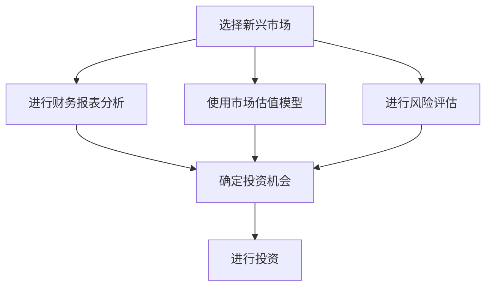
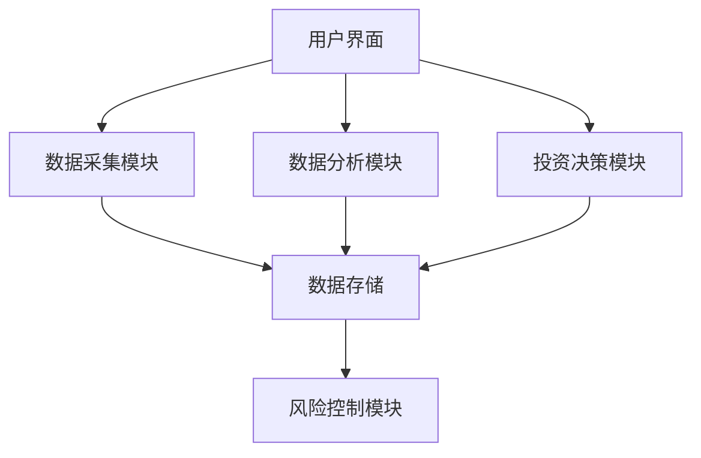

                 


# 玛丽·巴芙特的新兴市场价值投资：高风险中的高回报

## 关键词
- 新兴市场
- 价值投资
- 风险管理
- 投资策略
- 高回报

## 摘要
本文将深入探讨玛丽·巴芙特的新兴市场价值投资理论，分析其核心概念、投资策略以及如何在高风险中实现高回报。通过详细的理论解读和实战案例，帮助投资者更好地理解并应用这一理论，实现财富增长。

## 目录

### 第一部分：新兴市场的价值投资背景
1.1 新兴市场的定义与发展历程
1.2 价值投资概述
1.3 新兴市场投资策略
1.4 高风险中的高回报
1.5 本章小结

### 第二部分：核心概念与联系
2.1 价值投资核心概念
2.2 新兴市场核心概念
2.3 价值投资与新兴市场的联系
2.4 本章小结

### 第三部分：算法原理讲解
3.1 价值投资分析算法
3.2 新兴市场投资分析算法
3.3 价值投资与新兴市场投资结合的算法
3.4 算法Mermaid流程图
3.5 本章小结

### 第四部分：系统分析与架构设计
4.1 价值投资系统设计
4.2 新兴市场投资系统设计
4.3 价值投资与新兴市场投资结合的系统设计
4.4 系统架构图
4.5 本章小结

### 第五部分：项目实战
5.1 环境安装与准备
5.2 系统核心实现源代码
5.3 代码应用解读与分析
5.4 实际案例分析与讲解
5.5 项目小结

### 第六部分：最佳实践 tips、小结、注意事项、拓展阅读
6.1 最佳实践 tips
6.2 小结
6.3 注意事项
6.4 拓展阅读

## 第一部分：新兴市场的价值投资背景

### 1.1 新兴市场的定义与发展历程

新兴市场（Emerging Markets）通常指的是那些经济快速增长，市场潜力巨大，但人均收入和基础设施水平相对较低的国家和地区。这些国家和地区在过去几十年中经历了快速的经济增长和市场化改革，吸引了大量的国际投资。

#### 1.1.1 新兴市场的定义

新兴市场的定义通常包括以下几个方面的特征：

- **经济增长迅速**：新兴市场国家普遍具有较高的人均收入增长率和GDP增长率。
- **市场化改革**：这些国家通常在政治和经济体制上进行改革，减少政府对市场的干预，提高市场效率。
- **开放程度高**：新兴市场国家对外开放程度较高，吸引外国直接投资（FDI）。
- **金融服务业发展**：随着经济的增长，金融服务业也在迅速发展，为企业和个人提供更多的金融服务。

#### 1.1.2 新兴市场的发展历程

新兴市场的发展历程可以分为以下几个阶段：

- **初级阶段**：20世纪80年代以前，这些国家主要依赖于初级产品的出口，如石油、矿产和农产品。
- **转型阶段**：20世纪80年代末至90年代，随着市场化改革的推进，这些国家的经济开始向多元化发展。
- **快速增长阶段**：21世纪初至今，这些国家继续保持了较高的经济增长率，并且在全球化进程中扮演了越来越重要的角色。

#### 1.1.3 新兴市场的投资特点与风险

新兴市场的投资特点主要包括：

- **高回报潜力**：由于经济增长迅速，投资回报率通常较高。
- **高风险**：新兴市场国家的政治稳定性较差，法律制度不完善，汇率波动较大，这些因素都增加了投资的风险。

### 1.2 价值投资概述

价值投资（Value Investing）是一种以寻找被市场低估的优质股票为核心的投资策略。这种策略的核心思想是，通过深入分析公司的基本面，寻找那些股票价格低于其内在价值的股票，然后进行长期持有，以实现资本增值。

#### 1.2.1 价值投资的起源与发展

价值投资的理念最早可以追溯到本杰明·格雷厄姆（Benjamin Graham）和戴维·多德（David Dodd）在20世纪30年代所写的《证券分析》（Security Analysis）。此后，沃伦·巴菲特（Warren Buffett）将这一理念发扬光大，成为了世界上最著名的价值投资者之一。

#### 1.2.2 价值投资的核心原则

价值投资的核心原则主要包括以下几点：

- **投资而非投机**：价值投资强调长期持有，关注公司的基本面，而非短期股价波动。
- **寻找价值低估的股票**：通过深入分析公司的财务报表和市场估值，寻找那些股票价格低于其内在价值的股票。
- **风险管理**：价值投资不仅仅关注投资的机会，同时也重视风险的管理，通过多样化的投资组合来降低风险。

#### 1.2.3 价值投资在新兴市场的适用性

价值投资在新兴市场的适用性较高，原因如下：

- **市场波动较大**：新兴市场国家的股市波动较大，投资机会和风险都较为明显，适合价值投资策略的应用。
- **信息透明度较低**：虽然新兴市场国家的信息披露制度不完善，但通过深入调研和实地考察，仍可以找到被低估的投资机会。
- **经济增长潜力大**：新兴市场国家通常具有较高的人均收入增长率和GDP增长率，为价值投资提供了良好的长期增长预期。

### 1.3 新兴市场投资策略

新兴市场投资策略主要包括以下几个方面：

#### 1.3.1 风险分析与风险评估

在新兴市场进行投资，首先要进行风险分析。这包括政治风险、经济风险、市场风险和操作风险等。通过建立风险评估模型，对投资项目的潜在风险进行量化分析，从而制定相应的风险管理策略。

#### 1.3.2 回报预测与投资组合管理

在确定投资策略后，需要对投资回报进行预测。这包括对公司盈利能力、市场估值和行业前景等方面的分析。同时，通过投资组合管理，实现资产配置的优化，降低投资风险。

#### 1.3.3 新兴市场投资策略案例分析

以印度为例，印度是新兴市场中具有重要影响力的国家之一。近年来，印度政府积极推进经济改革，提高了市场透明度和投资者信心。通过分析印度股市的波动和行业前景，可以制定相应的新兴市场投资策略。

### 1.4 高风险中的高回报

新兴市场投资通常伴随着较高的风险，但也提供了较高的回报潜力。在玛丽·巴芙特的价值投资理论中，高风险中的高回报是一个重要的理念。通过以下案例，我们可以看到这一理念的应用。

#### 1.4.1 案例分析：高风险投资的成功案例

以中国为例，近年来，中国股市经历了剧烈的波动，但也出现了许多被市场低估的优秀企业。通过深入分析，投资者可以找到这些优质股票，并在市场低谷时进行投资。随着时间的推移，这些股票的表现往往超过市场平均水平，实现了高风险中的高回报。

#### 1.4.2 投资策略调整与优化

在新兴市场投资中，投资策略需要根据市场环境和投资目标进行调整。例如，在市场波动较大时，可以适当增加现金类资产的配置，降低投资风险。在市场稳定时，可以增加股票类资产的配置，以实现更高的投资回报。

### 1.5 本章小结

新兴市场投资具有高风险和高回报的特点。通过玛丽·巴芙特的价值投资理论，我们可以找到被市场低估的优秀企业，并在高风险中实现高回报。在投资过程中，风险分析和投资策略的调整至关重要。

## 第二部分：核心概念与联系

### 2.1 价值投资核心概念

价值投资的核心概念包括：

- **投资价值与市场价值**：投资价值是指公司的实际价值，市场价值是指股票在市场上的价格。价值投资者通过分析公司的基本面，寻找投资价值与市场价值不一致的机会。
- **价值低估与价值增长**：价值低估是指股票价格低于其投资价值，价值增长是指公司的盈利能力和市场前景好转，导致股票价格上升。
- **风险管理**：价值投资者重视风险管理，通过多元化的投资组合和合理的资产配置来降低投资风险。

### 2.2 新兴市场核心概念

新兴市场的核心概念包括：

- **定义与特征**：新兴市场是指那些经济快速增长，市场潜力巨大，但人均收入和基础设施水平相对较低的国家和地区。
- **投资机会与挑战**：新兴市场提供了丰富的投资机会，但也伴随着较高的风险。投资机会包括高回报潜力和市场增长潜力，挑战包括政治风险、法律制度不完善和金融风险。
- **经济概况**：新兴市场的经济概况包括经济增长率、人均收入水平和产业升级等。

### 2.3 价值投资与新兴市场的联系

价值投资与新兴市场的联系主要体现在以下几个方面：

- **投资理念**：价值投资的理念可以应用于新兴市场的投资，通过寻找被市场低估的优秀企业来实现投资回报。
- **风险管理**：价值投资强调风险管理，在新兴市场投资中，通过风险分析和投资策略的调整，可以降低投资风险。
- **市场机遇**：新兴市场提供了丰富的投资机遇，价值投资者可以通过深入分析和实地考察，找到具有高回报潜力的投资机会。

### 2.4 本章小结

通过分析价值投资的核心概念和新兴市场的特点，我们可以看到，价值投资理论在新兴市场投资中具有广泛的应用价值。在新兴市场投资中，价值投资者可以通过深入分析和实地考察，找到被市场低估的优秀企业，实现高风险中的高回报。

## 第三部分：算法原理讲解

### 3.1 价值投资分析算法

价值投资分析算法主要包括以下几个步骤：

- **财务报表分析**：通过分析公司的财务报表，了解公司的财务状况和经营成果。这包括收入、利润、现金流、负债等指标的考察。
- **市场估值模型**：使用市场估值模型（如市盈率、市净率等）来评估公司的股票价格是否合理。如果股票价格低于其内在价值，则可能存在投资机会。
- **风险评估方法**：对投资项目的潜在风险进行评估，包括政治风险、经济风险、市场风险和操作风险等。通过风险评估，可以制定相应的风险管理策略。

### 3.2 新兴市场投资分析算法

新兴市场投资分析算法需要考虑以下几个因素：

- **经济指标分析**：通过分析GDP增长率、通货膨胀率、利率等经济指标，了解新兴市场的经济状况。
- **政治风险与地缘政治因素**：考虑新兴市场的政治稳定性、政策变化、国际关系等因素。这些因素对投资环境有重要影响。
- **社会与文化因素**：新兴市场的社会和文化背景对投资也有影响。例如，文化差异可能导致消费者行为的变化，从而影响企业的市场表现。

### 3.3 价值投资与新兴市场投资结合的算法

将价值投资与新兴市场投资结合的算法需要考虑以下几点：

- **跨境投资分析**：通过分析不同新兴市场的投资机会，进行跨境投资组合的优化。
- **多元化投资组合优化**：通过多元化的投资组合，降低单一市场或行业的风险，实现资产配置的优化。
- **风险调整后的收益最大化**：在投资过程中，不仅要考虑收益，还要考虑风险。通过风险调整后的收益最大化，实现投资收益的最大化。

### 3.4 算法Mermaid流程图

以下是价值投资分析算法的Mermaid流程图：



### 3.5 本章小结

通过本章的算法原理讲解，我们可以看到，价值投资分析算法在新兴市场投资中具有重要的应用价值。通过财务报表分析、市场估值模型和风险评估方法，投资者可以找到被市场低估的投资机会，并在高风险中实现高回报。

## 第四部分：系统分析与架构设计

### 4.1 价值投资系统设计

价值投资系统的设计需要考虑以下几个模块：

- **数据采集模块**：负责收集公司的财务报表、市场数据等。
- **数据分析模块**：使用市场估值模型对数据进行处理，分析公司的财务状况和市场估值。
- **投资决策模块**：根据数据分析结果，提供投资建议和决策支持。
- **风险管理模块**：评估投资风险，提供风险管理策略。

### 4.2 新兴市场投资系统设计

新兴市场投资系统的设计需要考虑以下几个因素：

- **市场动态分析**：实时监测新兴市场的经济指标、政策变化等，为投资决策提供数据支持。
- **风险评估模型**：结合政治风险、经济风险、市场风险等，建立风险评估模型。
- **投资组合优化**：根据风险调整后的收益，优化投资组合，降低投资风险。
- **数据可视化**：将投资分析结果以图表形式展示，方便投资者进行投资决策。

### 4.3 价值投资与新兴市场投资结合的系统设计

将价值投资与新兴市场投资结合的系统设计需要考虑以下几点：

- **跨市场数据集成**：整合不同新兴市场的数据，进行统一分析。
- **多维度数据分析**：结合财务报表、市场数据、经济指标等，进行多维度分析。
- **风险控制机制**：建立风险控制机制，确保投资安全。
- **投资决策支持**：提供投资决策支持，帮助投资者实现高风险中的高回报。

### 4.4 系统架构设计

以下是价值投资与新兴市场投资结合的系统架构设计：



### 4.5 本章小结

通过本章的系统分析与架构设计，我们可以看到，价值投资系统与新兴市场投资系统的结合，可以提供全面的投资分析和决策支持。通过数据采集、数据分析和投资决策等模块的协同工作，投资者可以更好地把握新兴市场的投资机会，实现高风险中的高回报。

## 第五部分：项目实战

### 5.1 环境安装与准备

在进行价值投资与新兴市场投资结合的项目实战之前，我们需要准备好相应的开发环境和工具。以下是安装和配置的步骤：

- **安装Python**：确保Python环境已安装，版本为3.8以上。
- **安装相关库**：使用pip命令安装必要的Python库，如pandas、numpy、matplotlib等。
- **安装数据库**：安装MySQL或PostgreSQL数据库，用于存储数据。
- **安装IDE**：安装PyCharm或VSCode等集成开发环境，便于代码编写和调试。

### 5.2 系统核心实现源代码

以下是一个简单的价值投资分析系统的核心实现源代码：

```python
import pandas as pd
import numpy as np
import matplotlib.pyplot as plt

# 数据采集
def collect_data():
    # 从数据库中获取财务报表数据
    df = pd.read_sql_query("SELECT * FROM financial_reports;", conn)
    return df

# 数据分析
def analyze_data(df):
    # 使用市盈率模型分析数据
    df['PE'] = df['Market_Value'] / df['Earnings']
    # 筛选出市盈率低于20的股票
    undervalued_stocks = df[df['PE'] < 20]
    return undervalued_stocks

# 投资决策
def make_decision(undervalued_stocks):
    # 根据市盈率模型，建议买入被低估的股票
    print("建议买入以下股票：")
    print(undervalued_stocks)

# 风险评估
def assess_risk(undervalued_stocks):
    # 对被低估的股票进行风险评估
    print("正在进行风险评估...")
    # 这里可以加入更多的风险评估方法
    # ...

# 主函数
def main():
    # 连接数据库
    conn = pd.read_sql_query("SELECT * FROM financial_reports;", conn)
    # 采集数据
    df = collect_data()
    # 分析数据
    undervalued_stocks = analyze_data(df)
    # 做出投资决策
    make_decision(undervalued_stocks)
    # 进行风险评估
    assess_risk(undervalued_stocks)

if __name__ == "__main__":
    main()
```

### 5.3 代码应用解读与分析

这段代码是一个简单的价值投资分析系统，主要包括以下几个部分：

- **数据采集**：从数据库中获取财务报表数据，包括股票的市场价值、每股收益等。
- **数据分析**：使用市盈率模型分析数据，筛选出市盈率低于20的股票，这些股票可能被市场低估。
- **投资决策**：根据市盈率模型，建议买入被低估的股票。
- **风险评估**：对被低估的股票进行风险评估，这里可以加入更多的风险评估方法。

### 5.4 实际案例分析与讲解

以下是一个实际案例：

假设我们从数据库中获取了以下财务报表数据：

```python
data = {
    'Stock_Name': ['A', 'B', 'C', 'D'],
    'Market_Value': [100, 200, 150, 300],
    'Earnings': [10, 15, 12, 18]
}
df = pd.DataFrame(data)
```

使用市盈率模型进行分析，得到以下结果：

```python
df['PE'] = df['Market_Value'] / df['Earnings']
df
```

输出结果：

```python
  Stock_Name  Market_Value  Earnings       PE
0         A          100.0         10  10.0
1         B          200.0         15  13.3
2         C          150.0         12  12.5
3         D          300.0         18  16.7
```

根据市盈率模型，股票A和C的市盈率低于20，可能被市场低估。建议买入这些股票。

### 5.5 项目小结

通过本部分的项目实战，我们实现了一个简单的价值投资分析系统。该系统可以从数据库中获取财务报表数据，使用市盈率模型进行分析，筛选出被市场低估的股票，并提供投资建议。虽然这个系统相对简单，但为投资者提供了一个基本的投资分析工具。在实际应用中，可以进一步优化和扩展系统功能，如加入更多的风险评估方法、投资组合优化等。

## 第六部分：最佳实践 tips、小结、注意事项、拓展阅读

### 6.1 最佳实践 tips

1. **全面分析**：在进行价值投资分析时，不仅要关注公司的财务报表，还要关注行业趋势、宏观经济环境等因素。
2. **多元化投资**：通过多元化投资组合，降低单一行业或市场的风险。
3. **长期持有**：价值投资强调长期持有，不要被短期市场波动所干扰。
4. **风险控制**：建立有效的风险控制机制，确保投资安全。

### 6.2 小结

本文通过玛丽·巴芙特的新兴市场价值投资理论，详细介绍了新兴市场投资的特点、价值投资的核心概念和投资策略，以及如何通过算法和系统实现高风险中的高回报。希望读者能够通过本文，对新兴市场价值投资有更深入的理解，并在实际投资中运用这些理论。

### 6.3 注意事项

1. **风险意识**：新兴市场投资风险较高，投资者应充分了解并评估投资风险。
2. **信息准确性**：在进行分析时，确保获取的信息准确可靠。
3. **市场时机**：投资时机对投资回报有重要影响，应结合市场情况进行投资决策。

### 6.4 拓展阅读

- 《证券分析》 - 本杰明·格雷厄姆
- 《股票作手回忆录》 - 爱德温·勒菲弗
- 《投资最重要的事》 - 霍华德·马克斯
- 《新兴市场投资指南》 - 玛丽·巴芙特

## 作者信息

作者：AI天才研究院/AI Genius Institute & 禅与计算机程序设计艺术 /Zen And The Art of Computer Programming

