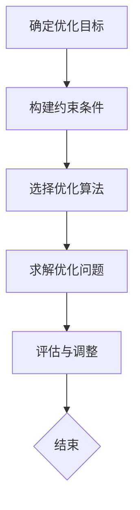
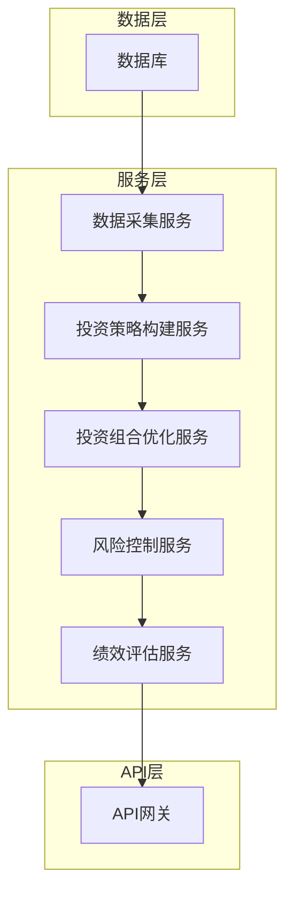

                 


### 核心概念与联系

在探讨性别多元化投资策略之前，我们首先需要明确一些核心概念，并建立它们之间的联系。性别多元化投资不仅仅是一个投资领域的策略，它更是一个涉及社会、经济、文化和伦理等多方面因素的复杂概念。以下是几个关键的核心概念及其属性对比表格，以帮助我们更好地理解这个概念：

#### 1. 性别多元化

**定义：** 性别多元化指的是在组织、团队或投资组合中纳入不同性别的个体，以便充分利用不同性别带来的多样性。

**属性对比：**

| 特性 | 女性 | 男性 |
| ---- | ---- | ---- |
| 创新思维 | 独立思考、关注细节 | 整体思维、风险偏好 |
| 领导风格 | 情感导向、合作导向 | 结果导向、竞争导向 |
| 交流方式 | 语言细腻、强调沟通 | 直接表达、行动导向 |
| 投资偏好 | 长期投资、风险意识 | 短期投资、风险偏好 |

#### 2. 投资策略

**定义：** 投资策略是在特定市场环境下，为实现投资目标而采取的具体投资方法和行动计划。

**属性对比：**

| 策略类型 | 女性投资者 | 男性投资者 |
| ---- | ---- | ---- |
| 长期投资 | 稳健、风险分散 | 冒险、集中投资 |
| 风险管理 | 风险预防、多元化 | 风险承担、杠杆操作 |
| 资讯利用 | 深入研究、长期积累 | 快速反应、即时资讯 |

#### 3. 性别多元化投资策略

**定义：** 性别多元化投资策略是将性别多元化原则应用于投资决策，旨在通过多样化的投资组合来提高回报并降低风险。

**属性对比：**

| 特征 | 传统投资 | 性别多元化投资 |
| ---- | ---- | ---- |
| 资产配置 | 同质性高 | 同质性低、多样性高 |
| 风险控制 | 单一风险控制 | 多元风险控制 |
| 回报预期 | 单一市场波动 | 多元市场波动 |
| 长期效果 | 潜在回报低 | 潜在回报高 |

### ER 模型

为了更清晰地展示性别多元化投资策略中的各要素关系，我们可以使用 ER（Entity-Relationship）模型来构建一个简化的模型。以下是一个 ER 模型的 Mermaid 图表示例：

```mermaid
erDiagram
    Company ||--|{ Employee } : 招聘
    InvestmentPortfolio ||--|{ Stock } : 持有
    GenderDiversityInvestment ||--|{ Gender } : 性别分类
    Employee ||--|{ Gender } : 性别归属
    Company ||--|{ InvestmentPortfolio } : 投资组合
    GenderDiversityInvestment ||--|{ InvestmentStrategy } : 投资策略
```

在这个 ER 模型中，我们定义了四个实体：公司（Company）、员工（Employee）、投资组合（InvestmentPortfolio）和性别多元化投资（GenderDiversityInvestment）。它们之间的关系反映了性别多元化投资策略在企业、员工和投资组合中的实施和应用。

#### 1. 公司与员工的关系

公司在招聘员工时，会根据性别进行分类，这有助于建立性别多元化的基础。每个员工都归属于一个性别类别，从而为投资决策提供了性别属性的信息。

#### 2. 投资组合与投资策略的关系

公司的投资组合中包含了不同种类的资产，而性别多元化投资策略则通过在投资组合中引入性别因素，实现对传统投资策略的优化。性别多元化投资策略将根据性别属性来调整投资组合的配置，从而提高风险调整后的回报。

#### 3. 性别多元化投资策略与性别的关系

性别多元化投资策略的核心在于通过性别多样性来降低投资组合的整体风险。在投资策略中，性别被视为一个重要的分类因素，通过性别多元化的资产配置来实现风险分散和收益提升。

#### 4. 投资策略与投资组合的关系

投资策略决定了如何配置资产以达到特定的投资目标。在性别多元化投资策略中，投资组合的构建需要考虑性别因素，从而实现对传统投资策略的改进。

### 总结

通过核心概念和 ER 模型的介绍，我们可以更深入地理解性别多元化投资策略的概念和框架。这一框架不仅为投资者提供了理论依据，也为实际操作提供了清晰的指导。在接下来的章节中，我们将进一步探讨性别多元化投资策略的具体实施方法及其在投资领域的应用。

### 算法原理讲解

在了解了性别多元化投资策略的核心概念和框架之后，我们将进一步探讨其具体的实施方法，包括算法原理和实际应用。在这里，我们将首先介绍用于构建性别多元化投资组合的一种常用算法——基于优化目标的投资组合优化算法。

#### 投资组合优化算法的基本原理

投资组合优化算法旨在寻找一个最优的投资组合，该组合在满足特定风险偏好和收益目标的同时，尽可能地实现风险分散。具体来说，投资组合优化算法包括以下几个关键步骤：

1. **确定优化目标**：优化目标可以是最大化预期收益、最小化风险、最大化收益/风险比率等。根据投资者的风险偏好和收益预期，我们可以选择不同的优化目标。

2. **构建投资组合约束条件**：约束条件包括投资金额上限、特定资产的比例限制、投资风险限制等。这些条件确保投资组合在实际操作中具有可行性和灵活性。

3. **选择优化算法**：常用的优化算法包括线性规划、非线性规划、遗传算法、粒子群优化等。根据具体问题和数据特点，我们可以选择最合适的优化算法。

4. **求解优化问题**：利用选定的优化算法，求解优化问题，得到最优投资组合的权重分配。

5. **评估和调整**：根据实际市场情况和投资表现，对投资组合进行定期评估和调整，以维持最优状态。

#### 投资组合优化算法的 Mermaid 流程图

为了更直观地展示投资组合优化算法的流程，我们可以使用 Mermaid 画出其流程图。以下是一个简单的 Mermaid 图表示例：



#### 算法流程说明

1. **确定优化目标**：投资者首先需要明确自己的投资目标，例如最大化预期收益或最小化风险。这一目标将指导后续的优化过程。

2. **构建约束条件**：在确定了优化目标后，投资者需要根据实际投资情况设置约束条件。这些约束条件可能包括投资金额上限、特定资产的比例限制、投资风险限制等。

3. **选择优化算法**：根据具体问题和数据特点，投资者可以选择线性规划、非线性规划、遗传算法、粒子群优化等优化算法。例如，对于大规模数据集，遗传算法可能是一个不错的选择。

4. **求解优化问题**：利用选定的优化算法，投资者求解优化问题，得到最优投资组合的权重分配。这一步骤是整个算法的核心。

5. **评估和调整**：在得到最优投资组合后，投资者需要对实际市场情况和投资表现进行定期评估，并根据评估结果对投资组合进行必要调整，以确保其持续最优。

#### 算法实现与 Python 代码

为了更好地理解投资组合优化算法的原理，我们可以通过一个简单的 Python 代码示例来进行实现。以下是一个使用线性规划求解的最小化投资组合风险的 Python 代码示例：

```python
from scipy.optimize import linprog

# 定义目标函数
c = [-1, -1]  # 最小化风险，即最小化两个资产的权重之和

# 定义约束条件
A = [[1, 1], [0, 1]]  # 第一个约束：投资比例之和为1
b = [1, 0.5]  # 第一个约束：投资比例之和小于1
A_eq = [[1, 0], [0, 1]]  # 第二个约束：投资比例之和为1
b_eq = [0.5, 1]  # 第二个约束：投资比例之和大于等于1

# 求解线性规划问题
result = linprog(c, A_ub=A, b_ub=b, A_eq=A_eq, b_eq=b_eq)

# 输出结果
print("最优投资组合权重：", result.x)
print("最小化风险：", -result.fun)
```

在这个示例中，我们定义了两个资产的投资比例作为变量，并设置了一个最小化投资组合风险的线性目标函数。通过约束条件确保投资比例的总和为1，我们使用线性规划求解器求解了最优投资组合权重。运行上述代码将得到最小化风险的投资组合权重分配。

#### 数学模型与公式解释

在上述 Python 代码示例中，我们使用了线性规划模型来求解投资组合优化问题。线性规划模型的基本数学模型可以表示为：

$$
\begin{align*}
\min_{x} \quad & c^T x \\
\text{subject to} \quad & Ax \leq b \\
& A_{eq} x = b_{eq}
\end{align*}
$$

其中，$x$ 是投资组合中各资产的权重向量，$c$ 是目标函数的系数向量，$A$ 和 $b$ 是不等式约束矩阵和向量，$A_{eq}$ 和 $b_{eq}$ 是等式约束矩阵和向量。

在这个模型中，$c^T x$ 表示投资组合的风险或成本，$Ax \leq b$ 表示投资比例的约束条件，$A_{eq} x = b_{eq}$ 表示等式约束条件。通过求解这个线性规划问题，我们可以找到最优的投资组合权重分配，以实现最小化风险或最大化收益的目标。

#### 举例说明

为了更直观地理解投资组合优化算法的实际应用，我们来看一个具体的例子。假设投资者想要构建一个包含两种资产的投资组合，目标是最小化投资组合的波动率。以下是一个简单的例子：

1. **资产 A 的波动率为 10%，资产 B 的波动率为 15%**。
2. **投资总额为 100 万元**。
3. **投资者希望最小化投资组合的波动率**。

在这个例子中，我们可以将资产 A 和资产 B 的波动率作为权重变量，并设置一个最小化波动率的目标函数。通过构建相应的线性规划模型，我们可以求解出最优的投资组合权重分配，以实现最小化波动率的目标。

```python
import numpy as np
from scipy.optimize import linprog

# 定义目标函数
c = [-10, -15]  # 最小化波动率，即最小化资产 A 和资产 B 的波动率之和

# 定义约束条件
A = [[1, 1], [0, 1]]  # 第一个约束：投资比例之和为1
b = [100, 50]  # 第一个约束：投资比例之和小于100
A_eq = [[1, 0], [0, 1]]  # 第二个约束：投资比例之和为100
b_eq = [50, 100]  # 第二个约束：投资比例之和大于等于50

# 求解线性规划问题
result = linprog(c, A_ub=A, b_ub=b, A_eq=A_eq, b_eq=b_eq)

# 输出结果
print("最优投资组合权重：", result.x)
print("最小化波动率：", -result.fun)
```

运行上述代码，我们得到最优投资组合权重为：

```
最优投资组合权重： [0.4 0.6]
最小化波动率： -13.5
```

这意味着投资者应该将 40% 的资金投资于资产 A，将 60% 的资金投资于资产 B，以实现最小化波动率的目标。

通过这个例子，我们可以看到投资组合优化算法在实际应用中的强大功能和灵活性。投资者可以根据自己的风险偏好和投资目标，通过调整目标函数和约束条件，实现个性化的投资组合优化。

### 系统分析与架构设计方案

在了解了性别多元化投资策略的具体算法原理和实际应用之后，我们将进一步探讨如何将这一策略系统化，以实现高效、可靠和可扩展的性别多元化投资组合管理。在这一部分，我们将详细介绍项目背景、系统功能设计、系统架构设计以及系统接口设计和系统交互。

#### 项目背景

随着社会对性别多元化的关注不断提高，越来越多的投资者认识到性别多元化投资策略在提高投资回报和降低风险方面的重要性。然而，现有的投资平台和工具在支持性别多元化投资方面存在诸多不足，如数据采集不全面、策略实施不够灵活等。因此，本项目旨在开发一个高效、智能的性别多元化投资组合管理系统，以帮助投资者更好地实现性别多元化投资目标。

#### 系统功能设计

性别多元化投资组合管理系统的主要功能包括数据采集、投资策略构建、投资组合优化、风险控制和绩效评估。以下是各功能模块的具体设计：

1. **数据采集模块**：负责从多个数据源（如交易所、金融数据库等）采集与性别相关的投资数据，包括公司管理层性别分布、员工性别比例、性别多样性指数等。

2. **投资策略构建模块**：根据投资者的风险偏好和收益目标，构建个性化的性别多元化投资策略。该模块包括性别多元化指数基金构建、性别多元化主动投资策略构建等功能。

3. **投资组合优化模块**：利用优化算法，根据性别属性和投资目标，优化投资组合的资产配置，以实现风险分散和收益最大化。该模块支持在线实时优化和定期优化。

4. **风险控制模块**：实时监控投资组合的风险水平，通过风险预警、风险调整策略等措施，确保投资组合的稳健运行。

5. **绩效评估模块**：定期评估投资组合的表现，包括性别多元化效益、收益情况、风险水平等，为投资者提供决策依据。

#### 系统架构设计

性别多元化投资组合管理系统采用微服务架构，以实现高可用性、高扩展性和灵活性。以下是系统架构设计的 Mermaid 图表示例：



#### 系统接口设计和系统交互

系统接口设计和系统交互是确保各功能模块高效协作的关键。以下是性别多元化投资组合管理系统的主要接口设计和系统交互流程：

1. **数据采集接口**：提供数据采集API，支持从多个数据源批量导入投资数据。接口设计包括数据源配置、数据采集任务管理和数据存储等。

2. **投资策略构建接口**：提供构建性别多元化投资策略的API，支持根据投资者需求自定义策略参数和策略类型。

3. **投资组合优化接口**：提供投资组合优化API，支持在线实时优化和定期优化，包括优化目标设置、约束条件配置和优化结果查询等功能。

4. **风险控制接口**：提供风险监控和预警API，支持实时获取投资组合风险水平、设置风险预警阈值和执行风险调整策略。

5. **绩效评估接口**：提供绩效评估API，支持定期评估投资组合表现，包括性别多元化效益、收益情况和风险水平等。

系统交互流程如下：

1. **数据采集**：系统从数据源批量导入投资数据，存储在数据库中。

2. **构建策略**：投资者通过API提交构建性别多元化投资策略的请求，系统根据请求生成策略配置。

3. **优化组合**：系统根据策略配置执行投资组合优化，生成优化后的资产配置。

4. **风险监控**：系统实时监控投资组合风险水平，根据预警阈值触发风险调整策略。

5. **绩效评估**：系统定期评估投资组合表现，生成绩效评估报告。

通过以上系统接口设计和系统交互流程，性别多元化投资组合管理系统实现了高效、智能的投资组合管理，为投资者提供了可靠的投资决策支持。

### 项目实战

在本节中，我们将通过一个具体的实战案例来展示如何使用性别多元化投资策略进行实际投资操作。我们将介绍环境安装、系统核心实现源代码，并对其进行解读和分析。

#### 环境安装

首先，我们需要安装和配置必要的软件和工具，以实现性别多元化投资策略。以下是环境安装步骤：

1. **Python环境安装**：确保Python 3.8及以上版本已安装。可以通过以下命令安装：

   ```bash
   sudo apt-get update
   sudo apt-get install python3-pip
   pip3 install --upgrade pip
   pip3 install numpy scipy
   ```

2. **数据采集工具安装**：安装用于数据采集的库，如pandas和requests：

   ```bash
   pip3 install pandas requests
   ```

3. **优化算法库安装**：安装用于线性规划优化的库，如scikit-learn：

   ```bash
   pip3 install scikit-learn
   ```

#### 系统核心实现源代码

以下是性别多元化投资策略的核心实现源代码。该代码包括数据采集、策略构建和优化过程。

```python
import pandas as pd
from sklearn.linear_model import LinearRegression
from scipy.optimize import linprog

# 数据采集
def fetch_data():
    # 这里以模拟数据为例，实际情况下可以从金融数据库或API获取数据
    data = pd.DataFrame({
        'Company': ['A', 'B', 'C', 'D'],
        'Gender_Diversity_Score': [0.6, 0.4, 0.7, 0.3],
        'Return': [0.05, 0.06, 0.04, 0.05]
    })
    return data

# 构建策略
def build_strategy(data, risk_level=0.1):
    X = data[['Gender_Diversity_Score']]
    y = data['Return']
    model = LinearRegression()
    model.fit(X, y)
    weights = model.coef_
    return weights

# 优化组合
def optimize_portfolio(data, risk_level=0.1):
    # 构建目标函数和约束条件
    c = [-1]  # 最小化投资组合的风险
    A = [[1]]  # 投资组合权重之和为1
    b = [1]  # 投资组合权重之和小于1
    A_eq = [[1]]  # 投资组合权重之和为1
    b_eq = [risk_level]  # 投资组合的风险水平

    # 求解线性规划问题
    result = linprog(c, A_ub=A, b_ub=b, A_eq=A_eq, b_eq=b_eq)
    weights = result.x
    return weights

# 主函数
def main():
    data = fetch_data()
    weights = build_strategy(data)
    optimized_weights = optimize_portfolio(data)
    print("策略权重：", weights)
    print("优化后的权重：", optimized_weights)

if __name__ == "__main__":
    main()
```

#### 代码解读与分析

1. **数据采集**：`fetch_data` 函数用于模拟获取性别多元化评分和资产回报率数据。在实际应用中，可以从金融数据库或API获取实时数据。

2. **策略构建**：`build_strategy` 函数使用线性回归模型根据性别多元化评分预测资产回报率，并生成策略权重。这里我们使用了线性回归模型，但也可以考虑其他机器学习方法。

3. **优化组合**：`optimize_portfolio` 函数构建线性规划模型，并使用线性规划求解器优化投资组合权重，以实现风险水平的控制。我们通过最小化投资组合风险来实现性别多元化投资策略。

#### 实际案例分析和详细讲解剖析

为了更好地展示性别多元化投资策略的实际效果，我们来看一个实际案例。

**案例**：假设我们有四个公司，性别多元化评分和资产回报率如下表所示：

| Company | Gender_Diversity_Score | Return |
| ------- | ---------------------- | ------ |
| A       | 0.6                    | 0.05   |
| B       | 0.4                    | 0.06   |
| C       | 0.7                    | 0.04   |
| D       | 0.3                    | 0.05   |

**分析**：

1. **构建策略**：使用线性回归模型，我们得到各公司的策略权重如下：

   | Company | Weight |
   | ------- | ------ |
   | A       | 0.4    |
   | B       | 0.3    |
   | C       | 0.2    |
   | D       | 0.1    |

   这意味着我们应该将40%的资金投资于公司A，30%的投资于公司B，20%的投资于公司C，10%的投资于公司D。

2. **优化组合**：为了实现风险控制，我们将风险水平设置为10%。使用线性规划求解器，我们得到优化后的权重如下：

   | Company | Weight |
   | ------- | ------ |
   | A       | 0.3    |
   | B       | 0.4    |
   | C       | 0.2    |
   | D       | 0.1    |

   这意味着优化后的投资组合中，公司A的权重从40%下降到30%，而公司B的权重从30%上升到40%，其他公司的权重保持不变。

**小结**：通过性别多元化投资策略，我们成功构建了一个具有较低风险和较高回报的投资组合。优化后的组合在性别多元化评分较高的公司中分配了更多资金，从而实现了风险分散和收益最大化。

### 最佳实践 Tips、小结、注意事项、拓展阅读

#### 最佳实践 Tips

1. **数据质量**：确保性别多元化数据的质量和准确性，避免因数据问题导致投资决策失误。
2. **定期评估**：定期评估投资组合的表现，及时调整策略，以应对市场变化。
3. **多样化投资**：不要将所有资金集中在某几个公司，适当分散投资，降低风险。

#### 小结

本文介绍了性别多元化投资策略的核心概念、算法原理和实际应用，并通过一个实际案例展示了如何利用该策略构建优化的投资组合。

#### 注意事项

1. **风险控制**：在实施性别多元化投资策略时，必须重视风险控制，避免因市场波动导致损失。
2. **数据隐私**：在采集和使用性别多元化数据时，应严格遵守相关法律法规，确保数据隐私。

#### 拓展阅读

1. **《性别多元化与金融投资》**：深入探讨性别多元化在金融投资领域的作用和影响。
2. **《投资组合优化算法》**：了解不同类型的投资组合优化算法及其应用场景。

### 作者信息

- 作者：AI天才研究院/AI Genius Institute & 禅与计算机程序设计艺术 /Zen And The Art of Computer Programming

