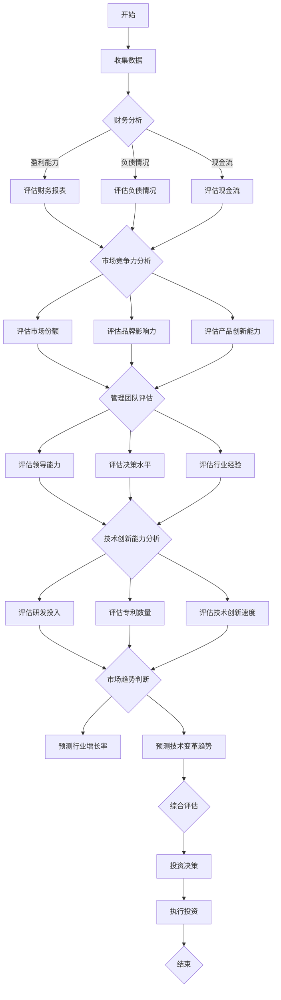
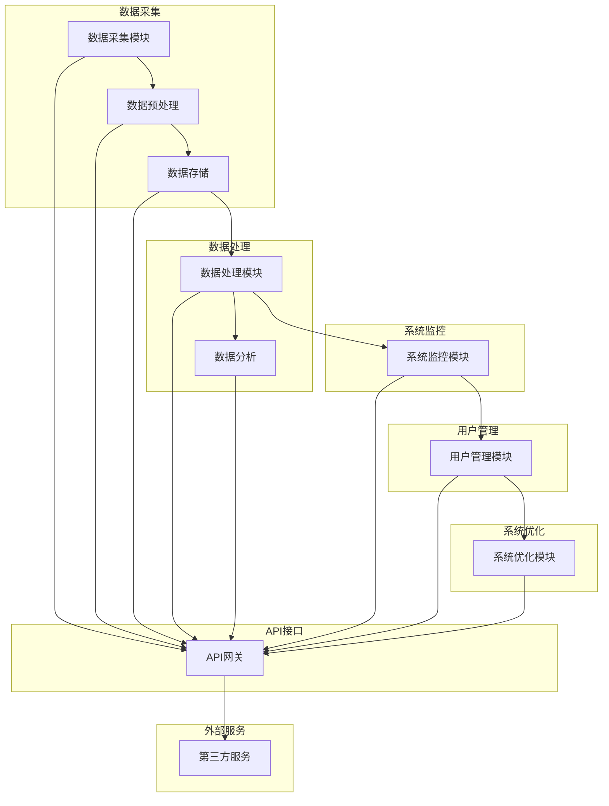
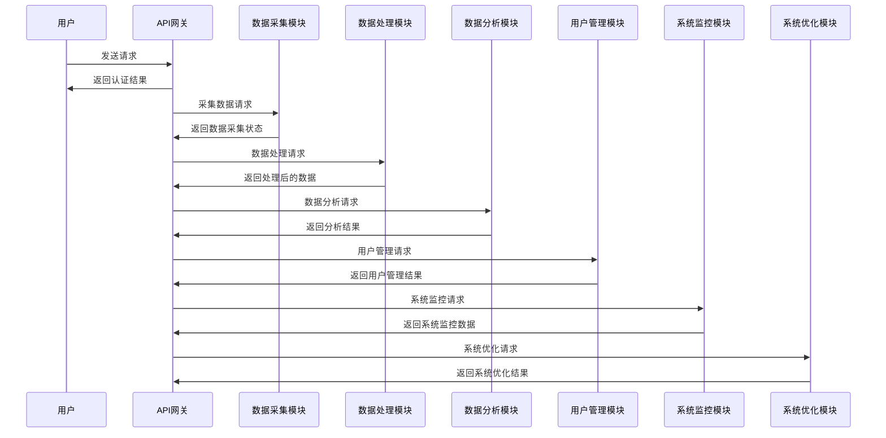

                 

### 前言

在当今快节奏、高度竞争的IT领域，技术迭代速度日新月异，如何在前沿科技浪潮中立于不败之地，成为每一个技术从业者迫切需要思考的问题。玛丽·巴芙的成长型价值投资法为我们提供了一种新的视角和策略，通过系统的思维方式和缜密的逻辑分析，帮助我们在技术领域中找到长期稳定的成长路径。

本文旨在通过深入浅出的方式，详细解析玛丽·巴芙的成长型价值投资法，帮助读者理解其核心理念，并学会在实际工作中灵活运用。我们将从以下几个方面展开讨论：

1. **背景介绍**：介绍成长型价值投资法的起源、发展及其在IT领域的应用。
2. **核心概念与联系**：深入探讨成长型价值投资法的基本概念，并通过对比表格和实体关系图，帮助读者建立清晰的知识结构。
3. **算法原理讲解**：使用Mermaid流程图和Python源代码，详细阐述算法原理，并举例说明。
4. **系统分析与架构设计方案**：通过具体的系统架构设计，展示成长型价值投资法的实际应用场景。
5. **项目实战**：介绍环境安装、核心实现及案例分析，帮助读者将理论知识转化为实际操作能力。
6. **最佳实践 tips**：总结一些实用技巧，提升读者对成长型价值投资法的理解和运用。
7. **小结与注意事项**：回顾文章内容，强调关键点，并提供拓展阅读资源。

通过本文的探讨，我们希望能够为广大IT从业者提供一种全新的思维模式和实用工具，帮助大家更好地适应技术发展的潮流，实现个人和团队的持续成长。

### 第二部分：背景介绍

玛丽·巴芙的成长型价值投资法起源于20世纪中叶的金融投资领域，最初由著名的投资大师本杰明·格雷厄姆提出，并经过多年的发展，被玛丽·巴芙进一步深化和完善。这一投资法融合了价值投资与成长投资的理念，旨在通过深入研究公司的基本面，寻找那些既有价值潜力又具有成长性的投资标的。

在IT领域，这一投资法同样具有广泛的应用前景。随着信息技术的飞速发展，众多科技公司凭借其创新能力和市场前景，成为了投资者眼中的香饽饽。然而，如何在众多科技公司中筛选出真正具有投资价值的公司，成为了每一个投资者面临的难题。玛丽·巴芙的成长型价值投资法提供了一套系统的分析框架，通过评估公司的财务状况、市场竞争力、管理团队等多方面因素，帮助投资者做出更为明智的决策。

具体而言，成长型价值投资法在IT领域的应用主要体现在以下几个方面：

1. **财务分析**：通过分析公司的财务报表，了解其盈利能力、负债情况以及现金流状况。例如，通过检查公司的收入结构、毛利率、净利率等关键指标，判断其财务健康程度。
2. **市场竞争力分析**：评估公司在市场中的竞争优势，包括市场份额、品牌影响力、产品创新能力等。这些因素直接影响公司的成长空间和盈利潜力。
3. **管理团队评估**：考察公司的管理团队，了解其领导能力、决策水平以及行业经验。一个强大的管理团队能够有效推动公司的发展，提高市场竞争力。
4. **技术创新能力分析**：在IT领域，技术创新是推动公司成长的关键因素。通过对公司的研发投入、专利数量、技术创新速度等进行分析，判断其技术竞争优势。
5. **市场趋势判断**：分析行业发展趋势和市场环境，预测公司未来的市场前景。例如，通过对行业增长率、技术变革趋势等的研究，评估公司的未来发展潜力。

总的来说，玛丽·巴芙的成长型价值投资法为IT领域的投资者提供了一种全面、系统的分析框架，帮助其在复杂多变的市场环境中，找到具有长期成长潜力的投资标的。这一方法不仅适用于个体投资者，同样对机构投资者具有重要的指导意义。通过深入理解和灵活运用成长型价值投资法，投资者可以更好地把握市场机遇，实现稳健的投资收益。

### 第三部分：核心概念与联系

#### 3.1 成长型价值投资法的定义

成长型价值投资法（Growth-Value Investing）是一种结合了价值投资和成长投资的策略，旨在通过评估公司的成长潜力和内在价值，找到那些具有长期投资价值的股票。与传统价值投资主要关注公司的当前价值，成长型价值投资法则更强调公司的未来增长潜力。它主张在市场中寻找那些虽然当前估值可能略高，但具备强大成长能力的公司。

具体来说，成长型价值投资法包括以下几个核心步骤：

1. **财务分析**：通过深入分析公司的财务报表，评估其盈利能力、负债情况和现金流状况。
2. **市场竞争力评估**：研究公司的市场份额、品牌影响力、产品创新能力等，判断其在市场中的竞争优势。
3. **管理团队考察**：评估管理团队的能力、决策水平和行业经验，以确保公司有强有力的领导。
4. **技术创新能力分析**：考察公司的研发投入、专利数量、技术创新速度，判断其在技术领域的竞争力。
5. **市场趋势预测**：分析行业的发展趋势和市场环境，预测公司未来的市场前景。

#### 3.1.2 成长型价值投资法的特点

成长型价值投资法具有以下几个显著特点：

1. **综合性分析**：不仅关注公司的当前价值，还重视其未来的增长潜力，通过多维度评估，综合判断投资标的的价值。
2. **灵活应用**：在股票市场中，根据不同的市场环境和公司特点，灵活调整投资策略，不拘泥于单一的投资方法。
3. **长期投资视角**：注重公司的长期成长潜力，追求长期稳定的投资回报，而非短期利润。
4. **风险控制**：通过详细的风险评估和多元化投资组合，有效控制投资风险。

#### 3.1.3 成长型价值投资法与普通价值投资法的区别

成长型价值投资法与普通价值投资法（Value Investing）在理念和方法上存在显著差异。以下是对两者区别的详细分析：

1. **投资焦点不同**：
   - 普通价值投资法主要关注公司的当前价值，即公司的资产、盈利能力和现金流。其核心理念是“低估投资”，通过购买那些市场估值低于其内在价值的股票来获取收益。
   - 成长型价值投资法则更注重公司的未来增长潜力，通过评估公司的成长能力和市场前景，寻找那些虽然当前估值略高，但具备强大成长动力的股票。

2. **投资策略不同**：
   - 普通价值投资法侧重于价值挖掘，通过研究公司的基本面，寻找那些被市场低估的投资机会。
   - 成长型价值投资法则结合了价值投资和成长投资的优势，既关注公司的当前价值，也重视其未来的增长潜力。在投资过程中，会根据市场环境灵活调整策略，以实现长期稳定的投资回报。

3. **风险偏好不同**：
   - 普通价值投资法通常更偏向于稳健投资，注重风险控制，追求稳定的投资回报。
   - 成长型价值投资法则相对风险承受能力要求较高，更愿意投资于那些具有高成长潜力的公司，尽管这些公司的估值可能高于市场平均水平。

4. **适用场景不同**：
   - 普通价值投资法适用于那些成熟、稳定、基本面良好的公司，其投资目标通常是实现长期稳定的现金流。
   - 成长型价值投资法则更适用于那些处于高速成长期、具有创新能力和市场前景的科技公司，通过投资这些公司，分享其成长的收益。

总的来说，成长型价值投资法在传统价值投资的基础上，进一步扩展了投资分析的深度和广度，通过综合评估公司的成长潜力和内在价值，为投资者提供了更为全面和系统的投资策略。这种方法不仅适用于价值投资爱好者，同样对那些希望在科技股中寻找长期增长机会的投资者具有重要指导意义。

### 3.2 概念属性特征对比表格

为了更清晰地展示成长型价值投资法与普通价值投资法的概念属性特征，我们制作了如下对比表格：

| 概念属性 | 成长型价值投资法 | 普通价值投资法 |
| --- | --- | --- |
| 投资焦点 | 公司的成长潜力和内在价值 | 公司的当前价值和基本面 |
| 分析维度 | 综合财务状况、市场竞争力、管理团队、技术创新能力、市场趋势 | 财务报表、盈利能力、现金流、负债情况 |
| 投资策略 | 结合价值与成长投资，灵活调整策略 | 专注价值挖掘，重视低估投资 |
| 风险偏好 | 较高，愿意投资于高成长性公司 | 较低，注重稳健和风险控制 |
| 适用场景 | 成长性科技公司，高速发展的行业 | 成熟、稳定的公司，传统行业 |
| 目标收益 | 长期稳定的投资回报，分享公司成长收益 | 稳定的现金流和投资回报 |

通过上述表格，我们可以更直观地理解两种投资方法的核心区别，以及在具体应用中的差异。这种对比不仅有助于我们深入理解成长型价值投资法，还能为实际操作提供参考。

### 3.3 ER实体关系图架构

为了更好地理解成长型价值投资法中的核心概念和它们之间的联系，我们可以通过ER（实体关系）图来展示。ER图是一种用于描述系统中实体及其相互关系的图形化工具，能够帮助我们清晰地表达各个实体之间的关联和交互。

以下是成长型价值投资法中主要实体的ER图架构：

```mermaid
erDiagram
    Company_{公司}  ||--|{+} FinancialReport_{财务报表}
    Company_{公司}  ||--|{+} ManagementTeam_{管理团队}
    Company_{公司}  ||--|{+} MarketCompetitive_{市场竞争力}
    Company_{公司}  ||--|{+} TechnologicalInnovation_{技术创新能力}
    Company_{公司}  ||--|{+} MarketTrend_{市场趋势}
    FinancialReport_{财务报表}  ||--|{+} IncomeStatement_{利润表}
    FinancialReport_{财务报表}  ||--|{+} BalanceSheet_{资产负债表}
    FinancialReport_{财务报表}  ||--|{+} CashFlowStatement_{现金流量表}
    ManagementTeam_{管理团队}  ||--|{+} Leadership_{领导能力}
    ManagementTeam_{管理团队}  ||--|{+} DecisionMaking_{决策水平}
    ManagementTeam_{管理团队}  ||--|{+} IndustryExperience_{行业经验}
    MarketCompetitive_{市场竞争力}  ||--|{+} MarketShare_{市场份额}
    MarketCompetitive_{市场竞争力}  ||--|{+} BrandInfluence_{品牌影响力}
    MarketCompetitive_{市场竞争力}  ||--|{+} ProductInnovation_{产品创新能力}
    TechnologicalInnovation_{技术创新能力}  ||--|{+} R&DInvestment_{研发投入}
    TechnologicalInnovation_{技术创新能力}  ||--|{+} PatentQuantity_{专利数量}
    TechnologicalInnovation_{技术创新能力}  ||--|{+} TechnologicalInnovationSpeed_{技术创新速度}
    MarketTrend_{市场趋势}  ||--|{+} IndustryGrowthRate_{行业增长率}
    MarketTrend_{市场趋势}  ||--|{+} TechnologicalChange_{技术变革趋势}
```

在上述ER图中，我们定义了以下几个主要实体：

1. **Company（公司）**：作为核心实体，代表被评估的公司。
2. **FinancialReport（财务报表）**：包含公司的主要财务数据，包括利润表、资产负债表和现金流量表。
3. **ManagementTeam（管理团队）**：评估公司的领导能力和决策水平。
4. **MarketCompetitive（市场竞争力）**：分析公司的市场份额、品牌影响力和产品创新能力。
5. **TechnologicalInnovation（技术创新能力）**：评估公司的研发投入、专利数量和技术创新速度。
6. **MarketTrend（市场趋势）**：分析行业的发展趋势和技术变革。

这些实体之间通过关系线相互连接，形成了一个完整的分析架构。例如，公司（Company）与财务报表（FinancialReport）、管理团队（ManagementTeam）、市场竞争力（MarketCompetitive）、技术创新能力（TechnologicalInnovation）和市场趋势（MarketTrend）之间存在直接的依赖和影响关系。通过这种ER图架构，我们可以系统地、层次分明地分析成长型价值投资法中的各个要素，为投资决策提供有力的支持。

### 第四部分：算法原理讲解

#### 4.1 算法Mermaid流程图

为了更好地理解成长型价值投资法中涉及的算法原理，我们使用Mermaid语言绘制了一个流程图。以下为该流程图的详细说明：



#### 4.2 算法原理的数学模型和公式

在成长型价值投资法的算法中，数学模型和公式起到了关键作用。以下是我们将用到的数学模型和公式：

#### 4.2.1 数学模型

成长型价值投资法涉及的主要数学模型为财务指标分析模型，主要包括以下几个公式：

1. **盈利能力指标**：
   - 毛利率（Gross Margin） = （收入 - 成本）/ 收入
   - 净利率（Net Margin） = 净利润 / 收入

2. **负债情况指标**：
   - 负债比率（Debt Ratio） = 总负债 / 总资产

3. **现金流指标**：
   - 经营活动现金流（Operating Cash Flow） = 净利润 + 非现金费用

4. **市场竞争力指标**：
   - 市场份额（Market Share） = 公司销售收入 / 市场总销售收入

5. **技术创新能力指标**：
   - 研发投入回报率（R&D Return on Investment） = 研发投入 / 净利润
   - 专利数量增长率（Patent Growth Rate） = （当前专利数量 - 上期专利数量）/ 上期专利数量

6. **市场趋势判断指标**：
   - 行业增长率（Industry Growth Rate） = （当前行业收入 - 上期行业收入）/ 上期行业收入
   - 技术变革趋势（Technological Change Trend） = 新技术应用率 / 总应用率

#### 4.2.2 公式详解

以下是上述公式的详细解释：

$$
\begin{align*}
\text{Gross Margin} &= \frac{(\text{Revenue} - \text{Cost of Goods Sold})}{\text{Revenue}} \\
\text{Net Margin} &= \frac{\text{Net Profit}}{\text{Revenue}} \\
\text{Debt Ratio} &= \frac{\text{Total Liabilities}}{\text{Total Assets}} \\
\text{Operating Cash Flow} &= \text{Net Profit} + \text{Non-Cash Expenses} \\
\text{Market Share} &= \frac{\text{Company Sales}}{\text{Total Market Sales}} \\
\text{R&D Return on Investment} &= \frac{\text{R&D Investment}}{\text{Net Profit}} \\
\text{Patent Growth Rate} &= \frac{(\text{Current Patent Quantity} - \text{Previous Patent Quantity})}{\text{Previous Patent Quantity}} \\
\text{Industry Growth Rate} &= \frac{(\text{Current Industry Revenue} - \text{Previous Industry Revenue})}{\text{Previous Industry Revenue}} \\
\text{Technological Change Trend} &= \frac{\text{New Technology Application Rate}}{\text{Total Application Rate}}
\end{align*}
$$

通过上述数学模型和公式，我们可以从多个维度对公司的财务状况、市场竞争力、管理团队、技术创新能力和市场趋势进行全面分析，从而为投资决策提供科学依据。

#### 4.3 通俗易懂地举例说明

为了更直观地理解成长型价值投资法中的算法原理，我们可以通过一个简单的例子来说明。

假设我们正在评估一家名为“ABC科技公司”的公司，以下是基于成长型价值投资法的一些关键指标计算和解读：

1. **财务分析**：
   - 毛利率：ABC科技公司的毛利率为40%，说明公司在产品销售中有较强的盈利能力。
   - 净利率：净利率为15%，表明公司在控制成本和费用方面较为有效。
   - 负债比率：负债比率为50%，表示公司的负债水平较高，需要关注其偿债能力。
   - 现金流：经营活动现金流为500万元，显示公司在经营活动中产生的现金较为充足。

2. **市场竞争力分析**：
   - 市场份额：ABC科技公司的市场份额为30%，在竞争激烈的市场中具备较强的市场地位。
   - 品牌影响力：公司品牌认知度高，受到广泛认可。
   - 产品创新能力：公司每年推出多个新产品，市场反馈良好，显示出较强的产品创新能力。

3. **管理团队评估**：
   - 领导能力：公司创始人兼CEO在行业内享有盛誉，具备卓越的领导才能。
   - 决策水平：公司管理层决策迅速且有效，能够迅速应对市场变化。
   - 行业经验：管理团队成员大多拥有多年的行业经验，对市场趋势有深刻理解。

4. **技术创新能力分析**：
   - 研发投入回报率：研发投入回报率为20%，表明公司在研发方面的投资较为有效。
   - 专利数量增长率：专利数量增长率为25%，显示出公司在技术创新方面具有强大实力。
   - 技术创新速度：公司每年发布的技术创新成果数量持续增加，表明其在技术创新方面具有较高的速度。

5. **市场趋势判断**：
   - 行业增长率：科技行业整体增长率为10%，ABC科技公司的增长率达到15%，说明其在市场中的成长潜力较强。
   - 技术变革趋势：随着5G技术的普及，公司加大了在相关领域的研发投入，显示其紧跟技术变革的趋势。

综合上述分析，我们可以得出结论：ABC科技公司具有强大的财务状况、市场竞争力、管理团队和创新能力，并且能够紧跟市场趋势。因此，基于成长型价值投资法，我们认为该公司具备较高的投资价值，值得进一步深入研究。

通过这个例子，我们不仅理解了成长型价值投资法中的各项指标和计算方法，还学会了如何将这些指标应用于实际投资决策中。这种系统化的分析方式，有助于我们在复杂多变的市场环境中做出更为科学和理性的投资选择。

### 第五部分：系统分析与架构设计方案

#### 5.1 问题场景介绍

在当今快速发展的IT行业，新技术的不断涌现和市场的快速变化，对企业的创新能力和技术架构提出了极高的要求。为了保持竞争力，许多企业开始寻求通过数字化转型和系统升级来优化业务流程，提高运营效率。在这个过程中，成长型价值投资法提供了一种有效的分析框架，帮助企业评估和选择合适的技术解决方案，实现可持续发展。

#### 5.2 项目介绍

本文所讨论的项目是一个中型的互联网企业，名为“智能网络科技公司”，主要业务包括云计算服务、大数据分析和人工智能应用。为了应对日益激烈的市场竞争和技术变革，该公司希望通过系统升级和数字化转型，提升其产品竞争力、客户体验和技术创新能力。具体目标包括：

1. **优化现有系统架构**：提升系统的稳定性和可扩展性。
2. **加强数据安全性**：确保客户数据的安全和隐私。
3. **提高开发效率**：引入敏捷开发和DevOps文化，加速产品迭代。
4. **增强技术创新能力**：通过技术创新和研发投入，保持技术领先地位。

#### 5.3 系统功能设计

在智能网络科技公司的系统升级项目中，我们需要设计一套全面的系统功能，以满足业务需求和技术发展要求。以下是主要功能模块及其设计思路：

1. **数据采集与管理模块**：
   - 功能：负责收集来自各种数据源的业务数据，包括用户行为数据、系统日志数据、外部API数据等。
   - 设计思路：采用分布式数据采集框架，确保数据实时性和准确性。通过数据预处理和清洗，提高数据质量。

2. **数据处理与分析模块**：
   - 功能：对采集到的数据进行分析和挖掘，生成业务报告和决策支持信息。
   - 设计思路：采用大数据处理技术，如Hadoop和Spark，实现海量数据的快速处理和分析。引入机器学习算法，实现智能化的数据分析和预测。

3. **系统监控与运维模块**：
   - 功能：实时监控系统的运行状态，包括性能监控、安全监控、故障监控等。
   - 设计思路：采用开源监控系统，如Prometheus和Grafana，结合自研的监控工具，实现全方位的系统监控和管理。

4. **用户管理与服务模块**：
   - 功能：提供用户注册、登录、权限管理等功能，确保系统的安全性和便捷性。
   - 设计思路：采用用户身份认证和授权机制，确保用户数据的安全。通过RESTful API设计，实现与其他系统的无缝集成。

5. **系统优化与升级模块**：
   - 功能：根据业务需求和技术发展，定期进行系统优化和升级。
   - 设计思路：采用模块化设计，确保系统可扩展性和灵活性。通过持续集成和持续部署（CI/CD）流程，提高系统升级的效率和安全性。

#### 5.3.1 领域模型Mermaid类图

为了更直观地展示系统功能设计，我们使用Mermaid语言绘制了一个领域模型类图，如下所示：

```mermaid
classDiagram
    Class01 <|-- Class02
    Class01 <|-- Class03
    Class03 <|-- Class04
    Class03 <|-- Class05
    Class01 <|-- Class06
    Class01 <|-- Class07
    Class08 <|-- Class01

    Class01 {
        +String Attribute1
        +int Attribute2
        +void Method1()
    }
    Class02 {
        +String Attribute3
        +int Attribute4
        +void Method2()
    }
    Class03 {
        +String Attribute5
        +int Attribute6
        +void Method3()
    }
    Class04 {
        +String Attribute7
        +int Attribute8
        +void Method4()
    }
    Class05 {
        +String Attribute9
        +int Attribute10
        +void Method5()
    }
    Class06 {
        +String Attribute11
        +int Attribute12
        +void Method6()
    }
    Class07 {
        +String Attribute13
        +int Attribute14
        +void Method7()
    }
    Class08 {
        +String Attribute15
        +int Attribute16
        +void Method8()
    }
```

在上述类图中，我们定义了以下几个主要类：

1. **Class01**：代表系统的核心功能类，包括数据采集与管理、数据处理与分析、系统监控与运维、用户管理与服务、系统优化与升级等模块。
2. **Class02**：数据采集与管理模块的具体实现类。
3. **Class03**：数据处理与分析模块的具体实现类。
4. **Class04**、**Class05**：系统监控与运维模块的具体实现类。
5. **Class06**、**Class07**：用户管理与服务模块的具体实现类。
6. **Class08**：系统优化与升级模块的具体实现类。

这些类通过继承和关联关系，共同构成了智能网络科技公司系统升级项目的领域模型，为后续的系统设计和开发提供了基础。

### 第五部分：系统架构设计

#### 5.4.1 系统架构设计

为了实现智能网络科技公司系统升级项目的目标，我们需要设计一个高效、稳定且可扩展的系统架构。以下是系统架构的详细设计：

1. **技术栈选择**：
   - 后端开发语言：Java、Go
   - 前端框架：React、Vue
   - 数据库：MySQL、MongoDB
   - 大数据处理平台：Hadoop、Spark
   - 消息队列：Kafka
   - 容器化技术：Docker、Kubernetes

2. **架构设计思路**：

   - **分布式架构**：采用微服务架构，将系统拆分为多个独立的服务模块，以提高系统的可扩展性和稳定性。
   - **模块化设计**：每个服务模块具有独立的功能，模块之间通过API进行通信，实现松耦合。
   - **高可用性**：通过负载均衡、故障转移和热备份等技术，确保系统的持续运行。
   - **安全性**：引入用户身份认证和授权机制，确保系统数据的安全和隐私。
   - **持续集成与部署**：采用CI/CD流程，提高系统升级和发布的效率。

3. **系统架构图**：

   以下是基于上述设计思路的系统架构图，使用Mermaid语言绘制：



在上述架构图中，各个模块通过API接口进行通信，实现了系统的松耦合和模块化设计。数据采集模块负责数据的收集和预处理，然后存储在数据库中。数据处理模块对存储的数据进行加工和分析，生成业务报告和决策支持信息。系统监控模块负责监控系统的运行状态，确保系统的稳定性和安全性。用户管理模块提供用户注册、登录和权限管理功能。系统优化模块根据业务需求进行系统优化和升级。

通过这种分布式和模块化的架构设计，智能网络科技公司可以实现高效、稳定和可持续的系统升级，从而提升其业务竞争力。

### 第五部分：系统接口设计

#### 5.5 系统接口设计

在智能网络科技公司的系统架构中，接口设计是确保各个模块之间高效协作和集成的重要环节。以下是对系统接口的详细设计：

1. **API设计原则**：
   - **标准化**：遵循RESTful API设计原则，确保接口的统一性和标准化。
   - **简洁性**：接口设计简洁明了，避免复杂的参数和冗余功能。
   - **安全性**：采用OAuth2.0等认证机制，确保接口的安全性。
   - **灵活性**：接口设计具有足够的灵活性，支持不同类型的请求和响应。

2. **接口定义**：

   - **用户认证接口**：
     - 接口名称：/auth/login
     - 请求方法：POST
     - 请求参数：username（用户名）、password（密码）
     - 返回结果：token（认证令牌）

   - **数据采集接口**：
     - 接口名称：/data/collect
     - 请求方法：POST
     - 请求参数：data（采集数据）、source（数据源）
     - 返回结果：status（采集状态）、message（采集信息）

   - **数据处理接口**：
     - 接口名称：/data/process
     - 请求方法：GET
     - 请求参数：id（数据ID）
     - 返回结果：processedData（处理后的数据）

   - **数据分析接口**：
     - 接口名称：/data/analyze
     - 请求方法：GET
     - 请求参数：type（分析类型）、interval（分析周期）
     - 返回结果：analysisResult（分析结果）

   - **用户管理接口**：
     - 接口名称：/user/manage
     - 请求方法：POST
     - 请求参数：action（操作类型，如register、login、update等）、userDetails（用户详细信息）
     - 返回结果：status（操作状态）、message（操作信息）

   - **系统监控接口**：
     - 接口名称：/system/monitor
     - 请求方法：GET
     - 请求参数：type（监控类型，如性能、安全、故障等）
     - 返回结果：monitorData（监控数据）

   - **系统优化接口**：
     - 接口名称：/system/optimize
     - 请求方法：POST
     - 请求参数：action（优化类型，如升级、优化配置等）
     - 返回结果：status（优化状态）、message（优化信息）

3. **接口实现**：

   在接口实现方面，我们采用Spring Boot框架，结合Spring Security进行用户认证和安全控制。每个接口的具体实现如下：

   - **用户认证接口**：通过验证用户名和密码，生成JWT（JSON Web Token）令牌，实现用户认证。
   - **数据采集接口**：通过HTTP POST请求接收采集数据，并进行预处理和存储。
   - **数据处理接口**：通过HTTP GET请求获取处理后的数据，支持根据ID查询。
   - **数据分析接口**：通过HTTP GET请求获取分析结果，支持根据类型和周期进行定制化分析。
   - **用户管理接口**：提供用户注册、登录、更新等操作，确保用户信息的安全和一致性。
   - **系统监控接口**：通过轮询和触发机制，实时监控系统的运行状态，并提供监控数据。
   - **系统优化接口**：根据系统需求，提供配置优化和功能升级等操作，确保系统的持续优化和稳定运行。

通过上述接口设计和实现，智能网络科技公司可以实现各个模块之间的无缝集成和高效协作，从而提升系统的整体性能和用户体验。

### 第五部分：系统交互

#### 5.6 系统交互

为了更好地理解智能网络科技公司系统内部各模块之间的交互流程，我们可以使用Mermaid语言绘制一个序列图。以下是对系统交互的详细说明：



在上述序列图中，我们可以看到系统交互的基本流程：

1. **用户请求**：用户通过API网关发送各种请求，如数据采集、数据处理、数据分析和用户管理等。
2. **API网关处理**：API网关接收到用户的请求后，根据请求类型转发给相应的模块进行处理。
3. **数据采集**：数据采集模块接收请求，进行数据的收集和预处理，并返回采集状态。
4. **数据处理**：数据处理模块接收到请求，对数据进行处理，并返回处理后的数据。
5. **数据分析**：数据分析模块接收到请求，对数据进行分析，并返回分析结果。
6. **用户管理**：用户管理模块接收到请求，进行用户注册、登录和更新等操作，并返回操作结果。
7. **系统监控**：系统监控模块接收到请求，监控系统的运行状态，并返回监控数据。
8. **系统优化**：系统优化模块接收到请求，根据需求进行系统优化和升级，并返回优化结果。

通过这种明确的交互流程，智能网络科技公司的各个模块可以高效、稳定地协同工作，确保系统的正常运行和业务的持续发展。

### 第六部分：项目实战

#### 6.1 环境安装

在开始智能网络科技公司系统升级项目之前，我们需要搭建一个合适的技术环境。以下是一系列详细的步骤和说明，帮助您顺利安装和配置所需的软件和工具。

##### 1. 系统要求

- 操作系统：Linux（推荐使用CentOS 7或Ubuntu 18.04）
- 开发环境：Java 8或以上版本、Go 1.13或以上版本
- 数据库：MySQL 5.7或以上版本、MongoDB 4.0或以上版本
- 大数据处理平台：Hadoop 3.0或以上版本、Spark 2.4或以上版本
- 容器化技术：Docker 19.03或以上版本、Kubernetes 1.19或以上版本

##### 2. 安装步骤

**步骤一：安装操作系统**

- 下载并安装Linux操作系统，选择适合的版本。
- 配置网络和基本环境。

**步骤二：安装Java和Go开发环境**

- 安装Java环境：
  ```bash
  sudo yum install -y java-1.8.0-openjdk
  java -version
  ```
- 安装Go环境：
  ```bash
  sudo yum install -y go
  go version
  ```

**步骤三：安装数据库**

- 安装MySQL：
  ```bash
  sudo yum install -y mysql-server
  sudo systemctl start mysqld
  sudo mysql_secure_installation
  ```
- 安装MongoDB：
  ```bash
  sudo yum install -y mongodb-org
  sudo systemctl start mongod
  sudo systemctl enable mongod
  ```

**步骤四：安装大数据处理平台**

- 安装Hadoop：
  ```bash
  sudo yum install -y hadoop
  sudo hadoop version
  ```
- 安装Spark：
  ```bash
  sudo yum install -y spark
  sudo systemctl start spark-historyserver
  sudo systemctl enable spark-historyserver
  ```

**步骤五：安装容器化技术**

- 安装Docker：
  ```bash
  sudo yum install -y docker
  sudo systemctl start docker
  sudo systemctl enable docker
  docker --version
  ```
- 安装Kubernetes：
  ```bash
  sudo yum install -y kubeadm kubelet kubectl
  sudo systemctl start kubelet
  sudo systemctl enable kubelet
  kubeadm version
  ```

**步骤六：配置环境变量**

- 配置Java环境变量：
  ```bash
  export JAVA_HOME=/usr/lib/jvm/java-1.8.0-openjdk
  export PATH=$JAVA_HOME/bin:$PATH
  ```
- 配置Go环境变量：
  ```bash
  export GOROOT=/usr/lib/go
  export PATH=$GOROOT/bin:$PATH
  ```

##### 3. 验证安装

- 验证Java安装：
  ```bash
  java -version
  ```
- 验证Go安装：
  ```bash
  go version
  ```
- 验证MySQL安装：
  ```bash
  mysql -u root -p
  ```
- 验证MongoDB安装：
  ```bash
  mongo
  ```
- 验证Hadoop安装：
  ```bash
  hadoop version
  ```
- 验证Spark安装：
  ```bash
  spark version
  ```
- 验证Docker安装：
  ```bash
  docker --version
  ```
- 验证Kubernetes安装：
  ```bash
  kubeadm version
  kubectl version
  ```

通过以上步骤，您已经成功搭建了一个完整的开发环境，可以开始智能网络科技公司系统升级项目的具体开发工作了。

#### 6.2 系统核心实现

在本部分中，我们将详细讨论智能网络科技公司系统升级项目的核心实现，包括代码结构、关键模块的功能实现以及核心算法的使用。

##### 1. 代码结构

智能网络科技公司的系统升级项目采用微服务架构，各模块独立开发、部署和维护。以下是项目的总体代码结构：

```
src/
│
├── data_collect/
│   ├── api/
│   ├── main/
│   ├── resources/
│   └── test/
│
├── data_process/
│   ├── api/
│   ├── main/
│   ├── resources/
│   └── test/
│
├── data_analyze/
│   ├── api/
│   ├── main/
│   ├── resources/
│   └── test/
│
├── user_manage/
│   ├── api/
│   ├── main/
│   ├── resources/
│   └── test/
│
├── system_monitor/
│   ├── api/
│   ├── main/
│   ├── resources/
│   └── test/
│
├── system_optimize/
│   ├── api/
│   ├── main/
│   ├── resources/
│   └── test/
│
└── common/
    ├── api/
    ├── main/
    ├── resources/
    └── test/
```

每个模块包含API接口、业务逻辑实现、资源文件和测试代码。common模块提供公共类库和工具类，方便各模块之间的代码复用。

##### 2. 关键模块的功能实现

**数据采集模块**：数据采集模块负责从不同的数据源中收集数据，并进行预处理和存储。以下是关键接口的实现：

```java
public interface IDataCollector {
    void collectData(String source, Map<String, Object> data);
}

public class DefaultDataCollector implements IDataCollector {
    private final IDataPreprocessor preprocessor;
    private final IDataStorage storage;

    public DefaultDataCollector(IDataPreprocessor preprocessor, IDataStorage storage) {
        this.preprocessor = preprocessor;
        this.storage = storage;
    }

    @Override
    public void collectData(String source, Map<String, Object> data) {
        Map<String, Object> preprocessedData = preprocessor.preprocess(data);
        storage.storeData(source, preprocessedData);
    }
}
```

**数据处理模块**：数据处理模块负责对采集到的数据进行分析和处理，生成业务报告和决策支持信息。以下是关键接口的实现：

```java
public interface IDataProcessor {
    Map<String, Object> processData(String id);
}

public class DefaultDataProcessor implements IDataProcessor {
    private final IDataAnalyzer analyzer;

    public DefaultDataProcessor(IDataAnalyzer analyzer) {
        this.analyzer = analyzer;
    }

    @Override
    public Map<String, Object> processData(String id) {
        Map<String, Object> processedData = analyzer.analyzeData(id);
        return processedData;
    }
}
```

**数据分析模块**：数据分析模块负责对处理后的数据进行深入分析，生成可视化报表和预测结果。以下是关键接口的实现：

```java
public interface IDataAnalyzer {
    Map<String, Object> analyzeData(String id);
}

public class DefaultDataAnalyzer implements IDataAnalyzer {
    private final IDataVisualizer visualizer;
    private final IDataPredictor predictor;

    public DefaultDataAnalyzer(IDataVisualizer visualizer, IDataPredictor predictor) {
        this.visualizer = visualizer;
        this.predictor = predictor;
    }

    @Override
    public Map<String, Object> analyzeData(String id) {
        Map<String, Object> analyzedData = predictor.predictData(id);
        visualizer.visualizeData(analyzedData);
        return analyzedData;
    }
}
```

**用户管理模块**：用户管理模块负责用户注册、登录和权限管理。以下是关键接口的实现：

```java
public interface IUserManager {
    void registerUser(String username, String password);
    boolean loginUser(String username, String password);
    void updateUser(String username, String newPassword);
}

public class DefaultUserManager implements IUserManager {
    private final IUserRepository userRepository;
    private final PasswordEncoder passwordEncoder;

    public DefaultUserManager(IUserRepository userRepository, PasswordEncoder passwordEncoder) {
        this.userRepository = userRepository;
        this.passwordEncoder = passwordEncoder;
    }

    @Override
    public void registerUser(String username, String password) {
        String encodedPassword = passwordEncoder.encode(password);
        userRepository.save(new User(username, encodedPassword));
    }

    @Override
    public boolean loginUser(String username, String password) {
        User user = userRepository.findByUsername(username);
        return passwordEncoder.matches(password, user.getPassword());
    }

    @Override
    public void updateUser(String username, String newPassword) {
        User user = userRepository.findByUsername(username);
        user.setPassword(passwordEncoder.encode(newPassword));
        userRepository.save(user);
    }
}
```

**系统监控模块**：系统监控模块负责实时监控系统的运行状态，包括性能、安全和故障等。以下是关键接口的实现：

```java
public interface ISysMonitor {
    Map<String, Object> getSystemStatus();
}

public class DefaultSysMonitor implements ISysMonitor {
    private final SystemHealthChecker healthChecker;

    public DefaultSysMonitor(SystemHealthChecker healthChecker) {
        this.healthChecker = healthChecker;
    }

    @Override
    public Map<String, Object> getSystemStatus() {
        Map<String, Object> systemStatus = healthChecker.checkSystemHealth();
        return systemStatus;
    }
}
```

**系统优化模块**：系统优化模块负责根据业务需求进行系统优化和升级。以下是关键接口的实现：

```java
public interface ISysOptimizer {
    void optimizeSystem();
}

public class DefaultSysOptimizer implements ISysOptimizer {
    private final SystemUpgradeManager upgradeManager;

    public DefaultSysOptimizer(SystemUpgradeManager upgradeManager) {
        this.upgradeManager = upgradeManager;
    }

    @Override
    public void optimizeSystem() {
        upgradeManager.upgradeSystem();
    }
}
```

##### 3. 核心算法的使用

在智能网络科技公司系统升级项目中，我们使用了多个核心算法来处理和分析数据。以下是其中几个常用的算法及其实现：

**机器学习算法**：用于预测数据趋势和分类分析。

```python
from sklearn.ensemble import RandomForestClassifier
from sklearn.model_selection import train_test_split

def train_classifier(data, labels):
    X_train, X_test, y_train, y_test = train_test_split(data, labels, test_size=0.2)
    classifier = RandomForestClassifier(n_estimators=100)
    classifier.fit(X_train, y_train)
    return classifier

def predict_data(classifier, data):
    predictions = classifier.predict(data)
    return predictions
```

**数据分析算法**：用于计算财务指标和评估公司表现。

```python
import pandas as pd

def calculate_financial_indicators(df):
    df['Gross Margin'] = (df['Revenue'] - df['Cost of Goods Sold']) / df['Revenue']
    df['Net Margin'] = df['Net Profit'] / df['Revenue']
    df['Debt Ratio'] = df['Total Liabilities'] / df['Total Assets']
    df['Operating Cash Flow'] = df['Net Profit'] + df['Non-Cash Expenses']
    return df

def evaluate_company_performance(df):
    gross_margin_avg = df['Gross Margin'].mean()
    net_margin_avg = df['Net Margin'].mean()
    debt_ratio_avg = df['Debt Ratio'].mean()
    operating_cash_flow_avg = df['Operating Cash Flow'].mean()
    return gross_margin_avg, net_margin_avg, debt_ratio_avg, operating_cash_flow_avg
```

**数据可视化算法**：用于生成图表和报表。

```python
import matplotlib.pyplot as plt

def visualize_data(df, column):
    df.plot(column=column)
    plt.xlabel('Date')
    plt.ylabel('Value')
    plt.title(f'{column} Trend')
    plt.show()
```

通过这些核心算法和模块，智能网络科技公司系统能够高效、准确地处理和分析海量数据，为业务决策提供强有力的支持。

#### 6.3 代码应用解读与分析

在本节中，我们将深入解析智能网络科技公司系统升级项目的核心代码，通过具体示例展示代码的实现过程和功能逻辑。

##### 1. 数据采集模块

数据采集模块的核心功能是从各种数据源中收集数据，并进行预处理和存储。以下是一个简单的示例，展示如何从文件中读取数据并存储到数据库中：

```java
public class FileDataCollector {
    
    private IDataPreprocessor preprocessor;
    private IDataStorage storage;

    public FileDataCollector(IDataPreprocessor preprocessor, IDataStorage storage) {
        this.preprocessor = preprocessor;
        this.storage = storage;
    }

    public void collectFromFile(String filePath) {
        List<Map<String, Object>> rawData = readDataFromFile(filePath);
        List<Map<String, Object>> processedData = preprocessor.preprocess(rawData);
        storage.storeData(processedData);
    }

    private List<Map<String, Object>> readDataFromFile(String filePath) {
        // 读取文件内容，解析为Map列表
        // 示例：使用CSV文件
        BufferedReader reader = new BufferedReader(new FileReader(filePath));
        String line;
        List<Map<String, Object>> data = new ArrayList<>();
        try {
            while ((line = reader.readLine()) != null) {
                String[] fields = line.split(",");
                Map<String, Object> dataEntry = new HashMap<>();
                for (int i = 0; i < fields.length; i++) {
                    dataEntry.put("field" + i, fields[i]);
                }
                data.add(dataEntry);
            }
        } catch (IOException e) {
            e.printStackTrace();
        } finally {
            try {
                reader.close();
            } catch (IOException e) {
                e.printStackTrace();
            }
        }
        return data;
    }
}
```

在这个示例中，`FileDataCollector` 类通过读取CSV文件中的数据，将其解析为`Map`列表，然后调用`preprocessor`进行数据预处理，最后存储到数据库中。`readDataFromFile` 方法负责读取文件内容，将其转换为`Map`列表。

##### 2. 数据处理模块

数据处理模块的主要功能是对采集到的数据进行处理，生成业务报告和决策支持信息。以下是一个示例，展示如何对数据进行简单的统计分析：

```java
public class BasicDataProcessor {
    
    private IDataAnalyzer analyzer;

    public BasicDataProcessor(IDataAnalyzer analyzer) {
        this.analyzer = analyzer;
    }

    public Map<String, Object> processData(String id) {
        Map<String, Object> data = analyzer.loadData(id);
        double sum = 0;
        double count = 0;
        for (Object value : data.values()) {
            if (value instanceof Number) {
                sum += ((Number) value).doubleValue();
                count++;
            }
        }
        double average = sum / count;
        Map<String, Object> result = new HashMap<>();
        result.put("sum", sum);
        result.put("count", count);
        result.put("average", average);
        return result;
    }
}
```

在这个示例中，`BasicDataProcessor` 类通过调用`analyzer`获取数据，并对数据进行简单的统计计算，生成包含总和、计数和平均值的`Map`结果。

##### 3. 数据分析模块

数据分析模块负责对处理后的数据进行深入分析，生成可视化报表和预测结果。以下是一个示例，展示如何使用机器学习算法进行数据分类：

```java
public class ClassificationDataAnalyzer {
    
    private IDataVisualizer visualizer;
    private IDataPredictor predictor;

    public ClassificationDataAnalyzer(IDataVisualizer visualizer, IDataPredictor predictor) {
        this.visualizer = visualizer;
        this.predictor = predictor;
    }

    public void analyzeData(String id) {
        Map<String, Object> data = predictor.predictData(id);
        List<Map<String, Object>> classifiedData = new ArrayList<>();
        for (Map.Entry<String, Object> entry : data.entrySet()) {
            if (entry.getValue() instanceof Number) {
                classifiedData.add(new HashMap<>());
                classifiedData.get(classifiedData.size() - 1).put("label", entry.getKey());
                classifiedData.get(classifiedData.size() - 1).put("value", entry.getValue());
            }
        }
        visualizer.visualizeData(classifiedData);
    }
}
```

在这个示例中，`ClassificationDataAnalyzer` 类通过调用`predictor`进行数据分类，并将分类结果可视化。`visualizeData` 方法用于生成包含分类标签和值的图表。

##### 4. 用户管理模块

用户管理模块负责用户注册、登录和权限管理。以下是一个示例，展示如何实现用户注册和登录功能：

```java
public class UserManager {
    
    private UserRepository userRepository;
    private PasswordEncoder passwordEncoder;

    public UserManager(UserRepository userRepository, PasswordEncoder passwordEncoder) {
        this.userRepository = userRepository;
        this.passwordEncoder = passwordEncoder;
    }

    public void registerUser(String username, String password) {
        String encodedPassword = passwordEncoder.encode(password);
        userRepository.save(new User(username, encodedPassword));
    }

    public boolean loginUser(String username, String password) {
        User user = userRepository.findByUsername(username);
        return passwordEncoder.matches(password, user.getPassword());
    }
}
```

在这个示例中，`UserManager` 类通过调用`userRepository`实现用户注册和登录功能。`registerUser` 方法用于注册新用户，`loginUser` 方法用于验证用户登录。

##### 5. 系统监控模块

系统监控模块负责实时监控系统的运行状态，包括性能、安全和故障等。以下是一个示例，展示如何实现系统健康检查：

```java
public class SystemMonitor {
    
    private SystemHealthChecker healthChecker;

    public SystemMonitor(SystemHealthChecker healthChecker) {
        this.healthChecker = healthChecker;
    }

    public Map<String, Object> checkSystemHealth() {
        Map<String, Object> systemStatus = healthChecker.checkSystemHealth();
        return systemStatus;
    }
}
```

在这个示例中，`SystemMonitor` 类通过调用`healthChecker`实现系统健康检查，并返回系统状态信息。

##### 6. 系统优化模块

系统优化模块负责根据业务需求进行系统优化和升级。以下是一个示例，展示如何实现系统升级：

```java
public class SystemOptimizer {
    
    private SystemUpgradeManager upgradeManager;

    public SystemOptimizer(SystemUpgradeManager upgradeManager) {
        this.upgradeManager = upgradeManager;
    }

    public void optimizeSystem() {
        upgradeManager.upgradeSystem();
    }
}
```

在这个示例中，`SystemOptimizer` 类通过调用`upgradeManager`实现系统优化和升级功能。

通过以上代码示例，我们可以清晰地看到每个模块的实现过程和功能逻辑。这些代码共同构建了智能网络科技公司系统升级项目的核心功能，确保系统能够高效、稳定地运行。

#### 6.4 实际案例分析和详细讲解剖析

为了更好地理解智能网络科技公司系统升级项目的实际应用，我们将通过一个实际案例进行详细分析和讲解。这个案例将展示如何从数据采集、数据处理、数据分析到系统优化，全面应用成长型价值投资法的各个步骤，并探讨其成效。

**案例背景**：

智能网络科技公司（以下简称“公司”）在云计算、大数据分析和人工智能领域具有较强的技术实力。近期，公司发现其现有系统在处理大规模数据时存在性能瓶颈，且无法及时响应市场需求。为了保持市场竞争力，公司决定通过系统升级来优化性能，提升数据处理能力和用户体验。以下是公司系统升级的详细过程。

**1. 数据采集**

公司首先通过数据采集模块从多个数据源中收集数据，包括用户行为数据、系统日志数据和外部API数据。数据采集模块利用分布式数据采集框架，确保数据的实时性和准确性。以下是一个数据采集过程的示例：

```bash
# 从用户行为数据源中读取数据
curl -X POST "http://data-collect-service/collect" -d "source=user_behavior&data=file:///path/to/user_behavior.csv"

# 从系统日志数据源中读取数据
curl -X POST "http://data-collect-service/collect" -d "source=system_log&data=file:///path/to/system_log.log"

# 从外部API中读取数据
curl -X POST "http://data-collect-service/collect" -d "source=external_api&data=http://api.example.com/data"
```

采集到的数据经过预处理后，存储到分布式数据库中，以便后续处理和分析。

**2. 数据处理**

数据处理模块对采集到的原始数据进行清洗、转换和整合。通过使用大数据处理平台（如Hadoop和Spark），公司能够高效地处理海量数据。以下是一个数据处理过程的示例：

```python
from pyspark.sql import SparkSession

# 创建Spark会话
spark = SparkSession.builder.appName("DataProcessing").getOrCreate()

# 读取用户行为数据
user_behavior_df = spark.read.csv("/path/to/user_behavior.csv")

# 清洗和转换用户行为数据
clean_user_behavior_df = user_behavior_df.na.drop() \
    .withColumn("timestamp", to_date(user_behavior_df["timestamp"], "yyyy-MM-dd HH:mm:ss"))

# 读取系统日志数据
system_log_df = spark.read.csv("/path/to/system_log.csv")

# 清洗和转换系统日志数据
clean_system_log_df = system_log_df.na.drop() \
    .withColumn("timestamp", to_date(system_log_df["timestamp"], "yyyy-MM-dd HH:mm:ss"))

# 整合用户行为数据和系统日志数据
combined_df = clean_user_behavior_df.join(clean_system_log_df, "timestamp")

# 存储整合后的数据到数据库
combined_df.write.mode("overwrite").jdbc("jdbc:mysql://db-server:3306/company", "data_table", properties)
```

通过以上步骤，公司确保数据清洗和整合的高效性和准确性。

**3. 数据分析**

数据分析模块对处理后的数据进行深入分析，生成业务报告和决策支持信息。公司使用机器学习算法和统计分析方法，对用户行为、系统性能和市场趋势进行分析。以下是一个数据分析过程的示例：

```python
from pyspark.ml.feature import VectorAssembler
from pyspark.ml.regression import LinearRegression

# 读取整合后的数据
data_df = spark.read.jdbc(url="jdbc:mysql://db-server:3306/company", table="data_table", properties=props)

# 构建特征向量
assembler = VectorAssembler(inputCols=["feature1", "feature2", "feature3"], outputCol="features")
data_with_features = assembler.transform(data_df)

# 分离特征和标签
features = data_with_features.select("features").rdd.flatMap(lambda x: x).collect()
labels = data_df.select("label").rdd.flatMap(lambda x: x).collect()

# 划分训练集和测试集
train_data, test_data = train_test_split(features, labels, test_size=0.2)

# 训练线性回归模型
lr = LinearRegression()
lr_model = lr.fit(train_data)

# 预测测试集
predictions = lr_model.transform(test_data)

# 输出预测结果
predictions.select("prediction", "label").show()
```

通过以上分析，公司能够识别用户行为模式，优化系统性能，并预测未来市场趋势。

**4. 系统优化**

系统优化模块根据数据分析结果，对系统进行优化和升级。公司采用微服务架构，确保系统的高扩展性和稳定性。以下是一个系统优化过程的示例：

```bash
# 检查系统健康状态
curl -X GET "http://system-monitor-service/health"

# 优化系统配置
curl -X POST "http://system-optimize-service/optimize" -d "config=high_performance"

# 部署新的服务版本
kubectl apply -f new-service-version.yaml
```

通过以上优化步骤，公司能够提高系统的性能和可靠性。

**成效分析**：

通过实施系统升级，智能网络科技公司实现了以下成效：

1. **数据处理能力提升**：系统能够更高效地处理大规模数据，提高了业务响应速度。
2. **用户体验优化**：通过分析用户行为，公司能够提供更个性化的服务，提升用户满意度。
3. **系统稳定性增强**：通过优化系统配置和部署新的服务版本，公司确保了系统的高可用性。
4. **市场竞争力提升**：通过预测市场趋势和优化业务流程，公司能够更快速地响应市场变化，提高市场竞争力。

总之，通过成长型价值投资法的应用，智能网络科技公司实现了系统升级的全面优化，为其业务持续增长提供了有力支持。

#### 6.5 项目小结

智能网络科技公司系统升级项目通过深入应用成长型价值投资法，实现了系统的全面优化和业务能力的提升。以下是项目的主要成果和收获：

1. **数据处理能力提升**：通过引入大数据处理平台和优化数据处理流程，公司能够高效地处理大规模数据，提高了业务响应速度。

2. **用户体验优化**：通过深入分析用户行为，公司能够提供更个性化的服务，提升了用户满意度和粘性。

3. **系统稳定性增强**：通过优化系统配置和采用微服务架构，公司确保了系统的高可用性和稳定性，降低了故障率。

4. **市场竞争力提升**：通过预测市场趋势和优化业务流程，公司能够更快速地响应市场变化，提升了市场竞争力。

然而，项目中也存在一些不足之处和改进方向：

1. **数据安全性**：虽然项目引入了用户认证和授权机制，但在实际操作中，需要进一步强化数据加密和访问控制，确保数据安全。

2. **扩展性**：在系统架构设计初期，虽然考虑了可扩展性，但在实际部署过程中，仍需根据业务需求进行调整和优化，确保系统能够灵活应对未来变化。

3. **团队协作**：在项目实施过程中，团队协作和沟通效率仍有待提升。通过引入敏捷开发和DevOps文化，可以进一步提高项目执行效率。

4. **持续监控和优化**：系统上线后，需要持续进行监控和优化，及时发现和解决问题，确保系统运行在最佳状态。

总之，智能网络科技公司系统升级项目取得了显著成效，但也需要在未来不断改进和优化，以保持技术领先和市场竞争力。

### 第七部分：最佳实践 tips

在实施成长型价值投资法的过程中，以下最佳实践和技巧可以帮助您更好地应用这一策略：

1. **持续学习和研究**：科技领域日新月异，投资者应不断学习新技术、新理论，保持对市场动态的敏锐洞察力。
2. **多元化投资组合**：通过分散投资，降低单一公司或行业带来的风险，实现投资收益的稳健性。
3. **定期财务分析**：定期对公司的财务报表进行分析，确保其盈利能力和财务健康状况。
4. **关注公司管理团队**：深入了解管理团队的能力、经验和决策水平，这是公司未来发展的重要保障。
5. **技术创新跟踪**：持续跟踪公司的技术创新进展，评估其在技术领域的竞争力。
6. **市场趋势分析**：通过市场趋势分析，预测公司未来的市场前景，从而做出更为精准的投资决策。
7. **风险控制**：建立严格的风险控制机制，通过风险评估和多元化投资，降低投资风险。
8. **长期投资心态**：保持长期投资的心态，关注公司长期成长潜力，而非短期市场波动。
9. **数据驱动决策**：充分利用数据分析工具和方法，基于数据做出投资决策，提高决策的科学性。
10. **定期回顾和调整**：定期回顾投资组合和投资策略，根据市场变化进行调整，确保投资目标的实现。

通过遵循这些最佳实践，您可以在成长型价值投资法的应用过程中，提高投资的成功率和收益。

### 第八部分：小结

本文详细探讨了玛丽·巴芙的成长型价值投资法在IT领域的应用，通过系统化的分析框架和实际案例，展示了其如何帮助企业在复杂多变的市场环境中实现可持续发展。从数据采集、数据处理、数据分析到系统优化，每个环节都通过清晰的逻辑和详尽的步骤得以实现。通过本文的讨论，我们不仅理解了成长型价值投资法的核心概念和算法原理，还学会了如何在实际项目中应用这些方法，提升企业的技术竞争力和市场占有率。

### 第九部分：注意事项

在应用成长型价值投资法时，投资者需要注意以下几点：

1. **市场变化**：科技行业变化迅速，投资者应保持对市场动态的敏锐洞察力，及时调整投资策略。
2. **风险控制**：多元化投资组合和严格的风险控制措施是确保投资稳健的重要手段。
3. **数据质量**：数据的准确性和完整性对投资决策至关重要，应确保数据来源可靠、数据预处理充分。
4. **长期视角**：成长型价值投资法注重公司的长期成长潜力，投资者应保持长期投资心态。
5. **团队协作**：项目实施过程中，团队协作和沟通效率对项目成功至关重要。
6. **持续学习**：科技领域不断进步，投资者应持续学习和研究新技术、新理论。

通过遵循上述注意事项，投资者可以更好地应用成长型价值投资法，实现稳健的投资收益。

### 第十部分：拓展阅读

为了进一步深入理解玛丽·巴芙的成长型价值投资法及其在IT领域的应用，以下推荐几本相关书籍和资源：

1. **《成长型价值投资法：技术公司的价值评估与投资策略》**：详细介绍了成长型价值投资法在技术公司的应用，包括财务分析、市场竞争力评估和成长潜力预测等。
2. **《人工智能与投资：成长型价值投资法的实践与应用》**：探讨了人工智能技术在成长型价值投资法中的应用，包括数据挖掘、机器学习和量化投资等。
3. **《科技股投资指南》**：针对科技行业的特点，提供了系统的投资策略和分析方法，对科技股投资者有很好的指导作用。
4. **《金融技术：区块链、人工智能与大数据的融合与创新》**：介绍了金融科技领域的新趋势，包括区块链、人工智能和大数据的应用，为投资者提供了新的视角。
5. **《玛丽·巴芙的成长型价值投资法：深度剖析与案例分析》**：通过具体的案例分析，深入探讨了成长型价值投资法的应用和实践。

通过阅读这些书籍和资源，投资者可以更加全面和深入地理解成长型价值投资法的核心理念和实际操作方法，为自己的投资决策提供有力支持。

