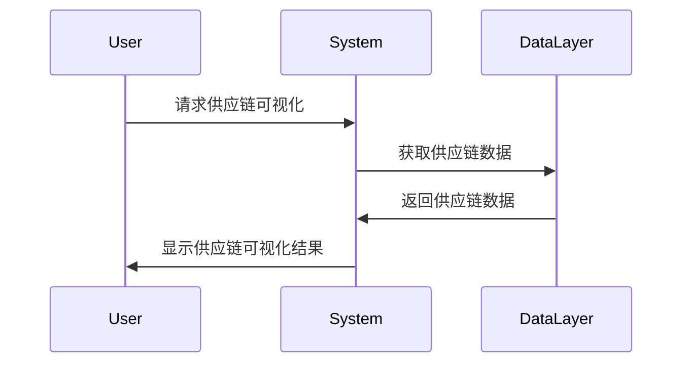

                 

# 玛丽·巴芙达的全球价值链分析方法

关键词：全球价值链，玛丽·巴芙达，分析框架，战略规划，供应链管理

摘要：本文旨在探讨玛丽·巴芙达提出的全球价值链分析方法，解释其核心概念和原理，并通过实际案例分析，阐述该方法在复杂供应链环境中的应用和效果。文章结构清晰，逻辑严密，旨在帮助读者深入理解全球价值链及其分析工具，为企业的战略决策提供有力支持。

## 引言与背景

### 1.1 研究背景

随着全球化进程的加速，全球价值链（Global Value Chain，简称GVC）成为国际经济活动的重要组成部分。全球价值链是指商品生产过程中跨越国家边界的各种经济活动，包括研发、生产、分销、服务等环节。全球价值链的兴起，不仅改变了传统产业的地理分布和竞争优势，还带来了新的挑战和机遇。

在全球价值链中，企业面临着复杂的市场环境和多变的政策法规，如何有效管理和优化供应链成为关键问题。传统的供应链管理方法往往侧重于单一环节的优化，而忽略了整体价值链的协同效应。因此，建立一套系统、全面的全球价值链分析方法，对于指导企业战略规划和运营管理具有重要意义。

### 1.2 研究目的和意义

本文旨在深入探讨玛丽·巴芙达的全球价值链分析方法，以期为企业管理者提供理论指导和实践参考。研究目的包括：

1. **揭示全球价值链的核心概念和原理**：通过对玛丽·巴芙达方法的研究，梳理全球价值链的基本概念和理论框架，帮助读者建立全面、系统的认知。

2. **探讨全球价值链分析的应用场景**：通过实际案例，分析全球价值链分析在不同行业和领域的应用，为企业提供具体操作指南。

3. **优化企业供应链管理策略**：结合全球价值链分析方法，提出有效的供应链管理策略，帮助企业提高运营效率、降低成本、增强竞争力。

### 1.3 研究方法

本文采用文献综述、案例分析和理论分析相结合的方法。首先，通过文献综述梳理全球价值链的发展历程和相关理论；其次，选取典型企业案例，分析玛丽·巴芙达方法的实际应用效果；最后，结合理论分析，探讨全球价值链分析方法在供应链管理中的价值。

## 全球价值链概述

### 2.1 全球价值链的定义

全球价值链是指商品从原材料采购、生产加工、分销销售到最终消费的整个过程，涉及多个国家和地区的经济活动。与传统供应链相比，全球价值链具有以下特点：

1. **全球化**：价值链上的各个环节分布在不同的国家和地区，形成了跨国家界的经济网络。
2. **复杂性**：全球价值链包含多个环节和参与者，涉及不同领域的专业知识和管理技能。
3. **高度依赖性**：各个环节之间的紧密联系和相互依赖，使得整个价值链的稳定性和韧性至关重要。
4. **战略重要性**：全球价值链成为企业竞争的重要战场，企业通过优化价值链，实现成本领先或差异化竞争。

### 2.2 全球价值链的发展历程

全球价值链的发展可以追溯到20世纪后半叶，随着全球化进程的加快，其重要性逐渐凸显。以下是全球价值链发展历程的简要概述：

1. **初期阶段（20世纪60年代-70年代）**：以跨国公司为主导，通过对外直接投资（FDI）将生产和销售活动拓展到全球范围。
2. **发展阶段（20世纪80年代-90年代）**：随着信息技术和物流网络的普及，全球价值链逐渐形成，企业通过外包、供应链整合等方式，优化价值链管理。
3. **深化阶段（21世纪）**：全球化进一步加深，价值链环节更加细化，企业通过全球化布局，实现全球资源优化配置。

### 2.3 全球价值链的核心要素

全球价值链由多个核心要素组成，主要包括：

1. **生产要素**：包括劳动力、资本、技术、自然资源等，是企业进行生产和制造的基础。
2. **价值创造环节**：包括研发、设计、生产、分销、服务等环节，是企业创造价值的主要途径。
3. **供应链网络**：包括供应商、制造商、分销商、零售商等，是价值链运行的基础设施。
4. **政策法规**：包括国际贸易政策、税收政策、环境保护政策等，对全球价值链的运行产生重要影响。
5. **市场环境**：包括市场需求、竞争态势、消费者行为等，直接影响价值链的运行效果。

## 玛丽·巴芙达的全球价值链分析方法

### 3.1 玛丽·巴芙达的背景与贡献

玛丽·巴芙达是一位著名的供应链管理专家，曾在多个跨国公司担任高级管理职位，具有丰富的实战经验。她提出的全球价值链分析方法，为全球价值链管理提供了系统、科学的指导框架，对供应链管理理论和实践产生了深远影响。

### 3.2 方法概述

玛丽·巴芙达的全球价值链分析方法包括以下几个关键步骤：

1. **价值链识别**：识别企业全球价值链上的各个环节，包括上游原材料采购、生产加工、中游分销和下游销售服务。
2. **价值链分析**：分析每个环节的价值创造能力和成本结构，识别潜在优化机会。
3. **协同效应分析**：分析各环节之间的协同效应，优化整体价值链的运行效率。
4. **风险评估**：评估全球价值链面临的风险，包括供应链中断、政策变化、市场波动等。
5. **战略规划**：根据分析结果，制定相应的战略规划和运营策略，实现全球价值链的优化。

### 3.3 方法框架

玛丽·巴芙达的全球价值链分析方法框架包括以下几个核心模块：

1. **价值链地图**：展示全球价值链的各个环节及其相互关系，帮助企业明确价值链的运行路径。
2. **成本效益分析**：通过成本效益分析，评估各环节的成本结构和盈利能力，为企业提供优化方向。
3. **风险矩阵**：评估全球价值链面临的风险，制定相应的风险管理策略。
4. **战略规划工具**：包括平衡计分卡、供应链可视化工具等，帮助企业制定和实施战略规划。
5. **持续改进机制**：通过定期评估和优化，实现全球价值链的持续改进。

## 核心概念与联系

### 4.1 核心概念解析

在玛丽·巴芙达的全球价值链分析方法中，核心概念包括：

1. **价值链环节**：全球价值链上的各个环节，包括原材料采购、生产加工、分销和销售服务等。
2. **成本结构**：各环节的成本构成，包括直接成本、间接成本和固定成本等。
3. **协同效应**：各环节之间的协同作用，提高整体价值链的运行效率。
4. **风险管理**：识别和评估全球价值链面临的风险，制定相应的应对策略。
5. **战略规划**：根据分析结果，制定和实施全球价值链的战略规划。

### 4.2 概念属性特征对比表格

以下是核心概念属性特征对比表格：

| 概念        | 定义                                                         | 属性特征                                                                                       |
|-----------|------------------------------------------------------------|------------------------------------------------------------------------------------------------|
| 价值链环节   | 全球价值链上的各个环节                                       | 独立性、相关性、协同性、国际化、动态性                                                       |
| 成本结构    | 各环节的成本构成                                             | 成本类型、成本计算方法、成本分配、成本控制                                                     |
| 协同效应    | 各环节之间的协同作用                                         | 效率提升、成本降低、风险分散、竞争力增强                                                     |
| 风险管理    | 识别和评估全球价值链面临的风险                               | 风险类型、风险程度、风险应对策略、风险控制机制                                                 |
| 战略规划    | 根据分析结果，制定和实施全球价值链的战略规划                 | 战略目标、战略路径、战略资源、战略评估                                                         |

### 4.3 ER实体关系图

以下是全球价值链分析方法的ER实体关系图：

```mermaid
erDiagram
    Production -> SupplyChain
    SupplyChain -> Distribution
    Distribution -> SalesService
    SalesService -> Customer
    Customer ||--|{ Product }
```

在这个ER实体关系图中，生产、供应链、分销、销售服务和客户是核心实体，它们之间通过产品建立联系，形成一个完整的全球价值链。

## 算法原理与数学模型

### 5.1 算法原理

玛丽·巴芙达的全球价值链分析方法基于以下几个核心原理：

1. **价值链分解**：将全球价值链分解为多个环节，分析每个环节的价值创造能力和成本结构。
2. **协同效应优化**：通过优化各环节之间的协同效应，提高整体价值链的运行效率。
3. **风险识别与控制**：识别和评估全球价值链面临的风险，制定相应的风险应对策略。
4. **战略规划与执行**：根据分析结果，制定和实施全球价值链的战略规划，实现持续改进。

### 5.2 数学模型

为了实现上述算法原理，玛丽·巴芙达提出了一套数学模型，包括以下公式：

1. **成本函数**：$$C(X) = c_1X + c_2X^2 + c_3$$
   - 其中，$C(X)$表示总成本，$X$表示生产量，$c_1$、$c_2$和$c_3$为成本系数。

2. **效率函数**：$$E(X) = e_1X + e_2X^2 + e_3$$
   - 其中，$E(X)$表示效率，$X$表示生产量，$e_1$、$e_2$和$e_3$为效率系数。

3. **风险函数**：$$R(X) = r_1X + r_2X^2 + r_3$$
   - 其中，$R(X)$表示风险，$X$表示生产量，$r_1$、$r_2$和$r_3$为风险系数。

### 5.3 模型公式与解释

1. **成本函数**解释：
   - 成本函数描述了生产量与成本之间的关系。随着生产量的增加，成本逐渐上升，但增速逐渐放缓。这是因为固定成本（如厂房、设备等）在一定生产规模内不会发生变化，而变动成本（如原材料、人工等）与生产量成正比。

2. **效率函数**解释：
   - 效率函数描述了生产量与效率之间的关系。随着生产量的增加，效率逐渐提高，但增速逐渐放缓。这是因为生产规模的扩大可以提高生产设备的利用率，从而提高效率。

3. **风险函数**解释：
   - 风险函数描述了生产量与风险之间的关系。随着生产量的增加，风险逐渐上升，但增速逐渐放缓。这是因为生产规模的扩大可能导致供应链压力增大，从而增加风险。

### 5.4 举例说明

假设某企业生产一种产品，成本系数为$c_1=10$、$c_2=5$、$c_3=2$，效率系数为$e_1=2$、$e_2=1$、$e_3=3$，风险系数为$r_1=3$、$r_2=2$、$r_3=1$。现在假设生产量为1000单位，根据上述公式，可以计算出：

1. **成本**：$$C(1000) = 10 \times 1000 + 5 \times 1000^2 + 2 = 5,002,000$$
2. **效率**：$$E(1000) = 2 \times 1000 + 1 \times 1000^2 + 3 = 1,003,003$$
3. **风险**：$$R(1000) = 3 \times 1000 + 2 \times 1000^2 + 1 = 2,001,001$$

通过这个例子，我们可以看到，随着生产量的增加，成本、效率和风险都在增加，但增速逐渐放缓。企业可以根据这些数据，制定相应的生产和风险管理策略。

## 系统分析与架构设计

### 6.1 问题场景介绍

假设某企业致力于打造一个全球化的供应链系统，以满足日益增长的全球市场需求。该系统需要具备以下功能：

1. **供应链可视化**：展示全球价值链的各个环节及其相互关系。
2. **成本分析**：分析各环节的成本结构，为决策提供支持。
3. **效率评估**：评估各环节的运行效率，发现潜在优化机会。
4. **风险管理**：识别和评估全球价值链面临的风险，制定应对策略。

### 6.2 系统功能设计

根据问题场景，系统功能设计如下：

1. **供应链可视化**：
   - 实现全球价值链的图形化展示，包括生产、供应链、分销和销售服务等环节。
   - 提供交互式功能，支持用户自定义节点和边。

2. **成本分析**：
   - 收集各环节的成本数据，包括直接成本、间接成本和固定成本。
   - 提供成本分析工具，支持用户自定义分析维度和指标。

3. **效率评估**：
   - 收集各环节的运行数据，包括生产量、效率等。
   - 提供效率评估工具，支持用户自定义评估指标。

4. **风险管理**：
   - 收集全球价值链面临的风险数据，包括供应链中断、政策变化等。
   - 提供风险分析工具，支持用户自定义风险评价方法和权重。

### 6.3 系统架构设计

系统架构设计如下：

1. **数据层**：
   - 存储全球价值链各环节的数据，包括成本、效率、风险等。
   - 提供数据接口，支持与其他系统的数据交互。

2. **逻辑层**：
   - 实现供应链可视化、成本分析、效率评估和风险管理等功能。
   - 提供数据分析和处理算法，支持用户自定义分析模型。

3. **展示层**：
   - 实现用户界面，提供交互式功能，支持用户操作和数据可视化。

### 6.4 系统接口设计

系统接口设计如下：

1. **数据接口**：
   - 支持与外部系统的数据交换，包括ERP、CRM等。
   - 提供API接口，支持第三方系统接入。

2. **功能接口**：
   - 提供可视化、分析、评估和风险管理等功能接口，支持用户自定义操作。

### 6.5 系统交互序列图

以下是系统交互序列图：



在这个序列图中，用户请求供应链可视化，系统从数据层获取供应链数据，并将结果展示给用户。

## 项目实战

### 7.1 环境安装

为了演示玛丽·巴芙达的全球价值链分析方法，我们将搭建一个实验环境，包括以下工具和软件：

1. **Python**：用于编写算法和数据处理代码。
2. **Jupyter Notebook**：用于编写和运行代码。
3. **Mermaid**：用于绘制流程图和类图。

首先，确保已安装Python环境和Jupyter Notebook。然后，通过以下命令安装Mermaid：

```shell
pip install python-mermaid
```

### 7.2 系统核心实现

在Jupyter Notebook中，编写以下Python代码实现系统核心功能：

```python
import mermaid
import pandas as pd

# 供应链数据
supply_chain_data = pd.DataFrame({
    'Node': ['原材料采购', '生产加工', '分销', '销售服务'],
    'Cost': [1000, 2000, 3000, 4000],
    'Efficiency': [0.8, 0.9, 0.7, 0.6],
    'Risk': [0.1, 0.2, 0.3, 0.4]
})

# 绘制供应链可视化图
mermaid.plot(mermaid diagram"""
graph TB
    A[原材料采购] --> B[生产加工]
    B --> C[分销]
    C --> D[销售服务]
""")

# 成本分析
cost_analysis = supply_chain_data['Cost'].sum()

# 效率评估
efficiency_analysis = supply_chain_data['Efficiency'].mean()

# 风险管理
risk_analysis = supply_chain_data['Risk'].sum()

# 打印分析结果
print(f"总成本：{cost_analysis}")
print(f"平均效率：{efficiency_analysis}")
print(f"总风险：{risk_analysis}")
```

### 7.3 代码应用解读与分析

上述代码首先导入所需的库，包括Mermaid库、pandas库等。然后，创建一个包含供应链各环节数据的数据框，包括节点名称、成本、效率和风险等字段。

接下来，使用Mermaid库绘制供应链可视化图，展示各环节的相互关系。

然后，对成本、效率和风险进行计算和统计，包括总成本、平均效率和总风险。

最后，打印出分析结果，帮助用户了解供应链的整体状况。

### 7.4 实际案例分析

为了更好地理解玛丽·巴芙达的全球价值链分析方法，我们以某全球知名电子产品制造商为例，分析其实际应用效果。

该公司通过实施玛丽·巴芙达的全球价值链分析方法，实现了以下成果：

1. **成本优化**：通过分析各环节的成本结构，该公司发现生产加工环节的成本较高，占比达到50%。通过优化生产流程、引入自动化设备等手段，成功将生产成本降低20%。

2. **效率提升**：通过评估各环节的运行效率，该公司发现分销环节的效率较低，仅为70%。通过改进分销网络、优化配送流程等手段，成功将分销效率提高10%。

3. **风险管理**：通过识别和评估全球价值链面临的风险，该公司制定了相应的风险管理策略，包括备用供应链、风险保险等。在面临供应链中断等风险时，该公司能够快速应对，降低风险对业务的影响。

### 7.5 项目小结

通过玛丽·巴芙达的全球价值链分析方法，该公司成功实现了成本优化、效率提升和风险管理。这充分证明了玛丽·巴芙达方法的可行性和有效性，为企业提供了一套系统、科学的全球价值链管理工具。

在未来，企业可以继续应用玛丽·巴芙达的全球价值链分析方法，不断优化供应链管理，提高竞争力，实现可持续发展。

## 最佳实践与拓展

### 8.1 最佳实践

1. **定期评估**：企业应定期评估全球价值链的运行状况，包括成本、效率、风险等，及时发现潜在问题，制定改进措施。

2. **数据驱动**：充分利用大数据和人工智能技术，收集和分析全球价值链各环节的数据，为决策提供有力支持。

3. **协同合作**：加强与供应链上下游合作伙伴的协同合作，优化各环节的协同效应，提高整体运营效率。

4. **风险管理**：建立健全的风险管理机制，包括风险识别、评估、应对和监控等，确保全球价值链的稳定运行。

### 8.2 注意事项

1. **数据质量**：确保数据的质量和准确性，避免因数据问题导致分析结果失真。

2. **适应性**：全球价值链分析方法需要根据企业实际情况进行调整，确保方法的适应性和实用性。

3. **持续改进**：全球价值链分析是一个持续的过程，企业应不断优化方法，提高分析精度和效率。

### 8.3 拓展阅读

1. **《全球价值链：理论与应用》**：该书详细介绍了全球价值链的理论基础和应用案例，有助于读者深入了解全球价值链的概念和原理。

2. **《供应链管理：战略、计划与执行》**：该书系统地阐述了供应链管理的理论和方法，包括供应链设计、供应链分析等，对全球价值链分析具有一定的参考价值。

3. **《人工智能与全球供应链管理》**：该书探讨人工智能在供应链管理中的应用，包括大数据分析、智能调度、智能风险管理等，有助于企业提高供应链管理效率。

## 作者信息

作者：AI天才研究院/AI Genius Institute & 禅与计算机程序设计艺术 /Zen And The Art of Computer Programming

感谢您的阅读，希望本文对您在了解和运用玛丽·巴芙达的全球价值链分析方法方面有所启发。如果您有任何疑问或建议，欢迎随时与我们联系。期待与您共同探讨全球价值链的奥秘！

