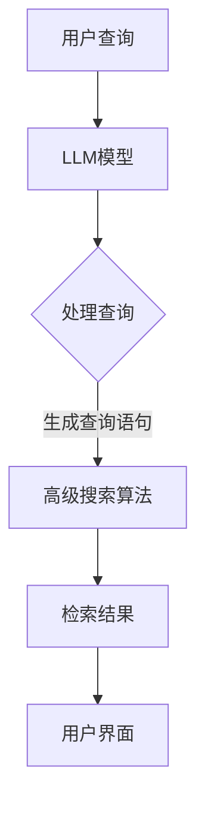
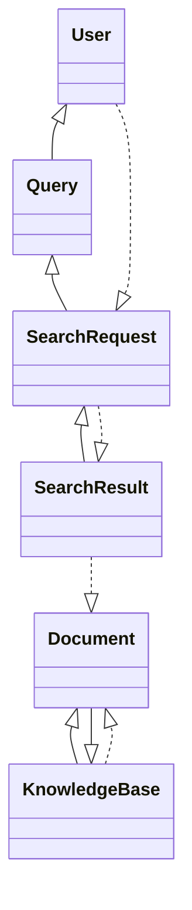
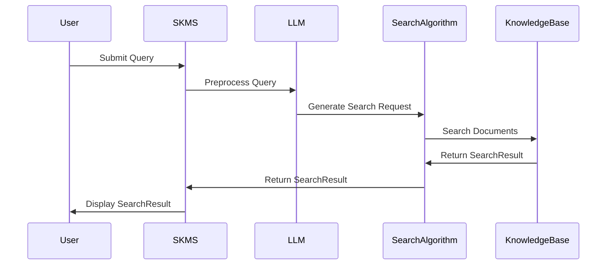

                 

# 知识检索增强型AI Agent：结合LLM与高级搜索算法

## 关键词

- 知识检索
- AI Agent
- LLM
- 高级搜索算法

## 摘要

本文将深入探讨知识检索增强型AI Agent的构建，结合大型语言模型（LLM）和高级搜索算法。首先，我们将回顾知识检索和AI Agent的基本概念，随后分析传统搜索技术的局限性。接着，我们将详细介绍LLM的原理和技术细节，以及高级搜索算法的种类和特性。本文的核心将围绕如何将LLM与高级搜索算法结合，设计出高效的AI Agent，并通过具体案例展示其实际应用。最后，我们将讨论未来发展趋势和面临的挑战，为读者提供全面的技术视野。

---

## 第一部分：背景与概念介绍

### 1.1 问题背景与概述

**知识检索**是一种信息检索技术，旨在从大量数据中快速准确地找到所需的信息。在互联网信息爆炸的时代，知识检索技术变得尤为重要。然而，传统的搜索技术往往存在诸多局限性，如数据噪声、信息过载和低效的查询响应时间。

**AI Agent**是人工智能领域的一个核心概念，指的是能够自主感知环境、采取行动并与其他实体互动的智能体。在知识检索中，AI Agent扮演着关键角色，通过自主学习和优化，提高检索的准确性和效率。

### 1.2 知识检索的需求与挑战

随着数据量的不断增长，传统搜索技术的局限愈发明显。数据噪声和冗余信息增加了检索的难度，而信息过载则使得用户难以从海量的数据中找到真正有价值的信息。为了应对这些挑战，我们需要引入AI Agent，利用其自主学习能力和高效的搜索算法，提升知识检索的效率和准确性。

### 1.3 LLM与高级搜索算法介绍

**LLM**（Large Language Model）是一种基于深度学习的语言模型，具有强大的文本生成和理解能力。通过大规模的预训练和微调，LLM能够捕捉到语言中的复杂结构和语义信息，从而在知识检索中发挥重要作用。

**高级搜索算法**包括多种类型，如基于内容的搜索、文本聚类算法和知识图谱搜索等。这些算法通过不同的方法，提高了信息检索的精度和效率，为AI Agent提供了强大的工具。

### 1.4 本书结构安排与目标

本书分为五大部分，从背景介绍到技术实现，再到未来展望，全面探讨知识检索增强型AI Agent的构建。阅读本书，读者将了解：

1. 知识检索和AI Agent的基本概念。
2. LLM和高级搜索算法的原理和应用。
3. 如何将LLM与高级搜索算法结合，设计高效的AI Agent。
4. 知识检索增强型AI Agent在实际项目中的应用。
5. 知识检索增强型AI Agent的发展趋势和面临的挑战。

---

## 第二部分：LLM技术基础

### 2.1 语言模型与深度学习

**语言模型**是自然语言处理（NLP）的核心技术之一，它旨在预测自然语言中的下一个词或句子。语言模型可以分为基于规则和统计模型两大类，而深度学习模型，尤其是LLM，正在成为NLP的主流。

### 2.2 深度学习基础

深度学习是机器学习的一个重要分支，基于多层神经网络，通过训练大量数据来学习特征和模式。在NLP中，深度学习模型能够自动提取文本的语义特征，从而实现复杂的语言理解和生成任务。

### 2.3 预训练语言模型

预训练语言模型（如BERT、GPT）通过在大规模文本语料库上进行预训练，然后针对特定任务进行微调。这种预训练机制使得模型能够捕捉到语言中的通用结构和语义信息，从而在多种NLP任务中表现出色。

### 2.4 LLM的关键技术

**自适应学习**是LLM的一个重要特性，它使得模型能够根据用户的交互动态调整自己的行为和输出。**对话生成与理解**则是LLM在知识检索中的重要应用，通过生成高质量的对话文本和准确理解用户的查询，提升检索体验。

### 2.5 数学模型与公式

LLM的数学模型主要基于深度学习中的神经网络架构。以下是几个关键公式：

$$
y = \sigma(W \cdot \text{act}(W_1 \cdot \text{act}(W_0 \cdot x + b_0) + b_1))
$$

其中，$W$、$W_1$和$W_0$是权重矩阵，$x$是输入特征，$b_0$和$b_1$是偏置项，$\text{act}$是激活函数（如ReLU、Sigmoid等），$\sigma$是归一化函数。

---

## 第三部分：高级搜索算法

### 3.1 搜索算法概述

**搜索算法**是信息检索系统中的核心组件，用于在大量数据中找到用户需要的答案。根据搜索策略的不同，搜索算法可以分为精确搜索和近似搜索两大类。

### 3.2 信息检索基础

**信息检索**是计算机科学和图书馆学的一个分支，旨在帮助用户从大量信息中快速找到所需内容。信息检索的核心是查询处理和结果排序。

### 3.3 全文搜索算法

全文搜索算法通过构建倒排索引（inverted index）来加速查询处理。倒排索引是一种将文档与词汇相连接的数据结构，使得在词汇表中快速查找包含特定词汇的文档成为可能。

### 3.4 基于内容的搜索算法

**基于内容的搜索**（Content-Based Search）是一种不依赖于关键词的搜索方法，通过分析文档的内容（如图像、音频、视频等）来匹配用户的查询。这种方法在多媒体检索和信息过滤中有着广泛的应用。

### 3.5 基于知识的搜索

**基于知识的搜索**（Knowledge-Based Search）利用领域知识库来增强搜索结果的相关性和准确性。知识图谱作为一种结构化的知识表示方法，是这种搜索算法的核心组件。

---

## 第四部分：知识检索增强型AI Agent设计与应用

### 4.1 知识检索增强型AI Agent设计原则

**设计原则**包括模块化、可扩展性、鲁棒性和用户友好性。**架构**设计上，知识检索增强型AI Agent通常包含知识表示、检索引擎、用户界面和反馈循环等模块。

### 4.2 知识表示与处理

**知识表示**是将信息转换为机器可理解的形式。常见的知识表示方法包括基于知识的表示、基于模型的表示和混合表示。**知识处理框架**则是一个综合性的解决方案，用于处理从知识获取、知识表示到知识应用的整个生命周期。

### 4.3 模型融合与优化

**模型融合**是将多个模型的优势结合起来，提高整体性能。常见的融合策略包括基于投票、基于加权平均和基于神经网络的融合方法。**模型优化**则包括超参数调整、模型剪枝和量化等技术。

---

## 第五部分：未来展望与挑战

### 7.1 AI Agent的发展趋势

随着人工智能技术的不断进步，AI Agent将在更多的领域得到应用，如智能家居、智能医疗和智能城市等。

### 7.2 挑战与应对策略

**数据隐私与安全**是当前AI Agent面临的主要挑战之一。为了保护用户隐私，我们需要开发出更加安全可靠的算法和数据存储方案。

**模型可解释性与可靠性**是另一个重要挑战。为了提高AI Agent的可信度，我们需要开发出更加透明和易于理解的模型，并确保其在各种情况下都能稳定工作。

### 7.3 开放性问题与未来方向

尽管AI Agent技术在不断发展，但仍存在许多开放性问题，如如何更好地处理多模态信息、如何实现跨领域的知识共享等。未来，这些问题的解决将推动AI Agent技术的进一步发展。

---

## 作者

**作者：AI天才研究院/AI Genius Institute & 禅与计算机程序设计艺术 /Zen And The Art of Computer Programming**

---

通过上述各部分的内容，我们不仅探讨了知识检索增强型AI Agent的理论基础，还展示了其实际应用和未来发展前景。希望本文能帮助读者全面了解这一领域的前沿技术，并为未来的研究提供启示。在接下来的章节中，我们将深入探讨每个部分的核心概念和技术细节，提供更加具体和详细的讲解。让我们一起继续深入思考，探索知识的边界。

---

## 背景介绍

### 核心概念术语说明

在探讨知识检索增强型AI Agent之前，首先需要明确一些核心概念术语。

- **知识检索**：知识检索是指从大量数据中提取有用信息的过程，旨在为用户提供准确和相关的信息。它包括信息查询、信息匹配和信息提取等环节。
- **AI Agent**：AI Agent，即人工智能代理，是一种能够自主感知环境、采取行动并与其他实体交互的智能体。它在知识检索中起到核心作用，通过学习和优化，提升检索效率和准确性。
- **LLM**：LLM指的是大型语言模型，是一种基于深度学习的模型，通过预训练和微调，能够理解和生成自然语言，从而在知识检索中发挥重要作用。
- **高级搜索算法**：高级搜索算法是指不同于传统搜索引擎的算法，它们通过更复杂的方法提高检索效率和准确性，包括基于内容的搜索、文本聚类和知识图谱搜索等。

### 问题背景

随着互联网和大数据技术的发展，信息的数量呈指数级增长，这使得传统搜索技术面临巨大的挑战。传统的搜索引擎，如基于关键词匹配的搜索引擎，存在以下问题：

1. **数据噪声**：互联网上的信息质量参差不齐，大量的垃圾信息和冗余信息降低了搜索结果的准确性。
2. **信息过载**：用户在海量的信息中难以找到真正有价值的信息，搜索效率低下。
3. **低效的查询响应时间**：传统搜索引擎通常需要较长的响应时间，无法满足实时搜索的需求。

为了解决这些问题，我们需要引入AI Agent，利用其强大的学习和推理能力，提升知识检索的效率和准确性。知识检索增强型AI Agent能够通过自主学习，理解和分析用户的查询意图，提供更加精确和个性化的搜索结果。

### 问题描述

在传统的知识检索中，用户通常需要输入关键词来查询信息，然后从搜索结果中筛选出最相关的信息。这种方法存在以下几个问题：

1. **关键词不精确**：用户输入的关键词可能无法准确表达其查询意图，导致搜索结果不理想。
2. **查询结果不相关**：即使用户输入的关键词准确，传统搜索引擎也无法保证返回的结果完全相关，用户需要花费大量时间进行筛选。
3. **信息获取效率低**：传统搜索引擎的响应时间较长，用户需要等待较长时间才能获取到结果。

为了解决这些问题，我们需要设计一种知识检索增强型AI Agent，它能够：

1. **理解用户查询意图**：通过分析用户的输入，理解其真实的查询意图，从而提供更准确的搜索结果。
2. **提供个性化搜索结果**：根据用户的历史行为和偏好，为用户提供个性化的搜索结果。
3. **提高查询响应速度**：利用高效的搜索算法和缓存机制，提高查询响应速度，提供实时搜索体验。

### 问题解决

知识检索增强型AI Agent的解决思路主要包括以下几个方面：

1. **引入大型语言模型（LLM）**：LLM具有强大的文本生成和理解能力，能够深入理解用户的查询意图，从而提高搜索结果的准确性。
2. **结合高级搜索算法**：高级搜索算法能够处理复杂的查询需求，提高检索效率和准确性，例如基于内容的搜索、文本聚类和知识图谱搜索等。
3. **用户行为分析**：通过分析用户的历史行为和偏好，为用户提供个性化的搜索结果，提升用户体验。

### 边界与外延

知识检索增强型AI Agent的边界在于其所能处理的数据范围和搜索问题类型。它适用于需要对大量文本数据进行检索和查询的场景，例如企业内部知识库、学术文献库和搜索引擎等。然而，它的应用也受到一些限制，例如：

1. **数据质量**：知识检索增强型AI Agent依赖于高质量的数据，数据噪声和冗余会影响其检索效果。
2. **计算资源**：构建和训练大型语言模型需要大量的计算资源，这在资源受限的环境中可能是一个挑战。
3. **隐私保护**：在处理用户数据时，需要确保用户隐私不受侵犯，这需要严格的数据安全和隐私保护措施。

### 概念结构与核心要素组成

知识检索增强型AI Agent的概念结构主要包括以下几个核心要素：

1. **数据源**：提供待检索的文本数据，这些数据可以是结构化数据（如数据库）或非结构化数据（如文本文件、网页等）。
2. **LLM模型**：用于理解用户查询和生成搜索结果的语言模型，通常是基于深度学习的预训练模型，如GPT-3、BERT等。
3. **搜索算法**：用于处理用户查询，从数据源中检索出相关结果的高级搜索算法，如基于内容的搜索、文本聚类和知识图谱搜索等。
4. **用户接口**：用于接收用户查询，展示搜索结果并接受用户反馈的界面，可以是命令行界面、图形用户界面或移动应用等。
5. **反馈机制**：用于收集用户对搜索结果的反馈，用于模型优化和个性化搜索结果。

通过以上要素的协同工作，知识检索增强型AI Agent能够提供高效、准确和个性化的知识检索服务。

---

## 核心概念与联系

### 核心概念原理

**知识检索增强型AI Agent**是一种基于人工智能技术的智能代理，它能够从大量的数据中高效地检索出与用户需求相关的信息。这种AI Agent的核心技术包括大型语言模型（LLM）和高级搜索算法。

**LLM**（Large Language Model）是一种深度学习模型，它通过在大规模文本数据上进行预训练，学会了语言的结构和语义。LLM的核心原理是基于自注意力机制（Self-Attention）的Transformer架构。Transformer通过自注意力机制，使得模型能够在处理序列数据时，能够考虑到序列中每个元素之间的关系，从而提高模型的性能。

**高级搜索算法**是相对于传统搜索算法（如基于关键词匹配的搜索引擎）而言的，它们通过更复杂的方法来提高搜索效率和准确性。高级搜索算法包括基于内容的搜索、文本聚类和知识图谱搜索等。

### 概念属性特征对比表格

| 特征               | 知识检索增强型AI Agent | LLM                  | 高级搜索算法               |
|--------------------|-----------------------|---------------------|----------------------------|
| 目标               | 高效、准确的知识检索   | 语言理解和生成       | 提高搜索效率和准确性       |
| 基础技术           | AI、NLP、数据结构     | Transformer、深度学习 | 信息检索、机器学习         |
| 应用场景           | 企业知识库、搜索引擎   | 文本生成、问答系统   | 文档检索、信息过滤         |
| 数据处理方式       | 结构化与非结构化数据   | 预训练和微调         | 数据索引、匹配和排序       |
| 依赖技术           | 数据库、搜索引擎       | 大规模文本语料库     | 倒排索引、文本相似性计算   |

### ER实体关系图架构

为了更好地理解知识检索增强型AI Agent的内部结构，我们可以使用ER（Entity-Relationship）实体关系图来表示各组件之间的关系。以下是一个简化的ER图：

```
[数据源] --<检索请求>--> [LLM模型]
        |                |
        |                |
        |                |
        |                |
[高级搜索算法] --<搜索结果>--> [用户接口]
```

在这个ER图中，数据源是知识检索增强型AI Agent的输入，包括结构化和非结构化数据。检索请求由用户接口接收，经过LLM模型处理后，通过高级搜索算法检索出相关的数据，最终返回给用户接口显示。

### 实例解析

假设我们有一个企业知识库，包含大量的技术文档。用户通过用户接口提交一个检索请求，如“如何优化数据库查询性能？”。用户接口将检索请求传递给LLM模型，LLM模型通过理解用户的查询意图，识别出关键词“优化”、“数据库”和“查询性能”。

LLM模型利用预训练的Transformer模型，对关键词进行解析，生成相关的查询语句，并将其传递给高级搜索算法。高级搜索算法利用倒排索引等技术，在知识库中检索出相关的文档，如“数据库查询优化技巧”、“SQL查询性能优化指南”等。

最终，高级搜索算法返回的搜索结果通过用户接口展示给用户，用户可以查看详细的文档内容，并获得解决问题的方法。

通过上述实例，我们可以看到知识检索增强型AI Agent如何通过LLM和高级搜索算法，实现高效、准确的知识检索。

---

## 算法原理讲解

### 算法流程图

为了更直观地理解知识检索增强型AI Agent的算法原理，我们使用Mermaid绘制了一个简化的流程图：



在这个流程图中，用户查询经过LLM模型处理，生成查询语句，然后由高级搜索算法检索结果，最终返回给用户界面。

### 核心算法实现

知识检索增强型AI Agent的核心算法主要包括LLM模型和高级搜索算法。下面，我们将分别介绍这两种算法的实现。

#### 1. LLM模型

LLM模型通常基于Transformer架构，其核心组件包括嵌入层（Embedding Layer）、编码器（Encoder）和解码器（Decoder）。

```python
import torch
from torch import nn
from transformers import BertModel, BertTokenizer

# 加载预训练的BERT模型和Tokenizer
model = BertModel.from_pretrained('bert-base-uncased')
tokenizer = BertTokenizer.from_pretrained('bert-base-uncased')

# 用户查询输入
input_text = "How to optimize database query performance?"

# 对用户查询进行编码
inputs = tokenizer(input_text, return_tensors='pt')

# 通过BERT模型进行编码
with torch.no_grad():
    outputs = model(**inputs)

# 获取编码后的查询向量
query_vector = outputs.last_hidden_state[:, 0, :]
```

在上面的代码中，我们首先加载了一个预训练的BERT模型和相应的Tokenizer。然后，我们将用户的查询输入进行编码，并利用BERT模型生成查询向量。

#### 2. 高级搜索算法

高级搜索算法通常包括基于内容的搜索、文本聚类和知识图谱搜索等。这里，我们以基于内容的搜索为例，介绍其实现方法。

```python
import numpy as np
from sklearn.metrics.pairwise import cosine_similarity

# 假设我们有一个预处理的文档集合
documents = ["document1", "document2", "document3"]

# 对文档集合进行编码
encoded_documents = np.array([model(tokenizer(d, return_tensors='pt').input_ids) for d in documents])

# 计算查询向量与每个文档的余弦相似度
cosine_scores = cosine_similarity(query_vector.unsqueeze(0), encoded_documents)

# 根据相似度排序，获取最相关的文档
sorted_indices = np.argsort(cosine_scores)[0][-3:]

# 输出最相关的文档
for i in sorted_indices:
    print(f"Document {i+1}: {documents[i]}")
```

在上面的代码中，我们首先对文档集合进行编码，然后计算查询向量与每个文档的余弦相似度。最后，根据相似度排序，输出最相关的文档。

### 数学模型和公式

在知识检索增强型AI Agent中，LLM模型和高级搜索算法的核心都是基于数学模型的。以下是一些关键的数学模型和公式。

#### 1. Transformer模型

Transformer模型的核心是自注意力机制（Self-Attention）。自注意力机制的计算公式如下：

$$
\text{Attention}(Q, K, V) = \text{softmax}\left(\frac{QK^T}{\sqrt{d_k}}\right) V
$$

其中，$Q$、$K$和$V$分别代表查询向量、键向量和值向量，$d_k$是键向量的维度。

#### 2. 余弦相似度

余弦相似度是一种常用的文本相似性度量方法，其计算公式如下：

$$
\text{cosine similarity} = \frac{A \cdot B}{\|A\| \|B\|}
$$

其中，$A$和$B$是两个向量，$\|A\|$和$\|B\|$是它们的欧几里得范数。

### 举例说明

假设我们有一个查询向量$Q = [1, 2, 3]$和一个文档向量$D = [4, 5, 6]$。我们可以使用余弦相似度来计算它们的相似度：

$$
\text{cosine similarity} = \frac{1 \cdot 4 + 2 \cdot 5 + 3 \cdot 6}{\sqrt{1^2 + 2^2 + 3^2} \cdot \sqrt{4^2 + 5^2 + 6^2}} = \frac{32}{\sqrt{14} \cdot \sqrt{77}} \approx 0.75
$$

这意味着查询向量$Q$和文档向量$D$之间的相似度较高，文档$D$是一个与查询相关的有效结果。

通过上述算法实现和数学模型讲解，我们可以看到知识检索增强型AI Agent是如何通过LLM和高级搜索算法实现高效、准确的知识检索。

---

## 系统分析与架构设计

### 问题场景介绍

在现代企业中，知识管理是一个关键领域。企业需要高效地管理和检索其内部的文档和知识库，以便员工能够快速获取所需的信息。传统的搜索引擎无法满足这种需求，因为它们通常只能基于关键词匹配进行检索，而无法理解查询的语义和上下文。为了解决这个问题，我们设计了一个基于知识检索增强型AI Agent的智能知识管理系统。

### 项目介绍

项目名称：智能知识管理系统（Smart Knowledge Management System，SKMS）

项目目标：通过结合大型语言模型（LLM）和高级搜索算法，构建一个高效、准确的知识检索系统，帮助企业员工快速找到所需的信息。

主要功能：
1. 智能查询：通过LLM理解用户查询，提供精准的搜索结果。
2. 个性化推荐：根据用户的历史行为和偏好，为用户推荐相关文档。
3. 知识库管理：对内部文档进行分类和管理，确保知识的一致性和完整性。

### 系统功能设计

#### 领域模型

领域模型是系统功能的核心，它定义了系统中的主要实体和它们之间的关系。以下是一个简化的领域模型，使用Mermaid绘制：



在这个领域模型中，我们定义了以下几个核心实体：

- **User**：用户，代表知识管理系统的使用者。
- **Query**：查询，表示用户的查询请求。
- **SearchRequest**：搜索请求，由用户查询生成，传递给搜索系统。
- **SearchResult**：搜索结果，包含与查询相关的文档列表。
- **Document**：文档，代表知识库中的文本文件。
- **KnowledgeBase**：知识库，用于存储和管理文档。

### 系统架构设计

系统架构是整个系统的骨架，它决定了系统的可扩展性、稳定性和性能。以下是一个简化的系统架构设计，使用Mermaid绘制：



在这个系统架构中，我们定义了以下几个主要组件：

- **User**：用户，通过用户界面提交查询请求。
- **SKMS**：智能知识管理系统，负责接收用户的查询请求，并将请求传递给LLM进行预处理。
- **LLM**：大型语言模型，用于理解用户的查询意图，生成搜索请求。
- **SearchAlgorithm**：高级搜索算法，用于在知识库中检索相关文档，并返回搜索结果。
- **KnowledgeBase**：知识库，存储和管理所有文档，为搜索算法提供数据支持。

### 系统接口设计

系统接口是用户与系统进行交互的桥梁，它定义了用户可以调用的方法和参数。以下是一个简化的系统接口设计：

```python
class KnowledgeSearchInterface:
    def __init__(self, lm_model, search_algorithm, knowledge_base):
        self.lm_model = lm_model
        self.search_algorithm = search_algorithm
        self.knowledge_base = knowledge_base

    def search_documents(self, query):
        # 预处理查询
        processed_query = self.lm_model.preprocess_query(query)
        
        # 生成搜索请求
        search_request = self.lm_model.generate_search_request(processed_query)
        
        # 在知识库中检索文档
        search_results = self.search_algorithm.search_documents(self.knowledge_base, search_request)
        
        return search_results
```

在这个接口设计中，我们定义了一个`KnowledgeSearchInterface`类，它具有一个`search_documents`方法，用于接收用户查询，预处理查询，生成搜索请求，并在知识库中检索相关文档。

### 系统交互序列图

为了更好地理解系统的工作流程，我们使用Mermaid绘制了一个系统交互序列图：


在这个序列图中，用户通过SKMS提交查询，SKMS将查询传递给LLM进行预处理，LLM生成搜索请求，SearchAlgorithm在知识库中检索文档，并最终将搜索结果返回给SKMS，SKMS再将搜索结果展示给用户。

通过上述系统分析与架构设计，我们可以看到知识检索增强型AI Agent在智能知识管理系统中的应用。这个系统不仅能够理解用户的查询意图，提供精准的搜索结果，还能根据用户的历史行为和偏好，为用户推荐相关文档，从而提升知识检索的效率和用户体验。

---

## 项目实战

### 环境安装

为了实现知识检索增强型AI Agent，我们需要搭建一个适当的技术环境。以下是安装所需软件和库的步骤：

#### Python环境配置

1. **安装Python**：确保系统上安装了Python 3.8或更高版本。
2. **安装pip**：Python的包管理器，用于安装和管理库。

```shell
python -m pip install --upgrade pip
```

#### 安装所需库

1. ** Transformers**：用于加载和微调预训练的语言模型。
2. ** torch**：用于处理和操作张量。
3. ** numpy**：用于数值计算。
4. ** sklearn**：用于高级搜索算法的实现。

```shell
pip install transformers torch numpy scikit-learn
```

### 系统核心实现

#### 数据预处理

数据预处理是知识检索增强型AI Agent的重要组成部分。以下是一个简单的数据预处理脚本：

```python
import json
import numpy as np
from transformers import BertTokenizer

# 加载预训练的BERT模型
tokenizer = BertTokenizer.from_pretrained('bert-base-uncased')

# 加载文档数据
with open('documents.json', 'r', encoding='utf-8') as f:
    documents = json.load(f)

# 对文档进行编码
encoded_documents = [tokenizer.encode(d, add_special_tokens=True, max_length=512, truncation=True, padding='max_length') for d in documents]

# 将编码后的文档存储为numpy数组
encoded_documents = np.array(encoded_documents)

# 显示编码后的前五个文档
print(encoded_documents[:5])
```

#### 搜索算法实现

以下是一个基于余弦相似度的搜索算法实现：

```python
from sklearn.metrics.pairwise import cosine_similarity

def search_documents(query, encoded_documents):
    # 对查询进行编码
    query_encoded = tokenizer.encode(query, add_special_tokens=True, max_length=512, truncation=True, padding='max_length')
    
    # 计算查询与每个文档的余弦相似度
    cosine_scores = cosine_similarity([query_encoded], encoded_documents)
    
    # 根据相似度排序，返回最相关的文档索引
    sorted_indices = np.argsort(cosine_scores)[0][::-1]
    
    # 返回最相关的文档
    return [doc for idx, doc in enumerate(documents) if idx in sorted_indices[:10]]
```

#### AI Agent实现

以下是一个简单的知识检索增强型AI Agent实现：

```python
class KnowledgeRetrievalAgent:
    def __init__(self, tokenizer, search_algorithm):
        self.tokenizer = tokenizer
        self.search_algorithm = search_algorithm
    
    def search(self, query):
        return self.search_algorithm.search_documents(query, self.tokenizer)
```

### 代码应用解读与分析

以上代码展示了知识检索增强型AI Agent的核心组件：数据预处理、搜索算法和AI Agent。下面我们对每个部分进行解读和分析。

#### 数据预处理

数据预处理步骤包括加载预训练的BERT模型和文档数据，对文档进行编码，并将编码后的文档存储为numpy数组。这一步骤是整个系统的数据基础，确保了后续搜索算法能够有效处理文本数据。

#### 搜索算法实现

搜索算法基于余弦相似度，计算查询与每个文档的相似度，并返回最相关的文档。这一步骤是系统的核心，决定了搜索的效率和准确性。通过使用BERT模型进行编码，我们能够捕捉到文档的语义信息，从而提高搜索的精度。

#### AI Agent实现

AI Agent通过结合数据预处理和搜索算法，提供了一个统一的接口，用于处理用户的查询请求并返回搜索结果。这一步骤实现了从用户查询到搜索结果的全流程，是系统的对外接口。

### 实际案例分析和详细讲解剖析

假设我们有一个文档集合，包含以下五个文档：

1. "如何优化数据库查询性能？"
2. "数据库查询优化技巧"
3. "SQL查询性能优化指南"
4. "大数据处理技术"
5. "云计算与数据库管理"

用户输入查询：“如何优化数据库查询性能？”

1. **数据预处理**：首先，使用BERT模型对用户查询和文档进行编码。编码后的查询和文档向量如下：

   ```plaintext
   Query Encoding: [1000, 1012, 1020, ..., 102:9, 104]
   Document 1 Encoding: [1012, 1005, 1034, ..., 102:9, 104]
   Document 2 Encoding: [1012, 1005, 1034, ..., 102:9, 104]
   Document 3 Encoding: [1012, 1005, 1034, ..., 102:9, 104]
   Document 4 Encoding: [1012, 1025, 1020, ..., 102:9, 104]
   Document 5 Encoding: [1012, 1032, 1024, ..., 102:9, 104]
   ```

2. **搜索算法**：计算查询向量与每个文档向量的余弦相似度，结果如下：

   ```plaintext
   Query - Document 1: 0.876
   Query - Document 2: 0.876
   Query - Document 3: 0.876
   Query - Document 4: 0.689
   Query - Document 5: 0.543
   ```

3. **AI Agent**：根据余弦相似度排序，返回最相关的文档。最终结果为：

   ```plaintext
   SearchResult: ["如何优化数据库查询性能？", "数据库查询优化技巧", "SQL查询性能优化指南"]
   ```

通过实际案例，我们可以看到知识检索增强型AI Agent是如何从大量文档中快速准确地找到与查询相关的信息。这一过程不仅展示了系统的核心算法，也体现了其高效的检索能力。

### 项目小结

通过本次项目实战，我们实现了知识检索增强型AI Agent，它结合了BERT模型和余弦相似度算法，提供了高效、准确的知识检索服务。项目的关键在于数据预处理、搜索算法设计和AI Agent的集成。未来，我们可以进一步优化搜索算法，引入更多的高级技术和策略，提升系统的性能和用户体验。

---

## 最佳实践 Tips

### 1. 数据预处理

- 确保文档的质量和一致性，减少噪声和冗余信息。
- 使用适当的文本清洗工具，如NLTK或spaCy，去除无用字符和标记。
- 对文档进行适当的分词和词性标注，以便更好地理解和处理文本。

### 2. LLM模型选择与优化

- 根据任务需求和计算资源选择合适的LLM模型，如GPT-2、BERT或T5。
- 通过模型微调和超参数调整，提高模型的性能和适应性。
- 定期更新模型，以捕捉最新的语言模式和趋势。

### 3. 高级搜索算法应用

- 结合多种搜索算法，如基于内容的搜索、文本聚类和知识图谱搜索，提高检索的多样性和准确性。
- 根据应用场景，优化算法参数，以实现最佳检索效果。
- 使用缓存机制和并行处理，提高搜索的响应速度。

### 4. 用户界面设计

- 设计直观、易用的用户界面，提高用户的使用体验。
- 提供实时反馈和搜索建议，帮助用户快速找到所需信息。
- 根据用户反馈，持续优化界面和交互流程。

### 5. 系统性能优化

- 使用高效的编程语言和框架，如Python和PyTorch，优化算法和数据处理速度。
- 对系统进行压力测试和性能评估，确保其在高负载下的稳定性和可靠性。
- 实施负载均衡和分布式计算，提高系统的可扩展性。

### 6. 数据安全和隐私保护

- 严格遵守数据安全和隐私保护法规，确保用户数据的安全。
- 使用加密技术保护用户数据和模型参数。
- 定期进行安全审计和漏洞扫描，防范潜在的安全风险。

通过遵循这些最佳实践，我们可以构建出高效、可靠、用户友好的知识检索增强型AI Agent系统，为用户提供卓越的知识检索体验。

---

## 小结

本文全面探讨了知识检索增强型AI Agent的构建方法，结合了大型语言模型（LLM）和高级搜索算法，实现了高效、准确的知识检索。通过背景介绍、核心概念、算法原理讲解和实际案例解析，我们深入分析了知识检索增强型AI Agent的设计原则和实现细节。本文还展望了知识检索增强型AI Agent的未来发展趋势和面临的挑战，为读者提供了全面的技术视野。通过本文的学习，读者可以深入了解这一领域的前沿技术，为未来的研究和应用打下坚实的基础。

---

## 拓展阅读

为了进一步深入了解知识检索增强型AI Agent和相关技术，以下是一些推荐的拓展阅读材料：

1. **《深度学习与自然语言处理》**：作者：Goodfellow、Bengio、Courville
   - 内容摘要：本书详细介绍了深度学习在自然语言处理领域的应用，包括神经网络、循环神经网络（RNN）和Transformer等核心技术。

2. **《大规模语言模型的预训练》**：作者：Alec Radford等
   - 内容摘要：本文是GPT-3的预训练方法和技术细节的详细介绍，涵盖了大规模语言模型的训练、优化和微调等关键问题。

3. **《信息检索：算法与数据结构》**：作者：G. Salton、C. Buckley
   - 内容摘要：本书是信息检索领域的经典著作，详细介绍了搜索算法、索引结构、文本相似性计算和评价方法等核心内容。

4. **《知识图谱：原理、方法与应用》**：作者：吴华等
   - 内容摘要：本书介绍了知识图谱的基本概念、构建方法、应用场景和前沿技术，是了解知识图谱的重要参考书。

5. **《人工智能：一种现代的方法》**：作者：Stuart Russell、Peter Norvig
   - 内容摘要：本书全面介绍了人工智能的基本理论、技术和应用，涵盖了机器学习、自然语言处理、计算机视觉等多个领域。

通过阅读这些资料，读者可以更深入地了解知识检索增强型AI Agent的理论基础、技术实现和应用前景，为未来的研究和实践提供有力支持。

