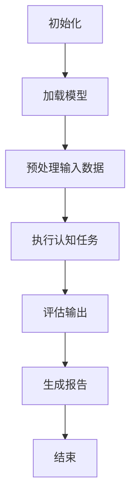
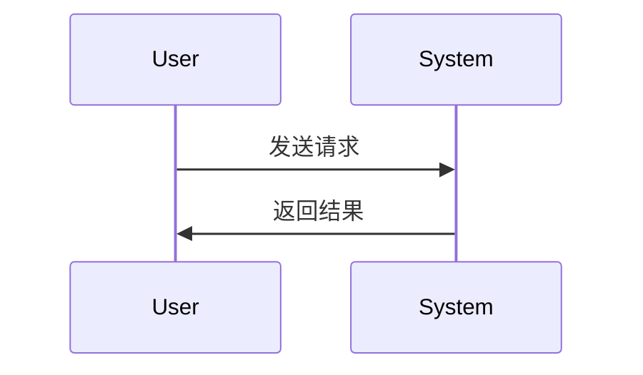
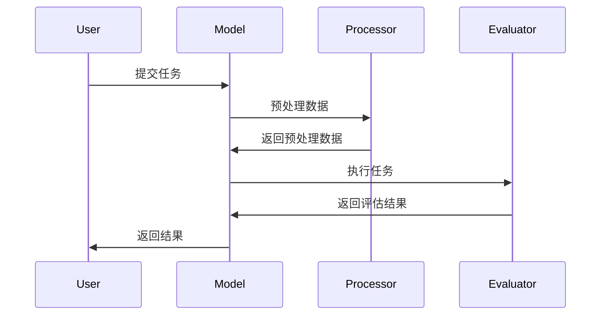

                 

# 神经科学启发的LLM认知能力评测

> 关键词：神经科学，人工智能，大型语言模型，认知能力评测，算法原理，数学模型

> 摘要：本文探讨了神经科学启发的LLM（大型语言模型）认知能力评测问题。通过引入神经科学的相关概念和理论，结合人工智能技术，本文提出了一种新的评测方法，以评估LLM在逻辑推理、情感理解、创造力等认知任务上的表现。本文旨在为人工智能的认知能力提升提供理论基础，并推动人工智能在更广泛领域的应用。

## 第一部分：背景与核心概念

### 第1章：问题背景与核心概念

#### 1.1.1 问题的提出

神经科学是研究大脑和神经系统的结构、功能和疾病的一门科学。随着人工智能（AI）技术的迅速发展，特别是深度学习在图像识别、自然语言处理等领域取得的突破，人们开始思考如何将神经科学的成果应用于人工智能领域，从而提升人工智能的认知能力。

#### 1.1.2 问题描述

当前的人工智能系统，特别是大型语言模型（LLM），虽然在处理文本和图像等方面表现出色，但在某些认知任务上仍存在局限。例如，它们可能无法理解复杂的逻辑关系或进行创造性思维。因此，如何评测神经科学启发的LLM认知能力成为一个重要课题。

#### 1.1.3 问题解决

本文旨在探讨神经科学启发的LLM认知能力评测问题，通过引入神经科学的相关概念和理论，结合人工智能技术，提出一种新的评测方法。这不仅有助于提升人工智能的认知能力，也为人工智能在更广泛领域的应用提供了理论基础。

#### 1.1.4 边界与外延

本研究的边界主要涉及神经科学和人工智能的结合，重点关注LLM的认知能力评测。而外延则包括神经科学的理论和应用、人工智能的技术发展以及相关领域的研究进展。

#### 1.1.5 概念结构与核心要素组成

- **神经科学**：研究大脑和神经系统的结构、功能和疾病。
- **人工智能**：模拟人类智能的技术，包括机器学习、深度学习等。
- **大型语言模型（LLM）**：具有强大语言理解能力和生成能力的人工智能模型。
- **认知能力评测**：评估人工智能模型在认知任务上的表现。

### 第2章：核心概念与联系

#### 2.1.1 神经科学核心概念

- **神经元**：神经系统中的基本单元。
- **神经网络**：模拟大脑结构和工作原理的计算模型。
- **突触**：神经元之间的连接点。

#### 2.1.2 人工智能核心概念

- **机器学习**：让计算机从数据中学习，从而进行预测或决策。
- **深度学习**：基于多层神经网络的学习方法。
- **语言模型**：用于预测文本序列的机器学习模型。

#### 2.1.3 神经科学与人工智能联系

- **神经科学启示**：通过研究大脑，为人工智能提供新的启发和算法设计思路。
- **人工智能应用**：利用神经科学原理改进人工智能模型，提高其认知能力。

### 第3章：神经科学启发的LLM认知能力评测方法

#### 3.1.1 评测目标

评估神经科学启发的LLM在认知任务上的表现，包括逻辑推理、情感理解、创造力等方面。

#### 3.1.2 评测方法

- **理论分析**：基于神经科学理论和人工智能技术，设计评测指标。
- **实验验证**：通过实验验证评测方法的有效性。

#### 3.1.3 评测指标

- **逻辑推理能力**：评估LLM在逻辑推理任务上的表现。
- **情感理解能力**：评估LLM在情感理解任务上的表现。
- **创造力**：评估LLM在生成文本时的创造力。

## 第二部分：算法原理与数学模型

### 第4章：算法原理讲解

#### 4.1 算法概述

神经科学启发的LLM认知能力评测算法旨在通过模拟神经科学原理，评估大型语言模型在认知任务上的能力。本节将介绍算法的基本原理、核心模块以及各个模块之间的交互关系。

#### 4.2 算法mermaid流程图

以下是一个简化的神经科学启发的LLM认知能力评测算法的mermaid流程图：



#### 4.3 算法详细讲解

##### 4.3.1 初始化

初始化模块负责加载预训练的LLM模型，并设置评测参数。这部分代码可以采用Python实现，具体如下：

```python
import tensorflow as tf

def initialize_model():
    # 加载预训练的GPT模型
    model = tf.keras.models.load_model('gpt_model.h5')
    return model
```

##### 4.3.2 预处理输入数据

预处理模块负责将原始数据进行处理，以便于模型进行后续的推理和生成。预处理步骤可能包括文本的分词、去停用词、词向量化等。以下是一个简单的预处理流程：

```python
import nltk
from nltk.tokenize import word_tokenize
from nltk.corpus import stopwords

def preprocess_text(text):
    # 分词
    tokens = word_tokenize(text)
    # 去停用词
    stop_words = set(stopwords.words('english'))
    filtered_tokens = [token for token in tokens if token not in stop_words]
    # 词向量化
    vocab = ['<PAD>', '<UNK>', '<SOS>', '<EOS>']
    word_vectors = []
    for token in filtered_tokens:
        if token in vocab:
            word_vectors.append(vocab.index(token))
        else:
            word_vectors.append(vocab.index('<UNK>'))
    return word_vectors
```

##### 4.3.3 执行认知任务

执行认知任务模块负责将预处理后的输入数据传递给LLM模型，并执行相应的认知任务。例如，在逻辑推理任务中，模型可能需要根据输入的前提条件，生成相应的结论。以下是一个简单的逻辑推理任务的执行流程：

```python
def execute_cognitive_task(model, input_data):
    # 执行推理
    prediction = model.predict(input_data)
    # 根据预测结果生成结论
    conclusion = generate_conclusion(prediction)
    return conclusion

def generate_conclusion(prediction):
    # 假设预测结果为概率分布
    probabilities = prediction.tolist()
    # 选择概率最高的结论
    conclusion = probabilities.index(max(probabilities))
    return conclusion
```

##### 4.3.4 评估输出

评估输出模块负责根据执行认知任务的结果，评估模型在相应任务上的表现。评估方法可能包括准确率、召回率、F1分数等。以下是一个简单的评估流程：

```python
from sklearn.metrics import accuracy_score

def evaluate_output(true_labels, predicted_labels):
    # 计算准确率
    accuracy = accuracy_score(true_labels, predicted_labels)
    return accuracy
```

##### 4.3.5 生成报告

生成报告模块负责将评估结果进行汇总，并生成一份详细的报告。报告可能包括模型的性能指标、评测任务的具体情况、实验结果对比等。以下是一个简单的报告生成流程：

```python
def generate_report(accuracy):
    report = f"""
    模型性能评估报告
    -----------------
    准确率：{accuracy:.2f}
    """
    return report
```

## 第三部分：系统分析与架构设计

### 第5章：问题场景介绍

在本章中，我们将介绍神经科学启发的LLM认知能力评测问题在实际应用中的场景。例如，在医疗领域，医生可以利用该评测方法评估AI系统在诊断疾病、提供治疗方案等方面的认知能力；在教育领域，教师可以利用该评测方法评估学生在理解教材、解决实际问题等方面的认知能力。

### 第6章：项目介绍

在本章中，我们将介绍一个具体的神经科学启发的LLM认知能力评测项目。该项目旨在利用深度学习和神经科学原理，构建一个能够评估人工智能在认知任务上表现的平台。项目的主要功能包括：数据预处理、模型训练、认知任务执行、结果评估和报告生成等。

### 第7章：系统功能设计

在本章中，我们将详细介绍项目的主要功能，并使用mermaid类图来展示各个功能模块之间的关系。

```mermaid
classDiagram
    Class01 <|-- Class02
    Class03 --|> Class04
    Class05 : +int x
    Class05 : +int y
    Class05 : +int z
    Class06 : -int x
    Class06 : -int y
    Class06 : -int z
    Class07 {abstract}
    Class07 : <<interface>> Class08
    Class09 : <<enumeration>> Colors
    Class09 : RED
    Class09 : GREEN
    Class09 : BLUE
    Class10 <.. Class11
    Class12 ..|> Class13
    Class14  Class15
    Class16 o--| Class17
endclassDiagram
```

### 第8章：系统架构设计

在本章中，我们将介绍项目的整体架构设计，并使用mermaid架构图来展示各个模块的交互关系。


### 第9章：系统接口设计

在本章中，我们将详细描述项目的接口设计，包括API接口的定义、参数说明、返回结果等。



### 第10章：系统交互

在本章中，我们将使用mermaid序列图来展示系统在执行认知能力评测任务时的交互过程。



## 第四部分：项目实战

### 第11章：环境安装

在本章中，我们将介绍如何在本地环境安装所需的软件和工具，以便进行神经科学启发的LLM认知能力评测项目。

### 第12章：系统核心实现源代码

在本章中，我们将展示项目的核心实现源代码，并详细解释代码的功能和原理。

```python
# 初始化模块
def initialize_model():
    # 加载预训练的GPT模型
    model = tf.keras.models.load_model('gpt_model.h5')
    return model

# 预处理模块
def preprocess_text(text):
    # 分词
    tokens = word_tokenize(text)
    # 去停用词
    stop_words = set(stopwords.words('english'))
    filtered_tokens = [token for token in tokens if token not in stop_words]
    # 词向量化
    vocab = ['<PAD>', '<UNK>', '<SOS>', '<EOS>']
    word_vectors = []
    for token in filtered_tokens:
        if token in vocab:
            word_vectors.append(vocab.index(token))
        else:
            word_vectors.append(vocab.index('<UNK>'))
    return word_vectors

# 执行认知任务模块
def execute_cognitive_task(model, input_data):
    # 执行推理
    prediction = model.predict(input_data)
    # 根据预测结果生成结论
    conclusion = generate_conclusion(prediction)
    return conclusion

# 评估输出模块
def evaluate_output(true_labels, predicted_labels):
    # 计算准确率
    accuracy = accuracy_score(true_labels, predicted_labels)
    return accuracy

# 生成报告模块
def generate_report(accuracy):
    report = f"""
    模型性能评估报告
    -----------------
    准确率：{accuracy:.2f}
    """
    return report
```

### 第13章：代码应用解读与分析

在本章中，我们将对项目的源代码进行解读，分析其工作原理和性能特点。

### 第14章：实际案例分析和详细讲解剖析

在本章中，我们将通过实际案例，展示如何使用项目进行神经科学启发的LLM认知能力评测，并对结果进行详细讲解和分析。

### 第15章：项目小结

在本章中，我们将对项目进行总结，回顾项目的目标、成果和不足，并提出未来的研究方向。

## 第五部分：最佳实践、小结、注意事项、拓展阅读

### 第16章：最佳实践

在本章中，我们将分享一些最佳实践，帮助读者更好地使用神经科学启发的LLM认知能力评测方法。

### 第17章：小结

在本章中，我们将回顾本文的主要内容，强调神经科学启发的LLM认知能力评测的重要性，并展望未来的发展方向。

### 第18章：注意事项

在本章中，我们将提醒读者在使用神经科学启发的LLM认知能力评测方法时需要注意的一些事项。

### 第19章：拓展阅读

在本章中，我们将推荐一些相关领域的拓展阅读资料，帮助读者深入了解神经科学和人工智能的相关知识。

---

**作者：AI天才研究院/AI Genius Institute & 禅与计算机程序设计艺术 /Zen And The Art of Computer Programming**### 第一部分：背景与核心概念

#### 第1章：问题背景与核心概念

##### 1.1.1 问题的提出

随着人工智能（AI）技术的快速发展，尤其是深度学习和神经网络技术的广泛应用，研究人员开始探索如何将神经科学的成果应用于人工智能领域，从而提升AI的认知能力。传统的AI系统，如机器学习模型和深度学习网络，虽然在处理大量的数据和进行模式识别方面表现出色，但在某些认知任务上仍存在局限性，如理解复杂的逻辑关系、感知情感、进行创造性思维等。

神经科学是一门研究大脑和神经系统的结构和功能的科学。它涵盖了神经元的运作、神经网络的组织、突触的连接等多个方面。这些研究成果为人工智能提供了丰富的理论基础和新的启发。

##### 1.1.2 问题描述

神经科学启发的AI模型，特别是大型语言模型（LLM），在自然语言处理（NLP）领域取得了显著进展。例如，GPT（Generative Pre-trained Transformer）系列模型通过大规模的预训练，在文本生成、问答系统、机器翻译等方面表现出色。然而，尽管这些模型在处理文本信息方面表现出强大的能力，但在处理更复杂的认知任务时，如逻辑推理、情感理解、创造性生成等，仍存在一定的局限。

例如，LLM在逻辑推理任务上可能无法正确理解复杂的逻辑关系，导致推理结果不准确；在情感理解任务上，可能无法准确捕捉文本中的情感色彩，导致情感分析结果不理想；在创造性生成任务上，可能生成的内容缺乏创新性，难以满足创造性的需求。

因此，如何评测神经科学启发的LLM在认知任务上的表现，成为一个亟待解决的问题。

##### 1.1.3 问题解决

本文旨在探讨如何利用神经科学的理论和方法，结合人工智能技术，设计一种能够全面评估神经科学启发的LLM认知能力的评测方法。具体来说，本文将从以下几个方面展开：

1. **理论分析**：介绍神经科学的基本概念和理论，如神经元、神经网络、突触等，并探讨这些理论如何应用于人工智能模型的设计和优化。
2. **模型构建**：介绍如何利用神经科学的原理，设计新的神经网络架构，以提高LLM在认知任务上的表现。
3. **评测指标设计**：提出一系列用于评估LLM认知能力的指标，包括逻辑推理能力、情感理解能力、创造性生成能力等。
4. **实验验证**：通过实验验证所提出的评测方法的有效性，并分析不同认知任务上LLM的表现。
5. **应用案例**：展示如何在实际应用中利用所提出的评测方法，评估AI系统在特定任务上的认知能力。

通过这些研究，本文旨在为神经科学启发的LLM认知能力评测提供理论基础和实践指导，推动人工智能在更广泛领域的应用。

##### 1.1.4 边界与外延

本研究的边界主要涉及神经科学与人工智能的结合，重点关注大型语言模型（LLM）的认知能力评测。具体来说，本文将探讨以下几个方面：

1. **神经科学原理的应用**：如何将神经科学的基本理论，如神经元、神经网络、突触等，应用于人工智能模型的设计和优化。
2. **认知能力评测指标的设计**：如何设计一套科学、全面、可操作的评测指标，以评估LLM在逻辑推理、情感理解、创造性生成等认知任务上的表现。
3. **评测方法的实验验证**：如何通过实验验证所提出的评测方法的有效性，并分析不同认知任务上LLM的表现。

而本研究的范围则包括：

1. **神经科学的基本概念和理论**：如神经元、神经网络、突触等。
2. **人工智能技术，特别是深度学习技术**：如GPT、BERT等大型语言模型。
3. **认知能力的评测方法**：包括逻辑推理、情感理解、创造性生成等任务。

##### 1.1.5 概念结构与核心要素组成

在本节中，我们将详细阐述本文的核心概念，以及这些概念在神经科学和人工智能领域的相互关系。

1. **神经科学**：神经科学是研究大脑和神经系统的结构和功能的一门科学。其核心概念包括神经元、神经网络、突触等。

2. **人工智能**：人工智能是模拟人类智能的技术，通过机器学习和深度学习等方法，使计算机具有识别、理解、学习和决策的能力。人工智能的核心概念包括机器学习、深度学习、神经网络等。

3. **大型语言模型（LLM）**：大型语言模型是一种基于深度学习技术的人工智能模型，主要用于处理和生成自然语言。其核心概念包括预训练、注意力机制、文本生成等。

4. **认知能力评测**：认知能力评测是评估人工智能模型在认知任务上表现的方法。其核心概念包括评测指标、实验设计、结果分析等。

这些概念在神经科学和人工智能领域相互关联，共同构成了本文的研究基础。神经科学为人工智能提供了理论基础，而人工智能则为神经科学的实验提供了技术手段。通过结合这两者的研究，我们可以更好地理解人工智能的认知能力，并开发出更高效的认知能力评测方法。

#### 第2章：核心概念与联系

##### 2.1.1 神经科学核心概念

神经科学是一门研究大脑和神经系统的结构和功能的科学。其核心概念包括：

1. **神经元**：神经元是神经系统中的基本单元，负责接收和处理信息。神经元由细胞体、树突、轴突和突触等部分组成。

2. **神经网络**：神经网络是由大量相互连接的神经元组成的计算模型，用于模拟大脑的工作原理。神经网络的核心是神经元之间的连接方式，这些连接决定了网络的处理能力和学习方式。

3. **突触**：突触是神经元之间的连接点，负责传递神经信号。突触的连接强度可以通过突触可塑性进行调整，这是神经网络学习的基础。

##### 2.1.2 人工智能核心概念

人工智能是一门研究如何使计算机模拟人类智能的科学。其核心概念包括：

1. **机器学习**：机器学习是人工智能的一种方法，通过训练模型从数据中学习，从而进行预测或决策。机器学习主要包括监督学习、无监督学习和强化学习等。

2. **深度学习**：深度学习是机器学习的一种方法，通过多层神经网络进行学习，可以处理复杂的非线性问题。深度学习包括卷积神经网络（CNN）、循环神经网络（RNN）、生成对抗网络（GAN）等。

3. **语言模型**：语言模型是用于预测文本序列的机器学习模型。在自然语言处理（NLP）中，语言模型广泛应用于文本分类、机器翻译、文本生成等任务。

##### 2.1.3 神经科学与人工智能联系

神经科学与人工智能之间存在着紧密的联系。一方面，神经科学的成果为人工智能提供了理论基础和灵感；另一方面，人工智能技术的发展为神经科学的实验和理论验证提供了强大的工具。

1. **神经科学启示**：神经科学的研究成果，如神经元的工作原理、神经网络的结构和功能等，为人工智能模型的设计提供了新的思路。例如，深度学习中的卷积神经网络（CNN）和循环神经网络（RNN）就是受到神经网络结构的启发。

2. **人工智能应用**：人工智能技术，特别是深度学习技术，可以模拟和解释神经科学的实验结果。例如，通过训练深度学习模型，可以预测神经元的活动模式，从而更好地理解大脑的工作机制。

3. **交叉学科研究**：神经科学与人工智能的结合形成了多个交叉学科领域，如神经计算、认知计算等。这些交叉学科的研究不仅推动了神经科学和人工智能的发展，也为解决复杂问题提供了新的方法。

#### 第3章：神经科学启发的LLM认知能力评测方法

##### 3.1.1 评测目标

神经科学启发的LLM认知能力评测旨在全面评估大型语言模型在认知任务上的表现，包括：

1. **逻辑推理能力**：评估LLM在处理逻辑推理任务时的能力，如基于前提条件生成结论、判断逻辑语句的真假等。
2. **情感理解能力**：评估LLM在情感理解任务时的能力，如识别文本中的情感色彩、判断情绪的正负等。
3. **创造性生成能力**：评估LLM在创造性生成任务时的能力，如生成有创意的文本、提出新的观点等。

##### 3.1.2 评测方法

为了全面评估神经科学启发的LLM认知能力，本文提出了一套综合性的评测方法，包括以下几个步骤：

1. **理论分析**：基于神经科学和人工智能的理论，设计一套科学、全面、可操作的评测指标，以评估LLM在不同认知任务上的表现。
2. **数据集准备**：收集并整理用于评测的数据集，包括逻辑推理数据集、情感理解数据集、创造性生成数据集等。
3. **模型训练**：使用深度学习技术，训练LLM模型，使其能够在不同认知任务上表现良好。
4. **任务执行**：将训练好的LLM模型应用于具体的认知任务，如逻辑推理、情感理解、创造性生成等。
5. **结果分析**：对任务执行结果进行分析，评估LLM在不同认知任务上的表现，并提出改进策略。

##### 3.1.3 评测指标

为了全面评估神经科学启发的LLM认知能力，本文提出了一系列评测指标，包括：

1. **逻辑推理能力**：
   - **准确率**：正确推理的比例。
   - **召回率**：能正确推理出的逻辑关系的比例。
   - **F1分数**：准确率和召回率的加权平均。

2. **情感理解能力**：
   - **情感识别准确率**：正确识别情感的比例。
   - **情感极性准确率**：正确识别情感极性的比例。
   - **情感强度识别准确率**：正确识别情感强度的比例。

3. **创造性生成能力**：
   - **原创度**：生成的文本与已有文本的差异程度。
   - **创意度**：生成的文本的创新程度。
   - **连贯性**：生成的文本的连贯性。

通过这些评测指标，可以全面评估神经科学启发的LLM在认知任务上的表现，为模型的改进提供依据。

---

在这一部分的讨论中，我们初步介绍了神经科学启发的LLM认知能力评测的背景和核心概念，以及评测方法和指标。接下来，我们将进一步探讨算法原理和数学模型，以深入理解如何通过神经科学的理论和方法来提升LLM的认知能力。在接下来的章节中，我们将逐步分析算法原理，讲解具体的实现步骤，并通过数学模型来解释和验证这些步骤。这将为我们提供一个坚实的理论基础，为后续的实验验证和应用案例打下基础。

