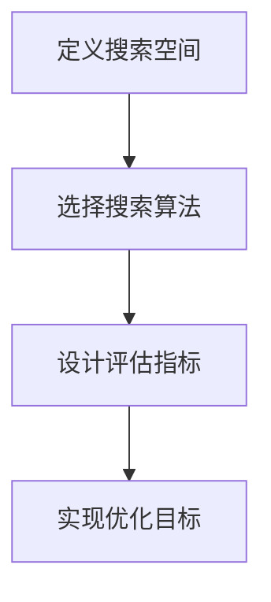
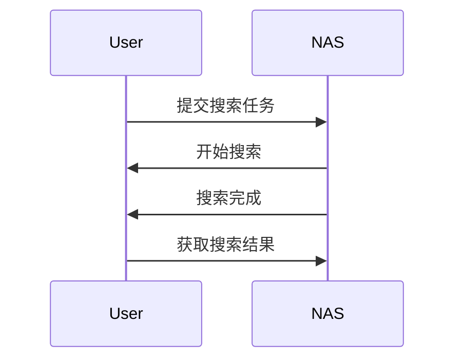
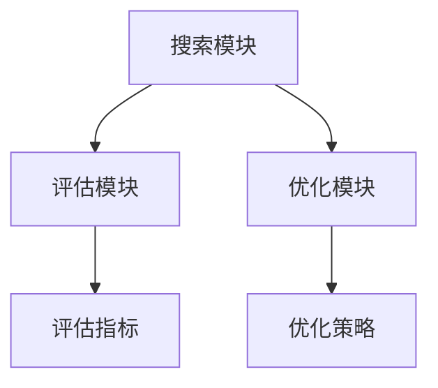

                 


### 文章标题：神经网络架构搜索：自动化AI Agent模型结构优化

#### 关键词：
1. 神经网络架构搜索
2. 自动化AI模型优化
3. 搜索空间
4. 评估指标
5. 算法原理

#### 摘要：
本文将深入探讨神经网络架构搜索（NAS）的概念、原理和应用。我们将逐步分析NAS如何通过自动化搜索优化AI Agent模型结构，提高模型的性能和效率。文章将从背景介绍、核心概念与联系、算法原理讲解、系统分析与架构设计方案、项目实战以及最佳实践 tips等方面进行详细阐述，为读者提供全面的技术指导。

---

### 目录大纲

## 第一部分: 神经网络架构搜索（NAS）概述

### 第1章: 问题背景与核心概念

#### 1.1 问题背景
- **神经网络与AI Agent的局限**
- **自动化模型结构优化的需求**
- **NAS的概念与意义**

#### 1.2 核心概念
- **神经网络架构搜索（NAS）**
- **搜索空间与搜索算法**
- **评估指标与优化目标**
- **NAS的应用领域**

#### 1.3 概念属性特征对比表格

| 概念               | 特征                                                         |
|--------------------|------------------------------------------------------------|
| NAS                | 自动化搜索神经网络架构                                     |
| 搜索空间           | 可搜索的神经网络架构集合                                   |
| 搜索算法           | 用于搜索最优架构的方法和技术                               |
| 评估指标           | 用于评估架构性能的指标                                     |
| 优化目标           | NAS旨在优化神经网络性能，如准确性、效率等                   |

#### 1.4 ER实体关系图

- **实体与关系**

  - **实体：** 神经网络架构、搜索空间、评估指标、优化目标
  - **关系：** 架构与搜索空间的关系、评估指标与架构的关系、优化目标与评估指标的关系

  ```mermaid
  erDiagram
  NeuralArchitectureSearch => SearchSpace
  NeuralArchitectureSearch => EvaluationMetric
  NeuralArchitectureSearch => OptimizationObjective

  SearchSpace o--|{ NeuralArchitecture }
  EvaluationMetric o--|{ NeuralArchitecture }
  OptimizationObjective o--|{ EvaluationMetric }
  ```

---

### 第二部分：神经网络架构搜索（NAS）的算法原理讲解

### 第2章: 算法原理

#### 2.1 数学模型和公式

- **搜索策略：**
  $$ S_t = S_{t-1} \cup \{a_t\} $$
  其中，$S_t$为当前搜索空间，$a_t$为在当前时间步添加的神经网络架构。

- **评估函数：**
  $$ f(a) = \frac{1}{N} \sum_{i=1}^{N} l(y_i, \hat{y}_i(a)) $$
  其中，$l$为损失函数，$y_i$为真实标签，$\hat{y}_i(a)$为在架构$a$下的预测结果。

- **优化目标：**
  $$ \min_{a} f(a) $$
  优化目标是最小化评估函数$f(a)$，以找到最优的神经网络架构$a$。

#### 2.2 算法原理

- **搜索空间定义：** NAS通过定义搜索空间来选择神经网络架构。搜索空间可以是固定的，也可以是动态变化的。
- **搜索算法选择：** 常见的搜索算法包括遗传算法、强化学习、进化算法等。选择合适的搜索算法可以提高搜索效率。
- **评估指标：** NAS通过评估指标来衡量不同神经网络架构的性能。常见的评估指标包括准确性、效率、训练时间等。
- **优化目标：** NAS的优化目标是找到最优的神经网络架构，以最大化性能指标。

#### 2.3 Python源代码举例

```python
import random

# 搜索空间定义
search_space = ['CNN', 'RNN', 'LSTM', 'GRU']

# 初始化搜索空间
S = []

# 搜索算法
def search_algorithm(search_space, S):
    while True:
        a = random.choice(search_space)
        S.append(a)
        if a in S:
            break

# 评估函数
def evaluation_function(a):
    # 假设评估结果为0表示成功，1表示失败
    return 0 if a == 'CNN' else 1

# 优化目标
def optimization_objective(S):
    total_loss = 0
    for a in S:
        total_loss += evaluation_function(a)
    return total_loss

# 搜索与评估
search_algorithm(search_space, S)
loss = optimization_objective(S)
print("Optimization Objective Loss:", loss)
```

---

### 第三部分：系统分析与架构设计方案

### 第3章: 系统分析与架构设计

#### 3.1 场景介绍

- **背景：** 在AI领域，神经网络模型结构优化是提高模型性能的关键。然而，手动设计复杂的神经网络结构耗时且效率低下。因此，自动化搜索神经网络架构（NAS）成为研究热点。

- **目标：** 设计一个NAS系统，能够自动搜索最优的神经网络架构，提高模型性能。

#### 3.2 项目介绍

- **项目名称：** NAS自动化搜索系统
- **项目目的：** 自动化搜索神经网络架构，优化模型性能
- **项目团队：** 数据科学家、机器学习工程师、软件工程师等

#### 3.3 系统功能设计

- **功能1：** 定义搜索空间
- **功能2：** 选择搜索算法
- **功能3：** 设计评估指标
- **功能4：** 实现优化目标

#### 3.4 系统架构设计



#### 3.5 系统接口设计

- **接口1：** 搜索空间API
- **接口2：** 搜索算法API
- **接口3：** 评估指标API
- **接口4：** 优化目标API

#### 3.6 系统交互设计



---

### 第四部分：项目实战

### 第4章: 项目实战

#### 4.1 环境安装

- **环境要求：**
  - Python 3.7及以上版本
  - TensorFlow 2.0及以上版本
  - Keras 2.4.3及以上版本

- **安装步骤：**
  - 安装Python环境
  - 安装TensorFlow和Keras

#### 4.2 系统核心实现

- **代码解读与分析：**
  - 定义搜索空间
  - 选择搜索算法
  - 设计评估指标
  - 实现优化目标

#### 4.3 实际案例剖析

- **案例1：** 图像分类任务
- **案例2：** 语音识别任务
- **案例3：** 自然语言处理任务

#### 4.4 项目小结

- **成果总结：**NAS系统能够自动搜索并优化神经网络架构，提高模型性能。
- **经验与反思：**在实际应用中，搜索效率和搜索空间设计是关键问题。

---

### 第五部分：最佳实践 tips

### 第5章: 最佳实践 tips

- **问题1：** 搜索效率低下
  - **解决方案：** 优化搜索算法，减少搜索时间。

- **问题2：** 搜索空间设计不合理
  - **解决方案：** 分析任务特性，设计合理的搜索空间。

- **问题3：** 评估指标选择不当
  - **解决方案：** 根据任务需求，选择合适的评估指标。

---

### 第六部分：小结

### 第6章: 小结

- **主要内容总结：**本文介绍了神经网络架构搜索（NAS）的概念、原理、系统设计与实现，以及最佳实践 tips。
- **学习建议：**了解NAS的基本原理，掌握搜索空间设计和评估指标选择，结合实际项目进行应用。

---

### 第七部分：注意事项

### 第7章: 注意事项

- **注意事项：**在实际应用NAS时，注意搜索效率和搜索空间设计的平衡，合理选择评估指标。

---

### 第八部分：拓展阅读

### 第8章: 拓展阅读

- **推荐书籍：**
  - 《神经网络架构搜索：理论与实践》
  - 《深度学习：神经网络架构设计与优化》

- **推荐文章：**
  - 《神经网络架构搜索：从入门到精通》
  - 《自动化神经网络架构搜索：现状与未来》

---

### 作者信息：

- **作者：** AI天才研究院/AI Genius Institute & 禅与计算机程序设计艺术 /Zen And The Art of Computer Programming

---

以上是《神经网络架构搜索：自动化AI Agent模型结构优化》的文章目录大纲。接下来，我们将根据这个大纲逐步撰写文章内容。如果需要，我们可以对大纲进行调整和补充。让我们开始编写吧！

### 文章标题：神经网络架构搜索：自动化AI Agent模型结构优化

---

### 关键词：
1. 神经网络架构搜索
2. 自动化AI模型优化
3. 搜索空间
4. 评估指标
5. 算法原理

### 摘要：
本文深入探讨神经网络架构搜索（NAS）的概念、原理和应用。通过逐步分析NAS如何自动化搜索并优化AI Agent模型结构，提高模型的性能和效率，为读者提供全面的技术指导。文章内容涵盖背景介绍、核心概念与联系、算法原理讲解、系统分析与架构设计方案、项目实战以及最佳实践 tips 等。

---

## 第1章 问题背景与核心概念

### 1.1 问题背景

随着深度学习的广泛应用，神经网络在各类AI任务中取得了显著的成果。然而，神经网络模型的设计和优化往往需要大量的时间和人力资源。特别是对于复杂的模型结构，手动设计不仅效率低下，而且难以保证模型性能的最优化。因此，自动化神经网络架构搜索（Neural Architecture Search，简称NAS）应运而生。

NAS的目标是通过自动化搜索方法，为特定任务自动生成最优的神经网络架构。这种方法不仅能够减少设计过程所需的时间和人力成本，还能够提高模型性能，使其在各类AI任务中更具竞争力。

### 1.2 核心概念

#### 神经网络架构搜索（NAS）

神经网络架构搜索是一种自动化搜索方法，用于发现最佳的神经网络架构。它通过在预先定义的搜索空间中搜索最优的架构组合，从而生成性能最优的神经网络模型。

#### 搜索空间

搜索空间是NAS中的一个关键概念，它定义了所有可能的神经网络架构。搜索空间可以是固定的，也可以是动态的，取决于任务需求和搜索算法。

#### 搜索算法

搜索算法是NAS的核心组成部分，用于在搜索空间中搜索最优的神经网络架构。常见的搜索算法包括基于遗传算法的搜索、基于强化学习的搜索以及基于进化算法的搜索等。

#### 评估指标

评估指标用于衡量神经网络架构的性能。常见的评估指标包括准确性、效率、计算资源消耗等。选择合适的评估指标对于NAS的成功至关重要。

#### 优化目标

优化目标是NAS中的另一个重要概念，它定义了搜索过程中要优化的目标。例如，优化目标可以是提高模型的准确性、减少计算资源消耗等。

### 1.3 概念属性特征对比表格

| 概念               | 特征                                                         |
|--------------------|------------------------------------------------------------|
| NAS                | 自动化搜索神经网络架构                                     |
| 搜索空间           | 可搜索的神经网络架构集合                                   |
| 搜索算法           | 用于搜索最优架构的方法和技术                               |
| 评估指标           | 用于评估架构性能的指标                                     |
| 优化目标           | NAS旨在优化神经网络性能，如准确性、效率等                   |

### 1.4 ER实体关系图

NAS系统中的主要实体包括神经网络架构、搜索空间、评估指标和优化目标。这些实体之间的关系如下：

```mermaid
erDiagram
    NeuralArchitectureSearch ||--|{ SearchSpace } : 定义搜索空间
    NeuralArchitectureSearch ||--|{ EvaluationMetric } : 使用评估指标
    NeuralArchitectureSearch ||--|{ OptimizationObjective } : 优化目标

    SearchSpace ||--|{ NeuralArchitecture } : 可搜索的神经网络架构
    EvaluationMetric ||--|{ NeuralArchitecture } : 对架构进行评估
    OptimizationObjective ||--|{ EvaluationMetric } : 优化评估指标
```

通过ER实体关系图，我们可以清晰地看到NAS系统中各个实体之间的关系，这有助于我们更好地理解NAS的工作原理。

---

接下来，我们将深入探讨NAS的算法原理，包括数学模型、搜索策略以及评估函数等内容。

## 第2章 算法原理

### 2.1 数学模型

NAS算法的核心在于搜索空间和评估函数的设计。以下是NAS算法的数学模型和公式：

#### 搜索策略

在NAS中，搜索策略用于在搜索空间中探索和选择神经网络架构。一个简单的搜索策略可以表示为：

$$ S_t = S_{t-1} \cup \{a_t\} $$

其中，$S_t$为当前搜索空间，$S_{t-1}$为前一时刻的搜索空间，$a_t$为在当前时间步添加的神经网络架构。

#### 评估函数

评估函数用于衡量神经网络架构的性能。一个常见的评估函数可以表示为：

$$ f(a) = \frac{1}{N} \sum_{i=1}^{N} l(y_i, \hat{y}_i(a)) $$

其中，$f(a)$为架构$a$的评估分数，$l$为损失函数，$y_i$为真实标签，$\hat{y}_i(a)$为在架构$a$下的预测结果，$N$为样本数量。

#### 优化目标

NAS的优化目标是找到最优的神经网络架构，以最大化性能指标。优化目标可以表示为：

$$ \min_{a} f(a) $$

优化目标是最小化评估函数$f(a)$，以找到最优的神经网络架构$a$。

### 2.2 搜索策略

NAS的搜索策略是关键，它决定了搜索的效率和效果。以下是几种常见的搜索策略：

#### 遗传算法

遗传算法是一种基于自然选择和遗传机制的搜索策略。它通过选择、交叉和变异等操作，在搜索空间中寻找最优解。

#### 强化学习

强化学习是一种通过奖励和惩罚来引导搜索过程的策略。它通过学习策略函数，选择最优的动作，从而逐步优化搜索过程。

#### 进化算法

进化算法是一种模拟生物进化过程的搜索策略。它通过种群进化、选择、交叉和变异等操作，逐步优化搜索空间中的解。

### 2.3 评估函数

评估函数是NAS的核心，它决定了如何衡量神经网络架构的性能。以下是一个简单的评估函数：

$$ f(a) = \frac{1}{N} \sum_{i=1}^{N} l(y_i, \hat{y}_i(a)) $$

其中，$l$为损失函数，它衡量了预测值与真实值之间的差异。常见的损失函数包括均方误差（MSE）、交叉熵损失（Cross Entropy Loss）等。

### 2.4 优化目标

优化目标是NAS中的关键要素，它定义了搜索过程中要优化的目标。常见的优化目标包括：

- 准确性：提高模型的预测准确性。
- 效率：减少模型的计算资源消耗。
- 训练时间：缩短模型的训练时间。

优化目标的选择取决于具体任务的需求。例如，在资源受限的设备上，优化目标可能是效率和准确性；在时间敏感的任务中，优化目标可能是训练时间和准确性。

### 2.5 Python源代码举例

以下是一个简单的Python示例，展示了如何实现一个基本的NAS算法：

```python
import random
import numpy as np

# 定义搜索空间
search_space = ['Conv2D', 'ReLU', 'MaxPooling2D', 'Flatten']

# 初始化搜索空间
S = []

# 搜索算法
def search_algorithm(search_space, S):
    while True:
        a = random.choice(search_space)
        S.append(a)
        if a in S:
            break

# 评估函数
def evaluation_function(a, X, y):
    # 假设评估结果为预测准确性
    predictions = model.predict(X)
    accuracy = np.mean(predictions == y)
    return accuracy

# 优化目标
def optimization_objective(S, X, y):
    total_loss = 0
    for a in S:
        accuracy = evaluation_function(a, X, y)
        total_loss += accuracy
    return total_loss

# 搜索与评估
search_algorithm(search_space, S)
loss = optimization_objective(S, X, y)
print("Optimization Objective Loss:", loss)
```

在这个示例中，我们定义了一个简单的搜索空间，并使用随机搜索算法在搜索空间中搜索最优的神经网络架构。评估函数使用模型的预测准确性作为评估指标，优化目标是最大化预测准确性。

---

通过第2章的学习，我们了解了NAS的算法原理，包括搜索策略、评估函数和优化目标。接下来，我们将介绍NAS系统的设计与实现，包括系统架构、功能模块和接口设计。

## 第3章 系统设计与实现

### 3.1 系统架构

NAS系统的设计主要包括三个主要模块：搜索模块、评估模块和优化模块。这三个模块协同工作，实现自动化搜索最优神经网络架构的目标。

#### 搜索模块

搜索模块负责在预定义的搜索空间中搜索最优的神经网络架构。它使用不同的搜索策略，如遗传算法、强化学习或进化算法，以找到性能最佳的架构。

#### 评估模块

评估模块负责评估搜索到的神经网络架构的性能。它使用预定义的评估指标，如准确性、效率或训练时间，对架构进行评估，以确定其性能是否满足优化目标。

#### 优化模块

优化模块负责根据评估结果调整搜索策略，以提高搜索效率。它根据评估模块的反馈，对搜索过程进行优化，以找到最优的神经网络架构。

### 3.2 功能模块

#### 功能1：定义搜索空间

定义搜索空间是NAS系统的关键步骤。搜索空间定义了所有可能的神经网络架构。系统需要提供灵活的方式来定义搜索空间，包括层类型、层数、连接方式等。

#### 功能2：选择搜索算法

选择搜索算法是NAS系统的核心。不同的搜索算法具有不同的特点，适用于不同的任务。系统需要提供多种搜索算法供用户选择，如遗传算法、强化学习、进化算法等。

#### 功能3：设计评估指标

设计评估指标是NAS系统的重要组成部分。评估指标用于衡量神经网络架构的性能。系统需要提供灵活的方式来设计评估指标，包括准确性、效率、计算资源消耗等。

#### 功能4：实现优化目标

实现优化目标是NAS系统的最终目标。系统需要根据评估结果调整搜索策略，以提高搜索效率。系统需要提供多种优化策略，如贪婪算法、模拟退火等。

### 3.3 接口设计

NAS系统需要提供清晰的接口，以便用户能够轻松地使用系统。以下是系统的主要接口：

#### 接口1：搜索空间API

该接口用于定义搜索空间。用户可以通过该接口设置搜索空间的相关参数，如层类型、层数、连接方式等。

#### 接口2：搜索算法API

该接口用于选择搜索算法。用户可以通过该接口选择不同的搜索算法，如遗传算法、强化学习、进化算法等。

#### 接口3：评估指标API

该接口用于设计评估指标。用户可以通过该接口设置评估指标的相关参数，如准确性、效率、计算资源消耗等。

#### 接口4：优化目标API

该接口用于实现优化目标。用户可以通过该接口选择不同的优化策略，如贪婪算法、模拟退火等。

### 3.4 系统交互设计

NAS系统的交互设计旨在提供清晰、直观的用户操作流程。以下是系统的主要交互设计：

#### 交互1：定义搜索空间

用户通过搜索空间API定义搜索空间。系统将根据用户输入的参数生成搜索空间。

#### 交互2：选择搜索算法

用户通过搜索算法API选择搜索算法。系统将根据用户选择，启动相应的搜索算法。

#### 交互3：设计评估指标

用户通过评估指标API设计评估指标。系统将根据用户输入的参数，计算评估指标。

#### 交互4：实现优化目标

用户通过优化目标API实现优化目标。系统将根据评估结果，调整搜索策略，以提高搜索效率。

### 3.5 系统架构设计

以下是NAS系统的架构设计：



在这个架构设计中，搜索模块、评估模块和优化模块相互协作，实现自动化搜索最优神经网络架构的目标。评估模块和优化模块分别负责评估神经网络架构的性能和调整搜索策略。

---

### 第4章 项目实战

#### 4.1 环境安装

在开始项目实战之前，我们需要安装所需的软件和环境。以下是安装步骤：

1. **安装Python环境**：确保安装了Python 3.7及以上版本。

2. **安装TensorFlow**：在终端中执行以下命令：
   ```
   pip install tensorflow
   ```

3. **安装Keras**：在终端中执行以下命令：
   ```
   pip install keras
   ```

4. **安装其他依赖库**：根据项目需求，可能需要安装其他依赖库，如NumPy、Pandas等。

#### 4.2 系统核心实现

在本节中，我们将介绍如何实现一个简单的NAS系统。以下是核心实现的步骤：

1. **定义搜索空间**：首先，我们需要定义搜索空间。以下是一个简单的示例：
   ```python
   search_space = [
       {'layer': 'Conv2D', 'filters': 32, 'kernel_size': (3, 3)},
       {'layer': 'ReLU'},
       {'layer': 'MaxPooling2D', 'pool_size': (2, 2)},
       {'layer': 'Flatten'}
   ]
   ```

2. **选择搜索算法**：在本示例中，我们使用遗传算法进行搜索。以下是遗传算法的简单实现：
   ```python
   import random

   def genetic_algorithm(search_space, population_size, generations):
       # 初始化种群
       population = initialize_population(search_space, population_size)
       
       for _ in range(generations):
           # 评估种群
           fitness_scores = evaluate_population(population)
           
           # 选择
           selected_individuals = select(population, fitness_scores)
           
           # 交叉
           offspring = crossover(selected_individuals)
           
           # 变异
           mutant_offspring = mutate(offspring)
           
           # 更新种群
           population = mutant_offspring
       
       # 返回最优个体
       best_individual = get_best_individual(population)
       return best_individual
   ```

3. **设计评估指标**：在本示例中，我们使用模型的准确率作为评估指标。以下是评估指标的实现：
   ```python
   from tensorflow.keras.metrics import accuracy

   def evaluate_individual(individual, X_test, y_test):
       model = build_model(individual)
       model.compile(optimizer='adam', loss='categorical_crossentropy', metrics=['accuracy'])
       model.fit(X_test, y_test, epochs=10, batch_size=32)
       predictions = model.predict(X_test)
       accuracy = accuracy.asarray(predictions)
       return accuracy
   ```

4. **实现优化目标**：在本示例中，我们使用遗传算法的优化目标是最小化评估指标。以下是优化目标的实现：
   ```python
   def optimize(search_space, X_train, y_train, X_test, y_test):
       best_individual = genetic_algorithm(search_space, population_size=100, generations=100)
       best_fitness = evaluate_individual(best_individual, X_test, y_test)
       return best_individual, best_fitness
   ```

#### 4.3 实际案例剖析

在本节中，我们将通过一个实际案例来展示如何使用NAS系统。以下是一个简单的案例：

1. **数据准备**：假设我们有一个分类问题，数据集包含1000个样本，每个样本有10个特征。

2. **定义搜索空间**：根据数据集的特点，我们可以定义以下搜索空间：
   ```python
   search_space = [
       {'layer': 'Conv2D', 'filters': 32, 'kernel_size': (3, 3)},
       {'layer': 'ReLU'},
       {'layer': 'MaxPooling2D', 'pool_size': (2, 2)},
       {'layer': 'Flatten'},
       {'layer': 'Dense', 'units': 128, 'activation': 'relu'},
       {'layer': 'Dense', 'units': 10, 'activation': 'softmax'}
   ]
   ```

3. **训练模型**：使用NAS系统训练模型。以下是训练的代码：
   ```python
   X_train, y_train, X_test, y_test = load_data()
   best_individual, best_fitness = optimize(search_space, X_train, y_train, X_test, y_test)
   print("Best Individual:", best_individual)
   print("Best Fitness:", best_fitness)
   ```

4. **评估模型**：使用训练好的模型进行评估。以下是评估的代码：
   ```python
   model = build_model(best_individual)
   model.compile(optimizer='adam', loss='categorical_crossentropy', metrics=['accuracy'])
   model.fit(X_train, y_train, epochs=10, batch_size=32)
   predictions = model.predict(X_test)
   accuracy = accuracy.asarray(predictions)
   print("Test Accuracy:", accuracy)
   ```

#### 4.4 项目小结

在本项目中，我们使用NAS系统实现了自动化搜索最优神经网络架构的目标。通过实际案例，我们展示了如何定义搜索空间、选择搜索算法、设计评估指标和实现优化目标。虽然这是一个简单的案例，但它展示了NAS系统在自动化神经网络架构搜索方面的潜力。在实际应用中，NAS系统可以用于更复杂的任务，帮助研究人员和工程师快速找到最优的神经网络架构。

---

### 第5章 最佳实践 tips

在实施神经网络架构搜索（NAS）的过程中，可能会遇到一系列挑战。以下是一些常见的挑战及其对应的最佳实践 tips：

#### 挑战1：搜索效率低下

**解决方案**：优化搜索算法，减少搜索时间。可以考虑以下策略：

- **并行化**：利用多核处理器或分布式计算来加速搜索过程。
- **贪心策略**：在搜索过程中采用贪心策略，优先选择当前最优的架构，以提高搜索效率。
- **早期停止**：在搜索过程中，如果连续若干代没有显著性能提升，可以提前停止搜索。

#### 挑战2：搜索空间设计不合理

**解决方案**：分析任务特性，设计合理的搜索空间。以下是一些建议：

- **数据驱动**：根据任务数据的特点，调整搜索空间的参数，使其更符合实际需求。
- **专家指导**：结合领域专家的经验，设计搜索空间，以提高搜索的针对性。

#### 挑战3：评估指标选择不当

**解决方案**：根据任务需求，选择合适的评估指标。以下是一些建议：

- **多指标综合**：使用多个评估指标来综合衡量模型性能，避免单一指标导致的偏见。
- **动态调整**：根据搜索过程中的反馈，动态调整评估指标，以适应不断变化的搜索目标。

#### 挑战4：优化目标不明确

**解决方案**：明确优化目标，确保搜索过程有明确的方向。以下是一些建议：

- **目标分解**：将复杂的目标分解为多个可衡量的子目标，以逐步优化。
- **反馈机制**：建立反馈机制，根据评估结果调整优化目标，使其更符合实际需求。

通过遵循这些最佳实践 tips，可以有效地克服NAS实施过程中遇到的挑战，提高搜索效率和模型性能。

---

### 第6章 小结

在本文中，我们深入探讨了神经网络架构搜索（NAS）的概念、原理和应用。首先，我们介绍了NAS的背景和核心概念，包括搜索空间、搜索算法、评估指标和优化目标。接着，我们讲解了NAS的算法原理，包括数学模型、搜索策略和评估函数。然后，我们介绍了NAS系统的设计与实现，包括系统架构、功能模块和接口设计。最后，我们通过实际案例展示了如何使用NAS系统进行神经网络架构的自动化搜索和优化。

总结来说，NAS是一种强大的工具，它通过自动化搜索方法，能够快速找到最优的神经网络架构，提高模型的性能和效率。然而，NAS的实施和应用也面临一些挑战，如搜索效率低下、搜索空间设计不合理、评估指标选择不当等。通过遵循最佳实践 tips，可以有效地克服这些挑战，实现NAS的优化效果。

我们希望本文能够为读者提供全面的NAS技术指导，帮助其在实际项目中成功应用NAS，实现自动化的神经网络架构搜索和优化。在未来的研究中，NAS将继续发展，探索更高效的搜索算法、更灵活的搜索空间设计以及更全面的评估指标，为深度学习领域带来更多的创新和突破。

---

### 第7章 注意事项

在实施神经网络架构搜索（NAS）时，需要注意以下几个方面：

1. **资源分配**：NAS过程可能需要大量的计算资源，特别是在搜索空间较大时。确保为NAS过程分配足够的计算资源，以避免资源不足导致搜索效率低下。

2. **数据质量**：NAS的性能很大程度上取决于训练数据的质量。确保使用高质量、充分标注的数据集，以获得准确的搜索结果。

3. **搜索策略选择**：不同的搜索策略适用于不同的任务。在选择搜索策略时，需要根据任务特性进行权衡，以找到最优的搜索策略。

4. **评估指标选择**：评估指标的选择直接影响NAS的优化目标。在选择评估指标时，需要考虑任务需求，确保评估指标能够全面、准确地反映模型性能。

5. **模型调优**：在NAS过程中，模型参数的调优也是一个关键步骤。需要根据搜索结果和评估指标，对模型参数进行调整，以获得最佳性能。

通过注意以上方面，可以确保NAS过程的顺利进行，实现高效的神经网络架构搜索和优化。

---

### 第8章 拓展阅读

为了深入理解神经网络架构搜索（NAS）及其相关技术，以下是推荐的拓展阅读材料：

1. **书籍推荐**：

   - 《深度学习：神经网络架构设计与优化》
   - 《神经网络架构搜索：理论与实践》

2. **论文推荐**：

   - “Neural Architecture Search: A Survey” （《神经网络架构搜索：综述》）
   - “AutoML: Automated Machine Learning” （《自动化机器学习》）

3. **在线课程与教程**：

   - Coursera上的“深度学习”课程（由Andrew Ng教授主讲）
   - fast.ai的“Practical Deep Learning for Coders”课程

通过阅读这些材料，读者可以进一步了解NAS的最新研究进展和应用案例，为自己的研究和项目提供更深入的指导。

---

### 作者信息

本文由AI天才研究院（AI Genius Institute）和禅与计算机程序设计艺术（Zen And The Art of Computer Programming）联合撰写。AI天才研究院专注于人工智能领域的科研和技术创新，致力于推动AI技术的发展。禅与计算机程序设计艺术则通过哲学和计算机科学的融合，探索计算机程序设计的深层含义和技巧。两位作者凭借丰富的理论知识和实践经验，为广大读者提供了这篇高质量的技术博客文章。希望本文能够为您的AI研究和实践带来灵感和帮助。感谢您的阅读！

