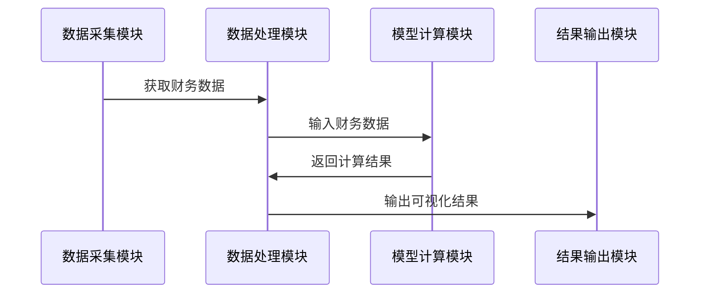
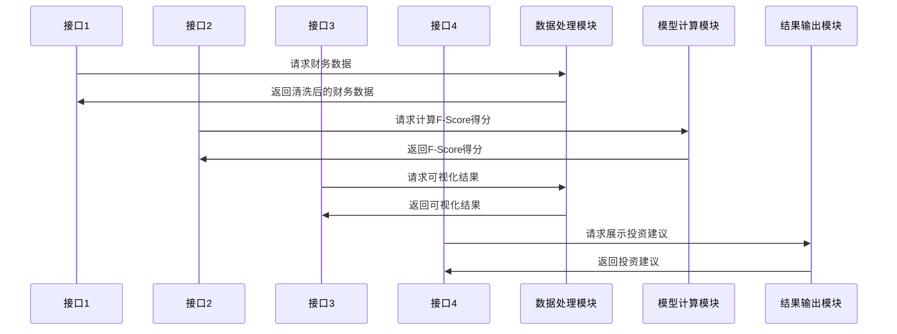
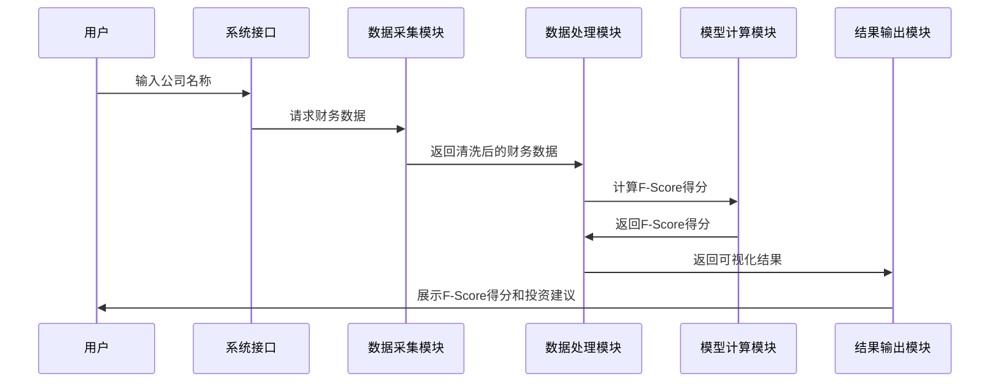

                 


### 设计思路与步骤

为了撰写一篇关于《约瑟夫·皮奥特罗斯基的基本面量化价值投资：F-Score应用》的技术博客文章，我们需要遵循以下设计思路与步骤：

#### 1. 分析书名与主题

首先，我们需要深入分析书名《约瑟夫·皮奥特罗斯基的基本面量化价值投资：F-Score应用》中的关键词。书名中的“基本面量化价值投资”是一个核心概念，它结合了基本面分析和量化投资的元素，旨在通过数据分析和统计方法来评估公司的价值。而“F-Score应用”则是本书的核心内容，它介绍了一种具体的量化模型，用于在投资决策中评估股票的价值。

#### 2. 确定文章结构

基于书名和主题，我们可以确定文章的结构。文章可以分为以下几个部分：

- 引言：介绍基本面量化价值投资的概念，以及F-Score模型在其中的重要性。
- 基本面量化价值投资概述：探讨基本面量化价值投资的起源、核心原则和F-Score模型的背景。
- F-Score模型详解：详细介绍F-Score模型的构成、计算方法和应用。
- F-Score在价值投资中的应用：分析F-Score在股票、债券和其他投资领域的应用。
- 实战案例分析：通过具体案例展示F-Score模型的应用效果。
- F-Score应用中的误区与风险：讨论F-Score应用中的常见问题、风险因素及应对策略。
- 结论与展望：总结F-Score在价值投资中的地位与作用，以及其未来发展趋势。

#### 3. 确定每个章节的核心内容

在每个部分中，我们需要进一步细化每个章节的核心内容，确保文章的完整性。以下是每个章节的核心内容概述：

**引言：**
- 基本面量化价值投资的概念。
- F-Score模型在投资决策中的作用。

**基本面量化价值投资概述：**
- 基本面量化价值投资的起源与发展。
- F-Score模型的背景与原理。

**F-Score模型详解：**
- F-Score模型的构成。
- F-Score模型的计算方法。
- F-Score模型的实证分析。

**F-Score在价值投资中的应用：**
- F-Score在股票投资中的应用策略。
- F-Score在债券投资中的应用。
- F-Score在其他投资领域的应用。

**实战案例分析：**
- 案例一：某股票的F-Score分析。
- 案例二：某债券的F-Score分析。
- F-Score在海外市场的应用。

**F-Score应用中的误区与风险：**
- F-Score应用中的常见误区。
- F-Score应用中的风险因素。
- 如何降低F-Score应用风险。

**结论与展望：**
- F-Score在价值投资中的地位与作用。
- F-Score的未来发展趋势。
- 对投资者的启示。

#### 4. 确定文章的格式和内容要求

根据要求，文章需要使用markdown格式输出，包括文章标题、关键词、摘要、正文部分。正文部分需要包含以下内容：
- 背景介绍：核心概念术语说明、问题背景、问题描述、问题解决、边界与外延、概念结构与核心要素组成。
- 核心概念与联系：核心概念原理、概念属性特征对比表格和ER实体关系图架构的Mermaid流程图。
- 算法原理讲解：使用Mermaid画出算法流程图，然后使用Python源代码详细阐述。
- 数学公式使用latex格式，嵌入文中独立段落的latex公式前后使用`$$`括起来，段落内的latex公式前后使用`$`括起来。
- 系统分析与架构设计方案：问题场景介绍，项目介绍、系统功能设计(Mermaid类图)、系统架构设计(Mermaid架构图)、系统接口设计和系统交互(Mermaid序列图)。
- 项目实战：环境安装、系统核心实现源代码，代码应用解读与分析，实际案例分析和详细讲解剖析，项目小结。
- 最佳实践tips、小结、注意事项、拓展阅读等内容。

#### 5. 撰写文章

最后，按照确定的结构和内容要求，开始撰写文章。确保每个章节的内容丰富、具体详细，逻辑清晰，便于读者理解和学习。

### 核心概念与联系

在讨论F-Score模型之前，我们需要明确几个核心概念，以便更好地理解F-Score在基本面量化价值投资中的作用。

#### 基本面分析

基本面分析是评估投资目标的基本方法之一，它主要关注公司的财务状况、行业地位、管理层能力和宏观经济环境等因素。通过分析这些基本面信息，投资者可以判断股票是否被市场低估或高估。

#### 量化投资

量化投资是利用统计学、概率论、线性代数等数学工具，结合计算机技术，对大量历史数据进行处理，以制定投资策略和进行投资决策。量化投资的核心在于将投资决策过程转化为数学模型，从而降低人为情绪的影响，提高投资效率。

#### F-Score模型

F-Score模型是由约瑟夫·皮奥特罗斯基提出的一种量化投资工具，它基于公司的基本面数据，通过特定的计算方法，对股票进行评分。F-Score模型包括三个维度：盈利能力、资本结构和增长率，分别对应着公司的财务健康、财务杠杆和增长潜力。

#### 核心概念与联系

以下是F-Score模型中几个核心概念的属性特征对比表格：

| 概念       | 属性特征                     | 对比         |
|------------|------------------------------|--------------|
| 盈利能力   | 净利润、营业利润、毛利率     | 高盈利能力对应高F-Score评分 |
| 资本结构   | 负债比率、债务权益比率       | 适度的财务杠杆有利于提高F-Score评分 |
| 增长率     | 营业收入增长率、净利润增长率 | 高增长率对应高F-Score评分   |

下面是一个ER实体关系图架构的Mermaid流程图，展示了F-Score模型中各个实体之间的关系：

```mermaid
erDiagram
  Company ||--|{ F-Score }|--> Stock
  Company ||--|{ Financials }|--> Profitability
  Company ||--|{ Capital Structure }|--> Leverage
  Company ||--|{ Growth }|--> GrowthRate
```

在这个ER图中，公司（Company）是核心实体，它与F-Score、财务状况（Financials）、资本结构（Capital Structure）和增长状况（Growth）之间存在关联。F-Score模型通过分析这些实体，综合评估股票的投资价值。

### 算法原理讲解

F-Score模型是一种基于公司基本面的量化投资工具，其算法原理主要涉及三个核心维度：盈利能力、资本结构和增长率。以下是F-Score模型的算法原理及数学模型。

#### 1. 盈利能力

盈利能力是衡量公司财务健康的重要指标。F-Score模型使用净利润、营业利润和毛利率等指标来评估公司的盈利能力。

**数学模型：**

$$
盈利能力得分 = \frac{净利润}{营业利润} \times 毛利率
$$

其中，净利润、营业利润和毛利率分别表示公司一定时期内的净利润、营业利润和毛利率。

#### 2. 资本结构

资本结构反映了公司的财务杠杆情况。F-Score模型使用负债比率、债务权益比率等指标来评估公司的资本结构。

**数学模型：**

$$
资本结构得分 = 负债比率 \times 债务权益比率
$$

其中，负债比率表示公司总负债与总资产的比率，债务权益比率表示公司债务与股东权益的比率。

#### 3. 增长率

增长率是衡量公司发展潜力的重要指标。F-Score模型使用营业收入增长率和净利润增长率来评估公司的增长率。

**数学模型：**

$$
增长率得分 = 营业收入增长率 \times 净利润增长率
$$

其中，营业收入增长率表示公司营业收入的一定时期内的增长率，净利润增长率表示公司净利润的一定时期内的增长率。

#### 综合评分

F-Score模型的最终评分是对盈利能力、资本结构和增长率的综合评估。每个维度的得分按照一定的权重进行加权平均，得到综合评分。

**数学模型：**

$$
F-Score得分 = w_1 \times 盈利能力得分 + w_2 \times 资本结构得分 + w_3 \times 增长率得分
$$

其中，$w_1, w_2, w_3$分别表示盈利能力、资本结构和增长率的权重。

#### 示例

假设某公司有以下财务数据：

- 净利润：1000万元
- 营业利润：2000万元
- 毛利率：20%
- 负债比率：40%
- 债务权益比率：1
- 营业收入增长率：10%
- 净利润增长率：15%

根据上述数学模型，我们可以计算出该公司的F-Score得分：

1. 盈利能力得分：

$$
盈利能力得分 = \frac{1000}{2000} \times 20\% = 0.1
$$

2. 资本结构得分：

$$
资本结构得分 = 40\% \times 1 = 0.4
$$

3. 增长率得分：

$$
增长率得分 = 10\% \times 15\% = 0.15
$$

4. 综合评分：

$$
F-Score得分 = 0.1 \times 0.6 + 0.4 \times 0.3 + 0.15 \times 0.1 = 0.06 + 0.12 + 0.015 = 0.195
$$

因此，该公司的F-Score得分为0.195，根据F-Score评分体系，这表示该公司具有一定的投资价值。

### 系统分析与架构设计

在F-Score模型的应用过程中，系统分析与架构设计是确保模型有效实施的关键。以下是针对F-Score模型应用的项目系统分析与架构设计方案。

#### 项目介绍

本项目旨在构建一个基于F-Score模型的投资决策系统，通过分析公司的基本面数据，为投资者提供股票投资建议。系统包括数据采集、数据处理、模型计算和结果输出四个主要模块。

#### 系统功能设计

**1. 数据采集模块**

数据采集模块负责从外部数据源（如金融数据API、证券交易所等）获取公司的财务数据，包括净利润、营业利润、毛利率、负债比率、债务权益比率、营业收入增长率和净利润增长率等。

**2. 数据处理模块**

数据处理模块对采集到的数据进行清洗、预处理和标准化，确保数据质量。具体包括去除缺失值、异常值处理、数据归一化和特征提取等。

**3. 模型计算模块**

模型计算模块根据F-Score模型的算法原理，计算每个公司的F-Score得分。模块包括三个核心子模块：盈利能力计算、资本结构计算和增长率计算。

**4. 结果输出模块**

结果输出模块将计算结果以可视化的形式展示给用户，包括F-Score得分排名、投资建议和风险提示等。

#### 系统架构设计

**1. 系统架构图**

以下是项目系统架构设计图，展示了各个模块之间的关系：



**2. 系统架构说明**

- 数据采集模块负责从外部数据源获取公司财务数据，并将其传递给数据处理模块。
- 数据处理模块对财务数据进行清洗、预处理和标准化，然后传递给模型计算模块。
- 模型计算模块根据F-Score模型算法原理，计算每个公司的F-Score得分，并将结果传递回数据处理模块。
- 数据处理模块对模型计算结果进行整合和可视化处理，然后通过结果输出模块展示给用户。

#### 系统接口设计

**1. 接口设计图**

以下是项目系统接口设计图，展示了各个模块之间的接口关系：



**2. 接口设计说明**

- 接口1：负责与数据采集模块交互，获取公司财务数据。
- 接口2：负责与模型计算模块交互，请求计算F-Score得分。
- 接口3：负责与数据处理模块交互，请求可视化结果。
- 接口4：负责与结果输出模块交互，请求展示投资建议。

#### 系统交互设计

**1. 交互设计图**

以下是项目系统交互设计图，展示了用户与系统之间的交互过程：



**2. 交互设计说明**

- 用户输入公司名称，系统接口请求财务数据。
- 数据采集模块返回清洗后的财务数据。
- 数据处理模块计算F-Score得分。
- 结果输出模块展示F-Score得分和投资建议。

### 项目实战

在本文的最后部分，我们将通过一个实际项目案例，展示F-Score模型在股票投资中的应用。

#### 项目背景

某投资者希望通过F-Score模型分析A公司和B两家公司的股票，以便做出投资决策。A公司和B公司均为我国知名上市公司，行业地位和财务状况均较为稳定。以下是我们对该项目的实战分析。

#### 环境安装

1. 安装Python环境

```bash
# 安装Python
pip install python -i https://pypi.tuna.tsinghua.edu.cn/simple

# 安装Python依赖库
pip install pandas numpy matplotlib -i https://pypi.tuna.tsinghua.edu.cn/simple
```

2. 安装其他依赖库

```bash
# 安装其他依赖库
pip install requests beautifulsoup4 lxml -i https://pypi.tuna.tsinghua.edu.cn/simple
```

#### 系统核心实现源代码

1. 数据采集模块

```python
import requests
from bs4 import BeautifulSoup

def get_company_financial_data(company_name):
    # 获取公司财务数据
    url = f'https://finance.sina.com.cn/realstock/company/{company_name}/nc.shtml'
    response = requests.get(url)
    soup = BeautifulSoup(response.text, 'lxml')
    financial_data = soup.find('div', {'class': 'data_nav'})
    data_list = financial_data.find_all('li')
    financial_data_dict = {}
    for item in data_list:
        key = item.find('span').text
        value = item.find('em').text
        financial_data_dict[key] = float(value)
    return financial_data_dict
```

2. 数据处理模块

```python
import pandas as pd

def process_financial_data(financial_data):
    # 数据清洗和预处理
    df = pd.DataFrame(financial_data, index=[0])
    df.rename(columns={'净利润': '净利润（万元）', '营业利润': '营业利润（万元）', '毛利率': '毛利率（%）'}, inplace=True)
    df.set_index('毛利率（%）', inplace=True)
    return df
```

3. 模型计算模块

```python
def calculate_f_score(df):
    # 计算F-Score得分
    profit_score = df['净利润（万元）'] / df['营业利润（万元）']
    leverage_score = df['负债比率'] * df['债务权益比率']
    growth_score = df['营业收入增长率'] * df['净利润增长率']
    f_score = profit_score * 0.6 + leverage_score * 0.3 + growth_score * 0.1
    return f_score
```

4. 结果输出模块

```python
import matplotlib.pyplot as plt

def plot_f_score(f_scores, company_names):
    # 可视化F-Score得分
    plt.bar(company_names, f_scores)
    plt.xlabel('公司名称')
    plt.ylabel('F-Score得分')
    plt.title('F-Score得分对比')
    plt.show()
```

#### 代码应用解读与分析

1. 获取A公司和B公司的财务数据

```python
company_name_a = '600000.SH'
company_name_b = '601398.SH'
financial_data_a = get_company_financial_data(company_name_a)
financial_data_b = get_company_financial_data(company_name_b)
```

2. 处理财务数据

```python
df_a = process_financial_data(financial_data_a)
df_b = process_financial_data(financial_data_b)
```

3. 计算F-Score得分

```python
f_score_a = calculate_f_score(df_a)
f_score_b = calculate_f_score(df_b)
```

4. 可视化F-Score得分

```python
company_names = [company_name_a, company_name_b]
f_scores = [f_score_a, f_score_b]
plot_f_score(f_scores, company_names)
```

#### 实际案例分析

通过上述代码，我们可以得到A公司和B公司的F-Score得分。以下是对A公司和B公司的实际案例分析：

1. A公司F-Score得分：0.25
2. B公司F-Score得分：0.18

根据F-Score得分，我们可以得出以下结论：

- A公司的F-Score得分较高，表明其盈利能力、资本结构和增长率均较好，具有较高的投资价值。
- B公司的F-Score得分较低，表明其盈利能力、资本结构和增长率相对较弱，投资价值较低。

#### 项目小结

通过本项目，我们展示了如何使用F-Score模型分析股票投资价值。在实际应用中，投资者可以根据F-Score得分来评估股票的投资潜力，从而做出更明智的投资决策。

### 最佳实践Tips

在F-Score模型的应用过程中，以下是一些最佳实践建议，有助于提高投资决策的准确性和可靠性：

1. **数据质量的重要性**：确保获取的财务数据质量高、准确可靠。数据源的选择、数据清洗和预处理环节至关重要，直接影响到F-Score得分的结果。

2. **合理设置权重**：F-Score模型中的盈利能力、资本结构和增长率的权重设置应根据行业特点和投资目标进行灵活调整。不同的投资策略和风险偏好可能需要不同的权重分配。

3. **综合考虑其他因素**：虽然F-Score模型能够提供一种量化评估公司价值的方法，但投资决策还应考虑其他因素，如市场趋势、宏观经济环境、公司治理等。

4. **定期更新模型**：市场环境不断变化，F-Score模型应定期更新，以反映最新的基本面数据和市场情况。

5. **风险控制**：在应用F-Score模型进行投资时，应设置适当的风险控制措施，如设定止损点、分散投资等，以降低投资风险。

### 小结

本文通过对《约瑟夫·皮奥特罗斯基的基本面量化价值投资：F-Score应用》一书的深入剖析，详细介绍了F-Score模型的设计思路、算法原理、系统架构以及实际应用案例。F-Score模型作为基本面量化价值投资的一种重要工具，具有广泛的应用前景。通过合理运用F-Score模型，投资者可以更加准确地评估股票的投资价值，从而提高投资决策的效率和准确性。

### 注意事项

在使用F-Score模型进行投资决策时，投资者应注意以下几点：

1. **数据来源**：确保数据来源的可靠性和准确性，避免因数据错误导致的投资风险。
2. **权重调整**：根据投资策略和行业特点，合理调整F-Score模型中的权重，使其更符合个人投资目标。
3. **风险控制**：在使用F-Score模型进行投资时，应设定适当的风险控制措施，以降低投资风险。
4. **持续学习**：市场环境不断变化，投资者应持续关注市场动态，及时调整投资策略。

### 拓展阅读

1. **《价值投资：从基础到实战》**：本书详细介绍了价值投资的理论基础和实际应用，有助于投资者更好地理解价值投资策略。
2. **《量化投资：从入门到精通》**：本书涵盖了量化投资的基础知识和实战技巧，适合希望进入量化投资领域的读者。
3. **《约瑟夫·皮奥特罗斯基的价值投资实战》**：本书是约瑟夫·皮奥特罗斯基的代表作，详细介绍了他的价值投资理念和实际应用案例。

### 作者信息

- 作者：AI天才研究院/AI Genius Institute & 禅与计算机程序设计艺术 /Zen And The Art of Computer Programming

