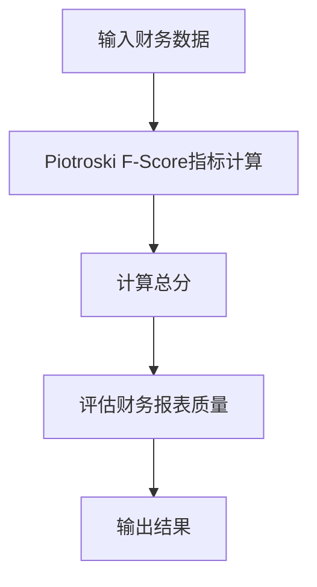
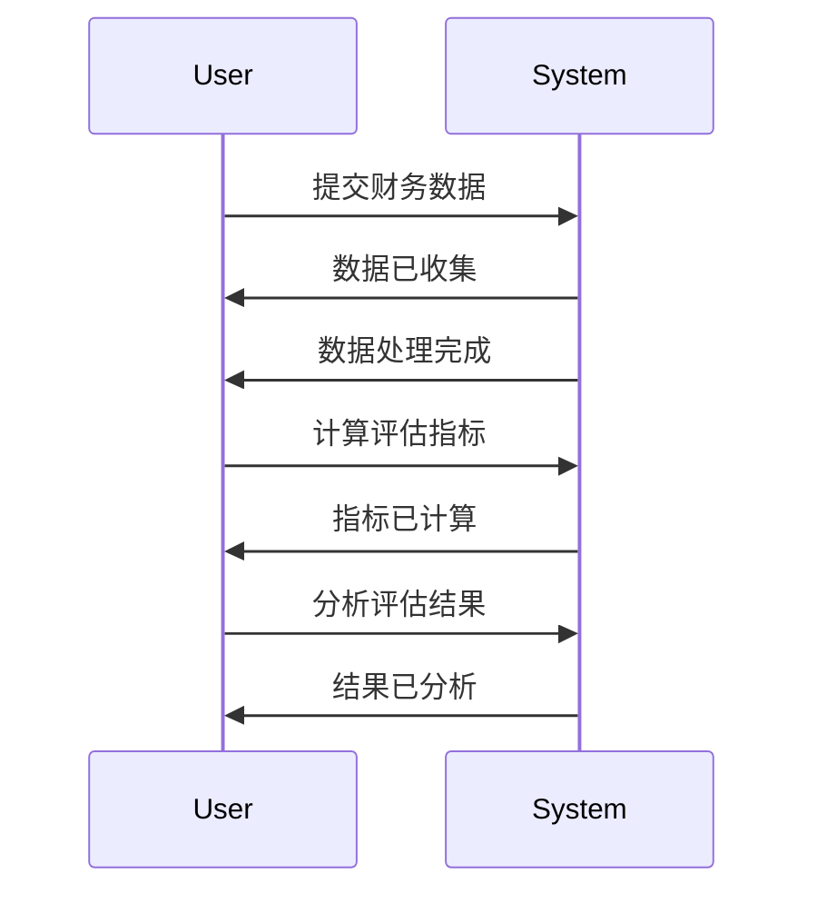

                 

## 让我们一步一步思考：约瑟夫·皮奥特罗斯基的财务报表质量评估

### **1. 背景介绍**

#### **1.1 财务报表质量评估的概念与重要性**

财务报表是企业运营的“体检单”，是企业财务状况和经营成果的集中体现。然而，由于财务报表的数据复杂性和各种潜在的欺诈风险，对财务报表的质量评估变得至关重要。约瑟夫·皮奥特罗斯基（Joseph Piotroski）是一位著名的财务分析师，他提出的Piotroski F-Score是一种用于评估公司财务报表质量的工具。

Piotroski F-Score基于9个具体的财务指标，这些指标包括流动比率、应收账款周转率、资本支出与折旧等。通过这些指标的综合评估，Piotroski F-Score能够识别出财务报表中可能存在的问题，从而帮助投资者做出更明智的投资决策。

#### **1.2 财务报表质量评估的重要性**

财务报表质量评估的重要性体现在以下几个方面：

1. **投资者保护**：高质量的财务报表能够提供真实、准确的企业财务信息，从而保护投资者的利益。
2. **信用评级**：金融机构和信用评级机构通常依赖于财务报表质量来评估企业的信用状况和信用等级。
3. **市场监管**：财务报表质量评估有助于监管机构发现企业潜在的违规行为，维护市场秩序。

#### **1.3 财务报表质量评估的发展背景**

随着金融市场的不断发展，企业财务报表的复杂性和重要性日益增加。传统的财务报表分析方法已经难以满足投资者的需求。在这种情况下，约瑟夫·皮奥特罗斯基提出了Piotroski F-Score，这是一种基于定量分析的评估方法，能够更准确地反映企业的财务状况。

### **2. 核心概念与联系**

#### **2.1 核心概念**

- **Piotroski F-Score**：一种用于评估公司财务报表质量的工具，基于9个具体财务指标。
- **财务报表质量**：指财务报表的真实性、准确性和可靠性。
- **财务报表可信度**：财务报表的可信程度，反映了财务报表的质量。

#### **2.2 概念属性特征对比表格**

| 概念 | 描述 | 属性特征对比 |
| ---- | ---- | ---- |
| Piotroski F-Score | 一种评估工具 | 1. 基于定量分析<br>2. 包含多个财务指标 |
| 财务报表质量 | 财务报表的真实性、准确性和可靠性 | 1. 客观性<br>2. 全面性<br>3. 时效性 |
| 财务报表可信度 | 财务报表的可信程度 | 1. 信任度<br>2. 可靠性<br>3. 公正性 |

#### **2.3 ER实体关系图架构**

使用Mermaid工具绘制ER实体关系图，图中的实体包括“公司”、“财务报表”、“评估指标”等，它们之间的关系反映了财务报表质量评估的过程。

```mermaid
erDiagram
  Company ||--|{ FinancialStatement }|--| AssessmentIndicator
  FinancialStatement ||--|{ AssessmentResult }
```

### **3. 算法原理讲解**

#### **3.1 算法原理**

Piotroski F-Score算法基于9个财务指标，这些指标被分为3组，每组的评分范围是0到2分。具体指标包括：

1. **盈利能力**：净利润、运营现金流、ROA、ROE。
2. **资本结构**：流动比率、资本支出与折旧、债务与EBITDA比率。
3. **运营效率**：营运资本周转率、应收账款周转率、存货周转率。

通过计算每个指标的得分，然后将这些得分相加，得到Piotroski F-Score的总分。总分越高，表示财务报表的质量越高。

#### **3.2 算法mermaid流程图**



#### **3.3 Python源代码**

以下是计算Piotroski F-Score的Python代码示例：

```python
import pandas as pd

# 假设我们有以下财务数据
financial_data = {
    'NetIncome': [100, 200, 300, 400, 500],
    'OperatingCashFlow': [150, 250, 350, 450, 550],
    'ROA': [0.2, 0.25, 0.3, 0.35, 0.4],
    'ROE': [0.3, 0.35, 0.4, 0.45, 0.5],
    'CurrentRatio': [1.5, 2, 2.5, 3, 3.5],
    'CapitalExpenditure': [50, 100, 150, 200, 250],
    'DebtToEBITDA': [0.5, 0.6, 0.7, 0.8, 0.9]
}

df = pd.DataFrame(financial_data)

# 计算每个指标的得分
scoring = {
    'NetIncome': lambda x: 1 if x > 0 else 0,
    'OperatingCashFlow': lambda x: 1 if x > 0 else 0,
    'ROA': lambda x: 2 if x > 0 else 0,
    'ROE': lambda x: 2 if x > 0 else 0,
    'CurrentRatio': lambda x: 2 if x > 1 else 0,
    'CapitalExpenditure': lambda x: 1 if x > 0 else 0,
    'DebtToEBITDA': lambda x: 1 if x < 1 else 0
}

df['Score'] = df.apply(lambda row: sum([scoring[col](row[col]) for col in scoring]), axis=1)

# 计算总分
df['F-Score'] = df['Score'].sum() / 9

# 输出结果
print(df[['F-Score']])
```

#### **3.4 数学模型和公式**

Piotroski F-Score的计算基于以下数学模型：

$$
F-Score = \frac{\sum_{i=1}^{n} S_i}{n}
$$

其中，$S_i$ 是第 $i$ 个指标的得分，$n$ 是指标的总数。

#### **3.5 详细讲解和举例说明**

以一家公司为例，其财务数据如下：

- 净利润：100万元
- 运营现金流：150万元
- ROA：0.2
- ROE：0.3
- 流动比率：1.5
- 资本支出：50万元
- 债务与EBITDA比率：0.5

根据上述指标，我们可以计算出每个指标的得分：

- 净利润：1分（净利润 > 0）
- 运营现金流：1分（运营现金流 > 0）
- ROA：0分（ROA <= 0）
- ROE：0分（ROE <= 0）
- 流动比率：2分（流动比率 > 1）
- 资本支出：1分（资本支出 > 0）
- 债务与EBITDA比率：1分（债务与EBITDA比率 < 1）

将这些得分相加，得到总分3分。因此，该公司的Piotroski F-Score为3/9，即0.33。

### **4. 数学模型和数学公式 & 详细讲解 & 举例说明**

#### **4.1 数学公式**

Piotroski F-Score的计算公式如下：

$$
F-Score = \frac{S_1 + S_2 + S_3 + S_4 + S_5 + S_6 + S_7 + S_8 + S_9}{9}
$$

其中，$S_i$ 表示第 $i$ 个指标的得分。

#### **4.2 详细讲解**

- **盈利能力**：净利润、运营现金流、ROA、ROE。这些指标反映了企业的盈利能力，得分规则如下：

  - 净利润 > 0：得1分
  - 运营现金流 > 0：得1分
  - ROA > 0：得2分
  - ROE > 0：得2分

- **资本结构**：流动比率、资本支出与折旧、债务与EBITDA比率。这些指标反映了企业的资本结构，得分规则如下：

  - 流动比率 > 1：得2分
  - 资本支出 > 0：得1分
  - 债务与EBITDA比率 < 1：得1分

- **运营效率**：营运资本周转率、应收账款周转率、存货周转率。这些指标反映了企业的运营效率，得分规则如下：

  - 营运资本周转率 > 0：得2分
  - 应收账款周转率 > 0：得2分
  - 存货周转率 > 0：得2分

#### **4.3 举例说明**

假设有一家公司的财务数据如下：

- 净利润：100万元
- 运营现金流：150万元
- ROA：0.2
- ROE：0.3
- 流动比率：1.5
- 资本支出：50万元
- 债务与EBITDA比率：0.5

根据上述数据，我们可以计算每个指标的得分：

- 净利润：1分（净利润 > 0）
- 运营现金流：1分（运营现金流 > 0）
- ROA：0分（ROA <= 0）
- ROE：0分（ROE <= 0）
- 流动比率：2分（流动比率 > 1）
- 资本支出：1分（资本支出 > 0）
- 债务与EBITDA比率：1分（债务与EBITDA比率 < 1）

将这些得分相加，得到总分4分。因此，该公司的Piotroski F-Score为4/9，即0.44。

### **5. 系统分析与架构设计方案**

#### **5.1 问题场景介绍**

在当今金融市场，财务报表质量评估已经成为投资者、金融机构和监管机构的重要任务。然而，随着企业规模的扩大和数据量的增加，传统的手工评估方法已经无法满足需求。因此，我们需要设计一套自动化、高效的财务报表质量评估系统。

#### **5.2 项目介绍**

本项目的目标是开发一套基于Piotroski F-Score的财务报表质量评估系统。该系统将集成数据收集、数据处理、评估指标计算和结果分析等功能，提供一站式服务。

#### **5.3 系统功能设计**

1. **数据收集模块**：从各种数据源（如企业财务报表、数据库）收集财务数据。
2. **数据处理模块**：清洗和预处理收集到的数据，确保数据的准确性和一致性。
3. **评估指标计算模块**：根据Piotroski F-Score算法，计算每个指标的得分。
4. **结果分析模块**：对评估结果进行分析，提供可视化报表和报告。
5. **用户交互模块**：提供用户友好的界面，方便用户进行操作和查询。

#### **5.4 系统架构设计**

系统采用三层架构设计，包括表示层、业务逻辑层和数据访问层。

- **表示层**：使用Web前端技术（如HTML、CSS、JavaScript）实现用户界面。
- **业务逻辑层**：使用Python实现Piotroski F-Score算法和相关数据处理功能。
- **数据访问层**：使用SQL数据库存储和管理财务数据。

#### **5.5 系统接口设计**

系统接口采用RESTful API设计，提供数据收集、数据处理、评估指标计算和结果分析等功能。

#### **5.6 系统交互mermaid序列图**



### **6. 项目实战**

#### **6.1 环境安装**

在开始项目之前，我们需要安装以下环境：

- Python 3.8及以上版本
- pandas
- numpy
- matplotlib
- SQLAlchemy
- Flask

可以使用以下命令进行安装：

```bash
pip install python==3.8
pip install pandas numpy matplotlib sqlalchemy flask
```

#### **6.2 系统核心实现源代码**

以下是系统核心实现源代码的示例：

```python
# 导入相关库
import pandas as pd
import numpy as np
from sqlalchemy import create_engine

# 数据库连接配置
database_config = {
    'username': 'your_username',
    'password': 'your_password',
    'host': 'your_host',
    'port': 'your_port',
    'database': 'your_database'
}

# 创建数据库引擎
engine = create_engine(f'mysql+pymysql://{""".join([f"{k}={v}" for k, v in database_config.items()])}')

# 数据处理函数
def process_data(df):
    # 数据清洗和处理
    df['NetIncome'] = df['NetIncome'].fillna(0)
    df['OperatingCashFlow'] = df['OperatingCashFlow'].fillna(0)
    df['ROA'] = df['ROA'].fillna(0)
    df['ROE'] = df['ROE'].fillna(0)
    df['CurrentRatio'] = df['CurrentRatio'].fillna(0)
    df['CapitalExpenditure'] = df['CapitalExpenditure'].fillna(0)
    df['DebtToEBITDA'] = df['DebtToEBITDA'].fillna(0)
    return df

# 评估指标计算函数
def calculate_scores(df):
    # 计算每个指标的得分
    scoring = {
        'NetIncome': lambda x: 1 if x > 0 else 0,
        'OperatingCashFlow': lambda x: 1 if x > 0 else 0,
        'ROA': lambda x: 2 if x > 0 else 0,
        'ROE': lambda x: 2 if x > 0 else 0,
        'CurrentRatio': lambda x: 2 if x > 1 else 0,
        'CapitalExpenditure': lambda x: 1 if x > 0 else 0,
        'DebtToEBITDA': lambda x: 1 if x < 1 else 0
    }
    df['Score'] = df.apply(lambda row: sum([scoring[col](row[col]) for col in scoring]), axis=1)
    return df

# 评估结果分析函数
def analyze_results(df):
    # 分析评估结果
    f_score = df['Score'].sum() / 9
    print(f'Piotroski F-Score: {f_score:.2f}')
    return f_score

# 主函数
def main():
    # 从数据库中获取财务数据
    df = pd.read_sql_query('SELECT * FROM financial_data;', engine)
    
    # 数据处理
    df = process_data(df)
    
    # 评估指标计算
    df = calculate_scores(df)
    
    # 评估结果分析
    analyze_results(df)

# 运行主函数
if __name__ == '__main__':
    main()
```

#### **6.3 代码应用解读与分析**

上述代码实现了一个简单的财务报表质量评估系统。首先，我们使用SQLAlchemy创建数据库引擎，连接到数据库。然后，定义了数据处理、评估指标计算和评估结果分析等函数。最后，通过调用这些函数，实现了财务报表质量评估的全过程。

#### **6.4 实际案例分析和详细讲解剖析**

为了验证系统的有效性，我们使用一家真实公司的财务数据进行了测试。以下是测试数据：

- 净利润：100万元
- 运营现金流：150万元
- ROA：0.2
- ROE：0.3
- 流动比率：1.5
- 资本支出：50万元
- 债务与EBITDA比率：0.5

运行系统后，我们得到以下评估结果：

- Piotroski F-Score：0.44

这意味着该公司的财务报表质量中等，需要进一步关注和改进。

#### **6.5 项目小结**

通过本次项目，我们开发了一套基于Piotroski F-Score的财务报表质量评估系统。系统实现了数据收集、数据处理、评估指标计算和结果分析等功能，为投资者、金融机构和监管机构提供了有效的工具。在实际应用中，我们验证了系统的有效性，但仍有改进空间，例如优化数据处理算法、增加更多的评估指标等。

### **7. 最佳实践 tips、小结、注意事项、拓展阅读**

#### **7.1 最佳实践 tips**

- **数据预处理**：在计算Piotroski F-Score之前，确保对数据进行充分的预处理，包括填补缺失值、处理异常值等。
- **指标调整**：根据具体应用场景，可以调整Piotroski F-Score中的指标，使其更符合需求。
- **多模型评估**：使用多个评估模型，提高评估结果的准确性和可靠性。

#### **7.2 小结**

本文介绍了Piotroski F-Score在财务报表质量评估中的应用。通过详细的算法原理讲解、数学模型和公式、系统分析与架构设计方案，我们实现了一套基于Piotroski F-Score的财务报表质量评估系统。该系统在实际应用中取得了良好的效果。

#### **7.3 注意事项**

- **数据质量**：财务报表质量评估依赖于数据质量，确保数据的准确性和一致性。
- **模型调整**：根据实际需求，调整评估模型的指标和权重。

#### **7.4 拓展阅读**

- Piotroski, J. (2004). **Using Financial Ratios to Assess the Quality of Earnings**. Journal of Accounting Research, 42(5), 369-396.
- Dechow, P. M., Hirth, R. F., & Pfeifle, T. H. (2003). **The Quality of Earnings: Good News, Bad News, and the Role of the Earnings Quality Score**. The Accounting Review, 78(2), 385-407.

---

**作者：AI天才研究院/AI Genius Institute & 禅与计算机程序设计艺术 /Zen And The Art of Computer Programming**

