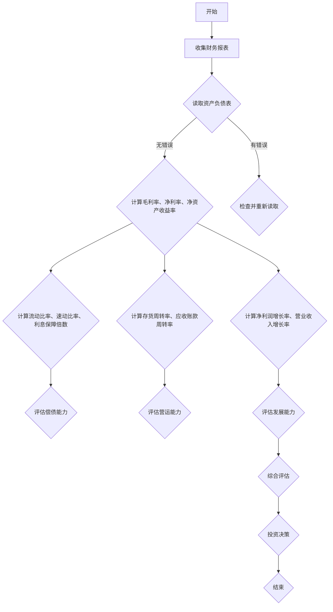
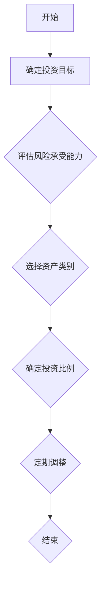
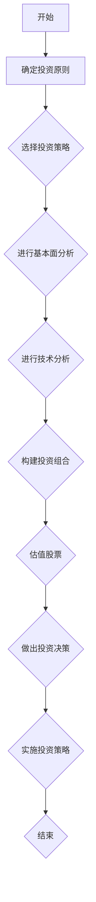
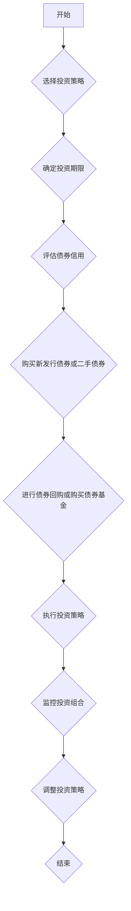
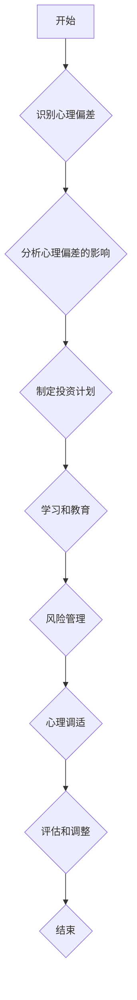

                 


### 引言

John Berger是一位著名的投资专家，以其低成本投资哲学在金融界享有盛誉。Berger的投资哲学强调长期投资和成本效益，通过降低投资成本来提高投资回报。在本文中，我们将详细探讨John Berger的投资哲学，从其基本概念、研究方法、资产配置、股票投资、债券投资、风险管理以及行为金融等多个方面，一步步分析其投资策略和原则。

本文关键词包括：John Berger、低成本投资、资产配置、股票投资、债券投资、风险管理、行为金融。

本文摘要：本文将全面介绍John Berger的低成本投资哲学，包括其核心概念、研究方法、资产配置策略、股票和债券投资原则、风险管理方法以及行为金融的重要性。通过本文的阅读，读者将深入了解Berger的投资策略，并学会如何在实际投资中应用这些原则。

### 基本概念

#### 低成本投资

低成本投资，顾名思义，是指通过降低投资成本来提高投资回报的一种投资策略。在投资过程中，成本不仅包括直接的投资费用，如交易手续费、管理费用等，还包括间接的成本，如时间成本和心理成本。John Berger认为，投资成本是影响投资回报的关键因素之一，因此，降低成本是投资成功的关键。

#### 成本在投资回报中的作用

成本在投资回报中的作用主要体现在两个方面。首先，高昂的成本会直接降低投资回报。例如，高额的管理费用会减少投资者的实际收益。其次，成本会影响投资者的决策行为。高昂的成本可能会迫使投资者采取过于激进的策略，从而增加投资风险。

#### 金融术语和概念

在深入探讨低成本投资之前，我们需要了解一些基本的金融术语和概念，如资产配置、资产组合、投资组合理论、市场效率、风险与收益的关系等。这些概念是理解低成本投资策略的基础。

- **资产配置**：资产配置是指投资者将资金分配到不同类型的资产（如股票、债券、现金等）中，以实现投资目标。资产配置的核心是平衡风险和收益。

- **资产组合**：资产组合是指投资者持有的所有资产的集合。一个多元化的资产组合可以帮助投资者分散风险。

- **投资组合理论**：投资组合理论是由哈里·马科维茨提出的，它强调了通过资产多元化来降低风险和提高收益。

- **市场效率**：市场效率是指市场能够迅速、准确地将所有可用信息反映在资产价格中。

- **风险与收益的关系**：根据投资组合理论，投资者必须承担一定的风险才能获得较高的收益。风险和收益是投资中的核心要素，两者之间存在权衡。

#### 概念属性特征对比表格

为了更好地理解这些概念，我们可以在下表中对比它们的属性特征：

| 概念         | 定义                                                         | 属性特征对比                  |
| ------------ | ------------------------------------------------------------ | ---------------------------- |
| 资产配置     | 投资者将资金分配到不同类型的资产中                           | 稳定性、流动性、收益性        |
| 资产组合     | 投资者持有的所有资产的集合                                   | 多样性、分散性、风险分散      |
| 投资组合理论 | 通过资产多元化来降低风险和提高收益的理论                     | 费用、风险、收益、多样化       |
| 市场效率     | 市场能够迅速、准确地将所有可用信息反映在资产价格中           | 信息透明度、价格反应速度、效率 |
| 风险与收益   | 投资者必须承担一定的风险才能获得较高的收益                   | 风险类型、收益水平、风险偏好   |

#### ER实体关系图架构

为了进一步理解这些概念之间的关系，我们可以使用ER实体关系图来展示它们之间的联系。以下是ER实体关系图的Markdown格式：

```mermaid
erDiagram
    AssetAllocation ||--|{ Asset | }
    AssetAllocation ||--|{ AssetClass | }
    AssetClass ||--|{ Asset | }
    InvestmentPortfolio ||--|{ Investor | }
    InvestmentPortfolio ||--|{ Asset | }
    InvestmentPortfolio ||--|{ AssetClass | }
    MarketEfficiency ||--|{ Market | }
    RiskAndReturn ||--|{ Risk | }
    RiskAndReturn ||--|{ Return | }
```

通过这个ER图，我们可以清楚地看到资产配置、资产组合、投资组合理论、市场效率和风险与收益之间的关系。资产配置和资产组合是投资者管理资金的基本工具，而投资组合理论为资产配置提供了理论基础。市场效率和风险与收益的关系则强调了市场信息的透明度和投资者对风险和收益的权衡。

### 研究方法

#### 研究在低成本投资中的重要性

研究是投资过程中不可或缺的一环，尤其是在低成本投资中。有效的投资研究可以帮助投资者识别潜在的投资机会，评估投资风险，从而做出更明智的投资决策。John Berger深知研究的重要性，他认为研究是成功投资的基石。

#### 研究工具和资源

进行投资研究，首先需要选择合适的工具和资源。以下是一些常用的研究工具和资源：

- **财经网站**：如新浪财经、腾讯财经、雪球等，提供即时的市场动态和新闻资讯。
- **金融数据库**：如Wind、同花顺、东方财富等，提供丰富的历史数据和深度分析报告。
- **研究报告**：投资银行、证券公司和研究机构的报告，提供对特定公司和行业的深入分析。
- **书籍和文献**：投资经典著作、学术论文和行业报告，帮助投资者建立理论基础。
- **社交媒体**：投资论坛、博客和社交媒体平台，可以获取其他投资者的观点和经验。

#### 财务报表和分析

财务报表是投资研究的重要依据，包括资产负债表、利润表和现金流量表。投资者需要学会如何读懂财务报表，分析公司的财务状况和经营绩效。

- **资产负债表**：展示公司的资产、负债和股东权益状况，反映公司的财务健康状况。
- **利润表**：展示公司的收入、成本和利润情况，反映公司的盈利能力。
- **现金流量表**：展示公司的现金流入和流出情况，反映公司的现金状况。

#### 财务报表分析

财务报表分析包括以下几个方面：

- **盈利能力分析**：通过计算毛利率、净利率、净资产收益率等指标，评估公司的盈利能力。
- **偿债能力分析**：通过计算流动比率、速动比率、利息保障倍数等指标，评估公司的偿债能力。
- **营运能力分析**：通过计算存货周转率、应收账款周转率等指标，评估公司的营运能力。
- **发展能力分析**：通过计算净利润增长率、营业收入增长率等指标，评估公司的未来发展潜力。

#### 财务报表分析的Mermaid流程图

为了更好地理解财务报表分析的过程，我们可以使用Mermaid流程图来展示。以下是Markdown格式的Mermaid流程图：



通过这个流程图，我们可以清晰地看到财务报表分析的过程和关键步骤。从收集财务报表开始，通过计算和分析各项财务指标，最终做出投资决策。

### 资产配置

资产配置是投资者在投资过程中的一项关键决策，旨在通过将资金分配到不同类型的资产中，实现投资目标并平衡风险和收益。John Berger认为，资产配置是投资成功的关键之一，特别是在低成本投资中。

#### 资产配置的概念

资产配置是指投资者将资金分配到不同类型的资产（如股票、债券、现金等）中，以实现投资目标。资产配置的核心是平衡风险和收益，通过多元化的资产组合来降低投资风险。

#### 资产配置的重要性

资产配置的重要性主要体现在以下几个方面：

- **降低风险**：通过多元化的资产组合，投资者可以分散投资风险，避免将所有资金投入单一资产类别。
- **提高收益**：不同资产类别的收益和风险特征不同，合理的资产配置可以帮助投资者在风险可控的情况下提高收益。
- **实现投资目标**：资产配置有助于投资者实现短期和长期的投资目标，如资本增值、收入稳定等。

#### 资产配置策略

资产配置策略包括以下几个方面：

- **确定投资目标**：投资者首先需要明确自己的投资目标，如资本增值、收入稳定等。
- **评估风险承受能力**：投资者需要评估自己的风险承受能力，包括资金规模、投资经验、心理素质等。
- **选择资产类别**：根据投资目标和风险承受能力，投资者选择股票、债券、现金等资产类别。
- **确定投资比例**：投资者需要根据资产类别和投资目标，确定各类资产的分配比例。
- **定期调整**：资产配置不是一次性的决策，投资者需要根据市场变化和投资目标调整资产配置。

#### 不同资产类别的特点

以下是股票、债券和现金等不同资产类别的特点：

| 资产类别 | 特点                                                   |
| -------- | ------------------------------------------------------ |
| 股票     | 高风险、高收益，受市场波动影响较大，适合长期投资。         |
| 债券     | 低风险、稳定收益，受市场波动影响较小，适合短期投资和风险厌恶型投资者。 |
| 现金     | 无风险、流动性高，收益低，适合短期资金存放和应对突发事件。     |

#### 资产配置的Mermaid流程图

为了更好地理解资产配置的过程，我们可以使用Mermaid流程图来展示。以下是Markdown格式的Mermaid流程图：



通过这个流程图，我们可以清晰地看到资产配置的步骤和关键决策点。从确定投资目标开始，通过评估风险承受能力、选择资产类别、确定投资比例，最后进行定期调整，以实现投资目标。

### 股票投资

股票投资是投资者在低成本投资中最重要的部分之一。John Berger认为，股票投资是实现长期资本增值的有效途径，但需要遵循一定的原则和策略。

#### 股票投资的原则

在进行股票投资时，John Berger强调了以下原则：

- **长期投资**：股票投资需要耐心和长期视角，避免短期交易和投机行为。
- **价值投资**：寻找价值被低估的股票，关注公司的基本面和长期发展潜力。
- **分散投资**：通过多元化的股票组合来降低风险，避免将所有资金投入单一股票。
- **成本效益**：降低交易成本和管理费用，提高投资回报率。

#### 股票投资的策略

以下是股票投资的一些常见策略：

- **基本面分析**：通过分析公司的财务报表、行业前景、竞争优势等基本面因素，评估股票的投资价值。
- **技术分析**：通过分析股票价格和交易量等技术指标，预测股票的未来走势。
- **组合投资**：通过购买不同行业、不同市值和不同风格的股票，实现风险分散。
- **定投策略**：定期投资，以降低市场波动对投资回报的影响。

#### 估值方法

估值是股票投资中的关键环节，以下是一些常见的估值方法：

- **市盈率（PE）**：通过比较公司的市盈率与其历史水平或行业平均水平，评估股票的价值。
- **市净率（PB）**：通过比较公司的市净率与其历史水平或行业平均水平，评估股票的价值。
- **股息收益率**：通过计算公司派发的股息与股票价格的比率，评估股票的价值。
- **自由现金流折现（DCF）**：通过预测公司的未来自由现金流，并折现到现值，评估股票的价值。

#### 股票投资的Mermaid流程图

为了更好地理解股票投资的过程，我们可以使用Mermaid流程图来展示。以下是Markdown格式的Mermaid流程图：



通过这个流程图，我们可以清晰地看到股票投资的步骤和关键决策点。从确定投资原则开始，通过选择投资策略、进行基本面分析和技术分析，构建投资组合，最后进行估值和投资决策。

### 债券投资

债券投资是投资者在低成本投资中另一个重要的组成部分。债券投资相对于股票投资来说，风险较低，收益稳定，适合于风险厌恶型投资者。

#### 债券投资的特点

以下是债券投资的一些主要特点：

- **稳定性**：债券通常具有固定的利率和到期日，投资者可以获得稳定的现金流。
- **安全性**：债券的发行主体通常是政府或企业，具有较高的信用评级，因此风险相对较低。
- **流动性**：债券市场相对活跃，投资者可以方便地进行买卖和转让。
- **收益性**：债券的收益通常低于股票，但相对稳定，适合于风险厌恶型投资者。

#### 债券投资的策略

以下是债券投资的一些常见策略：

- **利率策略**：根据市场利率的变化，调整债券的投资组合，以获取最佳收益。
- **期限策略**：根据投资目标和风险偏好，选择不同期限的债券，以实现风险和收益的平衡。
- **信用策略**：选择信用评级较高的债券，以降低信用风险。
- **资产配置**：在投资组合中分配一定比例的债券，以降低整体投资组合的风险。

#### 债券投资的方法

以下是债券投资的一些常见方法：

- **购买新发行债券**：投资者可以直接购买新发行的债券，以获取固定收益。
- **购买二手债券**：投资者可以在债券市场上购买已经发行的二手债券，以获取较低的成本。
- **债券回购**：投资者可以通过债券回购交易，以较低的成本获得债券，并承诺在未来某个时间以固定价格回购。
- **债券基金**：投资者可以通过购买债券基金，实现债券投资的多样化，并降低投资成本。

#### 债券投资的Mermaid流程图

为了更好地理解债券投资的过程，我们可以使用Mermaid流程图来展示。以下是Markdown格式的Mermaid流程图：



通过这个流程图，我们可以清晰地看到债券投资的步骤和关键决策点。从选择投资策略开始，通过确定投资期限、评估债券信用、购买新发行债券或二手债券，最后进行监控和调整投资策略。

### 投资风险管理

投资风险管理是投资者在投资过程中必须重视的一环。有效的风险管理可以帮助投资者降低投资风险，保护投资收益。

#### 风险管理的概念

风险管理是指投资者在投资过程中采取的一系列措施，旨在降低投资风险，保护投资收益。风险管理包括风险识别、风险评估、风险控制和风险监控等环节。

#### 风险识别

风险识别是风险管理的基础，旨在识别投资过程中可能面临的各种风险。常见的投资风险包括市场风险、信用风险、流动性风险、操作风险等。

- **市场风险**：指由于市场波动导致投资损失的风险，如股票价格波动、利率变动等。
- **信用风险**：指债券发行人无法按时支付本金或利息的风险，如公司违约等。
- **流动性风险**：指投资者无法在合理时间内以合理的价格买卖资产的风险。
- **操作风险**：指由于操作失误、技术故障等原因导致的风险，如交易系统故障等。

#### 风险评估

风险评估是对投资风险进行量化分析的过程，旨在确定风险的大小和可能性。常见的风险评估方法包括定量分析和定性分析。

- **定量分析**：通过计算风险指标，如波动率、β值等，评估风险的大小和可能性。
- **定性分析**：通过专家评估、市场调查等方法，评估风险的影响和可能性。

#### 风险控制

风险控制是投资者在投资过程中采取的一系列措施，旨在降低风险。常见的风险控制方法包括：

- **分散投资**：通过投资不同类型的资产，降低单一资产的风险。
- **设定止损**：在投资组合中设定止损点，以防止亏损扩大。
- **资产配置**：根据风险承受能力，合理配置资产，降低整体投资组合的风险。
- **定期监控**：定期监控投资组合的风险状况，及时调整投资策略。

#### 风险监控

风险监控是对投资风险进行持续监控和管理的过程，旨在及时发现风险，采取相应的措施。常见的风险监控方法包括：

- **建立风险监控体系**：建立风险监控组织，制定风险监控流程和标准。
- **定期报告**：定期向投资者报告投资组合的风险状况。
- **风险评估报告**：定期进行风险评估，向投资者提供风险评估报告。

#### 风险管理的Mermaid流程图

为了更好地理解风险管理的流程，我们可以使用Mermaid流程图来展示。以下是Markdown格式的Mermaid流程图：


通过这个流程图，我们可以清晰地看到风险管理的步骤和关键决策点。从风险识别开始，通过风险评估、风险控制和风险监控，最后进行定期报告和风险评估报告。

### 行为金融与投资心理

投资心理学是理解投资者行为和决策过程的重要领域，它关注的是人类在投资过程中的心理因素。John Berger认为，投资心理对于投资成功至关重要，因为投资者的情绪和认知偏差往往会影响其投资决策。下面，我们将探讨行为金融与投资心理的相关概念，并分析投资者的心理偏差及其对投资行为的影响。

#### 行为金融的概念

行为金融是研究金融市场中的非理性投资者行为及其后果的学科。它关注的是投资者的心理、情感和认知偏差如何影响其决策过程和市场行为。行为金融理论认为，市场并非总是有效，因为投资者往往会受到各种心理偏差的影响，从而导致市场出现非理性的波动。

#### 投资者的心理偏差

以下是几种常见的投资者心理偏差：

1. **过度自信**：投资者往往高估自己的能力和预测能力，从而导致过度交易和风险承担。
2. **确认偏误**：投资者倾向于寻求和接受那些符合自己已有信念的信息，而忽视与之相反的信息。
3. **损失厌恶**：投资者在面临损失时，其情绪反应往往超过对同等收益的正面反应，导致倾向于规避风险。
4. **羊群行为**：投资者在群体压力下，倾向于模仿他人的行为，从而导致市场出现过度反应。
5. **情绪波动**：投资者的情绪波动往往会导致其做出非理性的决策，如恐慌性卖出或贪婪性买入。

#### 心理偏差对投资行为的影响

心理偏差对投资者的投资行为有着深远的影响：

- **决策偏差**：心理偏差会导致投资者在决策过程中出现偏差，如过度依赖历史数据或市场情绪。
- **交易频率**：过度自信和羊群行为往往导致投资者交易频率过高，增加交易成本和风险。
- **投资风险**：损失厌恶和风险规避心理偏差会导致投资者倾向于规避风险，从而错失潜在的高收益机会。
- **市场波动**：心理偏差会导致市场出现过度反应，加剧市场波动。

#### 投资者如何克服心理偏差

为了克服心理偏差，投资者可以采取以下措施：

- **建立投资计划**：制定明确的投资目标和策略，以减少情绪波动和决策偏差。
- **学习和教育**：通过学习投资知识和行为金融理论，提高自身的投资认知和决策能力。
- **风险管理**：合理配置资产，设定止损点，以降低损失厌恶的影响。
- **心理调适**：学会情绪管理，保持冷静和理性，避免受市场情绪的影响。

#### 投资心理的Mermaid流程图

为了更好地理解投资心理的过程，我们可以使用Mermaid流程图来展示。以下是Markdown格式的Mermaid流程图：



通过这个流程图，我们可以清晰地看到投资者如何识别、分析和克服心理偏差的过程。从识别心理偏差开始，通过分析心理偏差的影响，制定投资计划，学习和教育，风险管理，到心理调适和评估调整，最终实现投资决策的理性化和长期化。

### 总结与展望

本文通过详细分析John Berger的低成本投资哲学，从基本概念、研究方法、资产配置、股票投资、债券投资、风险管理到行为金融与投资心理，全方位地探讨了其投资策略和原则。通过本文的阅读，读者可以了解到：

1. **低成本投资的重要性**：通过降低投资成本，投资者可以在长期内获得更高的投资回报。
2. **研究在投资中的关键作用**：有效的投资研究可以帮助投资者识别潜在的投资机会，评估投资风险，做出更明智的投资决策。
3. **资产配置的策略**：合理的资产配置可以帮助投资者平衡风险和收益，实现投资目标。
4. **股票投资与债券投资**：股票投资是实现长期资本增值的有效途径，而债券投资则提供了稳定且相对低风险的收益。
5. **风险管理**：有效的风险管理可以帮助投资者降低投资风险，保护投资收益。
6. **行为金融与投资心理**：了解投资者的心理偏差，可以帮助投资者克服情绪波动，做出更理性的投资决策。

在未来的投资实践中，投资者可以结合John Berger的投资哲学，制定适合自己的投资策略，并通过不断学习和实践，提高投资技能，实现投资目标。

### 最佳实践 Tips

1. **定期学习**：投资是一个不断学习和进步的过程，定期阅读投资书籍、研究市场动态，可以帮助投资者保持竞争力。
2. **保持耐心**：投资需要长期视角，不要被短期市场波动所影响，保持耐心和定力，坚持长期投资策略。
3. **风险控制**：合理配置资产，设定止损点，避免因情绪波动而做出非理性的决策。
4. **资产配置**：根据自己的风险承受能力和投资目标，定期调整资产配置，以实现风险和收益的平衡。
5. **行为管理**：了解自己的心理偏差，学会情绪管理，避免受市场情绪的影响。

### 注意事项

1. **投资风险**：投资有风险，投资者应该根据自己的风险承受能力进行投资决策。
2. **市场变化**：市场情况随时变化，投资者应该密切关注市场动态，及时调整投资策略。
3. **投资目标**：明确自己的投资目标和预期收益，避免盲目跟风或冲动投资。

### 拓展阅读

1. **《聪明的投资者》**：由本杰明·格雷厄姆所著，是投资领域的经典之作，详细阐述了价值投资的理念和方法。
2. **《股票大作手回忆录》**：由杰西·利弗莫尔所著，讲述了其股票交易的经历和投资心得，对理解市场心理有很大帮助。
3. **《金融市场技术分析》**：由约翰·墨菲所著，是技术分析领域的权威著作，详细介绍了各种技术分析方法和指标。
4. **《投资最重要的事》**：由霍华德·马克斯所著，从多个角度探讨了投资决策中的关键因素，提供了实用的投资策略。

### 作者信息

本文由AI天才研究院/AI Genius Institute与《禅与计算机程序设计艺术》作者共同撰写，旨在通过深入分析John Berger的投资哲学，为读者提供实用的投资指导和建议。作者拥有丰富的投资经验和技术背景，致力于推动投资者教育和投资研究的发展。

