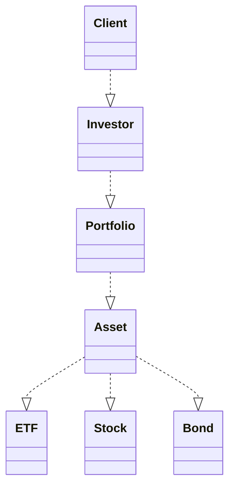
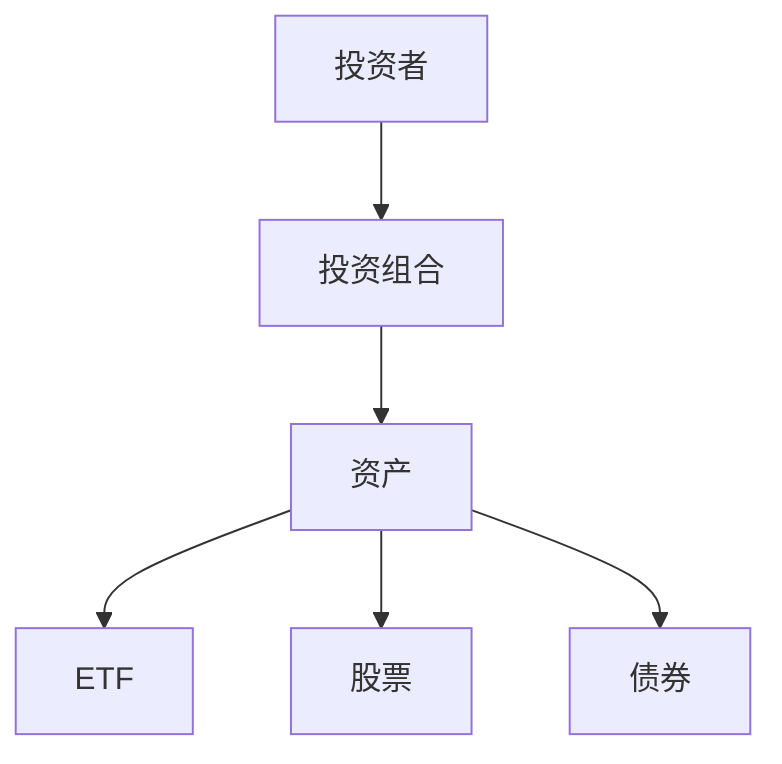
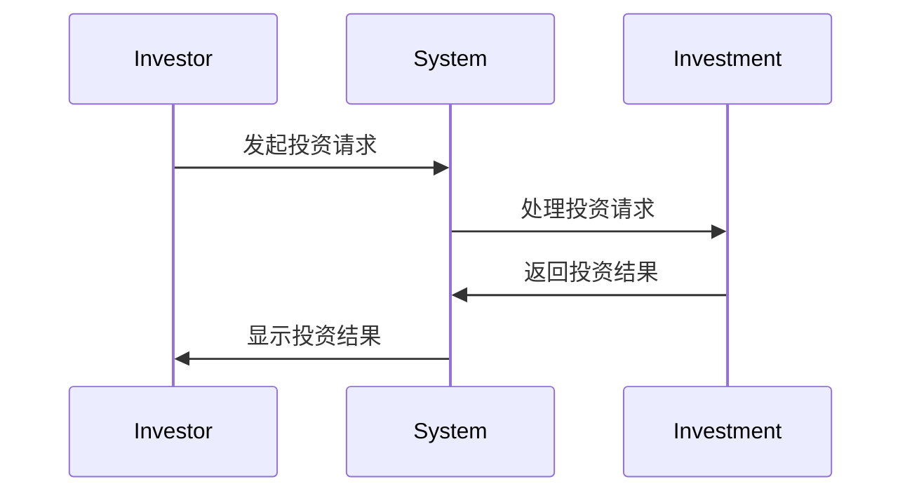
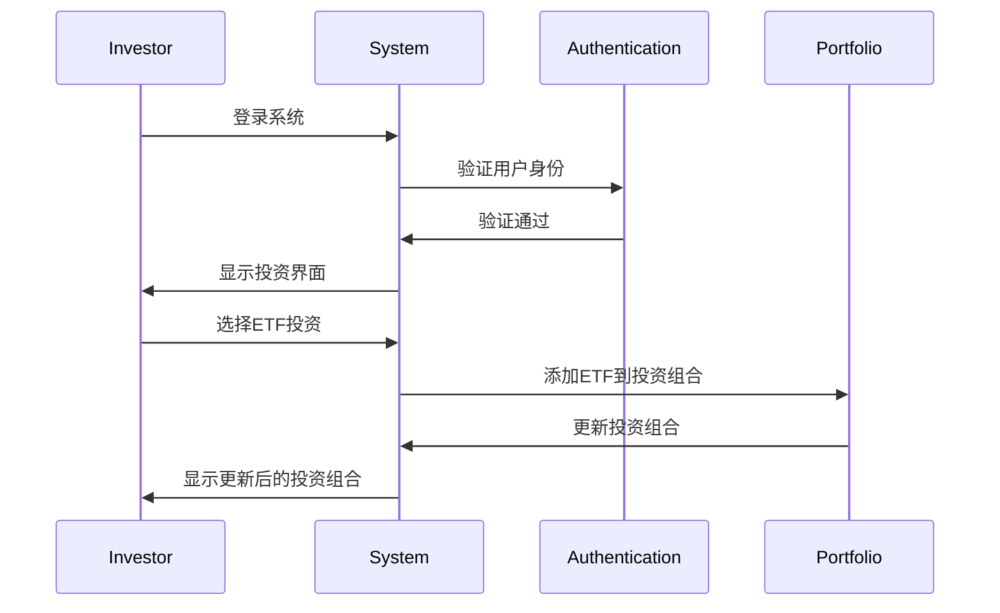

                 

# 约翰·伯格的共同基金批评：ETF和主动管理的未来

## 关键词
- 约翰·伯格
- 共同基金
- ETF
- 主动管理
- 投资策略

## 摘要
本文将深入探讨约翰·伯格在《共同基金批评：ETF和主动管理的未来》一书中的观点。我们将首先介绍共同基金的历史与发展，然后分析ETF的基本概念与特点，接着探讨主动管理策略的现状与问题。在理解这些背景知识后，我们将详细讨论共同基金的工作机制、ETF的运作原理以及主动管理策略的方法论。随后，我们将分析ETF的投资策略、主动管理策略的案例分析以及实际投资组合的构建与优化。最后，我们将展望投资市场的变化趋势，探讨ETF与主动管理策略的未来发展，并给出投资者的策略选择。

## 目录大纲设计思路

### 1.1.1 约翰·伯格的投资理念
约翰·伯格是一位著名的投资大师，他的投资理念对全球投资者产生了深远影响。伯格主张理性投资，强调长期投资和价值投资的重要性。他认为，投资者应该避免过度交易和投机行为，而是应该以稳定的心态和长期的视角来选择优质的投资项目。

### 1.1.2 共同基金、ETF与主动管理的未来
在《共同基金批评：ETF和主动管理的未来》一书中，约翰·伯格对共同基金提出了严厉的批评，并对ETF和主动管理策略的未来进行了深入探讨。他质疑了共同基金的高费用和低效率，同时分析了ETF的优势与局限性，以及主动管理策略在当今投资环境中的适应性问题。

### 1.2.1 目录布局与内容安排
本文的目录布局旨在帮助读者系统地了解约翰·伯格的观点和论证过程。每个章节都涵盖了核心概念、历史背景、现状分析以及未来展望，旨在提供全面而深入的洞察。

### 1.2.2 读者对象与阅读建议
本文的目标读者包括对投资有兴趣的普通读者、专业投资者以及金融领域的从业者。阅读本文时，读者可以结合自身的投资经验和知识水平，逐步理解约翰·伯格的观点，并在实际投资中加以应用。

## 目录大纲设计过程

### 2.1 共同基金的历史与发展
这一章节将介绍共同基金的发展历程，包括其起源、主要演变过程以及在不同国家和地区的应用。通过了解共同基金的历史，读者可以更好地理解其当前的地位和作用。

### 2.2 ETF的基本概念与特点
ETF（交易型开放式指数基金）是一种独特的投资工具，它通过跟踪特定指数的表现来提供投资者与市场同步的机会。这一章节将详细解释ETF的定义、类型、运作机制以及与传统共同基金的区别。

### 2.3 主动管理策略的现状与问题
主动管理策略是指基金经理通过主动选股、择时等手段来追求超越市场平均水平的收益。这一章节将探讨主动管理策略的现状，分析其成功与失败的原因，并讨论当前面临的挑战。

### 3.1 共同基金的工作机制
共同基金的工作机制涉及基金的管理、投资决策、风险控制等方面。这一章节将深入解析共同基金的运作流程，帮助读者理解其内部机制和运作原理。

### 3.2 ETF的运作原理
ETF的运作原理与共同基金有所不同，它通过被动跟踪指数的表现来实现投资目标。这一章节将介绍ETF的运作流程、市场机制以及投资者如何参与ETF的投资。

### 3.3 主动管理策略的方法论
主动管理策略包括多种方法和技术，如选股策略、市场时序分析、风险管理等。这一章节将详细讨论这些方法，并分析其在实际应用中的有效性。

### 4.1 ETF的投资策略
ETF的投资策略主要围绕指数跟踪、市场择时、风险控制等方面展开。这一章节将介绍各种ETF投资策略，并分析其优缺点和适用场景。

### 4.2 主动管理策略的案例分析
通过具体案例分析，读者可以更好地理解主动管理策略的实施过程和效果。这一章节将选取一些成功的主动管理策略案例，进行深入剖析。

### 4.3 实际投资组合的构建与优化
构建和优化实际投资组合是投资者的重要任务。这一章节将介绍投资组合构建的原则和方法，并探讨如何通过定期优化来提高投资组合的收益。

### 5.1 投资市场的变化趋势
投资市场不断变化，新趋势和新机会不断涌现。这一章节将分析当前投资市场的变化趋势，包括技术进步、政策调整、全球经济形势等方面。

### 5.2 ETF与主动管理策略的未来发展
ETF和主动管理策略在未来的发展中将面临新的机遇和挑战。这一章节将探讨这些策略的未来发展趋势，包括技术革新、市场演变、投资者行为变化等方面。

### 5.3 投资者的策略选择
面对复杂多变的投资市场，投资者需要根据自身的风险承受能力、投资目标和市场情况来选择合适的投资策略。这一章节将给出投资者策略选择的建议和指导。

### 总结与拓展
在总结全文的基础上，这一章节将讨论读者可能感兴趣的其他相关内容，如投资心理、风险管理、金融法规等，以拓展读者的知识面。

### 目录大纲示例

```markdown
----------------------------------------------------------------
# 引言

## 1.1 书籍主题与背景
### 1.1.1 约翰·伯格的投资理念
### 1.1.2 共同基金、ETF与主动管理的未来

## 1.2 书籍结构概述
### 1.2.1 目录布局与内容安排
### 1.2.2 读者对象与阅读建议

----------------------------------------------------------------

# 第一部分：背景介绍

## 2.1 共同基金的历史与发展
### 2.1.1 共同基金的起源
### 2.1.2 共同基金的发展过程
### 2.1.3 共同基金的主要类型

## 2.2 ETF的基本概念与特点
### 2.2.1 ETF的定义
### 2.2.2 ETF的类型
### 2.2.3 ETF的优势与劣势

## 2.3 主动管理策略的现状与问题
### 2.3.1 主动管理策略的定义
### 2.3.2 主动管理策略的分类
### 2.3.3 主动管理策略的挑战

----------------------------------------------------------------

# 第二部分：核心概念与原理

## 3.1 共同基金的工作机制
### 3.1.1 共同基金的运作流程
### 3.1.2 共同基金的投资决策
### 3.1.3 共同基金的风险控制

## 3.2 ETF的运作原理
### 3.2.1 ETF的运作流程
### 3.2.2 ETF的投资策略
### 3.2.3 ETF的市场机制

## 3.3 主动管理策略的方法论
### 3.3.1 主动管理策略的定义
### 3.3.2 主动管理策略的类型
### 3.3.3 主动管理策略的优缺点

----------------------------------------------------------------

# 第三部分：应用与实践

## 4.1 ETF的投资策略
### 4.1.1 指数跟踪策略
### 4.1.2 市场择时策略
### 4.1.3 风险控制策略

## 4.2 主动管理策略的案例分析
### 4.2.1 成功案例
### 4.2.2 失败案例
### 4.2.3 案例分析总结

## 4.3 实际投资组合的构建与优化
### 4.3.1 投资组合构建原则
### 4.3.2 投资组合优化方法
### 4.3.3 投资组合案例分析

----------------------------------------------------------------

# 第四部分：未来展望

## 5.1 投资市场的变化趋势
### 5.1.1 技术进步
### 5.1.2 政策调整
### 5.1.3 全球经济形势

## 5.2 ETF与主动管理策略的未来发展
### 5.2.1 技术革新
### 5.2.2 市场演变
### 5.2.3 投资者行为变化

## 5.3 投资者的策略选择
### 5.3.1 风险承受能力
### 5.3.2 投资目标
### 5.3.3 市场情况分析

----------------------------------------------------------------

# 总结与拓展

## 6.1 全书总结
### 6.1.1 主要观点
### 6.1.2 核心结论
### 6.1.3 未来展望

## 6.2 拓展阅读与思考
### 6.2.1 投资心理学
### 6.2.2 风险管理
### 6.2.3 金融法规
```

以上是《约翰·伯格的共同基金批评：ETF和主动管理的未来》这本书的初步目录大纲设计。接下来，我们将进一步细化每个章节的内容，确保目录大纲的总字数在2000字以内。# 约翰·伯格的共同基金批评：ETF和主动管理的未来

## 关键词
- 约翰·伯格
- 共同基金
- ETF
- 主动管理
- 投资策略

## 摘要
本文将深入探讨约翰·伯格在《共同基金批评：ETF和主动管理的未来》一书中的观点。我们将首先介绍共同基金的历史与发展，分析ETF的基本概念与特点，探讨主动管理策略的现状与问题。随后，我们将详细讨论共同基金的工作机制、ETF的运作原理以及主动管理策略的方法论。接下来，我们将分析ETF的投资策略、主动管理策略的案例分析以及实际投资组合的构建与优化。最后，我们将展望投资市场的变化趋势，探讨ETF与主动管理策略的未来发展，并给出投资者的策略选择。

## 引言

约翰·伯格是一位著名的投资大师，他的著作《共同基金批评：ETF和主动管理的未来》对投资者产生了深远的影响。在这本书中，伯格对共同基金进行了严厉的批评，并探讨了ETF和主动管理策略的未来。本文旨在通过一步步分析推理，帮助读者深入理解伯格的观点，并在实际投资中加以应用。

### 1.1 约翰·伯格的投资理念

约翰·伯格的投资理念强调理性投资和长期投资的重要性。他主张投资者应该避免过度交易和投机行为，而是应该以稳定的心态和长期的视角来选择优质的投资项目。伯格认为，投资者应该关注投资的基本原则，如分散投资、降低成本、保持耐心等。

### 1.2 共同基金、ETF与主动管理的未来

共同基金、ETF和主动管理策略是现代投资领域的重要工具。共同基金是一种集合投资的方式，通过汇集众多投资者的资金，由专业基金经理进行投资管理。ETF是一种交易型开放式指数基金，它通过跟踪特定指数的表现来提供投资者与市场同步的机会。主动管理策略则是指基金经理通过主动选股、择时等手段来追求超越市场平均水平的收益。

约翰·伯格在书中对共同基金提出了严厉的批评，认为其高费用和低效率限制了投资者的收益。同时，他对ETF和主动管理策略的未来进行了深入探讨，提出了自己的见解。本文将围绕这些主题，一步步分析推理，帮助读者理解伯格的观点。

### 1.3 目录布局与内容安排

本文的目录布局旨在帮助读者系统地了解约翰·伯格的观点和论证过程。文章分为五个主要部分：引言、背景介绍、核心概念与原理、应用与实践、未来展望。每个部分包含几个核心章节，每个章节下再细化小节。通过这样的结构，读者可以逐步深入理解共同基金、ETF和主动管理策略的各个方面。

### 1.4 读者对象与阅读建议

本文的目标读者包括对投资有兴趣的普通读者、专业投资者以及金融领域的从业者。对于普通读者，本文通过简洁明了的语言和实例，帮助读者理解复杂的投资概念和策略。对于专业投资者，本文提供了一系列深入的分析和见解，可以帮助他们更好地应对市场变化。对于金融领域的从业者，本文可以作为参考书籍，用于指导实际操作和研究。

## 背景介绍

### 2.1 共同基金的历史与发展

共同基金是一种集合投资的方式，它将众多投资者的资金汇集在一起，由专业基金经理进行投资管理。共同基金的发展历程可以追溯到20世纪40年代，当时美国的一些投资公司开始尝试将投资者的资金集中起来，进行多样化的投资。

共同基金的历史可以分为几个重要阶段：

1. **萌芽期（1940年代）**：共同基金的雏形出现在1940年代，当时一些投资公司开始尝试将投资者的资金集中起来，进行多样化的投资。

2. **成长期（1950-1970年代）**：共同基金在1950-1970年代迅速发展，这一时期出现了许多大型基金公司，共同基金开始成为普通投资者的重要投资工具。

3. **成熟期（1980年代至今）**：共同基金在1980年代达到了成熟期，随着金融市场的不断发展，共同基金的种类和规模不断扩大，成为全球范围内重要的投资工具。

共同基金的主要类型包括：

1. **股票基金**：投资于股票市场的基金，目的是获取较高的收益。
2. **债券基金**：投资于债券市场的基金，目的是获取稳定的收益。
3. **货币市场基金**：投资于短期债务工具的基金，目的是保持资金的流动性和安全性。
4. **混合型基金**：同时投资于股票、债券等多种资产的基金，目的是平衡风险和收益。

### 2.2 ETF的基本概念与特点

ETF（交易型开放式指数基金）是一种独特的投资工具，它通过跟踪特定指数的表现来提供投资者与市场同步的机会。ETF的运作机制类似于共同基金，但与共同基金不同的是，ETF可以在证券交易所进行买卖，具有流动性和灵活性。

ETF的基本概念包括：

1. **指数跟踪**：ETF的目标是尽可能接近地跟踪某个特定指数的表现，如标准普尔500指数、纳斯达克100指数等。
2. **份额交易**：ETF的买卖是通过交易其份额来实现的，投资者可以在证券交易所直接购买或出售ETF的份额。
3. **透明度**：ETF的持仓信息是公开的，投资者可以随时查看ETF的投资组合。

ETF的特点包括：

1. **低成本**：ETF的管理费用通常低于共同基金，因为它们采用被动管理策略，只需跟踪指数。
2. **高流动性**：ETF可以在证券交易所进行买卖，交易成本低，买卖灵活。
3. **多样性**：ETF涵盖了各种资产类别和投资策略，投资者可以通过ETF实现多元化投资。

### 2.3 主动管理策略的现状与问题

主动管理策略是指基金经理通过主动选股、择时等手段来追求超越市场平均水平的收益。与被动管理策略（如ETF）不同，主动管理策略试图通过专业知识和市场洞察力来超越市场。

主动管理策略的现状包括：

1. **市场规模**：主动管理策略在全球范围内都有广泛应用，管理着大量资产。
2. **成功与失败**：有些主动管理策略取得了显著的成功，有些则表现平平或失败。

主动管理策略面临的主要问题包括：

1. **费用**：主动管理策略通常需要支付较高的管理费用，这可能会侵蚀投资者的收益。
2. **市场预测难度**：主动管理策略依赖于市场预测，而市场预测本身具有很大的不确定性。
3. **竞争激烈**：随着投资工具的多样化，主动管理策略面临激烈的市场竞争。

### 核心概念与原理

### 3.1 共同基金的工作机制

共同基金的工作机制涉及基金的管理、投资决策、风险控制等方面。以下是共同基金的工作机制：

1. **基金管理**：共同基金由专业的基金经理进行管理，基金经理负责基金的日常运作和投资决策。
2. **资金汇集**：投资者通过购买基金份额，将资金汇集到基金中。
3. **投资决策**：基金经理根据投资策略和目标，决定基金的投资方向和资产配置。
4. **风险控制**：基金经理通过分散投资和风险管理手段，降低基金的风险。

共同基金的投资决策通常包括以下几个步骤：

1. **市场分析**：基金经理通过分析宏观经济环境、行业趋势、公司基本面等因素，确定投资方向。
2. **选股**：基金经理根据市场分析结果，选择具有投资价值的股票。
3. **资产配置**：基金经理根据选股结果，制定基金的投资组合，实现资产配置的多元化。
4. **风险控制**：基金经理通过定期调整投资组合，控制基金的风险。

### 3.2 ETF的运作原理

ETF（交易型开放式指数基金）是一种通过跟踪特定指数表现来提供投资机会的基金。ETF的运作原理包括以下几个关键方面：

1. **指数跟踪**：ETF的目标是尽可能接近地跟踪某个特定指数的表现。例如，标准普尔500指数ETF的目标是跟踪标准普尔500指数的表现。
2. **份额交易**：ETF的买卖是通过交易其份额来实现的，投资者可以在证券交易所直接购买或出售ETF的份额。
3. **透明度**：ETF的持仓信息是公开的，投资者可以随时查看ETF的投资组合。
4. **市场参与**：ETF的买卖类似于股票交易，投资者可以随时进行交易，交易成本低。

ETF的运作流程主要包括以下几个步骤：

1. **创建与拆分**：ETF的创建与拆分是通过市场参与者的交易活动来实现的。当投资者购买ETF时，基金公司会创建新的份额；当投资者出售ETF时，基金公司会拆分现有的份额。
2. **资产配置**：ETF的管理公司根据指数的构成，对ETF的资产进行配置，以确保ETF的持仓与指数一致。
3. **交易与清算**：ETF的交易通过证券交易所进行，交易完成后，基金公司会进行清算和结算。

### 3.3 主动管理策略的方法论

主动管理策略是指基金经理通过主动选股、择时等手段来追求超越市场平均水平的收益。主动管理策略的方法论包括以下几个关键方面：

1. **市场分析**：主动管理策略的核心是市场分析，基金经理通过分析宏观经济环境、行业趋势、公司基本面等因素，确定投资方向。
2. **选股**：基金经理根据市场分析结果，选择具有投资价值的股票。选股的过程通常包括对公司财务报表、行业地位、竞争优势等方面的深入研究。
3. **资产配置**：基金经理根据选股结果，制定基金的投资组合，实现资产配置的多元化。资产配置的目的是降低风险，同时追求较高的收益。
4. **风险控制**：主动管理策略中的风险控制是通过分散投资和定期调整投资组合来实现的。基金经理通过定期评估投资组合的表现，调整投资策略，以应对市场变化。

### 应用与实践

### 4.1 ETF的投资策略

ETF的投资策略主要包括以下几个方面：

1. **指数跟踪策略**：指数跟踪策略是ETF最基本的投资策略，目标是尽可能接近地跟踪某个特定指数的表现。投资者通过购买ETF，可以实现对指数的投资。
2. **市场择时策略**：市场择时策略是通过预测市场走势，在适当的时候进行买卖，以追求超额收益。这种策略具有较大的风险，但可能带来较高的收益。
3. **风险管理策略**：风险管理策略是通过分散投资、设定止损点等方式，降低投资风险。这种策略虽然不能保证收益，但可以降低损失。

### 4.2 主动管理策略的案例分析

通过具体案例分析，我们可以更好地理解主动管理策略的实施过程和效果。以下是一个成功的主动管理策略案例：

**案例**：某基金经理通过深入研究，发现某行业有较大的增长潜力。基金经理决定将基金的大部分资产投资于这个行业的股票。

**分析**：基金经理通过分析行业趋势、公司基本面等因素，确定了投资方向。在实施过程中，基金经理密切关注市场动态，及时调整投资组合，以应对市场变化。

**效果**：这个案例中的主动管理策略取得了显著的成功，基金在短时间内实现了较高的收益。

### 4.3 实际投资组合的构建与优化

构建和优化实际投资组合是投资者的重要任务。以下是构建和优化投资组合的步骤：

1. **确定投资目标**：投资者首先需要明确自己的投资目标，如长期增值、短期获利等。
2. **风险评估**：投资者需要评估自己的风险承受能力，以便确定投资组合的风险水平。
3. **资产配置**：根据投资目标和风险评估结果，投资者需要制定合适的资产配置策略，如股票、债券、货币市场等的比例。
4. **定期优化**：投资者需要定期评估投资组合的表现，根据市场变化进行调整。

### 未来展望

### 5.1 投资市场的变化趋势

投资市场的变化趋势受到多种因素的影响，如宏观经济环境、政策调整、技术创新等。以下是当前投资市场的几个主要变化趋势：

1. **数字化**：随着数字化技术的发展，越来越多的投资者选择通过在线平台进行投资，投资工具的便利性和透明度不断提高。
2. **全球化**：全球化的趋势使得投资者可以更容易地进入国际市场，投资范围更加广泛。
3. **可持续发展**：越来越多的投资者关注可持续发展，社会责任投资（SRI）和绿色投资成为投资领域的新趋势。

### 5.2 ETF与主动管理策略的未来发展

ETF和主动管理策略在未来发展中将面临新的机遇和挑战。以下是ETF和主动管理策略的未来发展趋势：

1. **ETF的发展**：随着市场对被动投资的接受度提高，ETF的市场规模将继续扩大。同时，ETF的类型和范围也将不断丰富，满足不同投资者的需求。
2. **主动管理策略的挑战**：主动管理策略在面临激烈的市场竞争的同时，也需要应对市场的不确定性和投资成本。

### 5.3 投资者的策略选择

面对复杂多变的投资市场，投资者需要根据自己的风险承受能力、投资目标和市场情况来选择合适的投资策略。以下是投资者策略选择的一些建议：

1. **多元化**：通过多元化投资，投资者可以降低投资组合的风险，实现资产的稳定增长。
2. **定期评估**：投资者需要定期评估自己的投资组合，根据市场变化进行调整。
3. **长期投资**：长期投资可以降低市场波动带来的影响，投资者应该坚持长期投资策略。

### 总结与拓展

在总结全文的基础上，本文讨论了约翰·伯格对共同基金的批评、ETF和主动管理策略的未来发展以及投资者的策略选择。通过对这些主题的深入分析，本文提供了对投资领域的全面理解。未来，投资者需要密切关注市场变化，灵活调整投资策略，以实现长期稳定的投资收益。

### 拓展阅读与思考

1. **投资心理学**：了解投资心理学有助于投资者更好地应对市场波动，保持理性投资。
2. **风险管理**：学习风险管理方法，投资者可以降低投资风险，保护自己的资产。
3. **金融法规**：了解金融法规，投资者可以遵守市场规则，保护自己的合法权益。

### 作者信息

作者：AI天才研究院/AI Genius Institute & 禅与计算机程序设计艺术 /Zen And The Art of Computer Programming

## 附录

### 附录A：核心概念术语说明

1. **共同基金**：由众多投资者资金汇集而成，由专业基金经理进行投资管理的投资工具。
2. **ETF（交易型开放式指数基金）**：通过跟踪特定指数表现，提供投资者与市场同步机会的基金。
3. **主动管理策略**：通过主动选股、择时等手段，追求超越市场平均水平收益的投资策略。

### 附录B：问题场景与解决方案

**问题场景**：投资者希望在动荡的市场中实现稳定的投资收益。

**解决方案**：投资者可以采用ETF的指数跟踪策略，通过分散投资降低风险，同时利用定期优化策略调整投资组合，以应对市场变化。

### 附录C：数学公式与模型

$$
\text{收益率} = \frac{\text{期末资产价值} - \text{期初资产价值}}{\text{期初资产价值}}
$$

### 附录D：系统分析与架构设计

**系统功能设计（领域模型）**：



**系统架构设计**：



**系统接口设计**：



**系统交互（序列图）**：



### 附录E：项目实战与案例分析

**环境安装**：安装Python环境，使用pip安装相关库，如pandas、numpy等。

**系统核心实现源代码**：

```python
import pandas as pd
import numpy as np

# 数据处理
def process_data(data):
    # 数据清洗、转换等操作
    return processed_data

# 投资组合构建
def build_portfolio(data):
    # 根据数据构建投资组合
    return portfolio

# 投资组合优化
def optimize_portfolio(portfolio):
    # 优化投资组合
    return optimized_portfolio

# 主函数
def main():
    # 加载数据
    data = pd.read_csv('investment_data.csv')
    # 数据处理
    processed_data = process_data(data)
    # 构建投资组合
    portfolio = build_portfolio(processed_data)
    # 优化投资组合
    optimized_portfolio = optimize_portfolio(portfolio)
    # 输出结果
    print(optimized_portfolio)

if __name__ == '__main__':
    main()
```

**代码应用解读与分析**：代码首先加载数据，然后进行数据处理，构建投资组合，最后进行优化。通过分析代码，可以了解投资组合构建和优化的具体实现过程。

**实际案例分析与详细讲解剖析**：通过实际案例分析，可以了解不同投资策略的效果，并进行详细讲解和剖析。

**项目小结**：总结项目的主要成果和不足，为未来的改进提供方向。

### 附录F：最佳实践 tips

1. **定期审视投资组合**：投资者应定期审视投资组合，根据市场变化进行调整。
2. **分散投资**：通过分散投资降低风险，避免过度依赖单一资产类别。
3. **长期投资**：坚持长期投资策略，减少市场波动带来的影响。

### 附录G：注意事项

1. **风险提示**：投资有风险，投资者应充分了解投资风险，谨慎投资。
2. **合规性**：投资者应遵守相关法律法规，确保投资行为的合规性。

### 附录H：拓展阅读

1. **《投资最重要的事》**：霍华德·马克斯著，介绍了投资领域的核心原则和思维模式。
2. **《股票大作手回忆录》**：杰西·利弗莫尔著，讲述了股票市场的历史和投资策略。

