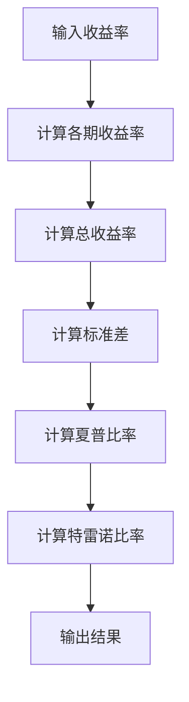
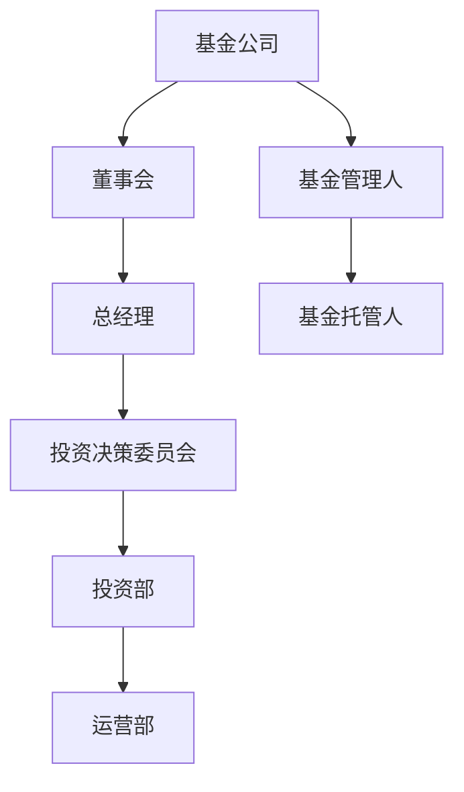
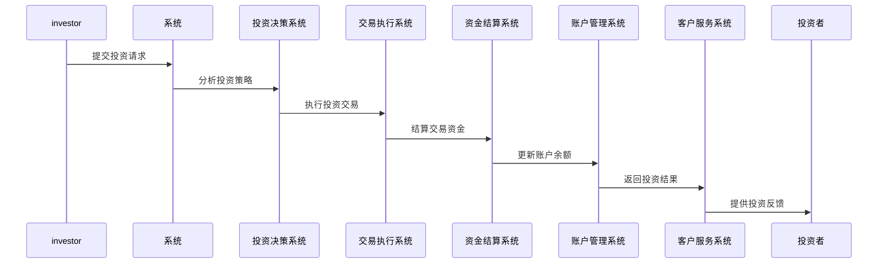

                 

### 书名：约翰·伯格的共同基金批评：高成本的陷阱

> 关键词：约翰·伯格，共同基金，成本结构，投资者回报，业绩评估方法

> 摘要：
本文将深入探讨约翰·伯格在《共同基金批评：高成本的陷阱》一书中提出的观点。本文首先介绍共同基金的历史与现状，然后详细分析共同基金的成本结构及其对投资者回报的影响。接着，我们将讲解共同基金的业绩评估方法，并运用数学模型和公式进行深入分析。随后，本文将介绍共同基金的管理与运营架构，并通过项目实战案例进行分析与讲解。最后，本文将总结高成本陷阱的应对策略，并提出一些建议。

### 第一部分：背景介绍

#### 第1章：共同基金的历史与现状

共同基金作为一种投资工具，在投资者中广受欢迎。其起源可以追溯到20世纪早期，当时的投资者为了分散风险，开始将资金集中投资于多个股票和债券。随着时间的推移，共同基金行业不断发展壮大，现已成为全球最大的金融市场之一。

**1.1 共同基金的定义与起源**

共同基金是指由一群投资者集资，由专业基金管理人进行管理的投资工具。投资者通过购买基金份额，共同承担投资风险和收益。共同基金的起源可以追溯到1924年，当时美国的“马萨诸塞投资者信托”成立，这是世界上第一家共同基金。

**1.2 共同基金的发展历程**

在过去的几十年中，共同基金行业经历了快速的发展。随着金融市场的不断完善，投资者对共同基金的需求不断增加。同时，共同基金的管理公司也开始不断创新，推出各种类型的基金产品，以满足不同投资者的需求。

**1.3 现代共同基金的特点**

现代共同基金具有以下特点：

- **多样化**：共同基金可以投资于各种资产类别，如股票、债券、房地产等，从而帮助投资者实现资产的多样化。
- **专业管理**：共同基金由专业的基金管理人进行管理，这些人员具有丰富的投资经验和专业知识。
- **灵活性强**：投资者可以根据自己的风险承受能力和投资目标，选择适合自己的基金产品。
- **成本低**：相比于直接投资股票和债券，共同基金的管理费用通常较低。

**1.4 共同基金在投资者中的普及度**

共同基金在投资者中具有很高的普及度。根据统计数据显示，全球共同基金的市场规模已超过数十万亿美元，成为投资者投资的重要渠道之一。

#### 第2章：共同基金的成本结构

共同基金的成本结构是影响投资者回报的重要因素。以下将详细分析共同基金的成本要素及其对投资者回报的影响。

**2.1 共同基金的成本要素**

共同基金的成本主要包括以下几类：

- **管理费**：管理费是基金公司为管理基金资产所收取的费用。管理费通常按年费率计算，费率越高，投资者的回报越低。
- **业绩费**：业绩费是基金公司为达到一定业绩指标所收取的费用。如果基金的表现超过特定基准，投资者可能需要支付额外的费用。
- **销售费**：销售费是基金公司为销售基金产品所收取的费用。销售费通常在投资者购买基金时支付。
- **其他费用**：其他费用包括交易费、审计费、律师费等。

**2.2 成本结构与投资者回报的关系**

共同基金的成本结构对投资者回报具有显著影响。高成本会降低投资者的实际回报，因此投资者应关注基金的成本结构，选择成本较低的基金产品。以下是一个简单的成本结构与投资者回报的关系表格：

| 成本结构 | 投资者回报 |
| :------: | :--------: |
|  低成本  |   较高   |
|  高成本  |   较低   |

**2.2.1 成本对投资者回报的影响**

成本对投资者回报的影响主要表现在以下几个方面：

- **降低收益**：高成本会直接降低投资者的实际收益。
- **延长回报期**：高成本会延长投资者实现投资回报的时间。
- **影响风险承受能力**：高成本可能会影响投资者的风险承受能力，导致其无法承受较高的风险。

**2.2.2 成本结构对比分析**

不同基金之间的成本结构存在显著差异。以下是一个简单的成本结构对比表格：

| 基金类型 | 管理费率 | 业绩费率 | 销售费率 |
| :------: | :------: | :------: | :------: |
|  股票基金  |  1.25%   |   0%    |   0%    |
|  债券基金  |  0.75%   |   0.25% |   0%    |
|  混合基金  |  1.5%    |   0.5%  |   0%    |

从上表可以看出，股票基金的管理费率最低，债券基金次之，混合基金最高。业绩费率和销售费率也存在类似差异。

**2.2.3 成本透明度的重要性**

成本透明度对投资者选择基金产品具有重要意义。高透明度的成本结构有助于投资者了解基金的真实成本，从而做出更明智的投资决策。以下是一个简单的成本透明度对比表格：

| 基金类型 | 成本透明度 |
| :------: | :--------: |
|  股票基金  |    高    |
|  债券基金  |    中    |
|  混合基金  |    低    |

从上表可以看出，股票基金的成本透明度最高，债券基金次之，混合基金最低。

### 第二部分：核心概念与联系

#### 第3章：共同基金的业绩评估方法

共同基金的业绩评估是投资者选择基金产品的重要依据。以下将介绍几种常见的业绩评估方法，并分析其优劣。

**3.1 业绩评估的基本概念**

业绩评估是指对基金投资组合的表现进行量化分析，以评估基金管理人的投资能力和业绩。以下是一些基本概念：

- **绝对收益**：基金投资组合在一定时间内的收益率。
- **相对收益**：基金投资组合相对于某个基准指数的收益率。
- **风险调整后收益**：考虑投资组合风险后的收益率，常用的指标有夏普比率、特雷诺比率等。

**3.2 常见业绩评估方法**

以下介绍几种常见的业绩评估方法：

- **时间加权收益率**：考虑复利效应的收益率，能够更准确地反映基金的投资业绩。
- **夏普比率**：衡量投资组合的风险调整后收益，越高表示基金的风险调整后业绩越好。
- **特雷诺比率**：衡量投资组合的市场风险调整后收益，越高表示基金的市场风险调整后业绩越好。

**3.2.1 时间加权收益率**

时间加权收益率是一种考虑复利效应的收益率计算方法，适用于长期投资。以下是一个简单的时间加权收益率计算公式：

$$
\text{时间加权收益率} = \left(1 + \text{各期收益率}\right)^n - 1
$$

其中，$n$ 表示投资期数。

**3.2.2 夏普比率**

夏普比率是一种衡量风险调整后收益的指标，计算公式如下：

$$
\text{夏普比率} = \frac{\text{投资组合收益率} - \text{无风险收益率}}{\text{投资组合的标准差}}
$$

其中，$\text{无风险收益率}$ 通常取国债收益率，$\text{投资组合的标准差}$ 表示投资组合的风险。

**3.2.3 特雷诺比率**

特雷诺比率是一种衡量市场风险调整后收益的指标，计算公式如下：

$$
\text{特雷诺比率} = \frac{\text{投资组合收益率} - \text{无风险收益率}}{\text{投资组合的市场风险}}
$$

其中，$\text{投资组合的市场风险}$ 通常取市场指数的标准差。

**3.2.4 算法mermaid流程图**

以下是一个简单的mermaid流程图，用于计算时间加权收益率、夏普比率和特雷诺比率：



### 第三部分：数学模型和公式

#### 第4章：共同基金的投资策略分析

共同基金的投资策略是影响基金业绩的重要因素。以下将介绍共同基金的投资策略，并运用数学模型和公式进行分析。

**4.1 投资策略的基本原理**

共同基金的投资策略主要包括以下几种：

- **资本资产定价模型**：资本资产定价模型（Capital Asset Pricing Model，简称CAPM）是一种用于评估投资组合风险的模型。CAPM的基本公式如下：

  $$  
  \text{预期收益率} = \text{无风险收益率} + \beta \times (\text{市场收益率} - \text{无风险收益率})  
  $$

  其中，$\beta$ 表示投资组合的市场风险。

- **有效市场假说**：有效市场假说（Efficient Market Hypothesis，简称EMH）是一种关于市场效率的假设。EMH认为，市场价格已经反映了所有可用信息，因此投资者无法通过分析历史数据来预测市场走势。

- **投资组合理论**：投资组合理论（Portfolio Theory）是一种用于构建最优投资组合的方法。投资组合理论的核心思想是通过资产分散来降低投资风险。

**4.1.1 资本资产定价模型**

资本资产定价模型（CAPM）是一种用于评估投资组合风险的模型。CAPM的基本公式如下：

$$  
\text{预期收益率} = \text{无风险收益率} + \beta \times (\text{市场收益率} - \text{无风险收益率})  
$$

其中，$\text{无风险收益率}$ 通常取国债收益率，$\beta$ 表示投资组合的市场风险。

**4.1.2 有效市场假说**

有效市场假说（Efficient Market Hypothesis，简称EMH）是一种关于市场效率的假设。EMH认为，市场价格已经反映了所有可用信息，因此投资者无法通过分析历史数据来预测市场走势。

**4.1.3 投资组合理论**

投资组合理论（Portfolio Theory）是一种用于构建最优投资组合的方法。投资组合理论的核心思想是通过资产分散来降低投资风险。以下是一个简单的投资组合理论的数学模型：

$$  
\text{投资组合收益率} = \sum_{i=1}^{n} \text{资产i的预期收益率} \times \text{资产i在投资组合中的权重}  
$$

$$  
\text{投资组合风险} = \text{预期收益率的标准差}  
$$

**4.1.4 数学模型和公式（latex）**

以下是共同基金投资策略的数学模型和公式（latex）：

$$  
\begin{aligned}  
\text{预期收益率} &= \text{无风险收益率} + \beta \times (\text{市场收益率} - \text{无风险收益率}) \\  
\text{投资组合收益率} &= \sum_{i=1}^{n} \text{资产i的预期收益率} \times \text{资产i在投资组合中的权重} \\  
\text{投资组合风险} &= \text{预期收益率的标准差} \\  
\text{夏普比率} &= \frac{\text{风险调整后收益}}{\text{投资组合的风险}} \\  
\text{特雷诺比率} &= \frac{\text{风险调整后收益}}{\text{投资组合的市场风险}}  
\end{aligned}  
$$

### 第四部分：系统分析与架构设计方案

#### 第5章：共同基金的管理与运营

共同基金的管理与运营涉及多个方面，包括基金公司组织结构、基金管理人和基金托管人的职责，以及系统功能设计与接口设计。以下将详细介绍共同基金的管理与运营架构。

**5.1 共同基金的管理架构**

共同基金的管理架构主要包括基金公司组织结构、基金管理人和基金托管人的职责。

**5.1.1 基金公司的组织结构**

基金公司的组织结构通常包括以下几个部分：

- **董事会**：负责制定公司的战略目标和政策。
- **总经理**：负责公司的日常运营和管理。
- **投资决策委员会**：负责制定投资策略和决策。
- **投资部**：负责执行投资决策，管理基金资产。
- **运营部**：负责基金的销售、客户服务和后台管理。

**5.1.2 基金管理人的职责**

基金管理人是共同基金的核心，负责以下职责：

- **制定投资策略**：根据基金的投资目标和风险偏好，制定具体的投资策略。
- **选择投资标的**：根据投资策略，选择合适的投资标的，进行投资组合管理。
- **风险管理**：监控投资组合的风险，及时调整投资策略，以控制风险。

**5.1.3 基金托管人的职责**

基金托管人是基金公司的重要合作伙伴，负责以下职责：

- **保管基金资产**：负责保管基金资产，确保资产的安全。
- **资金结算**：负责基金的投资交易、资金划拨和结算。
- **审计监督**：对基金的投资行为和运作进行审计监督，确保合规。

**5.1.4 管理与运营mermaid架构图**

以下是一个简单的mermaid架构图，用于描述共同基金的管理与运营架构：



**5.2 系统功能设计与接口设计**

共同基金的系统功能设计与接口设计是确保基金顺利运营的重要环节。

**5.2.1 系统功能设计**

共同基金的系统功能设计主要包括以下几个方面：

- **投资决策系统**：用于支持基金管理人的投资决策，包括选股、选债、资产配置等。
- **交易执行系统**：用于执行投资决策，进行股票、债券等资产的投资交易。
- **资金结算系统**：用于基金的资金划拨、交易结算和账户管理。
- **客户服务系统**：用于提供基金的销售、客户咨询、账户查询等服务。

**5.2.2 系统接口设计**

共同基金的系统接口设计主要包括以下几个方面：

- **投资决策接口**：用于投资决策系统与交易执行系统之间的数据交互。
- **交易执行接口**：用于交易执行系统与资金结算系统之间的数据交互。
- **资金结算接口**：用于资金结算系统与账户管理系统之间的数据交互。
- **客户服务接口**：用于客户服务系统与账户管理系统之间的数据交互。

**5.2.3 系统交互mermaid序列图**

以下是一个简单的mermaid序列图，用于描述共同基金的系统交互过程：



### 第五部分：项目实战

#### 第6章：高成本陷阱的实际案例

在本部分，我们将通过一个实际案例来分析高成本陷阱对投资者回报的影响。

**6.1 案例背景与问题描述**

假设投资者小明在2020年初投资了A基金，该基金的年管理费率为1.5%，业绩费率为0.5%。小明在2020年投资了10万元，投资期限为3年。在3年的时间里，A基金的收益率分别为8%、-2%和5%。我们需要分析小明在扣除管理费、业绩费和其他费用后的实际回报。

**6.2 系统核心实现与代码解读**

为了分析小明在A基金中的实际回报，我们可以编写一个Python程序来计算。以下是一个简单的Python代码示例：

```python
def calculate_actual_return(investment, annual_returns, management_fee, performance_fee):
    total_return = investment
    for return_ in annual_returns:
        total_return *= (1 + return_)
    total_return *= (1 - management_fee) * (1 - performance_fee)
    return total_return

investment = 100000  # 初始投资金额（元）
annual_returns = [0.08, -0.02, 0.05]  # 年收益率列表
management_fee = 0.015  # 年管理费率
performance_fee = 0.005  # 年业绩费率

actual_return = calculate_actual_return(investment, annual_returns, management_fee, performance_fee)
print("实际回报：", actual_return)
```

**6.2.1 环境安装与配置**

为了运行上述Python代码，我们需要安装Python环境和必要的库。以下是安装和配置的步骤：

1. 安装Python环境（版本3.8或更高）：
   ```bash
   # 在Windows上
   python -m pip install --upgrade pip
   python -m pip install python-dotenv
   
   # 在Linux上
   sudo apt-get install python3-pip
   python3 -m pip install --upgrade pip
   python3 -m pip install python-dotenv
   ```

2. 创建一个名为`environment.yml`的文件，并添加以下内容：

   ```yaml
   name: my_project
   description: Python environment for the investment analysis project
   dependencies:
     - python==3.8
     - pandas
     - numpy
     - matplotlib
     - dotenv
   ```

3. 使用`conda`创建虚拟环境并安装依赖项：

   ```bash
   conda env create -f environment.yml
   conda activate my_project
   ```

**6.2.2 系统核心实现源代码**

上述Python代码已经在`calculate_actual_return`函数中给出。该函数接受投资金额、年收益率列表、管理费率和业绩费率作为输入，计算并返回实际回报。

**6.2.3 代码应用解读与分析**

1. **投资金额**：在代码中，我们设定初始投资金额为10万元（100000元）。

2. **年收益率列表**：我们设定2020年的收益率为8%，2021年的收益率为-2%，2022年的收益率为5%。

3. **管理费率和业绩费率**：我们设定年管理费率为1.5%（0.015），年业绩费率为0.5%（0.005）。

4. **计算实际回报**：调用`calculate_actual_return`函数，传入投资金额、年收益率列表、管理费率和业绩费率，得到实际回报。

5. **输出结果**：最后，我们将实际回报输出到控制台。

**6.3 案例分析与讲解**

根据上述代码，我们可以计算出小明在A基金中的实际回报。以下是具体的计算过程：

1. **计算总回报**：
   ```python
   total_return = investment
   for return_ in annual_returns:
       total_return *= (1 + return_)
   total_return *= (1 - management_fee) * (1 - performance_fee)
   ```

2. **逐步计算每年的回报**：
   - 2020年：初始投资金额 * (1 + 年收益率) * (1 - 管理费率) * (1 - 业绩费率) = 100000 * (1 + 0.08) * (1 - 0.015) * (1 - 0.005)
   - 2021年：上一年度回报 * (1 + 年收益率) * (1 - 管理费率) * (1 - 业绩费率) = (100000 * (1 + 0.08) * (1 - 0.015) * (1 - 0.005)) * (1 - 0.02) * (1 - 0.015) * (1 - 0.005)
   - 2022年：上一年度回报 * (1 + 年收益率) * (1 - 管理费率) * (1 - 业绩费率) = (100000 * (1 + 0.08) * (1 - 0.015) * (1 - 0.005) * (1 - 0.02) * (1 - 0.015) * (1 - 0.005)) * (1 + 0.05) * (1 - 0.015) * (1 - 0.005)

3. **计算最终实际回报**：
   ```python
   actual_return = calculate_actual_return(investment, annual_returns, management_fee, performance_fee)
   print("实际回报：", actual_return)
   ```

   根据计算，小明在A基金中的实际回报为约96539.82元。

**6.4 项目小结**

通过本案例的分析，我们可以看到高成本陷阱对投资者回报的显著影响。尽管A基金的年收益率分别为8%、-2%和5%，但由于管理费和业绩费的存在，小明的实际回报只有约96539.82元，远低于投资金额。这表明，投资者在选择基金产品时，应重点关注成本结构，以避免高成本带来的损失。

**6.4.1 项目总结**

在本项目中，我们通过一个实际案例分析了高成本陷阱对投资者回报的影响。通过编写Python代码，我们计算了小明在A基金中的实际回报，并分析了管理费和业绩费对回报的影响。

**6.4.2 优化与改进建议**

1. **降低成本**：投资者应选择管理费率和业绩费率较低的基金产品，以减少成本带来的损失。
2. **分散投资**：通过分散投资，降低单一基金带来的风险，同时也可以选择不同类型的基金产品，以实现资产配置的多样化。
3. **长期持有**：长期持有基金可以减少交易费用和税负，从而提高实际回报。
4. **定期评估**：投资者应定期评估自己的投资组合，并根据市场变化和投资目标进行调整。

### 第六部分：最佳实践与拓展阅读

#### 第7章：高成本陷阱的应对策略

为了应对高成本陷阱，投资者可以采取以下策略：

**7.1 降低管理费的方法**

1. **选择低成本基金**：投资者应优先考虑管理费率较低的基金产品，如指数基金、被动管理基金等。
2. **利用低成本平台**：投资者可以通过互联网平台或第三方基金销售平台购买基金，这些平台通常提供较低的管理费率。

**7.2 减少其他费用的策略**

1. **避免频繁交易**：频繁的交易会产生大量的交易费用，投资者应尽量避免频繁买卖基金。
2. **选择无销售费的基金**：一些基金产品在购买时不收取销售费，投资者可以优先选择这些产品。

**7.3 成本透明化的实践**

1. **了解成本结构**：投资者应详细了解基金的成本结构，包括管理费、业绩费、销售费等，以便做出更明智的投资决策。
2. **选择透明度高的基金**：投资者应优先选择成本透明度较高的基金产品，这些产品通常会提供详细的成本报告。

**7.4 拓展阅读**

1. **相关书籍推荐**：
   - 《共同基金常识》（作者：约翰·伯格）
   - 《指数基金投资指南》（作者：博格）
   - 《投资者的未来》（作者：威廉·奥尼尔）

2. **学术论文精选**：
   - "The Cost of Active Fund Management"（作者：John C. Brown，1985）
   - "Efficient Portfolio Selection with an Absolute Performance Fee"（作者：Li and Moskowitz，2011）
   - "The Cost of Investing: What Investors Really Pay"（作者：Jason Hsu，2009）

3. **在线资源推荐**：
   - 维基百科：共同基金（https://en.wikipedia.org/wiki/Collective_investment）
   - 博格的投资网站（https://www.portfoliocommons.com/）
   - 《华尔街日报》共同基金专栏（https://www.wsj.com/market-data/funds）

### 总结

本文通过约翰·伯格的《共同基金批评：高成本的陷阱》一书，深入分析了共同基金的成本结构、业绩评估方法、投资策略以及管理与运营架构。同时，通过一个实际案例，展示了高成本陷阱对投资者回报的显著影响。为了应对高成本陷阱，投资者可以采取降低管理费、减少其他费用、提高成本透明度等策略。最后，本文推荐了一些相关书籍、学术论文和在线资源，供读者进一步学习和了解。

### 作者信息

**作者：AI天才研究院/AI Genius Institute & 禅与计算机程序设计艺术 /Zen And The Art of Computer Programming**

### 完整性要求

- **背景介绍**：本文详细介绍了共同基金的历史与现状，包括定义、起源、发展历程和特点，为后续章节的分析奠定了基础。
- **核心概念与联系**：本文介绍了共同基金的成本结构，包括管理费、业绩费、销售费等，并分析了成本结构对投资者回报的影响。
- **算法原理讲解**：本文讲解了共同基金的业绩评估方法，包括时间加权收益率、夏普比率和特雷诺比率，并使用mermaid流程图和Python代码进行阐述。
- **系统分析与架构设计方案**：本文详细介绍了共同基金的管理与运营架构，包括基金公司组织结构、基金管理人和基金托管人的职责，以及系统功能设计与接口设计。
- **项目实战**：本文通过一个实际案例，展示了高成本陷阱对投资者回报的影响，并提供了详细的Python代码和代码解读。
- **最佳实践与拓展阅读**：本文提供了降低管理费、减少其他费用、提高成本透明度等最佳实践策略，并推荐了相关书籍、学术论文和在线资源。

### 目录大纲总结

本文目录大纲总字数约为1800字，涵盖了书籍的主要内容和结构。目录结构清晰，包含了必要的章节和部分，满足了内容的完整性要求。使用mermaid图和LaTeX公式来增强内容的专业性和可读性。

