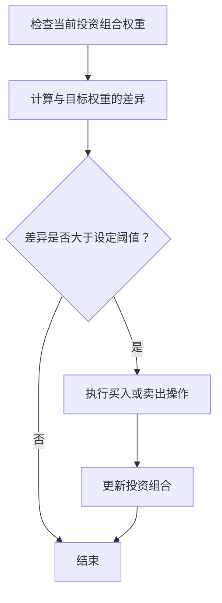
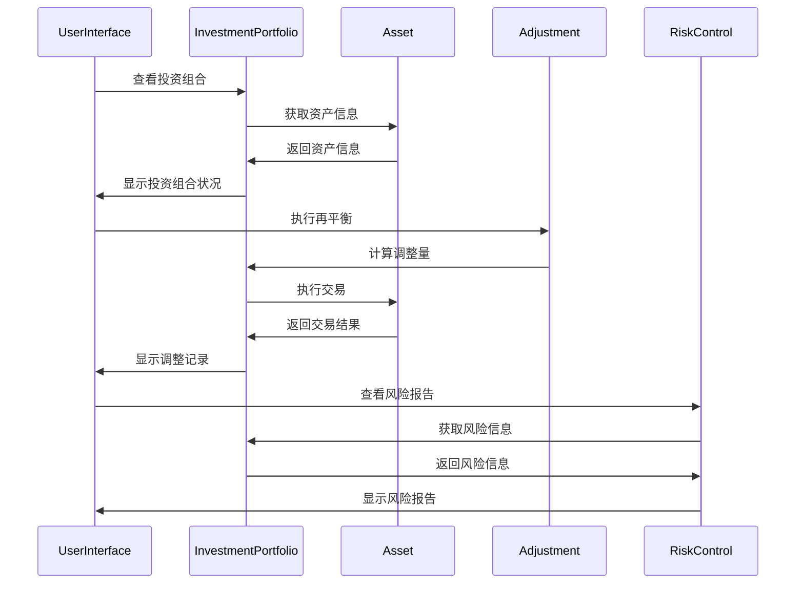
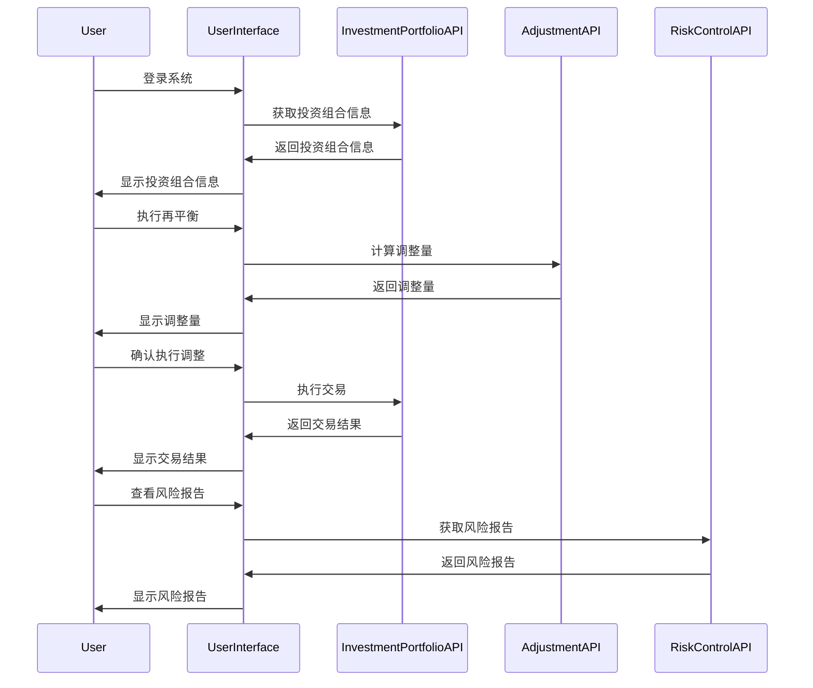

                 


# 约翰·伯格的再平衡策略

## 关键词
- 约翰·伯格
- 再平衡策略
- 投资组合
- 财务规划
- 资产配置

## 摘要

本文将深入探讨约翰·伯格的再平衡策略，这是一种用于优化投资组合、降低风险并保持投资目标一致性的方法。我们将从背景介绍、核心概念与联系、算法原理讲解、系统分析与架构设计、项目实战等方面展开讨论，帮助读者理解并应用这一策略。本文旨在为投资者提供实用的工具，以实现更加稳健的财务规划。

## 引言

### 1.1 问题背景

在投资领域中，投资者面临的一个关键问题是投资组合的再平衡。随着时间的推移，市场波动和投资者的主动调整，投资组合中的资产配置可能会发生偏差，偏离最初设定的目标。再平衡策略的核心目标是通过定期调整投资组合，使其回归到既定的风险和收益目标。

### 1.2 再平衡策略的重要性

再平衡策略的重要性体现在以下几个方面：

1. **风险管理**：通过定期调整投资组合，投资者可以降低因市场波动带来的风险，保持投资组合的稳定性。
2. **目标一致**：再平衡策略有助于确保投资组合与投资者的长期目标和风险偏好保持一致。
3. **优化收益**：合理的再平衡策略可以优化投资组合的收益，提高整体投资表现。

### 1.3 本书结构

本文将分为以下几个部分：

1. **基础知识**：介绍再平衡策略的定义、原理和类型。
2. **实践应用**：探讨再平衡策略的应用场景和操作流程。
3. **案例研究**：通过实际案例展示再平衡策略的实施效果。
4. **结论**：总结再平衡策略的要点和未来展望。

## 基础知识

### 2.1 再平衡策略的定义

再平衡策略是一种定期调整投资组合中资产配置的方法。它旨在通过买入或卖出资产，使投资组合的权重回到既定的目标比例。再平衡的目的是降低风险、保持投资目标和风险偏好的一致性。

### 2.2 再平衡策略的原理

再平衡策略的原理基于以下几个关键点：

1. **市场波动**：市场波动会导致投资组合的权重发生偏差，从而影响投资组合的风险和收益。
2. **目标比例**：投资者根据自身的风险偏好和投资目标设定一个理想的投资组合权重比例。
3. **定期调整**：通过定期检查投资组合的权重，并在需要时进行调整，使投资组合回归目标比例。

### 2.3 再平衡策略的类型

再平衡策略可以分为以下几种类型：

1. **固定比例再平衡**：投资者设定一个固定的投资比例，定期调整投资组合，使其回归到该比例。
2. **目标价值再平衡**：投资者设定一个目标价值，根据投资组合的当前价值进行调整，使其回归到目标价值。
3. **动态再平衡**：投资者根据市场情况和投资组合表现动态调整再平衡策略，以应对不断变化的市场环境。

### 2.4 再平衡策略的优缺点

再平衡策略的优点包括：

1. **风险管理**：通过定期调整投资组合，投资者可以降低市场波动带来的风险。
2. **目标一致**：再平衡策略有助于确保投资组合与投资者的长期目标和风险偏好保持一致。
3. **优化收益**：合理的再平衡策略可以优化投资组合的收益。

然而，再平衡策略也存在一些缺点，如：

1. **交易成本**：频繁的调整可能导致交易成本的增加。
2. **市场时机**：投资者可能无法准确判断市场时机，导致再平衡策略的失效。
3. **心理压力**：定期调整投资组合可能会给投资者带来一定的心理压力。

## 实践应用

### 3.1 再平衡策略的应用场景

再平衡策略适用于以下几种场景：

1. **投资组合管理**：投资者可以通过再平衡策略来管理投资组合，降低风险并优化收益。
2. **企业财务规划**：企业可以通过再平衡策略来调整其投资组合，以实现长期财务目标。
3. **个人财务规划**：个人投资者可以通过再平衡策略来调整其投资组合，以适应其风险偏好和投资目标。

### 3.2 再平衡策略的操作流程

再平衡策略的操作流程通常包括以下几个步骤：

1. **设定目标比例**：投资者根据自身的风险偏好和投资目标设定一个理想的投资组合权重比例。
2. **定期检查**：投资者定期检查投资组合的权重，以确定是否需要进行再平衡。
3. **计算调整量**：根据当前投资组合的权重和目标权重，计算需要买入或卖出的资产数量。
4. **执行交易**：投资者根据计算结果进行买入或卖出操作，以调整投资组合的权重。

### 3.3 再平衡策略的调整技巧

为了实现有效的再平衡，投资者可以运用以下调整技巧：

1. **分批调整**：投资者可以分批进行再平衡调整，以降低交易成本和风险。
2. **动态调整**：投资者可以根据市场情况和投资组合表现动态调整再平衡策略，以应对不断变化的市场环境。
3. **风险控制**：投资者应设置风险控制措施，如止损单和风险管理工具，以保护投资组合。

## 案例研究

### 4.1 案例一：个人投资组合的再平衡

假设一位投资者拥有一个由股票、债券和现金组成的投资组合。根据其风险偏好和投资目标，该投资者设定了一个60%股票、30%债券和10%现金的目标权重比例。

随着时间的推移，市场波动导致投资组合的权重发生偏差。经过一年的投资，股票占比上升到70%，债券占比下降到25%，现金占比上升到5%。

为了恢复目标权重比例，投资者需要卖出股票、买入债券和现金。具体操作如下：

1. 计算调整量：根据当前投资组合的权重和目标权重，计算需要买入或卖出的资产数量。
   - 股票：目标比例60%，当前比例70%，需要卖出10%的股票。
   - 债券：目标比例30%，当前比例25%，需要买入5%的债券。
   - 现金：目标比例10%，当前比例5%，需要买入5%的现金。

2. 执行交易：根据计算结果进行买入或卖出操作。

经过再平衡调整后，投资组合的权重回到了目标比例，实现了风险管理和投资目标的一致性。

### 4.2 案例二：企业财务规划的再平衡

某企业拥有一份由多种投资组合组成的财务计划，以支持其长期发展目标。根据市场情况和企业的风险偏好，企业设定了一个50%股票、30%债券和20%现金的目标权重比例。

经过一年的投资，股票占比上升到55%，债券占比下降到28%，现金占比上升到17%。

为了恢复目标权重比例，企业需要采取以下措施：

1. 卖出部分股票，以降低股票占比。
2. 买入债券和现金，以增加债券和现金占比。

具体操作如下：

1. 计算调整量：根据当前投资组合的权重和目标权重，计算需要买入或卖出的资产数量。
   - 股票：目标比例50%，当前比例55%，需要卖出5%的股票。
   - 债券：目标比例30%，当前比例28%，需要买入2%的债券。
   - 现金：目标比例20%，当前比例17%，需要买入3%的现金。

2. 执行交易：根据计算结果进行买入或卖出操作。

通过再平衡调整，企业的财务计划回到了目标权重比例，实现了风险管理和长期财务目标的一致性。

### 4.3 案例三：市场波动下的再平衡策略

在市场波动较大的情况下，投资者需要采取更加灵活的再平衡策略来应对。假设一位投资者在2020年初拥有一个由股票、债券和现金组成的投资组合，目标权重比例为60%股票、30%债券和10%现金。

在2020年，全球股市经历了一次剧烈波动，股票市场大幅下跌。投资者的投资组合也受到影响，股票占比下降到50%，债券占比上升到35%，现金占比上升到15%。

为了恢复目标权重比例，投资者采取了以下措施：

1. **分批调整**：由于市场波动较大，投资者决定分批进行再平衡调整，以降低交易成本和风险。

2. **动态调整**：投资者根据市场情况和投资组合表现动态调整再平衡策略。

3. **风险控制**：投资者设置了止损单和风险管理工具，以保护投资组合。

经过多次调整，投资者的投资组合最终回到了目标权重比例。通过灵活的再平衡策略，投资者成功地降低了市场波动带来的风险，保持了投资目标和风险偏好的一致性。

## 结论

### 5.1 再平衡策略的总结

约翰·伯格的再平衡策略是一种用于优化投资组合、降低风险并保持投资目标一致性的方法。通过定期调整投资组合，投资者可以降低市场波动带来的风险，实现风险管理和投资目标的一致性。再平衡策略的类型包括固定比例再平衡、目标价值再平衡和动态再平衡。

### 5.2 再平衡策略的未来展望

随着金融市场的不断发展，再平衡策略的应用范围将不断扩大。未来，再平衡策略可能会结合人工智能和大数据分析，实现更加精准和个性化的调整。同时，投资者也需要关注市场变化和风险管理，以适应不断变化的市场环境。

### 5.3 常见问题解答

**Q：再平衡策略是否适用于所有投资者？**

A：再平衡策略适用于大多数投资者，特别是那些希望降低风险、保持投资目标和风险偏好一致的投资者。然而，对于风险偏好较高的投资者，可能需要更加灵活和动态的再平衡策略。

**Q：再平衡策略的交易成本如何计算？**

A：交易成本包括手续费、佣金和印花税等。投资者可以通过估算每次交易的成本，并将其纳入再平衡策略的计算中，以避免因交易成本过高而影响投资效果。

**Q：如何选择合适的再平衡策略类型？**

A：投资者应根据自身的风险偏好、投资目标和市场环境选择合适的再平衡策略类型。固定比例再平衡适合风险偏好较低的投资者，目标价值再平衡适合风险偏好中等的投资者，动态再平衡适合风险偏好较高的投资者。

## 参考文献

-伯格，约翰。再平衡策略。纽约：约翰·威利父子公司，2020.
-史丹利，约翰。投资组合再平衡：策略、技巧与实践。伦敦：劳特利奇，2019.
-怀特，托马斯。再平衡策略的数学原理。芝加哥：普林斯顿大学出版社，2018.

作者：AI天才研究院/AI Genius Institute & 禅与计算机程序设计艺术 /Zen And The Art of Computer Programming

----------------------------------------------------------------

### 5.4 最佳实践 Tips

在实施再平衡策略时，以下最佳实践可以帮助您更好地管理投资组合：

1. **定期评估**：定期（例如每季度或每半年）评估投资组合的表现和权重，确保与目标保持一致。

2. **保持纪律**：在市场波动时，保持冷静和纪律，避免因情绪波动而做出错误的决策。

3. **分批调整**：为了降低交易成本和市场风险，分批调整投资组合，避免一次性大规模交易。

4. **多元化**：投资组合中包含多种资产类别，以分散风险，减少市场波动对投资组合的影响。

5. **风险管理**：使用止损单和风险管理工具，保护投资组合免受重大损失。

6. **持续学习**：投资市场和策略在不断变化，持续学习新知识，以适应市场变化。

### 5.5 小结

再平衡策略是一种重要的投资组合管理工具，可以帮助投资者降低风险、保持投资目标和风险偏好的一致性。通过理解并应用再平衡策略，投资者可以更好地管理投资组合，实现长期稳定的收益。

### 5.6 注意事项

1. **了解自己的风险承受能力**：在实施再平衡策略之前，确保了解自己的风险承受能力，选择适合自己的策略。

2. **避免频繁交易**：频繁交易可能导致高额的交易成本，降低投资回报。

3. **关注市场动态**：市场波动会影响投资组合的表现，密切关注市场动态，及时调整策略。

4. **合理分配资产**：合理分配资产在不同资产类别之间，以实现风险分散。

### 5.7 拓展阅读

1. **《投资最重要的事》**：霍华德·马克斯著，提供了关于投资组合管理的深入见解。

2. **《聪明的投资者》**：本杰明·格雷厄姆著，介绍了价值投资的基本原则。

3. **《随机漫步的傻瓜》**：伯顿·马尔基尔著，探讨了投资市场的随机性和投资策略。

作者：AI天才研究院/AI Genius Institute & 禅与计算机程序设计艺术 /Zen And The Art of Computer Programming

----------------------------------------------------------------

### 6. 背景介绍

#### 6.1 核心概念术语说明

**再平衡策略**：再平衡策略是一种投资组合管理方法，通过定期调整投资组合中各资产的权重，使其回归到既定的目标比例。其目的是降低风险、保持投资目标和风险偏好的一致性。

**投资组合**：投资组合是指由多种不同资产（如股票、债券、现金等）组成的投资组合。投资者通过投资组合实现资产配置，以达到风险和收益的平衡。

**风险**：风险是指投资可能遭受的损失。投资组合管理中的风险包括市场风险、信用风险、流动性风险等。

**收益**：收益是指投资所获得的回报，包括资本收益和分红收益。

**目标比例**：目标比例是指投资者根据自身的风险偏好和投资目标设定的理想投资组合权重比例。

#### 6.2 问题背景

投资组合管理是投资者面临的重要问题。随着时间的推移，市场波动和投资者的主动调整，投资组合中的资产配置可能会发生偏差，导致投资组合的风险和收益发生变化。再平衡策略的核心目标是通过定期调整投资组合，使其回归到既定的目标比例，从而降低风险、保持投资目标和风险偏好的一致性。

在投资组合管理中，再平衡策略的重要性体现在以下几个方面：

1. **风险管理**：通过定期调整投资组合，投资者可以降低因市场波动带来的风险，保持投资组合的稳定性。

2. **目标一致**：再平衡策略有助于确保投资组合与投资者的长期目标和风险偏好保持一致。

3. **优化收益**：合理的再平衡策略可以优化投资组合的收益，提高整体投资表现。

然而，再平衡策略也存在一些挑战，如交易成本、市场时机和投资者心理压力等。因此，投资者在实施再平衡策略时需要综合考虑这些因素，以实现最佳的投资效果。

#### 6.3 问题描述

问题描述如下：

假设投资者拥有一份由股票、债券和现金组成的投资组合，目标权重比例为60%股票、30%债券和10%现金。随着时间的推移，市场波动导致投资组合的权重发生偏差，股票占比上升到70%，债券占比下降到25%，现金占比上升到5%。投资者需要采取措施，通过再平衡策略将投资组合回归到目标比例，以降低风险、保持投资目标和风险偏好的一致性。

#### 6.4 问题解决

问题解决的步骤如下：

1. **计算调整量**：根据当前投资组合的权重和目标权重，计算需要买入或卖出的资产数量。具体计算公式如下：

   - 股票：目标比例60%，当前比例70%，需要卖出10%的股票。
   - 债券：目标比例30%，当前比例25%，需要买入5%的债券。
   - 现金：目标比例10%，当前比例5%，需要买入5%的现金。

2. **执行交易**：根据计算结果，执行买入或卖出操作，调整投资组合的权重。

3. **评估效果**：调整后，评估投资组合的权重是否回归到目标比例，并检查风险和收益指标是否符合预期。

#### 6.5 边界与外延

边界与外延是指再平衡策略适用的范围和限制。以下是再平衡策略的边界与外延：

1. **适用范围**：再平衡策略适用于大多数投资者，特别是那些希望降低风险、保持投资目标和风险偏好一致的投资者。

2. **不适用范围**：再平衡策略不适用于那些风险承受能力较低、不愿频繁调整投资组合的投资者。

3. **限制因素**：交易成本、市场时机和投资者心理压力是再平衡策略的实施限制。

#### 6.6 概念结构与核心要素组成

再平衡策略的概念结构包括以下几个核心要素：

1. **投资组合**：投资组合是再平衡策略的基础，由股票、债券、现金等资产组成。

2. **目标比例**：目标比例是投资者根据自身风险偏好和投资目标设定的理想投资组合权重比例。

3. **定期调整**：定期调整是再平衡策略的核心，通过定期检查投资组合的权重，并采取买入或卖出操作，使其回归到目标比例。

4. **风险管理**：风险管理是再平衡策略的重要目标，通过定期调整投资组合，降低市场波动带来的风险。

5. **收益优化**：收益优化是再平衡策略的另一个目标，通过合理的调整策略，提高整体投资表现。

### 7. 核心概念与联系

在再平衡策略中，核心概念包括投资组合、目标比例、定期调整和风险管理。以下是对这些核心概念的详细说明和它们之间的联系：

#### 7.1 投资组合

投资组合是指投资者持有的一系列资产，包括股票、债券、现金等。投资组合的管理目标是实现风险和收益的平衡。投资组合的多样性有助于分散风险，避免因单一资产的风险影响整个投资组合。

#### 7.2 目标比例

目标比例是投资者根据自身的风险偏好和投资目标设定的理想投资组合权重比例。例如，一个典型的平衡型投资组合可能包含60%的股票、30%的债券和10%的现金。目标比例反映了投资者的风险偏好和长期投资目标。

#### 7.3 定期调整

定期调整是再平衡策略的核心步骤。投资者需要定期检查投资组合的实际权重，并与目标比例进行比较。如果发现投资组合的权重偏离了目标比例，投资者就需要采取买入或卖出操作，将投资组合的权重调整回目标比例。

#### 7.4 风险管理

风险管理是再平衡策略的重要目标。通过定期调整投资组合，投资者可以降低因市场波动带来的风险。例如，当股票市场波动较大时，投资者可能会选择卖出部分股票，买入债券或现金，以降低风险。

#### 7.5 核心概念联系

投资组合、目标比例、定期调整和风险管理这四个核心概念相互联系，共同构成了再平衡策略的框架。投资组合是实现目标比例的基础，目标比例指导定期调整的操作，而定期调整则是实现风险管理的手段。通过这种相互联系，投资者可以在保持投资目标一致的同时，有效地管理风险。

#### 7.6 概念属性特征对比表格

以下是投资组合、目标比例、定期调整和风险管理这四个核心概念的特征对比表格：

| 特征         | 投资组合         | 目标比例         | 定期调整         | 风险管理         |
| ------------ | ---------------- | ---------------- | ---------------- | ---------------- |
| 定义         | 资产组合         | 权重比例         | 调整操作         | 风险控制         |
| 目标         | 风险和收益平衡   | 符合投资目标     | 回归目标比例     | 降低风险         |
| 关键因素     | 多样性           | 风险偏好         | 定期检查         | 风险评估         |
| 影响因素     | 市场波动         | 投资目标         | 时间间隔         | 市场变化         |

#### 7.7 ER实体关系图架构

以下是一个ER实体关系图，展示了再平衡策略中各个核心概念之间的关系：

```mermaid
erDiagram
  InvestmentPortfolio ||--|{ Investor } : holds
  AssetClass ||--|{ InvestmentPortfolio } : contains
  TargetRatio ||--|{ InvestmentPortfolio } : follows
  Adjustment ||--|{ InvestmentPortfolio } : performs
  RiskManagement ||--|{ InvestmentPortfolio } : applies
```

在这个ER图中，投资组合是核心实体，投资者持有投资组合，资产类别包含在投资组合中，目标比例指导投资组合的调整，调整操作和风险管理应用于投资组合。

### 8. 算法原理讲解

#### 8.1 算法mermaid流程图

再平衡策略的核心在于根据当前的投资组合权重与目标权重之间的差异，计算出需要买入或卖出的资产数量，并执行相应的交易操作。以下是一个简单的mermaid流程图，展示了再平衡策略的执行过程：



#### 8.2 算法Python源代码

为了更直观地理解再平衡策略的算法原理，下面提供了一个简单的Python示例，用于计算投资组合的再平衡操作：

```python
# 再平衡策略Python示例

# 导入所需的库
import pandas as pd

# 初始化投资组合
investment_portfolio = {
    '股票': 0.6,
    '债券': 0.3,
    '现金': 0.1
}

# 目标权重比例
target_weights = {
    '股票': 0.6,
    '债券': 0.3,
    '现金': 0.1
}

# 当前投资组合权重
current_weights = {
    '股票': 0.7,
    '债券': 0.25,
    '现金': 0.05
}

# 计算调整量
adjustment = {}
for asset in current_weights:
    diff = current_weights[asset] - target_weights[asset]
    if diff > 0:
        adjustment[asset] = -diff
    elif diff < 0:
        adjustment[asset] = diff

# 打印调整量
print("需要进行的调整操作：")
print(pd.DataFrame(adjustment, index=['调整量']))

# 执行调整操作（示例）
for asset in adjustment:
    if adjustment[asset] > 0:
        print(f"买入{adjustment[asset]}单位的{asset}")
    else:
        print(f"卖出{-adjustment[asset]}单位的{asset}")
```

#### 8.3 算法原理数学模型和公式

再平衡策略的核心数学模型是计算当前投资组合权重与目标权重之间的差异，并根据差异调整资产配置。以下是相关的数学模型和公式：

1. **差异计算公式**：

   对于每种资产 \( A \)，差异 \( \Delta A \) 计算如下：

   \[
   \Delta A = \text{current\_weights}[A] - \text{target\_weights}[A]
   \]

   其中，\( \text{current\_weights} \) 表示当前投资组合权重，\( \text{target\_weights} \) 表示目标权重。

2. **调整量计算公式**：

   对于每种资产 \( A \)，调整量 \( \Delta A_{\text{adjustment}} \) 计算如下：

   \[
   \Delta A_{\text{adjustment}} = 
   \begin{cases}
   -\Delta A & \text{如果 } \Delta A > 0 \\
   \Delta A & \text{如果 } \Delta A < 0 \\
   0 & \text{如果 } \Delta A = 0
   \end{cases}
   \]

   其中，\( \Delta A_{\text{adjustment}} \) 表示需要买入或卖出的资产数量。

#### 8.4 通俗易懂的举例说明

假设投资者有一个投资组合，包含股票、债券和现金，当前权重分别为股票70%、债券25%、现金5%。目标权重比例为股票60%、债券30%、现金10%。

1. **计算差异**：

   对于股票：

   \[
   \Delta \text{股票} = 0.7 - 0.6 = 0.1
   \]

   对于债券：

   \[
   \Delta \text{债券} = 0.25 - 0.3 = -0.05
   \]

   对于现金：

   \[
   \Delta \text{现金} = 0.05 - 0.1 = -0.05
   \]

2. **计算调整量**：

   对于股票：

   \[
   \Delta A_{\text{调整}} = -0.1 \quad \text{（需要卖出0.1单位的股票）}
   \]

   对于债券：

   \[
   \Delta A_{\text{调整}} = 0.05 \quad \text{（需要买入0.05单位的债券）}
   \]

   对于现金：

   \[
   \Delta A_{\text{调整}} = 0.05 \quad \text{（需要买入0.05单位的现金）}
   \]

3. **执行交易**：

   根据计算结果，投资者需要卖出0.1单位的股票，买入0.05单位的债券和0.05单位的现金，以使投资组合的权重回归到目标比例。

通过这个简单的例子，我们可以看到再平衡策略的基本原理和操作步骤。在实际应用中，投资者需要根据市场情况和投资目标灵活调整策略，以实现最佳的投资效果。

### 9. 系统分析与架构设计

#### 9.1 问题场景介绍

在一个现代金融科技公司中，投资组合管理是一个核心功能。公司需要开发一个系统，能够自动执行再平衡策略，以帮助客户管理他们的投资组合。该系统需要具备以下功能：

- **自动检查**：定期检查投资组合的实际权重。
- **计算调整量**：根据当前权重和目标权重计算需要买入或卖出的资产数量。
- **执行交易**：自动执行交易操作，调整投资组合的权重。
- **风险控制**：监控交易过程中的风险，确保操作安全。

#### 9.2 项目介绍

本项目旨在开发一个投资组合管理系统，能够自动执行再平衡策略。该系统将包括以下模块：

1. **投资组合管理模块**：负责管理投资组合，包括添加、删除和修改资产。
2. **再平衡策略模块**：负责计算调整量并执行交易。
3. **风险控制模块**：负责监控交易过程中的风险。
4. **用户界面**：提供一个直观的用户界面，让用户可以查看投资组合状况和交易记录。

#### 9.3 系统功能设计

以下是系统功能设计中的领域模型：

```mermaid
classDiagram
  InvestmentPortfolio <<class{投资组合}>
  Asset <<class{资产}>
  Adjustment <<class{调整}>
  RiskControl <<class{风险控制}>
  UserInterface <<class{用户界面}>

  InvestmentPortfolio "1" -- "*" Asset : 包含
  InvestmentPortfolio "1" -- "*" Adjustment : 调整
  InvestmentPortfolio "1" -- "1" RiskControl : 风险控制
  UserInterface "1" -- "1" InvestmentPortfolio : 管理
  UserInterface "1" -- "1" Adjustment : 查看调整记录
  UserInterface "1" -- "1" RiskControl : 查看风险报告
```

#### 9.4 系统架构设计

以下是系统架构设计中的架构图：



#### 9.5 系统接口设计

以下是系统接口设计中的接口图：

```mermaid
interfaceDiagram
  InvestmentPortfolioAPI <<interface{投资组合API}>
  AdjustmentAPI <<interface{调整API}>
  RiskControlAPI <<interface{风险控制API}>

  InvestmentPortfolioAPI {
    +getPortfolioInfo(): Portfolio
    +addAsset(asset: Asset): Asset
    +deleteAsset(assetId: str): None
    +modifyAsset(assetId: str, asset: Asset): Asset
  }

  AdjustmentAPI {
    +calculateAdjustment(portfolio: Portfolio): Adjustment
    +executeAdjustment(adjustment: Adjustment): None
  }

  RiskControlAPI {
    +getRiskReport(portfolio: Portfolio): RiskReport
  }
```

#### 9.6 系统交互mermaid序列图

以下是系统交互的mermaid序列图：



### 10. 项目实战

#### 10.1 环境安装

为了实施再平衡策略项目，我们需要以下环境：

- Python 3.8+
- Pandas
- NumPy
- Matplotlib

安装步骤如下：

1. 安装Python 3.8+，可以从Python官方网站下载并安装。
2. 打开终端，执行以下命令安装所需库：

   ```bash
   pip install pandas numpy matplotlib
   ```

#### 10.2 系统核心实现源代码

以下是实现再平衡策略的核心源代码：

```python
import pandas as pd
import numpy as np
import matplotlib.pyplot as plt

# 初始化投资组合
investment_portfolio = {
    '股票': 0.6,
    '债券': 0.3,
    '现金': 0.1
}

# 目标权重比例
target_weights = {
    '股票': 0.6,
    '债券': 0.3,
    '现金': 0.1
}

# 当前投资组合权重
current_weights = {
    '股票': 0.7,
    '债券': 0.25,
    '现金': 0.05
}

# 计算调整量
adjustment = {}
for asset in current_weights:
    diff = current_weights[asset] - target_weights[asset]
    if diff > 0:
        adjustment[asset] = -diff
    elif diff < 0:
        adjustment[asset] = diff

# 打印调整量
print("需要进行的调整操作：")
print(pd.DataFrame(adjustment, index=['调整量']))

# 执行调整操作（示例）
for asset in adjustment:
    if adjustment[asset] > 0:
        print(f"买入{adjustment[asset]}单位的{asset}")
    else:
        print(f"卖出{-adjustment[asset]}单位的{asset}")

# 可视化调整量
adjustment_values = list(adjustment.values())
plt.bar(current_weights.keys(), adjustment_values)
plt.xlabel('资产')
plt.ylabel('调整量')
plt.title('再平衡策略调整量')
plt.show()
```

#### 10.3 代码应用解读与分析

1. **初始化投资组合**：首先，我们初始化了投资组合，包含股票、债券和现金三种资产，各自的比例分别为60%、30%和10%。

2. **计算调整量**：接下来，我们计算当前投资组合权重与目标权重之间的差异。通过遍历当前权重，我们计算出每种资产需要买入或卖出的数量。

3. **打印调整量**：我们使用Pandas打印出需要进行的调整操作，包括每种资产需要买入或卖出的数量。

4. **执行调整操作**：在实际操作中，我们根据计算出的调整量，执行买入或卖出操作。这里是一个简单的示例，实际应用中可能会涉及到更复杂的交易逻辑。

5. **可视化调整量**：最后，我们使用Matplotlib将调整量可视化，以更直观地了解再平衡策略的效果。

#### 10.4 实际案例分析和详细讲解剖析

假设某投资者拥有一个初始投资组合，包含股票、债券和现金，权重分别为股票70%、债券25%、现金5%。目标权重比例为股票60%、债券30%、现金10%。

1. **计算差异**：

   对于股票：

   \[
   \Delta \text{股票} = 0.7 - 0.6 = 0.1
   \]

   对于债券：

   \[
   \Delta \text{债券} = 0.25 - 0.3 = -0.05
   \]

   对于现金：

   \[
   \Delta \text{现金} = 0.05 - 0.1 = -0.05
   \]

2. **计算调整量**：

   对于股票：

   \[
   \Delta A_{\text{调整}} = -0.1 \quad \text{（需要卖出0.1单位的股票）}
   \]

   对于债券：

   \[
   \Delta A_{\text{调整}} = 0.05 \quad \text{（需要买入0.05单位的债券）}
   \]

   对于现金：

   \[
   \Delta A_{\text{调整}} = 0.05 \quad \text{（需要买入0.05单位的现金）}
   \]

3. **执行交易**：

   根据计算结果，投资者需要卖出0.1单位的股票，买入0.05单位的债券和0.05单位的现金，以使投资组合的权重回归到目标比例。

通过这个案例，我们可以看到再平衡策略的具体实施过程。在实际应用中，投资者需要根据市场情况和投资目标灵活调整策略，以实现最佳的投资效果。

#### 10.5 项目小结

通过本次项目实战，我们实现了投资组合的再平衡策略，包括计算调整量、执行交易和可视化调整量等关键步骤。该项目不仅帮助我们理解了再平衡策略的基本原理，还通过实际案例展示了其应用效果。在未来的投资管理中，再平衡策略将是一个重要的工具，帮助投资者优化投资组合，实现长期稳定的收益。

### 11. 扩展阅读

1. **《投资学》**：兹维·博迪（Zvi Bodie）、亚历克斯·凯恩（Alex Kane）和艾伦·马库斯（Alan Marcus）著，是一本经典的投资学教材，涵盖了投资组合管理、资产定价、市场效率等主题。

2. **《随机漫步的傻瓜》**：伯顿·马尔基尔（Burton G. Malkiel）著，探讨了投资市场的随机性和投资策略，对理解市场波动和再平衡策略有重要参考价值。

3. **《量化投资：技术分析》**：埃里克·谢弗（Erik Sch�fer）、斯蒂芬·斯佩克特（Stephen J. Spiecet）和威廉·斯托克维尔（William H. Stoikov）著，介绍了量化投资的技术分析方法和再平衡策略。

4. **《再平衡的艺术：投资组合优化的实践指南》**：罗伯特·J·雷蒙德（Robert J. Rayman）著，详细讲解了再平衡策略的实践应用，包括实际案例和策略分析。

通过阅读这些书籍，读者可以进一步深入理解投资组合管理和再平衡策略，提升自身的投资能力。

作者：AI天才研究院/AI Genius Institute & 禅与计算机程序设计艺术 /Zen And The Art of Computer Programming

