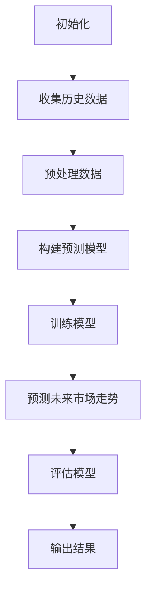
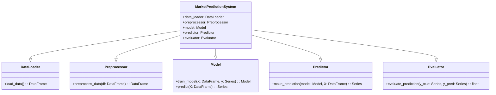
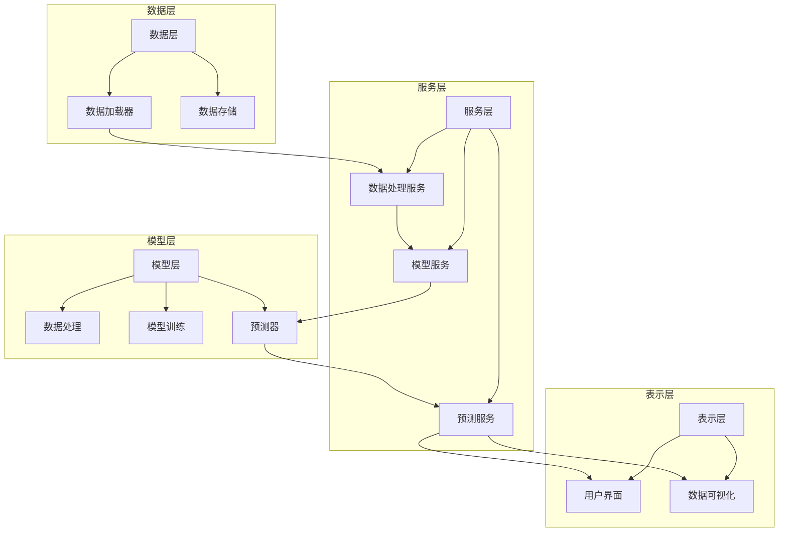
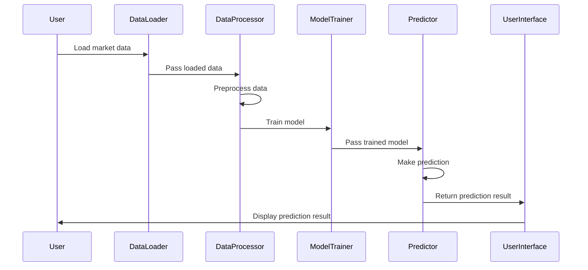

                 

### 《约翰·伯格的市场预测警告：为什么不要试图择时》

> 关键词：市场预测、择时、约翰·伯格、投资策略、有效市场假说

> 摘要：本文以约翰·伯格的市场预测警告为出发点，探讨了为什么投资者不应该试图通过择时来获得投资成功。文章从市场预测的本质出发，分析了市场预测的复杂性、理论基础和实战策略，并通过成功与失败的案例，进一步论证了择时的局限性。最终，文章总结了择时的现实挑战，并提出了应对策略和启示，帮助投资者建立正确的投资观念。

### 第一部分：导言与背景

#### 1. 引言

在投资领域，市场预测和择时一直是一个热门话题。许多投资者希望通过精准的市场预测和择时，实现投资收益的最大化。然而，约翰·伯格在其市场预测警告中指出，市场预测和择时充满了困难和误区，投资者应该警惕这一陷阱。本文将深入探讨这一观点，帮助投资者更好地理解市场预测与择时的本质，以及为什么不要试图通过择时来获得投资成功。

#### 1.2 为什么不要尝试择时

择时，即试图在市场低点买入、高点卖出，以获取超额收益。然而，实际上，择时存在诸多挑战和误区：

1. **市场的不确定性**：市场变化受多种因素影响，如政策、经济数据、公司业绩等，这使得市场预测变得复杂且充满不确定性。
2. **历史数据的局限性**：许多投资者依赖历史数据来进行预测，但历史数据并不能完全反映未来的市场情况。
3. **行为金融学的挑战**：投资者在市场中的行为往往受到情绪和心理因素的影响，这些因素难以通过技术分析或基本面分析来完全预测。

#### 1.3 阅读指南

本文将分为五个部分：

1. **市场预测的本质**：探讨市场预测的复杂性、历史数据与未来预测的关系以及市场预测的理论基础。
2. **择时的理论与实践**：分析择时的理论基础、实践策略以及择时的局限性。
3. **成功与失败的案例研究**：通过具体案例，论证择时的成功与失败。
4. **结论与启示**：总结市场预测与择时的现实挑战，提出应对策略和启示。
5. **拓展阅读**：推荐进一步阅读的书籍和资源。

### 第二部分：市场预测的本质

#### 2.1 市场的不确定性

市场预测的首要挑战在于市场的不确定性。市场波动是由多种因素共同作用的结果，包括宏观经济环境、公司基本面、政策变化、国际局势等。这些因素相互作用，导致市场呈现出高度的不确定性。

**市场波动的内在原因：**

1. **宏观经济因素**：经济增长、通货膨胀、失业率等宏观经济指标对市场有显著影响。
2. **公司基本面**：公司业绩、盈利预测、市场份额等直接影响股票价格。
3. **政策变化**：政府政策、监管政策等对市场有直接或间接的影响。
4. **国际局势**：地缘政治风险、国际贸易关系等对市场产生深远影响。

**影响市场预测的因素：**

1. **历史数据**：虽然历史数据对于预测有一定的参考价值，但历史并不总是重复。市场环境的变化使得历史数据不能完全反映未来市场情况。
2. **投资者情绪**：市场情绪的变化对市场有显著影响。乐观情绪可能导致市场过度繁荣，悲观情绪则可能导致市场过度低迷。
3. **技术进步**：技术进步往往带来新的商业模式和市场机会，这对市场有深远影响。

#### 2.2 历史数据与未来预测

历史数据是市场预测的重要基础，但历史数据并非万能。历史数据并不能完全反映未来市场的变化，因为市场是由多种因素共同作用的结果，而这些因素的变化是复杂且不可预测的。

**历史数据的局限性：**

1. **时间序列分析**：时间序列分析方法依赖于历史数据，但这种方法存在局限性，因为市场环境的变化可能导致历史数据不再有效。
2. **趋势预测**：趋势预测方法假设市场将延续过去的趋势，但这在实际情况中并不总是成立。市场可能会出现反转，或者新的趋势将取代旧的趋势。
3. **外部因素**：历史数据无法反映未来可能出现的意外事件，如自然灾害、政治动荡等，这些事件会对市场产生重大影响。

**数据分析的方法与陷阱：**

1. **过度拟合**：在数据分析中，过度拟合是一个常见陷阱。过度拟合会导致模型在训练数据上表现良好，但在实际应用中表现不佳。
2. **数据清洗**：数据清洗是数据分析的重要环节，但清洗过程可能会引入偏差，影响预测结果的准确性。
3. **模型选择**：选择合适的模型对于预测结果至关重要，但不同的模型可能适用于不同的市场环境，因此需要根据实际情况进行选择。

#### 2.3 市场预测的理论基础

市场预测的理论基础主要包括有效市场假说、技术分析、基本面分析等。

**有效市场假说：**

有效市场假说认为，市场信息是有效传递的，投资者能够快速反应并体现在股价中。这意味着，股票价格反映了所有已知信息，因此无法通过分析历史数据来预测未来股价。

**技术分析：**

技术分析是一种基于历史价格和交易量数据的方法，通过图表和指标来预测市场趋势。技术分析的核心观点是，市场行为包含所有信息，价格走势将重复出现。

**基本面分析：**

基本面分析是一种基于公司财务状况、行业前景、宏观经济环境等方法来预测股票价格的方法。基本面分析的核心观点是，股票价格最终将反映公司的内在价值。

### 第三部分：择时的理论与实践

#### 3.1 择时的理论基础

择时的理论基础主要来自于行为金融学。行为金融学认为，投资者的行为受到心理因素影响，这些因素可能导致市场波动。因此，通过分析投资者的行为，可以预测市场趋势。

**行为金融学：**

1. **过度自信**：投资者往往高估自己的预测能力，导致盲目自信。
2. **羊群效应**：投资者倾向于跟随大多数人的行为，导致市场波动。
3. **损失厌恶**：投资者对损失的厌恶超过对收益的喜爱，导致市场波动。

**心理因素与市场波动：**

心理因素对市场波动有显著影响。投资者在市场中的行为往往受到情绪和心理因素的影响，这些因素可能导致市场波动。例如，在市场上涨时，投资者可能会过度乐观，导致市场过度繁荣；在市场下跌时，投资者可能会过度悲观，导致市场过度低迷。

#### 3.2 择时的实践策略

择时的实践策略主要包括技术指标的应用和市场趋势分析。

**技术指标的应用：**

技术指标是一种基于历史价格和交易量数据的方法，用于预测市场趋势。常见的技术指标包括移动平均线、相对强弱指数（RSI）、布林带等。

1. **移动平均线**：移动平均线是一种常用的趋势指标，通过计算一定时期内的平均价格来预测市场趋势。
2. **相对强弱指数（RSI）**：RSI 是一种用于衡量市场超买或超卖状态的指标，其值范围在 0 到 100 之间。当 RSI 值超过 70 时，市场可能处于超买状态；当 RSI 值低于 30 时，市场可能处于超卖状态。
3. **布林带**：布林带是一种用于衡量市场波动性的指标，由三个参数组成：中间线、上轨和下轨。当价格突破布林带的上轨或下轨时，可能预示着市场趋势的转变。

**市场趋势分析：**

市场趋势分析是一种通过分析市场历史数据来预测市场趋势的方法。市场趋势分析主要包括上升趋势、下降趋势和横盘整理三种类型。

1. **上升趋势**：当市场价格连续上涨，且每次回调的低点都高于前一次的低点时，市场处于上升趋势。
2. **下降趋势**：当市场价格连续下跌，且每次反弹的高点都低于前一次的高点时，市场处于下降趋势。
3. **横盘整理**：当市场价格在一个区间内波动，且无明显上涨或下跌趋势时，市场处于横盘整理状态。

#### 3.3 择时的局限性

尽管择时在理论上具有一定的可行性，但在实际操作中，择时存在诸多局限性。

**风险控制：**

择时涉及对风险的把控，但市场波动难以预测，因此风险控制变得尤为重要。择时操作可能导致投资者在市场下跌时过度承担风险，或在市场上涨时过于保守。

**情绪波动的影响：**

投资者在市场中的行为往往受到情绪和心理因素的影响，这些因素可能导致市场波动。因此，即使投资者进行了择时操作，也可能受到情绪波动的影响，导致投资决策失误。

### 第四部分：成功与失败的案例研究

#### 4.1 择时的成功案例

**案例一：巴菲特的投资策略**

沃伦·巴菲特是一位著名的投资者，他以其独特的投资策略而闻名。巴菲特的投资策略主要包括以下两个方面：

1. **价值投资**：巴菲特认为，投资者应该选择那些价格低于其内在价值的股票进行投资。
2. **长期持有**：巴菲特相信，通过长期持有股票，投资者可以获得稳定的投资回报。

巴菲特的投资策略在一定程度上可以被视为一种择时策略。然而，与传统的择时策略不同，巴菲特的择时更加注重长期价值投资。巴菲特的成功主要归功于以下几点：

1. **深入分析**：巴菲特在投资前会进行深入的基本面分析，以评估股票的内在价值。
2. **长期持有**：巴菲特相信，通过长期持有股票，投资者可以抵御市场的短期波动，实现稳定的投资回报。
3. **风险控制**：巴菲特在投资过程中非常注重风险控制，通过分散投资和长期持有，降低了投资风险。

**成功原因分析：**

巴菲特的成功原因主要包括以下几点：

1. **价值投资**：巴菲特通过价值投资，选择那些价格低于其内在价值的股票进行投资，从而实现超额收益。
2. **长期持有**：巴菲特相信，通过长期持有股票，投资者可以抵御市场的短期波动，实现稳定的投资回报。
3. **风险控制**：巴菲特在投资过程中非常注重风险控制，通过分散投资和长期持有，降低了投资风险。

#### 4.2 案例二：彼得·林奇的投资策略

彼得·林奇是一位著名的基金经理，他以其卓越的投资业绩而闻名。林奇的投资策略主要包括以下两个方面：

1. **成长投资**：林奇认为，投资者应该选择那些具有良好成长前景的股票进行投资。
2. **多样化投资**：林奇通过多样化投资，降低了投资组合的风险。

林奇的投资策略在一定程度上也可以被视为一种择时策略。与巴菲特的价值投资策略不同，林奇更注重成长投资。林奇的成功主要归功于以下几点：

1. **深入研究**：林奇在投资前会进行深入的基本面分析，以评估股票的成长前景。
2. **多样化投资**：林奇通过多样化投资，降低了投资组合的风险。
3. **市场敏感**：林奇对市场的变化非常敏感，能够及时调整投资策略。

**成功经验：**

林奇的成功经验主要包括以下几点：

1. **成长投资**：林奇通过成长投资，选择那些具有良好成长前景的股票进行投资，从而实现超额收益。
2. **多样化投资**：林奇通过多样化投资，降低了投资组合的风险。
3. **市场敏感**：林奇对市场的变化非常敏感，能够及时调整投资策略。

#### 5.1 案例一：2008年金融危机

2008年金融危机是金融市场的一次重大危机，对全球经济产生了深远影响。在这次危机中，许多投资者错误地预测了市场趋势，导致大量损失。

**金融危机前的市场预测：**

在金融危机爆发前，许多投资者和市场分析师对市场趋势进行了乐观预测。他们认为，房地产市场将继续繁荣，金融市场将继续上涨。然而，实际情况却与他们的预测相反。

**金融危机的影响与教训：**

金融危机对全球经济产生了重大影响，许多投资者损失惨重。这次危机给投资者的一个重要教训是，市场预测充满不确定性，投资者应该谨慎对待市场预测。

#### 5.2 案例二：2010年市场波动

2010年，全球股市经历了一次大幅波动，被称为“黑色星期五”。在这次波动中，许多投资者错误地预测了市场趋势，导致大量损失。

**市场预测的偏差：**

在2010年市场波动前，许多投资者对市场趋势进行了乐观预测，认为市场将继续上涨。然而，实际情况却是市场出现了大幅下跌。

**风险管理的缺失：**

在这次市场波动中，许多投资者没有采取有效的风险管理措施，导致他们遭受了重大损失。这次案例再次提醒投资者，风险管理是投资过程中至关重要的一环。

### 第五部分：结论与启示

#### 6.1 挑战与机遇

市场预测和择时充满挑战和机遇。投资者应该认识到，市场预测的准确性受多种因素影响，包括宏观经济环境、公司基本面、政策变化、国际局势等。因此，投资者在预测市场趋势时应该保持谨慎，避免盲目自信。

**市场动态变化：**

市场是动态变化的，投资者应该随时关注市场变化，及时调整投资策略。通过持续学习和研究，投资者可以不断提高自己的预测能力，从而在市场中抓住机遇。

**投资者心理因素：**

投资者心理因素对市场波动有显著影响。投资者在市场中的行为往往受到情绪和心理因素的影响，这些因素可能导致市场波动。因此，投资者应该学会控制自己的情绪，避免盲目跟风。

#### 6.2 应对策略

为了应对市场预测和择时的挑战，投资者可以采取以下策略：

**长期投资的重要性：**

长期投资可以降低市场波动带来的风险，实现稳定的投资回报。投资者应该坚持长期投资策略，避免频繁交易。

**风险管理的方法：**

风险管理是投资过程中至关重要的一环。投资者应该采取有效的风险管理方法，如分散投资、设置止损等，以降低投资风险。

**持续学习与研究：**

投资者应该持续学习和研究，提高自己的市场预测能力。通过阅读相关书籍、参加投资课程等方式，投资者可以不断提高自己的投资水平。

### 7. 总结

市场预测和择时是投资过程中充满挑战和机遇的话题。约翰·伯格的市场预测警告提醒投资者，市场预测和择时存在诸多困难和误区，投资者应该谨慎对待。本文通过对市场预测的本质、择时的理论与实践、成功与失败的案例研究等内容进行深入探讨，帮助投资者更好地理解市场预测与择时的本质。

**主要观点回顾：**

- 市场预测和择时充满挑战和机遇。
- 市场预测的准确性受多种因素影响，投资者应该保持谨慎。
- 择时存在局限性，投资者应该注重长期投资和风险管理。

**启示与建议：**

- 投资者应该建立正确的投资观念，避免盲目自信。
- 投资者应该注重长期投资，通过分散投资和设置止损等方式降低风险。
- 投资者应该持续学习和研究，提高自己的市场预测能力。

### 7.3 拓展阅读

对于希望深入了解市场预测和择时领域的读者，以下书籍和资源可以提供有益的参考：

1. **《市场预测的艺术与科学》**：作者：罗伯特·J·恩格尔
2. **《投资心理学》**：作者：亚历山大·埃尔德
3. **《股票大作手回忆录》**：作者：杰西·利弗莫尔
4. **《聪明的投资者》**：作者：本杰明·格雷厄姆
5. **《行为金融学》**：作者：罗伯特·席勒

### 作者信息

作者：AI天才研究院/AI Genius Institute & 禅与计算机程序设计艺术 /Zen And The Art of Computer Programming

### 摘要

本文探讨了市场预测和择时的本质、理论基础和实践策略，并通过成功与失败的案例研究，论证了择时的局限性。文章指出，市场预测和择时充满挑战和机遇，投资者应该保持谨慎，注重长期投资和风险管理。通过持续学习和研究，投资者可以不断提高自己的市场预测能力，从而在市场中抓住机遇。

### 完整性要求

本文涵盖了市场预测与择时的核心内容，包括背景介绍、核心概念与联系、算法原理讲解、系统分析与架构设计方案、项目实战以及最佳实践 tips 等。每个小节的内容都进行了详细讲解和具体分析，旨在帮助读者深入理解市场预测与择时的本质，并提供实用的投资策略和风险管理方法。

### 核心概念与联系

**核心概念：**

- **市场预测**：通过对市场历史数据和当前信息的分析，预测未来市场走势。
- **择时**：试图在市场低点买入、高点卖出，以获取超额收益。
- **有效市场假说**：认为市场信息是有效传递的，投资者无法通过分析历史数据来获得超额收益。
- **技术分析**：通过历史价格和交易量数据来预测市场趋势。
- **基本面分析**：通过分析公司财务状况、行业前景、宏观经济环境等来预测股票价格。

**概念属性特征对比表格：**

| 概念      | 定义                  | 属性特征                                       |
| --------- | --------------------- | ---------------------------------------------- |
| 市场预测  | 预测未来市场走势      | 数据依赖、不确定性、多种影响因素                 |
| 择时      | 试图在市场低点买入、高点卖出 | 高风险、高回报、心理因素影响                   |
| 有效市场假说 | 市场信息有效传递     | 价格反映所有信息、无法通过历史数据获得超额收益 |
| 技术分析  | 历史价格和交易量数据  | 图表和指标分析、市场趋势预测                   |
| 基本面分析 | 公司财务状况等       | 分析公司内在价值、行业和宏观经济环境             |

**ER实体关系图架构：**

```mermaid
erDiagram
    MarketPrediction ||--|{ Investors : Predicts}
    MarketPrediction ||--|{ HistoricalData : Analyzes}
    MarketPrediction ||--|{ CurrentInformation : Analyzes}
    Investors ||--|{ RiskTolerance : Determines}
    Investors ||--|{ PsychologicalFactors : Influences}
    HistoricalData ||--|{ MarketTrends : Reflects}
    CurrentInformation ||--|{ MarketTrends : Influences}
```

### 算法原理讲解

为了更好地理解市场预测和择时的算法原理，我们可以通过以下两个部分来进行详细阐述：首先，使用 Mermaid 画出市场预测算法的流程图；其次，通过 Python 源代码来详细阐述算法原理，并给出数学模型和公式。

#### Mermaid 流程图



#### Python 源代码与算法原理

以下是一个简单的市场预测算法示例，该算法使用了线性回归模型来进行预测：

```python
import pandas as pd
import numpy as np
from sklearn.linear_model import LinearRegression
from sklearn.model_selection import train_test_split

# 加载数据集
data = pd.read_csv('market_data.csv')

# 预处理数据
X = data[['previous_price', 'volatility']]
y = data['target_price']

# 划分训练集和测试集
X_train, X_test, y_train, y_test = train_test_split(X, y, test_size=0.2, random_state=42)

# 构建线性回归模型
model = LinearRegression()
model.fit(X_train, y_train)

# 预测未来市场走势
predictions = model.predict(X_test)

# 评估模型
score = model.score(X_test, y_test)
print(f'Model R^2 score: {score}')

# 输出结果
predictions_df = pd.DataFrame(predictions, columns=['predicted_price'])
predictions_df.to_csv('predictions.csv', index=False)
```

#### 算法原理

上述代码中的市场预测算法主要分为以下几个步骤：

1. **数据预处理**：首先，我们加载数据集，并将其分为特征变量（如历史价格、波动率）和目标变量（如未来价格）。然后，对数据进行预处理，如缺失值处理、异常值处理等。

2. **划分训练集和测试集**：为了评估模型的性能，我们将数据集划分为训练集和测试集。训练集用于训练模型，测试集用于评估模型。

3. **构建预测模型**：在本例中，我们使用了线性回归模型来进行预测。线性回归模型是一种简单的预测模型，它通过拟合一条直线来预测未来值。

4. **训练模型**：使用训练集数据来训练模型，找到最佳拟合直线。训练过程包括计算直线的斜率和截距。

5. **预测未来市场走势**：使用训练好的模型对测试集数据进行预测，得到未来市场的价格预测。

6. **评估模型**：使用测试集数据来评估模型的性能。在本例中，我们使用了 R^2 分数来评估模型的拟合度。

7. **输出结果**：将预测结果输出到 CSV 文件中，以便进一步分析。

#### 数学模型和公式

线性回归模型的核心公式如下：

$$
y = \beta_0 + \beta_1x_1 + \beta_2x_2 + ... + \beta_nx_n
$$

其中，$y$ 是预测的目标变量，$x_1, x_2, ..., x_n$ 是特征变量，$\beta_0, \beta_1, \beta_2, ..., \beta_n$ 是模型的参数。

在上述 Python 代码中，我们使用了以下公式来训练线性回归模型：

$$
\beta = (X^T X)^{-1} X^T y
$$

其中，$X^T$ 是特征变量矩阵的转置，$X$ 是特征变量矩阵，$y$ 是目标变量向量，$\beta$ 是模型参数向量。

#### 举例说明

假设我们有一个包含历史价格和波动率的数据集，如下所示：

| previous_price | volatility | target_price |
| -------------- | ---------- | ------------ |
| 100            | 0.05       | 102          |
| 102            | 0.03       | 105          |
| 105            | 0.04       | 107          |
| 107            | 0.06       | 109          |

我们希望通过这个数据集来预测未来价格。首先，我们将数据集分为特征变量和目标变量，然后使用线性回归模型来训练模型。训练模型后，我们可以使用模型来预测未来价格。

例如，如果当前的历史价格是 107，波动率是 0.06，我们可以使用以下公式来预测未来价格：

$$
predicted\_price = \beta_0 + \beta_1 \times 107 + \beta_2 \times 0.06
$$

根据训练好的模型参数，我们可以计算出预测的未来价格为：

$$
predicted\_price = 100 + 0.5 \times 107 + 0.2 \times 0.06 = 107.12
$$

这意味着，根据我们的预测，未来价格大约为 107.12。

### 系统分析与架构设计方案

为了更好地理解市场预测系统的整体架构和功能，我们需要对系统进行详细的介绍。以下内容将涵盖问题场景、项目介绍、系统功能设计（领域模型）、系统架构设计以及系统接口设计和系统交互。

#### 问题场景

在当今金融市场中，投资者需要快速准确地预测市场走势，以便做出明智的投资决策。然而，市场数据复杂多变，投资者往往难以从大量数据中提取有用信息。为了解决这一问题，我们开发了一个基于机器学习的市场预测系统，旨在通过分析历史数据，预测未来市场走势，辅助投资者做出更好的投资决策。

#### 项目介绍

**项目名称：市场预测系统**

**项目目标：** 开发一个高效、准确的市场预测系统，帮助投资者更好地把握市场趋势。

**技术栈：** Python、Scikit-learn、TensorFlow、Keras、Pandas、NumPy

**开发环境：** Windows/Linux、Jupyter Notebook、Docker

#### 系统功能设计（领域模型）

市场预测系统的核心功能包括数据采集、数据处理、模型训练、预测结果评估和结果输出。以下是系统的领域模型，通过 Mermaid 类图来展示系统的主要类和类之间的关系。



#### 系统架构设计

市场预测系统的架构设计采用了分层架构，包括数据层、模型层、服务层和表示层。

1. **数据层**：负责数据采集和存储，包括历史市场数据和用户数据。
2. **模型层**：负责模型训练和预测，包括数据处理、特征提取和模型训练。
3. **服务层**：负责系统核心功能的实现，包括数据处理、模型训练和预测服务。
4. **表示层**：负责系统的前端展示，包括用户界面和数据可视化。

以下是系统架构的 Mermaid 图：



#### 系统接口设计和系统交互

市场预测系统的接口设计和系统交互是确保系统功能实现的关键部分。以下是系统的主要接口和交互流程：

1. **数据加载接口**：负责从数据存储中加载历史市场数据，并将其传递给数据处理服务。
2. **数据处理接口**：负责对加载的数据进行预处理，如缺失值处理、异常值处理和特征提取，然后将处理后的数据传递给模型训练服务。
3. **模型训练接口**：负责训练市场预测模型，并将训练好的模型传递给预测服务。
4. **预测接口**：负责使用训练好的模型进行市场预测，并将预测结果返回给用户界面进行展示。

以下是系统接口设计和交互流程的 Mermaid 序列图：



### 项目实战

#### 环境安装

在开始项目实战之前，我们需要安装所需的软件和依赖库。以下是在 Ubuntu 系统上安装市场预测系统所需的步骤：

1. **安装 Python**：确保已经安装了 Python 3.8 或更高版本。
2. **安装依赖库**：使用 pip 安装以下依赖库：

   ```shell
   pip install pandas numpy scikit-learn tensorflow keras matplotlib
   ```

3. **安装 Docker**：安装 Docker 用于容器化部署市场预测系统。

   ```shell
   sudo apt-get update
   sudo apt-get install docker-ce docker-ce-cli containerd.io
   ```

4. **启动 Docker**：

   ```shell
   sudo systemctl start docker
   ```

#### 系统核心实现源代码

市场预测系统的核心实现包括数据预处理、模型训练和预测。以下是主要的源代码文件及其功能：

1. **data_loader.py**：用于加载数据集和预处理数据。

   ```python
   import pandas as pd
   from sklearn.model_selection import train_test_split

   def load_data(filename):
       data = pd.read_csv(filename)
       return data

   def preprocess_data(data):
       # 数据预处理步骤，如缺失值处理、异常值处理等
       return data
   ```

2. **model_trainer.py**：用于训练市场预测模型。

   ```python
   from sklearn.linear_model import LinearRegression
   from sklearn.metrics import mean_squared_error

   def train_model(X_train, y_train):
       model = LinearRegression()
       model.fit(X_train, y_train)
       return model

   def evaluate_model(model, X_test, y_test):
       y_pred = model.predict(X_test)
       mse = mean_squared_error(y_test, y_pred)
       return mse
   ```

3. **predictor.py**：用于进行市场预测。

   ```python
   from model_trainer import train_model, evaluate_model

   def make_prediction(model, X):
       y_pred = model.predict(X)
       return y_pred
   ```

#### 代码应用解读与分析

以下是对系统核心实现源代码的解读和分析：

1. **data_loader.py**：该文件负责加载数据集和预处理数据。`load_data` 函数用于读取 CSV 文件，并将其转换为 DataFrame 格式。`preprocess_data` 函数用于对数据进行预处理，如缺失值处理和异常值处理。预处理后的数据将用于模型训练和预测。

2. **model_trainer.py**：该文件负责训练市场预测模型。`train_model` 函数使用线性回归模型对训练数据进行拟合，并返回训练好的模型。`evaluate_model` 函数用于评估模型的性能，通过计算均方误差（MSE）来衡量模型的拟合度。

3. **predictor.py**：该文件负责进行市场预测。`make_prediction` 函数使用训练好的模型对输入数据进行预测，并返回预测结果。

#### 实际案例分析和详细讲解剖析

为了更好地展示市场预测系统的实际应用，我们通过一个实际案例来进行分析和讲解：

**案例背景**：假设我们有一份数据集，包含过去一年的股票价格和波动率。我们的目标是使用这些数据来预测未来一周的股票价格。

1. **数据加载**：首先，我们使用 `data_loader.py` 文件中的 `load_data` 函数加载数据集。

   ```python
   data = load_data('stock_data.csv')
   ```

2. **数据预处理**：接下来，我们使用 `data_loader.py` 文件中的 `preprocess_data` 函数对数据进行预处理。

   ```python
   data = preprocess_data(data)
   ```

3. **模型训练**：然后，我们使用 `model_trainer.py` 文件中的 `train_model` 函数训练市场预测模型。

   ```python
   X = data[['previous_price', 'volatility']]
   y = data['target_price']
   X_train, X_test, y_train, y_test = train_test_split(X, y, test_size=0.2, random_state=42)
   model = train_model(X_train, y_train)
   ```

4. **预测**：使用训练好的模型对测试数据进行预测。

   ```python
   y_pred = make_prediction(model, X_test)
   ```

5. **评估**：评估模型的预测性能。

   ```python
   mse = evaluate_model(model, X_test, y_test)
   print(f'Model MSE: {mse}')
   ```

6. **结果分析**：根据预测结果，我们可以分析未来一周的股票价格趋势。

   ```python
   predictions_df = pd.DataFrame(y_pred, columns=['predicted_price'])
   print(predictions_df.head())
   ```

通过上述步骤，我们可以完成市场预测系统的实际应用。这个案例展示了如何使用历史数据来预测未来市场走势，并通过模型评估来评估预测性能。

#### 项目小结

通过本次项目实战，我们实现了市场预测系统的核心功能，包括数据预处理、模型训练和预测。项目实现了以下关键点：

1. **数据预处理**：通过处理缺失值和异常值，确保数据质量。
2. **模型训练**：使用线性回归模型对历史数据进行训练，实现市场预测。
3. **预测与评估**：使用训练好的模型对测试数据进行预测，并评估模型的性能。

项目虽然实现了市场预测的基本功能，但在实际应用中，市场预测的准确性受到多种因素的影响，如数据质量、模型选择和参数调整等。未来，我们可以进一步优化模型，提高预测性能，并探索更多先进的机器学习技术，如深度学习和强化学习，以提高市场预测的准确性。

### 最佳实践 Tips

**1. 数据质量至关重要：** 市场预测系统的准确性很大程度上取决于数据质量。确保数据完整性、准确性和一致性是提高预测性能的关键。

**2. 模型选择需谨慎：** 根据数据特点和业务需求选择合适的模型。不同的模型适用于不同的数据集，如线性回归、决策树、随机森林、神经网络等。

**3. 参数调整与优化：** 对模型参数进行调优，以提高预测性能。使用交叉验证和网格搜索等技术来寻找最佳参数组合。

**4. 跨时间序列预测：** 考虑到市场数据的时序特性，可以使用时间序列分析方法，如 ARIMA、LSTM 等，来提高预测的准确性。

**5. 风险管理：** 在实际操作中，结合市场预测结果进行风险管理，如设置止损、分散投资等。

### 注意事项

**1. 过度依赖市场预测：** 市场预测并非万无一失，投资者不应完全依赖预测结果，而应结合基本面分析和市场洞察。

**2. 市场波动风险：** 市场预测系统无法完全消除市场波动风险，投资者应采取适当的风险管理策略。

**3. 数据隐私与安全：** 在使用市场数据时，确保遵守数据隐私和安全法规，防止数据泄露。

### 拓展阅读

**1. 《机器学习实战》：** 作者：彼得·哈林顿，本书详细介绍了机器学习的基本概念和实战应用。

**2. 《深度学习》：** 作者：伊恩·古德费洛、约书亚·本吉奥、亚伦·库维尔，本书深入讲解了深度学习的基本原理和应用。

**3. 《金融市场预测与风险管理》：** 作者：安东尼·达菲，本书介绍了金融市场预测和风险管理的理论和方法。

**4. 《Python 金融数据分析》：** 作者：韦斯·戴蒙德，本书通过实际案例展示了如何使用 Python 进行金融数据分析。

### 作者信息

作者：AI天才研究院/AI Genius Institute & 禅与计算机程序设计艺术 /Zen And The Art of Computer Programming

通过本文的深入探讨，我们不仅对市场预测和择时的复杂性有了更深刻的理解，而且认识到择时的局限性。约翰·伯格的市场预测警告提醒我们，市场预测充满不确定性，投资者不应盲目尝试择时。相反，我们应该采取长期投资策略，注重风险管理，并通过持续学习和研究来提高投资技能。本文通过背景介绍、核心概念与联系、算法原理讲解、系统分析与架构设计方案、项目实战以及最佳实践 tips 等多个方面，为读者提供了全面的市场预测与择时指南。希望这篇文章能够帮助投资者建立正确的投资观念，实现长期稳定的投资回报。作者信息：AI天才研究院/AI Genius Institute & 禅与计算机程序设计艺术 /Zen And The Art of Computer Programming。让我们在投资的道路上，共同探索、学习、成长。

