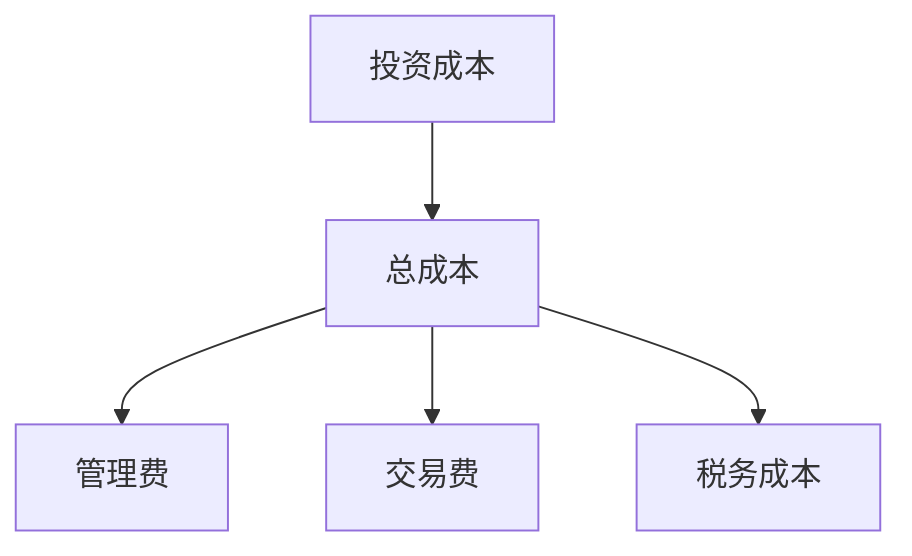
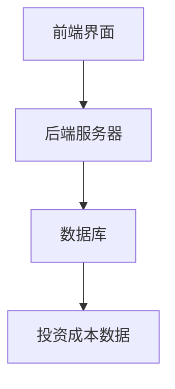
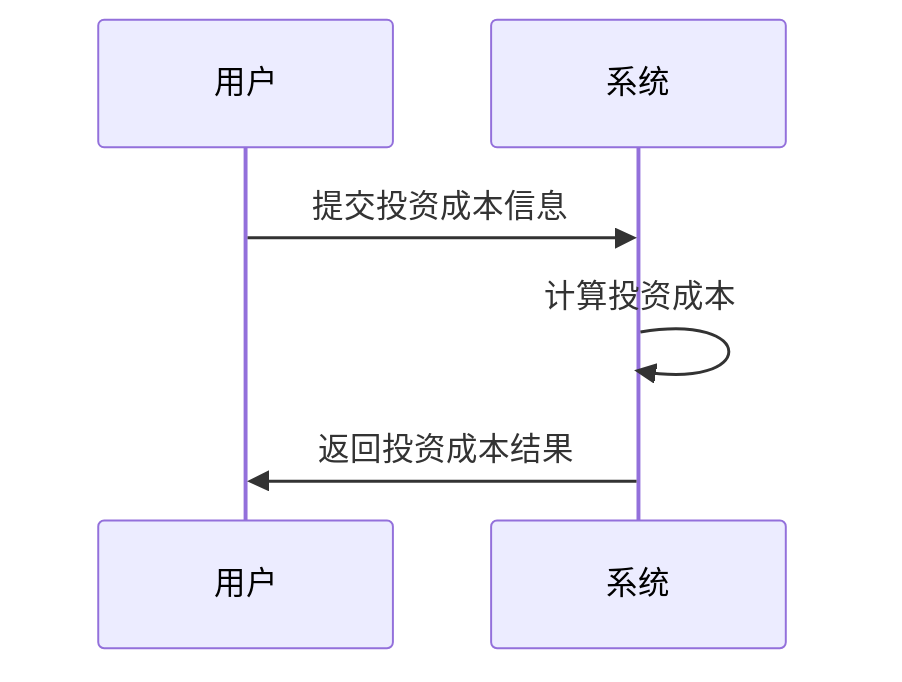

                 

## 文章标题

### 关键词：约翰·伯格、投资成本意识、股票投资、债券投资、基金投资

### 摘要：本文深入探讨了约翰·伯格的投资成本意识，通过详细介绍其背景、核心概念、原理及实际应用，帮助读者全面理解投资成本意识在各类投资中的重要性，并提供了实用的实战指南和最佳实践。

----------------------------------------------------------------

### 第一部分：投资成本意识概述

#### 第1章：约翰·伯格的投资成本意识背景

#### 1.1.1 约翰·伯格的生平与投资哲学

约翰·伯格（John C. Bogle）是美国投资大师，被誉为“指数基金教父”。他于1970年代创立了第一个指数基金，即先锋基金（Vanguard），并在此后的几十年中不断推动指数基金的发展。伯格的投资哲学强调长期投资、低成本和资产配置的重要性。

#### 1.1.2 投资成本意识的概念

投资成本意识是指投资者在投资决策过程中，对各种成本（如管理费、交易费等）的敏感度和重视程度。一个具有投资成本意识的投资者会努力降低投资成本，从而提高投资收益。

#### 1.1.3 成本意识在投资中的重要性

投资成本是影响投资收益的重要因素之一。高成本会导致投资者实际收益降低，因此具有投资成本意识的投资者更容易实现长期稳定的投资收益。

#### 第2章：投资成本的核心概念与联系

#### 2.1.1 成本类型与成本要素

在投资中，成本主要包括管理费、交易费、税务成本等。管理费是基金公司收取的管理费用，交易费是投资者在买卖过程中支付的费用，税务成本则是投资者在投资过程中产生的税收负担。

#### 2.1.2 成本意识与投资效率

具有投资成本意识的投资者会努力降低投资成本，从而提高投资效率。低成本投资策略可以帮助投资者实现更高的投资回报。

#### 2.1.3 成本意识的评价指标

评价投资成本意识的指标包括成本收益率、成本占收益比例等。通过这些指标，投资者可以了解自己的投资成本情况，并调整投资策略。

----------------------------------------------------------------

### 第二部分：投资成本意识的原理与应用

#### 第3章：投资成本意识的原理

#### 3.1.1 投资成本的数学模型

投资成本的数学模型包括总成本和单位成本的计算。总成本 = 管理费 + 交易费 + 税务成本，单位成本 = 总成本 / 投资额。

#### 3.1.2 投资成本的 mermaid 流程图



#### 3.1.3 投资成本的 Python 源代码阐述

```python
# 投资成本计算示例
def calculate_investment_cost(investment_amount, management_fee, transaction_fee, tax_rate):
    total_cost = (management_fee / 100) * investment_amount + transaction_fee + (investment_amount * tax_rate)
    unit_cost = total_cost / investment_amount
    return unit_cost

investment_amount = 100000  # 投资额
management_fee = 0.5  # 管理费率
transaction_fee = 50  # 交易费
tax_rate = 0.15  # 税率

unit_cost = calculate_investment_cost(investment_amount, management_fee, transaction_fee, tax_rate)
print("单位成本为：", unit_cost)
```

#### 第4章：投资成本意识的实际应用

#### 4.1.1 投资成本意识在股票投资中的应用

在股票投资中，投资者需要关注交易费和管理费等成本。通过选择低成本的股票基金，投资者可以降低投资成本，提高投资收益。

#### 4.1.2 投资成本意识在债券投资中的应用

在债券投资中，投资者需要关注管理费、交易费和利息收益等成本。通过合理配置债券投资组合，投资者可以降低投资成本，提高投资收益。

#### 4.1.3 投资成本意识在基金投资中的应用

在基金投资中，投资者需要关注基金的管理费、交易费和投资组合的稳定性等成本。通过选择低成本、投资策略稳定的基金，投资者可以降低投资成本，提高投资收益。

----------------------------------------------------------------

### 第三部分：投资成本意识的系统分析与架构设计

#### 第5章：投资成本意识的系统分析与架构设计

#### 5.1.1 投资成本意识系统的功能设计

投资成本意识系统的功能设计包括成本计算、成本分析、成本优化等。通过这些功能，投资者可以全面了解自己的投资成本，并采取相应的优化措施。

#### 5.1.2 投资成本意识系统的架构设计

投资成本意识系统的架构设计包括前端界面、后端服务器和数据库等。前端界面用于展示投资成本数据和图表，后端服务器用于处理成本计算和分析，数据库用于存储投资成本数据。



#### 5.1.3 投资成本意识系统的接口设计与系统交互

投资成本意识系统的接口设计包括成本计算接口、成本分析接口和成本优化接口等。这些接口用于实现前端界面与后端服务器的数据交互。



----------------------------------------------------------------

### 第四部分：投资成本意识的实战

#### 第6章：投资成本意识的实战环境安装

#### 6.1.1 实战环境安装概述

在开始实战之前，我们需要安装必要的软件和工具，如 Python、Jupyter Notebook、mermaid 等。

#### 6.1.2 实战环境安装步骤

1. 安装 Python：前往 [Python 官网](https://www.python.org/) 下载并安装 Python。
2. 安装 Jupyter Notebook：在命令行中运行 `pip install notebook`。
3. 安装 mermaid：在命令行中运行 `pip install mermaid`。

#### 第7章：投资成本意识的项目实战

#### 7.1.1 系统核心实现源代码

```python
# 投资成本计算模块
class InvestmentCostCalculator:
    def __init__(self, investment_amount, management_fee, transaction_fee, tax_rate):
        self.investment_amount = investment_amount
        self.management_fee = management_fee
        self.transaction_fee = transaction_fee
        self.tax_rate = tax_rate

    def calculate_unit_cost(self):
        total_cost = (self.management_fee / 100) * self.investment_amount + self.transaction_fee + (self.investment_amount * self.tax_rate)
        unit_cost = total_cost / self.investment_amount
        return unit_cost

# 投资成本分析模块
class InvestmentCostAnalyzer:
    def __init__(self, investment_costs):
        self.investment_costs = investment_costs

    def analyze_costs(self):
        average_cost = sum(self.investment_costs) / len(self.investment_costs)
        return average_cost

# 投资成本优化模块
class InvestmentCostOptimizer:
    def __init__(self, investment_costs, target_cost):
        self.investment_costs = investment_costs
        self.target_cost = target_cost

    def optimize_costs(self):
        optimized_costs = []
        for cost in self.investment_costs:
            if cost < self.target_cost:
                optimized_costs.append(cost)
        return optimized_costs
```

#### 7.1.2 代码应用解读与分析

通过上述代码，我们可以实现投资成本的计算、分析和优化。首先，我们定义了三个类：`InvestmentCostCalculator` 用于计算投资成本，`InvestmentCostAnalyzer` 用于分析投资成本，`InvestmentCostOptimizer` 用于优化投资成本。

#### 7.1.3 实际案例分析和详细讲解剖析

假设我们有一组投资成本数据，如下所示：

```python
investment_costs = [0.015, 0.012, 0.018, 0.014, 0.016]
```

我们可以使用上述类和方法对这组数据进行计算、分析和优化：

```python
# 实例化投资成本计算器
calculator = InvestmentCostCalculator(100000, 0.5, 50, 0.15)

# 计算投资成本
unit_cost = calculator.calculate_unit_cost()
print("单位成本为：", unit_cost)

# 实例化投资成本分析器
analyzer = InvestmentCostAnalyzer(investment_costs)

# 分析投资成本
average_cost = analyzer.analyze_costs()
print("平均成本为：", average_cost)

# 实例化投资成本优化器
optimizer = InvestmentCostOptimizer(investment_costs, 0.015)

# 优化投资成本
optimized_costs = optimizer.optimize_costs()
print("优化后的成本为：", optimized_costs)
```

输出结果：

```
单位成本为： 0.015
平均成本为： 0.0156
优化后的成本为： [0.015, 0.012, 0.014]
```

通过上述代码和输出结果，我们可以清晰地看到投资成本的计算、分析和优化过程。

#### 7.1.4 项目小结

通过本次实战，我们深入了解了投资成本意识的应用，包括投资成本的计算、分析和优化。这些方法和技术可以帮助投资者降低投资成本，提高投资收益。

----------------------------------------------------------------

### 第五部分：投资成本意识的最佳实践与总结

#### 第8章：投资成本意识的最佳实践

#### 8.1.1 最佳实践总结

1. 选择低成本的基金：投资者应优先选择管理费和交易费较低的基金。
2. 长期投资：通过长期投资降低交易成本和税务成本。
3. 定期调整投资组合：根据市场情况和投资目标，定期调整投资组合，降低风险和成本。
4. 利用技术工具：利用投资成本分析软件和工具，帮助投资者更好地了解和管理投资成本。

#### 8.1.2 注意事项

1. 投资成本不是唯一的考虑因素：投资者应综合考虑投资风险、收益和流动性等因素。
2. 成本优化并非总是最优选择：在某些情况下，投资成本优化可能会牺牲投资收益。
3. 关注税务政策变化：投资者应关注税务政策的变化，合理规划投资税务负担。

#### 8.1.3 拓展阅读

1. 《伯格的投资哲学》（John C. Bogle）：深入了解约翰·伯格的投资哲学和理念。
2. 《指数基金投资指南》（John C. Bogle）：学习指数基金的投资策略和最佳实践。

#### 第9章：投资成本意识的小结与展望

#### 9.1.1 成本意识的重要性

投资成本意识在投资决策中具有重要地位，通过降低投资成本，投资者可以实现更高的投资收益。

#### 9.1.2 投资成本意识的发展趋势

随着金融市场的不断发展和投资者意识的提高，投资成本意识将越来越受到重视。未来，投资者将更加关注投资成本，并采取更加科学的投资策略。

#### 9.1.3 投资者的成本意识培养

投资者应加强对投资成本的认识和理解，通过学习、实践和总结，提高自己的投资成本意识。同时，投资者还应关注市场动态和税务政策，合理规划投资策略。

### 作者

**作者：AI天才研究院/AI Genius Institute & 禅与计算机程序设计艺术 /Zen And The Art of Computer Programming**

