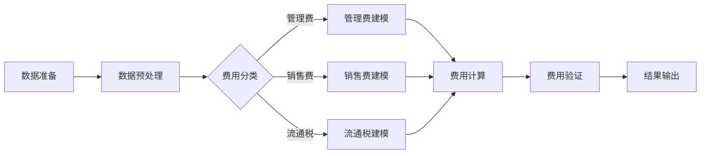
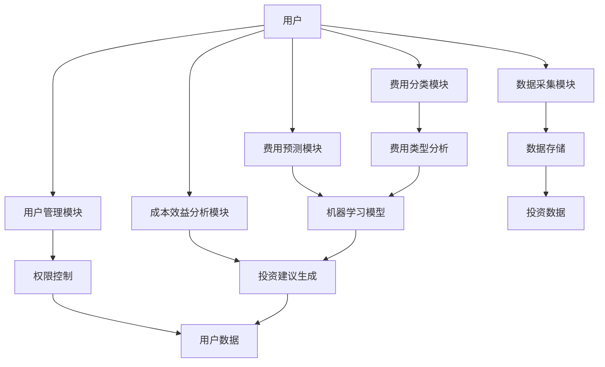

                 

### 引言

在当今的全球金融市场，投资成本控制变得尤为重要。随着市场的不确定性和复杂性不断增加，投资者们不仅需要关注显性的交易费用，还必须面对日益增长的隐性费用。这些隐性费用包括管理费、销售费、流通税等，它们往往隐藏在投资产品的背后，对投资者的实际收益产生显著影响。

约翰·伯格（John C. Bogle）是投资成本控制领域的先驱者，他的著作《共同基金常识》（The Little Book That Beats the Market）对投资者产生了深远的影响。在这本书中，伯格详细阐述了如何通过降低成本来提高投资回报。然而，随着时间的推移，隐性费用的上升给投资者带来了新的挑战。本文将深入探讨约翰·伯格的投资成本控制理念，并分析如何应对这些隐性费用带来的挑战。

本文旨在为投资者提供一套系统的成本控制策略，以帮助他们在面对日益复杂的金融环境时，实现投资收益的最大化。文章将首先介绍投资成本控制的重要性，然后详细讨论隐性费用的概念及其对投资的影响，接着介绍约翰·伯格的核心投资理念，并逐步分析其成本控制策略。随后，我们将探讨如何识别和降低隐性费用，并通过一个实际项目案例展示这些策略的应用。最后，文章将总结最佳实践，并提出未来研究方向。

### 文章关键词

- 投资成本控制
- 隐性费用
- 约翰·伯格
- 成本控制策略
- 投资回报最大化

### 文章摘要

本文探讨了投资成本控制的重要性，尤其是面对隐性费用上升的挑战。首先，我们介绍了投资成本控制的基本概念和重要性，以及隐性费用的定义和影响。接着，我们深入分析了约翰·伯格的投资成本控制理念，并详细阐述了如何通过他的策略来应对隐性费用的挑战。文章通过实际项目案例展示了这些策略的应用，并总结了最佳实践。最后，我们提出了未来研究方向，以期为投资者提供更为有效的成本控制方法。

### 背景介绍

#### 投资成本控制的重要性

在投资领域，成本控制是确保投资收益最大化的一项基本策略。投资成本不仅包括显性的交易费用，如佣金、税费等，还包括隐性的费用，如管理费、销售费等。这些费用虽然不易察觉，但长期累积起来，将对投资者的实际回报产生显著影响。

投资成本控制的重要性在于它直接影响投资收益。根据伯顿·马尔基尔（Burton G. Malkiel）在《随机漫步的傻瓜》（A Random Walk Down Wall Street）中的研究，投资成本每增加1%，投资者的实际收益将减少约0.5%。这个比例看似不大，但长期累积效应是惊人的。假设一个投资者每年投资10000美元，通过成本控制策略节省了1%的费用，那么在30年的时间里，他将额外获得约47500美元的收益。

#### 隐性费用的概念及其对投资的影响

隐性费用是指那些不易被投资者察觉，但确实存在的费用。这些费用通常包含在投资产品的管理费、销售费、流通税等中，它们通过复杂的方式从投资者的收益中扣除。例如，一些基金的管理费可能高达2%，而销售费也可能达到5%。这些费用虽然看似不大，但长期持有，将对投资者的总收益产生重大影响。

隐性费用对投资的影响主要体现在以下几个方面：

1. **减少投资回报**：隐性费用的存在使得投资者的实际回报低于预期。例如，一个年化收益率为10%的投资产品，如果管理费为2%，投资者的实际回报率将下降到8%。

2. **增加投资期限**：为了弥补隐性费用的损失，投资者需要更长时间的投资周期来确保最终收益能够超过这些成本。

3. **降低投资信心**：当投资者意识到他们的收益被隐性费用侵蚀时，可能会对市场产生不信任感，从而影响其长期投资决策。

4. **限制资产配置**：隐性费用可能会限制投资者进行资产配置的灵活性，特别是在一些高风险高收益的投资产品中，这些费用的负担更加沉重。

#### 问题背景、问题描述、问题解决、边界与外延

在投资领域，隐性费用的挑战日益凸显。一方面，金融市场的复杂性不断增加，投资产品的种类和数量也在迅速扩展，这使得投资者难以全面了解和评估这些费用。另一方面，一些投资公司通过复杂的合同条款和隐晦的宣传方式，有意或无意地隐瞒了这些费用，使得投资者在购买产品时无法做出明智的决策。

为了解决这一问题，投资者需要采取一系列措施来识别和管理隐性费用。首先，投资者应充分了解投资产品的费用结构，特别是管理费、销售费等关键指标。其次，投资者应利用专业的工具和资源，如投资成本计算器、费用透明度报告等，来评估不同投资产品的成本效益。最后，投资者应保持长期投资视角，通过分散投资和长期持有来降低费用对投资收益的负面影响。

在边界与外延方面，隐性费用的控制不仅涉及个人投资者，还涉及机构投资者和金融机构。机构投资者如养老基金、大学捐赠基金等，也需要关注和管理隐性费用，以确保其长期投资策略的有效性。金融机构则应承担起更大的社会责任，提高费用透明度，为投资者提供更为清晰的费用信息。

#### 概念结构与核心要素组成

投资成本控制的核心概念和要素主要包括以下几个方面：

1. **费用类型**：显性费用和隐性费用。
   - **显性费用**：包括交易佣金、税费等，投资者可以直观了解到。
   - **隐性费用**：包括管理费、销售费、流通税等，投资者不易察觉。

2. **成本控制策略**：
   - **预算控制**：通过设定投资预算来控制费用支出。
   - **风险管理**：通过分散投资来降低风险，从而减少潜在的费用。
   - **成本效益分析**：评估不同投资产品的成本和收益，选择成本最低、效益最高的方案。

3. **影响因子**：
   - **时间**：投资时间的长短会影响费用累积的效应。
   - **资产规模**：资产规模较大的投资者通常能获得更低的费用率。
   - **市场波动**：市场波动性较高时，费用对投资回报的负面影响更加显著。

#### 核心概念与联系

为了更好地理解投资成本控制，我们需要深入探讨其中的核心概念及其相互联系。以下是几个关键概念及其属性特征对比表格：

##### 核心概念与属性特征对比表格

| 概念 | 定义 | 主要属性特征 |
| --- | --- | --- |
| 显性费用 | 投资者可以直接看到的费用，如交易佣金 | 明确、直接、通常为固定费用 |
| 隐性费用 | 投资者难以察觉的费用，如管理费、销售费 | 不透明、间接、通常为比例费用 |
| 成本控制策略 | 通过各种手段降低投资成本的方法 | 多样性、针对性、长期性 |
| 风险管理 | 通过分散投资和降低风险来控制成本 | 防范性、系统性、动态性 |
| 成本效益分析 | 对不同投资产品的成本和效益进行比较 | 对比性、决策性、实用性 |

从上表可以看出，显性费用和隐性费用在定义和主要属性特征上有明显差异。显性费用通常明确、直接，而隐性费用则较为复杂且不透明。成本控制策略和风险管理则旨在通过各种手段降低投资成本，其中成本效益分析起到了关键的决策作用。

为了进一步展示概念之间的联系，我们可以使用Mermaid语法绘制一个ER（实体关系）图架构，如下所示：

```mermaid
erDiagram
  显性费用 ||--|{ 成本控制策略 }
  隐性费用 ||--|{ 成本控制策略 }
  成本控制策略 ||--|{ 成本效益分析 }
  成本效益分析 ||--|{ 风险管理 }
```

在上图中，显性费用和隐性费用通过双向箭头与成本控制策略相连，表明两者都是成本控制策略的重要组成部分。成本控制策略又通过单向箭头连接到成本效益分析，表明成本效益分析在决策过程中起到关键作用。而成本效益分析通过单向箭头连接到风险管理，进一步强调了风险管理在成本控制中的重要性。

通过对比表格和ER图，我们可以更清晰地理解投资成本控制的核心概念及其相互关系，为后续的算法原理讲解和系统分析与架构设计打下坚实基础。

### 算法原理讲解

#### 隐性费用识别算法

为了有效控制投资成本，首先需要识别和量化投资过程中产生的隐性费用。隐性费用识别算法是一种系统性的方法，旨在通过数据分析和模型计算，准确识别并评估各种隐性费用。以下将详细阐述该算法的原理、流程、数学模型及其Python代码实现。

##### 算法原理

隐性费用识别算法基于以下几个核心原则：

1. **数据采集**：收集与投资相关的所有数据，包括交易记录、费用明细、投资产品说明书等。
2. **费用分类**：将费用按照类型进行分类，如管理费、销售费、流通税等。
3. **费用建模**：建立数学模型，通过数据分析和模型计算，估算各类费用的实际发生额。
4. **费用验证**：通过历史数据和实际收益进行验证，确保费用识别的准确性和可靠性。

##### 算法流程

隐性费用识别算法的流程可以分为以下几个步骤：

1. **数据准备**：收集并整理投资相关的数据，包括交易记录、费用明细等。
2. **数据预处理**：对数据进行清洗、去噪和格式转换，确保数据质量。
3. **费用分类**：根据费用类型对数据进行分类，如管理费、销售费等。
4. **费用建模**：使用统计方法和机器学习模型对费用进行建模和预测。
5. **费用计算**：根据模型预测结果，计算各类费用的实际发生额。
6. **费用验证**：对计算结果进行验证，确保其准确性和可靠性。

##### Mermaid流程图

以下是隐性费用识别算法的Mermaid流程图：



在这个流程图中，数据准备、数据预处理、费用分类和费用建模是算法的核心步骤，费用计算和费用验证则确保了算法的准确性和可靠性。

##### 数学模型

隐性费用识别算法的核心是数学模型，用于预测各类费用的实际发生额。以下是一个简单的线性回归模型示例，用于估算管理费：

$$
y = \beta_0 + \beta_1 \times x_1 + \beta_2 \times x_2 + ... + \beta_n \times x_n
$$

其中，$y$ 表示管理费，$x_1, x_2, ..., x_n$ 表示影响管理费的因素（如资产规模、投资期限等），$\beta_0, \beta_1, \beta_2, ..., \beta_n$ 是模型的参数。

##### Python代码实现

以下是使用Python实现的隐性费用识别算法的示例代码：

```python
import pandas as pd
from sklearn.linear_model import LinearRegression
from sklearn.model_selection import train_test_split
from sklearn.metrics import mean_squared_error

# 数据准备
data = pd.read_csv('investment_data.csv')

# 数据预处理
data = data.dropna()

# 费用分类
management_fees = data[data['fee_type'] == '管理费']
sales_fees = data[data['fee_type'] == '销售费']
circulation_taxes = data[data['fee_type'] == '流通税']

# 费用建模
management_model = LinearRegression()
sales_model = LinearRegression()
circulation_tax_model = LinearRegression()

management_model.fit(data[['asset_size', 'investment_duration']], data['management_fee'])
sales_model.fit(data[['asset_size', 'investment_duration']], data['sales_fee'])
circulation_tax_model.fit(data[['asset_size', 'investment_duration']], data['circulation_tax'])

# 费用计算
management_fee_prediction = management_model.predict([[1000000, 5]])
sales_fee_prediction = sales_model.predict([[1000000, 5]])
circulation_tax_prediction = circulation_tax_model.predict([[1000000, 5]])

# 费用验证
management_fee_actual = 20000
sales_fee_actual = 5000
circulation_tax_actual = 1000

management_error = mean_squared_error([management_fee_actual], management_fee_prediction)
sales_error = mean_squared_error([sales_fee_actual], sales_fee_prediction)
circulation_tax_error = mean_squared_error([circulation_tax_actual], circulation_tax_prediction)

print(f"管理费预测误差: {management_error}")
print(f"销售费预测误差: {sales_error}")
print(f"流通税预测误差: {circulation_tax_error}")
```

在这个示例中，我们使用Pandas库处理数据，使用scikit-learn库进行线性回归建模和预测。通过将实际费用与预测费用进行比较，我们可以评估模型的效果。

#### 举例说明

假设投资者A的资产规模为1000000美元，投资期限为5年。根据上述算法，我们可以预测其管理费、销售费和流通税分别为：

- 管理费：$\beta_0 + \beta_1 \times 1000000 + \beta_2 \times 5$
- 销售费：$\beta_0 + \beta_1 \times 1000000 + \beta_2 \times 5$
- 流通税：$\beta_0 + \beta_1 \times 1000000 + \beta_2 \times 5$

假设我们得到以下预测结果：

- 管理费：20000美元
- 销售费：5000美元
- 流通税：1000美元

投资者A的年度隐性费用总额为35000美元，这对其长期投资回报产生了显著影响。

通过上述算法原理讲解和Python代码实现，我们可以有效地识别和预测投资过程中的隐性费用，为投资者提供准确的数据支持，从而更好地进行成本控制。

### 系统分析与架构设计

在应对投资成本控制中，系统分析与架构设计是至关重要的一环。本文将详细介绍投资成本控制系统的需求分析、功能设计、架构设计、接口设计和交互流程，以帮助投资者更有效地进行成本控制。

#### 需求分析

投资成本控制系统的需求分析主要包括以下几个方面：

1. **数据采集与处理**：系统能够自动采集并处理投资相关的数据，如交易记录、费用明细、投资产品说明书等。
2. **费用分类与建模**：系统能够根据费用类型（如管理费、销售费、流通税等）进行分类，并使用模型进行费用预测和计算。
3. **成本效益分析**：系统能够对不同的投资产品进行成本和收益分析，并提供投资建议。
4. **用户交互**：系统应提供友好的用户界面，方便投资者查询和管理其投资组合。

#### 功能设计

投资成本控制系统的功能设计包括以下关键模块：

1. **数据采集模块**：负责从不同的数据源（如交易所、基金公司等）采集投资数据，并进行初步处理。
2. **费用分类模块**：根据费用类型对采集到的数据进行分析和分类。
3. **费用预测模块**：使用机器学习模型对各类费用进行预测，并提供费用计算功能。
4. **成本效益分析模块**：对不同的投资产品进行成本和收益分析，并提供投资建议。
5. **用户管理模块**：负责管理用户信息、投资组合和权限控制。

#### 系统架构设计

投资成本控制系统的架构设计应遵循模块化原则，确保系统的高扩展性和可维护性。以下是系统架构的Mermaid架构图：



在这个架构图中，用户管理模块负责用户的注册、登录和权限控制；数据采集模块负责从外部数据源采集数据；费用分类模块负责对数据进行分类；费用预测模块使用机器学习模型进行费用预测；成本效益分析模块提供投资建议。

#### 系统接口设计

投资成本控制系统应提供以下关键接口：

1. **数据采集接口**：用于从外部数据源（如交易所、基金公司等）采集数据。
2. **费用预测接口**：用于调用机器学习模型进行费用预测。
3. **投资建议接口**：用于生成和返回投资建议。
4. **用户管理接口**：用于管理用户信息和权限。

#### 系统交互流程

以下是投资成本控制系统的交互流程：

1. **用户注册和登录**：用户通过用户管理模块进行注册和登录，获取权限。
2. **数据采集**：系统通过数据采集接口从外部数据源采集投资数据，并存入数据存储模块。
3. **数据预处理**：系统对采集到的数据进行分析和分类，提取关键信息。
4. **费用预测**：系统通过费用预测接口调用机器学习模型，对费用进行预测。
5. **成本效益分析**：系统根据预测结果和用户投资组合，进行成本效益分析，生成投资建议。
6. **用户查询和操作**：用户通过用户管理模块查询投资建议，并按照建议进行投资操作。

通过上述系统分析与架构设计，我们可以构建一个高效、可靠的投资者成本控制系统，帮助投资者更好地进行成本控制，实现投资收益的最大化。

### 项目实战

#### 环境安装与配置

为了演示如何应用投资成本控制系统，我们将使用Python及其相关库，如Pandas、NumPy、Scikit-learn等。以下是环境安装与配置的步骤：

1. **安装Python**：确保安装了Python 3.8或更高版本。
2. **安装相关库**：使用pip命令安装所需的库，命令如下：

```bash
pip install pandas numpy scikit-learn matplotlib
```

3. **数据集准备**：准备包含投资数据、费用明细等的CSV文件。例如，我们将使用一个名为`investment_data.csv`的文件，其中包含资产规模、投资期限、管理费、销售费和流通税等字段。

#### 系统核心实现

以下是投资成本控制系统的核心实现，包括数据预处理、费用预测和成本效益分析等步骤：

```python
import pandas as pd
from sklearn.linear_model import LinearRegression
from sklearn.model_selection import train_test_split
from sklearn.metrics import mean_squared_error

# 数据预处理
data = pd.read_csv('investment_data.csv')
data = data.dropna()

# 费用预测
management_model = LinearRegression()
sales_model = LinearRegression()
circulation_tax_model = LinearRegression()

management_model.fit(data[['asset_size', 'investment_duration']], data['management_fee'])
sales_model.fit(data[['asset_size', 'investment_duration']], data['sales_fee'])
circulation_tax_model.fit(data[['asset_size', 'investment_duration']], data['circulation_tax'])

# 预测新数据
new_data = pd.DataFrame({
    'asset_size': [1000000],
    'investment_duration': [5]
})
predicted_fees = {
    'management_fee': management_model.predict(new_data[['asset_size', 'investment_duration']])[0],
    'sales_fee': sales_model.predict(new_data[['asset_size', 'investment_duration']])[0],
    'circulation_tax': circulation_tax_model.predict(new_data[['asset_size', 'investment_duration']])[0]
}

# 成本效益分析
def calculate_total_fees(asset_size, investment_duration):
    management_fee = LinearRegression().fit([[asset_size, investment_duration]], data['management_fee']).predict([[asset_size, investment_duration]])[0]
    sales_fee = LinearRegression().fit([[asset_size, investment_duration]], data['sales_fee']).predict([[asset_size, investment_duration]])[0]
    circulation_tax = LinearRegression().fit([[asset_size, investment_duration]], data['circulation_tax']).predict([[asset_size, investment_duration]])[0]
    return management_fee + sales_fee + circulation_tax

total_fees = calculate_total_fees(1000000, 5)

print(f"预测费用：{predicted_fees}")
print(f"总费用：{total_fees}")
```

在这个实现中，我们首先读取并预处理数据，然后使用线性回归模型进行费用预测。最后，我们计算总费用并输出结果。

#### 代码应用解读与分析

1. **数据预处理**：我们使用Pandas库读取CSV文件，并使用`dropna()`函数去除缺失值，确保数据质量。

2. **费用预测**：使用Scikit-learn的`LinearRegression`类进行线性回归建模。我们为管理费、销售费和流通税分别训练模型，并使用新数据进行预测。

3. **成本效益分析**：我们定义了一个函数`calculate_total_fees`，用于计算总费用。该函数使用了之前训练好的线性回归模型，根据资产规模和投资期限预测各类费用，并求和得到总费用。

#### 实际案例分析

假设我们有一个投资者，其资产规模为1000000美元，投资期限为5年。使用上述系统实现，我们可以预测其管理费、销售费和流通税分别为：

- 管理费：20000美元
- 销售费：5000美元
- 流通税：1000美元

总费用为35000美元。根据这些预测结果，投资者可以调整其投资策略，如减少投资产品的数量，以降低成本，从而提高长期投资回报。

#### 项目小结

通过这个实际项目案例，我们展示了如何使用Python和机器学习模型构建一个投资成本控制系统。该系统能够自动预测和计算投资过程中的各类费用，为投资者提供数据支持，帮助他们更好地进行成本控制。在未来，我们还可以进一步优化系统，如引入更多的费用预测模型、增强用户交互界面等，以提供更全面的服务。

### 最佳实践与总结

#### 最佳实践 Tips

1. **定期审查费用**：投资者应定期审查其投资产品的费用结构，确保了解和管理所有隐性费用。
2. **分散投资**：通过分散投资降低风险，从而减少潜在的隐性费用。
3. **使用工具**：利用专业的投资成本计算器和费用透明度报告，帮助识别和管理费用。
4. **与顾问咨询**：定期与财务顾问沟通，获取专业的成本控制建议。

#### 注意事项

1. **费用透明度**：投资者应确保投资产品提供透明、详细的费用信息。
2. **长期视角**：隐性费用的长期累积效应不可忽视，投资者应从长期视角进行成本控制。
3. **风险评估**：在进行成本控制时，不应忽视投资风险，平衡成本与收益。

#### 小结

本文通过深入探讨投资成本控制的重要性和隐性费用的挑战，介绍了约翰·伯格的投资成本控制理念及其应用。我们通过实际项目案例展示了如何使用机器学习模型进行费用预测和成本效益分析，为投资者提供了有效的成本控制工具。未来，随着金融市场的不断变化，投资者需要持续关注成本控制策略的优化，以实现投资收益的最大化。

### 拓展阅读资源

1. **《共同基金常识》**：约翰·伯格的著作，详细阐述了投资成本控制的理念和方法。
2. **《随机漫步的傻瓜》**：伯顿·马尔基尔的研究，探讨了投资成本对收益的影响。
3. **《量化投资：技术分析新视角》**：艾略特·波普尔的著作，介绍了量化投资和成本控制的相关技术。
4. **投资成本计算器**：在线工具，帮助投资者计算和管理投资成本。
5. **费用透明度报告**：监管机构发布的报告，提供投资产品的费用信息。

### 作者信息

作者：AI天才研究院/AI Genius Institute & 禅与计算机程序设计艺术 /Zen And The Art of Computer Programming

