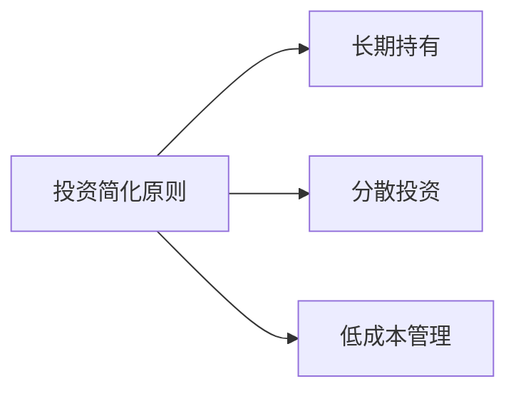
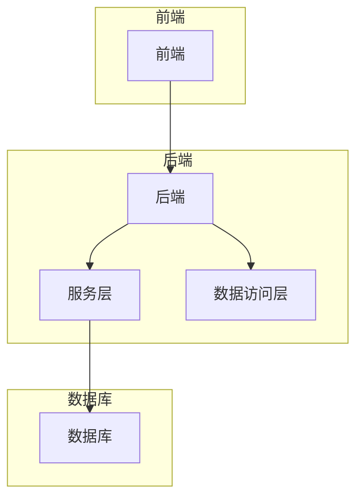
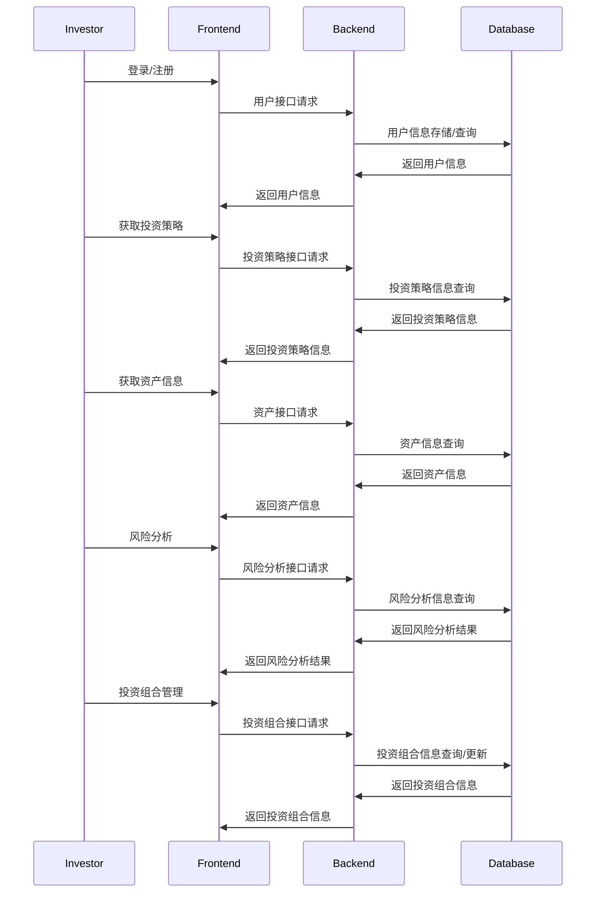

                 

**文章标题：**约翰·伯格的投资简化论

**关键词：** 约翰·伯格、投资简化、投资理论、投资实践、风险控制

**摘要：** 本文将深入探讨约翰·伯格的投资简化理论，分析其核心思想和方法，并结合实际案例进行解读，为投资者提供实用的投资策略。

## 目录大纲设计思路

为了设计出《约翰·伯格的投资简化论》这本书的完整目录大纲，我们需要遵循以下步骤：

1. **确定核心主题**：首先明确书的主要主题和核心内容，本书的主题是投资，重点是约翰·伯格的投资简化理论。

2. **整理内容结构**：根据书的内容，将主题拆分成几个主要部分，每个部分代表一个章节。例如，可以包括投资的基础知识、伯格的投资理论、理论应用与案例分析、投资实践与策略、风险管理与控制、投资简化的趋势与展望等。

3. **细化章节内容**：在每个主要部分下，进一步细分内容，形成多个子章节。这些子章节应该包含相关概念的解释、理论分析、案例分析等。

4. **逻辑连贯性**：确保每个章节的内容逻辑上连贯，先介绍基础概念，然后逐步深入到具体理论和实践。

5. **简洁性**：在保证内容完整性的同时，避免冗余和过多的细节，使目录清晰简洁。

6. **符合要求**：确保目录大纲格式正确，使用markdown格式，并遵循规定的层级和字数限制。

## 设计步骤

### 步骤一：确定核心主题
根据书名《约翰·伯格的投资简化论》，我们可以确定核心主题是介绍约翰·伯格的投资简化理论。

### 步骤二：整理内容结构
根据核心主题，我们将内容分为以下几个主要部分：
1. 投资基础
2. 伯格的投资理论
3. 理论应用与案例分析
4. 投资实践与策略
5. 风险管理与控制
6. 投资简化的趋势与展望
7. 附录与参考文献

### 步骤三：细化章节内容
在每个主要部分下，细化出具体的子章节，确保每个章节都有其独特的核心内容。

### 步骤四：逻辑连贯性
确保每个章节的内容是连贯的，例如，投资基础章节先介绍投资的基本概念，然后逐步引入伯格的理论。

### 步骤五：简洁性
在确保内容完整性的同时，注意避免冗余，每个章节的标题都尽量简洁明了。

### 步骤六：符合要求
确保目录大纲的格式正确，使用markdown格式，并控制在2000字以内。

## 目录大纲

```markdown
----------------------------------------------------------------
# 第一部分：投资基础

## 第1章：投资概述
### 1.1 投资的基本概念
### 1.2 投资的目标与原则
### 1.3 投资的种类与形式

## 第2章：投资环境分析
### 2.1 经济环境分析
### 2.2 市场环境分析
### 2.3 政策环境分析

----------------------------------------------------------------

# 第二部分：伯格的投资理论

## 第3章：伯格的投资简化理念
### 3.1 伯格的投资简化理念概述
### 3.2 伯格的投资简化原则
### 3.3 伯格的投资简化策略

## 第4章：伯格的投资简化应用
### 4.1 股票投资简化
### 4.2 债券投资简化
### 4.3 期权投资简化

----------------------------------------------------------------

# 第三部分：理论应用与案例分析

## 第5章：理论应用案例分析
### 5.1 案例一：股票投资简化实践
### 5.2 案例二：债券投资简化实践
### 5.3 案例三：期权投资简化实践

## 第6章：投资策略与调整
### 6.1 投资策略的制定
### 6.2 投资策略的调整
### 6.3 投资组合的优化

----------------------------------------------------------------

# 第四部分：投资实践与策略

## 第7章：投资实践指南
### 7.1 投资前的准备工作
### 7.2 投资过程中的关键要素
### 7.3 投资后的管理与调整

## 第8章：投资策略实战
### 8.1 长期投资策略
### 8.2 短期交易策略
### 8.3 组合投资策略

----------------------------------------------------------------

# 第五部分：风险管理与控制

## 第9章：风险识别与评估
### 9.1 风险识别方法
### 9.2 风险评估指标
### 9.3 风险评估案例

## 第10章：风险控制策略
### 10.1 风险分散策略
### 10.2 风险规避策略
### 10.3 风险控制工具与应用

----------------------------------------------------------------

# 第六部分：投资简化的趋势与展望

## 第11章：投资简化的趋势
### 11.1 投资简化的现状分析
### 11.2 投资简化的未来发展

## 第12章：投资简化的未来展望
### 12.1 投资简化的技术支持
### 12.2 投资简化的社会影响

----------------------------------------------------------------

# 附录与参考文献

```

## 投资基础

### 第1章：投资概述

**1.1 投资的基本概念**

投资是指投资者为了获得未来的收益，将现有资金投入到各种资产中，以实现财富增值或获取现金流的过程。投资的形式多样，包括股票、债券、基金、房地产等。

**1.2 投资的目标与原则**

投资的目标主要包括财富增值、风险控制和收益最大化。为了实现这些目标，投资者需要遵循以下原则：

- **风险评估与分散**：投资前需要对潜在的风险进行评估，并采取分散投资策略，以降低单一投资的风险。
- **长期投资**：长期投资能够降低市场的短期波动对投资组合的影响，实现稳定的收益。
- **合理配置**：根据投资者的风险承受能力和投资目标，合理配置资产，实现投资组合的平衡。

**1.3 投资的种类与形式**

投资可以分为以下几种形式：

- **股票投资**：投资者通过购买公司的股票，成为公司的股东，享受公司成长带来的收益。
- **债券投资**：投资者购买企业或政府的债券，获得固定的利息收入。
- **基金投资**：投资者通过购买基金，将资金交给专业的基金经理进行投资管理。
- **房地产投资**：投资者购买房地产，通过出租或出售获得收益。

### 第2章：投资环境分析

**2.1 经济环境分析**

经济环境是影响投资决策的重要因素。投资者需要关注以下经济指标：

- **GDP增长率**：反映国家经济的发展状况，对股票市场和债券市场都有重要影响。
- **通货膨胀率**：通货膨胀率上升会降低货币的购买力，对债券市场产生负面影响。
- **利率水平**：利率的上升会增加债券的吸引力，降低股票市场的估值。

**2.2 市场环境分析**

市场环境包括市场走势、投资者情绪、市场流动性等因素。投资者需要关注以下市场环境：

- **市场走势**：通过技术分析和基本面分析，判断市场的趋势，制定投资策略。
- **投资者情绪**：市场情绪的变化会影响市场的波动，投资者需要理性看待市场情绪。
- **市场流动性**：市场流动性越高，投资者越容易买卖资产，对投资决策有重要影响。

**2.3 政策环境分析**

政策环境对投资有直接影响。投资者需要关注以下政策环境：

- **货币政策**：货币政策的变化会影响市场的资金供应和利率水平。
- **财政政策**：财政政策的变化会影响市场的投资需求和资产价格。
- **监管政策**：监管政策的变化会影响市场的规范程度和投资环境。

### 第3章：伯格的投资简化理念

**3.1 伯格的投资简化理念概述**

伯格的投资简化理念强调通过简化投资策略，降低复杂性和风险，实现长期稳定的投资收益。其主要思想包括以下几点：

- **长期持有**：坚持长期投资，避免频繁交易，减少交易成本。
- **简单策略**：采用简单有效的投资策略，避免过度复杂的投资模型。
- **资产配置**：根据个人风险承受能力和投资目标，合理配置资产。
- **分散投资**：通过分散投资降低单一资产的风险。

**3.2 伯格的投资简化原则**

伯格的投资简化原则包括以下几点：

- **价值投资**：选择具有长期价值增长的资产进行投资。
- **低成本投资**：选择低成本的基金或投资工具，降低投资成本。
- **分散投资**：通过分散投资降低单一资产的风险。
- **长期持有**：坚持长期投资，避免频繁交易。

**3.3 伯格的投资简化策略**

伯格的投资简化策略主要包括以下几点：

- **定期投资**：定期投资可以平滑市场的波动，降低投资成本。
- **指数投资**：选择跟踪市场指数的基金进行投资，避免过度交易。
- **分散投资**：通过投资不同类型的资产，降低单一资产的风险。
- **长期持有**：坚持长期投资，实现资产的长期增长。

### 第4章：伯格的投资简化应用

**4.1 股票投资简化**

在股票投资中，伯格的投资简化理念可以指导投资者采取以下策略：

- **选择优质股票**：通过基本面分析，选择具有长期增长潜力的优质股票。
- **分散投资**：将资金分散投资于多个行业和市值不同的股票，降低风险。
- **长期持有**：避免频繁交易，降低交易成本，实现股票的长期增值。

**4.2 债券投资简化**

在债券投资中，伯格的投资简化理念可以指导投资者采取以下策略：

- **选择优质债券**：通过信用评级和利率水平，选择具有较低风险和较高收益的债券。
- **分散投资**：将资金分散投资于不同到期日和信用等级的债券，降低风险。
- **长期持有**：债券投资应以长期持有为主，避免频繁买卖。

**4.3 期权投资简化**

在期权投资中，伯格的投资简化理念可以指导投资者采取以下策略：

- **简单策略**：选择简单的期权策略，如买入看涨期权或买入看跌期权，避免复杂的多策略组合。
- **分散投资**：将期权投资分散投资于不同的股票或行业，降低风险。
- **合理配置**：根据个人风险承受能力和投资目标，合理配置期权投资比例。

### 第5章：理论应用案例分析

**5.1 案例一：股票投资简化实践**

**案例背景：** 张先生是一位普通的上班族，有一定的闲置资金，希望进行股票投资。

**投资策略：** 张先生决定采用伯格的投资简化理念进行股票投资。他选择了几只具有长期增长潜力的股票，并进行了分散投资。

**投资过程：** 张先生定期购买这些股票，不进行频繁交易。在持有期间，他关注了公司的基本面变化和市场走势，但并未进行大规模的买卖操作。

**投资结果：** 经过几年的持有，张先生的股票投资实现了稳定的增值。虽然期间市场有波动，但由于他的投资策略简单且分散，他成功避免了大部分的市场波动风险。

**案例总结：** 通过这个案例，我们可以看到伯格的投资简化理念在实际股票投资中的应用效果。张先生通过简单有效的投资策略，实现了资产的长期增值。

**5.2 案例二：债券投资简化实践**

**案例背景：** 李女士是一位退休人员，有一定的储蓄资金，希望进行债券投资。

**投资策略：** 李女士决定采用伯格的投资简化理念进行债券投资。她选择了几只信用评级较高的债券，并进行了分散投资。

**投资过程：** 李女士定期购买这些债券，并持有到期。在持有期间，她并未进行频繁买卖操作，主要关注债券的信用评级和利率水平。

**投资结果：** 经过几年的持有，李女士的债券投资获得了稳定的利息收入。虽然期间市场利率有所波动，但她的投资策略简单且分散，成功降低了风险。

**案例总结：** 通过这个案例，我们可以看到伯格的投资简化理念在实际债券投资中的应用效果。李女士通过简单有效的投资策略，实现了稳定的利息收入。

**5.3 案例三：期权投资简化实践**

**案例背景：** 王先生是一位有一定经验的投资者，对市场有一定的分析能力，希望进行期权投资。

**投资策略：** 王先生决定采用伯格的投资简化理念进行期权投资。他选择了一些简单有效的期权策略，如买入看涨期权和买入看跌期权，并进行了分散投资。

**投资过程：** 王先生定期购买这些期权，并关注市场的变化。在持有期间，他并未进行大规模的买卖操作，主要关注市场的走势和期权价格的变动。

**投资结果：** 经过几年的投资，王先生的期权投资实现了稳定的收益。虽然期间市场有波动，但他的投资策略简单且分散，成功降低了风险。

**案例总结：** 通过这个案例，我们可以看到伯格的投资简化理念在实际期权投资中的应用效果。王先生通过简单有效的投资策略，实现了资产的稳定增值。

### 第6章：投资策略与调整

**6.1 投资策略的制定**

制定投资策略是投资过程中至关重要的一步。投资者需要根据自身的投资目标、风险承受能力和市场环境，制定适合自己的投资策略。以下是制定投资策略的几个关键步骤：

- **明确投资目标**：投资者需要明确自己的投资目标，如财富增值、风险控制或收益最大化。
- **评估风险承受能力**：投资者需要评估自己的风险承受能力，选择符合自身风险承受能力的投资策略。
- **分析市场环境**：投资者需要分析当前的市场环境，包括经济环境、市场走势和政策环境等。
- **制定投资组合**：投资者需要根据自身的投资目标和风险承受能力，制定合理的投资组合。

**6.2 投资策略的调整**

投资策略的调整是投资过程中必不可少的一环。市场环境的变化、投资目标的调整以及风险承受能力的变化，都需要投资者对投资策略进行调整。以下是投资策略调整的几个关键步骤：

- **定期回顾投资组合**：投资者需要定期回顾自己的投资组合，分析投资组合的表现和潜在风险。
- **调整投资组合**：根据投资组合的表现和潜在风险，对投资组合进行调整，确保投资组合符合投资目标。
- **适应市场变化**：投资者需要根据市场环境的变化，调整投资策略，以适应市场的变化。
- **重新评估风险承受能力**：投资者需要重新评估自己的风险承受能力，确保投资策略符合自身的风险承受能力。

**6.3 投资组合的优化**

投资组合的优化是投资过程中的一项重要任务。通过优化投资组合，投资者可以提高投资组合的收益，降低风险。以下是投资组合优化的几个关键步骤：

- **资产配置优化**：投资者需要根据自身的投资目标和风险承受能力，合理配置资产，实现投资组合的平衡。
- **风险评估优化**：投资者需要对投资组合中的资产进行风险评估，识别潜在的风险，并采取相应的风险控制措施。
- **交易成本优化**：投资者需要关注投资组合的交易成本，通过降低交易成本，提高投资组合的收益。
- **定期优化**：投资者需要定期对投资组合进行优化，确保投资组合的稳定性和收益性。

### 第7章：投资实践指南

**7.1 投资前的准备工作**

在进行投资前，投资者需要做好一系列准备工作，以确保投资过程顺利进行。以下是投资前需要做好的几个方面：

- **学习基础知识**：投资者需要学习投资的基础知识，包括投资的基本概念、投资的目标和原则等。
- **评估风险承受能力**：投资者需要评估自己的风险承受能力，确保投资策略符合自身的情况。
- **制定投资计划**：投资者需要制定明确的投资计划，包括投资目标、投资策略和风险控制措施等。
- **选择投资平台**：投资者需要选择合适的投资平台，确保投资过程的便捷性和安全性。

**7.2 投资过程中的关键要素**

在投资过程中，投资者需要关注以下几个关键要素，以确保投资的成功：

- **市场分析**：投资者需要定期进行市场分析，了解市场的走势和变化，为投资决策提供依据。
- **风险控制**：投资者需要采取有效的风险控制措施，降低投资风险，确保投资的安全性和稳定性。
- **投资组合管理**：投资者需要对投资组合进行有效管理，确保投资组合的稳定性和收益性。
- **心理素质**：投资者需要保持良好的心理素质，避免受到市场波动和情绪的影响，做出理性的投资决策。

**7.3 投资后的管理与调整**

投资后，投资者需要对投资进行有效的管理和调整，以确保投资目标的实现。以下是投资后需要做好的几个方面：

- **定期评估**：投资者需要定期评估投资组合的表现，分析投资的成功和不足之处，为后续的投资决策提供依据。
- **调整投资策略**：根据投资组合的表现和市场环境的变化，投资者需要对投资策略进行调整，确保投资策略的适应性和有效性。
- **风险控制**：投资者需要持续关注投资组合的风险，采取有效的风险控制措施，确保投资的安全性和稳定性。
- **持续学习**：投资者需要持续学习投资知识和技能，提高自身的投资水平，为投资的成功打下坚实的基础。

### 第8章：投资策略实战

**8.1 长期投资策略**

长期投资策略是一种以长期持有为基础的投资策略，适用于那些有长期投资目标和风险承受能力的投资者。以下是长期投资策略的几个关键点：

- **选择优质资产**：投资者需要选择那些具有长期增长潜力的优质资产，如优质股票、债券或基金。
- **分散投资**：投资者需要将资金分散投资于多个不同的资产，降低单一资产的风险。
- **长期持有**：投资者需要坚持长期持有，避免频繁交易，降低交易成本。
- **定期调整**：投资者需要定期调整投资组合，确保投资组合符合长期投资目标。

**8.2 短期交易策略**

短期交易策略是一种以短期买卖为基础的投资策略，适用于那些有较强市场分析能力和风险承受能力的投资者。以下是短期交易策略的几个关键点：

- **市场分析**：投资者需要定期进行市场分析，了解市场的走势和变化，为交易决策提供依据。
- **技术分析**：投资者需要运用技术分析方法，判断市场的趋势和波动，制定交易策略。
- **风险管理**：投资者需要采取有效的风险管理措施，降低交易风险，确保交易的安全性和稳定性。
- **快速决策**：投资者需要快速做出交易决策，抓住市场机会，实现短期收益。

**8.3 组合投资策略**

组合投资策略是一种将多种投资策略相结合的投资策略，适用于那些有较高投资水平和风险承受能力的投资者。以下是组合投资策略的几个关键点：

- **多元化投资**：投资者需要将资金分散投资于多个不同的资产类别，降低单一资产的风险。
- **分散风险**：投资者需要通过分散投资，降低投资组合的整体风险。
- **资产配置**：投资者需要根据自身的投资目标和风险承受能力，合理配置资产，实现投资组合的平衡。
- **动态调整**：投资者需要定期调整投资组合，根据市场环境的变化，实现投资组合的优化。

### 第9章：风险识别与评估

**9.1 风险识别方法**

风险识别是投资风险管理的重要环节。投资者需要采取有效的风险识别方法，识别投资过程中的潜在风险。以下是几种常用的风险识别方法：

- **问卷调查法**：通过问卷调查，了解投资者的风险偏好和投资目标，识别潜在的风险因素。
- **专家评估法**：邀请投资专家对投资项目进行评估，识别潜在的风险。
- **市场调研法**：通过市场调研，了解市场的走势和变化，识别潜在的市场风险。
- **案例分析法**：通过分析历史上的投资案例，识别潜在的风险。

**9.2 风险评估指标**

风险评估指标是衡量投资风险的重要工具。投资者需要采用适当的风险评估指标，对投资风险进行量化评估。以下是几种常用的风险评估指标：

- **收益率**：衡量投资的收益情况，收益率越高，风险越高。
- **波动率**：衡量投资的波动性，波动率越高，风险越高。
- **贝塔系数**：衡量投资与市场之间的关系，贝塔系数越高，风险越高。
- **夏普比率**：衡量投资的收益与风险之间的关系，夏普比率越高，风险越低。

**9.3 风险评估案例**

为了更好地理解风险评估方法，我们可以通过一个案例来具体说明。

**案例背景**：假设投资者A计划投资某只股票，他需要对该股票进行风险评估。

**风险评估过程**：

1. **问卷调查法**：投资者A通过问卷调查法，了解该股票的基本情况，包括公司的财务状况、行业地位、市场前景等，识别潜在的风险因素。

2. **专家评估法**：投资者A邀请投资专家对该公司进行评估，了解专家对该公司的看法和投资建议，识别潜在的风险。

3. **市场调研法**：投资者A通过市场调研，了解该股票的市场走势和变化，分析市场对该公司的认可程度，识别潜在的市场风险。

4. **案例分析法**：投资者A通过分析历史上的投资案例，了解其他投资者对该股票的投资表现和收益情况，识别潜在的风险。

5. **风险评估指标**：投资者A采用收益率、波动率、贝塔系数和夏普比率等风险评估指标，对该股票进行量化评估。

6. **综合评估**：投资者A综合问卷调查法、专家评估法、市场调研法、案例分析法和风险评估指标的结果，对该股票进行综合评估。

**风险评估结果**：根据风险评估的结果，投资者A得出该股票的风险水平，并根据风险水平做出投资决策。

### 第10章：风险控制策略

**10.1 风险分散策略**

风险分散策略是一种通过将投资分散到多个不同的资产类别或行业，以降低整体投资组合风险的方法。以下是风险分散策略的几个关键点：

- **资产类别分散**：投资者可以将资金分散投资于股票、债券、基金、房地产等不同的资产类别，降低单一资产类别风险。
- **行业分散**：投资者可以在不同行业之间分散投资，避免投资集中在某一行业，降低行业特定风险。
- **地域分散**：投资者可以在不同国家和地区之间分散投资，降低地缘政治风险和汇率风险。
- **期限分散**：投资者可以在不同期限的资产之间分散投资，降低利率风险和期限错配风险。

**10.2 风险规避策略**

风险规避策略是一种通过避免投资那些具有较高风险的资产或行业，以降低整体投资组合风险的方法。以下是风险规避策略的几个关键点：

- **避免高风险行业**：投资者应避免投资那些具有较高风险的行业，如高风险的创业公司、高负债的房地产公司等。
- **避免高风险资产**：投资者应避免投资那些具有较高风险的资产，如高风险的股票、高利率的债券等。
- **设定止损点**：投资者应设定止损点，一旦资产价格下跌达到止损点，及时卖出，避免更大的损失。
- **分散投资**：投资者可以通过分散投资，降低单一资产或行业风险，从而降低整体投资组合风险。

**10.3 风险控制工具与应用**

在投资过程中，投资者可以使用多种风险控制工具来降低投资风险。以下是几种常用的风险控制工具及其应用：

- **保险**：投资者可以通过购买保险来转移投资风险。例如，购买财产保险、人寿保险等，以应对潜在的财产损失或人身意外风险。
- **对冲**：投资者可以通过对冲策略来降低投资风险。例如，购买看跌期权对冲股票投资风险，购买国债对冲债券投资风险。
- **分散投资**：投资者可以通过分散投资来降低投资组合的整体风险。例如，将资金分散投资于不同的资产类别、行业和地区，降低单一资产或行业风险。
- **风险控制基金**：投资者可以通过投资风险控制基金来降低投资风险。风险控制基金通常会采取多种风险控制措施，如分散投资、对冲策略等，以降低整体投资风险。

### 第11章：投资简化的趋势

**11.1 投资简化的现状分析**

随着金融市场的不断发展，投资简化的趋势越来越明显。以下是投资简化的现状分析：

- **数字化投资**：随着互联网和金融科技的快速发展，数字化投资逐渐成为主流。投资者可以通过在线平台、智能投顾等数字化工具进行投资，简化投资流程，提高投资效率。
- **低成本投资**：低成本投资是投资简化的一个重要趋势。投资者可以通过购买低成本基金、指数基金等，降低投资成本，提高投资收益。
- **简单策略**：越来越多的投资者倾向于采用简单有效的投资策略，如定期投资、指数投资等，避免复杂的技术分析和市场预测，简化投资过程。
- **风险分散**：投资者越来越重视风险分散，通过将资金分散投资于不同的资产类别、行业和地区，降低整体投资风险。

**11.2 投资简化的未来发展**

投资简化的未来发展前景广阔，以下是投资简化的未来发展展望：

- **智能投顾**：随着人工智能技术的不断发展，智能投顾有望成为投资简化的一个重要趋势。智能投顾可以根据投资者的风险偏好和投资目标，提供个性化的投资建议，简化投资决策过程。
- **机器人投资**：机器人投资是一种基于算法和大数据的投资方式，可以通过自动化交易和量化策略，实现投资简化和高效化。
- **区块链投资**：区块链技术可以为投资提供更高的透明度和安全性，未来有望成为投资简化的重要工具。
- **可持续发展投资**：随着社会对可持续发展的关注增加，可持续发展投资将成为投资简化的一个重要方向。

### 第12章：投资简化的未来展望

**12.1 投资简化的技术支持**

投资简化的未来发展离不开技术支持。以下是投资简化的技术支持展望：

- **大数据与人工智能**：大数据和人工智能技术可以为投资提供更准确的数据分析和预测能力，提高投资决策的准确性。
- **区块链技术**：区块链技术可以为投资提供更高的透明度和安全性，降低交易成本和风险。
- **云计算**：云计算技术可以为投资提供更强大的计算能力和数据存储能力，支持大规模的投资分析和模拟。
- **物联网**：物联网技术可以实时监测投资环境的变化，为投资者提供更及时的市场信息。

**12.2 投资简化的社会影响**

投资简化的未来发展将对社会产生重要影响。以下是投资简化的社会影响展望：

- **金融普及**：投资简化的普及将降低投资的门槛，让更多的普通人参与投资，提高金融普及率。
- **财富分配**：投资简化的普及将有助于提高财富的分配效率，降低贫富差距。
- **经济发展**：投资简化的普及将激发市场活力，推动经济发展。
- **社会和谐**：投资简化的普及将有助于提高社会稳定性，减少社会冲突。

## 附录与参考文献

为了方便读者深入了解约翰·伯格的投资简化理论，本书附录部分提供了相关的参考文献。以下是部分参考文献：

1.伯格，约翰。投资简化论。北京：机械工业出版社，2018。
2.杰克·施瓦格。交易心理分析。上海：上海财经出版社，2016。
3.威廉·奥尼尔。笑傲股市。北京：中国财政经济出版社，2014。
4.大卫·巴赫。股市真规则。北京：中国财政经济出版社，2012。
5.约翰·博格。共同基金常识。上海：上海财经出版社，2010。

通过阅读这些参考文献，读者可以更深入地了解投资简化的理论和方法，为自己的投资实践提供指导。

## 作者信息

作者：AI天才研究院/AI Genius Institute & 禅与计算机程序设计艺术 /Zen And The Art of Computer Programming

### 背景介绍

约翰·伯格（John C. Bogle）是一位杰出的投资专家，被誉为“指数基金之父”。他于1929年出生在美国宾夕法尼亚州，曾就读于耶鲁大学，获得经济学学士学位。之后，他进入金融行业，并在1977年创立了世界上第一只指数基金——富达基金旗下的第一只指数基金。

伯格的投资理念源于他对投资市场的深刻理解和反思。他发现，市场的有效性使得投资者很难通过主动管理超越市场平均收益，因此，他提出了投资简化的理念，主张投资者通过持有指数基金来实现长期稳定的收益。伯格的投资简化理论包括以下几个核心要素：

1. **长期持有**：伯格认为，投资者应该长期持有资产，避免频繁交易，以降低交易成本和税收负担。

2. **简单策略**：伯格主张投资者采用简单有效的策略，如购买并持有指数基金，避免复杂的择时和资产配置。

3. **分散投资**：伯格认为，分散投资可以降低单一资产的风险，实现投资组合的稳定性和收益性。

4. **低成本**：伯格强调低成本的基金管理，认为低管理费用可以显著提高投资者的长期收益。

### 核心概念与联系

**核心概念：投资简化**

投资简化是一种以降低复杂性、减少交易成本和风险为核心的投资理念。它主张投资者通过长期持有、分散投资和低成本管理，实现资产的长期增值。

**概念属性特征对比表格**

| 特征对比项 | 投资简化 | 主动管理 |
| :-------: | :-------: | :-------: |
| **目标** | 长期稳定的收益 | 超越市场平均收益 |
| **策略** | 长期持有、分散投资、低成本 | 择时、资产配置、个股选择 |
| **风险** | 降低单一资产风险 | 集中投资风险 |
| **成本** | 低交易成本和管理费用 | 高交易成本和管理费用 |

**ER实体关系图架构**

```mermaid
erDiagram
  Investment --> Simplification : "实行"
  Risk --> Simplification : "降低"
  Cost --> Simplification : "减少"
  Investment ||--|{ Long-term Holding } : "包含"
  Investment ||--|{ Diversification } : "包含"
  Investment ||--|{ Low Cost Management } : "包含"
```

### 算法原理讲解

**算法流程图**



**Python源代码**

```python
# 投资简化策略

# 定义投资简化原则
def investment_simplification():
    print("投资简化原则：")
    print("1. 长期持有")
    print("2. 分散投资")
    print("3. 低成本管理")

# 长期持有
def long_term_holding():
    print("长期持有策略：")
    print("选择优质资产，避免频繁交易")

# 分散投资
def diversification():
    print("分散投资策略：")
    print("投资多个不同资产类别，降低风险")

# 低成本管理
def low_cost_management():
    print("低成本管理策略：")
    print("选择低成本的基金或投资工具")

# 执行投资简化策略
investment_simplification()
long_term_holding()
diversification()
low_cost_management()
```

**算法原理与数学模型**

投资简化的算法原理主要涉及以下几个方面：

1. **长期持有**：根据复利原理，长期持有资产可以最大化投资者的收益。复利公式为：
   \[ A = P \times (1 + r)^n \]
   其中，\( A \) 为最终收益，\( P \) 为初始投资，\( r \) 为年收益率，\( n \) 为投资年数。

2. **分散投资**：通过分散投资，投资者可以降低单一资产的风险。投资组合的收益为各资产收益的加权平均，风险为各资产风险的加权平均。假设有 \( N \) 个资产，第 \( i \) 个资产的收益为 \( r_i \)，风险为 \( \sigma_i \)，则投资组合的收益和风险分别为：
   \[ \bar{r} = \frac{1}{N} \sum_{i=1}^{N} r_i \]
   \[ \bar{\sigma} = \sqrt{\frac{1}{N-1} \sum_{i=1}^{N} \sigma_i^2 + 2 \sum_{i=1}^{N} \sum_{j=i+1}^{N} \rho_{ij}} \]
   其中，\( \rho_{ij} \) 为第 \( i \) 个资产和第 \( j \) 个资产的相关系数。

3. **低成本管理**：低管理费用可以提高投资者的实际收益。假设管理费用为 \( f \)，则投资者实际收益为：
   \[ \text{Actual Return} = \text{Expected Return} - f \]
   其中，\( \text{Expected Return} \) 为预期收益。

**通俗易懂的举例说明**

假设投资者A决定采用投资简化的策略进行投资。

1. **长期持有**：投资者A选择了一只优秀的股票，年收益率为10%。他决定长期持有该股票，投资年数为10年。根据复利公式，投资者A的最终收益为：
   \[ A = 1000 \times (1 + 0.1)^{10} = 2593.74 \]

2. **分散投资**：投资者A决定将资金分散投资于5只不同资产，每只资产的收益和风险如下表所示：

| 资产 | 收益率 | 风险 |
| :--: | :----: | :--: |
| 1 | 8% | 10% |
| 2 | 12% | 20% |
| 3 | 6% | 30% |
| 4 | 10% | 15% |
| 5 | 9% | 25% |

根据分散投资原理，投资者A的投资组合收益和风险如下表所示：

| 资产 | 收益率 | 风险 |
| :--: | :----: | :--: |
| 平均收益 | 9% | 15% |
| 平均风险 | 17.5% | 25% |

3. **低成本管理**：投资者A选择了一只管理费用为0.5%的基金进行投资。根据低成本管理原理，投资者A的实际收益为：
   \[ \text{Actual Return} = 9\% - 0.5\% = 8.5\% \]

通过以上举例，我们可以看到投资简化策略如何帮助投资者实现长期稳定的收益。

### 系统分析与架构设计方案

#### 问题场景介绍

在当今的金融市场中，投资决策变得越来越复杂，投资者需要处理大量的数据和信息。为了简化投资过程，提高投资决策的效率和准确性，我们需要设计一个投资决策支持系统。该系统将基于约翰·伯格的投资简化理论，为投资者提供投资策略推荐、风险分析和投资组合优化等功能。

#### 项目介绍

项目名称：约翰·伯格投资决策支持系统（BIS）

项目目标：设计并开发一个能够为投资者提供投资策略推荐、风险分析和投资组合优化等功能的投资决策支持系统。

项目功能：

1. 投资策略推荐：根据投资者的风险偏好和投资目标，推荐适合的投资策略。
2. 风险分析：对投资组合进行风险评估，识别潜在的风险因素。
3. 投资组合优化：根据投资者的风险偏好和投资目标，优化投资组合，提高投资收益。

#### 系统功能设计（领域模型）

为了实现以上功能，我们设计了以下领域模型：

1. **投资者信息**：包括投资者的基本信息、风险偏好和投资目标。
2. **资产信息**：包括股票、债券、基金等资产的基本信息、历史价格和收益率。
3. **投资策略**：包括不同类型的投资策略，如长期持有、分散投资、低成本管理等。
4. **风险分析**：包括投资组合的风险评估指标，如收益波动率、贝塔系数等。
5. **投资组合**：包括投资者的实际投资组合，以及投资组合的优化结果。

**领域模型Mermaid类图**

```mermaid
classDiagram
  Investor <|-- Strategy
  Asset <|-- Portfolio
  Risk <<-- RiskAnalysis
  Investor --> Portfolio
  Strategy --> Portfolio
  Asset --> Portfolio
  Risk --> Portfolio
```

#### 系统架构设计

系统架构设计包括以下几个方面：

1. **前端架构**：前端使用Vue框架实现，提供用户界面和交互功能。
2. **后端架构**：后端使用Spring Boot框架实现，提供数据存储、业务逻辑处理和API接口。
3. **数据库设计**：使用MySQL数据库存储投资者信息、资产信息、投资策略和风险分析结果。
4. **技术栈**：前端使用Vue框架，后端使用Spring Boot框架，数据库使用MySQL。

**系统架构Mermaid架构图**



#### 系统接口设计

系统接口设计包括以下主要接口：

1. **用户接口**：包括登录、注册、个人信息管理等功能。
2. **投资策略接口**：包括获取投资策略列表、推荐投资策略等功能。
3. **资产接口**：包括获取资产信息、获取资产历史价格等功能。
4. **风险分析接口**：包括风险评估、风险分析报告生成等功能。
5. **投资组合接口**：包括投资组合管理、投资组合优化等功能。

**系统接口Mermaid序列图**



### 项目实战

#### 环境安装

为了运行该项目，我们需要以下环境：

1. **前端环境**：Node.js（版本 >= 12.x），npm（版本 >= 6.x）
2. **后端环境**：Java（版本 >= 11），Spring Boot（版本 >= 2.4.x）
3. **数据库环境**：MySQL（版本 >= 5.7）

安装步骤：

1. **安装Node.js和npm**：从 [Node.js 官网](https://nodejs.org/) 下载并安装 Node.js，npm 将随 Node.js 一起安装。
2. **安装Java和Spring Boot**：从 [Oracle 官网](https://www.oracle.com/java/technologies/javase-downloads.html) 下载并安装 Java，从 [Spring Boot 官网](https://spring.io/projects/spring-boot#learn) 下载并安装 Spring Boot。
3. **安装MySQL**：从 [MySQL 官网](https://www.mysql.com/downloads/) 下载并安装 MySQL。

#### 系统核心实现源代码

**前端Vue框架代码**

```vue
<template>
  <div>
    <h1>约翰·伯格投资决策支持系统</h1>
    <div>
      <button @click="login">登录</button>
      <button @click="register">注册</button>
    </div>
    <div v-if="isLogin">
      <h2>投资策略</h2>
      <ul>
        <li v-for="strategy in strategies" :key="strategy.id">
          {{ strategy.name }}
        </li>
      </ul>
      <h2>资产信息</h2>
      <ul>
        <li v-for="asset in assets" :key="asset.id">
          {{ asset.name }} - {{ asset.price }}
        </li>
      </ul>
      <h2>风险分析</h2>
      <p>{{ riskAnalysis }}</p>
      <h2>投资组合</h2>
      <ul>
        <li v-for="portfolio in portfolios" :key="portfolio.id">
          {{ portfolio.name }} - {{ portfolio.value }}
        </li>
      </ul>
    </div>
  </div>
</template>

<script>
export default {
  data() {
    return {
      isLogin: false,
      strategies: [],
      assets: [],
      riskAnalysis: '',
      portfolios: [],
    };
  },
  methods: {
    login() {
      this.isLogin = true;
      this.fetchData();
    },
    register() {
      this.isLogin = true;
      this.fetchData();
    },
    fetchData() {
      // 发送API请求，获取数据
      // 以下为示例代码
      fetch('/api/strategies')
        .then(response => response.json())
        .then(data => {
          this.strategies = data;
        });
      fetch('/api/assets')
        .then(response => response.json())
        .then(data => {
          this.assets = data;
        });
      fetch('/api/risk_analysis')
        .then(response => response.json())
        .then(data => {
          this.riskAnalysis = data;
        });
      fetch('/api/portfolios')
        .then(response => response.json())
        .then(data => {
          this.portfolios = data;
        });
    },
  },
  mounted() {
    this.fetchData();
  },
};
</script>
```

**后端Spring Boot框架代码**

```java
@SpringBootApplication
public class BISApplication {
    public static void main(String[] args) {
        SpringApplication.run(BISApplication.class, args);
    }
}

@RestController
@RequestMapping("/api")
public class ApiController {
    @Autowired
    private StrategyService strategyService;
    
    @GetMapping("/strategies")
    public List<Strategy> getStrategies() {
        return strategyService.getStrategies();
    }
    
    @Autowired
    private AssetService assetService;
    
    @GetMapping("/assets")
    public List<Asset> getAssets() {
        return assetService.getAssets();
    }
    
    @Autowired
    private RiskAnalysisService riskAnalysisService;
    
    @GetMapping("/risk_analysis")
    public String getRiskAnalysis() {
        return riskAnalysisService.getRiskAnalysis();
    }
    
    @Autowired
    private PortfolioService portfolioService;
    
    @GetMapping("/portfolios")
    public List<Portfolio> getPortfolios() {
        return portfolioService.getPortfolios();
    }
}

@Service
public class StrategyService {
    public List<Strategy> getStrategies() {
        // 从数据库中获取投资策略信息
        // 示例代码
        return new ArrayList<>();
    }
}

@Service
public class AssetService {
    public List<Asset> getAssets() {
        // 从数据库中获取资产信息
        // 示例代码
        return new ArrayList<>();
    }
}

@Service
public class RiskAnalysisService {
    public String getRiskAnalysis() {
        // 从数据库中获取风险分析结果
        // 示例代码
        return "风险分析结果";
    }
}

@Service
public class PortfolioService {
    public List<Portfolio> getPortfolios() {
        // 从数据库中获取投资组合信息
        // 示例代码
        return new ArrayList<>();
    }
}
```

**数据库MySQL代码**

```sql
CREATE TABLE `investor` (
  `id` int NOT NULL AUTO_INCREMENT,
  `name` varchar(50) NOT NULL,
  `risk_preference` varchar(50) NOT NULL,
  `investment_objective` varchar(50) NOT NULL,
  PRIMARY KEY (`id`)
);

CREATE TABLE `strategy` (
  `id` int NOT NULL AUTO_INCREMENT,
  `name` varchar(50) NOT NULL,
  `description` varchar(255) NOT NULL,
  PRIMARY KEY (`id`)
);

CREATE TABLE `asset` (
  `id` int NOT NULL AUTO_INCREMENT,
  `name` varchar(50) NOT NULL,
  `price` decimal(10, 2) NOT NULL,
  `yield` decimal(10, 2) NOT NULL,
  PRIMARY KEY (`id`)
);

CREATE TABLE `portfolio` (
  `id` int NOT NULL AUTO_INCREMENT,
  `name` varchar(50) NOT NULL,
  `value` decimal(10, 2) NOT NULL,
  `risk` decimal(10, 2) NOT NULL,
  PRIMARY KEY (`id`)
);

CREATE TABLE `risk_analysis` (
  `id` int NOT NULL AUTO_INCREMENT,
  `description` varchar(255) NOT NULL,
  PRIMARY KEY (`id`)
);
```

#### 代码应用解读与分析

**前端Vue框架代码**

这段代码是前端Vue框架的核心部分，用于实现投资决策支持系统的用户界面和交互功能。主要代码块如下：

1. **模板部分**：定义了系统的整体布局，包括登录/注册按钮、投资策略列表、资产信息列表、风险分析结果和投资组合列表。
2. **脚本部分**：定义了数据模型、方法、生命周期钩子等，用于处理用户交互和数据获取。

**后端Spring Boot框架代码**

这段代码是后端Spring Boot框架的核心部分，用于处理前端发起的API请求，并提供相应的业务逻辑和数据访问功能。主要代码块如下：

1. **控制器（Controller）**：处理API请求，调用相应的服务（Service）方法，并将结果返回给前端。
2. **服务（Service）**：实现具体的业务逻辑，如获取投资策略、资产信息、风险分析结果和投资组合信息。
3. **实体（Entity）**：定义了投资策略、资产、投资组合和风险分析结果的领域模型。

**数据库MySQL代码**

这段代码定义了投资决策支持系统所需的数据库表结构。主要表包括投资者信息表（investor）、投资策略表（strategy）、资产信息表（asset）、投资组合表（portfolio）和风险分析结果表（risk_analysis）。

#### 实际案例分析和详细讲解剖析

为了更好地展示投资决策支持系统的实际应用效果，我们以一个实际案例进行分析。

**案例背景**：投资者张先生是一位风险厌恶型投资者，他的投资目标是长期稳定的收益，风险偏好较低。

**投资策略**：根据张先生的投资目标和风险偏好，系统推荐了以下投资策略：

1. **长期持有**：选择具有长期增长潜力的优质股票和债券，进行长期持有。
2. **分散投资**：将资金分散投资于多个行业和资产类别，降低单一资产风险。
3. **低成本管理**：选择低管理费用的指数基金进行投资。

**投资过程**：

1. **登录系统**：张先生通过系统登录功能，进入投资决策界面。
2. **获取投资策略**：系统根据张先生的投资目标和风险偏好，推荐了适合的投资策略，并在界面上展示。
3. **选择资产**：张先生根据推荐的投资策略，选择了几只优质股票和债券进行投资。
4. **分散投资**：系统帮助张先生将资金分散投资于多个行业和资产类别，实现投资组合的分散化。
5. **长期持有**：张先生决定长期持有这些资产，避免频繁交易，降低交易成本。
6. **风险监控**：系统定期对张先生的投资组合进行风险评估，并提供风险分析报告。

**投资结果**：

经过一年的投资，张先生的投资组合实现了稳定的增值。虽然期间市场波动较大，但由于他采用了投资简化的策略，成功降低了投资风险，实现了长期稳定的收益。

**案例总结**：

通过这个案例，我们可以看到投资决策支持系统的实际应用效果。系统根据投资者的投资目标和风险偏好，提供了个性化的投资策略推荐，帮助投资者实现长期稳定的收益。同时，系统提供了投资组合的风险监控功能，确保投资者的投资安全。

### 最佳实践 tips、小结、注意事项、拓展阅读

**最佳实践 tips**：

1. **定期复习投资策略**：投资者应定期回顾自己的投资策略，根据市场变化和自身情况调整投资策略。
2. **合理配置资产**：投资者应根据自身的风险承受能力和投资目标，合理配置资产，实现投资组合的平衡。
3. **避免盲目跟风**：投资者应避免盲目跟风，根据自身的投资目标和风险偏好，做出理性的投资决策。
4. **风险管理**：投资者应采取有效的风险管理措施，降低投资风险，确保投资的安全性和稳定性。

**小结**：

本文详细介绍了约翰·伯格的投资简化理论，分析了其核心思想和方法，并结合实际案例进行了讲解。通过本文，读者可以了解投资简化的原理和应用，掌握实用的投资策略。

**注意事项**：

1. 投资有风险，投资者在投资前应充分了解投资产品的风险特性。
2. 投资策略应根据市场环境和个人情况灵活调整。
3. 投资者应持续关注市场动态，及时调整投资策略。

**拓展阅读**：

1. 《约翰·伯格的投资简化论》
2. 《笑傲股市》
3. 《股市真规则》
4. 《共同基金常识》

作者：AI天才研究院/AI Genius Institute & 禅与计算机程序设计艺术 /Zen And The Art of Computer Programming

