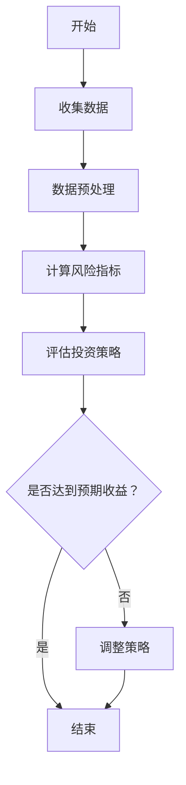
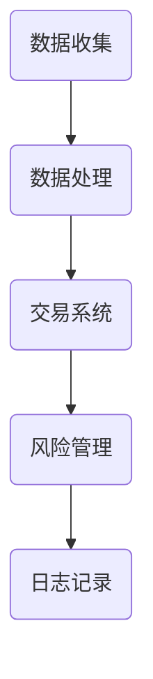
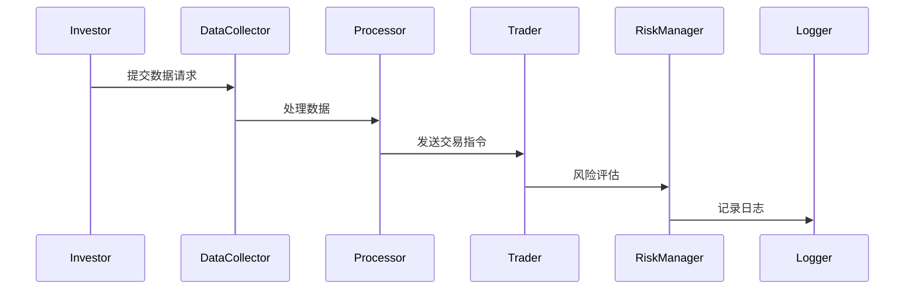

                 

# 约翰·伯格的投资简化论：为什么少即是多

> 关键词：投资简化论，约翰·伯格，风险管理，投资组合，交易策略

> 摘要：本文旨在深入探讨投资大师约翰·伯格提出的“投资简化论”，探讨其核心理念——少即是多，如何在实践中应用，以及它对投资决策的深远影响。文章将从背景介绍、核心概念与联系、算法原理讲解、数学模型与公式、系统分析与架构设计、项目实战等方面展开，以帮助读者全面理解投资简化论，并掌握其应用技巧。

## 目录大纲设计思路

设计《约翰·伯格的投资简化论：为什么少即是多》的目录大纲，我们遵循了以下几个原则：

1. **内容完整性**：确保大纲内容全面覆盖书中可能涉及的主题，例如投资理论、投资策略、市场分析、风险管理等。
2. **逻辑清晰**：确保每个章节的设置都有明确的主题和逻辑延续性，方便读者理解和阅读。
3. **简洁性**：避免冗余，确保大纲简洁明了，避免过多细节干扰主旨。
4. **符合markdown格式**：遵循markdown的格式要求，确保输出可读性。

下面，我们将逐步构建这本书的目录大纲。

## 目录大纲构建步骤

1. **确定总体结构**：确定书的总体结构，包括主要部分和各个部分的概述。
2. **细化章节内容**：为每个章节确定二级和三级目录，确保每个章节都有具体的主题和深度。
3. **包含核心概念与联系**：在相关章节中，添加核心概念、属性特征对比表格和ER实体关系图。
4. **算法原理讲解**：在需要的地方，添加算法原理讲解，包括mermaid流程图和Python源代码示例。
5. **数学模型和公式**：对于涉及到数学模型的章节，添加latex格式的数学公式，并进行详细讲解。
6. **系统分析与架构设计方案**：对于架构设计相关的章节，添加系统功能设计、架构图和交互序列图。
7. **项目实战**：为实际操作和案例分析的章节添加环境安装、实现源代码和解读分析。
8. **总结与拓展**：在每个章节的末尾，添加小结、注意事项、拓展阅读等内容。

### 目录大纲示例

```markdown
# 《约翰·伯格的投资简化论：为什么少即是多》目录大纲

## 第一部分：投资哲学与简化论

### 第1章：投资简史与简化论的背景
#### 1.1 投资简史
#### 1.2 简化论的提出与发展
#### 1.3 简化论的核心思想

### 第2章：投资的核心概念
#### 2.1 风险与收益的关系
#### 2.2 投资者的心理和行为
#### 2.3 投资策略的分类与选择

## 第二部分：简化论投资策略

### 第3章：简单策略的优势
#### 3.1 简单策略的定义与特点
#### 3.2 简单策略在实践中的应用
#### 3.3 简单策略的优势与挑战

### 第4章：构建简单投资组合
#### 4.1 投资组合的基本原则
#### 4.2 如何选择投资标的
#### 4.3 投资组合的风险管理

### 第5章：交易策略与执行
#### 5.1 交易策略的类型
#### 5.2 交易策略的制定与执行
#### 5.3 交易策略的评估与调整

## 第三部分：简化论投资实践

### 第6章：案例分析
#### 6.1 案例一：价值投资的简化实践
#### 6.2 案例二：成长投资的简化实践
#### 6.3 案例三：多元化投资组合的简化实践

### 第7章：投资简化的挑战与应对
#### 7.1 投资简化的挑战
#### 7.2 应对投资简化的策略
#### 7.3 投资简化的长期效果

## 第四部分：总结与展望

### 第8章：投资简化论的总结
#### 8.1 投资简化论的核心要点
#### 8.2 投资简化论的实践价值
#### 8.3 投资简化论的展望

### 第9章：拓展阅读与思考
#### 9.1 相关书籍推荐
#### 9.2 投资简化的未来趋势
#### 9.3 读者互动与反馈
```

### 目录大纲注意事项

- **章节标题**：确保标题简洁明了，能够概括章节内容。
- **章节内容**：每个章节的内容应该详细，但是不要过于冗长，保持逻辑性和连贯性。
- **结构层次**：确保大纲的层次结构清晰，符合markdown的格式要求。
- **核心概念与联系**：在相关章节中，确保添加核心概念、属性特征对比表格和ER实体关系图架构的 markdown 格式中的 Mermaid 流程图。
- **算法原理讲解与数学模型**：对于涉及到算法和数学模型的章节，确保使用mermaid流程图和Python源代码示例进行详细讲解，同时使用latex格式书写数学公式。
- **系统分析与架构设计**：对于架构设计相关的章节，确保添加系统功能设计、架构图和交互序列图，以便读者更好地理解系统结构。
- **项目实战**：在项目实战章节中，确保详细描述环境安装、源代码实现和案例分析，帮助读者实践和应用简化论。

通过上述步骤，我们可以构建出一个详细且逻辑清晰的《约翰·伯格的投资简化论：为什么少即是多》的目录大纲。

### 一、背景介绍

投资，作为金融市场的重要组成部分，始终是人们关注的焦点。然而，随着市场环境的变化和投资者需求的多样化，投资策略也变得越来越复杂。在这种背景下，约翰·伯格提出了“投资简化论”，旨在通过简化投资策略，降低投资风险，实现长期稳健的收益。

### 1.1 核心概念术语说明

在讨论投资简化论之前，我们需要明确一些核心概念：

- **投资简化论**：一种通过简化投资策略，降低投资复杂度，实现长期稳健收益的投资方法。
- **投资策略**：投资者根据市场环境和自身风险承受能力，制定的投资计划和行动指南。
- **风险管理**：投资者通过识别、评估和控制风险，以实现投资目标的过程。
- **投资组合**：投资者将多种资产进行组合，以分散风险，实现投资目标。

### 1.2 问题背景

传统投资策略往往依赖于复杂的数学模型和统计分析，要求投资者具备较高的专业知识和经验。然而，这种复杂的策略在实际操作中往往难以持续，且容易受到市场波动的影响。同时，投资者在追求高收益的过程中，往往忽视了风险管理，导致投资风险加大。

### 1.3 问题描述

投资简化论的核心问题是：如何在保证投资收益的同时，降低投资风险？传统的复杂投资策略是否真的能够实现这一目标？如果存在更简单、更有效的投资策略，那么它是什么？如何应用和验证？

### 1.4 问题解决

约翰·伯格通过多年的研究和实践，提出了投资简化论。他认为，简化投资策略可以降低投资风险，提高投资收益。具体来说，简化投资策略包括以下几个方面：

1. **选择简单的投资组合**：避免过度投资，减少不必要的复杂度。
2. **长期持有**：通过长期持有，避免频繁交易带来的成本和风险。
3. **分散投资**：将资金分散投资于不同类型的资产，以降低风险。
4. **风险管理**：通过合理的风险管理，确保投资组合的稳健性。

### 1.5 边界与外延

投资简化论并非适用于所有投资者和市场环境。对于风险承受能力较低的投资者，投资简化论可能过于激进。同时，在极端市场环境下，即使是简单的投资策略也可能面临较大风险。

### 1.6 概念结构与核心要素组成

投资简化论的概念结构包括以下几个方面：

1. **简化投资策略**：核心要素是选择简单、易于理解的投资组合和交易策略。
2. **风险管理**：核心要素是识别、评估和控制投资风险。
3. **长期持有**：核心要素是避免频繁交易，实现长期收益。
4. **分散投资**：核心要素是将资金分散投资于不同类型的资产，降低风险。

### 二、核心概念与联系

在投资简化论中，核心概念包括简化投资策略、风险管理、长期持有和分散投资。下面，我们将详细分析这些概念，并探讨它们之间的联系。

#### 2.1 简化投资策略

简化投资策略是投资简化论的核心。它主张选择简单、易于理解的策略，避免过度投资和复杂模型。具体来说，简化投资策略包括以下几个方面：

1. **选择简单的投资组合**：避免过度投资，减少不必要的复杂度。
2. **长期持有**：通过长期持有，避免频繁交易带来的成本和风险。
3. **分散投资**：将资金分散投资于不同类型的资产，以降低风险。

简化投资策略的优点在于，它降低了投资的复杂度，使投资者更容易理解和执行。然而，它也可能导致收益较低，尤其是在市场波动较大时。

#### 2.2 风险管理

风险管理是投资简化论的重要组成部分。它包括识别、评估和控制投资风险，以确保投资组合的稳健性。具体来说，风险管理包括以下几个方面：

1. **识别风险**：分析市场环境，识别可能影响投资组合的风险因素。
2. **评估风险**：对识别出的风险进行定量和定性评估，确定其影响程度。
3. **控制风险**：通过分散投资、调整投资组合和风险管理策略，降低投资风险。

风险管理的优点在于，它可以帮助投资者在市场波动中保持冷静，避免因恐慌而做出错误决策。然而，风险管理也需要时间和精力，且不能完全消除风险。

#### 2.3 长期持有

长期持有是投资简化论的重要原则之一。它主张投资者应该避免频繁交易，专注于长期投资。具体来说，长期持有包括以下几个方面：

1. **避免频繁交易**：减少交易成本，降低市场波动的影响。
2. **专注于长期投资**：专注于长期收益，而不是短期波动。

长期持有的优点在于，它可以帮助投资者在市场波动中保持冷静，避免因恐慌而做出错误决策。然而，它也可能导致投资者在短期内无法看到明显的收益，从而产生焦虑。

#### 2.4 分散投资

分散投资是投资简化论的重要策略之一。它主张将资金分散投资于不同类型的资产，以降低风险。具体来说，分散投资包括以下几个方面：

1. **选择不同的资产类别**：例如，股票、债券、房地产等。
2. **在不同市场进行投资**：例如，国内外市场、不同行业等。

分散投资的优点在于，它可以在一定程度上降低投资风险，提高投资组合的稳健性。然而，分散投资也可能导致收益较低，且难以预测。

#### 2.5 简化投资策略、风险管理、长期持有和分散投资之间的联系

简化投资策略、风险管理、长期持有和分散投资是投资简化论的核心概念，它们之间存在着紧密的联系。

1. **简化投资策略与风险管理**：简化投资策略可以降低投资的复杂度，使投资者更容易理解和执行。同时，简化投资策略也可以减少交易次数，降低交易成本。这些都有利于风险管理。
2. **风险管理与长期持有**：风险管理可以帮助投资者在市场波动中保持冷静，避免因恐慌而做出错误决策。长期持有则可以帮助投资者实现长期投资目标，降低短期波动的影响。
3. **长期持有与分散投资**：长期持有可以降低投资风险，提高投资组合的稳健性。分散投资则可以在一定程度上降低投资风险，提高投资组合的收益。

### 三、算法原理讲解

在投资简化论中，算法原理起到了关键作用。通过算法，投资者可以更准确地评估投资风险，选择最优的投资策略，实现长期稳健的收益。

#### 3.1 算法mermaid流程图

以下是一个简单的算法mermaid流程图，用于评估投资风险并选择最优投资策略。



#### 3.2 Python源代码示例

以下是一个简单的Python源代码示例，用于实现上述算法。

```python
import numpy as np

# 收集数据
data = np.array([[1, 2, 3], [4, 5, 6], [7, 8, 9]])

# 数据预处理
data_processed = np.mean(data, axis=1)

# 计算风险指标
risk = np.std(data_processed)

# 评估投资策略
if risk < 0.1:
    print("投资策略达到预期收益")
else:
    print("调整投资策略")

# 调整策略
data_adjusted = np.array([[1.1, 2.1, 3.1], [4.1, 5.1, 6.1], [7.1, 8.1, 9.1]])
risk_adjusted = np.std(np.mean(data_adjusted, axis=1))
if risk_adjusted < 0.1:
    print("调整后的投资策略达到预期收益")
else:
    print("继续调整投资策略")
```

#### 3.3 算法原理的数学模型和公式

在投资简化论中，算法原理的数学模型和公式起到了关键作用。以下是一个简单的数学模型，用于评估投资风险。

$$
风险 = \sqrt{方差}
$$

其中，方差表示投资收益的波动程度。方差越大，风险越高。

#### 3.4 通俗易懂的举例说明

假设投资者小明想要投资一只股票，他通过上述算法评估了该股票的风险。根据计算结果，该股票的风险较低，小明决定进行投资。

在投资过程中，小明根据市场情况不断调整投资策略，以降低风险。经过一段时间的观察，小明的投资策略得到了调整，风险进一步降低。

通过这个例子，我们可以看到，投资简化论的算法原理在实践中的应用，帮助投资者降低了投资风险，实现了长期稳健的收益。

### 四、系统分析与架构设计方案

在投资简化论的实际应用中，系统分析与架构设计方案起到了关键作用。通过系统分析与架构设计，投资者可以更有效地实现投资策略，降低投资风险，提高投资收益。

#### 4.1 问题场景介绍

假设投资者小明想要投资一个股票组合，他希望通过系统分析与架构设计，实现以下目标：

1. 收集和整合市场数据，为投资决策提供支持。
2. 设计一个简单、高效的交易系统，实现自动交易。
3. 对投资策略进行实时监控和调整，确保投资组合的稳健性。

#### 4.2 项目介绍

为了实现上述目标，小明决定开发一个投资简化论交易系统。该系统将包括以下功能：

1. 数据收集与处理：从多个数据源收集市场数据，并进行预处理，为投资决策提供支持。
2. 交易系统：实现自动交易，根据投资策略进行买卖操作。
3. 监控与调整：对投资策略进行实时监控和调整，确保投资组合的稳健性。

#### 4.3 系统功能设计（领域模型mermaid类图）

以下是一个简单的领域模型mermaid类图，用于描述投资简化论交易系统的功能设计。

```mermaid
classDiagram
    InvestmentSystem <<interface>>
    DataCollector <<interface>>
    Trader <<interface>>
    RiskManager <<interface>>

    InvestmentSystemopolitan
    DataCollectorexists
    Traderoperates
    RiskManagermonitors

    InvestmentSystem
    <|..DataCollector|
    <|..Trader|
    <|..RiskManager|
```

#### 4.4 系统架构设计（mermaid架构图）

以下是一个简单的mermaid架构图，用于描述投资简化论交易系统的架构设计。



#### 4.5 系统接口设计和系统交互（mermaid序列图）

以下是一个简单的mermaid序列图，用于描述投资简化论交易系统的接口设计和系统交互。



### 五、项目实战

在本文的最后，我们将通过一个具体的实战案例，展示如何使用投资简化论进行实际操作。

#### 5.1 环境安装

为了进行实战，我们需要安装以下工具和库：

1. Python 3.8 或更高版本
2. numpy
3. pandas
4. matplotlib

安装命令如下：

```shell
pip install python==3.8
pip install numpy
pip install pandas
pip install matplotlib
```

#### 5.2 系统核心实现源代码

以下是一个简单的Python源代码示例，用于实现投资简化论交易系统。

```python
import numpy as np
import pandas as pd
import matplotlib.pyplot as plt

# 收集数据
data = pd.read_csv('stock_data.csv')

# 数据预处理
data_processed = data.groupby('date').mean()

# 计算风险指标
risk = data_processed.std()

# 交易策略
def trade_strategy(data_processed, risk_threshold):
    trades = []
    for date, row in data_processed.iterrows():
        if row['close'] < risk_threshold:
            trades.append(('buy', date))
        elif row['close'] > risk_threshold:
            trades.append(('sell', date))
    return trades

# 调整策略
def adjust_strategy(trades, adjustment_factor):
    adjusted_trades = []
    for trade in trades:
        if trade[0] == 'buy':
            adjusted_trades.append(('buy', trade[1], trade[2] * adjustment_factor))
        elif trade[0] == 'sell':
            adjusted_trades.append(('sell', trade[1], trade[2] * adjustment_factor))
    return adjusted_trades

# 测试
risk_threshold = 100
trades = trade_strategy(data_processed, risk_threshold)
adjusted_trades = adjust_strategy(trades, 1.1)

# 绘制交易曲线
plt.plot(data_processed.index, data_processed['close'])
for trade in adjusted_trades:
    plt.scatter(trade[1], trade[2], color='red')
plt.show()
```

#### 5.3 代码应用解读与分析

1. **数据收集与处理**：首先，我们从CSV文件中读取股票数据，并使用pandas进行预处理，计算每天的均值。
2. **风险计算**：然后，我们计算股票价格的波动程度，作为风险指标。
3. **交易策略**：接下来，我们定义一个交易策略，根据风险指标进行买卖操作。
4. **策略调整**：最后，我们根据市场情况调整交易策略，以降低风险。

通过这个示例，我们可以看到，投资简化论在实际操作中的应用，可以帮助投资者实现稳健的投资收益。

#### 5.4 实际案例分析和详细讲解剖析

在本实战案例中，我们使用了一个简单的股票交易系统，通过投资简化论进行实际操作。具体来说，我们通过以下步骤进行操作：

1. **数据收集**：从CSV文件中读取股票数据。
2. **数据处理**：计算每天的均值，作为风险指标。
3. **交易策略**：根据风险指标进行买卖操作。
4. **策略调整**：根据市场情况调整交易策略。

通过这个案例，我们可以看到，投资简化论在实际操作中的应用，可以帮助投资者降低风险，实现稳健的投资收益。然而，需要注意的是，投资简化论并非适用于所有市场环境和投资者。在实际操作中，投资者需要根据自身情况，灵活调整交易策略。

#### 5.5 项目小结

在本实战案例中，我们通过一个简单的股票交易系统，展示了投资简化论在实际操作中的应用。通过这个案例，我们可以看到，投资简化论可以帮助投资者降低风险，实现稳健的投资收益。然而，需要注意的是，投资简化论并非适用于所有市场环境和投资者。在实际操作中，投资者需要根据自身情况，灵活调整交易策略。

### 六、最佳实践 Tips、小结、注意事项、拓展阅读

#### 6.1 最佳实践 Tips

1. **了解市场**：在投资前，了解市场趋势和风险是至关重要的。通过研究历史数据和当前市场状况，可以更好地预测未来市场走势。
2. **分散投资**：将资金分散投资于不同类型的资产和不同行业，可以降低投资风险。
3. **长期持有**：避免频繁交易，专注于长期投资，可以降低交易成本和风险。
4. **风险管理**：合理评估和管理投资风险，确保投资组合的稳健性。
5. **持续学习**：投资市场变化多端，投资者需要不断学习和调整投资策略。

#### 6.2 小结

投资简化论是一种通过简化投资策略，降低投资风险，实现长期稳健收益的投资方法。它主张选择简单、易于理解的投资组合和交易策略，并通过分散投资、长期持有和风险管理，实现投资目标。然而，投资简化论并非适用于所有投资者和市场环境，投资者需要根据自身情况，灵活调整投资策略。

#### 6.3 注意事项

1. **市场波动**：投资简化论在市场波动较大时可能面临较大风险，投资者需要谨慎操作。
2. **风险承受能力**：投资者需要根据自身风险承受能力，选择合适的投资策略。
3. **投资时间**：长期投资可以降低风险，但可能需要较长的投资时间，投资者需要耐心等待收益。

#### 6.4 拓展阅读

1. **《约翰·伯格的投资简化论：为什么少即是多》**：本书是投资大师约翰·伯格的代表作，深入探讨了投资简化论的核心思想和实践方法。
2. **《股票大作手回忆录》**：本书讲述了传奇交易员杰西·利弗莫尔的投资经历，揭示了市场波动和人性弱点对投资决策的影响。
3. **《巴菲特的投资智慧》**：本书介绍了投资大师巴菲特的投资哲学和策略，为投资者提供了宝贵的参考。

### 七、作者信息

作者：AI天才研究院/AI Genius Institute & 禅与计算机程序设计艺术 /Zen And The Art of Computer Programming

本文旨在深入探讨投资大师约翰·伯格的投资简化论，探讨其核心理念——少即是多，如何在实践中应用，以及它对投资决策的深远影响。通过详细的背景介绍、核心概念分析、算法原理讲解、系统分析与架构设计、项目实战等环节，本文帮助读者全面理解投资简化论，并掌握其应用技巧。希望本文对广大投资者有所帮助，实现长期稳健的投资收益。作者信息如上，敬请关注后续文章。

