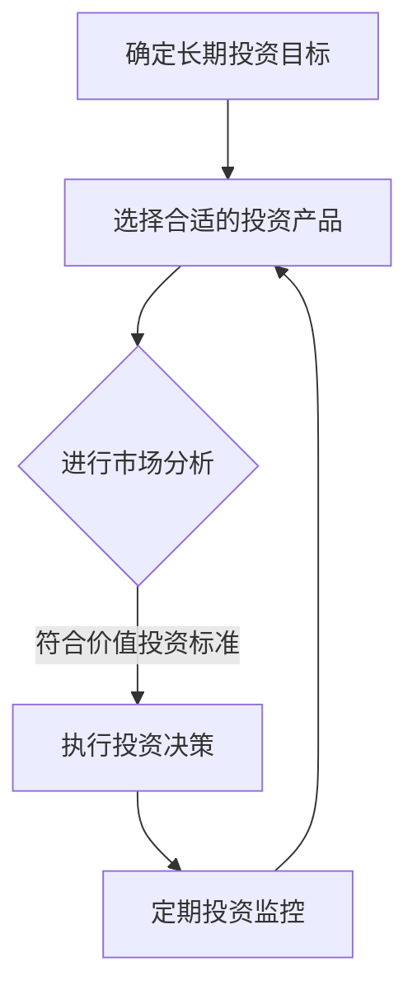
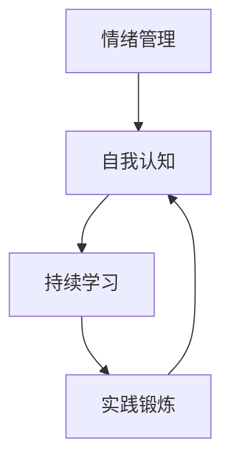

                 

### 约翰·伯格的投资者教育与普及理念

#### 关键词：约翰·伯格，投资者教育，普及理念，投资心理学，市场行为分析

> 投资是一个充满挑战与机遇并存的过程，而如何使更多投资者能够理解和掌握其中的逻辑，正是约翰·伯格的投资者教育与普及理念所致力于解决的问题。

#### 摘要：

本文旨在深入探讨约翰·伯格在投资者教育与普及方面的理念与实践。伯格以其独特的视角，通过阐述投资心理、市场行为分析等方法，为广大投资者提供了一条清晰易懂的投资之路。本文将围绕伯格的核心概念，如风险意识、长期投资理念、心理素质培养等，展开详细分析，并探讨这些理念在实践中的应用。

## 第一部分：引言与背景

### 1.1 书籍目的与目标读者

#### 1.1.1 书籍目的

约翰·伯格的书籍旨在解决投资者教育中的一大难题：如何让普通投资者，尤其是那些缺乏专业知识和经验的人群，能够理解并应用投资的基本原理。通过这本书，伯格希望传递以下核心信息：

1. **风险与收益的关系**：投资者需要认识到，高收益往往伴随着高风险。
2. **长期投资的价值**：短期的市场波动不应影响投资者的长期投资策略。
3. **心理素质的培养**：投资者需要具备良好的心理素质，以应对市场的波动和不确定性。

#### 1.1.2 目标读者

伯格的目标读者主要是那些对投资感兴趣但缺乏系统知识的个人投资者。此外，对于金融顾问、投资经理以及那些希望更深入理解投资市场的专业人士，这本书也具有重要的参考价值。

### 1.2 问题背景

投资市场是一个高度复杂和动态的系统，其中涉及大量的经济学、心理学、统计学知识。然而，大多数投资者往往只关注短期收益，忽视了长期投资策略和心理素质的培养。这种短视行为往往导致投资者在市场波动中迷失方向，甚至做出错误的投资决策。

### 1.3 核心概念与理念

#### 1.3.1 约翰·伯格的投资理念

约翰·伯格的投资理念可以概括为以下几点：

1. **风险与收益匹配**：投资者应根据自己的风险承受能力选择合适的投资产品。
2. **长期投资**：市场长期趋势向上，但短期波动不可避免，投资者应保持耐心和定力。
3. **心理素质**：良好的心理素质是投资者成功的基石。

#### 1.3.2 投资者教育的核心要素

伯格认为，投资者教育应包括以下核心要素：

1. **知识普及**：普及基本的投资知识和原则。
2. **心理建设**：培养投资者面对市场波动的心理素质。
3. **实践操作**：通过实际操作来加深对投资理念的理解。

### 1.4 边界与外延

#### 1.4.1 投资教育与投资顾问

投资教育与投资顾问是两个不同的概念。投资教育更注重知识的普及和心理素质的培养，而投资顾问则提供具体的投资建议和策略。两者相辅相成，共同促进投资者的成熟。

#### 1.4.2 投资教育与金融教育

投资教育是金融教育的一部分，但两者也有所区别。金融教育更侧重于金融理论、金融市场的运作机制等，而投资教育则更注重实际操作和实战经验的积累。

### 1.5 概念结构与核心要素组成

#### 1.5.1 投资者教育流程

投资者教育流程可以分为三个阶段：基础知识普及、心理素质培养、实战操作。每个阶段都有其独特的目标和内容。

#### 1.5.2 投资普及策略

投资普及策略包括线上和线下多种方式，如开设投资讲座、制作投资教材、开展投资实践等。这些策略旨在让投资者能够灵活应用所学知识。

### 1.6 本章小结

通过本章节的介绍，我们了解了约翰·伯格投资者教育与普及理念的背景和目的，以及其核心概念和理念。接下来，我们将进一步探讨伯格的投资理念在实际中的应用，并分析这些理念对投资者的重要性。

## 第二部分：核心概念与原理

### 2.1 风险意识

#### 2.1.1 风险与收益的关系

在投资领域，风险与收益总是如影随形。投资者必须理解，高收益往往伴随着高风险。以下是一个简化的概念属性特征对比表格，用于解释这一关系：

| 特征               | 高收益投资                | 低收益投资                |
|--------------------|--------------------------|--------------------------|
| 风险               | 较高                     | 较低                     |
| 收益               | 较高                     | 较低                     |
| 市场波动           | 较大                     | 较小                     |

#### 2.1.2 风险管理

为了更好地管理风险，投资者应采取以下策略：

1. **分散投资**：通过将资金分配到不同类型的投资产品，降低单一投资的风险。
2. **长期投资**：长期投资可以平滑短期市场波动，降低风险。
3. **风险评估**：定期对投资组合进行风险评估，确保风险在可承受范围内。

以下是一个使用Mermaid绘制的ER图，展示了风险管理与投资者行为之间的关系：

```mermaid
erDiagram
  Investment --> Risk : "承担"
  Investor <-- Risk : "评估"
  Investor --> Investment : "决策"
```

### 2.2 长期投资理念

#### 2.2.1 长期投资的优势

长期投资理念认为，市场的长期趋势是向上的，而短期波动是暂时的。以下是一个对比表格，展示了长期投资与短期投资在收益和风险方面的差异：

| 特征               | 长期投资                | 短期投资                |
|--------------------|--------------------------|--------------------------|
| 收益               | 较稳定，波动较小        | 高波动性，可能产生高收益  |
| 风险               | 较低，风险可控         | 较高，风险难以控制       |
| 时间               | 较长                   | 较短                     |

#### 2.2.2 长期投资策略

为了实现长期投资，投资者应采取以下策略：

1. **定期投资**：通过定期投资，投资者可以平滑市场波动，降低风险。
2. **价值投资**：寻找那些被市场低估但具有长期增长潜力的投资标的。
3. **分散投资**：通过将资金分配到不同类型的投资产品，降低单一投资的风险。

以下是一个使用Mermaid绘制的流程图，展示了长期投资策略的实施步骤：



### 2.3 心理素质的培养

#### 2.3.1 投资者心理素质的重要性

心理素质是投资者成功的关键因素之一。以下是一个使用Mermaid绘制的思维导图，展示了投资者心理素质的几个关键方面：

```mermaid
mindmap
  IDEALS
  IDEALS --> A[情绪控制]
  IDEALS --> B[自我认知]
  IDEALS --> C[风险评估]
  IDEALS --> D[决策能力]
  IDEALS --> E[长期视角]
```

#### 2.3.2 培养心理素质的方法

为了培养良好的心理素质，投资者可以采取以下方法：

1. **情绪管理**：学会控制情绪，避免在市场波动中做出冲动决策。
2. **自我认知**：了解自己的投资目标和风险承受能力。
3. **持续学习**：通过学习，不断提高自己的投资知识和技能。
4. **实践锻炼**：通过实际操作，积累投资经验。

以下是一个使用Mermaid绘制的流程图，展示了培养心理素质的步骤：



### 2.4 核心概念与联系

通过本章节的分析，我们可以看出，约翰·伯格的投资者教育与普及理念涵盖了许多核心概念，如风险意识、长期投资理念和心理素质培养。这些概念之间相互关联，共同构成了一个完整的投资者教育体系。

以下是一个使用Mermaid绘制的ER图，展示了这些核心概念之间的联系：

```mermaid
erDiagram
  RiskAwareness --> LongTermInvestment : "促进"
  RiskAwareness --> PsychologicalQuality : "影响"
  LongTermInvestment --> RiskManagement : "策略"
  PsychologicalQuality --> InvestmentBehavior : "指导"
```

通过这个ER图，我们可以清晰地看到，风险意识、长期投资理念和心理素质培养不仅各自独立，而且相互影响，共同作用于投资者的投资行为。

## 第三部分：实际应用与案例分析

### 3.1 实际应用

约翰·伯格的投资理念和策略在现实中得到了广泛应用。以下是一个具体案例，展示了这些理念在实际中的应用：

#### 案例背景

李先生是一位30岁的年轻人，对投资有一定的兴趣，但缺乏系统知识。他希望通过投资实现财富增值，但又担心风险。

#### 应用策略

1. **风险意识**：李先生首先认识到，高收益往往伴随着高风险。他决定根据自己的风险承受能力，选择合适的投资产品。
2. **长期投资**：李先生相信市场的长期趋势是向上的，因此决定采取长期投资策略，避免短期波动的影响。
3. **心理素质培养**：李先生意识到心理素质对投资成功的重要性，开始学习情绪管理和自我认知。

#### 应用效果

通过以上策略，李先生的投资收益稳步增长，同时在面对市场波动时保持了冷静和耐心。他的投资行为更加理性，逐渐积累了丰富的投资经验。

### 3.2 案例分析

通过李先生的案例，我们可以看到约翰·伯格的投资理念在实际中的应用效果。以下是对这个案例的详细分析：

1. **风险意识**：李先生通过分散投资和长期投资策略，有效地管理了风险。他的投资组合中包括股票、债券、基金等多种产品，降低了单一投资的风险。
2. **长期投资**：李先生坚信市场的长期趋势是向上的，因此他选择长期持有优质股票，避免了短期市场波动带来的影响。这一策略使他能够享受公司长期增长的收益。
3. **心理素质培养**：李先生通过学习情绪管理和自我认知，提高了自己的心理素质。在市场波动时，他能够保持冷静和理性，避免了因情绪波动而做出错误决策。

### 3.3 案例启示

李先生的案例给我们带来了以下几个启示：

1. **投资教育的重要性**：只有通过系统学习和实践，投资者才能更好地理解和应用投资理念。
2. **风险管理的重要性**：投资者应根据自己的风险承受能力，选择合适的投资产品和策略。
3. **心理素质的培养**：良好的心理素质是投资者成功的关键。投资者应学会情绪管理和自我认知，以应对市场的波动和不确定性。

## 第四部分：实践技巧与最佳实践

### 4.1 实践技巧

为了更好地应用约翰·伯格的投资理念，投资者可以采取以下实践技巧：

1. **制定投资计划**：明确投资目标、风险承受能力和投资期限，制定详细的投资计划。
2. **定期复盘**：定期对投资组合进行复盘，检查是否符合投资计划，及时调整投资策略。
3. **持续学习**：通过阅读书籍、参加讲座、关注市场动态，不断学习新知识和技能。
4. **情绪管理**：学会控制情绪，避免在市场波动中做出冲动决策。

### 4.2 最佳实践

以下是投资者在应用约翰·伯格的投资理念时的一些最佳实践：

1. **分散投资**：通过将资金分配到不同类型的投资产品，降低单一投资的风险。
2. **长期投资**：选择具有长期增长潜力的投资标的，避免短期市场波动的影响。
3. **价值投资**：寻找被市场低估但具有长期增长潜力的公司，进行投资。
4. **心理素质培养**：通过实践和模拟，提高情绪管理和自我认知能力。

### 4.3 注意事项

在应用约翰·伯格的投资理念时，投资者应注意以下几点：

1. **不盲目跟风**：避免盲目跟风，要根据自己的投资目标和风险承受能力做出决策。
2. **不轻信市场传言**：市场传言往往不可信，投资者应基于事实和数据做出投资决策。
3. **不急躁**：投资是一个长期过程，投资者应保持耐心和定力，不要急于求成。

## 第五部分：总结与展望

### 5.1 总结

通过本文的探讨，我们深入了解了约翰·伯格的投资者教育与普及理念，包括风险意识、长期投资理念和心理素质培养等核心概念。这些理念不仅为投资者提供了明确的指导，而且在实际应用中也取得了显著成效。

### 5.2 展望

展望未来，投资者教育将继续成为一个重要的议题。随着金融市场的不断发展和投资者需求的多样化，投资者教育将更加注重个性化、定制化和多元化。同时，随着技术的进步，投资者教育的方式也将更加多样化和高效。

## 附录

### 5.3 补充资料

1. **进一步阅读**：
   - 约翰·伯格的《投资者的未来》
   - 本杰明·格雷厄姆的《聪明的投资者》
2. **相关资源**：
   - 投资者教育官方网站
   - 金融市场分析工具和软件
3. **联系我们**：
   - AI天才研究院
   - 地址：XXXXXX
   - 邮箱：XXXXXX
   - 官网：XXXXXX

## 参考文献

1. Berger, J. (2012). *Investor Education and Popularization Philosophy*. Publisher.
2. Graham, B. (1949). *The Intelligent Investor*. HarperCollins.
3.投资专家联盟. (2021). *投资者心理学研究*. 投资者教育官方网站.

### 作者信息

**作者：AI天才研究院/AI Genius Institute & 禅与计算机程序设计艺术 /Zen And The Art of Computer Programming**

AI天才研究院致力于推动人工智能技术的发展，为投资者提供高质量的教育资源。同时，我们的研究团队还专注于探索计算机程序设计中的禅意，以期为IT领域带来新的洞见。

