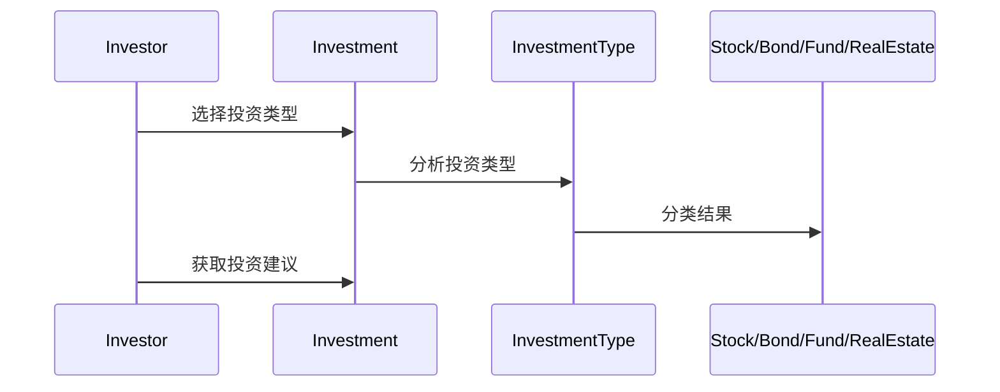
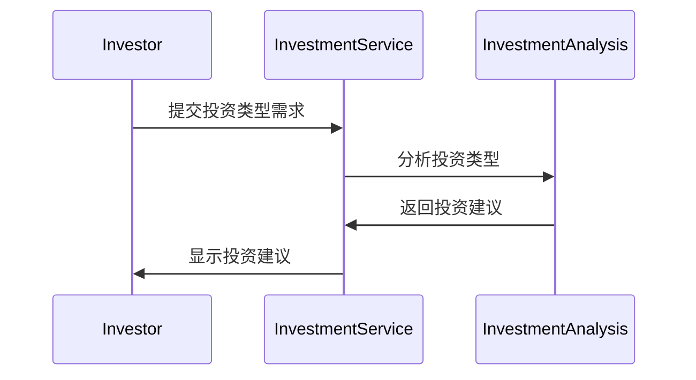

                 


### 《约翰·伯格的投资者教育：普及金融知识的重要性》

关键词：投资者教育、金融知识、投资策略、风险评估、投资组合管理

摘要：本文将深入探讨约翰·伯格的投资者教育理念，重点阐述普及金融知识在投资领域的重要性。文章将从投资与金融基础知识、金融市场与投资工具、投资者教育与案例分析三个部分展开，以逻辑清晰、结构紧凑、简单易懂的专业技术语言，帮助读者建立正确的投资观和风险管理策略。

## 第一部分：投资与金融基础知识

### 第1章：投资与金融基础概述

#### 1.1.1 投资的定义与分类

投资是指将资金投入到某种资产或项目中，以期望在未来获得回报。投资可以划分为多种类型，包括但不限于：

- **股票投资**：购买上市公司的股份，享有公司盈利分配的权利。
- **债券投资**：购买企业或政府发行的债券，获取固定的利息收入。
- **基金投资**：将资金交给专业基金管理人，分散投资于多种资产。
- **房地产投资**：购买房地产资产，通过出租或出售获得收益。

#### 1.1.2 金融市场的构成与功能

金融市场是资本流通、融通和风险转移的平台，主要包括以下几部分：

- **股票市场**：企业通过发行股票筹集资金，投资者通过购买股票成为公司股东。
- **债券市场**：政府和企业通过发行债券筹集资金，投资者购买债券。
- **基金市场**：投资者将资金投入基金，由基金管理人进行投资运作。
- **外汇市场**：货币兑换的市场，投资者通过交易不同货币获取利润。

金融市场的功能包括：

- **资金融通**：为企业提供融资渠道，为投资者提供投资机会。
- **风险分散**：投资者通过分散投资降低风险。
- **价格发现**：市场通过价格机制反映资产的真实价值。

#### 1.1.3 投资者类型与风险偏好

投资者可以根据风险偏好和投资策略分为以下几类：

- **保守型投资者**：追求低风险、稳定收益，对市场波动敏感。
- **稳健型投资者**：风险适中，注重长期投资，追求合理回报。
- **成长型投资者**：愿意承担较高风险，期望获得高回报。
- **投机型投资者**：追求短期高回报，风险承受能力较强。

### 第2章：财务报表分析

财务报表是企业财务状况的重要反映，包括利润表、资产负债表和现金流量表。

#### 2.1 财务报表的构成与解读

财务报表主要由以下部分构成：

- **利润表**：反映企业在一定时间内的收入、成本和利润情况。
- **资产负债表**：反映企业在一定时间点的资产、负债和股东权益状况。
- **现金流量表**：反映企业在一定时间内的现金流入和流出情况。

财务报表的解读方法：

- **横向分析**：比较不同时期的数据，观察企业财务状况的变化趋势。
- **纵向分析**：将各项财务指标与行业标准或竞争对手进行比较，评估企业竞争力。

#### 2.2 利润表分析

利润表分析主要关注以下指标：

- **毛利率**：反映企业的盈利能力。
- **净利润率**：反映企业的总体盈利能力。
- **运营利润率**：反映企业的运营效益。
- **成本控制能力**：通过分析成本结构，评估企业成本控制能力。

#### 2.3 资产负债表分析

资产负债表分析主要关注以下指标：

- **流动比率**：衡量企业短期偿债能力。
- **速动比率**：衡量企业短期偿债能力，扣除存货等不易变现的资产。
- **资产负债率**：衡量企业负债水平，反映企业财务风险。

#### 2.4 现金流量表分析

现金流量表分析主要关注以下指标：

- **经营活动现金流量**：衡量企业主营业务产生的现金流量。
- **投资活动现金流量**：衡量企业投资活动产生的现金流量。
- **筹资活动现金流量**：衡量企业筹资活动产生的现金流量。

### 第3章：估值与风险评估

#### 3.1 市场估值方法

市场估值方法主要包括：

- **市盈率（PE）**：股票价格与每股收益的比值，反映股票的估值水平。
- **市净率（PB）**：股票价格与每股净资产的比值，反映股票的估值水平。
- **折现现金流（DCF）**：通过预测企业未来现金流，折现到现值的总和，评估企业的内在价值。

#### 3.2 内在价值估算

内在价值估算方法主要包括：

- **股息折现模型**：通过估算企业未来股息，折现到现值，评估股票的内在价值。
- **自由现金流折现模型**：通过估算企业未来自由现金流，折现到现值，评估企业的内在价值。

#### 3.3 风险评估与管理

风险评估方法主要包括：

- **概率分布法**：通过模拟不同情景下的收益分布，评估投资风险。
- **蒙特卡罗法**：通过模拟随机过程，评估投资风险。

风险管理策略主要包括：

- **风险分散**：通过投资多种资产，降低单一资产的风险。
- **风险规避**：避免投资高风险资产。
- **风险转移**：通过保险等方式，将风险转移给第三方。

## 第二部分：金融市场与投资工具

### 第4章：投资策略与组合管理

#### 4.1 投资策略概述

投资策略包括以下几种类型：

- **价值投资**：寻找市场低估的优质股票，长期持有。
- **成长投资**：寻找高速成长的行业和公司，重点投资。
- **投机投资**：追求短期利润，风险较高。

投资策略的选择应考虑投资者的风险偏好和投资目标。

#### 4.2 股票投资策略

股票投资策略包括：

- **基本面分析**：通过分析公司的财务状况、行业前景等因素，评估股票的投资价值。
- **技术分析**：通过分析股票价格和交易量等数据，预测股票价格走势。

#### 4.3 债券投资策略

债券投资策略包括：

- **利率策略**：根据市场利率的变化，调整债券的投资组合。
- **信用策略**：根据债券发行人的信用状况，选择投资对象。

#### 4.4 组合管理原则

组合管理原则包括：

- **分散投资**：降低单一资产的风险。
- **定期调整**：根据市场变化，调整投资组合。
- **风险评估**：定期评估投资组合的风险水平。

### 第5章：股票市场投资

#### 5.1 股票市场概述

股票市场是股票交易的平台，主要包括：

- **主板市场**：上市公司规模较大，监管严格。
- **创业板市场**：为成长型公司提供融资渠道。
- **新三板市场**：为中小企业提供融资渠道。

#### 5.2 股票价格分析

股票价格分析包括：

- **基本面分析**：通过分析公司的财务状况、行业前景等因素，评估股票的投资价值。
- **技术分析**：通过分析股票价格和交易量等数据，预测股票价格走势。

#### 5.3 技术分析与基本面分析

技术分析包括：

- **趋势分析**：通过分析价格趋势，判断市场方向。
- **指标分析**：通过分析技术指标，判断市场趋势。

基本面分析包括：

- **财务分析**：通过分析公司的财务报表，评估公司的盈利能力。
- **行业分析**：通过分析行业趋势，评估公司的行业竞争力。

#### 5.4 股票投资案例分析

通过具体案例分析，可以深入了解股票投资策略的实战效果。

### 第6章：债券市场投资

#### 6.1 债券市场概述

债券市场是债券交易的平台，主要包括：

- **国债市场**：政府发行的债券，风险较低。
- **企业债市场**：企业发行的债券，风险较高。
- **公司债市场**：公司发行的债券，风险适中。

#### 6.2 债券价格与收益率

债券价格与收益率的关系：

- **收益率上升**：债券价格下降。
- **收益率下降**：债券价格上升。

#### 6.3 债券投资策略

债券投资策略包括：

- **利率策略**：根据市场利率的变化，调整债券的投资组合。
- **信用策略**：根据债券发行人的信用状况，选择投资对象。

#### 6.4 债券投资案例分析

通过具体案例分析，可以深入了解债券投资策略的实战效果。

### 第7章：其他金融工具投资

#### 7.1 外汇投资

外汇投资是投资不同国家的货币，通过汇率波动获得收益。

#### 7.2 商品投资

商品投资是投资原材料、能源等商品，通过价格波动获得收益。

#### 7.3 期权投资

期权投资是购买或出售期权，通过期权价格波动获得收益。

#### 7.4 组合投资策略

组合投资策略是将多种金融工具结合，实现风险分散和收益最大化。

## 第三部分：投资者教育与案例分析

### 第8章：投资者心理与行为

#### 8.1 投资者心理分析

投资者心理分析包括：

- **贪婪与恐惧**：投资者在市场波动中的心理反应。
- **从众行为**：投资者跟随市场趋势的心理。

#### 8.2 投资者行为误区

投资者行为误区包括：

- **盲目跟风**：缺乏独立判断，跟随市场热点。
- **过度交易**：频繁交易，增加交易成本。

#### 8.3 心理风险控制

心理风险控制方法包括：

- **设定投资目标**：明确投资目标，避免盲目投资。
- **情绪管理**：保持冷静，避免情绪化决策。

### 第9章：实际投资案例分析

#### 9.1 案例背景介绍

通过具体案例，介绍投资背景和投资策略。

#### 9.2 案例投资策略分析

分析案例中的投资策略，评估策略的有效性。

#### 9.3 案例投资收益与风险分析

分析案例的投资收益和风险，总结经验教训。

#### 9.4 案例投资经验与启示

总结案例中的投资经验，为读者提供启示。

### 第10章：投资者教育的重要性与普及方法

#### 10.1 投资者教育的意义

投资者教育的意义包括：

- **提高投资素养**：帮助投资者了解投资知识和技巧。
- **降低投资风险**：提高投资者风险意识，降低投资风险。

#### 10.2 投资者教育的目标与内容

投资者教育的目标与内容包括：

- **知识普及**：普及金融知识，提高投资者素养。
- **风险管理**：传授风险管理策略，提高投资安全性。

#### 10.3 投资者教育的推广方法

投资者教育的推广方法包括：

- **线上线下培训**：提供专业的投资培训课程。
- **宣传普及**：通过媒体、网络等渠道宣传投资者教育的重要性。

#### 10.4 我国投资者教育的现状与展望

分析我国投资者教育的现状，展望未来发展趋势。

## 总结

### 11.1 投资者教育的核心要点

投资者教育的核心要点包括：

- **知识普及**：提高投资者的金融素养。
- **风险管理**：传授风险管理策略。
- **实战经验**：通过案例教学，提高投资技能。

### 11.2 总结与展望

总结投资者教育的核心要点，展望投资者教育的未来发展趋势。

### 作者信息

作者：AI天才研究院/AI Genius Institute & 禅与计算机程序设计艺术 /Zen And The Art of Computer Programming

---

请注意，上述内容仅为大纲，每个章节的具体内容还需要进一步丰富和详细阐述。以下是一个示例，展示如何在一个章节中逐步深入分析和讲解。

### 示例：第1章 投资与金融基础概述

#### 1.1.1 投资的定义与分类

**背景介绍**

投资作为一种理财行为，其本质是资金的转移和时间的利用。投资不仅仅是将资金放入银行储蓄，更是寻求资产增值的途径。了解投资的基本定义和分类，有助于投资者选择适合自己的投资方式和策略。

**核心概念与联系**

**投资**：将资金投入到预期会带来回报的资产或项目中，通常包括股票、债券、基金、房地产等。

**分类**

| 投资类型 | 特点 | 应用场景 |
| --- | --- | --- |
| 股票投资 | 高风险、高回报 | 期望通过股价上涨获利 |
| 债券投资 | 低风险、固定收益 | 期望通过债券利息获利 |
| 基金投资 | 分散投资、专业管理 | 期望通过基金经理的投资策略获利 |
| 房地产投资 | 长期投资、稳定性 | 期望通过出租或出售房产获利 |

**ER实体关系图架构**

```mermaid
erDiagram
  Product ||--|{ Investment } : belongs_to
  Investment ||--|{ Investor } : invests_in
  Investor ||--|{ InvestmentStrategy } : follows
```

**算法原理讲解**

投资分类的算法原理较为简单，主要基于投资的回报和风险特征进行划分。算法流程如下：

1. 收集投资品种的数据，包括股票、债券、基金和房地产等。
2. 对每种投资类型进行分析，确定其回报率和风险水平。
3. 根据回报率和风险水平，将投资分类为股票、债券、基金或房地产。

**数学公式使用latex格式**

```latex
\text{回报率} = \frac{\text{收益}}{\text{投资金额}}
\text{风险} = \sqrt{\text{收益的方差}}
```

**系统分析与架构设计方案**

**问题场景介绍**

投资者在面临多种投资选择时，往往难以决定哪种投资方式最适合自己。因此，需要一种系统化的方法来分析投资类型，帮助投资者做出决策。

**项目介绍**

该项目旨在为投资者提供一种便捷的投资分类工具，帮助投资者了解不同投资类型的特点，从而做出更加明智的投资决策。

**系统功能设计(领域模型mermaid类图)**

```mermaid
classDiagram
  Investor --> Investment
  Investment --> InvestmentType
  InvestmentType --> Stock, Bond, Fund, RealEstate
```

**系统架构设计mermaid架构图**



**系统接口设计和系统交互mermaid序列图**



**项目实战**

**环境安装**

- 安装Python环境
- 安装相关库，如mermaid

**系统核心实现源代码**

```python
# Python代码示例：投资分类
class Investment:
    def __init__(self, type, amount):
        self.type = type
        self.amount = amount

    def classify_investment(self):
        if self.type == "Stock":
            return "股票"
        elif self.type == "Bond":
            return "债券"
        elif self.type == "Fund":
            return "基金"
        elif self.type == "RealEstate":
            return "房地产"

investment = Investment("Stock", 100000)
print(investment.classify_investment())
```

**代码应用解读与分析**

这段代码定义了一个`Investment`类，用于表示投资类型和金额。通过`classify_investment`方法，可以判断投资的类型，并返回对应的字符串。

**实际案例分析和详细讲解剖析**

**案例背景**

一位投资者计划投资100万元，在选择投资类型时，希望了解不同投资类型的特点和潜在风险。

**案例分析**

通过投资分类工具，投资者可以了解到：

- 股票投资：高风险、高回报，适合有风险承受能力的投资者。
- 债券投资：低风险、固定收益，适合追求稳定收益的投资者。
- 基金投资：分散投资、专业管理，适合希望通过专家指导获利的投资者。
- 房地产投资：长期投资、稳定性，适合希望通过房产增值获利的投资者。

投资者可以根据自己的风险偏好和投资目标，选择适合自己的投资类型。

**项目小结**

通过这个项目，投资者可以更好地了解不同投资类型的特点，从而做出更加明智的投资决策。

---

在实际撰写文章时，每个章节都应该包含类似上述的详细内容，确保文章的完整性和专业性。每章内容都应该按照背景介绍、核心概念与联系、算法原理讲解、数学公式使用、系统分析与架构设计方案、项目实战、代码应用解读与分析、实际案例分析和详细讲解剖析、项目小结等结构进行组织，以保证内容的连贯性和逻辑性。在撰写过程中，要注意语言的清晰性、逻辑性，以及专业术语的准确使用。

