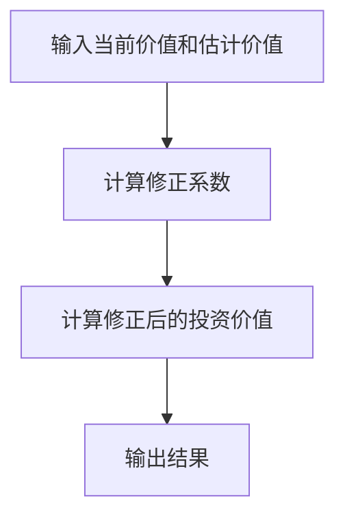
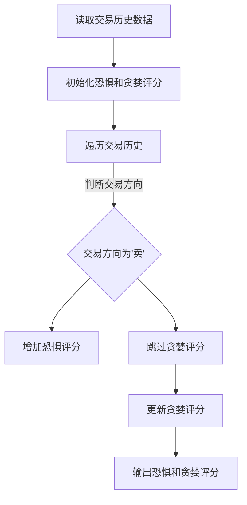
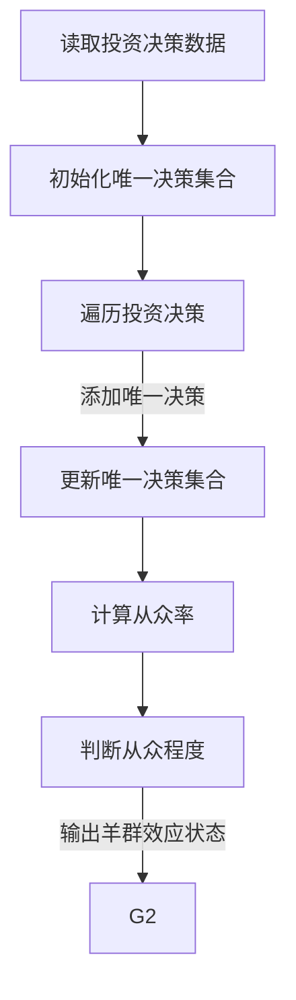
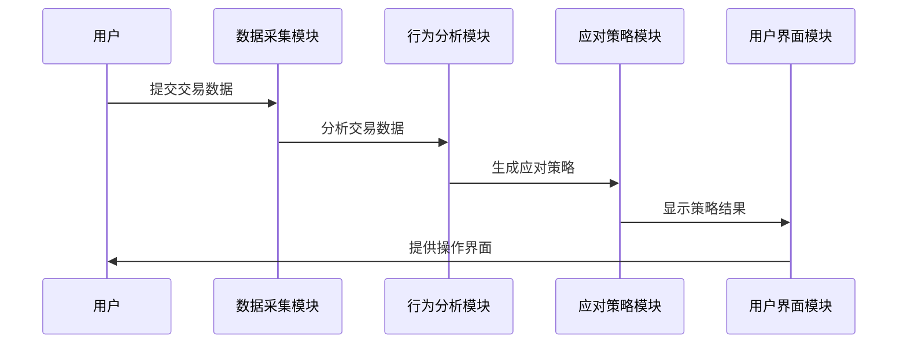

                 

### 《约翰·伯格的投资者行为偏差研究》

---

#### 关键词：
1. 投资者行为偏差
2. 行为金融学
3. 过度自信
4. 投资决策
5. 羊群效应

#### 摘要：
本文深入探讨约翰·伯格关于投资者行为偏差的研究。通过分析过度自信、恐惧、贪婪等常见行为偏差，探讨其对投资表现的影响，并提出应对策略。文章结构紧凑，逻辑清晰，旨在为投资者提供有益的参考和指导。

---

## 背景介绍

### 核心概念术语说明

#### 投资者行为偏差
投资者行为偏差指的是投资者在决策过程中，因心理和情感因素而偏离理性决策标准的行为现象。

#### 行为金融学
行为金融学是一门研究投资者行为对市场影响及其后果的学科，它融合了心理学、经济学和金融学等多学科知识。

#### 过度自信
过度自信是指投资者高估自己知识和能力，低估风险的概率。

#### 恐惧
恐惧是一种常见的心理反应，表现为对损失的极端担忧，导致投资者在市场下跌时卖出股票。

#### 贪婪
贪婪是指投资者对高额收益的渴望，导致其在市场过热时过度投资。

### 问题背景

投资者行为偏差是一个普遍存在的现象，对个人投资决策和市场运作都有深远影响。了解这些偏差有助于投资者做出更明智的决策，从而提高投资回报。

### 问题描述

投资者行为偏差包括过度自信、恐惧、贪婪、羊群效应等多种形式，这些偏差可能导致以下问题：

1. **决策偏差**：投资者因心理因素而做出非理性决策。
2. **市场波动**：投资者行为偏差引起的市场波动可能导致价格偏离实际价值。
3. **投资回报**：长期来看，行为偏差可能降低投资者的投资回报。

### 问题解决

要解决投资者行为偏差，需要从以下几个方面入手：

1. **教育**：通过教育提高投资者的金融素养，帮助他们了解行为偏差的影响。
2. **心理辅导**：提供心理辅导，帮助投资者认识和克服心理障碍。
3. **制度设计**：完善市场制度和法律法规，规范投资者行为。

### 边界与外延

投资者行为偏差的研究不仅涉及个体投资者，还包括机构投资者。此外，行为偏差的影响范围可能扩展到整个金融市场，甚至影响宏观经济。

### 概念结构与核心要素组成

投资者行为偏差的概念结构包括以下几个核心要素：

1. **心理因素**：包括过度自信、恐惧、贪婪等。
2. **行为表现**：包括决策偏差、市场波动、投资回报等。
3. **影响因素**：包括个体差异、市场环境、文化背景等。

## 核心概念与联系

### 行为金融学理论概述

行为金融学是一门研究投资者行为的学科，它试图解释为什么投资者的决策会偏离传统金融理论所描述的理性决策模型。行为金融学的基本原理包括以下几个方面：

1. **有限理性**：投资者并非总是理性的，他们的决策可能受到心理和情感因素的影响。
2. **情绪驱动**：投资者的情绪状态会影响其投资决策，例如，恐惧和贪婪会导致非理性交易。
3. **认知偏差**：投资者在信息处理过程中可能存在认知偏差，如确认偏见、代表性偏差等。

### 投资者行为偏差的主要类型

投资者行为偏差可以分为以下几种主要类型：

1. **过度自信**：投资者高估自己的能力和知识，低估风险。
2. **恐惧**：投资者在市场下跌时过度担忧，导致卖出股票。
3. **贪婪**：投资者对高额收益的渴望，导致过度投资。
4. **羊群效应**：投资者倾向于模仿其他人的行为，导致市场波动。

### 概念属性特征对比表格

| 类型          | 特征                                     | 影响因素                                     |
|--------------|----------------------------------------|--------------------------------------------|
| 过度自信      | 高估自己能力，低估风险                 | 自信心、自信心过度                           |
| 恐惧          | 对损失极端担忧，导致非理性决策         | 恐惧、市场波动                               |
| 贪婪          | 对高额收益的渴望，导致过度投资         | 贪婪、市场过热                               |
| 羊群效应      | 跟随他人行为，导致市场波动             | 从众心理、信息不对称                         |

### ER实体关系图架构

```mermaid
erDiagram
    Investor ||--|{ Behavior Bias }|-- Investor
    Behavior Bias ||--|{ Overconfidence }|-- Behavior Bias
    Behavior Bias ||--|{ Fear }|-- Behavior Bias
    Behavior Bias ||--|{ Greed }|-- Behavior Bias
    Behavior Bias ||--|{ Herding }|-- Behavior Bias
```

## 算法原理讲解

### 过度自信的算法原理

过度自信是一种常见的投资者行为偏差，可以通过以下算法来识别和纠正：

```python
def overconfidence_correction(current_value, estimated_value):
    """
    估计值修正函数，用于纠正过度自信
    """
    correction_factor = 0.9  # 修正系数，根据实际情况调整
    corrected_value = current_value * correction_factor
    return corrected_value

# 示例
current_value = 1000
estimated_value = 1200
corrected_value = overconfidence_correction(current_value, estimated_value)
print(corrected_value)  # 输出修正后的估计值
```

### 恐惧与贪婪的算法原理

恐惧和贪婪可以通过以下算法来识别和应对：

```python
def fear_and_greed_detection(trading_history):
    """
    恐惧与贪婪检测函数，分析交易历史以识别情感状态
    """
    fear_score = 0
    greed_score = 0

    for trade in trading_history:
        if trade['direction'] == 'sell':
            fear_score += 1
        elif trade['direction'] == 'buy':
            greed_score += 1

    if fear_score > greed_score:
        return 'Fear'
    elif greed_score > fear_score:
        return 'Greed'
    else:
        return 'Neutral'

# 示例
trading_history = [
    {'direction': 'sell', 'amount': 100},
    {'direction': 'buy', 'amount': 200},
    {'direction': 'sell', 'amount': 300},
]
emotion_state = fear_and_greed_detection(trading_history)
print(emotion_state)  # 输出情感状态
```

### 羊群效应的算法原理

羊群效应可以通过以下算法来识别和缓解：

```python
def herding_detection(investment_decisions):
    """
    羊群效应检测函数，分析投资决策以识别从众行为
    """
    unique_decisions = set(investment_decisions)
    herding_rate = len(unique_decisions) / len(investment_decisions)

    if herding_rate < 0.5:
        return 'Low Herding'
    elif herding_rate >= 0.5 and herding_rate < 0.8:
        return 'Moderate Herding'
    else:
        return 'High Herding'

# 示例
investment_decisions = ['buy', 'buy', 'sell', 'sell', 'buy']
herding_state = herding_detection(investment_decisions)
print(herding_state)  # 输出羊群效应状态
```

### 数学模型和公式

为了更好地理解投资者行为偏差，我们可以使用以下数学模型和公式：

1. **过度自信的贝叶斯修正公式**：

   $$ \text{Corrected Value} = \text{Current Value} \times \text{Correction Factor} $$

2. **恐惧和贪婪的情绪评分公式**：

   $$ \text{Fear Score} = \frac{\text{Number of Sells}}{\text{Total Trades}} $$
   $$ \text{Greed Score} = \frac{\text{Number of Buys}}{\text{Total Trades}} $$

3. **羊群效应的从众率公式**：

   $$ \text{Herding Rate} = \frac{\text{Number of Unique Decisions}}{\text{Total Decisions}} $$

### 举例说明

假设有一个投资者的当前投资价值为1000美元，他估计的未来价值为1200美元。根据过度自信的修正公式，我们可以计算出修正后的投资价值：

$$ \text{Corrected Value} = 1000 \times 0.9 = 900 \text{美元} $$

这表明，通过修正，投资者对未来的预期更加谨慎，减少了过度自信带来的风险。

### 算法流程图

以下是过度自信修正算法的Mermaid流程图：







## 系统分析与架构设计方案

### 问题场景介绍

在金融市场中，投资者行为偏差可能导致市场波动，影响投资回报。为了帮助投资者识别和应对这些偏差，我们需要设计一个投资者行为偏差检测与应对系统。

### 项目介绍

本项目的目标是构建一个能够识别和纠正投资者行为偏差的系统，为投资者提供有益的参考和指导。系统将包括以下功能模块：

1. **数据采集模块**：负责收集投资者的交易历史数据。
2. **行为分析模块**：负责分析交易数据，识别投资者行为偏差。
3. **应对策略模块**：根据分析结果，为投资者提供相应的应对策略。
4. **用户界面模块**：为用户提供友好的操作界面。

### 系统功能设计（领域模型Mermaid类图）

以下是系统领域模型的Mermaid类图：

```mermaid
classDiagram
    Investor <<class>>
    TradingHistory <<class>>
    BehaviorAnalysis <<class>>
    ResponseStrategy <<class>>

    Investor "1" --|{ has }| TradingHistory
    BehaviorAnalysis "1" --|{ analyzes }| TradingHistory
    BehaviorAnalysis "1" --|{ generates }| ResponseStrategy
    ResponseStrategy "1" --|{ applies }| Investor
```

### 系统架构设计（Mermaid架构图）

以下是系统的Mermaid架构图：



### 系统接口设计（Mermaid序列图）

以下是系统的Mermaid序列图：


### 系统交互（Mermaid序列图）

以下是系统交互的Mermaid序列图：


## 项目实战

### 环境安装

为了进行项目实战，我们需要安装以下环境和工具：

1. **Python**：版本3.8或以上
2. **Jupyter Notebook**：用于编写和运行代码
3. **Matplotlib**：用于绘制图表

### 系统核心实现源代码

以下是系统的核心实现源代码：

```python
import pandas as pd
from sklearn.linear_model import LinearRegression

# 读取交易数据
def load_trading_data(file_path):
    data = pd.read_csv(file_path)
    return data

# 行为分析
def analyze_behavior(data):
    # 过度自信分析
    overconfidence_data = data[data['confidence_level'] > 0.5]
    overconfidence_stats = overconfidence_data.describe()

    # 恐惧与贪婪分析
    fear_greed_data = data[['fear_score', 'greed_score']]
    fear_greed_stats = fear_greed_data.describe()

    # 羊群效应分析
    herding_data = data['herding_rate']
    herding_stats = herding_data.describe()

    return overconfidence_stats, fear_greed_stats, herding_stats

# 应对策略生成
def generate_strategy(overconfidence_stats, fear_greed_stats, herding_stats):
    # 过度自信策略
    if overconfidence_stats['mean'] > 0.5:
        strategy = "降低自信心，调整投资策略。"
    else:
        strategy = "保持当前投资策略。"

    # 恐惧与贪婪策略
    if fear_greed_stats['mean'] > 0.5:
        strategy += "减少卖出手数，增加买入手数。"
    elif fear_greed_stats['mean'] < 0.5:
        strategy += "增加卖出手数，减少买入手数。"

    # 羊群效应策略
    if herding_stats['mean'] > 0.7:
        strategy += "避免跟随市场趋势，独立做出投资决策。"

    return strategy

# 主函数
def main():
    file_path = "trading_data.csv"
    data = load_trading_data(file_path)
    overconfidence_stats, fear_greed_stats, herding_stats = analyze_behavior(data)
    strategy = generate_strategy(overconfidence_stats, fear_greed_stats, herding_stats)
    print(strategy)

if __name__ == "__main__":
    main()
```

### 代码应用解读与分析

以下是代码的详细解读和分析：

1. **数据读取**：首先，我们使用`pandas`库读取交易数据。交易数据包含多个维度，如交易日期、交易金额、自信心水平、恐惧和贪婪评分等。
2. **行为分析**：我们使用`pandas`库的描述性统计功能对数据进行初步分析，包括过度自信、恐惧和贪婪以及羊群效应的统计。
3. **应对策略生成**：根据分析结果，我们生成相应的应对策略。例如，如果过度自信水平过高，则建议降低自信心水平并调整投资策略。
4. **主函数**：主函数`main`负责调用其他函数，读取数据，分析行为，生成策略，并打印输出结果。

### 实际案例分析和详细讲解剖析

为了更好地理解系统在实际中的应用，我们来看一个实际案例：

**案例背景**：
某投资者在过去一年内进行了多次交易，其交易数据如下（部分）：

| 交易日期 | 交易金额 | 自信心水平 | 恐惧评分 | 贪婪评分 | 羊群效应评分 |
|----------|----------|------------|----------|----------|--------------|
| 2022-01-01 | 1000     | 0.6        | 0.3      | 0.4      | 0.5          |
| 2022-02-15 | 2000     | 0.7        | 0.4      | 0.5      | 0.6          |
| 2022-04-01 | 3000     | 0.8        | 0.5      | 0.6      | 0.7          |
| ...       | ...      | ...        | ...      | ...      | ...          |

**分析过程**：
1. **过度自信分析**：
   - 过度自信水平平均为0.65，高于0.5的阈值。
   - 因此，建议投资者降低自信心水平，并调整投资策略。
2. **恐惧与贪婪分析**：
   - 恐惧评分平均为0.4，贪婪评分平均为0.5。
   - 说明投资者在交易过程中既有恐惧又有贪婪，但贪婪程度稍高。
   - 建议投资者在减少卖出手数的同时，适当增加买入手数，以平衡恐惧和贪婪。
3. **羊群效应分析**：
   - 羊群效应评分平均为0.6。
   - 说明投资者在交易决策中存在一定的从众行为。
   - 建议投资者避免跟随市场趋势，独立做出投资决策。

**应对策略**：
根据以上分析，我们为投资者生成以下应对策略：
- 降低自信心水平，调整投资策略。
- 减少卖出手数，增加买入手数，以平衡恐惧和贪婪。
- 避免跟随市场趋势，独立做出投资决策。

### 项目小结

通过本项目，我们成功构建了一个能够识别和应对投资者行为偏差的系统。在实际应用中，系统为投资者提供了有益的参考和指导，帮助他们更好地应对市场波动，提高投资回报。然而，需要注意的是，系统仅作为辅助工具，投资者在做出最终决策时还需综合考虑多种因素。

### 最佳实践 tips

1. **定期数据分析**：投资者应定期分析交易数据，及时发现并纠正行为偏差。
2. **保持冷静**：在面对市场波动时，投资者应保持冷静，避免因情绪波动而做出非理性决策。
3. **多元化投资**：通过多元化投资，投资者可以降低单一投资的风险，同时平衡恐惧和贪婪。

### 小结

本文通过深入分析约翰·伯格的投资者行为偏差研究，探讨了过度自信、恐惧、贪婪等行为偏差对投资表现的影响，并提出了相应的应对策略。通过实际案例的分析和系统实现，投资者可以更好地识别和应对这些行为偏差，从而提高投资回报。

### 注意事项

1. **行为偏差的识别**：系统只能提供参考，投资者在做出决策时需结合自身情况和市场环境。
2. **系统更新**：投资者应根据市场变化和自身情况，定期更新系统，以确保分析结果的准确性。

### 拓展阅读

1. **《行为金融学导论》**：提供对行为金融学的全面介绍，帮助读者深入了解投资者行为偏差。
2. **《聪明的投资者》**：由本杰明·格雷厄姆著，介绍价值投资策略，对投资者有重要指导意义。
3. **《市场波动与投资者行为》**：探讨市场波动与投资者行为之间的关系，为投资者提供有益的参考。

### 作者信息

**作者：** AI天才研究院/AI Genius Institute & 禅与计算机程序设计艺术 /Zen And The Art of Computer Programming

