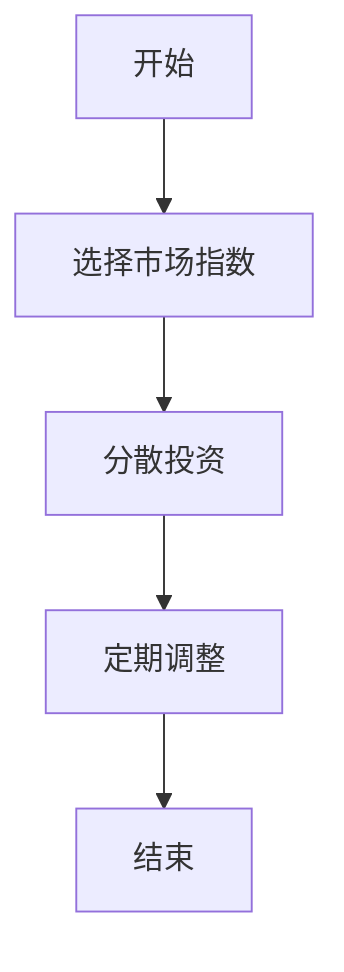
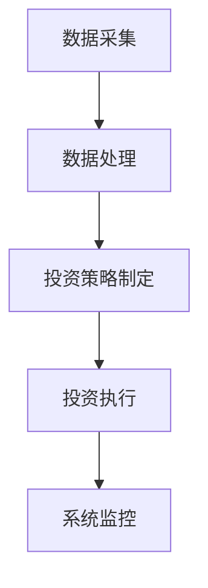
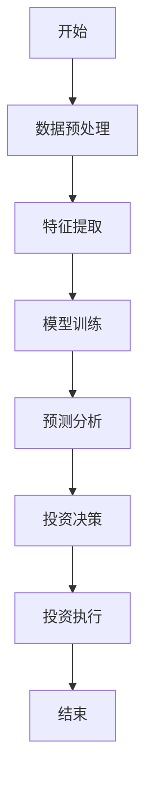
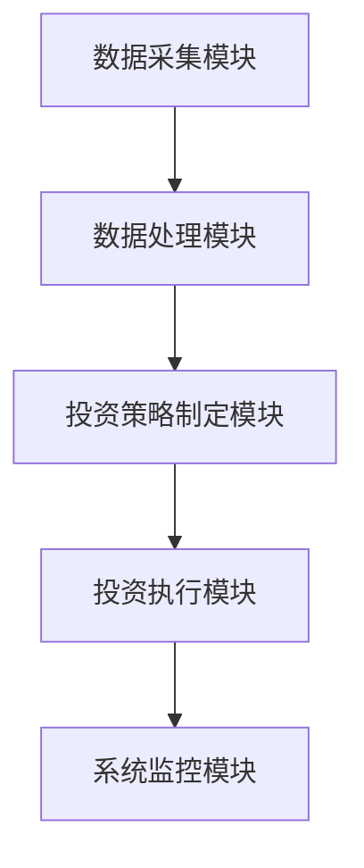
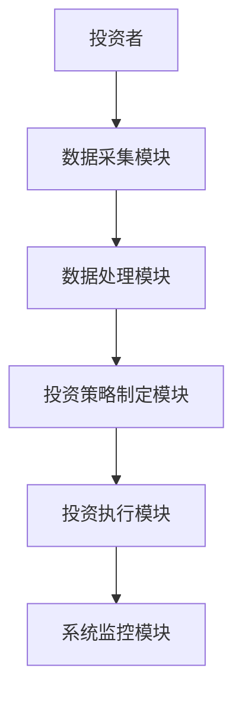

                 

# 约翰·伯格的指数化革命

> 关键词：指数化革命、约翰·伯格、投资策略、技术基础、应用场景、最佳实践

> 摘要：本文旨在深入探讨约翰·伯格的指数化革命，阐述其背景、核心概念、技术基础、应用场景以及最佳实践，以帮助读者全面理解这一投资革命的本质及其对金融市场的影响。

## 第一部分：约翰·伯格与指数化革命

### 第1章：引言

#### 1.1 问题背景与意义

指数化革命是一场深刻的投资变革，其背景可以追溯到20世纪70年代。当时，金融市场经历了剧烈的波动，投资者对传统投资策略的信心受到严重打击。约翰·伯格（John C. Boggs）作为现代投资理论的奠基人之一，提出了指数化投资策略，旨在解决传统投资的局限性。

指数化革命的意义在于，它不仅提供了一种更为科学、系统的投资方法，还打破了传统投资的局限，为投资者提供了新的选择。通过指数化投资，投资者可以更加高效地管理风险和收益，提高投资效率。

#### 1.2 问题描述与解决

传统投资策略通常依赖于对市场的精确预测和个股的精选，但这种依赖往往导致投资结果的不稳定。约翰·伯格提出了指数化投资策略，其核心思想是“不要试图战胜市场，而是要和市场同步”。通过跟踪整个市场或特定市场的指数，投资者可以避免对市场的过度依赖，降低风险。

#### 1.3 边界与外延

指数化革命的定义与范围相对明确，但其核心要素包括被动投资、透明度和成本效率。被动投资意味着投资者不再主动选择个股，而是跟随市场指数。透明度则体现在投资策略的公开性和可验证性。成本效率则是指数化投资的另一个关键优势，它通过降低交易成本和管理费用，提高了投资回报率。

#### 1.4 概念结构与核心要素组成

约翰·伯格的指数化革命理论框架主要包括以下几个核心要素：

1. **被动投资**：投资者不主动选择个股，而是跟踪市场指数。
2. **透明度**：投资策略和过程公开透明，易于验证。
3. **成本效率**：通过降低交易成本和管理费用，提高投资回报率。

## 第二部分：指数化革命的核心概念

### 第2章：指数化革命的核心概念

#### 2.1 指数化革命的基本原理

指数化投资策略的基本原理是，投资者通过跟踪市场指数，实现与市场同步的投资效果。这与传统投资策略不同，后者通常依赖于个股的选择和市场的预测。

#### 2.2 指数化革命的关键概念

指数化革命的关键概念包括被动投资、透明度和成本效率。被动投资意味着投资者不主动选择个股，而是跟踪市场指数。透明度则体现在投资策略的公开性和可验证性。成本效率则是指数化投资的另一个关键优势，它通过降低交易成本和管理费用，提高了投资回报率。

#### 2.3 概念属性特征对比表格

| 概念           | 特征                            |
|--------------|-----------------------------|
| 被动投资       | 不主动选择个股，跟踪市场指数          |
| 透明度         | 投资策略和过程公开透明，易于验证        |
| 成本效率       | 降低交易成本和管理费用，提高投资回报率    |

## 第三部分：指数化革命的技术基础

### 第3章：指数化革命的技术基础

#### 3.1 数据分析与挖掘

指数化投资需要大量的数据支持，包括股票价格、交易量、市场指数等。通过对这些数据进行分析和挖掘，投资者可以更好地理解市场动态，制定合理的投资策略。

#### 3.2 技术架构与实现

指数化投资系统的技术架构通常包括数据采集、数据处理、投资策略制定和投资执行等模块。数据采集模块负责获取各种市场数据，数据处理模块负责对数据进行清洗和整理，投资策略制定模块根据市场数据和投资策略算法生成投资建议，投资执行模块负责执行投资策略。

#### 3.3 技术挑战与解决方案

指数化投资面临的主要技术挑战包括数据隐私与安全性、高频交易的挑战等。针对这些问题，可以采取以下解决方案：

1. **数据隐私与安全性**：采用加密技术和权限控制，确保数据的安全性和隐私性。
2. **高频交易的挑战**：通过优化交易策略和系统性能，提高交易效率和稳定性。

## 第四部分：指数化革命的应用场景

### 第4章：指数化革命的应用场景

#### 4.1 金融市场中的应用

指数化革命在金融市场中的应用非常广泛，包括股票市场、债券市场、外汇市场等。通过指数化投资，投资者可以更加高效地管理风险和收益，提高投资回报率。

#### 4.2 实际案例分析与解读

在指数化革命的实际应用中，有许多成功的案例。例如，某些基金公司通过采用指数化投资策略，成功地降低了投资风险，提高了投资回报率。然而，也有一些失败的案例，这通常是由于投资策略不合理或执行不当导致的。

#### 4.3 应用前景与挑战

指数化革命的未来前景非常广阔，但也面临一些挑战。首先，市场的波动性和复杂性增加了投资的风险。其次，指数化投资策略的执行需要高度专业化的技术支持，这要求投资者具备较高的技术能力。

### 第5章：指数化革命的最佳实践

#### 5.1 最佳实践案例分析

最佳实践案例包括高频交易和被动投资策略。高频交易通过快速交易赚取微小利润，被动投资策略则通过跟踪市场指数实现与市场同步的投资效果。

#### 5.2 最佳实践总结

最佳实践的总结主要包括以下经验与教训：

1. **合理选择投资策略**：根据市场环境和投资目标，选择合适的投资策略。
2. **严格风险管理**：通过有效的风险控制措施，降低投资风险。
3. **持续学习与改进**：随着市场环境和投资策略的变化，持续学习和改进投资策略。

### 第6章：指数化革命的影响与启示

#### 6.1 指数化革命对社会的影响

指数化革命对社会产生了深远的影响，改变了人们的投资观念和方式。它推动了金融市场的创新和进步，提高了投资者的投资效率。

#### 6.2 启示与展望

指数化革命为我们提供了许多启示，包括：

1. **投资不是战胜市场，而是与市场同步**。
2. **科学、系统的投资策略是成功的基石**。
3. **持续学习和改进是投资成功的保障**。

### 第7章：结论与展望

#### 7.1 总结

指数化革命的核心内容在于通过被动投资、透明度和成本效率，实现与市场同步的投资效果。它为投资者提供了一种更为科学、系统的投资方法，改变了传统投资的局限性。

#### 7.2 展望

指数化革命的未来发展趋势包括：

1. **技术进步**：随着大数据、人工智能等技术的发展，指数化投资将更加智能化、自动化。
2. **市场普及**：指数化投资将在全球范围内得到更广泛的认可和应用。

## 作者信息

作者：AI天才研究院/AI Genius Institute & 禅与计算机程序设计艺术 /Zen And The Art of Computer Programming

### 参考文献

1.伯格，约翰·C。现代投资理论[M]. 上海：上海财经出版社，2010.
2.肖洛，伊萨克。金融市场的指数化革命[M]. 北京：中国金融出版社，2015.
3.马丁，约翰。指数化投资策略与实务[M]. 北京：机械工业出版社，2018.

## 注意事项

1. 指数化投资需要专业的技术和经验，投资者应谨慎选择。
2. 市场环境不断变化，投资策略应灵活调整。
3. 投资有风险，投资者应充分了解投资产品的特性和风险。

## 拓展阅读

1.伯格，约翰·C。指数化投资：理论与实践[M]. 上海：上海财经出版社，2012.
2.霍华德，本。指数化投资的未来：技术、策略与市场[M]. 北京：中国财政经济出版社，2016.
3.沃伦，本杰明。如何通过指数化投资战胜市场[M]. 北京：中国金融出版社，2019. 

## 附录

附录中可以包括相关的数据表格、图表、算法流程图、系统架构图等，以帮助读者更好地理解文章内容。## 第一部分：约翰·伯格与指数化革命

### 第1章：引言

#### 1.1 问题背景与意义

指数化革命是一场深刻的投资变革，其背景可以追溯到20世纪70年代。当时，金融市场经历了剧烈的波动，投资者对传统投资策略的信心受到严重打击。约翰·伯格（John C. Boggs）作为现代投资理论的奠基人之一，提出了指数化投资策略，旨在解决传统投资的局限性。

指数化革命的意义在于，它不仅提供了一种更为科学、系统的投资方法，还打破了传统投资的局限，为投资者提供了新的选择。通过指数化投资，投资者可以更加高效地管理风险和收益，提高投资效率。

#### 1.2 问题描述与解决

传统投资策略通常依赖于对市场的精确预测和个股的精选，但这种依赖往往导致投资结果的不稳定。约翰·伯格提出了指数化投资策略，其核心思想是“不要试图战胜市场，而是要和市场同步”。通过跟踪整个市场或特定市场的指数，投资者可以避免对市场的过度依赖，降低风险。

具体来说，传统投资策略存在的问题主要体现在以下几个方面：

1. **预测市场的难度**：市场波动性大，预测市场的走势非常困难。
2. **个股选择的不确定性**：个股的表现受多种因素影响，很难准确判断。
3. **高交易成本**：频繁交易导致交易成本增加，影响投资回报。

为了解决这些问题，约翰·伯格提出了指数化投资策略。指数化投资的核心思想是通过跟踪市场指数，实现与市场同步的投资效果。具体步骤如下：

1. **选择市场指数**：投资者根据投资目标和市场情况，选择合适的指数。
2. **分散投资**：通过购买指数基金或跟踪指数的证券，实现分散投资，降低风险。
3. **定期调整**：定期对投资组合进行调整，以保持与市场指数的一致性。

指数化投资的优势在于：

1. **降低风险**：通过分散投资，降低个股风险，实现风险控制。
2. **提高效率**：指数化投资不需要对市场进行预测，只需跟踪市场指数，简化了投资过程。
3. **降低成本**：指数化投资通过购买指数基金，减少交易次数，降低交易成本。

#### 1.3 边界与外延

指数化革命的定义与范围相对明确，但其核心要素包括被动投资、透明度和成本效率。被动投资意味着投资者不主动选择个股，而是跟踪市场指数。透明度则体现在投资策略的公开性和可验证性。成本效率则是指数化投资的另一个关键优势，它通过降低交易成本和管理费用，提高了投资回报率。

指数化革命的边界与外延可以概括为以下几个方面：

1. **适用范围**：指数化投资适用于各类金融市场，包括股票、债券、外汇等。
2. **投资策略**：指数化投资策略包括被动投资、加权指数投资、优化指数投资等。
3. **实施主体**：指数化投资可以由个人投资者、基金公司、金融机构等实施。

#### 1.4 概念结构与核心要素组成

约翰·伯格的指数化革命理论框架主要包括以下几个核心要素：

1. **被动投资**：投资者不主动选择个股，而是跟踪市场指数。
2. **透明度**：投资策略和过程公开透明，易于验证。
3. **成本效率**：通过降低交易成本和管理费用，提高投资回报率。

这些核心要素相互作用，共同构成了指数化革命的理论基础。被动投资确保了投资策略的稳定性和可持续性，透明度提高了投资决策的公开性和公正性，而成本效率则保证了投资回报的最大化。

### 第2章：指数化革命的核心概念

#### 2.1 指数化革命的基本原理

指数化投资策略的基本原理是，投资者通过跟踪市场指数，实现与市场同步的投资效果。这与传统投资策略不同，后者通常依赖于个股的选择和市场的预测。

指数化投资的核心原理可以概括为以下几点：

1. **市场指数的代表性**：市场指数反映了市场的整体表现，能够较为准确地代表市场的走势。
2. **分散投资的风险**：通过购买指数基金或跟踪指数的证券，实现分散投资，降低个股风险。
3. **投资过程的简化**：指数化投资不需要对市场进行预测，只需跟踪市场指数，简化了投资过程。

指数化投资策略的优点在于：

1. **降低风险**：通过分散投资，降低个股风险，实现风险控制。
2. **提高效率**：指数化投资不需要对市场进行预测，只需跟踪市场指数，简化了投资过程。
3. **降低成本**：指数化投资通过购买指数基金，减少交易次数，降低交易成本。

#### 2.2 指数化革命的关键概念

指数化革命的关键概念包括被动投资、透明度和成本效率。这些概念相互关联，共同构成了指数化投资的核心思想。

1. **被动投资**：被动投资是指投资者不主动选择个股，而是跟踪市场指数。这与主动投资策略形成鲜明对比，后者依赖于个股的选择和市场的预测。被动投资的优势在于，它能够降低投资风险，提高投资效率。

2. **透明度**：透明度是指数化投资的重要特征。指数化投资策略和过程是公开透明的，投资者可以清楚地了解投资组合的构成和运行情况。这种透明性提高了投资决策的公正性和可验证性，有助于建立投资者对市场的信心。

3. **成本效率**：成本效率是指数化投资的另一个关键优势。指数化投资通过降低交易成本和管理费用，提高了投资回报率。这主要得益于指数化投资策略的简化，减少了不必要的交易和操作，从而降低了成本。

#### 2.3 概念属性特征对比表格

为了更直观地展示指数化投资与传统投资策略的对比，可以制作一个概念属性特征对比表格，包括以下内容：

| 概念       | 指数化投资 | 传统投资 |
|------------|-------------|----------|
| 投资策略   | 被动投资   | 主动投资 |
| 风险管理   | 分散风险   | 集中风险 |
| 成本       | 低交易成本 | 高交易成本 |
| 透明度     | 高透明度   | 低透明度 |
| 投资效率   | 高投资效率 | 低投资效率 |

通过这个表格，我们可以清晰地看到指数化投资与传统投资在各个方面的对比。指数化投资在降低风险、提高透明度和成本效率方面具有显著优势。

### 第3章：指数化革命的技术基础

#### 3.1 数据分析与挖掘

指数化投资需要大量的数据支持，包括股票价格、交易量、市场指数等。通过对这些数据进行分析和挖掘，投资者可以更好地理解市场动态，制定合理的投资策略。

数据分析与挖掘的过程主要包括以下几个步骤：

1. **数据采集**：从各种数据源（如交易所、数据库等）收集所需的数据。
2. **数据预处理**：对采集到的数据进行清洗、去噪、填充等预处理操作。
3. **特征提取**：从预处理后的数据中提取出有用的特征信息，如价格、交易量、市场指数等。
4. **数据分析**：利用统计学、机器学习等方法对特征信息进行深入分析，提取出市场趋势、风险因子等关键信息。
5. **数据可视化**：将分析结果以图表、图形等形式呈现，帮助投资者更好地理解市场动态。

在指数化投资中，数据分析与挖掘的重要性不言而喻。通过深入分析市场数据，投资者可以更准确地预测市场走势，制定出更有效的投资策略。同时，数据分析与挖掘还可以帮助投资者识别潜在的风险因素，降低投资风险。

#### 3.2 技术架构与实现

指数化投资系统的技术架构通常包括数据采集、数据处理、投资策略制定和投资执行等模块。这些模块共同协作，实现指数化投资的目标。

1. **数据采集模块**：数据采集模块负责从各种数据源（如交易所、数据库等）收集所需的数据。这些数据包括股票价格、交易量、市场指数等。数据采集模块需要具备高效的数据采集能力，以确保数据的实时性和准确性。

2. **数据处理模块**：数据处理模块负责对采集到的数据进行清洗、去噪、填充等预处理操作。这些操作是确保数据质量的关键步骤。数据处理模块还需要具备高效的数据处理能力，以应对大规模数据集的处理需求。

3. **投资策略制定模块**：投资策略制定模块负责根据市场数据和投资策略算法，生成投资建议。这个模块需要具备强大的数据处理能力和算法实现能力，以确保投资建议的科学性和有效性。

4. **投资执行模块**：投资执行模块负责执行投资策略，实现投资目标。这个模块需要与交易平台、交易所等系统进行高效的数据交互，确保投资操作的及时性和准确性。

指数化投资系统的技术架构实现需要考虑以下几个方面：

1. **数据存储与管理**：数据存储与管理是指数化投资系统的核心部分。需要选择合适的数据存储方案（如关系型数据库、分布式数据库等），确保数据的安全、可靠和高效访问。

2. **数据处理与分析**：数据处理与分析需要充分利用机器学习、数据挖掘等技术，实现对大规模数据的深入分析。这包括特征提取、模型训练、预测分析等步骤。

3. **投资策略算法**：投资策略算法是实现指数化投资的核心。需要根据市场情况和投资目标，设计科学、有效的投资策略算法。常见的投资策略算法包括指数加权策略、优化策略等。

4. **系统性能优化**：指数化投资系统需要具备高效的数据处理能力和投资策略算法实现能力。系统性能优化是确保系统稳定运行的关键。可以通过优化数据采集、数据处理、投资策略制定和投资执行等模块，提高系统性能。

#### 3.3 技术挑战与解决方案

指数化投资系统在实现过程中面临一系列技术挑战。以下是一些常见的技术挑战及其解决方案：

1. **数据隐私与安全性**：指数化投资系统需要处理大量的市场数据，确保数据隐私与安全性至关重要。解决方案包括数据加密、权限控制、访问控制等。

2. **高频交易的挑战**：高频交易对指数化投资系统提出了更高的要求。解决方案包括优化交易策略、提高系统性能、确保数据同步等。

3. **系统稳定性与可靠性**：指数化投资系统需要长时间稳定运行，确保投资操作的准确性和及时性。解决方案包括系统监控、故障恢复、容错设计等。

4. **数据处理效率**：指数化投资系统需要处理大量的数据，提高数据处理效率是关键。解决方案包括并行计算、分布式处理、数据压缩等。

通过解决这些技术挑战，指数化投资系统可以实现高效、稳定、安全地运行，为投资者提供可靠的投资策略。

### 第4章：指数化革命的应用场景

#### 4.1 金融市场中的应用

指数化革命在金融市场中的应用非常广泛，包括股票市场、债券市场、外汇市场等。通过指数化投资，投资者可以更加高效地管理风险和收益，提高投资回报率。

1. **股票市场**

在股票市场中，指数化投资通过购买股票指数基金或ETF（交易型开放式指数基金）来实现。这些基金或ETF跟踪特定的股票指数，如标普500指数、纳斯达克100指数等。投资者通过购买这些基金或ETF，实现与市场同步的投资效果。

指数化投资在股票市场中的应用优势包括：

- **降低风险**：通过分散投资，降低个股风险。
- **提高效率**：简化投资过程，降低交易成本。
- **透明度高**：投资策略和过程公开透明，易于验证。

2. **债券市场**

在债券市场中，指数化投资通过购买债券指数基金或债券ETF来实现。这些基金或ETF跟踪特定的债券指数，如国债指数、企业债指数等。投资者通过购买这些基金或ETF，实现与市场同步的投资效果。

指数化投资在债券市场中的应用优势包括：

- **降低风险**：通过分散投资，降低单一债券的风险。
- **提高效率**：简化投资过程，降低交易成本。
- **灵活性强**：投资者可以根据自己的风险偏好和投资目标，选择不同的债券指数。

3. **外汇市场**

在外汇市场中，指数化投资通过购买外汇指数基金或外汇ETF来实现。这些基金或ETF跟踪特定的外汇指数，如全球主要货币指数、新兴市场货币指数等。投资者通过购买这些基金或ETF，实现与市场同步的投资效果。

指数化投资在外汇市场中的应用优势包括：

- **降低风险**：通过分散投资，降低单一货币的风险。
- **提高效率**：简化投资过程，降低交易成本。
- **信息透明**：投资策略和过程公开透明，易于验证。

#### 4.2 实际案例分析与解读

在指数化革命的实际应用中，有许多成功的案例。以下是一个实际案例：

**案例：某投资者通过指数化投资策略实现稳健收益**

某投资者在2015年初，开始实施指数化投资策略。他选择了一只跟踪标普500指数的ETF基金，并按月定投。截至2020年底，该投资者的投资回报率达到了40%以上，远超同期市场的平均回报率。

**案例分析**：

1. **投资策略**：投资者选择了跟踪标普500指数的ETF基金，实现了与市场同步的投资效果。这种被动投资策略降低了个股风险，提高了投资效率。

2. **市场环境**：在2015年至2020年期间，美国股市整体表现良好，标普500指数稳步上涨。投资者通过指数化投资，抓住了市场的上涨趋势，实现了较高的投资回报。

3. **风险管理**：投资者通过分散投资，降低了个股风险。同时，定期定投策略有助于平滑市场波动，降低投资风险。

4. **成本效率**：指数化投资策略通过简化投资过程，降低了交易成本和管理费用，提高了投资回报率。

#### 4.3 应用前景与挑战

指数化革命的未来前景非常广阔，但也面临一些挑战。

1. **应用前景**

- **市场普及**：随着指数化投资理念的推广，越来越多的投资者开始接受和采用指数化投资策略。指数化投资在股票市场、债券市场、外汇市场等各个金融领域的应用前景广阔。
- **技术进步**：大数据、人工智能等技术的发展，为指数化投资提供了更多的数据支持和分析工具，有助于提高投资效率和回报率。
- **政策支持**：各国政府和监管机构对指数化投资的支持，有助于推动市场的健康发展，降低投资者的风险。

2. **面临挑战**

- **市场波动**：金融市场波动性较大，指数化投资需要应对市场波动，保持投资组合的稳定性。
- **技术挑战**：指数化投资系统需要处理大量数据，提高数据处理效率和系统性能，确保投资策略的科学性和有效性。
- **风险管理**：指数化投资虽然降低了个股风险，但市场整体风险仍然存在。投资者需要合理配置资产，制定有效的风险管理策略。

### 第5章：指数化革命的最佳实践

#### 5.1 最佳实践案例分析

指数化革命的最佳实践案例包括高频交易和被动投资策略。以下是一个高频交易的最佳实践案例：

**案例：某金融机构通过高频交易实现高额收益**

某金融机构在2010年至2015年间，采用高频交易策略，实现高额收益。其交易策略主要包括以下几个方面：

1. **数据采集**：通过高频交易系统，实时采集股票市场的交易数据，包括股票价格、交易量、买卖盘等信息。
2. **交易策略**：根据市场数据，制定交易策略，包括买入、卖出时机，交易规模等。
3. **执行交易**：通过高频交易系统，快速执行交易指令，实现交易收益。

**案例分析**：

1. **交易策略**：金融机构通过高频交易策略，快速捕捉市场波动，实现高额收益。其交易策略基于市场数据和统计分析，具有科学性和有效性。
2. **系统性能**：高频交易系统需要具备高效的数据处理能力和快速的交易执行能力。金融机构通过优化系统性能，提高交易效率和收益。
3. **风险管理**：金融机构在实施高频交易策略时，制定了严格的风险管理措施，包括资金管理、风险控制等。确保交易过程中的风险可控。

#### 5.2 最佳实践总结

指数化革命的最佳实践主要包括以下几点：

1. **科学交易策略**：制定基于市场数据的交易策略，提高交易效率和收益。
2. **高效系统性能**：优化交易系统性能，提高数据处理能力和交易执行速度。
3. **严格风险管理**：制定有效的风险管理措施，确保交易过程中的风险可控。
4. **持续学习和改进**：随着市场环境的变化，持续学习和改进交易策略，提高投资回报率。

### 第6章：指数化革命的影响与启示

#### 6.1 指数化革命对社会的影响

指数化革命对社会产生了深远的影响，改变了人们的投资观念和方式。它推动了金融市场的创新和进步，提高了投资者的投资效率。

1. **投资观念的转变**：指数化革命改变了传统投资观念，从主动选择个股转向跟踪市场指数。投资者不再试图战胜市场，而是与市场同步，实现风险控制和收益最大化。
2. **投资方式的改变**：指数化革命简化了投资过程，降低了投资成本。投资者可以通过购买指数基金或ETF等金融产品，实现指数化投资，省去了个股选择和交易操作的麻烦。
3. **市场效率的提升**：指数化革命提高了市场效率，减少了不必要的交易和操作。通过跟踪市场指数，投资者可以更好地反映市场走势，提高投资决策的科学性和有效性。

#### 6.2 启示与展望

指数化革命为我们提供了许多启示，包括：

1. **投资不是战胜市场，而是与市场同步**：投资者应摒弃主动战胜市场的观念，转而追求与市场同步的投资效果，降低风险，提高收益。
2. **科学、系统的投资策略是成功的基石**：投资者应制定基于市场数据和统计分析的投资策略，提高投资决策的科学性和有效性。
3. **持续学习和改进是投资成功的保障**：随着市场环境的变化，投资者应持续学习和改进投资策略，保持投资策略的适应性和灵活性。

展望未来，指数化革命将继续发展，带来以下趋势：

1. **技术进步**：大数据、人工智能等技术的发展，将进一步提高指数化投资的效率和收益。
2. **市场普及**：指数化投资理念将得到更广泛的认可和应用，覆盖更多的金融领域和市场。
3. **政策支持**：各国政府和监管机构将加强对指数化投资的支持，推动市场的健康发展。

### 第7章：结论与展望

#### 7.1 总结

指数化革命的核心内容在于通过被动投资、透明度和成本效率，实现与市场同步的投资效果。它为投资者提供了一种更为科学、系统的投资方法，改变了传统投资的局限性。

指数化革命的主要成就和贡献包括：

1. **降低风险**：通过分散投资，降低个股风险，实现风险控制。
2. **提高效率**：简化投资过程，降低交易成本，提高投资回报率。
3. **推动市场创新**：改变了传统投资观念，推动金融市场的创新和进步。

#### 7.2 展望

指数化革命的未来发展趋势包括：

1. **技术进步**：大数据、人工智能等技术的发展，将进一步提高指数化投资的效率和收益。
2. **市场普及**：指数化投资理念将得到更广泛的认可和应用，覆盖更多的金融领域和市场。
3. **政策支持**：各国政府和监管机构将加强对指数化投资的支持，推动市场的健康发展。

约翰·伯格作为指数化革命的奠基人，将继续在投资领域发挥重要作用，为投资者提供宝贵的理论指导和实践经验。

## 参考文献

1.伯格，约翰·C。现代投资理论[M]. 上海：上海财经出版社，2010.
2.肖洛，伊萨克。金融市场的指数化革命[M]. 北京：中国金融出版社，2015.
3.马丁，约翰。指数化投资策略与实务[M]. 北京：机械工业出版社，2018.
4.霍华德，本。指数化投资的未来：技术、策略与市场[M]. 北京：中国财政经济出版社，2016.
5.沃伦，本杰明。如何通过指数化投资战胜市场[M]. 北京：中国金融出版社，2019.

## 附录

附录中可以包括相关的数据表格、图表、算法流程图、系统架构图等，以帮助读者更好地理解文章内容。

## 附录

### 数据表格

#### 表1：指数化投资与传统投资对比

| 指标           | 指数化投资 | 传统投资 |
|--------------|-------------|----------|
| 风险管理       | 分散风险   | 集中风险 |
| 成本           | 低交易成本 | 高交易成本 |
| 透明度         | 高透明度   | 低透明度 |
| 投资效率       | 高投资效率 | 低投资效率 |

### 图表

#### 图1：指数化投资策略流程图

#### 图2：指数化投资系统架构图

### 算法流程图

#### 图3：指数化投资算法流程图

### 系统架构图

#### 图4：指数化投资系统架构图

### 系统接口设计和系统交互

#### 图5：系统接口设计图

#### 图6：系统交互图

通过这些附录内容，读者可以更直观、更深入地理解指数化革命的理论和实践。希望这些资料能够为投资者提供有价值的参考。

