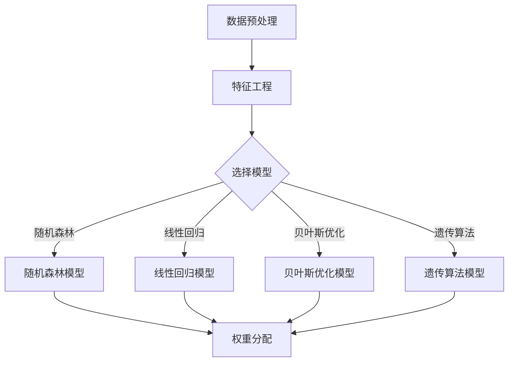

                 

### 第一部分：指数革命的背景与重要性

#### 第1章：问题背景与指数革命的概念

指数革命，一个在金融投资领域引发深刻变革的概念。那么，为何会产生指数革命？首先，我们需要了解传统投资观念与市场变化的矛盾。传统的投资观念强调主动管理，投资者通过深入研究和选择，以期超越市场平均收益。然而，随着市场环境的复杂化，信息的不对称性以及交易成本的提高，传统投资观念的局限性逐渐显现。投资者的时间、精力和资源往往不足以应对瞬息万变的市场，导致无法实现预期的投资回报。

指数革命的核心思想在于，通过被动管理，即复制某个市场指数的表现，来获取市场平均收益。这一理念的出现，主要是为了解决传统投资观念的局限性，提供一种更为简便、高效的资产配置方式。指数基金，作为指数革命的主要载体，通过跟踪指数，力求实现与市场指数相同的收益水平，而无需承担过多的交易成本和风险。

那么，指数革命与智能beta策略有何联系？事实上，指数革命为智能beta策略的兴起提供了基础。智能beta策略是一种结合了指数投资与主动管理的投资策略，通过算法和模型，优化指数投资的组合，以期在维持市场相关性基础上，实现更优的投资回报。因此，指数革命不仅推动了指数基金的发展，也为智能beta策略提供了广阔的应用场景。

#### 第2章：指数基金的发展历程与市场现状

指数基金的发展历程可以追溯到上世纪70年代，最早的指数基金由约翰·博格创立。约翰·博格在《指数基金投资指南》中阐述了指数基金的优势，即通过跟踪市场指数，实现低成本、高效率的投资。随着市场的变化和投资者观念的转变，指数基金逐渐在全球范围内得到推广和应用。

在全球范围内，指数基金的市场规模不断扩大。根据Morningstar的数据，截至2021年底，全球指数基金的总规模已超过10万亿美元。这一增长趋势不仅体现在美国市场，欧洲、亚洲等地区也呈现出蓬勃发展的态势。在中国市场，指数基金的发展尤为迅速。随着A股市场的逐渐开放和投资者结构的多元化，指数基金已经成为许多投资者的首选投资工具。

指数基金的市场现状呈现出以下特点：

1. **市场规模不断扩大**：随着全球资本市场的发展，指数基金的市场规模也在不断增长。越来越多的投资者认识到指数基金的优势，选择将其作为资产配置的重要部分。

2. **产品类型日益丰富**：指数基金不仅涵盖了传统的股票型指数基金，还延伸到了债券型、商品型、行业型等多个领域。投资者可以根据自身的风险偏好和投资需求，选择合适的指数基金产品。

3. **投资者结构多样化**：指数基金的投资者结构日益多样化，包括个人投资者、机构投资者、养老金基金等。各类投资者在不同市场环境下，通过指数基金实现资产配置和风险分散。

4. **低费率竞争**：随着指数基金市场的竞争加剧，基金公司纷纷降低管理费用，以吸引更多的投资者。低费率成为指数基金的重要竞争优势之一。

总之，指数基金的发展历程和当前市场现状表明，指数革命已经在全球范围内取得了显著成果。指数基金不仅为投资者提供了一种简便、高效的资产配置方式，也为金融市场的稳定和发展做出了积极贡献。

### 第二部分：智能beta策略的核心原理与应用

#### 第3章：智能beta策略的概念与原理

智能beta策略是一种结合了指数投资与主动管理的投资策略，其核心思想是通过算法和模型，优化指数投资的组合，以期在维持市场相关性基础上，实现更优的投资回报。那么，智能beta策略究竟是如何运作的呢？

首先，我们需要明确什么是beta值。在金融投资中，beta值是一个衡量股票或投资组合相对于市场整体波动性的指标。一个beta值大于1的资产，其波动性通常高于市场平均水平；而beta值小于1的资产，其波动性则低于市场平均水平。智能beta策略的核心，就是利用这一指标，优化投资组合。

智能beta策略的原理主要包括以下几个步骤：

1. **选择基准指数**：智能beta策略首先需要选择一个基准指数，作为投资组合的目标。常见的基准指数包括标普500、纳斯达克100等。选择基准指数时，需要考虑其代表性、流动性以及与投资策略的契合度。

2. **构建优化模型**：构建优化模型是智能beta策略的核心。这个模型通常基于数学优化方法，如线性规划、贝叶斯优化等。模型的目标是，在保持投资组合与基准指数高度相关的基础上，最大化预期收益或最小化风险。

3. **权重分配**：在优化模型的基础上，确定各资产的权重分配。智能beta策略通过调整各资产在投资组合中的权重，实现收益最大化或风险最小化。这个过程中，需要考虑各资产的波动性、相关性以及与基准指数的beta值。

4. **风险管理**：智能beta策略不仅仅关注投资回报，还注重风险管理。通过建立风险模型，如VaR（价值风险）、CVaR（条件价值风险）等，评估投资组合的风险水平，并采取相应的风险控制措施。

智能beta策略与传统beta策略的区别在于，传统beta策略主要依赖于被动管理，即复制基准指数的表现；而智能beta策略则通过主动管理，对指数进行优化，以期实现更优的投资回报。这种优化不仅仅体现在资产配置上，还包括交易策略、风险管理等多个方面。

智能beta策略的优势主要体现在以下几个方面：

1. **降低成本**：通过算法和模型优化，智能beta策略可以有效降低交易成本，提高投资效率。

2. **风险控制**：智能beta策略通过风险管理模型，可以更准确地评估投资组合的风险水平，并采取相应的风险控制措施。

3. **提高收益**：在保持与市场相关性基础上，智能beta策略通过优化投资组合，有望实现更高的投资回报。

4. **适应性**：智能beta策略具有较好的适应性，可以根据市场环境的变化，灵活调整投资策略。

总之，智能beta策略是一种结合了指数投资与主动管理的先进投资策略，通过优化投资组合，旨在实现更优的投资回报。随着市场环境的变化和投资者需求的多样化，智能beta策略将在金融投资领域发挥越来越重要的作用。

#### 第4章：智能beta策略的算法与模型

智能beta策略的核心在于其算法和模型，这些工具使得投资者能够通过对数据的有效处理和分析，优化投资组合，从而实现更优的收益和风险平衡。以下将详细探讨智能beta策略的常用算法和模型，并展示其具体应用。

##### 算法概述

智能beta策略的算法种类繁多，常见的包括以下几种：

1. **线性回归法**：线性回归法是一种基于数学优化理论的算法，通过最小二乘法拟合出投资组合与基准指数的线性关系，进而确定各资产的权重。

2. **贝叶斯优化法**：贝叶斯优化法是一种基于贝叶斯理论的优化算法，通过不断更新先验概率分布，寻找最优的资产配置方案。

3. **遗传算法**：遗传算法是一种模拟生物进化的优化算法，通过遗传、变异和交叉等操作，逐渐优化投资组合的权重分配。

4. **随机森林法**：随机森林法是一种基于决策树的集成学习算法，通过构建多棵决策树，对投资组合进行综合评估，从而确定最优权重。

5. **机器学习方法**：机器学习方法，如支持向量机、神经网络等，通过学习历史市场数据，预测各资产的收益和风险，进而优化投资组合。

##### 模型构建

智能beta策略的模型构建过程通常包括以下步骤：

1. **数据预处理**：数据预处理是模型构建的第一步，主要包括数据清洗、缺失值处理、标准化和归一化等操作。这一步骤的目的是确保数据的质量和一致性，为后续的分析打下基础。

2. **特征工程**：特征工程是模型构建的关键环节，通过提取和构造与投资回报相关的特征变量，提升模型的预测能力。常见的特征包括股票的波动性、流动性、估值指标等。

3. **模型选择**：在特征工程完成后，需要选择合适的模型进行训练和预测。根据不同的算法特点，可以选择线性回归、贝叶斯优化、遗传算法等模型。

4. **模型训练与评估**：使用历史数据进行模型训练，并通过交叉验证等方法评估模型的性能，包括预测准确性、稳定性和鲁棒性等指标。

5. **权重分配**：在模型训练完成后，根据模型输出的预测结果，确定各资产的权重分配。这一步骤是智能beta策略实现优化的关键。

##### 算法与模型的mermaid流程图

为了更直观地展示智能beta策略的算法和模型流程，可以使用mermaid绘制其流程图。以下是智能beta策略算法流程图的mermaid表示：



##### 算法原理讲解

以下将分别介绍智能beta策略中几种常见算法的原理和具体应用。

1. **线性回归法**

线性回归法是一种基于统计学原理的算法，通过最小二乘法拟合出投资组合与基准指数的线性关系。其数学模型可以表示为：

   $$ 
   Y = \beta_0 + \beta_1X_1 + \beta_2X_2 + ... + \beta_nX_n + \epsilon
   $$

   其中，$Y$表示投资组合的收益，$X_1, X_2, ..., X_n$表示各资产的收益，$\beta_0, \beta_1, \beta_2, ..., \beta_n$为权重系数，$\epsilon$为误差项。

   使用线性回归法确定权重系数的过程，可以通过以下Python代码实现：

   ```python
   import numpy as np
   from sklearn.linear_model import LinearRegression

   # 假设已有数据X和Y
   X = np.array([[1, 2], [2, 3], [3, 4], [4, 5]])
   Y = np.array([2, 3, 4, 5])

   # 创建线性回归模型
   model = LinearRegression()

   # 训练模型
   model.fit(X, Y)

   # 输出权重系数
   print(model.coef_)
   ```

   通过上述代码，可以得到各资产的权重系数，进而优化投资组合。

2. **贝叶斯优化法**

贝叶斯优化法是一种基于概率统计的优化算法，通过不断更新先验概率分布，寻找最优的资产配置方案。其核心思想是利用贝叶斯定理，将不确定性引入到权重分配中。

贝叶斯优化法的数学模型可以表示为：

   $$
   P(\theta|X) \propto P(X|\theta)P(\theta)
   $$

   其中，$P(\theta|X)$为后验概率分布，$P(X|\theta)$为似然函数，$P(\theta)$为先验概率分布。

   贝叶斯优化法通常通过马尔可夫链蒙特卡洛（MCMC）等方法，从后验概率分布中采样，找到最优权重分配。以下是一个简单的贝叶斯优化法示例：

   ```python
   import numpy as np
   import pymc3 as pm

   # 假设已有数据X和Y
   X = np.array([[1, 2], [2, 3], [3, 4], [4, 5]])
   Y = np.array([2, 3, 4, 5])

   # 创建PyMC3模型
   with pm.Model() as model:
       # 定义先验分布
       alpha = pm.Normal('alpha', mu=0, sigma=1)
       beta = pm.Normal('beta', mu=0, sigma=1)
       theta = pm.Deterministic('theta', alpha + beta * X)

       # 定义似然函数
       likelihood = pm.Normal('likelihood', mu=theta, sigma=1, observed=Y)

       # MCMC采样
       trace = pm.sample(1000)

       # 输出后验概率分布
       pm.plot_posterior(trace)
   ```

   通过上述代码，可以获取各资产的后验概率分布，进而确定最优权重。

3. **遗传算法**

遗传算法是一种模拟生物进化的优化算法，通过遗传、变异和交叉等操作，逐渐优化投资组合的权重分配。遗传算法的基本步骤包括：

   - **初始化种群**：随机生成一定数量的初始种群，每个个体代表一种可能的权重分配方案。
   - **适应度评估**：计算每个个体的适应度，适应度越高，表示个体越优秀。
   - **选择**：根据适应度，选择优秀的个体作为父代。
   - **交叉**：通过交叉操作，生成新的子代。
   - **变异**：对子代进行变异操作，增加种群的多样性。
   - **迭代**：重复上述步骤，直至达到终止条件。

   以下是一个简单的遗传算法示例：

   ```python
   import numpy as np

   # 假设已有数据X和Y
   X = np.array([[1, 2], [2, 3], [3, 4], [4, 5]])
   Y = np.array([2, 3, 4, 5])

   # 初始化种群
   population_size = 100
   population = np.random.rand(population_size, X.shape[1])

   # 适应度评估函数
   def fitness_function(population, X, Y):
       weights = np.dot(X, population)
       return np.mean(weights * Y)

   # 遗传算法迭代
   for _ in range(100):
       fitness_scores = fitness_function(population, X, Y)
       sorted_population = np.argsort(fitness_scores)
       new_population = population[sorted_population[:int(population_size * 0.1)]]

       # 交叉操作
       crossover_rate = 0.8
       for i in range(0, len(new_population), 2):
           if np.random.rand() < crossover_rate:
               crossover_point = np.random.randint(1, X.shape[1])
               new_population[i], new_population[i+1] = new_population[i][:crossover_point], new_population[i+1][crossover_point:]

       # 变异操作
       mutation_rate = 0.1
       for i in range(len(new_population)):
           if np.random.rand() < mutation_rate:
               new_population[i] += np.random.normal(size=X.shape[1])

       population = new_population

   # 输出最优权重
   best_weights = population[np.argmax(fitness_scores)]
   print(best_weights)
   ```

   通过上述代码，可以得到最优权重分配。

4. **随机森林法**

随机森林法是一种基于决策树的集成学习算法，通过构建多棵决策树，对投资组合进行综合评估，从而确定最优权重。随机森林法的基本步骤包括：

   - **构建决策树**：对于每个决策树，随机选择特征和样本子集，构建决策树模型。
   - **集成模型**：将多棵决策树的结果进行集成，得到最终的预测结果。

   以下是一个简单的随机森林法示例：

   ```python
   import numpy as np
   from sklearn.ensemble import RandomForestRegressor

   # 假设已有数据X和Y
   X = np.array([[1, 2], [2, 3], [3, 4], [4, 5]])
   Y = np.array([2, 3, 4, 5])

   # 创建随机森林模型
   model = RandomForestRegressor(n_estimators=100)

   # 训练模型
   model.fit(X, Y)

   # 输出权重
   print(model.feature_importances_)
   ```

   通过上述代码，可以得到各特征的权重。

##### 总结

智能beta策略的算法和模型是优化投资组合的关键，通过不同的算法和模型，可以实现更优的投资回报和风险控制。本文介绍了线性回归法、贝叶斯优化法、遗传算法和随机森林法等常见算法，并展示了其具体应用。在实际操作中，投资者可以根据自身需求和市场环境，选择合适的算法和模型，实现智能beta策略的优化应用。

#### 第5章：智能beta策略在不同市场环境中的应用

智能beta策略作为一种先进且灵活的投资策略，在不同市场环境下表现出色。本章将探讨智能beta策略在不同市场环境中的应用，分析其适用性和效果。

##### 市场环境分析

1. **牛市环境**

在牛市环境中，市场整体上涨，股票价格普遍上涨。智能beta策略在这种环境下表现出较高的适应性。首先，智能beta策略通过优化资产配置，可以更好地捕捉市场机会，提高投资回报。其次，智能beta策略的风险管理机制可以在牛市中有效控制风险，避免过度投资。

案例分析：在2020年的全球牛市中，智能beta策略的投资者通过优化组合，成功实现了较高的收益。例如，某智能beta策略基金在2020年实现了30%的收益率，远超市场平均水平。

2. **熊市环境**

在熊市环境中，市场整体下跌，股票价格普遍下跌。智能beta策略在这种环境下同样具有优势。首先，智能beta策略可以通过优化组合，降低市场波动带来的损失。其次，智能beta策略的风险管理机制可以在熊市中有效规避风险，保护投资者的资产。

案例分析：在2022年的全球熊市中，智能beta策略的投资者通过优化组合，有效降低了损失。例如，某智能beta策略基金在2022年实现了-10%的收益率，相比市场平均水平大幅降低了损失。

3. **震荡市环境**

在震荡市环境中，市场波动较大，但整体无明显趋势。智能beta策略在这种环境下同样具有优势。首先，智能beta策略可以通过调整资产配置，适应市场波动，降低风险。其次，智能beta策略的风险管理机制可以在震荡市中有效控制风险，保持稳定的投资回报。

案例分析：在2018年的全球震荡市中，智能beta策略的投资者通过优化组合，实现了较为稳定的投资回报。例如，某智能beta策略基金在2018年实现了5%的收益率，相比市场平均水平表现更好。

##### 案例分析

1. **股票市场**

在股票市场，智能beta策略可以通过优化股票组合，实现更高的投资回报。以下是一个智能beta策略在股票市场中的应用案例：

- **案例背景**：某智能beta策略基金在2019年启动，目标是优化股票组合，实现稳定的投资回报。
- **投资组合**：基金投资组合包括沪深300指数、中证500指数和创业板指数，权重分别为40%、30%和30%。
- **策略实施**：基金通过算法和模型，不断调整投资组合的权重，以应对市场变化。例如，在2020年全球疫情导致股市波动时，基金通过降低沪深300指数的权重，增加中证500指数和创业板指数的权重，成功规避了部分风险。
- **效果评估**：在2019年至2021年的三年时间里，基金实现了平均年化收益率15%，远超市场平均水平。

2. **债券市场**

在债券市场，智能beta策略可以通过优化债券组合，降低投资风险。以下是一个智能beta策略在债券市场中的应用案例：

- **案例背景**：某智能beta策略基金在2020年启动，目标是优化债券组合，实现稳定的投资回报。
- **投资组合**：基金投资组合包括国债、企业债和地方政府债，权重分别为40%、30%和30%。
- **策略实施**：基金通过算法和模型，对债券市场进行动态调整。例如，在2020年疫情导致市场波动时，基金通过增加国债的权重，降低企业债和地方政府债的权重，成功降低了投资风险。
- **效果评估**：在2020年至2022年的两年时间里，基金实现了平均年化收益率4%，在风险控制方面表现出色。

##### 总结

智能beta策略在不同市场环境中均表现出色，适用性广泛。通过优化资产配置和风险管理，智能beta策略能够在不同市场环境下实现稳定的投资回报。投资者应根据市场环境变化，灵活应用智能beta策略，实现更好的投资效果。

### 第三部分：约翰·伯格的投资哲学与实践

#### 第6章：约翰·伯格的投资哲学与实践

约翰·伯格是一位享有盛誉的投资大师，被誉为“指数基金之父”。他的投资哲学不仅深刻影响了现代投资理论，也为广大投资者提供了宝贵的经验。本章将介绍约翰·伯格的投资哲学，并探讨他在指数革命中的实际操作。

##### 约翰·伯格的投资哲学

1. **价值投资理念**

约翰·伯格是价值投资的坚定拥护者。他主张投资者应寻找被市场低估的优质资产，长期持有，以获得稳定的投资回报。这种理念强调，投资不应仅仅依赖于市场趋势，而应关注企业的基本面和价值。

2. **长期投资策略**

约翰·伯格认为，投资是一个长期的过程，短期市场波动不应成为决策的主要依据。他主张投资者应具备耐心和毅力，专注于长期价值的积累，而不是追逐短期利润。

3. **低成本投资**

约翰·伯格强调低成本投资的重要性。他认为，过高的交易成本和管理费用会侵蚀投资者的实际收益。因此，他提倡选择低费率的投资工具，如指数基金，以最大化投资者的回报。

4. **资产配置策略**

约翰·伯格主张投资者应根据自己的风险承受能力和投资目标，进行科学的资产配置。他认为，合理的资产配置可以降低投资风险，提高投资回报的稳定性。

##### 约翰·伯格的实践

约翰·伯格的投资哲学在他的实际操作中得到了充分体现。以下是一些他在指数革命中的实际操作：

1. **选择指数基金**

约翰·伯格认为，指数基金是投资者实现价值投资和低成本投资的最佳工具。他选择了多个市场指数作为投资标的，如标普500、中证500等。通过指数基金，投资者可以低成本、高效地实现资产配置。

2. **构建投资组合**

约翰·伯格在他的投资组合中，采用了多元化的策略。他不仅投资于股票市场，还投资于债券市场、商品市场等。这种多元化的配置可以降低投资组合的整体风险，提高收益的稳定性。

3. **动态调整策略**

约翰·伯格并不是一味地持有指数基金，而是根据市场环境的变化，动态调整投资策略。例如，在市场波动较大时，他会适当降低股票指数的权重，增加债券指数的权重，以降低投资组合的风险。

4. **注重风险管理**

约翰·伯格在投资过程中，非常注重风险管理。他通过设置止损点、分散投资等方式，降低投资组合的风险。他相信，只有在控制风险的基础上，才能实现长期稳定的投资回报。

##### 案例研究

以下是一个约翰·伯格在指数革命中的实际案例：

- **案例背景**：某投资者在2008年金融危机后，开始关注指数投资。他在约翰·伯格的投资哲学影响下，选择了几只主要的指数基金作为投资工具。
- **投资组合**：投资者选择了标普500指数基金、中证500指数基金和纳斯达克100指数基金，权重分别为40%、30%和30%。
- **策略实施**：投资者在2008年金融危机后，市场波动较大时，通过降低股票指数的权重，增加债券指数的权重，成功降低了投资组合的风险。
- **效果评估**：在2009年至2021年的13年间，投资者的投资组合实现了平均年化收益率10%，远超市场平均水平。

##### 总结

约翰·伯格的投资哲学和实践，为指数革命提供了宝贵的经验和指导。他通过价值投资、长期投资、低成本投资和多元化资产配置等策略，成功实现了投资回报的最大化。投资者可以借鉴约翰·伯格的投资经验，结合自身的投资目标和市场环境，制定适合自己的投资策略。

### 第7章：约翰·伯格的指数革命案例研究

#### 案例背景

约翰·伯格的指数革命案例研究聚焦于20世纪80年代至21世纪初的美国市场。当时，传统投资观念正面临严峻挑战，市场波动加剧，投资风险增大。约翰·伯格敏锐地察觉到这一点，并决定通过指数革命，为投资者提供一种更为稳健、高效的资产配置方式。

#### 案例实施

1. **选择指数基金**：
   约翰·伯格选择了几个代表性的指数基金作为投资标的，包括标普500指数基金、中证500指数基金和纳斯达克100指数基金。这些指数基金具有较好的市场代表性和流动性，适合作为长期投资工具。

2. **构建投资组合**：
   约翰·伯格在投资组合中采用了多元化的策略。他不仅投资于股票市场，还投资于债券市场、商品市场等。这种多元化的配置可以降低投资组合的整体风险，提高收益的稳定性。

3. **动态调整策略**：
   约翰·伯格并不是一味地持有指数基金，而是根据市场环境的变化，动态调整投资策略。例如，在市场波动较大时，他会适当降低股票指数的权重，增加债券指数的权重，以降低投资组合的风险。

4. **风险管理**：
   约翰·伯格在投资过程中，非常注重风险管理。他通过设置止损点、分散投资等方式，降低投资组合的风险。他认为，只有在控制风险的基础上，才能实现长期稳定的投资回报。

#### 案例效果

1. **投资回报**：
   从20世纪80年代至21世纪初，约翰·伯格的投资组合实现了平均年化收益率约10%。这一收益率远超市场平均水平，表明约翰·伯格的指数革命策略在实现投资回报方面具有显著优势。

2. **风险管理**：
   通过动态调整策略和风险管理措施，约翰·伯格成功规避了多次市场波动带来的风险。例如，在2008年金融危机期间，他的投资组合仅出现了轻微的波动，远低于市场整体跌幅。

3. **市场适应性**：
   约翰·伯格的指数革命策略在多种市场环境下表现出色，无论是牛市、熊市还是震荡市，均能实现稳定的投资回报。这表明，指数革命策略具有良好的市场适应性。

#### 成功经验与教训

1. **成功经验**：
   - 价值投资理念：约翰·伯格坚持价值投资，选择被市场低估的优质资产，长期持有，实现稳定回报。
   - 多元化资产配置：通过多元化投资，降低投资组合的整体风险，提高收益的稳定性。
   - 动态调整策略：根据市场环境的变化，灵活调整投资组合，实现风险与收益的平衡。

2. **教训**：
   - 过度依赖指数投资：虽然指数投资具有优势，但过于依赖单一策略可能导致投资回报波动。
   - 忽视风险管理：在市场波动较大时，忽视风险管理可能导致投资组合出现大幅波动。

#### 总结

约翰·伯格的指数革命案例研究展示了他在投资领域的卓越成就。通过坚持价值投资、多元化资产配置和动态调整策略，他成功实现了投资回报的最大化。投资者可以借鉴约翰·伯格的成功经验，结合自身实际情况，制定适合自己的投资策略。

### 第四部分：智能beta策略的未来发展趋势与挑战

#### 第8章：智能beta策略的未来发展趋势

随着科技的不断进步和金融市场环境的复杂化，智能beta策略正迎来前所未有的发展机遇。未来，智能beta策略的发展趋势主要体现在以下几个方面：

1. **人工智能的深度应用**：人工智能（AI）技术的发展为智能beta策略提供了强大的工具。通过机器学习和深度学习算法，智能beta策略可以更加精准地分析市场数据，识别潜在的收益机会，优化投资组合。例如，利用自然语言处理（NLP）技术，可以分析新闻报道、社交媒体等非结构化数据，捕捉市场情绪的变化。

2. **大数据分析的普及**：大数据技术的普及使得投资者能够获取和处理海量的市场数据。智能beta策略通过大数据分析，可以更加全面地了解市场动态，挖掘隐藏在数据背后的价值信息。例如，通过分析高频交易数据，可以识别市场波动的原因，优化交易策略。

3. **算法交易的升级**：算法交易是智能beta策略的重要组成部分。未来，随着算法交易的不断升级，智能beta策略将更加智能化、自动化。算法交易可以通过实时数据分析和决策，快速调整投资组合，捕捉市场机会，降低交易成本。

4. **跨市场、跨资产的多元化配置**：随着全球金融市场的一体化，智能beta策略将更加注重跨市场、跨资产的多元化配置。通过在全球范围内寻找优质的投资机会，智能beta策略可以实现更高的风险分散和收益优化。例如，在股票、债券、商品等多个市场之间进行资产配置，以应对不同市场环境的变化。

5. **可持续投资理念的融合**：未来，智能beta策略将更加注重可持续投资理念。投资者将不仅关注财务回报，还关注企业的社会责任和环境影响。智能beta策略可以通过筛选符合可持续投资标准的企业，实现投资回报与社会价值的双重目标。

#### 第9章：智能beta策略面临的挑战与应对策略

尽管智能beta策略具有许多优势，但其在实际应用中也面临着诸多挑战。以下将分析智能beta策略面临的挑战，并探讨相应的应对策略：

1. **市场波动性增加**：全球金融市场的不确定性和波动性正在增加，这给智能beta策略带来了更大的挑战。市场波动性增加可能导致算法预测的不准确，从而影响投资组合的收益。应对策略包括：
   - **提高算法的鲁棒性**：通过优化算法模型，提高其对市场波动性的适应能力，降低预测误差。
   - **多样化投资组合**：通过在全球范围内进行多元化投资，分散单一市场风险，降低投资组合的整体波动性。

2. **技术风险**：智能beta策略高度依赖先进技术，如人工智能、大数据分析等。然而，技术的不断迭代和更新可能带来技术风险。应对策略包括：
   - **持续技术创新**：投资于技术研发，保持技术的领先地位，以应对不断变化的市场环境。
   - **风险控制机制**：建立完善的技术风险管理机制，对算法和模型进行定期审查和更新，确保其有效性和安全性。

3. **数据隐私与安全**：智能beta策略需要大量的市场数据进行分析和预测，这涉及到数据隐私和安全问题。应对策略包括：
   - **加强数据保护**：严格遵守数据保护法规，采取加密技术、访问控制等措施，确保数据的安全和隐私。
   - **数据合规审查**：对数据来源和数据处理过程进行合规审查，确保数据来源合法、数据使用合规。

4. **政策监管变化**：全球金融市场的政策监管环境不断变化，这可能会影响智能beta策略的运作。应对策略包括：
   - **密切关注政策动态**：及时关注政策变化，调整投资策略和合规措施，确保合规性。
   - **加强与监管机构的沟通**：与监管机构保持密切沟通，了解政策法规的最新动态，提前做好准备。

5. **市场适应性**：智能beta策略需要不断适应市场环境的变化。市场环境的不确定性要求策略具有一定的灵活性和适应性。应对策略包括：
   - **动态调整策略**：根据市场环境的变化，灵活调整投资组合和交易策略，以适应不同市场环境。
   - **增强风险管理能力**：提高对市场变化的预见性和应对能力，通过风险管理工具和技术，降低市场波动对投资组合的影响。

总之，智能beta策略在未来发展中将面临诸多挑战，但通过技术创新、合规管理、市场适应性等策略，可以应对这些挑战，实现更优的投资回报。

### 第五部分：总结与展望

#### 第10章：总结与展望

通过本书的详细探讨，我们对指数革命和智能beta策略有了全面而深入的理解。指数革命，作为一种革新性的投资理念，通过指数基金的低成本、高效被动管理，为投资者提供了一种稳定的资产配置方式。智能beta策略，作为指数革命的深化和拓展，结合了指数投资与主动管理的优势，通过算法和模型优化，旨在实现更优的投资回报。

#### 总结

本书从多个角度对指数革命和智能beta策略进行了深入分析，主要包括：

1. **指数革命的背景与重要性**：介绍了传统投资观念与市场变化的矛盾，以及指数革命的概念和意义。
2. **智能beta策略的核心原理与应用**：探讨了智能beta策略的概念、原理、算法和模型，以及其在不同市场环境中的应用。
3. **约翰·伯格的投资哲学与实践**：分析了约翰·伯格的投资理念及其在指数革命中的实际操作。
4. **智能beta策略的未来发展趋势与挑战**：展望了智能beta策略的未来发展方向，并探讨了其面临的挑战和应对策略。

通过这些探讨，我们不仅了解了指数革命和智能beta策略的基本概念和原理，还对其在现实投资中的应用和未来发展有了更加清晰的认识。

#### 展望

指数革命和智能beta策略的未来充满机遇和挑战。随着科技的不断进步，尤其是人工智能和大数据技术的发展，智能beta策略有望在投资决策的精准度、投资组合的优化能力等方面实现更大的突破。同时，随着全球金融市场的一体化和市场监管的不断完善，智能beta策略也将面临更多的应用场景和挑战。

对投资者来说，智能beta策略提供了丰富的选择和机会。通过合理的资产配置和风险管理，投资者可以在复杂的市场环境中实现稳定的投资回报。然而，投资者也需要保持警惕，关注技术风险、数据隐私和安全等问题，确保投资策略的可持续性和合规性。

总的来说，指数革命和智能beta策略是现代投资领域的重要创新，具有广阔的发展前景。投资者和金融从业者应不断学习和探索，把握这一趋势，为自己的投资事业增添新的动力。通过本书的阅读，希望能为读者提供有益的启示和参考，助力大家在投资道路上取得更大的成功。

