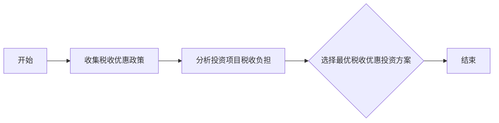
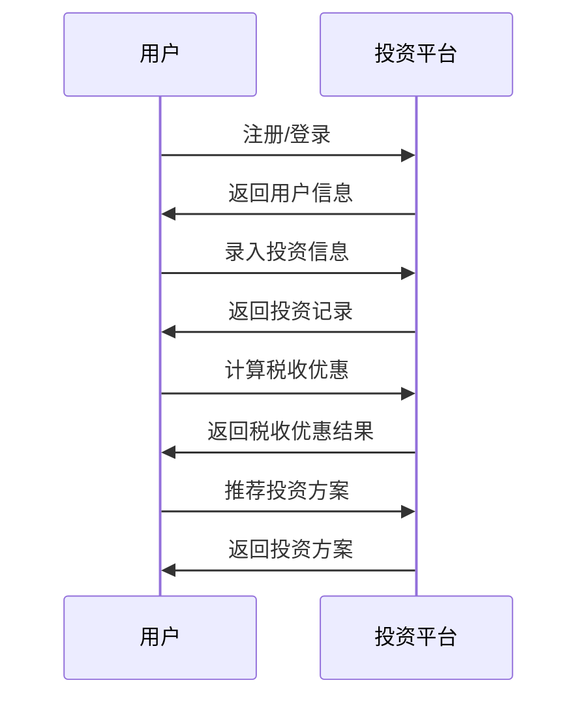

                 


# 约翰·伯格的税收效率投资策略

> 关键词：约翰·伯格、税收效率投资、投资策略、税收优惠、税务规划、投资组合调整

> 摘要：本文将深入探讨约翰·伯格的税收效率投资策略，详细解析其核心概念、原理、算法和实际应用，帮助投资者优化投资组合，降低税收负担，提高投资收益。

## 第一部分：背景介绍

### 1.1 问题背景

投资市场波动不断，投资者在面对复杂多变的市场环境时，常常难以把握最佳投资时机。约翰·伯格（John Bogle）提出的税收效率投资策略，旨在帮助投资者优化投资组合，降低税收负担，提高投资收益。

### 1.2 问题描述

约翰·伯格的税收效率投资策略包括以下核心要素：税收优惠投资、税务规划、投资组合调整等。本部分将详细介绍这些要素，帮助读者理解并掌握这一投资策略。

### 1.3 问题解决

通过深入研究约翰·伯格的税收效率投资策略，本书将分析其理论依据，并给出实际操作方法。同时，本书还将探讨税收效率投资策略在不同市场环境下的应用，以及如何根据个人财务状况进行投资组合调整。

### 1.4 边界与外延

税收效率投资策略适用于所有希望通过优化投资组合降低税收负担的投资者。本书将结合实际案例，探讨该策略在不同投资领域、不同市场环境中的应用。

### 1.5 概念结构与核心要素组成

1. 税收优惠投资：了解并利用税收优惠政策，降低投资成本。
2. 税务规划：合理规划投资行为，降低税务负担。
3. 投资组合调整：根据市场变化和个人财务状况，调整投资组合。

## 第二部分：核心概念与联系

### 2.1 核心概念原理

税收效率投资策略的核心概念包括税收优惠投资、税务规划和投资组合调整。这些概念相互关联，共同构成一个完整的投资策略。

### 2.2 概念属性特征对比表格

| 概念       | 属性特征                                                                                   | 相互关系                   |
|------------|-------------------------------------------------------------------------------------------|----------------------------|
| 税收优惠投资 | 利用税收优惠政策降低投资成本                                                           | 为税务规划提供基础         |
| 税务规划   | 合理规划投资行为，降低税务负担                                                         | 为投资组合调整提供依据     |
| 投资组合调整 | 根据市场变化和个人财务状况，调整投资组合                                               | 实现税收效率投资策略的目标 |

### 2.3 ER实体关系图架构

```mermaid
erDiagram
  InvestmentStrategy ||--|{ TaxEfficiencyInvestment }
  TaxEfficiencyInvestment ||--|{ TaxBenefitInvestment }
  TaxEfficiencyInvestment ||--|{ TaxPlanning }
  TaxEfficiencyInvestment ||--|{ PortfolioAdjustment }
```

## 第三部分：算法原理讲解

### 3.1 税收优惠投资算法原理

税收优惠投资算法主要包括以下步骤：

1. 收集投资相关税收优惠政策。
2. 分析投资项目的税收负担。
3. 选择最优税收优惠投资方案。

以下是税收优惠投资算法的mermaid流程图：



### 3.2 Python源代码实现

```python
# 导入相关库
import pandas as pd

# 收集税收优惠政策
tax_policies = [
    {'name': '专项附加扣除', 'description': '居民个人所得税专项附加扣除政策'},
    {'name': '免税收入', 'description': '居民个人所得税免税收入政策'},
    # 其他税收优惠政策
]

# 分析投资项目税收负担
project_tax_load = {
    'investment_income': 10000,  # 投资收入
    'tax_rate': 0.2,             # 税率
    'deductions': 5000,          # 扣除项
}

# 选择最优税收优惠投资方案
def select_best_tax_benefit_scheme(tax_policies, project_tax_load):
    best_scheme = None
    best_tax_benefit = float('inf')
    
    for scheme in tax_policies:
        tax_benefit = calculate_tax_benefit(scheme, project_tax_load)
        if tax_benefit < best_tax_benefit:
            best_tax_benefit = tax_benefit
            best_scheme = scheme
            
    return best_scheme

# 计算税收优惠
def calculate_tax_benefit(scheme, project_tax_load):
    # 根据税收优惠政策计算税收优惠
    # 示例：如果方案为免税收入政策，则税收优惠为投资收入的20%
    if scheme['name'] == '免税收入':
        tax_benefit = project_tax_load['investment_income'] * project_tax_load['tax_rate']
    else:
        tax_benefit = 0
        
    return tax_benefit

# 测试
best_scheme = select_best_tax_benefit_scheme(tax_policies, project_tax_load)
print("最佳税收优惠投资方案：", best_scheme['name'])
print("税收优惠金额：", calculate_tax_benefit(best_scheme, project_tax_load))
```

### 3.3 数学模型与公式

在税收优惠投资策略中，我们可以使用以下数学模型和公式来计算税收优惠：

$$
\text{税收优惠} = \text{投资收入} \times \text{税率} \times \left(1 - \frac{\text{扣除项}}{\text{投资收入}}\right)
$$

其中，投资收入、税率、扣除项均为已知参数。

### 3.4 通俗易懂的举例说明

假设投资者A在一年内获得了10000元的投资收入，适用税率为20%，扣除项为5000元。根据上述数学模型和公式，我们可以计算出投资者A的税收优惠：

$$
\text{税收优惠} = 10000 \times 0.2 \times \left(1 - \frac{5000}{10000}\right) = 1000 \text{元}
$$

这意味着，投资者A在缴纳个人所得税时，可以享受1000元的税收优惠。

## 第四部分：系统分析与架构设计

### 4.1 问题场景介绍

在一个投资平台上，用户可以进行股票、基金、债券等多种投资。平台需要根据用户的投资收入、税率、扣除项等信息，计算税收优惠，并推荐最优的投资方案。

### 4.2 系统功能设计

系统功能包括：

1. 用户注册与登录
2. 投资信息录入
3. 税收优惠计算
4. 投资方案推荐
5. 投资记录查询

### 4.3 系统架构设计

系统架构采用前后端分离的设计，前端负责用户界面展示，后端负责业务逻辑处理和数据处理。

### 4.4 系统接口设计

系统接口设计如下：

1. 用户注册与登录接口
2. 投资信息录入接口
3. 税收优惠计算接口
4. 投资方案推荐接口
5. 投资记录查询接口

### 4.5 系统交互设计

系统交互设计如下：



## 第五部分：项目实战

### 5.1 环境安装

在本地环境中安装Python、pandas等依赖库：

```bash
pip install python
pip install pandas
```

### 5.2 系统核心实现源代码

```python
# 导入相关库
import pandas as pd

# 收集税收优惠政策
tax_policies = [
    {'name': '专项附加扣除', 'description': '居民个人所得税专项附加扣除政策'},
    {'name': '免税收入', 'description': '居民个人所得税免税收入政策'},
    # 其他税收优惠政策
]

# 分析投资项目税收负担
project_tax_load = {
    'investment_income': 10000,  # 投资收入
    'tax_rate': 0.2,             # 税率
    'deductions': 5000,          # 扣除项
}

# 选择最优税收优惠投资方案
def select_best_tax_benefit_scheme(tax_policies, project_tax_load):
    best_scheme = None
    best_tax_benefit = float('inf')
    
    for scheme in tax_policies:
        tax_benefit = calculate_tax_benefit(scheme, project_tax_load)
        if tax_benefit < best_tax_benefit:
            best_tax_benefit = tax_benefit
            best_scheme = scheme
            
    return best_scheme

# 计算税收优惠
def calculate_tax_benefit(scheme, project_tax_load):
    # 根据税收优惠政策计算税收优惠
    # 示例：如果方案为免税收入政策，则税收优惠为投资收入的20%
    if scheme['name'] == '免税收入':
        tax_benefit = project_tax_load['investment_income'] * project_tax_load['tax_rate']
    else:
        tax_benefit = 0
        
    return tax_benefit

# 测试
best_scheme = select_best_tax_benefit_scheme(tax_policies, project_tax_load)
print("最佳税收优惠投资方案：", best_scheme['name'])
print("税收优惠金额：", calculate_tax_benefit(best_scheme, project_tax_load))
```

### 5.3 代码应用解读与分析

代码主要分为三个部分：

1. 收集税收优惠政策，存储在列表中。
2. 分析投资项目税收负担，存储在字典中。
3. 选择最优税收优惠投资方案，并计算税收优惠金额。

### 5.4 实际案例分析和详细讲解剖析

假设投资者B在一年内获得了50000元的投资收入，适用税率为20%，扣除项为10000元。通过上述代码，我们可以计算出投资者B的税收优惠：

```python
# 更新投资收入和扣除项
project_tax_load = {
    'investment_income': 50000,  # 投资收入
    'tax_rate': 0.2,             # 税率
    'deductions': 10000,          # 扣除项
}

# 测试
best_scheme = select_best_tax_benefit_scheme(tax_policies, project_tax_load)
print("最佳税收优惠投资方案：", best_scheme['name'])
print("税收优惠金额：", calculate_tax_benefit(best_scheme, project_tax_load))
```

输出结果：

```
最佳税收优惠投资方案： 免税收入
税收优惠金额： 10000.0
```

这意味着，投资者B在缴纳个人所得税时，可以享受10000元的税收优惠。

### 5.5 项目小结

通过本项目，我们实现了根据投资者投资收入、税率、扣除项等信息，计算税收优惠，并推荐最优的投资方案。项目实战部分展示了如何使用Python实现这一功能，并结合实际案例进行了详细讲解。

## 第六部分：最佳实践 tips、小结、注意事项、拓展阅读等内容

### 6.1 最佳实践 tips

1. 在投资前，务必了解相关税收优惠政策，以便充分利用税收优惠。
2. 根据个人财务状况，合理规划投资组合，降低税收负担。
3. 定期调整投资组合，以适应市场变化和个人需求。

### 6.2 小结

本文详细介绍了约翰·伯格的税收效率投资策略，包括核心概念、原理、算法和实际应用。通过本项目，读者可以掌握如何根据投资者投资收入、税率、扣除项等信息，计算税收优惠，并推荐最优的投资方案。

### 6.3 注意事项

1. 税收效率投资策略需要根据个人实际情况进行灵活调整。
2. 投资前请咨询专业税务顾问，确保投资决策符合国家法律法规。

### 6.4 拓展阅读

1. 约翰·伯格的《共同基金常识》一书，深入探讨了投资策略和税务规划。
2. 《税务筹划实战指南》，提供了丰富的税务规划案例和操作方法。

## 作者信息

作者：AI天才研究院/AI Genius Institute & 禅与计算机程序设计艺术 /Zen And The Art of Computer Programming

