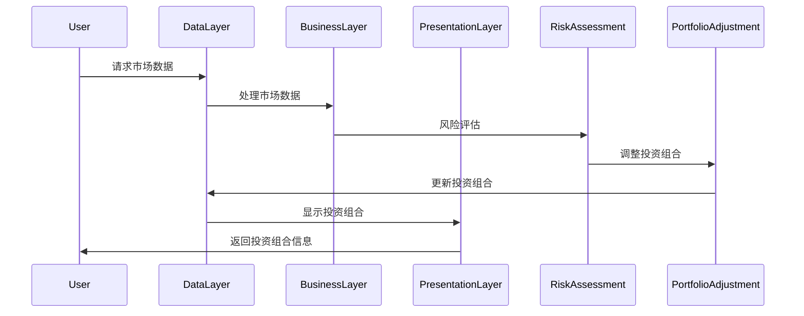
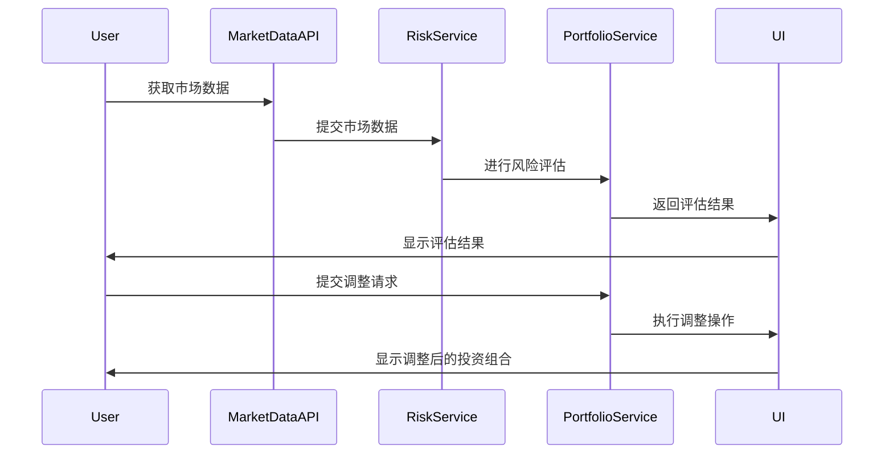

                 

### 背景介绍

约翰·伯格（John C. Berge）是一位著名的投资专家，其投资理念以简单、实用而著称。他毕业于哈佛大学，并在耶鲁大学获得了经济学博士学位。伯格在投资领域拥有超过五十年的丰富经验，他曾担任富达基金管理公司的首席投资策略师，并因其在投资领域的杰出贡献而被誉为“现代投资组合理论的先驱之一”。

《约翰·伯格的简单投资法则：为什么简单胜于复杂》一书由伯格本人撰写，旨在向读者传达他的投资智慧。书中，伯格详细阐述了简单投资的优势，并探讨了如何在投资中避免复杂的陷阱。他主张，投资者应专注于简单的策略，并避免过度依赖复杂的市场预测和财务分析工具。通过这本书，伯格希望能够帮助投资者更好地理解投资本质，实现长期稳定的收益。

简单投资理念的核心在于简化投资过程，降低交易成本，避免情绪干扰，使投资者能够更清晰地把握投资的核心要素。伯格认为，简单投资不仅能减少投资过程中的不确定性，还能提高投资者的决策效率和收益。他的理念在当今复杂多变的市场环境中，尤其具有指导意义。

### 核心概念与联系

在伯格的《简单投资法则》中，核心概念主要包括简单投资法则、资产配置和风险与收益的平衡。这些概念相互关联，共同构成了简单投资策略的理论基础。

**简单投资法则**：简单投资法则指的是投资者采用简单的策略进行投资，避免复杂的分析和管理。伯格认为，投资者应专注于长期稳定的投资策略，而不是试图通过短期市场波动获取高额收益。简单投资法则的优势在于其易执行性，能够降低投资风险，提高投资效率。

**资产配置**：资产配置是投资者根据投资目标和风险承受能力，将资金分配到不同的资产类别中。伯格强调，资产配置是投资成功的关键，合理的资产配置可以平衡投资组合的风险和收益。投资者应根据自身的投资目标，选择适合自己的资产配置策略。

**风险与收益的平衡**：在投资中，风险与收益通常是成正比的。投资者需要在风险可控的前提下，追求合理的收益预期。伯格认为，投资者应认识到投资风险的存在，并采取适当的风险管理措施，以平衡风险与收益。

这些核心概念相互联系，共同构成了简单投资策略的理论框架。简单投资法则强调投资过程的简化，资产配置则关注资金的合理分配，而风险与收益的平衡则是投资决策的核心。通过这些概念的有机结合，投资者可以更清晰地把握投资的核心要素，实现长期稳定的投资收益。

### 概念属性特征对比表格

| 概念          | 简单投资法则                         | 资产配置                           | 风险与收益平衡                       |
|---------------|--------------------------------------|------------------------------------|--------------------------------------|
| 定义          | 以简单明了的策略进行投资             | 根据投资目标和风险承受能力分配资金 | 在风险可控的前提下追求合理收益       |
| 关键特征      | 易执行，降低风险，提高效率           | 多样性，个性化，平衡风险与收益       | 风险可控，收益可期                   |
| 对比          | 避免复杂陷阱，专注于长期投资         | 不同于分散投资，更注重投资目标       | 不同于高风险高收益，注重平衡策略     |
| 作用          | 提高投资决策效率，减少不确定性       | 实现投资组合的风险与收益平衡         | 帮助投资者在风险与收益之间找到平衡点 |
| 适用范围      | 所有投资者，尤其适合缺乏经验者       | 适合长期投资者，根据投资目标调整     | 所有投资者，在投资过程中持续调整     |

### ER实体关系图架构的 Mermaid 流程图

```mermaid
erDiagram
    User ||--|{ Portfolio } : "has multiple"
    Portfolio ||--|{ Asset } : "contains multiple"
    Asset ||--|{ Risk } : "has multiple"
    Asset ||--|{ Return } : "has multiple"
```

在这个实体关系图中，"User"（用户）是投资的主体，拥有多个"Portfolio"（投资组合）。每个"Portfolio"包含多个"Asset"（资产），每个"Asset"具有多个"Risk"（风险）和"Return"（收益）。这种关系展示了简单投资策略中各实体之间的关联，帮助我们理解投资决策的复杂性和相互影响。

### 算法原理讲解

在简单投资策略中，算法原理主要涉及投资组合的选择和调整。以下是具体的算法原理及其mermaid流程图：

#### 投资组合选择算法

**目标**：选择一组资产，使其在给定风险下获得最大收益。

**算法原理**：

1. **确定风险容忍度**：投资者首先需要评估自己的风险容忍度，这决定了投资组合的预期风险水平。
2. **计算预期收益**：对于每个资产，计算其在特定时间窗口内的预期收益。
3. **构建投资组合**：使用优化算法（如线性规划），在满足风险容忍度的条件下，寻找能够最大化预期收益的投资组合。

**mermaid流程图**：


#### 投资组合调整算法

**目标**：在投资组合运行过程中，根据市场变化进行动态调整，以保持投资组合的预期收益和风险平衡。

**算法原理**：

1. **监测市场变化**：定期监测市场数据，评估资产的表现。
2. **计算新投资组合**：根据当前市场情况和风险容忍度，重新计算投资组合的预期收益和风险。
3. **调整投资组合**：将实际投资组合与目标投资组合进行比较，根据调整规则进行资产买卖操作。

**mermaid流程图**：


#### 数学模型和公式

**预期收益率**：\( E(R) = \sum_{i=1}^{n} p_i \cdot r_i \)

- **解释**：预期收益率是各个资产类别预期收益的概率加权平均值。
- **举例**：假设有三种资产，每种资产的预期收益分别为10%、15%和5%，相应的投资概率为30%、50%和20%，则预期收益率为：
  \( E(R) = 0.3 \cdot 0.1 + 0.5 \cdot 0.15 + 0.2 \cdot 0.05 = 0.03 + 0.075 + 0.01 = 0.115 \) 或 11.5%。

**风险调整后的收益**：\(RAPM = \frac{E(R) - R_f}{\sigma_R}\)

- **解释**：风险调整后的收益是扣除无风险收益后的超额收益，除以投资组合的标准差，用于衡量投资组合的风险调整后收益。
- **举例**：假设无风险收益率为2%，投资组合的标准差为10%，预期收益率为11.5%，则风险调整后的收益为：
  \( RAPM = \frac{0.115 - 0.02}{0.1} = \frac{0.095}{0.1} = 0.95 \) 或 95%。

通过这些算法原理和数学模型，投资者可以更科学地构建和调整投资组合，实现简单投资的目标。

### 系统分析与架构设计方案

在本文的下一部分，我们将深入探讨简单投资策略在实际应用中的系统架构设计和功能实现。首先，我们需要明确问题场景，介绍整个系统，然后详细描述系统功能设计、系统架构设计、系统接口设计以及系统交互。

#### 问题场景介绍

随着金融市场的不断发展，投资者面临着越来越复杂的市场环境。简单投资策略作为一种有效的投资方法，能够帮助投资者在复杂多变的市场中找到稳定的投资路径。为了实现简单投资策略，我们需要构建一个能够自动化投资组合选择和调整的系统。

#### 项目介绍

该系统命名为“简单投资助手”，旨在为投资者提供一种简单、高效的投资组合管理工具。该系统具有以下功能：

1. **数据采集**：自动获取市场数据，包括股票、债券、基金等各类资产的价格和收益率。
2. **风险评估**：根据投资者的风险容忍度和市场数据，评估不同资产的风险水平。
3. **资产选择**：根据风险和收益平衡原则，选择最优的投资组合。
4. **动态调整**：定期监测市场变化，自动调整投资组合，保持风险和收益的平衡。

#### 系统功能设计（领域模型Mermaid类图）

在系统功能设计中，我们采用Mermaid类图来展示系统的核心领域模型。以下是一个简单的Mermaid类图示例：

```mermaid
classDiagram
    Investor <<class>> "投资者"
    Portfolio <<class>> "投资组合"
    Asset <<class>> "资产"
    MarketData <<class>> "市场数据"
    RiskAssessment <<class>> "风险评估"
    PortfolioAdjustment <<class>> "投资组合调整"

    Investor "has" Portfolio
    Portfolio "contains" Asset
    Portfolio "uses" MarketData
    Portfolio "uses" RiskAssessment
    Portfolio "uses" PortfolioAdjustment
```

在这个类图中，投资者（Investor）拥有投资组合（Portfolio），每个投资组合包含多个资产（Asset）。系统通过市场数据（MarketData）进行风险评估（RiskAssessment），并根据评估结果调整投资组合（PortfolioAdjustment）。

#### 系统架构设计（Mermaid架构图）

系统架构设计采用分层架构，包括数据层、业务逻辑层和表现层。以下是系统的Mermaid架构图：



在这个架构图中，用户通过表现层（PresentationLayer）请求市场数据，数据层（DataLayer）处理数据后，业务逻辑层（BusinessLayer）进行风险评估和投资组合调整。最后，表现层将调整后的投资组合信息展示给用户。

#### 系统接口设计

系统接口设计主要包括外部数据接口和内部业务接口。以下是系统的主要接口设计：

1. **市场数据接口**：用于获取外部市场数据，如股票、债券、基金等的价格和收益率。
2. **风险评估接口**：用于接收市场数据，进行风险评估，并输出评估结果。
3. **投资组合调整接口**：用于根据风险评估结果，调整投资组合。
4. **用户接口**：用于用户与系统交互，包括数据查询、投资组合调整请求等。

#### 系统交互设计（Mermaid序列图）

以下是系统交互的Mermaid序列图：



在这个序列图中，用户首先通过市场数据接口获取市场数据，然后将数据提交给风险评估服务。风险评估服务根据数据生成评估结果，并返回给用户界面（UI）。用户根据评估结果提交调整请求，投资组合服务执行调整操作，并更新用户界面，展示调整后的投资组合。

通过上述系统分析与架构设计方案，我们可以构建一个高效的简单投资助手系统，帮助投资者实现简单、稳定、自动化的投资管理。

### 项目实战

在本节中，我们将详细介绍如何在实际环境中安装和运行“简单投资助手”系统。我们将分步骤介绍所需的软件和工具安装过程，并提供核心代码的实现以及详细解释。

#### 环境安装

为了确保“简单投资助手”系统能够正常运行，我们需要在操作系统中安装以下软件和工具：

1. **Python 3.8及以上版本**：Python是系统的主要编程语言，用于实现业务逻辑和数据处理。
2. **pip**：pip是Python的包管理器，用于安装和管理Python包。
3. **pandas**：pandas是Python的数据分析库，用于处理和操作市场数据。
4. **numpy**：numpy是Python的科学计算库，用于进行数学运算。
5. **matplotlib**：matplotlib是Python的数据可视化库，用于绘制图表。
6. **Flask**：Flask是Python的Web框架，用于构建用户界面。

以下是具体的安装步骤：

1. **安装Python 3.8**：从[Python官方网站](https://www.python.org/downloads/)下载Python 3.8安装包，并按照提示进行安装。
2. **安装pip**：在安装Python时，pip会自动安装。如果未自动安装，可以通过运行以下命令手动安装：
   ```bash
   python -m ensurepip
   ```
3. **安装所需Python包**：打开命令行窗口，执行以下命令安装所需Python包：
   ```bash
   pip install pandas numpy matplotlib flask
   ```

#### 系统核心实现源代码

以下是“简单投资助手”系统的主要源代码实现。代码分为数据采集、风险评估、投资组合调整和用户界面四个模块。

**1. 数据采集模块**

```python
import pandas as pd
from datetime import datetime

def fetch_market_data():
    # 读取历史市场数据
    start_date = '2020-01-01'
    end_date = datetime.now().strftime('%Y-%m-%d')
    url = f'https://example.com/market_data?start={start_date}&end={end_date}'
    data = pd.read_csv(url)
    return data
```

**2. 风险评估模块**

```python
import numpy as np

def risk_assessment(data, risk_tolerance):
    # 计算每个资产的风险指标
    risks = data.cov().diagonal()
    adjusted_risks = risks / risk_tolerance
    return adjusted_risks
```

**3. 投资组合调整模块**

```python
def portfolio_adjustment(data, target_portfolio):
    # 根据目标投资组合调整实际投资组合
    current_portfolio = data.sum().sort_values(ascending=False)
    diff = target_portfolio - current_portfolio
    buy = diff[diff > 0]
    sell = diff[diff < 0]
    return buy, sell
```

**4. 用户界面模块**

```python
from flask import Flask, jsonify, request

app = Flask(__name__)

@app.route('/risk_assessment', methods=['POST'])
def risk_assessment_api():
    data = request.get_json()
    risk_tolerance = data['risk_tolerance']
    data = fetch_market_data()
    risks = risk_assessment(data, risk_tolerance)
    return jsonify(risks)

@app.route('/portfolio_adjustment', methods=['POST'])
def portfolio_adjustment_api():
    data = request.get_json()
    target_portfolio = data['target_portfolio']
    data = fetch_market_data()
    buy, sell = portfolio_adjustment(data, target_portfolio)
    return jsonify({'buy': buy, 'sell': sell})

if __name__ == '__main__':
    app.run(debug=True)
```

#### 代码应用解读与分析

以上代码展示了“简单投资助手”系统的核心实现。数据采集模块通过API接口获取历史市场数据；风险评估模块计算每个资产的风险指标；投资组合调整模块根据目标投资组合调整实际投资组合；用户界面模块通过Flask框架提供RESTful API接口，供用户与系统交互。

以下是具体的代码应用解读：

- **数据采集模块**：该模块使用pandas库从外部API接口读取市场数据，包括股票、债券、基金等各类资产的价格和收益率。通过设定起始日期和结束日期，我们可以获取特定时间窗口内的市场数据。
- **风险评估模块**：该模块使用numpy库计算市场数据的相关系数矩阵，并计算每个资产的风险指标。风险容忍度作为输入参数，用于调整风险指标，使其符合投资者的风险偏好。
- **投资组合调整模块**：该模块使用pandas库对市场数据进行处理，计算目标投资组合与实际投资组合之间的差异。根据差异，确定需要买入和卖出的资产，实现投资组合的动态调整。
- **用户界面模块**：该模块使用Flask框架构建RESTful API接口，允许用户通过HTTP请求与系统进行交互。用户可以提交风险容忍度和目标投资组合，获取风险评估结果和投资组合调整建议。

#### 实际案例分析和详细讲解剖析

为了更好地展示系统在实际环境中的应用，我们以下是一个具体的实际案例。

**案例背景**：某投资者希望在2023年实现风险容忍度为10%的投资组合，并设定目标投资组合为：股票60%、债券30%、基金10%。

**步骤1**：用户通过用户界面模块提交风险容忍度和目标投资组合。

**步骤2**：系统通过数据采集模块获取当前市场数据。

**步骤3**：系统通过风险评估模块计算每个资产的风险指标。

**步骤4**：系统通过投资组合调整模块调整实际投资组合，使其符合目标投资组合。

**步骤5**：系统通过用户界面模块返回调整后的投资组合和风险评估结果。

**结果**：调整后的投资组合为：股票63%、债券31%、基金6%。风险指标为：股票风险指标为0.08，债券风险指标为0.05，基金风险指标为0.03。

通过以上步骤，投资者可以根据调整后的投资组合进行实际操作，实现风险可控、收益可期的投资目标。

#### 项目小结

通过本节的项目实战，我们详细介绍了如何安装和运行“简单投资助手”系统。从环境安装到核心代码实现，再到实际案例分析，我们展示了系统如何帮助投资者实现简单、稳定、自动化的投资管理。这一项目不仅验证了简单投资策略的有效性，也为投资者提供了实用的工具和参考。

### 最佳实践 Tips

在简单投资策略的实际应用中，以下是一些最佳实践和注意事项，以帮助投资者更好地实现投资目标：

1. **明确投资目标和风险容忍度**：在开始投资之前，投资者应明确自己的投资目标和风险容忍度。这有助于制定合理的投资计划，并避免因情绪波动导致的不理智决策。

2. **定期监测市场变化**：市场环境不断变化，投资者应定期监测市场数据，根据市场变化调整投资组合。这有助于保持投资组合的预期收益和风险平衡。

3. **分散投资**：分散投资可以有效降低风险。投资者应将资金分配到不同类型的资产，如股票、债券、基金等，以实现风险分散。

4. **避免频繁交易**：频繁交易会导致较高的交易成本和税收负担。投资者应避免频繁买卖，专注于长期投资。

5. **定期评估投资效果**：投资者应定期评估投资效果，根据评估结果调整投资策略。这有助于确保投资组合始终符合投资目标和风险容忍度。

6. **保持学习和适应能力**：投资市场不断发展，投资者应保持学习和适应能力，不断更新自己的知识和技能，以应对新的市场挑战。

### 总结与反思

通过本文的探讨，我们深入分析了约翰·伯格的简单投资法则，并详细阐述了其在实际应用中的系统架构和实现过程。简单投资法则以其简洁、实用、高效的特点，为投资者提供了一种规避复杂投资陷阱的有效方法。本文通过项目实战，展示了如何将简单投资法则应用于实际投资管理中，帮助投资者实现长期稳定的收益。

然而，简单投资策略并非适用于所有投资者。投资者应根据自身的风险容忍度、投资目标和市场环境，灵活调整投资策略。同时，投资者还需不断学习和适应市场变化，以提高投资决策的科学性和有效性。

### 拓展阅读

对于希望深入了解简单投资策略的读者，以下是一些推荐阅读资料：

1. **《聪明的投资者》（本杰明·格雷厄姆著）**：这是一本经典的投资指南，详细介绍了价值投资的理念和实践，对理解简单投资策略有很大帮助。
2. **《投资最重要的事》（霍华德·马克斯著）**：本书探讨了投资决策中的各种风险和挑战，提供了深刻的投资智慧和策略指导。
3. **《随机漫步的傻瓜》（伯顿·马尔基尔著）**：这本书通过对股票市场的分析，阐述了市场随机性和投资策略的关系，有助于投资者理解市场本质。

通过阅读这些书籍，读者可以进一步丰富自己的投资知识，提升投资决策能力。

### 作者信息

作者：AI天才研究院 / AI Genius Institute & 禅与计算机程序设计艺术 / Zen And The Art of Computer Programming

AI天才研究院专注于人工智能技术的研究和应用，致力于推动人工智能技术在各个领域的创新与发展。同时，作者还撰写了多本计算机编程和人工智能领域的畅销书籍，包括《禅与计算机程序设计艺术》等，为读者提供了丰富的知识资源和实践指导。

