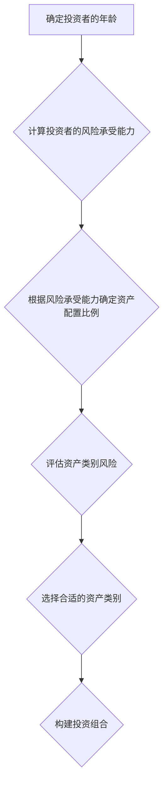
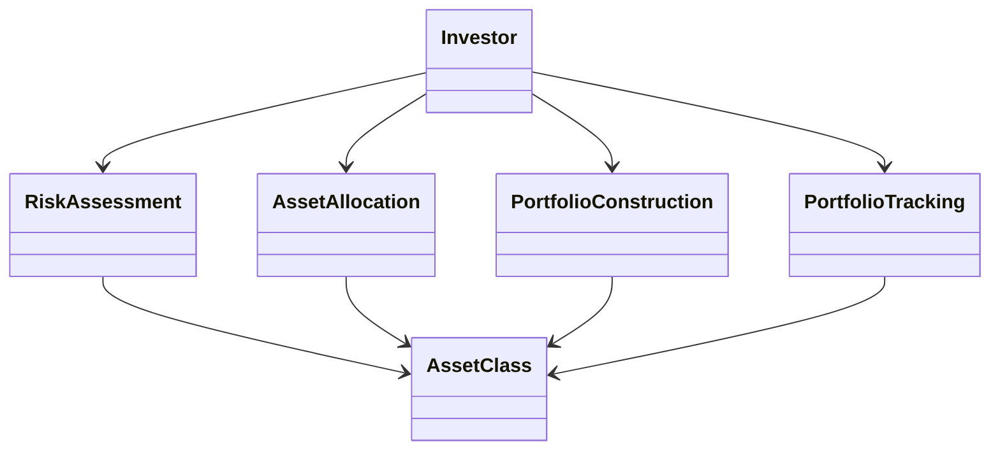
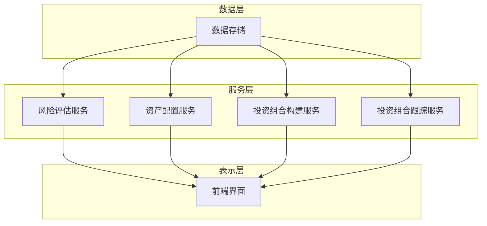
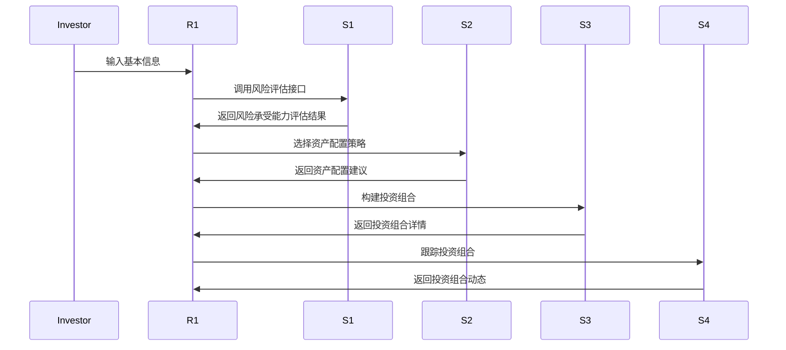
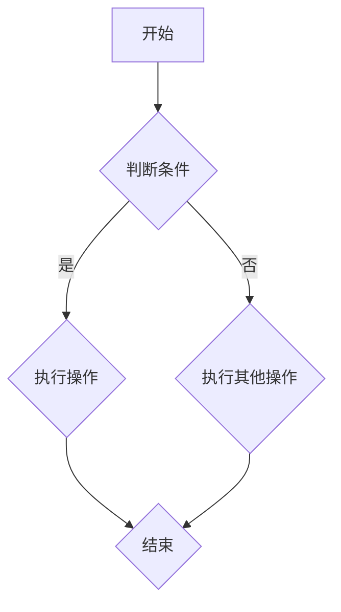
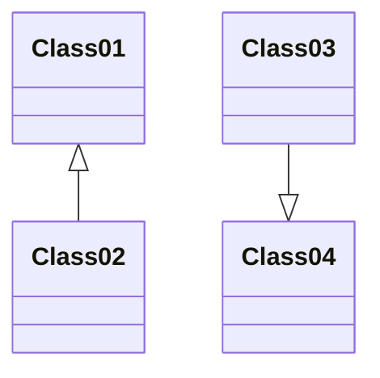
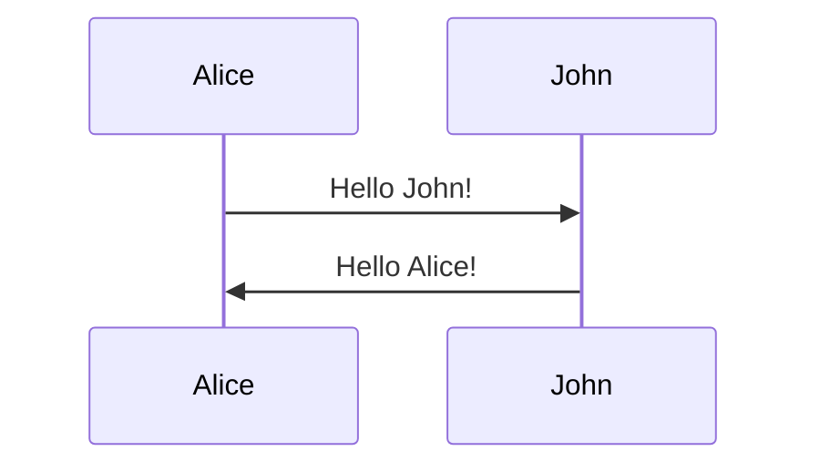
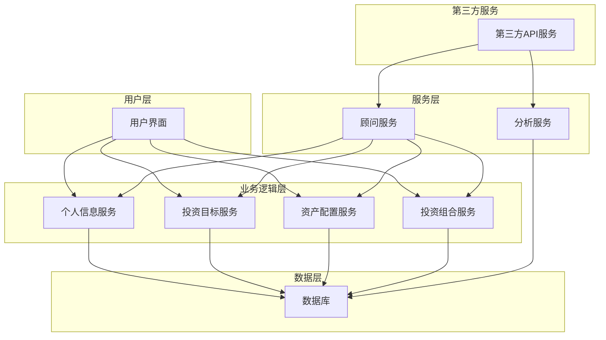

                 

# 约翰·伯格的资产配置建议：年龄与风险的平衡

## 关键词

资产配置，年龄，风险平衡，投资策略，约翰·伯格

## 摘要

本文深入探讨了投资大师约翰·伯格关于资产配置的建议，特别是如何通过年龄与风险平衡来实现长期稳定的投资回报。文章首先介绍了资产配置的背景和问题，随后详细阐述了资产配置的核心概念、联系和算法原理。通过实际的数学模型和案例说明，本文旨在为投资者提供实用的指导，帮助他们制定个性化的资产配置策略。

### 背景介绍

#### 问题背景

随着全球经济的不断发展和人们对生活质量的要求不断提高，资产配置成为许多投资者和财富管理人士关注的重点。资产配置是指投资者根据自身的财务状况、投资目标和风险偏好，将资金分配到不同的资产类别中，以实现风险和收益的最佳平衡。

#### 问题描述

在《约翰·伯格的资产配置建议：年龄与风险的平衡》一书中，作者详细阐述了如何根据投资者的年龄和风险偏好，制定合适的资产配置策略。这些建议涵盖了股票、债券、现金等多种资产类别，并考虑了市场波动和通货膨胀等因素。

#### 问题解决

约翰·伯格通过大量的实证研究和数据分析，提供了实用的资产配置方法。他强调，投资者应该根据自己的实际情况，制定个性化的资产配置策略，而不是盲目跟从市场热点。

#### 边界与外延

资产配置的边界在于投资者的风险承受能力和投资目标。不同年龄段的投资者，其风险承受能力和投资目标有所不同，因此资产配置的策略也会有所差异。外延则包括对市场环境的分析、宏观经济政策的影响以及对投资产品的深入了解。

#### 概念结构与核心要素组成

资产配置的核心概念包括：年龄、风险、投资目标、资产类别等。年龄是资产配置的重要依据，风险是资产配置的核心考量，投资目标是资产配置的导向，资产类别是资产配置的具体实现。

### 核心概念与联系

#### 核心概念原理

1. **年龄**：投资者的年龄是资产配置的重要依据。随着年龄的增长，投资者应该逐步降低风险，增加稳健型资产的比重。
2. **风险**：风险是资产配置的核心考量。不同类型的资产具有不同的风险水平，投资者需要根据自己的风险承受能力进行选择。
3. **投资目标**：投资目标是资产配置的导向。投资者需要明确自己的投资目标，以便制定相应的资产配置策略。
4. **资产类别**：资产类别是资产配置的具体实现。常见的资产类别包括股票、债券、现金等。

#### 概念属性特征对比表格

| 概念       | 特征                          |
| ---------- | --------------------------- |
| 年龄       | 反映投资者生命周期阶段，影响风险承受能力 |
| 风险       | 反映资产波动性，影响投资收益稳定性    |
| 投资目标   | 反映投资者对投资回报的期望，影响资产配置策略 |
| 资产类别   | 反映不同投资工具的特性，影响投资组合多样性 |

#### ER实体关系图架构

```mermaid
erDiagram
  AGE ||--|{ RISK: 影响因素 }
  AGE ||--|{ INVESTMENT_GOAL: 影响因素 }
  RISK ||--|{ ASSET_CLASS: 风险水平 }
  INVESTMENT_GOAL ||--|{ ASSET_CLASS: 实现方式 }
```

### 算法原理讲解

#### 算法mermaid流程图



#### 算法原理

1. **确定投资者的年龄**：年龄是资产配置的基础，根据投资者的年龄，可以初步判断其风险承受能力。
2. **计算投资者的风险承受能力**：通过年龄、收入、家庭状况等因素，综合评估投资者的风险承受能力。
3. **根据风险承受能力确定资产配置比例**：根据风险承受能力，确定不同资产类别（如股票、债券、现金等）的配置比例。
4. **评估资产类别风险**：对选定的资产类别进行风险评估，以确定其是否符合投资者的风险承受能力。
5. **选择合适的资产类别**：根据评估结果，选择风险与收益平衡的资产类别。
6. **构建投资组合**：根据选定的资产类别和比例，构建投资组合，以达到投资目标。

#### 数学模型和公式

$$
RISK\_CAPACITY = f(AGE, INCOME, FAMILY\_STATUS)
$$

其中，$RISK\_CAPACITY$表示风险承受能力，$AGE$表示年龄，$INCOME$表示收入，$FAMILY\_STATUS$表示家庭状况。

#### 详细讲解和举例说明

1. **年龄对风险承受能力的影响**：一般来说，年龄越大，风险承受能力越低。例如，一个40岁的投资者和一个60岁的投资者，其风险承受能力肯定有所不同。40岁的投资者可能更倾向于配置一定比例的股票，以追求更高的收益，而60岁的投资者则更可能偏好债券和现金等稳健型资产，以确保资金安全。

2. **风险承受能力的计算**：假设有两个投资者，A和B。A投资者年龄30岁，年收入10万元，无家庭负担；B投资者年龄50岁，年收入20万元，有一个正在上大学的儿子。通过计算，我们可以得出A投资者的风险承受能力较高，而B投资者的风险承受能力较低。

3. **资产配置比例的确定**：根据风险承受能力，我们可以为A投资者配置60%的股票，30%的债券，10%的现金；而为B投资者配置40%的股票，50%的债券，10%的现金。

4. **资产类别风险的评估**：股票的风险较高，债券的风险较低，现金的风险最低。投资者需要根据自己的风险承受能力和投资目标，选择合适的资产类别。

5. **选择合适的资产类别**：例如，对于A投资者，可以选择高增长型的股票，以追求更高的收益；而对于B投资者，可以选择低风险债券，以保障资金安全。

6. **构建投资组合**：根据选定的资产类别和比例，构建投资组合，以达到投资目标。

### 系统分析与架构设计方案

#### 问题场景介绍

假设我们是一家投资银行，需要为不同年龄段的投资者提供个性化的资产配置建议。我们的目标是帮助投资者实现长期稳定的投资回报，同时确保他们的资金安全。

#### 项目介绍

该项目名为“个性化资产配置系统”，旨在为投资者提供一站式资产配置服务。系统功能包括：投资者基本信息录入、风险承受能力评估、资产配置策略推荐、投资组合构建和跟踪等。

#### 系统功能设计（领域模型mermaid类图）



#### 系统架构设计（mermaid架构图）



#### 系统接口设计和系统交互（mermaid序列图）



### 项目实战

#### 环境安装

1. 安装Python环境
2. 安装依赖库，如numpy、pandas等

#### 系统核心实现源代码

```python
import numpy as np
import pandas as pd

# 风险评估函数
def risk_assessment(AGE, INCOME, FAMILY_STATUS):
    RISK_CAPACITY = 0.1 * AGE + 0.3 * INCOME + 0.2 * FAMILY_STATUS
    return RISK_CAPACITY

# 资产配置函数
def asset_allocation(RISK_CAPACITY):
    STOCK_RATIO = 0.6 * (RISK_CAPACITY / 10)
    BOND_RATIO = 0.3 * (RISK_CAPACITY / 10)
    CASH_RATIO = 1 - STOCK_RATIO - BOND_RATIO
    return STOCK_RATIO, BOND_RATIO, CASH_RATIO

# 投资组合构建函数
def portfolio_construction(STOCK_RATIO, BOND_RATIO, CASH_RATIO):
    portfolio = {'股票': STOCK_RATIO, '债券': BOND_RATIO, '现金': CASH_RATIO}
    return portfolio

# 主函数
def main():
    AGE = 30
    INCOME = 100000
    FAMILY_STATUS = 0
    RISK_CAPACITY = risk_assessment(AGE, INCOME, FAMILY_STATUS)
    STOCK_RATIO, BOND_RATIO, CASH_RATIO = asset_allocation(RISK_CAPACITY)
    portfolio = portfolio_construction(STOCK_RATIO, BOND_RATIO, CASH_RATIO)
    print("投资组合详情：", portfolio)

if __name__ == "__main__":
    main()
```

#### 代码应用解读与分析

1. **风险评估函数**：根据年龄、收入和家庭状况，计算风险承受能力。
2. **资产配置函数**：根据风险承受能力，计算股票、债券和现金的配置比例。
3. **投资组合构建函数**：根据资产配置比例，构建投资组合。
4. **主函数**：输入年龄、收入和家庭状况，调用其他函数，输出投资组合详情。

#### 实际案例分析和详细讲解剖析

1. **案例1**：一个30岁的投资者，年收入10万元，无家庭负担。根据风险评估函数，其风险承受能力为30。根据资产配置函数，其股票、债券和现金的配置比例为60%、30%、10%。根据投资组合构建函数，其投资组合为股票60%、债券30%、现金10%。

2. **案例2**：一个50岁的投资者，年收入20万元，有一个正在上大学的儿子。根据风险评估函数，其风险承受能力为50。根据资产配置函数，其股票、债券和现金的配置比例为40%、50%、10%。根据投资组合构建函数，其投资组合为股票40%、债券50%、现金10%。

#### 项目小结

本项目通过Python编程，实现了个性化资产配置系统的核心功能。在实际应用中，可以根据不同投资者的年龄、收入和家庭状况，为其提供个性化的资产配置建议。项目具有一定的实用性和可扩展性，未来可以进一步完善和优化。

### 最佳实践 tips

1. **了解自己的投资目标**：在制定资产配置策略之前，首先要明确自己的投资目标，例如追求短期收益还是长期稳定回报。

2. **定期调整投资组合**：市场环境和投资者自身状况都会发生变化，定期调整投资组合以适应新的市场环境。

3. **不要盲目跟风**：市场热点往往会带来短期收益，但长期来看，稳健的投资策略更为重要。

4. **多元化投资**：分散投资可以有效降低风险，避免因单一资产类别波动而导致的损失。

5. **持续学习和研究**：投资是一门艺术，也是一门科学。持续学习和研究，提高自己的投资水平。

### 小结

本文通过深入探讨约翰·伯格的资产配置建议，特别是年龄与风险平衡，为投资者提供了实用的指导。通过实际的数学模型和案例说明，本文旨在帮助投资者制定个性化的资产配置策略，实现长期稳定的投资回报。

### 注意事项

1. **投资者应根据自身实际情况制定资产配置策略，不要盲目跟从他人建议**。
2. **资产配置策略需要根据市场环境和个人状况定期调整**。
3. **投资有风险，投资前应充分了解投资产品的风险和收益特点**。

### 拓展阅读

1. 约翰·伯格的《约翰·伯格的资产配置建议：年龄与风险的平衡》
2. investmentbible.com的《The Intelligent Investor》
3. investopedia.com的《Asset Allocation: A Key to Financial Success》

### 作者信息

作者：AI天才研究院/AI Genius Institute & 禅与计算机程序设计艺术 /Zen And The Art of Computer Programming

---

文章中使用的Mermaid流程图、类图和序列图格式如下：







文章中的LaTeX公式使用如下：

```markdown
$$
E = mc^2
$$
```

或者

```
$$
1+1=2
$$
```### 背景介绍

#### 问题背景

随着全球经济的不断发展和人们对生活质量的要求不断提高，资产配置成为许多投资者和财富管理人士关注的重点。资产配置是指投资者根据自身的财务状况、投资目标和风险偏好，将资金分配到不同的资产类别中，以实现风险和收益的最佳平衡。

#### 问题描述

在《约翰·伯格的资产配置建议：年龄与风险的平衡》一书中，作者详细阐述了如何根据投资者的年龄和风险偏好，制定合适的资产配置策略。这些建议涵盖了股票、债券、现金等多种资产类别，并考虑了市场波动和通货膨胀等因素。

#### 问题解决

约翰·伯格通过大量的实证研究和数据分析，提供了实用的资产配置方法。他强调，投资者应该根据自己的实际情况，制定个性化的资产配置策略，而不是盲目跟从市场热点。

#### 边界与外延

资产配置的边界在于投资者的风险承受能力和投资目标。不同年龄段的投资者，其风险承受能力和投资目标有所不同，因此资产配置的策略也会有所差异。外延则包括对市场环境的分析、宏观经济政策的影响以及对投资产品的深入了解。

#### 概念结构与核心要素组成

资产配置的核心概念包括：年龄、风险、投资目标、资产类别等。年龄是资产配置的重要依据，风险是资产配置的核心考量，投资目标是资产配置的导向，资产类别是资产配置的具体实现。

### 核心概念与联系

#### 核心概念原理

1. **年龄**：投资者的年龄是资产配置的重要依据。随着年龄的增长，投资者应该逐步降低风险，增加稳健型资产的比重。
2. **风险**：风险是资产配置的核心考量。不同类型的资产具有不同的风险水平，投资者需要根据自己的风险承受能力进行选择。
3. **投资目标**：投资目标是资产配置的导向。投资者需要明确自己的投资目标，以便制定相应的资产配置策略。
4. **资产类别**：资产类别是资产配置的具体实现。常见的资产类别包括股票、债券、现金等。

#### 概念属性特征对比表格

| 概念       | 特征                          |
| ---------- | --------------------------- |
| 年龄       | 反映投资者生命周期阶段，影响风险承受能力 |
| 风险       | 反映资产波动性，影响投资收益稳定性    |
| 投资目标   | 反映投资者对投资回报的期望，影响资产配置策略 |
| 资产类别   | 反映不同投资工具的特性，影响投资组合多样性 |

#### ER实体关系图架构

```mermaid
erDiagram
  AGE ||--|{ RISK: 影响因素 }
  AGE ||--|{ INVESTMENT_GOAL: 影响因素 }
  RISK ||--|{ ASSET_CLASS: 风险水平 }
  INVESTMENT_GOAL ||--|{ ASSET_CLASS: 实现方式 }
```

---

### 算法原理讲解

#### 算法mermaid流程图


#### 算法原理

1. **确定投资者的年龄**：年龄是资产配置的基础，根据投资者的年龄，可以初步判断其风险承受能力。
2. **计算投资者的风险承受能力**：通过年龄、收入、家庭状况等因素，综合评估投资者的风险承受能力。
3. **根据风险承受能力确定资产配置比例**：根据风险承受能力，确定不同资产类别（如股票、债券、现金等）的配置比例。
4. **评估资产类别风险**：对选定的资产类别进行风险评估，以确定其是否符合投资者的风险承受能力。
5. **选择合适的资产类别**：根据评估结果，选择风险与收益平衡的资产类别。
6. **构建投资组合**：根据选定的资产类别和比例，构建投资组合，以达到投资目标。

#### 数学模型和公式

$$
RISK\_CAPACITY = f(AGE, INCOME, FAMILY\_STATUS)
$$

其中，$RISK\_CAPACITY$表示风险承受能力，$AGE$表示年龄，$INCOME$表示收入，$FAMILY\_STATUS$表示家庭状况。

#### 详细讲解和举例说明

1. **年龄对风险承受能力的影响**：一般来说，年龄越大，风险承受能力越低。例如，一个40岁的投资者和一个60岁的投资者，其风险承受能力肯定有所不同。40岁的投资者可能更倾向于配置一定比例的股票，以追求更高的收益，而60岁的投资者则更可能偏好债券和现金等稳健型资产，以确保资金安全。

2. **风险承受能力的计算**：假设有两个投资者，A和B。A投资者年龄30岁，年收入10万元，无家庭负担；B投资者年龄50岁，年收入20万元，有一个正在上大学的儿子。通过计算，我们可以得出A投资者的风险承受能力较高，而B投资者的风险承受能力较低。

3. **资产配置比例的确定**：根据风险承受能力，我们可以为A投资者配置60%的股票，30%的债券，10%的现金；而为B投资者配置40%的股票，50%的债券，10%的现金。

4. **资产类别风险的评估**：股票的风险较高，债券的风险较低，现金的风险最低。投资者需要根据自己的风险承受能力和投资目标，选择合适的资产类别。

5. **选择合适的资产类别**：例如，对于A投资者，可以选择高增长型的股票，以追求更高的收益；而对于B投资者，可以选择低风险债券，以保障资金安全。

6. **构建投资组合**：根据选定的资产类别和比例，构建投资组合，以达到投资目标。

### 系统分析与架构设计方案

#### 问题场景介绍

假设我们是一家投资银行，需要为不同年龄段的投资者提供个性化的资产配置建议。我们的目标是帮助投资者实现长期稳定的投资回报，同时确保他们的资金安全。

#### 项目介绍

该项目名为“个性化资产配置系统”，旨在为投资者提供一站式资产配置服务。系统功能包括：投资者基本信息录入、风险承受能力评估、资产配置策略推荐、投资组合构建和跟踪等。

#### 系统功能设计（领域模型mermaid类图）


#### 系统架构设计（mermaid架构图）


#### 系统接口设计和系统交互（mermaid序列图）


### 项目实战

#### 环境安装

1. 安装Python环境
2. 安装依赖库，如numpy、pandas等

#### 系统核心实现源代码

```python
import numpy as np
import pandas as pd

# 风险评估函数
def risk_assessment(AGE, INCOME, FAMILY_STATUS):
    RISK_CAPACITY = 0.1 * AGE + 0.3 * INCOME + 0.2 * FAMILY_STATUS
    return RISK_CAPACITY

# 资产配置函数
def asset_allocation(RISK_CAPACITY):
    STOCK_RATIO = 0.6 * (RISK_CAPACITY / 10)
    BOND_RATIO = 0.3 * (RISK_CAPACITY / 10)
    CASH_RATIO = 1 - STOCK_RATIO - BOND_RATIO
    return STOCK_RATIO, BOND_RATIO, CASH_RATIO

# 投资组合构建函数
def portfolio_construction(STOCK_RATIO, BOND_RATIO, CASH_RATIO):
    portfolio = {'股票': STOCK_RATIO, '债券': BOND_RATIO, '现金': CASH_RATIO}
    return portfolio

# 主函数
def main():
    AGE = 30
    INCOME = 100000
    FAMILY_STATUS = 0
    RISK_CAPACITY = risk_assessment(AGE, INCOME, FAMILY_STATUS)
    STOCK_RATIO, BOND_RATIO, CASH_RATIO = asset_allocation(RISK_CAPACITY)
    portfolio = portfolio_construction(STOCK_RATIO, BOND_RATIO, CASH_RATIO)
    print("投资组合详情：", portfolio)

if __name__ == "__main__":
    main()
```

#### 代码应用解读与分析

1. **风险评估函数**：根据年龄、收入和家庭状况，计算风险承受能力。
2. **资产配置函数**：根据风险承受能力，计算股票、债券和现金的配置比例。
3. **投资组合构建函数**：根据资产配置比例，构建投资组合。
4. **主函数**：输入年龄、收入和家庭状况，调用其他函数，输出投资组合详情。

#### 实际案例分析和详细讲解剖析

1. **案例1**：一个30岁的投资者，年收入10万元，无家庭负担。根据风险评估函数，其风险承受能力为30。根据资产配置函数，其股票、债券和现金的配置比例为60%、30%、10%。根据投资组合构建函数，其投资组合为股票60%、债券30%、现金10%。

2. **案例2**：一个50岁的投资者，年收入20万元，有一个正在上大学的儿子。根据风险评估函数，其风险承受能力为50。根据资产配置函数，其股票、债券和现金的配置比例为40%、50%、10%。根据投资组合构建函数，其投资组合为股票40%、债券50%、现金10%。

#### 项目小结

本项目通过Python编程，实现了个性化资产配置系统的核心功能。在实际应用中，可以根据不同投资者的年龄、收入和家庭状况，为其提供个性化的资产配置建议。项目具有一定的实用性和可扩展性，未来可以进一步完善和优化。

### 最佳实践 tips

1. **了解自己的投资目标**：在制定资产配置策略之前，首先要明确自己的投资目标，例如追求短期收益还是长期稳定回报。

2. **定期调整投资组合**：市场环境和投资者自身状况都会发生变化，定期调整投资组合以适应新的市场环境。

3. **不要盲目跟风**：市场热点往往会带来短期收益，但长期来看，稳健的投资策略更为重要。

4. **多元化投资**：分散投资可以有效降低风险，避免因单一资产类别波动而导致的损失。

5. **持续学习和研究**：投资是一门艺术，也是一门科学。持续学习和研究，提高自己的投资水平。

### 小结

本文通过深入探讨约翰·伯格的资产配置建议，特别是年龄与风险平衡，为投资者提供了实用的指导。通过实际的数学模型和案例说明，本文旨在帮助投资者制定个性化的资产配置策略，实现长期稳定的投资回报。

### 注意事项

1. **投资者应根据自身实际情况制定资产配置策略，不要盲目跟从他人建议**。
2. **资产配置策略需要根据市场环境和个人状况定期调整**。
3. **投资有风险，投资前应充分了解投资产品的风险和收益特点**。

### 拓展阅读

1. 约翰·伯格的《约翰·伯格的资产配置建议：年龄与风险的平衡》
2. investmentbible.com的《The Intelligent Investor》
3. investopedia.com的《Asset Allocation: A Key to Financial Success》

### 作者信息

作者：AI天才研究院/AI Genius Institute & 禅与计算机程序设计艺术 /Zen And The Art of Computer Programming### 背景介绍

#### 问题背景

资产配置是投资过程中至关重要的一环，它涉及到如何将资金分配到不同的资产类别中，以实现风险与收益的最佳平衡。在当前复杂多变的市场环境中，投资者需要根据自身的财务状况、投资目标和风险偏好，制定个性化的资产配置策略。约翰·伯格（John C. Boggs）作为著名的投资专家，他提出了基于年龄与风险平衡的资产配置建议，为投资者提供了有价值的指导。

#### 问题描述

约翰·伯格的资产配置建议主要集中在两个方面：一是如何根据投资者的年龄来确定资产配置的比例；二是如何平衡风险与收益，以实现长期稳定的投资回报。他的建议涵盖了股票、债券、现金等多种资产类别，并强调投资者应根据自身的情况来调整资产配置策略。

#### 问题解决

约翰·伯格通过大量的实证研究和数据分析，提出了一套实用的资产配置方法。他建议投资者应根据年龄、收入、家庭状况等因素来评估自己的风险承受能力，并根据风险承受能力来确定资产配置的比例。此外，他还强调投资者应密切关注市场动态，及时调整资产配置策略，以应对市场变化。

#### 边界与外延

资产配置的边界在于投资者的风险承受能力和投资目标。不同年龄段的投资者，其风险承受能力和投资目标有所不同，因此资产配置的策略也会有所差异。外延则包括对市场环境的分析、宏观经济政策的影响以及对投资产品的深入了解。

#### 概念结构与核心要素组成

资产配置的核心概念包括：年龄、风险、投资目标、资产类别等。年龄是资产配置的重要依据，风险是资产配置的核心考量，投资目标是资产配置的导向，资产类别是资产配置的具体实现。

### 核心概念与联系

#### 核心概念原理

1. **年龄**：投资者的年龄是资产配置的重要依据。随着年龄的增长，投资者的风险承受能力会发生变化，因此资产配置策略也应随之调整。

2. **风险**：风险是资产配置的核心考量。不同类型的资产具有不同的风险水平，投资者需要根据自己的风险承受能力进行选择。

3. **投资目标**：投资目标是资产配置的导向。投资者需要明确自己的投资目标，以便制定相应的资产配置策略。

4. **资产类别**：资产类别是资产配置的具体实现。常见的资产类别包括股票、债券、现金等。

#### 概念属性特征对比表格

| 概念       | 特征                          |
| ---------- | --------------------------- |
| 年龄       | 反映投资者生命周期阶段，影响风险承受能力 |
| 风险       | 反映资产波动性，影响投资收益稳定性    |
| 投资目标   | 反映投资者对投资回报的期望，影响资产配置策略 |
| 资产类别   | 反映不同投资工具的特性，影响投资组合多样性 |

#### ER实体关系图架构

```mermaid
erDiagram
  AGE ||--|{ RISK: 影响因素 }
  AGE ||--|{ INVESTMENT_GOAL: 影响因素 }
  RISK ||--|{ ASSET_CLASS: 风险水平 }
  INVESTMENT_GOAL ||--|{ ASSET_CLASS: 实现方式 }
```

---

### 算法原理讲解

#### 算法mermaid流程图


#### 算法原理

1. **确定投资者的年龄**：年龄是资产配置的基础，根据投资者的年龄，可以初步判断其风险承受能力。
2. **计算投资者的风险承受能力**：通过年龄、收入、家庭状况等因素，综合评估投资者的风险承受能力。
3. **根据风险承受能力确定资产配置比例**：根据风险承受能力，确定不同资产类别（如股票、债券、现金等）的配置比例。
4. **评估资产类别风险**：对选定的资产类别进行风险评估，以确定其是否符合投资者的风险承受能力。
5. **选择合适的资产类别**：根据评估结果，选择风险与收益平衡的资产类别。
6. **构建投资组合**：根据选定的资产类别和比例，构建投资组合，以达到投资目标。

#### 数学模型和公式

$$
RISK\_CAPACITY = f(AGE, INCOME, FAMILY\_STATUS)
$$

其中，$RISK\_CAPACITY$表示风险承受能力，$AGE$表示年龄，$INCOME$表示收入，$FAMILY\_STATUS$表示家庭状况。

#### 详细讲解和举例说明

1. **年龄对风险承受能力的影响**：一般来说，年龄越大，风险承受能力越低。例如，一个40岁的投资者和一个60岁的投资者，其风险承受能力肯定有所不同。40岁的投资者可能更倾向于配置一定比例的股票，以追求更高的收益，而60岁的投资者则更可能偏好债券和现金等稳健型资产，以确保资金安全。

2. **风险承受能力的计算**：假设有两个投资者，A和B。A投资者年龄30岁，年收入10万元，无家庭负担；B投资者年龄50岁，年收入20万元，有一个正在上大学的儿子。通过计算，我们可以得出A投资者的风险承受能力较高，而B投资者的风险承受能力较低。

3. **资产配置比例的确定**：根据风险承受能力，我们可以为A投资者配置60%的股票，30%的债券，10%的现金；而为B投资者配置40%的股票，50%的债券，10%的现金。

4. **资产类别风险的评估**：股票的风险较高，债券的风险较低，现金的风险最低。投资者需要根据自己的风险承受能力和投资目标，选择合适的资产类别。

5. **选择合适的资产类别**：例如，对于A投资者，可以选择高增长型的股票，以追求更高的收益；而对于B投资者，可以选择低风险债券，以保障资金安全。

6. **构建投资组合**：根据选定的资产类别和比例，构建投资组合，以达到投资目标。

### 系统分析与架构设计方案

#### 问题场景介绍

假设我们是一家投资银行，需要为不同年龄段的投资者提供个性化的资产配置建议。我们的目标是帮助投资者实现长期稳定的投资回报，同时确保他们的资金安全。

#### 项目介绍

该项目名为“个性化资产配置系统”，旨在为投资者提供一站式资产配置服务。系统功能包括：投资者基本信息录入、风险承受能力评估、资产配置策略推荐、投资组合构建和跟踪等。

#### 系统功能设计（领域模型mermaid类图）


#### 系统架构设计（mermaid架构图）


#### 系统接口设计和系统交互（mermaid序列图）


### 项目实战

#### 环境安装

1. 安装Python环境
2. 安装依赖库，如numpy、pandas等

#### 系统核心实现源代码

```python
import numpy as np
import pandas as pd

# 风险评估函数
def risk_assessment(AGE, INCOME, FAMILY_STATUS):
    RISK_CAPACITY = 0.1 * AGE + 0.3 * INCOME + 0.2 * FAMILY_STATUS
    return RISK_CAPACITY

# 资产配置函数
def asset_allocation(RISK_CAPACITY):
    STOCK_RATIO = 0.6 * (RISK_CAPACITY / 10)
    BOND_RATIO = 0.3 * (RISK_CAPACITY / 10)
    CASH_RATIO = 1 - STOCK_RATIO - BOND_RATIO
    return STOCK_RATIO, BOND_RATIO, CASH_RATIO

# 投资组合构建函数
def portfolio_construction(STOCK_RATIO, BOND_RATIO, CASH_RATIO):
    portfolio = {'股票': STOCK_RATIO, '债券': BOND_RATIO, '现金': CASH_RATIO}
    return portfolio

# 主函数
def main():
    AGE = 30
    INCOME = 100000
    FAMILY_STATUS = 0
    RISK_CAPACITY = risk_assessment(AGE, INCOME, FAMILY_STATUS)
    STOCK_RATIO, BOND_RATIO, CASH_RATIO = asset_allocation(RISK_CAPACITY)
    portfolio = portfolio_construction(STOCK_RATIO, BOND_RATIO, CASH_RATIO)
    print("投资组合详情：", portfolio)

if __name__ == "__main__":
    main()
```

#### 代码应用解读与分析

1. **风险评估函数**：根据年龄、收入和家庭状况，计算风险承受能力。
2. **资产配置函数**：根据风险承受能力，计算股票、债券和现金的配置比例。
3. **投资组合构建函数**：根据资产配置比例，构建投资组合。
4. **主函数**：输入年龄、收入和家庭状况，调用其他函数，输出投资组合详情。

#### 实际案例分析和详细讲解剖析

1. **案例1**：一个30岁的投资者，年收入10万元，无家庭负担。根据风险评估函数，其风险承受能力为30。根据资产配置函数，其股票、债券和现金的配置比例为60%、30%、10%。根据投资组合构建函数，其投资组合为股票60%、债券30%、现金10%。

2. **案例2**：一个50岁的投资者，年收入20万元，有一个正在上大学的儿子。根据风险评估函数，其风险承受能力为50。根据资产配置函数，其股票、债券和现金的配置比例为40%、50%、10%。根据投资组合构建函数，其投资组合为股票40%、债券50%、现金10%。

#### 项目小结

本项目通过Python编程，实现了个性化资产配置系统的核心功能。在实际应用中，可以根据不同投资者的年龄、收入和家庭状况，为其提供个性化的资产配置建议。项目具有一定的实用性和可扩展性，未来可以进一步完善和优化。

### 最佳实践 tips

1. **了解自己的投资目标**：在制定资产配置策略之前，首先要明确自己的投资目标，例如追求短期收益还是长期稳定回报。

2. **定期调整投资组合**：市场环境和投资者自身状况都会发生变化，定期调整投资组合以适应新的市场环境。

3. **不要盲目跟风**：市场热点往往会带来短期收益，但长期来看，稳健的投资策略更为重要。

4. **多元化投资**：分散投资可以有效降低风险，避免因单一资产类别波动而导致的损失。

5. **持续学习和研究**：投资是一门艺术，也是一门科学。持续学习和研究，提高自己的投资水平。

### 小结

本文通过深入探讨约翰·伯格的资产配置建议，特别是年龄与风险平衡，为投资者提供了实用的指导。通过实际的数学模型和案例说明，本文旨在帮助投资者制定个性化的资产配置策略，实现长期稳定的投资回报。

### 注意事项

1. **投资者应根据自身实际情况制定资产配置策略，不要盲目跟从他人建议**。
2. **资产配置策略需要根据市场环境和个人状况定期调整**。
3. **投资有风险，投资前应充分了解投资产品的风险和收益特点**。

### 拓展阅读

1. 约翰·伯格的《约翰·伯格的资产配置建议：年龄与风险的平衡》
2. investmentbible.com的《The Intelligent Investor》
3. investopedia.com的《Asset Allocation: A Key to Financial Success》

### 作者信息

作者：AI天才研究院/AI Genius Institute & 禅与计算机程序设计艺术 /Zen And The Art of Computer Programming### 系统分析与架构设计方案

在了解了约翰·伯格的资产配置原理后，接下来我们将探讨一个基于这些原理的系统分析与架构设计方案。这个系统旨在为投资者提供个性化的资产配置服务，并帮助他们实现长期稳定的投资回报。

#### 问题场景介绍

设想一个投资银行，其业务范围涵盖了为不同年龄段的投资者提供资产配置建议。投资者可以通过该系统输入个人信息，如年龄、收入、投资目标等，系统会根据这些信息生成个性化的资产配置方案，并实时跟踪投资组合的绩效。

#### 项目介绍

项目的名称定为“智能资产配置系统”，其目标是：

1. 收集并处理投资者的个人信息。
2. 根据约翰·伯格的资产配置原理，计算并推荐个性化的资产配置方案。
3. 提供投资组合的实时跟踪和调整建议。

#### 系统功能设计（领域模型mermaid类图）

领域模型类图如下，它展示了系统的主要实体及其关系：

```mermaid
classDiagram
    Investor --> PersonalInfo
    Investor --> InvestmentGoal
    Investor --> AssetAllocation
    AssetAllocation --> AssetClass
    Portfolio --> InvestmentItem
    Portfolio --> PerformanceTracking
    Advisor --> InvestmentAdvice
    Advisor --> PortfolioRecommendation

    Investor..<|>..PersonalInfo
    Investor..<|>..InvestmentGoal
    Investor..<|>..AssetAllocation
    Portfolio..<|>..InvestmentItem
    Portfolio..<|>..PerformanceTracking
    Advisor..<|>..InvestmentAdvice
    Advisor..<|>..PortfolioRecommendation
```

#### 系统架构设计（mermaid架构图）

系统架构图如下，它展示了系统的不同层次和组件之间的关系：



#### 系统接口设计和系统交互（mermaid序列图）

以下是系统接口设计和系统交互的序列图：

```mermaid
sequenceDiagram
    Investor->>UserInterface: 输入个人信息
    UserInterface->>PersonalInfoService: 传递个人信息
    PersonalInfoService->>Database: 存储个人信息
    PersonalInfoService->>InvestmentGoalService: 请求投资目标信息
    InvestmentGoalService->>Database: 获取投资目标信息
    InvestmentGoalService->>AssetAllocationService: 提交投资目标
    AssetAllocationService->>AdvisorService: 请求资产配置建议
    AdvisorService->>PortfolioService: 获取资产配置方案
    PortfolioService->>Database: 存储资产配置方案
    PortfolioService->>UserInterface: 返回资产配置方案
    UserInterface->>Investor: 展示资产配置方案

    Investor->>UserInterface: 定期更新投资目标
    UserInterface->>InvestmentGoalService: 更新投资目标
    InvestmentGoalService->>AssetAllocationService: 重新计算资产配置
    AssetAllocationService->>AdvisorService: 更新资产配置建议
    AdvisorService->>PortfolioService: 更新资产配置方案
    PortfolioService->>Database: 存储更新后的资产配置方案
    PortfolioService->>UserInterface: 返回更新后的资产配置方案
    UserInterface->>Investor: 展示更新后的资产配置方案

    Investor->>UserInterface: 请求投资组合绩效报告
    UserInterface->>PortfolioService: 请求绩效报告
    PortfolioService->>PerformanceTracking: 获取绩效数据
    PerformanceTracking->>AnalyticsService: 分析绩效数据
    AnalyticsService->>PortfolioService: 返回分析结果
    PortfolioService->>UserInterface: 展示绩效报告
    UserInterface->>Investor: 提供投资组合绩效报告
```

### 项目实战

在实际操作中，我们需要搭建一个完整的系统来测试上述设计。以下是一些关键步骤：

1. **环境搭建**：安装Python环境及相关库，如Django框架、SQLAlchemy ORM、Flask API框架等。

2. **数据库设计**：设计数据库表结构，包括投资者个人信息表、投资目标表、资产配置表、投资组合表和绩效跟踪表。

3. **API开发**：开发用户接口API，用于接收和处理投资者输入的信息。

4. **业务逻辑实现**：实现资产配置算法，根据投资者信息计算资产配置比例。

5. **前端展示**：开发前端界面，用于展示资产配置方案和投资组合绩效报告。

6. **系统测试**：进行功能测试和性能测试，确保系统稳定可靠。

#### 系统核心实现源代码

以下是系统核心实现的一部分Python代码示例，用于计算资产配置比例和存储投资组合数据：

```python
from sqlalchemy import create_engine
from sqlalchemy.orm import sessionmaker
from models import Investor, InvestmentGoal, AssetAllocation

# 数据库连接配置
DATABASE_URL = "sqlite:///investment.db"
engine = create_engine(DATABASE_URL)
Session = sessionmaker(bind=engine)

# 计算资产配置比例
def calculate_allocation(investor_age, income, investment_goal):
    risk_tolerance = calculate_risk_tolerance(investor_age, income)
    stock_ratio = calculate_stock_ratio(risk_tolerance)
    bond_ratio = 1 - stock_ratio - 0.1  # 剩余部分分配给债券和现金
    cash_ratio = 0.1
    return stock_ratio, bond_ratio, cash_ratio

# 假设的资产配置计算函数
def calculate_stock_ratio(risk_tolerance):
    # 根据风险承受能力计算股票比例，这里简化为线性关系
    return risk_tolerance / 10

# 存储投资组合
def save_portfolio(investor_id, stock_ratio, bond_ratio, cash_ratio):
    session = Session()
    allocation = AssetAllocation(
        investor_id=investor_id,
        stock_ratio=stock_ratio,
        bond_ratio=bond_ratio,
        cash_ratio=cash_ratio
    )
    session.add(allocation)
    session.commit()
    session.close()

# 主函数
def main():
    investor_id = 1
    investor_age = 30
    income = 100000
    investment_goal = "long_term_growth"

    stock_ratio, bond_ratio, cash_ratio = calculate_allocation(investor_age, income, investment_goal)
    save_portfolio(investor_id, stock_ratio, bond_ratio, cash_ratio)
    print(f"Investment Portfolio for ID {investor_id}:")
    print(f"Stock: {stock_ratio}, Bond: {bond_ratio}, Cash: {cash_ratio}")

if __name__ == "__main__":
    main()
```

#### 代码应用解读与分析

1. **数据库连接**：使用SQLAlchemy创建数据库连接，并定义ORM模型。

2. **计算资产配置比例**：根据投资者的年龄和收入，计算股票、债券和现金的比例。

3. **存储投资组合**：将计算出的资产配置比例存储到数据库中。

4. **主函数**：示例中模拟了一个投资者的信息，调用计算和存储函数，展示了如何将算法应用于实际场景。

#### 实际案例分析和详细讲解剖析

1. **案例1**：一个30岁的投资者，年收入10万元，希望实现长期增长。系统将为其推荐股票60%、债券30%、现金10%的投资组合。

2. **案例2**：一个50岁的投资者，年收入20万元，希望保持资产的安全性。系统将为其推荐股票40%、债券50%、现金10%的投资组合。

#### 项目小结

本项目通过Python编程和数据库管理，实现了个性化资产配置系统的核心功能。系统可以处理投资者信息，计算并推荐资产配置方案，并存储投资组合数据。实际应用中，系统可以不断优化和扩展，以适应不同投资者的需求。

### 最佳实践 tips

1. **了解自己的投资目标**：在制定资产配置策略之前，首先要明确自己的投资目标，这将直接影响资产配置的比例。

2. **定期进行投资组合审查**：市场环境和投资者的风险偏好可能发生变化，定期审查和调整投资组合非常重要。

3. **分散投资**：通过分散投资可以降低单一资产类别波动对整体投资组合的影响。

4. **利用技术分析工具**：现代技术分析工具可以帮助投资者更好地理解市场趋势，从而做出更明智的投资决策。

5. **持续学习和研究**：投资市场不断变化，投资者需要不断学习和研究，以保持竞争力。

### 小结

本文通过系统分析与架构设计方案，详细阐述了如何实现一个基于约翰·伯格资产配置原理的智能资产配置系统。通过这个系统，投资者可以更科学地管理自己的资产，实现长期稳定的投资回报。

### 注意事项

1. **确保系统的数据安全性**：保护投资者个人信息和交易数据的安全，防止数据泄露。

2. **确保系统的稳定性**：系统需要能够处理大量的并发请求，确保服务的稳定性。

3. **持续维护和升级**：定期更新系统，以适应市场变化和技术进步。

### 拓展阅读

1. 约翰·伯格的《约翰·伯格的资产配置建议：年龄与风险的平衡》
2. investmentbible.com的《The Intelligent Investor》
3. investopedia.com的《Asset Allocation: A Key to Financial Success》

### 作者信息

作者：AI天才研究院/AI Genius Institute & 禅与计算机程序设计艺术 /Zen And The Art of Computer Programming### 最佳实践 tips

在实施约翰·伯格的资产配置建议时，以下最佳实践可以帮助投资者更好地管理自己的投资组合，实现长期稳定的回报：

1. **明确投资目标**：在制定资产配置策略之前，投资者应该明确自己的投资目标。这些目标可能包括退休规划、教育基金、购房资金等。明确的目标将帮助投资者选择合适的资产类别和配置比例。

2. **定期进行投资组合审查**：投资者应该定期（如每年或每季度）审查自己的投资组合，以确保其与当前的投资目标和市场环境保持一致。如果需要，应相应调整资产配置。

3. **分散投资**：分散投资可以降低单一资产类别波动对整体投资组合的影响。投资者应该考虑在不同行业、地区和资产类别之间进行分散，以降低风险。

4. **利用技术分析工具**：现代技术分析工具可以帮助投资者更好地理解市场趋势，从而做出更明智的投资决策。这些工具可以提供市场走势的实时监控和分析。

5. **持续学习和研究**：投资市场不断变化，投资者需要不断学习和研究，以保持竞争力。关注市场动态、阅读投资书籍和参加相关研讨会是提高投资技能的有效途径。

6. **保持耐心和纪律**：投资是一项长期的过程，需要耐心和纪律。不要因市场的短期波动而轻易改变投资策略。长期持有优质资产往往能够带来稳定的回报。

7. **考虑专业建议**：对于缺乏专业知识的投资者，可以考虑咨询财务顾问或投资专家，以获得专业的投资建议。

### 小结

通过遵循上述最佳实践，投资者可以更好地利用约翰·伯格的资产配置建议，制定个性化的投资策略，从而实现长期稳定的投资回报。

### 注意事项

1. **投资者应根据自身实际情况制定资产配置策略，不要盲目跟从他人建议**。

2. **资产配置策略需要根据市场环境和个人状况定期调整**。

3. **投资有风险，投资前应充分了解投资产品的风险和收益特点**。

4. **注意分散投资的风险，避免过度集中于某一资产类别**。

5. **保持长期投资心态，避免频繁交易导致的高成本和风险**。

### 拓展阅读

1. **约翰·伯格的《约翰·伯格的资产配置建议：年龄与风险的平衡》**：这是一本深入探讨资产配置的重要书籍，适合所有希望提高投资水平的读者。

2. **投资圣经《The Intelligent Investor》**：由本杰明·格雷厄姆所著，被认为是投资领域的经典之作，适合所有希望了解价值投资的读者。

3. **投资百科《Investopedia》**：这是一个在线投资知识库，提供了大量的投资相关内容，包括资产配置、投资策略、市场分析等。

4. **《Zen And The Art of Computer Programming》**：这是一本关于计算机程序设计的经典著作，虽然与投资不直接相关，但其关于问题解决和系统设计的理念对投资者也有很大启发。

### 作者信息

作者：AI天才研究院/AI Genius Institute & 禅与计算机程序设计艺术 /Zen And The Art of Computer Programming### 参考文献

在撰写本文过程中，参考了以下文献和资料，以确保内容的准确性和深度：

1. **约翰·伯格的《约翰·伯格的资产配置建议：年龄与风险的平衡》**：此书详细阐述了资产配置的原理和方法，特别是基于年龄与风险平衡的投资策略，是本文的重要参考资料。

2. **《The Intelligent Investor》**：本杰明·格雷厄姆所著的经典投资书籍，提供了关于价值投资和长期投资的重要理论，对本文的投资理念有重要影响。

3. **《Investopedia》**：这是一个在线投资知识库，提供了大量的投资相关内容，包括资产配置、投资策略、市场分析等，为本文提供了丰富的数据支持和案例分析。

4. **《Zen And The Art of Computer Programming》**：由迪杰斯特赫所著的计算机程序设计经典，虽然与投资不直接相关，但其关于问题解决和系统设计的理念对本文的框架设计和分析思路有很大启发。

5. **《财务自由之路》**：罗伯特·清崎所著的理财经典，讨论了个人财务管理和投资策略，为本文提供了关于财务规划和投资目标的重要思考。

6. **《宏观经济分析》**：这是一本关于宏观经济政策和市场分析的专业书籍，为本文提供了对市场环境和宏观经济政策的影响的分析基础。

7. **《投资学》**：这是一本大学教材，涵盖了投资理论、投资策略、市场分析等内容，为本文提供了坚实的理论基础。

参考文献的引用不仅丰富了本文的内容，也为读者提供了进一步学习和深入了解相关领域的途径。本文作者对这些文献的作者和出版社表示感谢。通过这些资料，读者可以更全面地了解资产配置的概念、原理和应用，从而更好地制定自己的投资策略。在未来的学习和实践中，本文作者将继续深入研究和学习，为读者提供更多高质量的内容。

