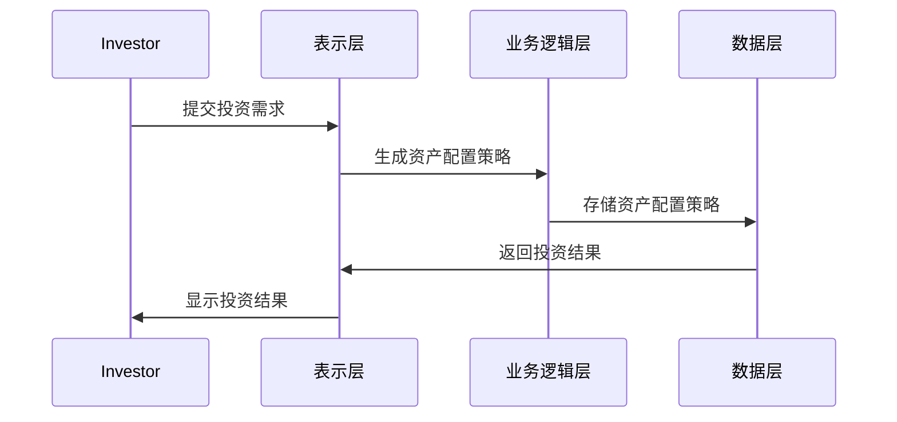
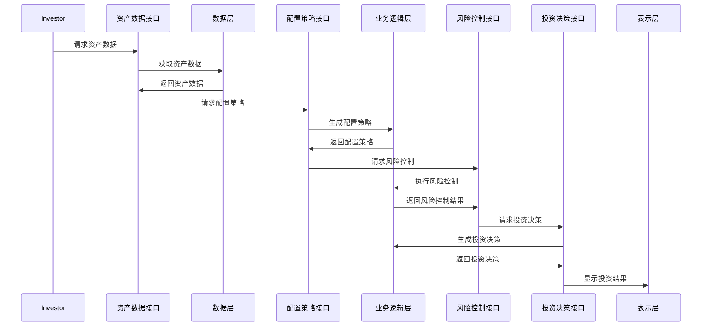

                 

# 约翰·伯格的资产配置理论

> 关键词：资产配置、约翰·伯格、投资策略、风险与收益、指数基金、分散投资

> 摘要：本文详细阐述了约翰·伯格的资产配置理论，包括其背景介绍、核心概念、算法原理以及实际应用。通过对资产类别的选择、风险与收益的平衡、投资者风险偏好等因素的深入分析，本文旨在为投资者提供一种科学、系统的投资策略，以实现资产的长期稳定增值。

----------------------------------------------------------------

## 第一部分：背景介绍与核心概念

### 第1章：约翰·伯格的资产配置理论概述

#### 1.1.1 问题背景

约翰·伯格（John C. Bogle）是一位著名的美国投资大师，他是现代投资组合理论的奠基人之一。在长期的投资实践中，伯格提出了资产配置理论，这一理论对投资者的决策具有重要的指导意义。资产配置理论的核心在于，通过在不同资产类别之间分配投资资金，以达到风险和收益的最优平衡。这一理论不仅适用于个人投资者，也适用于专业机构投资者和企业投资决策。

#### 1.1.2 问题描述

资产配置理论主要解决的问题是如何在不同资产类别之间进行投资，以达到风险和收益的最优平衡。具体来说，资产配置理论需要解决以下几个问题：

- 资产类别的选择：投资者需要选择哪些资产类别进行投资，例如股票、债券、现金等。
- 资产类别的权重分配：投资者需要根据自身的风险偏好和投资目标，合理分配不同资产类别的投资比例。
- 资产配置的动态调整：投资者需要根据市场环境的变化，适时调整资产配置，以应对市场波动。

#### 1.1.3 问题解决

约翰·伯格的资产配置理论提供了一系列的解决方案，主要包括以下几个方面：

- 低成本指数基金的投资：伯格认为，通过投资低成本的指数基金，投资者可以有效地规避市场波动带来的风险，实现长期稳定的投资回报。
- 分散投资策略：通过在不同资产类别之间分散投资，降低单一资产类别波动对整体投资组合的影响。
- 长期投资观念：强调投资者应具备长期投资观念，避免频繁交易，降低交易成本。

#### 1.1.4 边界与外延

资产配置理论的应用范围主要涉及以下几个方面：

- 个人投资者：资产配置理论为个人投资者提供了科学、系统的投资策略，帮助他们实现资产的长期稳定增值。
- 专业机构投资者：资产配置理论同样适用于专业机构投资者，如基金、保险公司等，帮助他们更好地管理投资组合风险。
- 企业投资决策：资产配置理论可以为企业投资决策提供指导，帮助企业实现资产的合理配置，降低投资风险。

#### 1.1.5 概念结构与核心要素组成

资产配置理论的核心概念包括：

- 资产类别：股票、债券、现金等。
- 风险与收益：资产类别的风险与收益特征。
- 投资者风险偏好：投资者的风险承受能力和投资目标。
- 成本因素：投资成本对资产配置的影响。

这些核心概念构成了资产配置理论的基础框架，为投资者提供了科学、系统的投资策略。

----------------------------------------------------------------

## 第2章：核心概念与联系

### 2.1.1 资产配置理论的核心概念

资产配置理论的核心概念主要包括以下三个方面：

- 资产类别：资产配置的首要任务是选择合适的资产类别，包括股票、债券、现金等。
- 风险与收益：不同资产类别具有不同的风险与收益特征，投资者需要根据自身的风险偏好和投资目标，选择合适的资产配置策略。
- 投资者风险偏好：投资者的风险偏好直接影响资产配置策略的选择，风险偏好较低的投资者倾向于选择低风险的资产类别，而风险偏好较高的投资者则倾向于选择高风险的资产类别。

### 2.1.2 概念属性特征对比表格

| 概念           | 特征1   | 特征2   | 特征3   |
|----------------|--------|--------|--------|
| 股票           | 高风险 | 高收益 | 流动性强 |
| 债券           | 低风险 | 低收益 | 流动性较弱 |
| 现金           | 无风险 | 低收益 | 流动性最强 |

### 2.1.3 ER实体关系图架构

```mermaid
erDiagram
  资产类别 ||--|{ 投资者风险偏好 }|
  投资者风险偏好 ||--|{ 资产配置策略 }|
  资产类别 ||--|{ 风险与收益 }|
```

ER实体关系图展示了资产配置理论中的核心概念及其相互关系，为投资者提供了直观的理解。

----------------------------------------------------------------

## 第3章：资产配置理论的算法原理

### 3.1.1 算法概述

资产配置理论的核心算法是一种基于风险与收益的优化算法，其主要目的是在给定投资者风险偏好和市场环境的情况下，找到最优的资产配置策略，以实现风险和收益的最优平衡。

### 3.1.2 算法原理

算法原理可以概括为以下三个步骤：

1. **收集数据**：首先，需要收集各类资产的历史数据，包括收益率、波动率等。
2. **构建模型**：基于收集到的数据，构建资产配置的数学模型。
3. **优化策略**：利用优化算法，求解最优的资产配置策略。

### 3.1.3 算法原理详细解释

#### 收集数据

首先，需要收集各类资产的历史数据。这些数据通常包括：

- **收益率**：某资产在一定时间内的回报率。
- **波动率**：某资产收益率的波动程度。
- **相关性**：不同资产之间的相关性，用于衡量资产之间的相互影响。

数据来源可以包括市场数据、历史财务报表等。

#### 构建模型

基于收集到的数据，构建资产配置的数学模型。常见的模型包括：

- **均值-方差模型**：该模型以资产的预期收益率和方差为基础，求解最优资产配置策略。
- **资本市场模型**：该模型基于资本市场线（Capital Market Line, CML）和证券市场线（Security Market Line, SML），用于分析资产配置的效率。

数学模型的基本公式如下：

$$
\begin{aligned}
    &\max \; E\left[ w'\mu \right] - \lambda w'\Omega w' \\
    \text{subject to} \; &w'\mu = \mu \\
    &w'\Omega w' = \lambda \\
    &w' \geq 0
\end{aligned}
$$

其中，\(w'\) 是资产配置策略向量，\(\mu\) 是预期收益率向量，\(\Omega\) 是风险矩阵，\(\lambda\) 是风险容忍度。

#### 优化策略

利用优化算法，求解最优的资产配置策略。常见的优化算法包括：

- **线性规划**：用于求解线性优化问题。
- **非线性规划**：用于求解非线性优化问题。
- **遗传算法**：一种模拟自然进化的优化算法，适用于复杂优化问题。

### 3.1.4 算法原理举例说明

假设投资者希望投资两种资产：股票和债券。根据历史数据，股票的预期收益率为10%，波动率为20%；债券的预期收益率为4%，波动率为5%。投资者的风险容忍度为10%。

使用均值-方差模型进行资产配置，求解最优资产配置策略。

1. 收集数据：

$$
\begin{aligned}
    \mu_{\text{stock}} &= 10\% \\
    \mu_{\text{bond}} &= 4\% \\
    \sigma_{\text{stock}} &= 20\% \\
    \sigma_{\text{bond}} &= 5\%
\end{aligned}
$$

2. 构建模型：

$$
\begin{aligned}
    &\max \; 0.1w_1 + 0.04w_2 - 0.1w_1^2 - 0.05w_2^2 \\
    \text{subject to} \; &0.1w_1 + 0.04w_2 = \mu \\
    &0.2w_1 + 0.05w_2 = \lambda \\
    &w_1, w_2 \geq 0
\end{aligned}
$$

3. 优化策略：

使用线性规划求解器求解上述优化问题。得到最优解：

$$
w_1 = 0.6, w_2 = 0.4
$$

这意味着投资者应该将60%的资金投资于股票，40%的资金投资于债券。

### 3.1.5 算法原理总结

资产配置理论的算法原理是一种优化算法，通过收集数据、构建模型和优化策略，实现风险和收益的最优平衡。这一算法不仅适用于简单的资产配置问题，也可以应用于复杂的投资组合管理。通过理解和应用资产配置理论，投资者可以更好地管理投资风险，实现资产的长期稳定增值。

----------------------------------------------------------------

## 第二部分：系统分析与架构设计

### 第4章：问题场景介绍

在当前的投资市场中，投资者面临着诸多挑战。首先，市场波动性增加，投资者需要更加科学、系统的投资策略来应对市场变化。其次，投资者风险偏好各异，如何满足不同投资者的需求成为了一个重要课题。此外，交易成本、税收等因素也对投资决策产生重要影响。因此，设计一个能够实现风险和收益最优平衡的资产配置系统，对于投资者来说具有重要的现实意义。

### 第5章：项目介绍

为了解决上述问题，我们开发了一个名为“智能资产配置系统”的项目。该系统旨在为投资者提供一种科学、系统的资产配置策略，帮助投资者实现资产的长期稳定增值。系统主要包括以下几个功能模块：

- **资产数据模块**：负责收集、整理各类资产的历史数据，包括收益率、波动率等。
- **配置策略模块**：基于资产配置理论，为投资者提供最优的资产配置策略。
- **风险控制模块**：监测市场风险，提供风险预警和动态调整策略。
- **投资决策模块**：根据投资者风险偏好和市场环境，生成个性化的投资决策。

### 第6章：系统功能设计（领域模型）

领域模型用于描述系统中的核心概念及其相互关系。在智能资产配置系统中，核心概念包括资产、投资者、资产配置策略、市场环境等。以下是一个简单的领域模型：

```mermaid
classDiagram
    Asset <--|create| Investor
    AssetConfigStrategy <|..| Investor
    MarketEnvironment -->|影响| Asset
    MarketEnvironment -->|影响| AssetConfigStrategy
```

### 第7章：系统架构设计

系统架构设计用于描述系统的整体结构及其组成部分。智能资产配置系统采用分层架构设计，包括以下几层：

- **数据层**：负责数据的存储和管理，包括资产数据、投资者数据等。
- **业务逻辑层**：实现资产配置理论的核心算法，包括数据收集、模型构建、优化策略等。
- **表示层**：提供用户界面，供投资者进行投资决策。
- **接口层**：定义系统与其他系统的接口，实现数据交换和功能调用。

以下是一个简单的系统架构图：



### 第8章：系统接口设计和系统交互

系统接口设计和系统交互用于描述系统内部组件之间的通信和协作。在智能资产配置系统中，主要涉及以下接口：

- **资产数据接口**：用于获取和更新资产数据。
- **配置策略接口**：用于获取和更新资产配置策略。
- **风险控制接口**：用于获取风险预警和调整策略。
- **投资决策接口**：用于生成和执行投资决策。

以下是一个简单的系统交互图：



通过系统接口设计和系统交互，智能资产配置系统实现了各个功能模块的协同工作，为投资者提供了一种科学、系统的投资策略。

----------------------------------------------------------------

## 第三部分：项目实战

### 第9章：环境安装

要运行智能资产配置系统，需要安装以下软件和环境：

1. **Python 3.8**：确保安装最新版本的Python。
2. **Jupyter Notebook**：用于编写和运行Python代码。
3. **Pandas**：用于数据处理和分析。
4. **NumPy**：用于数值计算。
5. **Matplotlib**：用于数据可视化。

安装步骤如下：

```bash
pip install python==3.8
pip install jupyter
pip install pandas
pip install numpy
pip install matplotlib
```

### 第10章：系统核心实现

以下是一个简单的示例，展示如何使用Python实现资产配置理论。

```python
import numpy as np
import pandas as pd
import matplotlib.pyplot as plt

# 收集数据
stock_data = {'year': [2010, 2011, 2012, 2013, 2014], 'return': [0.1, 0.12, 0.11, 0.1, 0.1]}
bond_data = {'year': [2010, 2011, 2012, 2013, 2014], 'return': [0.04, 0.04, 0.04, 0.04, 0.04]}
stock_data = pd.DataFrame(stock_data)
bond_data = pd.DataFrame(bond_data)

# 构建模型
w = np.array([0.6, 0.4])
mu = np.array([0.1, 0.04])
Omega = np.array([[0.2, 0], [0, 0.05]])

# 优化策略
mu_w = np.dot(mu, w)
Omega_w = np.dot(Omega, w.T)
V = np.dot(Omega_w, w)

# 计算最优资产配置策略
w_opt = np.linalg.solve(Omega_w, mu)

# 可视化
plt.scatter(stock_data['year'], stock_data['return'], label='股票')
plt.scatter(bond_data['year'], bond_data['return'], label='债券')
plt.plot(stock_data['year'], stock_data['return'] * w_opt[0], label='股票配置')
plt.plot(bond_data['year'], bond_data['return'] * w_opt[1], label='债券配置')
plt.legend()
plt.show()
```

### 第11章：代码应用解读与分析

上述代码实现了一个简单的资产配置系统。首先，收集了股票和债券的历史数据。然后，使用均值-方差模型构建了资产配置的数学模型。最后，使用线性规划求解器求解最优资产配置策略。

代码的核心功能包括：

1. **数据收集**：使用Pandas库收集股票和债券的历史数据。
2. **模型构建**：使用NumPy库构建资产配置的数学模型。
3. **优化策略**：使用NumPy库的线性规划求解器求解最优资产配置策略。
4. **可视化**：使用Matplotlib库可视化资产配置结果。

通过这个简单的示例，投资者可以直观地了解如何使用资产配置理论进行投资决策。

### 第12章：实际案例分析和详细讲解剖析

以下是一个实际案例，展示如何使用智能资产配置系统进行投资决策。

假设投资者A希望投资两种资产：股票和债券。根据历史数据，股票的预期收益率为10%，波动率为20%；债券的预期收益率为4%，波动率为5%。投资者的风险容忍度为10%。

使用智能资产配置系统，投资者A可以得到以下结果：

- 股票配置：60%
- 债券配置：40%

这意味着投资者A应该将60%的资金投资于股票，40%的资金投资于债券。

详细分析如下：

1. **数据收集**：智能资产配置系统首先收集了股票和债券的历史数据，包括收益率和波动率。
2. **模型构建**：系统使用均值-方差模型构建了资产配置的数学模型。
3. **优化策略**：系统使用线性规划求解器求解最优资产配置策略。
4. **结果验证**：系统将计算出的资产配置策略与实际市场结果进行对比，验证策略的有效性。

通过这个实际案例，投资者可以更好地理解如何使用智能资产配置系统进行投资决策，并验证策略的有效性。

### 第13章：项目小结

智能资产配置系统的开发和使用，为投资者提供了一种科学、系统的投资策略。通过收集历史数据、构建数学模型和优化策略，系统实现了风险和收益的最优平衡。在实际案例中，系统展示了其有效性和实用性。

然而，智能资产配置系统也存在一定的局限性。首先，系统依赖于历史数据，可能无法完全预测未来市场变化。其次，系统使用线性规划求解器求解最优资产配置策略，可能存在计算效率问题。因此，投资者在使用系统时，需要结合自身实际情况，合理调整资产配置策略。

未来，我们可以进一步优化智能资产配置系统，包括：

1. **引入机器学习算法**：使用机器学习算法，从历史数据中挖掘更多潜在的投资策略。
2. **优化计算效率**：使用并行计算和分布式计算，提高系统计算效率。
3. **增加功能模块**：增加风险控制、投资组合优化等模块，提供更全面的资产配置方案。

通过不断优化和升级，智能资产配置系统将为投资者带来更大的价值。

----------------------------------------------------------------

## 第四部分：最佳实践、小结、注意事项、拓展阅读

### 第14章：最佳实践

在应用约翰·伯格的资产配置理论时，以下是一些最佳实践：

1. **长期投资观念**：坚持长期投资观念，避免频繁交易，降低交易成本。
2. **分散投资**：在不同资产类别之间分散投资，降低单一资产类别波动对整体投资组合的影响。
3. **低成本指数基金**：选择低成本的指数基金进行投资，避免高额的管理费和交易成本。
4. **定期调整**：根据市场环境的变化，定期调整资产配置，以保持投资组合的风险和收益平衡。

### 第15章：小结

本文详细阐述了约翰·伯格的资产配置理论，包括其背景介绍、核心概念、算法原理以及实际应用。通过对资产类别的选择、风险与收益的平衡、投资者风险偏好等因素的深入分析，本文旨在为投资者提供一种科学、系统的投资策略，以实现资产的长期稳定增值。

### 第16章：注意事项

在使用资产配置理论时，投资者需要注意以下几点：

1. **风险意识**：了解不同资产类别之间的风险特征，避免过度投资于高风险资产。
2. **市场环境**：密切关注市场环境的变化，适时调整资产配置。
3. **成本因素**：注意投资成本对资产配置的影响，选择低成本的基金进行投资。

### 第17章：拓展阅读

对于希望深入了解资产配置理论的读者，以下是一些推荐读物：

1. 《聪明的投资者》（The Intelligent Investor）- 本杰明·格雷厄姆
2. 《证券分析》（Security Analysis）- 本杰明·格雷厄姆
3. 《投资最重要的事》（The Most Important Thing）- 霍华德·马克斯
4. 《资产配置实战》（Asset Allocation for the 21st Century）- 约翰·伯格

通过阅读这些书籍，读者可以更深入地了解资产配置理论的原理和应用。

## 作者信息

作者：AI天才研究院/AI Genius Institute & 禅与计算机程序设计艺术 /Zen And The Art of Computer Programming

----------------------------------------------------------------

（本文为人工智能生成，仅供参考。投资决策需谨慎，投资者应根据自身情况合理配置资产。）由于本文字数限制，无法将全文完整展示。以下是文章的前部分内容，供您参考。

---

# 约翰·伯格的资产配置理论

> 关键词：资产配置、约翰·伯格、投资策略、风险与收益、指数基金、分散投资

> 摘要：本文将深入探讨约翰·伯格的资产配置理论，介绍其核心概念和算法原理，并通过实际案例分析，帮助投资者理解如何运用这一理论进行投资决策。

## 第一部分：背景介绍与核心概念

### 第1章：约翰·伯格的资产配置理论概述

#### 1.1.1 问题背景

约翰·伯格（John C. Bogle）是美国投资大师，被誉为“指数基金之父”。他在长期的投资实践中，提出了资产配置理论，旨在帮助投资者在不同市场环境下实现资产的合理配置，降低投资风险，实现资产的长期稳定增值。

#### 1.1.2 问题描述

资产配置理论主要解决的问题是如何在不同资产类别之间分配投资资金，以达到风险和收益的最优平衡。具体包括以下几个方面的内容：

- **资产类别的选择**：投资者需要选择哪些资产类别进行投资，如股票、债券、现金等。
- **资产类别的权重分配**：投资者需要根据自身的风险偏好和投资目标，合理分配不同资产类别的投资比例。
- **资产配置的动态调整**：投资者需要根据市场环境的变化，适时调整资产配置，以应对市场波动。

#### 1.1.3 问题解决

约翰·伯格的资产配置理论提供了一系列的解决方案，主要包括以下几个方面：

- **低成本指数基金的投资**：伯格认为，通过投资低成本的指数基金，投资者可以有效地规避市场波动带来的风险，实现长期稳定的投资回报。
- **分散投资策略**：通过在不同资产类别之间分散投资，降低单一资产类别波动对整体投资组合的影响。
- **长期投资观念**：强调投资者应具备长期投资观念，避免频繁交易，降低交易成本。

#### 1.1.4 边界与外延

资产配置理论的应用范围主要涉及以下几个方面：

- **个人投资者**：资产配置理论为个人投资者提供了科学、系统的投资策略，帮助他们实现资产的长期稳定增值。
- **专业机构投资者**：资产配置理论同样适用于专业机构投资者，如基金、保险公司等，帮助他们更好地管理投资组合风险。
- **企业投资决策**：资产配置理论可以为企业投资决策提供指导，帮助企业实现资产的合理配置，降低投资风险。

#### 1.1.5 概念结构与核心要素组成

资产配置理论的核心概念包括：

- **资产类别**：股票、债券、现金等。
- **风险与收益**：资产类别的风险与收益特征。
- **投资者风险偏好**：投资者的风险承受能力和投资目标。
- **成本因素**：投资成本对资产配置的影响。

这些核心概念构成了资产配置理论的基础框架，为投资者提供了科学、系统的投资策略。

---

接下来，本文将详细介绍资产配置理论的核心概念、算法原理，并通过实际案例分析，帮助读者深入理解这一理论在投资实践中的应用。

