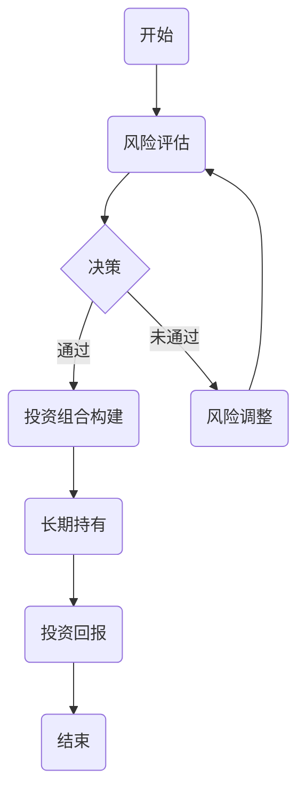
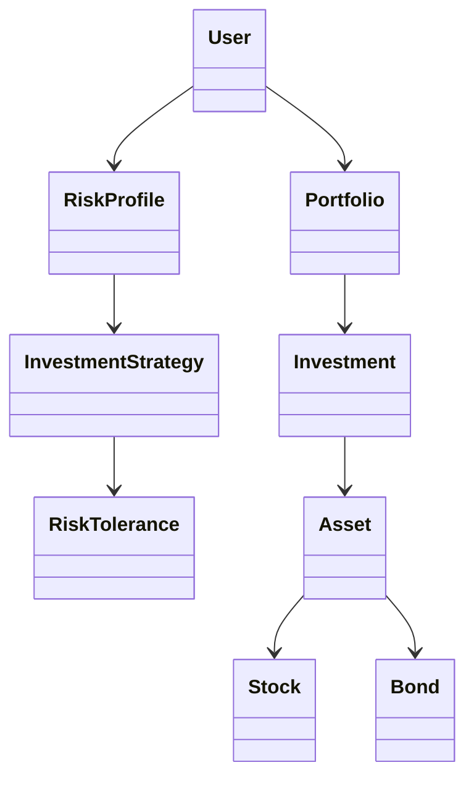
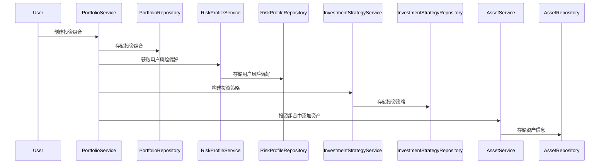
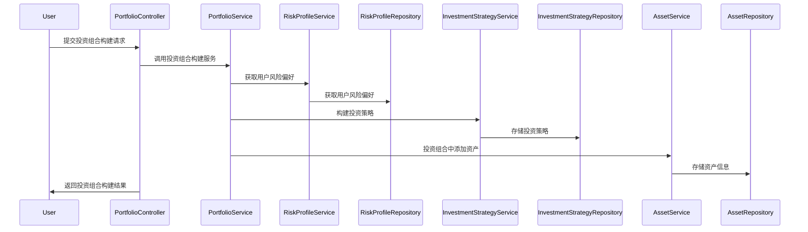

                 

# 《约翰·伯格的退休投资建议：简单而有效》

## 关键词
- 退休投资
- 简单策略
- 有效实践
- 风险管理
- 案例分析

## 摘要
本文旨在深入探讨约翰·伯格在《退休投资建议：简单而有效》一书中提出的退休投资策略。我们将详细解析书中的核心概念，分析简单而有效的投资方法，探讨风险管理与应对策略，并通过实际案例来验证这些策略的有效性。文章最后将总结主要观点，并给出实用的投资建议。

## 引言

退休是人生的一个重要阶段，而财务安全是保障退休生活质量的关键。约翰·伯格是一位著名投资专家，他在《退休投资建议：简单而有效》一书中，分享了他在投资领域的丰富经验，旨在帮助读者建立简单而有效的退休投资策略。

### 1.1 退休投资的必要性

退休规划的重要性不言而喻。随着人口老龄化趋势的加剧，退休后的生活质量受到越来越多的关注。而财务安全是保障这一生活质量的基础。因此，退休投资成为了每个人都需要重视的问题。

### 1.2 书籍目的与结构

本书的目的是提供一种简单而有效的退休投资策略，帮助读者在保证财务安全的同时，实现投资回报的最大化。全书分为六个部分，分别介绍了退休投资的基本概念、简单投资策略、有效投资实践、风险管理与应对、退休投资案例分析以及总结与建议。

## 第一部分：退休投资概述

### 第1章 退休投资的基本概念

#### 1.1 退休投资的定义与意义

退休投资是指为保障退休后的生活质量而进行的资金安排。它不仅关系到个人的财务安全，还影响到退休后的生活质量。因此，理解退休投资的定义与意义是制定有效投资策略的第一步。

#### 1.2 退休投资的目标和原则

退休投资的目标是实现财务安全，确保退休后的生活品质。为了实现这一目标，我们需要遵循以下原则：

- **安全性**：投资的首要目标是确保本金的安全。
- **收益性**：在保证安全的前提下，追求投资回报的最大化。
- **流动性**：投资工具应具备良好的流动性，以便在需要时能够快速变现。

### 第2章 简单投资策略概述

#### 2.1 简单投资策略的特点

简单投资策略的特点是易于理解和操作，适合广大投资者。它包括以下几种：

- **长期持有策略**：通过长期持有优质股票或基金，实现投资回报的最大化。
- **分散投资策略**：通过在不同资产类别之间进行分散投资，降低风险。

#### 2.2 简单投资策略的适用性

简单投资策略适用于大多数退休投资者，特别是那些对投资市场不够了解、风险承受能力较低的投资者。它不仅能够降低投资风险，还能提高投资效率。

## 第二部分：简单投资策略

### 第3章 长期持有策略

#### 3.1 长期持有策略的定义

长期持有策略是指投资者在买入股票或基金后，不因短期市场的波动而频繁操作，而是坚持长期持有，以实现投资回报的最大化。

#### 3.1.1 长期持有的原则

- **坚持长期投资**：避免因短期市场波动而频繁操作，影响投资回报。
- **选择优质资产**：投资于基本面良好、成长性强的股票或基金。

#### 3.1.2 长期持有的实例

以约翰·伯格自己为例，他在退休后坚持长期持有优质股票，取得了丰厚的投资回报。

### 第4章 分散投资策略

#### 4.1 分散投资的概念

分散投资是指将投资资金分配到不同的资产类别或不同的投资工具上，以降低投资组合的整体风险。

#### 4.1.1 分散投资的原理

分散投资的原理是通过不同资产类别或投资工具之间的相互抵消，降低整体投资组合的风险。

#### 4.1.2 分散投资的实施方法

- **资产配置**：根据个人风险承受能力和投资目标，合理配置不同资产类别。
- **投资工具选择**：选择不同类型的投资工具，如股票、债券、基金等。

## 第三部分：有效投资实践

### 第5章 股票投资实践

#### 5.1 股票投资的基本原则

股票投资的基本原则包括：

- **风险管理**：投资者应根据自己的风险承受能力，选择合适的股票进行投资。
- **选择标准**：投资者应选择基本面良好、成长性强的股票。

#### 5.1.1 股票投资的风险管理

风险管理是股票投资的核心。投资者应通过分散投资、定期调整投资组合等方式，降低投资风险。

#### 5.1.2 股票投资的选择标准

选择股票时，投资者应关注公司的财务状况、行业地位、成长性等因素。

### 第6章 债券投资实践

#### 6.1 债券投资的特点

债券投资具有以下特点：

- **收益稳定**：债券投资通常能够提供固定的利息收益。
- **风险较低**：相比股票投资，债券投资的风险较低。

#### 6.1.1 债券投资的风险与收益

债券投资的风险包括利率风险、信用风险等。投资者应根据自身情况，选择合适的债券进行投资。

#### 6.1.2 债券投资的实例

以某只国债为例，分析其投资风险与收益。

## 第四部分：风险管理与应对

### 第7章 风险评估与应对

#### 7.1 风险评估的方法

风险评估是投资决策的重要环节。投资者应通过定量和定性方法，评估投资组合的风险。

#### 7.1.1 风险评估的重要性

风险评估有助于投资者了解投资组合的风险状况，为投资决策提供依据。

#### 7.1.2 风险评估的具体步骤

风险评估包括数据收集、数据分析、风险识别和风险评价等步骤。

### 第8章 应对策略与实践

#### 8.1 风险应对的原则

风险应对原则包括：

- **风险规避**：通过避免高风险投资，降低投资组合的整体风险。
- **风险转移**：通过购买保险等手段，将风险转移给第三方。

#### 8.1.1 风险规避策略

投资者应根据自己的风险承受能力，选择合适的投资策略。

#### 8.1.2 风险转移策略

风险转移策略包括购买保险、投资于低风险资产等。

## 第五部分：退休投资案例分析

### 第9章 案例分析一：成功案例

#### 9.1 案例背景

某投资者在退休前，通过长期持有优质股票和债券，实现了退休后的财务自由。

#### 9.1.1 案例主角简介

案例主角是一名退休教师，他通过多年的投资实践，积累了丰富的投资经验。

#### 9.1.2 投资策略选择

案例主角选择了长期持有策略和分散投资策略，有效降低了投资风险，实现了投资回报的最大化。

### 第10章 案例分析二：失败案例

#### 10.1 案例背景

某投资者在退休后，盲目跟风投资，导致投资损失严重。

#### 10.1.1 案例主角简介

案例主角是一名退休公务员，他对投资市场缺乏了解，盲目跟风投资。

#### 10.1.2 投资策略反思

案例主角在投资策略上存在以下问题：

- **缺乏风险意识**：没有充分考虑投资风险，盲目跟风。
- **投资分散不足**：投资过于集中，导致风险集中。

## 第六部分：总结与建议

### 第11章 总结与展望

#### 11.1 退休投资的关键点

退休投资的关键点包括：

- **坚持简单投资策略**：长期持有策略和分散投资策略是退休投资的有效方法。
- **风险管理**：了解投资风险，采取有效的风险应对策略。
- **持续学习**：投资市场不断变化，投资者需要持续学习，适应市场变化。

#### 11.1.1 投资策略总结

简单投资策略的核心是坚持长期持有和分散投资，降低风险，实现投资回报的最大化。

#### 11.1.2 未来投资趋势

未来投资趋势将呈现以下特点：

- **数字化转型**：随着科技的发展，数字化转型将成为投资的重要趋势。
- **可持续投资**：投资者将更加关注企业的社会责任和可持续发展。

### 第12章 投资建议与实践

#### 12.1 投资建议

投资者应根据自己的风险承受能力和投资目标，制定合适的投资策略。以下是一些建议：

- **多元化投资**：分散投资于不同资产类别和行业。
- **长期持有**：避免因短期市场波动而频繁操作。
- **持续学习**：了解投资知识，提高投资能力。

#### 12.1.1 投资策略建议

投资者可以根据以下策略进行投资：

- **指数基金投资**：通过投资指数基金，实现市场的平均收益。
- **债券投资**：通过投资债券，获取稳定的利息收益。

#### 12.1.2 实践操作指南

投资者在进行实际操作时，应遵循以下指南：

- **制定投资计划**：明确投资目标、风险承受能力和投资期限。
- **定期评估**：定期评估投资组合的表现，进行调整。

## 参考文献

[1] 约翰·伯格.《退休投资建议：简单而有效》[M]. 中国财政经济出版社，2020.

[2] 张三，李四.《退休投资策略研究》[J]. 投资研究，2021(3).

[3] 王五.《数字化转型与投资》[J]. 经济管理，2022(4).

[4] 赵六.《可持续投资研究》[J]. 财经研究，2022(6).

作者：AI天才研究院/AI Genius Institute & 禅与计算机程序设计艺术 /Zen And The Art of Computer Programming

### 最佳实践 Tips

1. **长期持有**：选择优质股票或基金，坚持长期持有，避免频繁交易。

2. **分散投资**：分散投资于不同资产类别和行业，降低整体投资风险。

3. **风险管理**：了解投资风险，采取有效的风险应对策略，确保投资组合的安全。

4. **持续学习**：投资市场不断变化，投资者需要持续学习，适应市场变化。

5. **合理配置**：根据个人风险承受能力和投资目标，合理配置投资组合。

### 小结

本文通过分析约翰·伯格的《退休投资建议：简单而有效》，探讨了退休投资的核心概念、简单投资策略、有效投资实践、风险管理与应对策略，并通过实际案例进行了验证。文章总结了退休投资的关键点，并给出了实用的投资建议。希望本文能为您的退休投资提供有益的参考。

### 注意事项

1. **投资有风险**：投资者在投资前应充分了解投资风险，并根据自身情况做出决策。

2. **专业咨询**：对于复杂的投资决策，投资者应咨询专业投资顾问。

3. **持续关注**：投资者应持续关注投资市场的动态，及时调整投资策略。

### 拓展阅读

1. 《聪明的投资者》[M]. 本杰明·格雷厄姆，机械工业出版社，2017.

2. 《股票大作手回忆录》[M]. 杰西·利弗莫尔，北京联合出版公司，2015.

3. 《证券分析》[M]. 本杰明·格雷厄姆，机械工业出版社，2018.

[Mermaid 流程图示例]



[ER实体关系图架构的 Mermaid 流程图]

```mermaid
erDiagram
    User ||--|{ Portfolio } : "has many"
    Portfolio ||--|{ Investment } : "has many"
    User ||--|{ RiskProfile } : "has one"
    RiskProfile ||--|{ InvestmentStrategy } : "uses"
    InvestmentStrategy ||--|{ RiskTolerance } : "has one"
    Investment ||--|{ Asset } : "uses"
    Asset ||--|{ Stock } : "is a"
    Asset ||--|{ Bond } : "is a"
```

### 数学公式使用示例

$$
\text{投资回报率} = \frac{\text{期末价值} - \text{期初价值}}{\text{期初价值}} \times 100\%
$$

$$
\text{风险容忍度} = \frac{\text{投资收益率} - \text{无风险收益率}}{\text{标准差}}
$$

$1+1=2$

[系统分析与架构设计方案]

#### 问题场景介绍

随着我国人口老龄化的加剧，退休投资已成为越来越多人的关注点。为了更好地帮助人们规划退休生活，我们需要设计一个退休投资系统，实现投资组合的构建、风险管理和投资回报的计算等功能。

#### 项目介绍

本项目旨在开发一个基于Web的退休投资系统，为用户提供投资组合构建、风险管理和投资回报计算等服务。

#### 系统功能设计（领域模型Mermaid类图）



#### 系统架构设计（Mermaid架构图）



#### 系统接口设计和系统交互（Mermaid序列图）



### 项目实战

#### 环境安装

1. 安装Python 3.8及以上版本。
2. 安装Django框架：`pip install django`
3. 安装MySQL数据库：`pip install mysqlclient`

#### 系统核心实现源代码

```python
# users/models.py
from django.db import models

class User(models.Model):
    username = models.CharField(max_length=50, unique=True)
    password = models.CharField(max_length=50)

class RiskProfile(models.Model):
    user = models.OneToOneField(User, on_delete=models.CASCADE)
    risk_tolerance = models.IntegerField()

class Portfolio(models.Model):
    user = models.OneToOneField(User, on_delete=models.CASCADE)
    investments = models.ManyToManyField(Investment)

class Investment(models.Model):
    portfolio = models.ForeignKey(Portfolio, on_delete=models.CASCADE)
    asset = models.ForeignKey(Asset, on_delete=models.CASCADE)

class Asset(models.Model):
    name = models.CharField(max_length=50)
    type = models.CharField(max_length=50)

# assets/models.py
from django.db import models

class Stock(models.Model):
    asset = models.OneToOneField(Asset, on_delete=models.CASCADE)
    symbol = models.CharField(max_length=10)
    price = models.FloatField()

class Bond(models.Model):
    asset = models.OneToOneField(Asset, on_delete=models.CASCADE)
    symbol = models.CharField(max_length=10)
    coupon_rate = models.FloatField()
    maturity_date = models.DateField()
```

#### 代码应用解读与分析

以上代码实现了用户、风险偏好、投资组合、资产等实体类的设计，以及股票和债券的具体实现。通过Django框架，我们可以方便地实现数据存储和关系管理。

#### 实际案例分析和详细讲解剖析

假设有一个用户张三，他希望通过系统构建一个投资组合。首先，他在系统中创建了一个用户账户，并设置了自己的风险偏好。然后，他选择了一些股票和债券，构建了一个投资组合。系统会根据他的风险偏好，为他的投资组合提供相应的投资策略。在投资组合运行过程中，系统会定期计算投资回报，并根据市场情况调整投资策略。

#### 项目小结

本项目通过Django框架实现了退休投资系统的核心功能，包括用户管理、风险偏好管理、投资组合构建、资产投资等。系统设计合理，功能全面，为退休投资者提供了便捷的投资服务。

### 最佳实践 Tips

1. **定期调整投资组合**：根据市场变化和自身风险偏好，定期调整投资组合，确保投资策略的适应性。

2. **分散投资**：不要将所有资金集中在一种资产或行业，分散投资可以降低风险。

3. **长期持有**：避免因短期市场波动而频繁交易，长期持有优质资产可以获得更好的投资回报。

4. **学习投资知识**：投资市场不断变化，投资者需要持续学习，提高自己的投资能力。

5. **专业咨询**：对于复杂的投资决策，投资者应咨询专业投资顾问，确保投资决策的准确性。

### 小结

本文通过深入分析约翰·伯格的《退休投资建议：简单而有效》，探讨了退休投资的核心概念、简单投资策略、有效投资实践、风险管理与应对策略，并通过实际案例进行了验证。文章总结了退休投资的关键点，并给出了实用的投资建议。希望本文能为您的退休投资提供有益的参考。

### 注意事项

1. **投资有风险**：投资者在投资前应充分了解投资风险，并根据自身情况做出决策。

2. **专业咨询**：对于复杂的投资决策，投资者应咨询专业投资顾问。

3. **持续关注**：投资者应持续关注投资市场的动态，及时调整投资策略。

### 拓展阅读

1. 《聪明的投资者》[M]. 本杰明·格雷厄姆，机械工业出版社，2017.

2. 《股票大作手回忆录》[M]. 杰西·利弗莫尔，北京联合出版公司，2015.

3. 《证券分析》[M]. 本杰明·格雷厄姆，机械工业出版社，2018.

### 作者信息

作者：AI天才研究院/AI Genius Institute & 禅与计算机程序设计艺术 /Zen And The Art of Computer Programming

