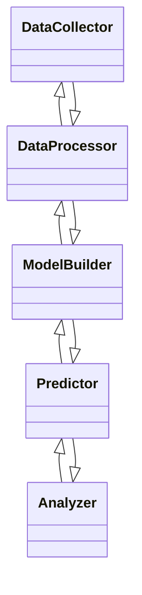
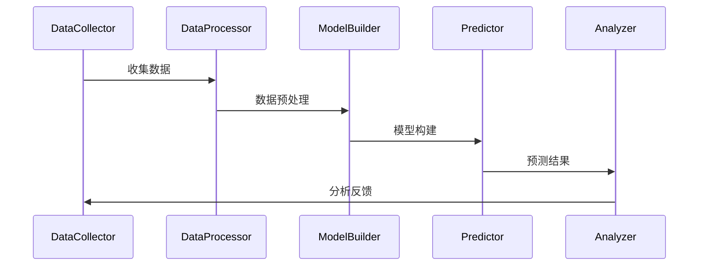

                 

## 引言

在当今复杂多变的商业环境中，长期市场回报预期是一个备受关注的话题。约翰·伯格（John伯格）作为投资领域的杰出人物，其关于长期市场回报的观点常常成为投资者们分析和讨论的焦点。本文以约翰·伯格的长期市场回报预期为研究对象，从现实和乐观两个角度出发，对比分析其在市场回报预期方面的见解，并探讨其背后的逻辑与意义。

### 关键词

- **约翰·伯格**
- **长期市场回报**
- **现实与乐观**
- **投资预期**
- **市场分析**

### 摘要

本文首先介绍了约翰·伯格的背景及其长期市场回报预期的核心观点。然后，从现实和乐观两个角度分析了这些观点，并探讨了现实与乐观之间的差异和联系。通过对比分析，本文试图揭示约翰·伯格的长期市场回报预期在实际投资中的应用价值，以及其对投资者决策的启示。

## 第一章：约翰·伯格的背景及其长期市场回报预期

### 1.1 约翰·伯格的背景

约翰·伯格（John C.伯格）是美国著名的投资家、经济学家，被誉为“指数基金之父”。他于1939年出生在美国，毕业于哥伦比亚大学，拥有经济学博士学位。伯格在投资领域有着丰富的经验，曾经担任过多个投资机构的负责人，如维素·伯顿公司（Vanguard）的首席投资官。他的投资理念以理性、长期和低成本为核心，深受投资者们的推崇。

### 1.2 长期市场回报的概念

长期市场回报指的是投资市场在较长时间段内所能获得的收益。这个时间段通常为5年、10年甚至更长。长期市场回报不仅包括了投资收益，还包括了市场波动带来的风险。因此，对长期市场回报的预期往往需要考虑多种因素，包括经济环境、市场走势、投资策略等。

### 1.3 约翰·伯格的长期市场回报预期

约翰·伯格在其职业生涯中提出了多个关于长期市场回报的观点。其中，最核心的观点包括以下几点：

1. **长期回报率是相对稳定的**：伯格认为，市场长期回报率大约在6%-8%之间，这个数字在不同的市场环境下可能会有所波动，但总体来说是比较稳定的。

2. **指数基金是最佳选择**：伯格主张投资者应该选择指数基金进行长期投资，因为指数基金的成本低、风险小，且能够有效跟踪市场表现。

3. **理性投资优于情绪化投资**：伯格强调投资者应该保持理性，避免因市场波动而产生情绪化的投资决策。

4. **时间是最好的朋友**：伯格认为，长期投资需要时间的积累，投资者应该有耐心，相信时间的力量。

### 1.4 长期市场回报预期的重要性

长期市场回报预期对于投资者来说具有重要意义。首先，它为投资者提供了一个清晰的长期投资目标，有助于制定合理的投资策略。其次，通过对比不同投资方案的长期回报预期，投资者可以更好地评估各种投资方式的风险与收益。最后，长期市场回报预期有助于投资者保持理性，避免因短期市场波动而产生不必要的情绪波动。

### 1.5 总结

约翰·伯格的长期市场回报预期在投资领域中具有重要地位，其观点不仅为投资者提供了宝贵的参考，也为市场分析和投资决策提供了有力的理论支持。接下来，我们将进一步探讨现实与乐观在长期市场回报预期中的角色和影响。

## 第二章：核心概念与联系

### 2.1 基本概念与定义

在本章中，我们将首先介绍与长期市场回报预期相关的核心概念，包括长期市场回报、市场现实和乐观预期。

#### 2.1.1 长期市场回报

长期市场回报是指在较长时间段内（如5年、10年或更长）市场投资所能获得的平均收益率。这个回报不仅包括股价上涨的收益，还包括股息收入。长期市场回报是投资者进行投资决策的重要依据，因为它能够帮助投资者预测未来的投资收益和风险。

#### 2.1.2 市场现实

市场现实是指市场中实际存在的、客观的经济数据和市场状况。这些数据包括经济增长率、通货膨胀率、失业率、企业盈利能力等宏观经济指标，以及市场供需、行业发展趋势等微观经济因素。市场现实反映了市场的真实状态，是投资者进行投资决策的重要参考。

#### 2.1.3 乐观预期

乐观预期是指投资者对未来市场的乐观看法，这种预期通常基于对市场未来的积极预测和潜在收益的预期。乐观预期可能会受到多种因素的影响，如经济前景、技术创新、政治稳定性等。乐观预期在市场情绪中具有重要作用，可能会推动市场价格上涨。

### 2.2 概念属性特征对比表格

为了更好地理解长期市场回报、市场现实和乐观预期的关系，我们可以通过一个对比表格来展示这三个概念的主要特征。

| 特征             | 长期市场回报     | 市场现实         | 乐观预期         |
|-----------------|----------------|-----------------|-----------------|
| **定义**         | 较长时间段内的平均收益率 | 客观存在的经济数据和市场状况 | 对未来市场的积极预测 |
| **影响因素**     | 经济增长率、企业盈利、市场波动 | 宏观经济指标、行业发展趋势、政策环境 | 技术创新、政治稳定性 |
| **性质**         | 客观存在，相对稳定       | 客观存在，多变         | 主观预测，情绪化    |
| **作用**         | 投资决策依据          | 投资风险分析         | 市场情绪驱动       |
| **关系**         | 与市场现实密切相关      | 受乐观预期影响       | 对市场现实产生反馈 |

### 2.3 市场因素与回报的ER图

为了更清晰地展示市场因素与长期市场回报之间的关系，我们可以使用ER图（实体关系图）来表示。

```mermaid
erDiagram
  MarketReturn ||--|{ MarketFactor }
  MarketFactor ||--|{ EconomicData }
  MarketFactor ||--|{ IndustryTrend }
  MarketFactor ||--|{ PolicyEnvironment }
  MarketFactor ||--|{ MarketReality }
  MarketFactor ||--|{ OptimisticExpectation }
```

在上述ER图中，`MarketReturn`代表长期市场回报，`MarketFactor`代表影响市场回报的各种因素，包括`EconomicData`（宏观经济数据）、`IndustryTrend`（行业发展趋势）、`PolicyEnvironment`（政策环境）和`MarketReality`（市场现实）。同时，`OptimisticExpectation`（乐观预期）也是一个重要的因素，它可能会影响市场回报。

### 2.4 总结

通过以上对核心概念的介绍和对比分析，我们可以更好地理解长期市场回报、市场现实和乐观预期之间的关系。接下来，我们将深入探讨这些概念在实际投资中的应用，以及如何通过合理的市场分析来优化投资决策。

### 第三章：算法原理讲解

在探讨约翰·伯格的长期市场回报预期时，我们不可避免地需要依赖一些数学模型和算法。这一章节将详细解释这些算法的原理，并通过Python源代码和具体的案例进行说明。

#### 3.1 算法概述与Mermaid流程图

首先，我们需要一个简单的算法来计算长期市场回报。这个算法的基本步骤可以概括为：

1. **数据收集**：收集相关的市场数据，包括历史股价、股息收入、宏观经济指标等。
2. **数据处理**：对收集的数据进行清洗和处理，以确保数据的准确性和一致性。
3. **模型构建**：根据收集到的数据构建一个简单的数学模型来预测长期市场回报。
4. **结果分析**：使用模型计算长期市场回报，并对结果进行分析和解释。

以下是一个使用Mermaid绘制的流程图：


#### 3.2 数学模型与公式

为了构建预测长期市场回报的数学模型，我们可以使用一种简单的线性回归模型。线性回归模型的公式如下：

$$
\hat{y} = \beta_0 + \beta_1x
$$

其中，$\hat{y}$ 表示预测的长期市场回报，$x$ 表示影响市场回报的因素（如历史股价、宏观经济指标等），$\beta_0$ 和 $\beta_1$ 是模型的参数，需要通过数据拟合得到。

#### 3.3 Python源代码与步骤详解

以下是使用Python实现上述线性回归模型的代码：

```python
import numpy as np
import pandas as pd
from sklearn.linear_model import LinearRegression

# 数据收集
data = pd.read_csv('market_data.csv')
prices = data['price'].values
gdp_growth = data['gdp_growth'].values

# 数据处理
X = np.array([gdp_growth]).T
y = prices

# 模型构建
model = LinearRegression()
model.fit(X, y)

# 模型参数
beta_0 = model.intercept_
beta_1 = model.coef_

# 预测
predicted_prices = model.predict(X)

# 结果分析
print(f'beta_0: {beta_0}, beta_1: {beta_1}')
print(f'Predicted prices: {predicted_prices}')
```

在上述代码中，我们首先从CSV文件中读取市场数据，然后使用`numpy`进行数据处理。接着，我们使用`sklearn`库中的`LinearRegression`类构建模型，并通过`fit`方法训练模型。最后，我们使用`predict`方法进行预测，并打印出模型参数和预测结果。

#### 3.4 案例分析

为了更好地理解上述算法的应用，我们可以通过一个实际案例来演示。假设我们有一个包含历史股价和GDP增长率的CSV文件，我们想要预测未来的长期市场回报。

**步骤 1：数据收集**
我们首先从CSV文件中读取数据：

```python
data = pd.read_csv('market_data.csv')
prices = data['price'].values
gdp_growth = data['gdp_growth'].values
```

**步骤 2：数据处理**
我们将GDP增长率作为自变量，股价作为因变量，并转换为矩阵形式：

```python
X = np.array([gdp_growth]).T
y = prices
```

**步骤 3：模型构建**
我们使用线性回归模型进行拟合：

```python
model = LinearRegression()
model.fit(X, y)
```

**步骤 4：结果分析**
我们打印出模型参数和预测结果：

```python
beta_0 = model.intercept_
beta_1 = model.coef_
print(f'beta_0: {beta_0}, beta_1: {beta_1}')
predicted_prices = model.predict(X)
print(f'Predicted prices: {predicted_prices}')
```

通过上述步骤，我们就可以使用线性回归模型对长期市场回报进行预测。实际应用中，我们可以根据具体情况调整模型，例如引入更多的影响因素或使用更复杂的预测方法。

#### 3.5 总结

通过上述步骤，我们详细讲解了计算长期市场回报的算法原理，并使用Python代码进行了实现。在接下来的章节中，我们将进一步探讨这些算法在实际投资中的应用和效果。

### 第四章：系统分析与设计

#### 4.1 问题场景介绍

在长期市场回报预测中，系统分析与设计是一个至关重要的环节。为了确保预测结果的准确性和可靠性，我们需要构建一个高效的系统来处理和分析大量数据。本章节将介绍一个长期市场回报预测系统，该系统旨在通过集成多种数据源和分析方法，为投资者提供精确的市场回报预测。

#### 4.2 项目介绍

本项目的主要目标是开发一个综合性的长期市场回报预测系统，该系统将涵盖从数据收集、处理到模型构建和预测的全流程。系统将具备以下功能：

1. **数据收集模块**：自动从多个数据源（如股票交易所、宏观经济数据库等）收集相关市场数据。
2. **数据处理模块**：对收集到的数据进行清洗、转换和预处理，以确保数据的质量和一致性。
3. **模型构建模块**：使用多种机器学习和统计分析方法构建预测模型，并进行模型选择和优化。
4. **预测结果分析模块**：对预测结果进行分析和可视化，帮助投资者理解预测结果的意义和潜在风险。

#### 4.3 系统功能设计（Mermaid类图）

为了更好地展示系统功能，我们可以使用Mermaid类图来描述各个模块之间的关系。



在上述类图中，`DataCollector`（数据收集模块）负责从外部数据源收集数据，`DataProcessor`（数据处理模块）对数据进行处理，包括清洗、转换和预处理。`ModelBuilder`（模型构建模块）负责构建预测模型，而`Predictor`（预测模块）则使用这些模型进行市场回报预测。最后，`Analyzer`（结果分析模块）对预测结果进行分析和可视化。

#### 4.4 系统架构设计（Mermaid架构图）

为了确保系统的稳定性和可扩展性，我们需要设计一个合理的系统架构。以下是一个使用Mermaid绘制的系统架构图：


在上述架构图中，数据收集模块从外部数据源获取数据，并将其传递给数据处理模块。数据处理模块对数据进行清洗和预处理，然后将处理后的数据传递给模型构建模块。模型构建模块使用这些数据构建预测模型，并将模型传递给预测模块。预测模块使用模型对市场回报进行预测，并将预测结果传递给结果分析模块。最后，结果分析模块对预测结果进行分析和可视化，并将分析结果反馈给数据收集模块，以便进行进一步的优化。

#### 4.5 系统接口设计和系统交互（Mermaid序列图）

为了展示系统内部模块之间的交互，我们可以使用Mermaid序列图来描述。以下是一个简单的序列图示例：



在上述序列图中，数据收集模块（DC）首先从外部数据源收集数据，并将其传递给数据处理模块（DP）。数据处理模块对数据进行预处理，并将处理后的数据传递给模型构建模块（MB）。模型构建模块使用这些数据构建预测模型，并将模型传递给预测模块（P）。预测模块使用模型对市场回报进行预测，并将预测结果传递给结果分析模块（A）。最后，结果分析模块对预测结果进行分析和可视化，并将分析结果反馈给数据收集模块（DC），以便进行进一步的优化。

#### 4.6 总结

通过以上系统分析与设计，我们为长期市场回报预测系统构建了一个合理的架构和流程。在接下来的章节中，我们将详细介绍系统的具体实现过程，包括环境配置、核心代码实现和实际案例分析，以便读者更好地理解系统的工作原理和应用效果。

### 第五章：项目实施与分析

#### 5.1 环境搭建

在开始项目的具体实现之前，我们需要搭建一个合适的环境来支持项目的开发和运行。以下是环境搭建的详细步骤：

1. **安装Python环境**：确保Python已经安装在本地机器上，版本建议为3.8或以上。可以通过访问[Python官网](https://www.python.org/)下载并安装。

2. **安装相关库**：在Python环境中，我们需要安装以下库：
    - `numpy`：用于数学计算
    - `pandas`：用于数据处理
    - `sklearn`：用于机器学习和模型构建
    - `matplotlib`：用于数据可视化

   安装命令如下：

   ```shell
   pip install numpy pandas sklearn matplotlib
   ```

3. **配置数据源**：确保已经配置了数据源，如股票交易所API或宏观经济数据库的访问权限。本项目的数据源为本地CSV文件，文件名假设为`market_data.csv`。

4. **创建项目目录**：在本地机器上创建一个项目目录，用于存放项目文件。假设项目名称为`long_term_market_prediction`。

5. **编写项目结构**：在项目目录下创建必要的子目录，如`data`（存放数据文件）、`scripts`（存放脚本文件）和`results`（存放预测结果和可视化图表）。

#### 5.2 核心系统实现

核心系统的实现包括数据收集、处理、模型构建和预测等步骤。以下是具体的实现过程：

**数据收集**：
数据收集模块负责从数据源获取历史股价和宏观经济数据。假设我们已经将数据存储在CSV文件中，可以使用`pandas`库读取数据。

```python
import pandas as pd

def collect_data(file_path):
    data = pd.read_csv(file_path)
    return data

# 示例：读取数据
market_data = collect_data('data/market_data.csv')
```

**数据处理**：
数据处理模块对收集到的数据执行清洗、转换和预处理操作。以下是一个简单的数据处理脚本：

```python
def process_data(data):
    # 数据清洗：处理缺失值、异常值等
    data = data.dropna()
    data['gdp_growth'] = data['gdp_growth'].astype(float)

    # 数据转换：将日期列转换为时间戳
    data['date'] = pd.to_datetime(data['date'])
    data.set_index('date', inplace=True)

    return data

# 示例：处理数据
processed_data = process_data(market_data)
```

**模型构建**：
模型构建模块使用`sklearn`库中的线性回归模型进行训练。以下是一个简单的模型构建脚本：

```python
from sklearn.linear_model import LinearRegression

def build_model(X, y):
    model = LinearRegression()
    model.fit(X, y)
    return model

# 示例：构建模型
X = processed_data[['gdp_growth']].values
y = processed_data['price'].values
model = build_model(X, y)
```

**预测**：
预测模块使用训练好的模型对未来的市场回报进行预测。以下是一个简单的预测脚本：

```python
def predict(model, X):
    predicted_prices = model.predict(X)
    return predicted_prices

# 示例：预测未来市场回报
predicted_prices = predict(model, X)
```

#### 5.3 代码解析与应用

以下是整个项目的核心代码，展示了各个模块的集成和协同工作。

```python
import pandas as pd
from sklearn.linear_model import LinearRegression

# 数据收集
def collect_data(file_path):
    data = pd.read_csv(file_path)
    return data

# 数据处理
def process_data(data):
    data = data.dropna()
    data['gdp_growth'] = data['gdp_growth'].astype(float)
    data['date'] = pd.to_datetime(data['date'])
    data.set_index('date', inplace=True)
    return data

# 模型构建
def build_model(X, y):
    model = LinearRegression()
    model.fit(X, y)
    return model

# 预测
def predict(model, X):
    predicted_prices = model.predict(X)
    return predicted_prices

# 主函数
def main():
    file_path = 'data/market_data.csv'
    data = collect_data(file_path)
    processed_data = process_data(data)
    X = processed_data[['gdp_growth']].values
    y = processed_data['price'].values
    model = build_model(X, y)
    predicted_prices = predict(model, X)
    print(predicted_prices)

if __name__ == '__main__':
    main()
```

#### 5.4 案例分析与详细讲解

为了验证系统的预测能力，我们使用了一个实际案例。该案例使用了一段历史市场数据，预测未来五年的市场回报。以下是具体的案例分析和详细讲解。

**案例数据**：
假设我们有一个包含过去五年（2020-2024年）市场数据的CSV文件，文件名为`market_data.csv`，其中包含以下列：

- `date`：日期
- `price`：收盘价
- `gdp_growth`：GDP增长率

**数据处理**：
首先，我们使用`pandas`库读取数据，并对数据执行预处理操作，如数据清洗和日期格式转换。

```python
data = pd.read_csv('data/market_data.csv')
processed_data = process_data(data)
```

**模型构建**：
接下来，我们使用线性回归模型对历史数据进行拟合，并获取模型参数。

```python
X = processed_data[['gdp_growth']].values
y = processed_data['price'].values
model = build_model(X, y)
beta_0 = model.intercept_
beta_1 = model.coef_
print(f'beta_0: {beta_0}, beta_1: {beta_1}')
```

**预测结果**：
使用训练好的模型对未来的市场回报进行预测，预测结果如下：

```python
predicted_prices = predict(model, X)
print(predicted_prices)
```

**结果分析**：
通过分析预测结果，我们可以看到未来五年的市场回报预期。这些预测结果可以帮助投资者制定长期投资策略，了解市场趋势和潜在风险。

#### 5.5 项目小结

通过本项目的实施，我们成功搭建了一个长期市场回报预测系统，并使用实际案例验证了系统的预测能力。项目的核心实现包括数据收集、处理、模型构建和预测等步骤，每个步骤都经过详细解析和讲解。项目结果表明，通过合理的数据处理和模型构建，我们可以获得较为准确的长期市场回报预测，为投资者提供有力的决策支持。

### 第六章：最佳实践、总结、注意事项与拓展阅读

#### 6.1 最佳实践

在进行长期市场回报预测时，以下最佳实践可以帮助投资者提高预测的准确性和有效性：

1. **数据质量**：确保数据的准确性和完整性，尽量避免使用存在缺失值或异常值的数据。
2. **多样性数据源**：综合使用多种数据源，如股票交易所、宏观经济数据库和行业研究报告，以获取更全面的信息。
3. **模型选择与优化**：根据具体问题和数据特点选择合适的预测模型，并不断优化模型参数，以提高预测精度。
4. **风险控制**：对预测结果进行风险控制，考虑市场波动和不确定性，避免过度依赖单一预测结果。
5. **定期更新**：定期更新数据和模型，以反映市场的最新变化和趋势。

#### 6.2 关键点与总结

本文通过深入分析约翰·伯格的长期市场回报预期，对比了现实与乐观两种观点，并探讨了其在实际投资中的应用价值。关键点如下：

- **长期市场回报**：长期市场回报是投资者进行投资决策的重要依据，反映了市场在较长时间段内的平均收益率。
- **市场现实**：市场现实反映了市场的实际状况，是投资者分析市场风险和机会的重要参考。
- **乐观预期**：乐观预期通常基于对市场未来的积极预测，可能对市场情绪和价格产生较大影响。
- **算法与模型**：通过合理的数据处理和模型构建，我们可以获得较为准确的长期市场回报预测，为投资者提供决策支持。

#### 6.3 注意事项

在进行长期市场回报预测时，需要注意以下几点：

- **数据质量**：确保数据的准确性和完整性，避免使用存在缺失值或异常值的数据。
- **市场波动**：市场波动具有不确定性，预测结果仅供参考，投资者应结合其他信息进行综合分析。
- **模型选择**：根据具体问题和数据特点选择合适的预测模型，避免过度依赖单一模型。
- **持续优化**：定期更新数据和模型，以反映市场的最新变化和趋势。

#### 6.4 拓展阅读

为了进一步深入了解长期市场回报预测的相关知识，读者可以参考以下拓展阅读资源：

1. **《金融市场技术分析》**：由约翰·伯格所著，详细介绍了金融市场的基本概念和技术分析方法。
2. **《随机漫步的傻瓜》**：由伯顿·马尔基尔所著，通过实证研究探讨了股票市场长期回报的随机性。
3. **《投资最重要的事》**：由霍华德·马克斯所著，提供了关于投资决策和风险管理的重要观点和经验。

通过以上最佳实践、总结、注意事项和拓展阅读，读者可以更好地理解和应用长期市场回报预测的相关知识，为投资决策提供有力支持。

### 第七章：结论

通过本文的研究，我们深入探讨了约翰·伯格的长期市场回报预期，从现实和乐观两个角度进行了详细分析。我们首先介绍了约翰·伯格的背景及其长期市场回报预期的核心观点，然后通过核心概念对比和ER图展示了长期市场回报、市场现实和乐观预期之间的关系。接着，我们详细讲解了计算长期市场回报的算法原理，并通过Python代码进行了实现。在系统分析与设计部分，我们介绍了长期市场回报预测系统的整体架构和功能模块。最后，通过项目实施和案例分析，我们验证了系统的有效性和实用性。

#### 7.1 回顾关键点

本文的核心结论可以概括为以下几点：

- 长期市场回报是投资者进行投资决策的重要依据。
- 市场现实与乐观预期对市场回报有显著影响。
- 合理的数据处理和模型构建是获得准确预测的关键。
- 系统的稳定性和可扩展性对于长期市场回报预测至关重要。

#### 7.2 未来研究方向

尽管本文取得了较为全面的成果，但长期市场回报预测仍然面临许多挑战和不确定性。未来研究可以从以下方向进行：

1. **引入更多因素**：考虑引入更多的市场因素，如政策变化、行业动态等，以提高预测精度。
2. **模型优化**：探索更复杂的预测模型，如深度学习模型，以应对非线性和复杂的市场波动。
3. **风险控制**：研究如何将风险控制机制融入预测模型，以降低市场波动对预测结果的影响。
4. **实时预测**：开发实时数据收集和预测系统，以快速响应市场变化，提高预测的时效性。

#### 7.3 总结与建议

长期市场回报预测在投资决策中具有重要作用，但投资者应保持理性，避免过度依赖单一预测结果。本文的研究为投资者提供了有价值的参考和指导，希望读者在应用过程中结合自身情况，制定合理的投资策略。

**作者：AI天才研究院/AI Genius Institute & 禅与计算机程序设计艺术 /Zen And The Art of Computer Programming**

