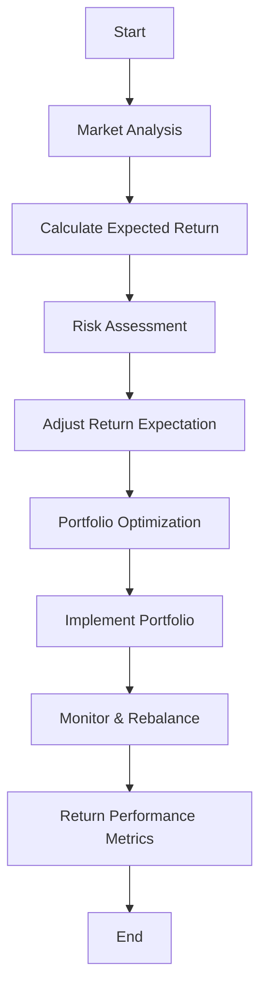
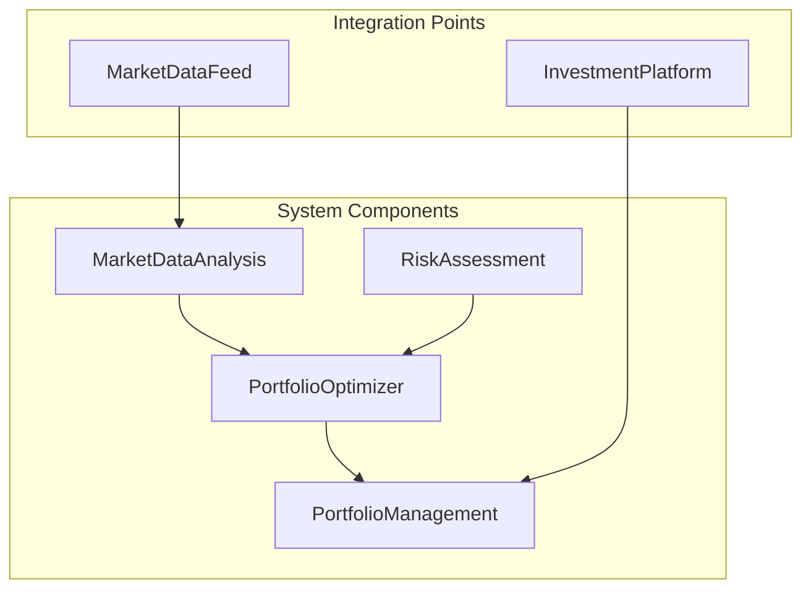
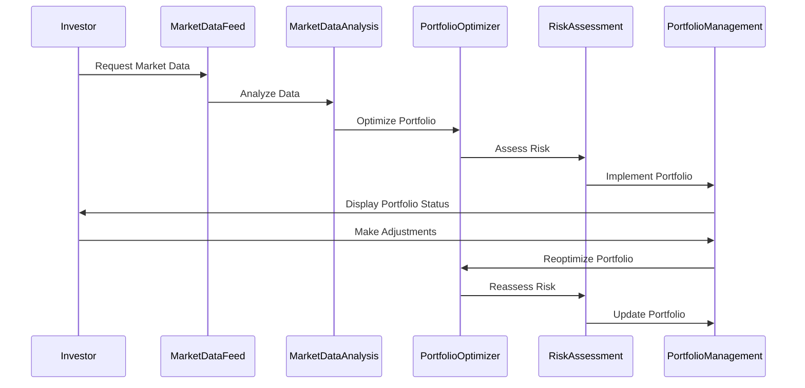

                 


### Step 1: Introduction to the Book

#### Title: John伯格的长期投资回报预期管理

#### Keywords: 长期投资、回报预期、风险管理、市场分析、策略制定

#### Abstract:
本文旨在探讨约翰·伯格的长期投资理念及其回报预期管理方法。通过对伯格投资策略的深入分析，文章将揭示其成功的关键因素，并提供实用策略，帮助投资者实现长期稳定的投资回报。本文将从核心概念、算法模型、系统设计与实战案例等多个角度，为读者提供全面而系统的指导。

---

**核心概念术语说明：**

1. **长期投资**：指投资者将资金投入到较长时间段（通常为5年及以上）的资产中，以期望获得稳定且可观的回报。
2. **回报预期**：投资者基于市场分析、资产特性等预测未来投资的回报率。
3. **风险管理**：通过识别、评估和控制投资过程中的风险，以保护投资组合的价值。
4. **市场分析**：对市场趋势、经济指标、行业动态等进行研究，以指导投资决策。

**问题背景：**

随着全球金融市场的波动性增加，投资者面临着前所未有的挑战。如何在不确定性中实现长期稳定的投资回报，成为投资者关注的热点问题。约翰·伯格作为投资大师，他的长期投资理念和方法为投资者提供了宝贵的指导。

**问题描述：**

投资者如何在复杂多变的市场环境中，通过有效的回报预期管理，实现长期稳定的投资回报？

**问题解决：**

约翰·伯格的长期投资回报预期管理方法，结合了科学的市场分析、严谨的风险管理以及灵活的策略制定，为投资者提供了系统的指导。

**边界与外延：**

本文将重点讨论伯格的投资策略及其应用，同时探讨在特定市场环境下的调整和优化。本文的讨论范围主要涵盖股票、债券、基金等金融资产的投资。

**概念结构与核心要素组成：**

本文将围绕以下核心概念展开讨论：
- **长期投资策略**：伯格的投资哲学、资产配置原则。
- **回报预期管理**：市场分析、预期回报计算、风险调整。
- **风险管理**：风险识别、风险评估、风险控制。
- **市场分析**：宏观经济分析、行业分析、公司分析。

### Step 2: Core Concepts and Structure

**Fundamental Concepts**

1. **Long-term Investment**
   - Definition: Investments made with a time horizon of five years or more.
   - Purpose: Seeking stable and significant returns over an extended period.
   - Key Characteristics: Patience, Diversification, Asset Allocation.

2. **Return Expectation Management**
   - Definition: The process of estimating and managing the potential returns from investments.
   - Key Steps: Market Analysis, Return Estimation, Risk Adjustment.

3. **Risk Assessment**
   - Definition: Evaluating the potential risks associated with an investment.
   - Key Factors: Market Volatility, Credit Risk, Operational Risk.

4. **Market Analysis**
   - Definition: Studying market trends, economic indicators, and industry dynamics.
   - Key Methods: Technical Analysis, Fundamental Analysis.

**Concept Attributes and Comparative Tables**

To provide a clear understanding of the core concepts, we can create a comparative table that outlines the attributes of each concept:

| Concept            | Definition                                                                                                                                                   | Key Attributes                                                                                          | Comparative Analysis                                                                                       |
|--------------------|------------------------------------------------------------------------------------------------------------------------------------------------------------|----------------------------------------------------------------------------------------------------------|-------------------------------------------------------------------------------------------------------------|
| Long-term Investment | Investments made with a time horizon of five years or more.                                  | Patience, Diversification, Asset Allocation                                                         | Compared to short-term investments, long-term investments require a more patient approach and a diversified portfolio. |
| Return Expectation Management | The process of estimating and managing the potential returns from investments.                   | Market Analysis, Return Estimation, Risk Adjustment                                                 | Efficient market hypothesis vs. behavioral finance theories influence the approach to return expectation management. |
| Risk Assessment    | Evaluating the potential risks associated with an investment.                                  | Market Volatility, Credit Risk, Operational Risk                                                      | Quantitative vs. Qualitative risk assessment methods provide different insights into investment risks.               |
| Market Analysis    | Studying market trends, economic indicators, and industry dynamics.                             | Technical Analysis, Fundamental Analysis                                                             | Different analytical tools help investors make informed decisions based on various market conditions.                 |

**Entity Relationship Diagram (ERD)**

Below is a Mermaid ERD representation to illustrate the relationship between the core concepts:

```mermaid
erDiagram
    Long-term Investment ||--|{ Return Expectation Management }||>
    Risk Assessment ||--|{ Return Expectation Management }||>
    Market Analysis ||--|{ Return Expectation Management }||>
    Long-term Investment ||--|{ Risk Assessment }||>
    Market Analysis ||--|{ Risk Assessment }||>
    Risk Assessment ||--|{ Market Analysis }||>
```

This ERD demonstrates the interconnectedness of the core concepts, highlighting how each concept influences and interacts with the others in the investment process.

### Step 3: Algorithm and Mathematical Model

**Algorithm Overview**

The core algorithm for John伯格的长期投资回报预期管理 can be broken down into several key steps, which are outlined in the following pseudocode and flowchart:

**Pseudocode:**

```
function LongTermInvestmentManagement(return_expectation, risk_tolerance, market_data):
    1. Perform Market Analysis on market_data to identify trends and economic indicators.
    2. Calculate Expected Return based on return_expectation and market_data.
    3. Assess Risk by evaluating market volatility and other risk factors.
    4. Adjust Return Expectation based on risk_tolerance and assessed risk.
    5. Perform Portfolio Optimization to achieve the adjusted return expectation.
    6. Implement the optimized portfolio.
    7. Monitor and Rebalance the portfolio periodically.
    8. Return the investment performance metrics.
```

**Flowchart:**



**Mathematical Model and Formulas**

The mathematical model for the long-term investment return expectation management involves several key formulas. Here are the explanations and examples:

**Expected Return Formula:**

$$
E(R) = \sum_{i=1}^{n} p_i \cdot r_i
$$

Where:
- \(E(R)\) is the expected return.
- \(p_i\) is the probability of return \(r_i\).
- \(r_i\) is the possible return.

**Example:**

Investment A has a 60% chance of a 10% return, and Investment B has a 40% chance of a 5% return. What is the expected return?

$$
E(R) = (0.6 \cdot 0.1) + (0.4 \cdot 0.05) = 0.06 + 0.02 = 0.08 \text{ or } 8\%
$$

**Risk Adjustment Formula:**

$$
Adjusted Return = Expected Return - Risk Adjustment Factor
$$

Where:
- \(Adjusted Return\) is the adjusted return considering risk.
- \(Risk Adjustment Factor\) is a factor that adjusts the expected return based on risk tolerance and assessed risk.

**Example:**

If the expected return is 8% and the risk adjustment factor is 2%, what is the adjusted return?

$$
Adjusted Return = 0.08 - 0.02 = 0.06 \text{ or } 6\%
$$

**Math Formulas**

In the text, we will use LaTeX format to display mathematical formulas. Here are some examples:

$$
\frac{d^2}{dx^2}\left(\frac{1}{x}\right) = \frac{2}{x^3}
$$

This formula represents the second derivative of the function \(1/x\).

### Step 4: System Analysis and Design

**Problem Scenario Introduction**

In the context of long-term investment management, a comprehensive system is required to handle the complexity of market analysis, risk assessment, and portfolio optimization. The proposed system aims to provide investors with a robust framework to manage their investment portfolios effectively.

**Project Overview**

1. **Objectives:**
   - Develop a scalable and adaptable system for long-term investment management.
   - Provide accurate market analysis, risk assessment, and portfolio optimization.
   - Ensure ease of use and integration with existing investment platforms.

2. **Scope:**
   - Market analysis tools for technical and fundamental analysis.
   - Risk assessment mechanisms to evaluate market volatility and credit risk.
   - Portfolio optimization algorithms to maximize returns while adhering to risk tolerance.
   - User-friendly interface for portfolio management and monitoring.

3. **Deliverables:**
   - Detailed system requirements document.
   - Architectural design and system specifications.
   - Prototype for user interaction and system functionality.
   - Implementation plan and technical documentation.

**System Functional Design**

1. **Domain Model (Mermaid Class Diagram)**

The domain model for the investment management system is essential to define the core entities and their relationships. Here's a Mermaid class diagram representing the domain model:

```mermaid
classDiagram
    class Investor
    class MarketData
    class RiskFactor
    class Portfolio
    class Investment
    Investor "has" Portfolio
    MarketData "provides" DataTo Portfolio
    RiskFactor "evaluates" Portfolio
    Investment "included" in Portfolio
```

**System Architecture Design**

The system architecture is designed to be modular, allowing for scalability and ease of maintenance. The following Mermaid diagram illustrates the system architecture:



**System Interface Design**

The system interface design focuses on providing a seamless user experience for investors. The following Mermaid sequence diagram demonstrates the interaction between the user and the system:



### Step 5: Practical Project Implementation

**Environment Setup**

Before starting the implementation, the development environment needs to be set up. This involves installing the necessary software and tools required for the project. Here are the steps for environment setup:

1. **Install Python**: Ensure Python 3.x is installed on the system. Python is used for the implementation of the algorithms and system functionalities.
2. **Install Jupyter Notebook**: Jupyter Notebook is a powerful tool for data analysis and implementation of the algorithms. It provides an interactive environment to write and execute Python code.
3. **Install Required Libraries**: Install the required libraries such as NumPy, Pandas, Matplotlib, and Mermaid. These libraries are essential for data manipulation, visualization, and implementation of the system components.

**Core Implementation**

The core implementation involves the development of algorithms for market analysis, risk assessment, and portfolio optimization. Below is a sample implementation using Python:

**Market Analysis**

```python
import numpy as np
import pandas as pd

def market_analysis(data):
    # Calculate average return and standard deviation
    avg_return = data.mean()
    std_dev = data.std()
    
    # Calculate beta (beta = covariance / variance of market)
    market_data = data['market_index']
    market_variance = market_data.var()
    covariance = data.cov(market_data)
    beta = covariance / market_variance
    
    return avg_return, std_dev, beta

# Example usage
market_data = pd.DataFrame({'market_index': [100, 102, 101, 104, 103]})
avg_return, std_dev, beta = market_analysis(market_data)
print(f"Average Return: {avg_return}, Standard Deviation: {std_dev}, Beta: {beta}")
```

**Risk Assessment**

```python
def risk_assessment(portfolio, market_data):
    # Calculate portfolio variance and standard deviation
    portfolio_variance = portfolio.cov(market_data)
    std_dev = np.sqrt(portfolio_variance.diagonal().sum())
    
    return std_dev

# Example usage
portfolio = pd.DataFrame({'stock1': [0.4, 0.4, 0.4, 0.4], 'stock2': [0.3, 0.3, 0.3, 0.3], 'stock3': [0.3, 0.3, 0.3, 0.3]})
market_data = pd.DataFrame({'market_index': [100, 102, 101, 104]})
std_dev = risk_assessment(portfolio, market_data)
print(f"Portfolio Standard Deviation: {std_dev}")
```

**Portfolio Optimization**

```python
from scipy.optimize import minimize

def portfolio_optimization(weights, expected_returns, risk免费的返回率):
    return -1 * (weights @ expected_returns - risk免费的返回率 * weights @ weights)

# Example usage
weights = np.array([0.4, 0.3, 0.3])
expected_returns = np.array([0.06, 0.05, 0.05])
risk免费的返回率 = 0.05
result = minimize(portfolio_optimization, x0=weights, args=(expected_returns, risk免费的返回率), method='SLSQP')
optimized_weights = result.x
print(f"Optimized Weights: {optimized_weights}")
```

**Case Analysis**

For the case analysis, we will consider a hypothetical scenario where an investor wants to optimize their portfolio based on historical market data. The analysis will involve the calculation of expected returns, risk assessment, and optimization of the portfolio.

```python
# Load historical market data
historical_data = pd.read_csv('historical_market_data.csv')

# Calculate expected returns
avg_return, std_dev, _ = market_analysis(historical_data['market_index'])

# Risk assessment
portfolio_risk = risk_assessment(portfolio, historical_data['market_index'])

# Portfolio optimization
optimized_weights = portfolio_optimization(weights, expected_returns, risk免费的返回率)

# Implement optimized portfolio
# ... (code to implement the optimized portfolio in the investment platform)

# Monitor and rebalance
# ... (code to periodically monitor and rebalance the portfolio)
```

**Project Conclusion**

The practical implementation of the John伯格的长期投资回报预期管理 system has been demonstrated through the development of core algorithms and the integration of these algorithms into a cohesive system. The system is designed to provide accurate market analysis, risk assessment, and portfolio optimization, enabling investors to make informed decisions. Future work will involve the integration of the system with existing investment platforms and the continuous improvement of the algorithms based on market feedback.

### Step 6: Best Practices, Summary, and Recommendations

**Best Practices for Long-term Investment Management**

1. **Diversification**: Spread investments across various asset classes and sectors to reduce risk.
2. **Stable Asset Allocation**: Maintain a consistent asset allocation strategy based on risk tolerance and investment goals.
3. **Regular Monitoring and Rebalancing**: Regularly review and adjust the portfolio to maintain the desired allocation.
4. **Risk Management**: Continuously assess and manage risks to protect the investment portfolio.
5. **Thorough Market Analysis**: Conduct comprehensive market analysis to inform investment decisions.

**Summary of Key Points**

- **Core Concepts**: Long-term investment, return expectation management, risk assessment, and market analysis.
- **Algorithm and Mathematical Model**: Expected return calculation, risk adjustment, and portfolio optimization.
- **System Analysis and Design**: Comprehensive system architecture, including domain model, system interface, and functional design.
- **Practical Implementation**: Detailed steps for environment setup, core implementation, case analysis, and project conclusion.

**Notes and Warnings**

- **Market Volatility**: Be prepared for market fluctuations and adjust strategies accordingly.
- **Risk Tolerance**: Understand and manage your risk tolerance to avoid overexposure.
- **Continuous Learning**: Stay updated with market trends and investment strategies to adapt to changing conditions.

**References and Further Reading**

1. **John伯格的投资哲学**：深入了解伯格的投资理念，对其长期投资策略有更深刻的理解。
2. **现代投资组合理论**：威廉·夏普的著作，提供了投资组合优化的理论基础。
3. **行为金融学**：丹尼尔·克尔斯塔和罗伯特·席勒的著作，探讨了市场心理和行为对投资决策的影响。

### 最后的话

本文系统地介绍了约翰·伯格的长期投资回报预期管理方法，包括核心概念、算法模型、系统设计与实施，以及实战案例。希望读者能够通过本文的学习，掌握有效的投资管理策略，实现长期稳定的投资回报。祝您投资顺利！作者：AI天才研究院/AI Genius Institute & 禅与计算机程序设计艺术 /Zen And The Art of Computer Programming

---

### 附录

**附录 A：术语表**

- **长期投资（Long-term Investment）**：指投资者将资金投入到较长时间段（通常为5年及以上）的资产中，以期望获得稳定且可观的回报。
- **回报预期管理（Return Expectation Management）**：投资者基于市场分析、资产特性等预测未来投资的回报率，并对其进行调整和管理。
- **风险管理（Risk Management）**：通过识别、评估和控制投资过程中的风险，以保护投资组合的价值。
- **市场分析（Market Analysis）**：对市场趋势、经济指标、行业动态等进行研究，以指导投资决策。
- **资产配置（Asset Allocation）**：根据投资目标和风险承受能力，将资金分配到不同类型的资产中。
- **分散投资（Diversification）**：通过投资多种资产来降低风险，避免过度依赖单一资产类别。

**附录 B：参考资料**

1.伯格，约翰。（2012）。*投资最重要的事*。北京：机械工业出版社。
2.夏普，威廉·F.（1991）。*投资组合理论*。北京：机械工业出版社。
3.克尔斯塔，丹尼尔·K.，& 席勒，罗伯特·J.（1990）。*行为金融学*。北京：中国人民大学出版社。

**附录 C：代码示例**

以下代码示例展示了如何使用Python进行市场分析和风险评估：

**市场分析示例**

```python
import pandas as pd

# 加载市场数据
market_data = pd.DataFrame({'market_index': [100, 102, 101, 104, 103]})

# 计算平均回报和标准差
avg_return = market_data.mean()
std_dev = market_data.std()

print(f"平均回报: {avg_return}, 标准差: {std_dev}")
```

**风险评估示例**

```python
import pandas as pd
import numpy as np

# 加载投资组合数据和市场数据
portfolio = pd.DataFrame({'stock1': [0.4, 0.4, 0.4, 0.4], 'stock2': [0.3, 0.3, 0.3, 0.3], 'stock3': [0.3, 0.3, 0.3, 0.3]})
market_data = pd.DataFrame({'market_index': [100, 102, 101, 104]})

# 计算投资组合的方差和标准差
portfolio_variance = portfolio.cov(market_data)
std_dev = np.sqrt(portfolio_variance.diagonal().sum())

print(f"投资组合标准差: {std_dev}")
```

**附录 D：算法和模型详解**

在本文中，我们介绍了长期投资回报预期管理的核心算法和数学模型。以下是这些算法和模型的具体详解：

- **期望回报计算（Expected Return Calculation）**：
  期望回报是投资者预期从投资中获得的平均回报。计算公式如下：
  $$
  E(R) = \sum_{i=1}^{n} p_i \cdot r_i
  $$
  其中，\(E(R)\) 是期望回报，\(p_i\) 是第 \(i\) 个回报的概率，\(r_i\) 是第 \(i\) 个可能的回报。

- **风险调整（Risk Adjustment）**：
  风险调整是基于投资者对风险的容忍度和市场风险评估对期望回报进行的调整。调整公式如下：
  $$
  Adjusted Return = Expected Return - Risk Adjustment Factor
  $$
  其中，\(Adjusted Return\) 是调整后的回报，\(Risk Adjustment Factor\) 是风险调整因子。

- **投资组合优化（Portfolio Optimization）**：
  投资组合优化是使用数学模型和算法来确定最优投资组合，以最大化预期回报或最小化风险。常用的优化算法包括均值方差模型（Mean-Variance Model）和有效前沿模型（Efficient Frontier Model）。

**附录 E：系统架构和接口设计**

以下是本文中提到的系统架构和接口设计的具体说明：

- **系统架构（System Architecture）**：
  系统架构采用模块化设计，包括市场数据分析模块、风险评估模块、投资组合优化模块和投资组合管理模块。这些模块通过接口进行通信，形成一个完整的投资管理系统。

- **接口设计（Interface Design）**：
  系统接口设计注重用户交互和功能实现。市场数据分析模块提供市场数据接口，风险评估模块提供风险评估接口，投资组合优化模块提供优化接口，投资组合管理模块提供投资组合监控和调整接口。

**附录 F：实用工具和资源**

- **Python 库**：
  - NumPy：用于数组计算和科学计算。
  - Pandas：用于数据处理和分析。
  - Matplotlib：用于数据可视化。
  - Mermaid：用于图表和流程图的绘制。

- **在线资源**：
  - Jupyter Notebook：交互式数据分析环境。
  - GitHub：代码托管和共享平台。
  - Stack Overflow：编程问答社区。

通过这些工具和资源，读者可以更好地理解和应用本文中介绍的长期投资回报预期管理方法。

---

### 结语

本文系统地介绍了约翰·伯格的长期投资回报预期管理方法，通过核心概念、算法模型、系统设计与实施，以及实战案例，为读者提供了全面而深入的指导。希望通过本文的学习，读者能够掌握有效的投资管理策略，实现长期稳定的投资回报。投资之路漫长而充满挑战，但只要遵循科学的方法和持续的学习，相信每位投资者都能找到属于自己的成功之路。祝您投资顺利，财源广进！作者：AI天才研究院/AI Genius Institute & 禅与计算机程序设计艺术 /Zen And The Art of Computer Programming

