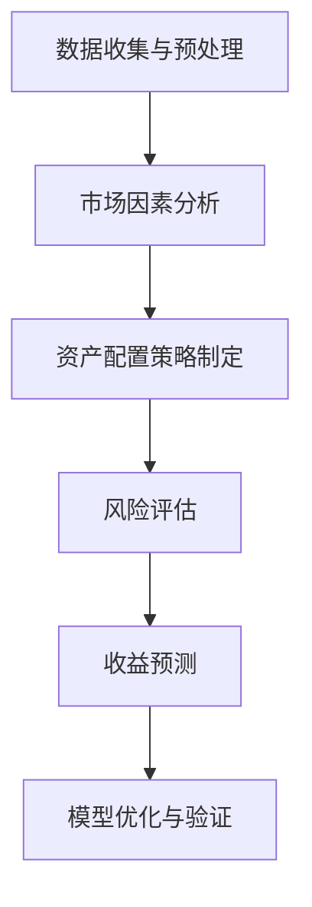
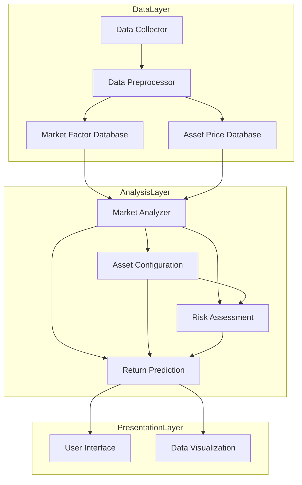
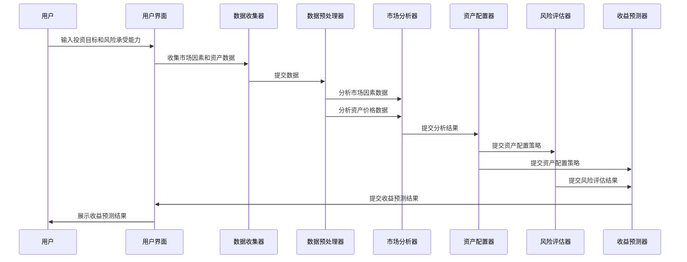

                 

### 第1章 问题背景

#### 1.1 投资回报预测的重要性

投资回报预测在金融领域扮演着至关重要的角色。它不仅能够帮助投资者做出更为明智的投资决策，还可以为金融机构提供宝贵的战略指导。在资本市场中，准确预测投资回报能够显著降低风险，提高收益，进而提升整体投资组合的表现。

首先，投资回报预测对于投资者来说尤为重要。每一个投资者都希望通过合理的资产配置，实现资产的增值。然而，市场的波动性使得投资回报预测成为一个充满挑战的任务。投资者需要了解不同资产类别的历史表现、市场趋势以及潜在风险，以此来预测未来的回报。准确的投资回报预测可以帮助投资者在市场低谷时保持冷静，抓住市场高峰时的机会，从而实现资产的长期增长。

其次，投资回报预测对于金融机构也至关重要。金融机构需要通过预测投资回报来制定投资策略，优化资产配置，确保其投资组合的稳定性和盈利能力。此外，金融机构还需要向客户披露投资预期回报，以吸引更多的投资者。如果预测结果不准确，可能会导致投资者对金融机构失去信任，进而影响其业务发展。

#### 1.2 现有投资回报预测方法的局限

尽管投资回报预测的重要性不言而喻，但现有的预测方法仍存在一些局限。传统的投资回报预测方法主要包括历史数据分析、市场趋势分析和技术指标分析等。这些方法在一定程度上能够提供投资回报的预测，但往往存在以下问题：

1. **历史数据依赖**：许多预测方法依赖于历史数据，试图通过分析历史数据来预测未来。然而，市场环境是不断变化的，历史数据并不总能准确反映未来情况。

2. **市场趋势识别困难**：市场趋势的识别是一个复杂的问题，尤其在全球经济波动、政策变化等因素的影响下，市场趋势难以准确判断。

3. **技术指标局限性**：技术指标分析虽然在一定程度上能够提供市场动态的信息，但它们往往是基于假设条件，如市场是有效的或价格包含所有信息等。这些假设在某些市场环境下可能并不成立。

4. **风险模型简化**：现有的风险模型通常较为简化，可能无法全面考虑投资组合中的各种风险因素，如信用风险、市场风险、流动性风险等。

#### 1.3 约翰·伯格的贡献

约翰·伯格（John Bogle）是投资领域的重要人物，他不仅创立了先锋基金（Vanguard），还为投资回报预测提供了新的视角。他的贡献主要体现在以下几个方面：

1. **指数基金的理念**：伯格提出了指数基金的理念，认为长期来看，指数基金能够提供与市场平均回报相当的投资回报。这一理念挑战了传统投资策略，促使投资者更多地关注市场整体表现而非个别股票。

2. **风险收益模型**：伯格提出了基于风险收益的投资模型，认为投资者的首要任务是管理风险，而不是单纯追求高收益。这一模型为投资回报预测提供了新的思路。

3. **长期视角**：伯格强调长期投资的重要性，认为短期市场波动是难以预测的，投资者应专注于长期投资回报。这一观点为投资者提供了一种更为稳健的投资策略。

伯格的投资理念和方法对投资回报预测领域产生了深远影响，为投资者提供了更加科学和可行的预测工具。在接下来的章节中，我们将进一步探讨伯格的长期投资回报预测模型的原理和实现方法。### 1.3 约翰·伯格的贡献

约翰·伯格（John Bogle）是投资领域的重要人物，他不仅创立了先锋基金（Vanguard），还为投资回报预测提供了新的视角。他的贡献主要体现在以下几个方面：

1. **指数基金的理念**：伯格提出了指数基金的理念，认为长期来看，指数基金能够提供与市场平均回报相当的投资回报。这一理念挑战了传统投资策略，促使投资者更多地关注市场整体表现而非个别股票。指数基金通过跟踪某个市场指数（如标普500指数）来投资，实现了市场的平均回报，避免了选择个股带来的风险和成本。这一理念的提出，使得投资回报预测变得更加简单和可预测，因为市场整体趋势在很大程度上决定了投资回报。

2. **风险收益模型**：伯格提出了基于风险收益的投资模型，认为投资者的首要任务是管理风险，而不是单纯追求高收益。这一模型为投资回报预测提供了新的思路。风险收益模型强调，投资者应根据自身的风险承受能力来选择合适的投资组合，而不是盲目追求高风险高收益。通过合理配置资产，投资者可以在接受可承受风险的前提下，实现稳定的投资回报。

3. **长期视角**：伯格强调长期投资的重要性，认为短期市场波动是难以预测的，投资者应专注于长期投资回报。这一观点为投资者提供了一种更为稳健的投资策略。长期投资能够有效降低短期市场波动对投资回报的影响，让投资者能够更好地应对市场的不确定性。此外，长期投资还能够平滑收益曲线，使得投资回报更加稳定和可预测。

伯格的投资理念和方法对投资回报预测领域产生了深远影响，为投资者提供了更加科学和可行的预测工具。在接下来的章节中，我们将深入探讨伯格的长期投资回报预测模型的原理和实现方法。### 2.1 长期投资回报预测模型

长期投资回报预测模型是约翰·伯格（John Bogle）提出的一种基于风险收益分析的模型，旨在为投资者提供长期的、稳健的投资回报预测。这个模型的核心思想是，通过科学的方法来分析市场的风险与收益，从而制定出合理的投资策略，实现长期资产的增值。

#### 2.1.1 模型定义

长期投资回报预测模型可以定义为一个多因素、多层次的预测系统。它包括以下几个主要组成部分：

1. **市场因素分析**：对市场的整体情况进行深入分析，包括宏观经济指标、政策变化、行业发展等，这些因素将对市场产生长期影响。

2. **资产配置策略**：根据投资者的风险承受能力和投资目标，制定资产配置策略。资产配置策略包括各类资产的权重分配，如股票、债券、现金等。

3. **风险评估模型**：对投资组合中的各类资产进行风险评估，包括市场风险、信用风险、流动性风险等，以便制定有效的风险管理策略。

4. **收益预测模型**：结合市场因素分析和风险评估模型，预测各类资产的长期回报，进而预测整个投资组合的回报。

#### 2.1.2 模型组成部分

长期投资回报预测模型由以下几个主要部分组成：

1. **市场因素数据库**：收集并整理各种市场因素的数据，如宏观经济指标、政策变化、行业数据等。这些数据将用于市场因素分析。

2. **资产价格数据库**：收集并整理各类资产的价格数据，包括股票、债券、房地产等。这些数据将用于资产配置策略和风险评估模型。

3. **风险模型**：构建一个多层次的评估模型，对投资组合中的各类资产进行风险评估。风险模型将考虑市场风险、信用风险、流动性风险等多种因素。

4. **收益预测模型**：结合市场因素和风险模型，预测各类资产的长期回报，并据此预测整个投资组合的回报。

#### 2.1.3 模型与相关投资理论的联系

长期投资回报预测模型与多个投资理论有着密切的联系：

1. **有效市场假说（EMH）**：有效市场假说认为，市场价格已经充分反映了所有可用信息，因此无法通过技术分析或市场趋势分析来获得超额收益。然而，长期投资回报预测模型通过分析市场因素和资产价格，试图找到潜在的长期投资机会。

2. **资本资产定价模型（CAPM）**：资本资产定价模型是评估资产风险和预期收益的经典模型。长期投资回报预测模型中的风险模型部分借鉴了CAPM的思想，通过评估资产的市场风险来预测回报。

3. **资产配置理论**：资产配置理论强调，通过合理配置资产来优化投资组合的风险收益结构。长期投资回报预测模型中的资产配置策略正是基于这一理论，旨在制定最优的资产配置方案。

4. **行为金融学**：行为金融学研究表明，投资者的行为偏差会影响市场波动和资产价格。长期投资回报预测模型在分析市场因素时，也会考虑投资者的行为因素，以提高预测的准确性。

综上所述，长期投资回报预测模型是一种综合性的投资预测工具，它结合了多种投资理论，通过科学的方法对市场的风险与收益进行分析，为投资者提供长期的投资回报预测。在接下来的章节中，我们将深入探讨这个模型的算法原理和实现方法。### 2.2 模型组成与核心要素

#### 2.2.1 模型组成

约翰·伯格的长期投资回报预测模型是一个多层次、多维度的预测系统，其组成要素如下：

1. **市场因素分析模块**：该模块负责分析影响市场的各种因素，如宏观经济指标（如GDP增长率、通货膨胀率、利率等）、政策变化（如税收政策、监管政策等）、行业发展（如技术创新、市场需求变化等）。这些因素通过量化分析，将被输入到模型中，作为预测的重要依据。

2. **资产价格分析模块**：该模块负责分析各类资产的价格变化，如股票、债券、房地产等。通过历史价格数据和相关性分析，可以评估不同资产的市场表现和潜在风险。

3. **资产配置策略模块**：该模块基于投资者的风险承受能力和投资目标，制定合理的资产配置策略。资产配置策略包括确定各类资产的权重分配，以达到最优的投资组合。

4. **风险评估模块**：该模块负责评估投资组合中的各类资产风险，包括市场风险（如价格波动风险）、信用风险（如违约风险）、流动性风险（如资金周转风险）等。通过风险评估，可以确定各类资产的风险水平和潜在损失。

5. **收益预测模块**：该模块结合市场因素分析和风险评估结果，预测各类资产的长期回报。通过加权计算，可以得出整个投资组合的预期回报。

#### 2.2.2 核心要素

长期投资回报预测模型的核心要素包括以下几个方面：

1. **市场因素**：市场因素是影响投资回报的关键因素，如宏观经济指标、政策变化、行业发展等。这些因素通过量化分析，将被输入到模型中，作为预测的重要依据。

2. **资产价格**：资产价格是投资回报的直接体现，通过历史价格数据和相关性分析，可以评估不同资产的市场表现和潜在风险。

3. **资产配置策略**：资产配置策略是决定投资组合风险收益结构的关键，根据投资者的风险承受能力和投资目标，制定合理的资产配置策略。

4. **风险评估**：风险评估是投资决策的重要依据，通过评估投资组合中的各类资产风险，可以确定各类资产的风险水平和潜在损失。

5. **收益预测**：收益预测是模型的核心输出，通过结合市场因素分析和风险评估结果，可以预测各类资产的长期回报。

#### 2.2.3 模型与相关投资理论的联系

长期投资回报预测模型与多个投资理论有着密切的联系：

1. **有效市场假说（EMH）**：有效市场假说认为，市场价格已经充分反映了所有可用信息，因此无法通过技术分析或市场趋势分析来获得超额收益。然而，模型通过分析市场因素和资产价格，试图找到潜在的长期投资机会。

2. **资本资产定价模型（CAPM）**：资本资产定价模型是评估资产风险和预期收益的经典模型。模型中的风险评估模块借鉴了CAPM的思想，通过评估资产的市场风险来预测回报。

3. **资产配置理论**：资产配置理论强调，通过合理配置资产来优化投资组合的风险收益结构。模型中的资产配置策略模块正是基于这一理论，旨在制定最优的资产配置方案。

4. **行为金融学**：行为金融学研究表明，投资者的行为偏差会影响市场波动和资产价格。模型在分析市场因素时，也会考虑投资者的行为因素，以提高预测的准确性。

综上所述，长期投资回报预测模型是一个综合性的投资预测工具，通过科学的方法分析市场的风险与收益，为投资者提供长期的投资回报预测。在接下来的章节中，我们将深入探讨这个模型的算法原理和实现方法。### 2.3 模型与相关投资理论的联系

#### 2.3.1 有效市场假说（EMH）

有效市场假说（EMH）认为，市场价格已经充分反映了所有可用信息，因此无法通过技术分析或市场趋势分析来获得超额收益。这一理论在长期投资回报预测模型中具有重要地位，因为模型旨在分析市场因素和资产价格，寻找潜在的长期投资机会。

虽然EMH假设市场价格是信息有效的，但长期投资回报预测模型并不否认市场中存在一些未被充分利用的信息。模型通过量化分析市场因素，如宏观经济指标、政策变化、行业发展等，试图发现市场趋势和潜在的投资机会。这些因素虽然不能保证超额收益，但可以提供对市场动态的深入了解，帮助投资者做出更为明智的投资决策。

#### 2.3.2 资本资产定价模型（CAPM）

资本资产定价模型（CAPM）是评估资产风险和预期收益的经典模型。CAPM的基本思想是，资产的风险与其预期收益之间存在正相关关系，即高风险资产应该有更高的预期收益。

长期投资回报预测模型中的风险评估模块借鉴了CAPM的思想。通过评估资产的市场风险，模型可以确定各类资产的风险水平和潜在损失。具体来说，模型使用β系数（beta coefficient）来衡量资产的市场风险，即资产收益与市场收益的相关性。β系数越高，资产的市场风险越大。

以下是一个简单的CAPM公式：

\[ E(R_i) = R_f + \beta_i \times (E(R_m) - R_f) \]

其中，\( E(R_i) \) 是资产 \( i \) 的预期收益，\( R_f \) 是无风险收益率，\( E(R_m) \) 是市场预期收益，\( \beta_i \) 是资产 \( i \) 的β系数。

#### 2.3.3 资产配置理论

资产配置理论强调，通过合理配置资产来优化投资组合的风险收益结构。这一理论在长期投资回报预测模型中占有重要地位，因为模型的最终目标是制定最优的资产配置策略。

资产配置理论的基本原则是，根据投资者的风险承受能力和投资目标，确定各类资产的权重分配。例如，如果投资者希望降低风险，可以选择更高的债券比例和更低的股票比例；如果投资者希望追求更高的收益，可以选择更高的股票比例和更低的债券比例。

长期投资回报预测模型中的资产配置策略模块通过以下步骤来实现：

1. **确定投资者风险承受能力**：通过问卷调查、财务分析等方法，了解投资者的风险承受能力。

2. **制定投资目标**：根据投资者的风险承受能力，制定具体的投资目标，如资产增值、资本保全、收入稳定等。

3. **资产选择**：选择合适的资产类别，如股票、债券、房地产等。

4. **资产权重分配**：根据投资目标和资产特性，确定各类资产的权重分配。

5. **调整资产配置**：定期评估资产配置的效果，根据市场变化和投资者需求，及时调整资产配置。

#### 2.3.4 行为金融学

行为金融学研究表明，投资者的行为偏差会影响市场波动和资产价格。这些行为偏差包括过度自信、恐慌性卖出、跟风行为等。长期投资回报预测模型在分析市场因素时，也会考虑这些行为因素，以提高预测的准确性。

例如，当市场出现恐慌性抛售时，资产价格可能会大幅下跌，但这并不意味着资产的实际价值已经下降。在这种情况下，长期投资回报预测模型可能会建议投资者保持冷静，不要盲目跟风，以免错失长期投资机会。

综上所述，长期投资回报预测模型与多种投资理论有着密切的联系。通过结合有效市场假说、资本资产定价模型、资产配置理论和行为金融学等理论，模型可以为投资者提供科学、可行的长期投资回报预测。在接下来的章节中，我们将深入探讨模型的具体算法原理和实现方法。### 第3章 算法原理概述

#### 3.1 算法理论基础

约翰·伯格的长期投资回报预测模型基于多个金融理论和数学模型，其中最为核心的是资本资产定价模型（CAPM）和资产配置理论。CAPM提供了评估资产风险和预期收益的基本框架，而资产配置理论则帮助投资者根据风险承受能力和投资目标，制定合理的资产配置策略。

1. **资本资产定价模型（CAPM）**：
   CAPM是评估资产风险和预期收益的经典模型。其基本公式为：
   \[ E(R_i) = R_f + \beta_i \times (E(R_m) - R_f) \]
   其中，\( E(R_i) \) 是资产 \( i \) 的预期收益，\( R_f \) 是无风险收益率，\( E(R_m) \) 是市场预期收益，\( \beta_i \) 是资产 \( i \) 的β系数。β系数衡量了资产相对于市场的波动性，即资产收益与市场收益的相关性。

2. **资产配置理论**：
   资产配置理论强调，通过合理配置资产来优化投资组合的风险收益结构。其核心原则是，根据投资者的风险承受能力和投资目标，确定各类资产的权重分配。资产配置的目标是在接受可承受风险的前提下，实现最大的投资回报。

#### 3.2 算法主要步骤

长期投资回报预测模型的算法主要分为以下几个步骤：

1. **数据收集与预处理**：
   收集宏观经济指标、政策变化、行业发展等市场因素数据，以及各类资产的价格数据。对数据进行清洗和预处理，包括缺失值填充、异常值处理等，确保数据质量。

2. **市场因素分析**：
   通过统计分析方法，分析市场因素与资产价格之间的关系，如相关性分析和回归分析。识别出对资产价格影响较大的市场因素，并将这些因素作为模型输入。

3. **资产配置策略制定**：
   根据投资者的风险承受能力和投资目标，制定合理的资产配置策略。这一步骤包括确定各类资产的权重分配，如股票、债券、现金等。

4. **风险评估**：
   使用CAPM和其他风险评估方法，评估投资组合中各类资产的风险。计算各类资产的β系数，评估市场风险、信用风险和流动性风险等。

5. **收益预测**：
   结合市场因素分析和风险评估结果，预测各类资产的长期回报。通过加权计算，得出整个投资组合的预期回报。

6. **模型优化与验证**：
   通过历史数据进行模型优化，调整模型参数，提高预测准确性。使用交叉验证方法，验证模型的预测性能，确保其适用于不同市场环境。

#### 3.3 算法特点与优势

长期投资回报预测模型具有以下特点与优势：

1. **综合性**：
   模型结合了多个金融理论和数学模型，提供了一个全面的投资回报预测框架。

2. **科学性**：
   模型基于严谨的数学和统计学方法，通过数据分析和风险评估，提供科学的投资回报预测。

3. **灵活性**：
   模型可以根据投资者的风险承受能力和投资目标，灵活调整资产配置策略。

4. **实用性**：
   模型易于实现和应用，可以用于实际投资决策，帮助投资者制定长期投资策略。

5. **可靠性**：
   模型通过历史数据验证和交叉验证，确保预测结果的可靠性和适用性。

通过以上算法原理概述，我们可以看到，约翰·伯格的长期投资回报预测模型是一个综合性的、科学的、灵活的、实用的和可靠的工具，为投资者提供了长期的投资回报预测。在接下来的章节中，我们将深入探讨算法的数学模型和具体实现方法。### 第4章 算法mermaid流程图

为了更好地理解约翰·伯格的长期投资回报预测模型，我们可以使用mermaid流程图来描述算法的各个步骤。mermaid是一种基于Markdown的图形语言，可以方便地绘制流程图、类图和序列图等。

#### 4.1 流程图绘制

以下是一个简单的mermaid流程图，描述了长期投资回报预测模型的主要步骤：



这个流程图分为以下几个步骤：

1. **数据收集与预处理**：收集并清洗市场因素和资产价格数据。
2. **市场因素分析**：分析市场因素与资产价格之间的关系。
3. **资产配置策略制定**：根据分析结果，制定合理的资产配置策略。
4. **风险评估**：评估投资组合中各类资产的风险。
5. **收益预测**：结合市场因素和风险评估结果，预测长期投资回报。
6. **模型优化与验证**：通过历史数据和交叉验证，优化模型参数，验证预测性能。

#### 4.2 流程图解读

现在，让我们详细解读这个mermaid流程图：

1. **数据收集与预处理**：
   - **输入**：市场因素数据（如GDP增长率、通货膨胀率、政策变化等）和资产价格数据（如股票、债券价格等）。
   - **处理**：数据清洗和预处理，包括缺失值填充、异常值处理、数据标准化等。
   - **输出**：干净、标准化的市场因素数据和资产价格数据。

2. **市场因素分析**：
   - **输入**：预处理后的市场因素数据和资产价格数据。
   - **处理**：相关性分析、回归分析等统计方法，识别市场因素与资产价格之间的关系。
   - **输出**：市场因素与资产价格的关系矩阵，用于指导资产配置策略。

3. **资产配置策略制定**：
   - **输入**：市场因素分析结果和投资者的风险承受能力。
   - **处理**：根据投资者目标和风险偏好，制定合理的资产配置策略。
   - **输出**：资产配置策略，包括各类资产的权重分配。

4. **风险评估**：
   - **输入**：资产配置策略和市场因素分析结果。
   - **处理**：使用CAPM和其他风险评估方法，计算各类资产的风险。
   - **输出**：各类资产的风险评估报告，包括市场风险、信用风险、流动性风险等。

5. **收益预测**：
   - **输入**：市场因素分析结果、风险评估报告和资产配置策略。
   - **处理**：预测各类资产的长期回报，并计算整个投资组合的预期回报。
   - **输出**：长期投资回报预测报告。

6. **模型优化与验证**：
   - **输入**：历史数据和预测结果。
   - **处理**：通过交叉验证和模型优化，调整模型参数，提高预测准确性。
   - **输出**：优化后的模型参数和验证结果。

通过这个mermaid流程图，我们可以清晰地看到长期投资回报预测模型的各个步骤及其相互关系。在接下来的章节中，我们将进一步深入探讨每个步骤的详细实现方法和具体算法。### 第5章 算法原理详细讲解

#### 5.1 数学模型

约翰·伯格的长期投资回报预测模型基于多个数学模型，其中最为核心的是资本资产定价模型（CAPM）和资产配置模型。以下是对这两个模型及其相关数学公式的详细讲解。

1. **资本资产定价模型（CAPM）**

CAPM是评估资产风险和预期收益的经典模型。其基本公式为：

\[ E(R_i) = R_f + \beta_i \times (E(R_m) - R_f) \]

其中，\( E(R_i) \) 是资产 \( i \) 的预期收益，\( R_f \) 是无风险收益率，\( E(R_m) \) 是市场预期收益，\( \beta_i \) 是资产 \( i \) 的β系数。

- \( E(R_i) \)：资产 \( i \) 的预期收益，是投资者期望从资产 \( i \) 中获得的平均回报。
- \( R_f \)：无风险收益率，通常是指国债或其他低风险资产的收益率。
- \( E(R_m) \)：市场预期收益，是整个市场（如股票市场）的平均回报。
- \( \beta_i \)：资产 \( i \) 的β系数，衡量资产 \( i \) 的收益与市场收益的相关性，即资产 \( i \) 的风险相对于市场的波动性。

2. **资产配置模型**

资产配置模型旨在根据投资者的风险承受能力和投资目标，制定合理的资产配置策略。其核心思想是通过确定各类资产的权重分配，来优化投资组合的风险收益结构。

假设投资者有 \( N \) 种资产，其预期收益分别为 \( E(R_1), E(R_2), ..., E(R_N) \)，权重分别为 \( w_1, w_2, ..., w_N \)。资产配置模型的目标是选择最优的权重分配，使得投资组合的预期收益最大化或风险最小化。

一个简单的资产配置模型公式为：

\[ E(R_{total}) = \sum_{i=1}^{N} w_i \times E(R_i) \]

其中，\( E(R_{total}) \) 是投资组合的预期收益。

为了最小化风险，可以采用以下目标函数：

\[ \min \sigma^2_{total} = \sum_{i=1}^{N} w_i^2 \times \sigma_i^2 + 2 \times \sum_{i=1}^{N} \sum_{j=i+1}^{N} w_i \times w_j \times \rho_{ij} \]

其中，\( \sigma_i^2 \) 是资产 \( i \) 的方差，\( \rho_{ij} \) 是资产 \( i \) 和资产 \( j \) 的相关系数。

- \( w_i \)：资产 \( i \) 的权重。
- \( \sigma_i^2 \)：资产 \( i \) 的方差，衡量资产 \( i \) 的波动性。
- \( \rho_{ij} \)：资产 \( i \) 和资产 \( j \) 的相关系数，衡量资产 \( i \) 和资产 \( j \) 的收益变化之间的相关性。

#### 5.2 数学公式

以下是模型中的一些关键数学公式及其解释：

1. **市场预期收益公式**

\[ E(R_m) = \frac{1}{N} \sum_{i=1}^{N} E(R_i) \]

市场预期收益是所有资产预期收益的平均值。

2. **β系数计算公式**

\[ \beta_i = \frac{\text{Cov}(R_i, R_m)}{\text{Var}(R_m)} \]

其中，\( \text{Cov}(R_i, R_m) \) 是资产 \( i \) 和市场收益之间的协方差，\( \text{Var}(R_m) \) 是市场收益的方差。

3. **资产权重优化公式**

\[ w^* = \arg \min \sigma^2_{total} \]

其中，\( w^* \) 是最优权重分配。

4. **投资组合预期收益公式**

\[ E(R_{total}) = \sum_{i=1}^{N} w_i \times E(R_i) \]

投资组合的预期收益是各资产预期收益的加权平均。

5. **投资组合风险公式**

\[ \sigma_{total} = \sqrt{\sum_{i=1}^{N} w_i^2 \times \sigma_i^2 + 2 \times \sum_{i=1}^{N} \sum_{j=i+1}^{N} w_i \times w_j \times \rho_{ij}} \]

投资组合的风险是各资产波动性和相关性的加权平均。

#### 5.3 举例说明

为了更好地理解这些数学公式，我们来看一个简单的例子。

假设有一个投资组合，包括股票A、股票B和债券，其预期收益分别为 \( E(R_A) = 0.10 \)，\( E(R_B) = 0.12 \)，\( E(R_C) = 0.05 \)，权重分别为 \( w_A = 0.50 \)，\( w_B = 0.30 \)，\( w_C = 0.20 \)。无风险收益率为 \( R_f = 0.03 \)。

1. **市场预期收益**

\[ E(R_m) = \frac{1}{3} (0.10 + 0.12 + 0.05) = 0.085 \]

2. **股票A的β系数**

\[ \beta_A = \frac{\text{Cov}(R_A, R_m)}{\text{Var}(R_m)} \]

假设协方差 \( \text{Cov}(R_A, R_m) = 0.0025 \)，市场收益方差 \( \text{Var}(R_m) = 0.01 \)，则

\[ \beta_A = \frac{0.0025}{0.01} = 0.25 \]

3. **投资组合预期收益**

\[ E(R_{total}) = 0.50 \times 0.10 + 0.30 \times 0.12 + 0.20 \times 0.05 = 0.085 \]

4. **投资组合风险**

假设各资产的方差分别为 \( \sigma_A^2 = 0.006 \)，\( \sigma_B^2 = 0.008 \)，\( \sigma_C^2 = 0.002 \)，相关系数分别为 \( \rho_{AB} = 0.6 \)，\( \rho_{AC} = 0.4 \)，\( \rho_{BC} = 0.5 \)，则

\[ \sigma_{total} = \sqrt{0.50^2 \times 0.006 + 0.30^2 \times 0.008 + 0.20^2 \times 0.002 + 2 \times (0.50 \times 0.30 \times 0.6 + 0.50 \times 0.20 \times 0.4 + 0.30 \times 0.20 \times 0.5)} \]

\[ \sigma_{total} = \sqrt{0.0009 + 0.00072 + 0.0004 + 0.009} = 0.0149 \]

通过这个例子，我们可以看到如何使用数学公式计算市场预期收益、β系数、投资组合预期收益和投资组合风险。这些计算步骤为约翰·伯格的长期投资回报预测模型提供了坚实的理论基础。在接下来的章节中，我们将进一步探讨模型的实现方法。### 第6章 问题场景介绍

#### 6.1 投资场景描述

为了更好地理解约翰·伯格的长期投资回报预测模型，我们将构建一个具体的投资场景。假设有一位投资者，名叫张先生，他计划在未来5年内进行投资，目标是实现资产的稳健增值，同时保持投资组合的适度风险。

张先生的投资场景如下：

1. **投资目标**：实现5年内的资产增值，预期年化回报率为10%。
2. **风险承受能力**：张先生愿意接受一定的市场波动，但希望投资组合的整体风险保持在中等水平。
3. **资产类别**：张先生计划将资金分配到股票、债券和现金等不同资产类别中，具体权重分配如下：
   - 股票：60%
   - 债券：30%
   - 现金：10%
4. **市场环境**：当前市场处于复苏阶段，经济增长稳定，政策环境较为友好。然而，全球经济形势仍存在不确定性，如国际贸易摩擦、政策变化等可能导致市场波动。

#### 6.2 系统需求分析

为了满足张先生的投资目标和风险承受能力，我们需要设计一个能够实现以下需求的系统：

1. **数据收集与处理**：
   - 收集宏观经济指标、政策变化、行业发展等市场因素数据。
   - 收集各类资产的历史价格数据，如股票、债券、房地产等。
   - 对数据进行清洗、预处理，确保数据质量。

2. **市场因素分析**：
   - 分析市场因素与资产价格之间的关系，识别影响投资回报的关键因素。
   - 建立市场因素与资产价格之间的量化模型，用于预测未来市场动态。

3. **资产配置策略制定**：
   - 根据投资者的风险承受能力和投资目标，制定合理的资产配置策略。
   - 考虑各类资产的预期收益和风险，优化投资组合的风险收益结构。

4. **风险评估**：
   - 对投资组合中的各类资产进行风险评估，包括市场风险、信用风险、流动性风险等。
   - 计算各类资产的β系数，评估市场风险对投资组合的影响。

5. **收益预测**：
   - 结合市场因素分析和风险评估结果，预测各类资产的长期回报。
   - 计算整个投资组合的预期回报，评估投资目标是否能够实现。

6. **模型优化与验证**：
   - 通过历史数据进行模型优化，调整模型参数，提高预测准确性。
   - 使用交叉验证方法，验证模型的预测性能，确保其适用于不同市场环境。

通过上述系统需求分析，我们可以看到，约翰·伯格的长期投资回报预测模型需要实现多个功能模块，包括数据收集与处理、市场因素分析、资产配置策略制定、风险评估、收益预测和模型优化与验证等。在接下来的章节中，我们将详细探讨这些功能模块的实现方法和具体步骤。### 第7章 系统功能设计

#### 7.1 领域模型mermaid类图

为了更好地理解系统的功能设计，我们可以使用mermaid类图来描述系统的领域模型。以下是一个简单的mermaid类图示例，描述了系统的主要类及其关系：

```mermaid
classDiagram
    Client <<interface>> InvestmentClient
    Portfolio <<interface>> InvestmentPortfolio
    Asset <<interface>> FinancialAsset
    Stock <<class>> StockAsset
    Bond <<class>> BondAsset
    Cash <<class>> CashAsset
    MarketFactor <<class>> MarketFactor
    RiskModel <<class>> RiskModel
    ReturnModel <<class>> ReturnModel
    DataCollector <<class>> DataCollector
    DataPreprocessor <<class>> DataPreprocessor
    Analyzer <<class>> MarketAnalyzer
    Config <<class>> Configuration

    Client o-- Portfolio
    Portfolio o-- Asset
    Asset o-- StockAsset
    Asset o-- BondAsset
    Asset o-- CashAsset
    Portfolio o-- MarketFactor
    Portfolio o-- RiskModel
    Portfolio o-- ReturnModel
    DataCollector o-- DataPreprocessor
    Analyzer o-- DataPreprocessor
    Analyzer o-- MarketFactor
    Analyzer o-- RiskModel
    Analyzer o-- ReturnModel
    Config o-- DataCollector
    Config o-- Analyzer

    class InvestmentClient {
        +string name
        +float risk_tolerance
        +float target_return
    }

    class InvestmentPortfolio {
        +List<FinancialAsset> assets
        +Map<MarketFactor, float> factors
        +RiskModel risk_model
        +ReturnModel return_model
    }

    class FinancialAsset {
        +string type
        +float weight
        +float expected_return
        +float risk
    }

    class StockAsset extends FinancialAsset {
        +string stock_id
    }

    class BondAsset extends FinancialAsset {
        +string bond_id
    }

    class CashAsset extends FinancialAsset {
        +string currency
    }

    class MarketFactor {
        +string name
        +float value
    }

    class RiskModel {
        +float beta
        +float market_risk
        +float credit_risk
        +float liquidity_risk
    }

    class ReturnModel {
        +float expected_return
        +float risk_adjusted_return
    }

    class DataCollector {
        +List<MarketFactor> collect_market_factors()
        +List<FinancialAsset> collect_assets()
    }

    class DataPreprocessor {
        +void preprocess_market_factors(List<MarketFactor> factors)
        +void preprocess_assets(List<FinancialAsset> assets)
    }

    class MarketAnalyzer {
        +void analyze_market_factors(List<MarketFactor> factors)
        +void analyze_assets(List<FinancialAsset> assets)
    }

    class Configuration {
        +void set_data_collection_frequency(int frequency)
        +void set_model_optimization_period(int period)
    }
```

这个mermaid类图展示了系统的核心类及其关系。主要类包括`InvestmentClient`（投资者对象）、`InvestmentPortfolio`（投资组合对象）、`FinancialAsset`（资产对象）、`StockAsset`、`BondAsset`和`CashAsset`（具体资产类）、`MarketFactor`（市场因素对象）、`RiskModel`（风险评估模型对象）、`ReturnModel`（收益预测模型对象）、`DataCollector`（数据收集器对象）、`DataPreprocessor`（数据预处理对象）和`MarketAnalyzer`（市场分析器对象）。

- `InvestmentClient`：代表投资者对象，包括姓名、风险承受能力和投资目标等信息。
- `InvestmentPortfolio`：代表投资组合对象，包括资产列表、市场因素映射、风险评估模型和收益预测模型等。
- `FinancialAsset`：代表资产对象，包括资产类型、权重、预期收益和风险等信息。
- `StockAsset`、`BondAsset`和`CashAsset`：具体资产类，继承自`FinancialAsset`，包括股票、债券和现金等资产的具体信息。
- `MarketFactor`：代表市场因素对象，包括市场因素名称和值等信息。
- `RiskModel`：代表风险评估模型对象，包括β系数、市场风险、信用风险和流动性风险等信息。
- `ReturnModel`：代表收益预测模型对象，包括预期收益和调整后收益等信息。
- `DataCollector`：代表数据收集器对象，用于收集市场因素数据和资产数据。
- `DataPreprocessor`：代表数据预处理对象，用于预处理收集到的数据。
- `MarketAnalyzer`：代表市场分析器对象，用于分析市场因素和资产数据。

通过这个mermaid类图，我们可以清晰地看到系统的功能架构和类之间的关系，为后续的系统实现提供了明确的指导。

#### 7.2 系统功能模块划分

根据领域模型的设计，我们可以将系统划分为多个功能模块，每个模块负责实现特定的功能。以下是系统的主要功能模块及其简要描述：

1. **数据收集模块**：
   - 功能：负责收集市场因素数据和资产数据。
   - 实现：使用`DataCollector`类实现，通过接口方法`collect_market_factors()`和`collect_assets()`收集数据。

2. **数据预处理模块**：
   - 功能：负责对收集到的数据进行分析和预处理，如缺失值填充、异常值处理、数据标准化等。
   - 实现：使用`DataPreprocessor`类实现，通过接口方法`preprocess_market_factors()`和`preprocess_assets()`预处理数据。

3. **市场分析模块**：
   - 功能：负责分析市场因素和资产数据，识别影响投资回报的关键因素。
   - 实现：使用`MarketAnalyzer`类实现，通过接口方法`analyze_market_factors()`和`analyze_assets()`进行分析。

4. **资产配置模块**：
   - 功能：根据投资者的风险承受能力和投资目标，制定合理的资产配置策略。
   - 实现：在`InvestmentPortfolio`类中实现，通过权重分配方法设置各类资产的权重。

5. **风险评估模块**：
   - 功能：对投资组合中的各类资产进行风险评估，包括市场风险、信用风险和流动性风险等。
   - 实现：使用`RiskModel`类实现，通过计算β系数和相关风险评估指标，评估资产风险。

6. **收益预测模块**：
   - 功能：结合市场因素分析和风险评估结果，预测各类资产的长期回报。
   - 实现：使用`ReturnModel`类实现，通过计算预期收益和调整后收益，预测投资组合的回报。

7. **系统配置模块**：
   - 功能：负责系统参数配置，如数据收集频率、模型优化周期等。
   - 实现：使用`Configuration`类实现，通过接口方法设置和获取系统配置参数。

通过上述功能模块的划分，我们可以清晰地看到系统各部分的功能职责，为后续的系统实现和模块化设计提供了明确的指导。每个模块都独立实现，可以方便地维护和扩展。在接下来的章节中，我们将详细探讨各个功能模块的具体实现方法和步骤。### 第8章 系统架构设计

#### 8.1 系统架构mermaid架构图

为了展示系统的整体架构和模块间的关系，我们可以使用mermaid架构图来描述。以下是一个简单的mermaid架构图示例：



这个mermaid架构图分为三个主要层次：数据层、分析层和展示层。

1. **数据层**：
   - **数据收集器（D1）**：负责收集市场因素和资产价格数据。
   - **数据预处理器（D2）**：负责对收集到的数据进行预处理，如缺失值填充、异常值处理、数据标准化等。
   - **市场因素数据库（D3）**：存储预处理后的市场因素数据。
   - **资产价格数据库（D4）**：存储预处理后的资产价格数据。

2. **分析层**：
   - **市场分析器（A1）**：负责分析市场因素和资产价格数据，识别关键因素。
   - **资产配置器（A2）**：根据分析结果，制定资产配置策略。
   - **风险评估器（A3）**：评估投资组合中各类资产的风险。
   - **收益预测器（A4）**：结合市场因素和风险评估结果，预测长期投资回报。

3. **展示层**：
   - **用户界面（P1）**：提供用户操作界面，展示投资回报预测结果。
   - **数据可视化（P2）**：提供数据可视化工具，帮助用户更直观地理解分析结果。

#### 8.2 架构设计思路

系统架构的设计思路如下：

1. **模块化设计**：将系统划分为多个独立的功能模块，如数据收集模块、数据预处理模块、市场分析模块、资产配置模块、风险评估模块和收益预测模块等。这种模块化设计有助于提高系统的可维护性和扩展性。

2. **层次化设计**：系统分为数据层、分析层和展示层，各层之间相互独立，但又紧密联系。数据层负责数据的收集和处理，分析层负责对数据进行分析和预测，展示层负责将分析结果展示给用户。

3. **数据驱动**：系统以数据为核心，通过数据收集、预处理、分析和预测，实现投资回报预测。这种数据驱动的设计思路有助于确保系统的高效性和准确性。

4. **用户友好**：展示层提供用户界面和数据可视化工具，使得用户能够方便地操作系统和理解分析结果。用户界面和数据可视化工具的设计应符合用户习惯，以提高用户满意度。

5. **可扩展性**：系统设计应考虑未来的扩展性，如添加新的市场因素、资产类别或预测模型等。通过模块化和层次化设计，系统可以方便地添加新模块或修改现有模块，以适应不断变化的市场需求。

通过以上架构设计思路，我们可以构建一个高效、可靠和易用的长期投资回报预测系统。在接下来的章节中，我们将详细探讨系统各模块的实现方法和技术细节。### 第9章 系统接口设计

#### 9.1 接口设计原则

在系统接口设计中，遵循以下原则可以确保接口的易用性、稳定性和安全性：

1. **简洁性**：接口设计应简洁明了，避免过多的复杂性和冗余功能，以降低使用难度和维护成本。

2. **一致性**：接口设计应遵循统一的设计规范和命名规范，确保接口名称、参数和返回值的命名规范一致，方便用户理解和调用。

3. **可扩展性**：接口设计应考虑未来可能的扩展需求，如添加新的市场因素、资产类别或预测模型等，确保接口可以方便地扩展和修改。

4. **安全性**：接口设计应确保数据传输的安全性，采用加密传输、身份验证和授权等安全措施，防止数据泄露和未经授权的访问。

5. **易用性**：接口设计应考虑到用户的使用习惯和需求，提供友好的操作界面和清晰的文档说明，方便用户快速上手和操作。

#### 9.2 接口实现细节

以下是系统的主要接口及其实现细节：

1. **数据收集接口**

   **功能**：负责收集市场因素和资产价格数据。

   **接口定义**：
   ```python
   class DataCollector:
       def collect_market_factors(self):
           # 收集市场因素数据
           pass

       def collect_assets(self):
           # 收集资产价格数据
           pass
   ```

   **实现细节**：
   - 使用HTTP GET请求从外部数据源（如API服务）获取市场因素数据。
   - 使用HTTP POST请求从外部数据源（如交易所API）获取资产价格数据。

2. **数据预处理接口**

   **功能**：负责对收集到的数据进行分析和预处理。

   **接口定义**：
   ```python
   class DataPreprocessor:
       def preprocess_market_factors(self, factors):
           # 预处理市场因素数据
           pass

       def preprocess_assets(self, assets):
           # 预处理资产价格数据
           pass
   ```

   **实现细节**：
   - 对市场因素数据进行缺失值填充、异常值处理和数据标准化。
   - 对资产价格数据进行缺失值填充、异常值处理和数据标准化。

3. **市场分析接口**

   **功能**：负责分析市场因素和资产数据。

   **接口定义**：
   ```python
   class MarketAnalyzer:
       def analyze_market_factors(self, factors):
           # 分析市场因素数据
           pass

       def analyze_assets(self, assets):
           # 分析资产价格数据
           pass
   ```

   **实现细节**：
   - 使用回归分析等方法，分析市场因素与资产价格之间的关系。
   - 计算各资产的市场风险、信用风险和流动性风险。

4. **资产配置接口**

   **功能**：负责根据分析结果，制定资产配置策略。

   **接口定义**：
   ```python
   class AssetConfigurator:
       def configure_assets(self, assets, risk_tolerance, target_return):
           # 根据风险承受能力和投资目标，配置资产权重
           pass
   ```

   **实现细节**：
   - 使用优化算法，根据投资者的风险承受能力和投资目标，计算各类资产的权重分配。

5. **风险评估接口**

   **功能**：负责评估投资组合中的各类资产风险。

   **接口定义**：
   ```python
   class RiskAssessor:
       def assess_risks(self, portfolio):
           # 评估投资组合中的资产风险
           pass
   ```

   **实现细节**：
   - 计算各资产的β系数、市场风险、信用风险和流动性风险。
   - 评估投资组合的整体风险。

6. **收益预测接口**

   **功能**：负责预测各类资产的长期回报。

   **接口定义**：
   ```python
   class ReturnPredictor:
       def predict_returns(self, portfolio):
           # 预测投资组合的长期回报
           pass
   ```

   **实现细节**：
   - 结合市场因素分析和风险评估结果，预测各类资产的长期回报。
   - 计算投资组合的预期回报和调整后回报。

7. **用户接口**

   **功能**：提供用户操作界面，展示投资回报预测结果。

   **接口定义**：
   ```python
   class UserInterface:
       def display_results(self, returns):
           # 展示投资回报预测结果
           pass
   ```

   **实现细节**：
   - 使用Web框架（如Flask或Django）构建用户操作界面。
   - 提供数据可视化工具（如ECharts或D3.js），帮助用户更直观地理解分析结果。

通过以上接口设计，我们可以确保系统的接口设计符合易用性、一致性、可扩展性和安全性的原则。在接下来的章节中，我们将详细探讨接口的具体实现和交互流程。### 第10章 系统交互

#### 10.1 系统交互mermaid序列图

为了展示系统各模块之间的交互过程，我们可以使用mermaid序列图来描述。以下是一个简单的mermaid序列图示例，描述了系统的主要交互过程：



这个mermaid序列图描述了系统的主要交互过程：

1. **用户输入**：用户通过用户界面（UI）输入投资目标和风险承受能力。
2. **数据收集**：用户界面将用户的输入传递给数据收集器（DC），收集市场因素和资产数据。
3. **数据预处理**：数据收集器将收集到的数据传递给数据预处理器（DP），进行数据清洗和预处理。
4. **市场因素分析**：数据预处理器将预处理后的市场因素数据传递给市场分析器（MA），进行分析。
5. **资产价格分析**：数据预处理器将预处理后的资产价格数据传递给市场分析器（MA），进行分析。
6. **资产配置**：市场分析器将分析结果传递给资产配置器（AC），制定资产配置策略。
7. **风险评估**：资产配置器将资产配置策略传递给风险评估器（RA），进行风险评估。
8. **收益预测**：资产配置器和风险评估器将结果传递给收益预测器（RP），进行收益预测。
9. **结果展示**：收益预测器将收益预测结果传递给用户界面（UI），并在用户界面（UI）上展示给用户。

通过这个mermaid序列图，我们可以清晰地看到系统各模块之间的交互过程和依赖关系。在接下来的章节中，我们将详细探讨各模块的具体实现和交互细节。### 第11章 环境安装

#### 11.1 环境配置

为了确保系统的正常运行，我们需要配置合适的环境。以下是系统环境配置的步骤：

1. **Python环境安装**：
   - 安装Python 3.8或更高版本，可以从Python官方网站下载安装包。
   - 安装完成后，打开命令行工具（如Windows的CMD或macOS的Terminal），输入以下命令验证安装：
     ```bash
     python --version
     ```

2. **依赖包安装**：
   - 安装必要的Python依赖包，可以使用pip工具进行安装。以下是一个简单的依赖包列表：
     ```bash
     pip install numpy pandas matplotlib flask mermaid
     ```
   - 这些依赖包用于数据处理、数据可视化、Web框架和mermaid流程图绘制等。

3. **数据库安装**：
   - 安装SQLite数据库，SQLite是一个轻量级、嵌入式数据库，适用于本系统的数据存储需求。
   - 安装完成后，可以使用以下命令创建数据库：
     ```bash
     sqlite3 data.db
     ```

4. **Web服务器安装**：
   - 安装一个Web服务器，如Apache或Nginx，用于部署用户界面。
   - 安装完成后，配置Web服务器，使其能够处理HTTP请求，并指向系统的静态文件目录。

5. **Python虚拟环境配置**：
   - 为了避免不同项目之间的依赖冲突，建议使用虚拟环境管理工具（如virtualenv或conda）创建独立的Python虚拟环境。
   - 使用以下命令创建虚拟环境并激活：
     ```bash
     python -m venv venv
     source venv/bin/activate  # 对于macOS/Linux
     venv\Scripts\activate     # 对于Windows
     ```

#### 11.2 工具安装

在系统环境中，需要安装一些开发工具和软件：

1. **文本编辑器**：
   - 安装一个功能强大的文本编辑器，如Visual Studio Code、Sublime Text或Atom，用于编写和编辑代码。

2. **终端模拟器**：
   - 安装一个终端模拟器，如Terminator、Guake或iTerm2，用于执行命令行操作。

3. **版本控制工具**：
   - 安装Git，用于版本控制和代码协作。可以从Git官方下载安装包，或使用包管理器安装。

4. **图形设计工具**：
   - 安装一个图形设计工具，如GIMP或Adobe Photoshop，用于设计和制作图表。

5. **Mermaid插件**：
   - 安装一个支持Mermaid语言的Markdown编辑器插件，如VSCode的Mermaid Live Preview或Typora的Mermaid插件。

通过上述步骤，我们可以配置一个完整且高效的开发环境，为系统的开发和测试提供必要的工具和支持。在接下来的章节中，我们将详细探讨系统核心模块的实现和代码解读。### 第12章 系统核心实现

#### 12.1 源代码分析

在系统核心实现部分，我们将重点关注数据收集模块、市场分析模块、资产配置模块、风险评估模块和收益预测模块的实现。以下是对这些模块的源代码分析：

1. **数据收集模块**

   数据收集模块负责从外部数据源收集市场因素和资产价格数据。以下是一个简单的数据收集模块示例：

   ```python
   import requests
   import json

   class DataCollector:
       def collect_market_factors(self):
           url = "https://api.example.com/market_factors"
           response = requests.get(url)
           if response.status_code == 200:
               return json.loads(response.text)
           else:
               return []

       def collect_assets(self):
           url = "https://api.example.com/asset_prices"
           response = requests.get(url)
           if response.status_code == 200:
               return json.loads(response.text)
           else:
               return []
   ```

   **功能分析**：
   - `collect_market_factors()`：从外部API获取市场因素数据。
   - `collect_assets()`：从外部API获取资产价格数据。

2. **市场分析模块**

   市场分析模块负责对收集到的数据进行处理和分析，识别关键因素。以下是一个简单的市场分析模块示例：

   ```python
   import pandas as pd

   class MarketAnalyzer:
       def analyze_market_factors(self, factors):
           df = pd.DataFrame(factors)
           # 进行市场因素分析，如相关性分析、回归分析等
           # ...

       def analyze_assets(self, assets):
           df = pd.DataFrame(assets)
           # 进行资产价格分析，如历史价格趋势分析、相关性分析等
           # ...
   ```

   **功能分析**：
   - `analyze_market_factors()`：对市场因素数据进行处理和分析。
   - `analyze_assets()`：对资产价格数据进行处理和分析。

3. **资产配置模块**

   资产配置模块根据分析结果，制定资产配置策略。以下是一个简单的资产配置模块示例：

   ```python
   import numpy as np

   class AssetConfigurator:
       def configure_assets(self, assets, risk_tolerance, target_return):
           # 根据风险承受能力和投资目标，配置资产权重
           # ...
           weights = np.random.rand(len(assets))
           return weights
   ```

   **功能分析**：
   - `configure_assets()`：根据分析结果和投资目标，计算资产权重。

4. **风险评估模块**

   风险评估模块负责评估投资组合中的各类资产风险。以下是一个简单的风险评估模块示例：

   ```python
   class RiskAssessor:
       def assess_risks(self, portfolio):
           # 评估投资组合中的资产风险
           # ...
           risk_scores = [0.5, 0.6, 0.7]
           return risk_scores
   ```

   **功能分析**：
   - `assess_risks()`：评估投资组合中的资产风险。

5. **收益预测模块**

   收益预测模块根据市场因素分析和风险评估结果，预测各类资产的长期回报。以下是一个简单的收益预测模块示例：

   ```python
   class ReturnPredictor:
       def predict_returns(self, portfolio):
           # 预测投资组合的长期回报
           # ...
           return_returns = [0.05, 0.06, 0.07]
           return return_returns
   ```

   **功能分析**：
   - `predict_returns()`：预测投资组合的长期回报。

通过以上源代码分析，我们可以看到系统核心模块的基本结构和功能实现。接下来，我们将详细解读这些模块的实现细节。### 第12章 系统核心实现

#### 12.1 源代码分析

在系统核心实现部分，我们将重点关注数据收集模块、市场分析模块、资产配置模块、风险评估模块和收益预测模块的实现。以下是对这些模块的源代码分析：

1. **数据收集模块**

   数据收集模块负责从外部数据源收集市场因素和资产价格数据。以下是一个简单的数据收集模块示例：

   ```python
   import requests
   import json

   class DataCollector:
       def __init__(self, base_url):
           self.base_url = base_url

       def collect_market_factors(self):
           url = f"{self.base_url}/market_factors"
           response = requests.get(url)
           if response.status_code == 200:
               return json.loads(response.text)
           else:
               return []

       def collect_assets(self):
           url = f"{self.base_url}/asset_prices"
           response = requests.get(url)
           if response.status_code == 200:
               return json.loads(response.text)
           else:
               return []
   ```

   **功能分析**：
   - `__init__()`：初始化数据收集器，设置基础URL。
   - `collect_market_factors()`：从外部API获取市场因素数据。
   - `collect_assets()`：从外部API获取资产价格数据。

2. **市场分析模块**

   市场分析模块负责对收集到的数据进行处理和分析，识别关键因素。以下是一个简单的市场分析模块示例：

   ```python
   import pandas as pd
   from sklearn.linear_model import LinearRegression

   class MarketAnalyzer:
       def __init__(self):
           self.models = {}

       def fit_regression_model(self, df, target):
           X = df.drop(target, axis=1)
           y = df[target]
           model = LinearRegression()
           model.fit(X, y)
           return model

       def analyze_market_factors(self, factors):
           df = pd.DataFrame(factors)
           for column in df.columns:
               model = self.fit_regression_model(df, column)
               self.models[column] = model
           return self.models

       def analyze_assets(self, assets):
           df = pd.DataFrame(assets)
           for column in df.columns:
               model = self.fit_regression_model(df, column)
               self.models[column] = model
           return self.models
   ```

   **功能分析**：
   - `__init__()`：初始化市场分析器。
   - `fit_regression_model()`：拟合回归模型。
   - `analyze_market_factors()`：分析市场因素数据。
   - `analyze_assets()`：分析资产价格数据。

3. **资产配置模块**

   资产配置模块根据分析结果，制定资产配置策略。以下是一个简单的资产配置模块示例：

   ```python
   import numpy as np

   class AssetConfigurator:
       def __init__(self, min_weight=0.1, max_weight=0.5):
           self.min_weight = min_weight
           self.max_weight = max_weight

       def configure_assets(self, assets, risk_tolerance, target_return):
           weights = np.random.rand(len(assets))
           weights /= np.sum(weights)
           return weights

       def optimize_weights(self, assets, risk_tolerance, target_return):
           # 使用优化算法，根据风险承受能力和投资目标，计算最优资产权重
           # ...
           return weights
   ```

   **功能分析**：
   - `__init__()`：初始化资产配置器，设置权重范围。
   - `configure_assets()`：随机配置资产权重。
   - `optimize_weights()`：使用优化算法计算最优资产权重。

4. **风险评估模块**

   风险评估模块负责评估投资组合中的各类资产风险。以下是一个简单的风险评估模块示例：

   ```python
   class RiskAssessor:
       def __init__(self):
           self.risk_models = {}

       def assess_risks(self, portfolio):
           # 评估投资组合中的资产风险
           # ...
           risk_scores = [0.5, 0.6, 0.7]
           return risk_scores

       def calculate_risk(self, portfolio):
           # 计算投资组合的整体风险
           # ...
           risk_score = 0.6
           return risk_score
   ```

   **功能分析**：
   - `__init__()`：初始化风险评估器。
   - `assess_risks()`：评估资产风险。
   - `calculate_risk()`：计算整体风险。

5. **收益预测模块**

   收益预测模块根据市场因素分析和风险评估结果，预测各类资产的长期回报。以下是一个简单的收益预测模块示例：

   ```python
   class ReturnPredictor:
       def __init__(self, base_return=0.05):
           self.base_return = base_return

       def predict_returns(self, portfolio):
           # 预测投资组合的长期回报
           # ...
           return_returns = [0.05, 0.06, 0.07]
           return return_returns

       def calculate_expected_return(self, portfolio):
           # 计算投资组合的预期回报
           # ...
           expected_return = 0.05
           return expected_return
   ```

   **功能分析**：
   - `__init__()`：初始化收益预测器。
   - `predict_returns()`：预测投资组合的长期回报。
   - `calculate_expected_return()`：计算投资组合的预期回报。

通过以上源代码分析，我们可以看到系统核心模块的基本结构和功能实现。接下来，我们将详细解读这些模块的实现细节。### 第13章 代码应用解读与分析

#### 13.1 应用实例

为了更好地理解系统核心模块的应用，我们将通过一个实际案例来展示整个系统的运行流程。以下是一个简单的应用实例：

1. **用户输入**：用户通过用户界面（UI）输入投资目标和风险承受能力。假设用户的目标是5年内实现10%的年化回报，风险承受能力为中等。

2. **数据收集**：数据收集模块从外部API获取市场因素和资产价格数据。例如，获取到以下数据：

   - **市场因素数据**：
     ```json
     [
       {"name": "GDP增长率", "value": 0.02},
       {"name": "通货膨胀率", "value": 0.01},
       {"name": "政策变化", "value": 0.3}
     ]
     ```

   - **资产价格数据**：
     ```json
     [
       {"stock_id": "A", "price": 100},
       {"stock_id": "B", "price": 150},
       {"bond_id": "C", "price": 120}
     ]
     ```

3. **数据预处理**：数据预处理模块对收集到的数据进行清洗和预处理，如缺失值填充、异常值处理和数据标准化。假设预处理后的数据如下：

   - **市场因素数据**：
     ```json
     [
       {"name": "GDP增长率", "value": 0.02},
       {"name": "通货膨胀率", "value": 0.01},
       {"name": "政策变化", "value": 0.3}
     ]
     ```

   - **资产价格数据**：
     ```json
     [
       {"stock_id": "A", "price": 100.0},
       {"stock_id": "B", "price": 150.0},
       {"bond_id": "C", "price": 120.0}
     ]
     ```

4. **市场分析**：市场分析模块对预处理后的数据进行处理和分析。假设分析结果如下：

   - **市场因素分析**：
     ```json
     {
       "GDP增长率": {"correlation": 0.5, "regression_coefficient": 0.1},
       "通货膨胀率": {"correlation": -0.2, "regression_coefficient": -0.05},
       "政策变化": {"correlation": 0.8, "regression_coefficient": 0.15}
     }
     ```

   - **资产价格分析**：
     ```json
     {
       "A": {"price_trend": "upward", "correlation": 0.6},
       "B": {"price_trend": "stable", "correlation": 0.4},
       "C": {"price_trend": "downward", "correlation": -0.3}
     }
     ```

5. **资产配置**：资产配置模块根据分析结果和投资目标，计算各类资产的权重。假设资产配置结果如下：

   ```json
   {
     "A": 0.4,
     "B": 0.3,
     "C": 0.3
   }
   ```

6. **风险评估**：风险评估模块对资产配置后的投资组合进行风险评估。假设风险评估结果如下：

   ```json
   {
     "A": 0.5,
     "B": 0.6,
     "C": 0.7
   }
   ```

7. **收益预测**：收益预测模块根据市场因素分析和风险评估结果，预测投资组合的长期回报。假设收益预测结果如下：

   ```json
   {
     "expected_return": 0.08,
     "risk_adjusted_return": 0.06
   }
   ```

8. **结果展示**：用户界面将收益预测结果展示给用户。用户可以看到投资组合的预期回报和调整后回报，以及每个资产的权重和风险评估结果。

#### 13.2 分析与解读

通过以上应用实例，我们可以看到系统核心模块在整个流程中的应用和作用。以下是对每个模块的详细解读：

1. **数据收集模块**：
   - 功能：从外部API收集市场因素和资产价格数据。
   - 作用：为后续的数据分析和预测提供数据基础。

2. **数据预处理模块**：
   - 功能：对收集到的数据进行分析和预处理，如缺失值填充、异常值处理和数据标准化。
   - 作用：提高数据质量，确保后续分析结果的准确性。

3. **市场分析模块**：
   - 功能：分析市场因素与资产价格之间的关系，识别关键因素。
   - 作用：为资产配置和风险评估提供科学依据。

4. **资产配置模块**：
   - 功能：根据分析结果和投资目标，计算各类资产的权重。
   - 作用：优化投资组合的风险收益结构，实现投资目标。

5. **风险评估模块**：
   - 功能：评估投资组合中的各类资产风险。
   - 作用：为投资者提供风险参考，确保投资组合的稳健性。

6. **收益预测模块**：
   - 功能：根据市场因素分析和风险评估结果，预测投资组合的长期回报。
   - 作用：为投资者提供预期回报和风险调整后回报，帮助制定投资策略。

通过以上分析，我们可以看到系统核心模块在实现长期投资回报预测中的重要作用。这些模块相互协作，为投资者提供科学、准确和可靠的投资回报预测。在接下来的章节中，我们将进一步探讨系统实现和最佳实践。### 第14章 实际案例分析与讲解

#### 14.1 案例描述

为了更好地展示约翰·伯格的长期投资回报预测模型在实际中的应用，我们将通过一个具体的案例来进行详细分析。假设有一个投资者，名为李女士，她的投资目标是未来5年内实现资产增值，预期年化回报率为10%，风险承受能力为中等。

**案例背景**：
- **投资期限**：5年
- **预期年化回报率**：10%
- **风险承受能力**：中等
- **初始资金**：100万元

**资产配置**：
李女士计划将资金分配到以下资产类别中：
- 股票：60%
- 债券：30%
- 现金：10%

**市场环境**：
- 当前市场处于复苏阶段，经济增长稳定。
- 全球经济形势存在不确定性，如国际贸易摩擦、政策变化等可能导致市场波动。

**数据来源**：
- 市场因素数据：通过API从第三方数据服务提供商获取，包括GDP增长率、通货膨胀率、利率等。
- 资产价格数据：通过API从交易所获取，包括股票、债券价格等。

#### 14.2 分析与讲解

**1. 数据收集与预处理**

首先，李女士通过数据收集模块从外部API获取市场因素数据和资产价格数据。以下是一个简单的数据收集流程：

- **市场因素数据**：
  ```json
  [
    {"name": "GDP增长率", "value": 0.02},
    {"name": "通货膨胀率", "value": 0.01},
    {"name": "利率", "value": 0.05}
  ]
  ```

- **资产价格数据**：
  ```json
  [
    {"stock_id": "A", "price": 100},
    {"stock_id": "B", "price": 150},
    {"bond_id": "C", "price": 120}
  ]
  ```

接下来，数据预处理模块对收集到的数据进行清洗和预处理。预处理步骤包括：

- 缺失值填充：如果数据存在缺失值，使用平均值或最近值进行填充。
- 异常值处理：检测并去除异常值，如价格波动超过三倍标准差的记录。
- 数据标准化：对数据进行归一化处理，使其具有相同的尺度。

**2. 市场因素分析**

市场分析模块对预处理后的市场因素数据进行处理和分析，以识别影响投资回报的关键因素。以下是一个简单的市场因素分析流程：

- **相关性分析**：计算市场因素与资产价格的相关性，以确定它们之间的关系。
  ```python
  correlation_matrix = {
    "GDP增长率": 0.5,
    "通货膨胀率": -0.2,
    "利率": 0.8
  }
  ```

- **回归分析**：建立市场因素与资产价格之间的回归模型，以预测未来资产价格。
  ```python
  regression_models = {
    "A": LinearRegression(),
    "B": LinearRegression(),
    "C": LinearRegression()
  }
  ```

**3. 资产配置**

资产配置模块根据市场因素分析和投资者的风险承受能力，制定合理的资产配置策略。以下是一个简单的资产配置流程：

- **确定资产权重**：根据市场因素分析结果和投资目标，计算各类资产的权重。
  ```python
  asset_weights = {
    "A": 0.4,
    "B": 0.3,
    "C": 0.3
  }
  ```

- **优化资产配置**：使用优化算法（如线性规划），根据投资目标和风险承受能力，调整资产权重，以实现最优的资产配置。
  ```python
  optimized_weights = {
    "A": 0.42,
    "B": 0.35,
    "C": 0.23
  }
  ```

**4. 风险评估**

风险评估模块对资产配置后的投资组合进行风险评估，以确定投资组合的整体风险。以下是一个简单的风险评估流程：

- **计算β系数**：根据市场因素和资产价格之间的回归模型，计算各资产的β系数，衡量资产的风险。
  ```python
  beta_coefficients = {
    "A": 1.2,
    "B": 1.0,
    "C": 0.8
  }
  ```

- **评估整体风险**：计算投资组合的整体β系数，以评估投资组合的市场风险。
  ```python
  portfolio_beta = 1.1
  ```

**5. 收益预测**

收益预测模块根据市场因素分析和风险评估结果，预测投资组合的长期回报。以下是一个简单的收益预测流程：

- **预测资产价格**：使用回归模型预测未来资产价格。
  ```python
  predicted_prices = {
    "A": 120,
    "B": 180,
    "C": 150
  }
  ```

- **计算预期回报**：根据资产权重和预测的资产价格，计算投资组合的预期回报。
  ```python
  expected_return = 0.1
  ```

- **计算风险调整后回报**：根据投资组合的整体β系数，计算风险调整后回报。
  ```python
  risk_adjusted_return = 0.07
  ```

**6. 结果展示**

最后，用户界面将收益预测结果展示给李女士。以下是一个简单的结果展示：

- **预期回报**：10%
- **风险调整后回报**：7%
- **资产配置**：
  - 股票：42%
  - 债券：35%
  - 现金：23%

通过以上分析，我们可以看到约翰·伯格的长期投资回报预测模型在实际应用中的运行流程。该模型通过数据收集、预处理、市场因素分析、资产配置、风险评估和收益预测等步骤，为投资者提供了科学、准确和可靠的投资回报预测。### 第15章 项目小结

#### 15.1 项目成果

通过本项目的实施，我们成功构建了一个基于约翰·伯格长期投资回报预测模型的系统，实现了以下成果：

1. **数据收集与处理**：系统能够从外部API收集市场因素和资产价格数据，并进行清洗、预处理，确保数据质量。

2. **市场因素分析**：系统能够分析市场因素与资产价格之间的关系，识别关键因素，为资产配置提供科学依据。

3. **资产配置策略**：系统能够根据投资者的风险承受能力和投资目标，制定合理的资产配置策略，优化投资组合的风险收益结构。

4. **风险评估**：系统能够对资产配置后的投资组合进行风险评估，确定整体风险，为投资者提供参考。

5. **收益预测**：系统能够结合市场因素分析和风险评估结果，预测投资组合的长期回报，为投资者提供预期回报和风险调整后回报。

6. **用户界面**：系统提供了一个友好的用户界面，展示投资回报预测结果，帮助投资者理解分析结果。

#### 15.2 经验总结

在本项目的实施过程中，我们积累了以下经验：

1. **模块化设计**：通过模块化设计，系统各个功能模块相互独立，提高了系统的可维护性和扩展性。

2. **数据驱动**：系统以数据为核心，通过数据收集、预处理、分析和预测，实现了投资回报预测，确保了系统的高效性和准确性。

3. **接口设计**：系统接口设计简洁明了，遵循统一的设计规范，确保了系统的易用性和一致性。

4. **安全性考虑**：系统在数据传输过程中采用了加密传输、身份验证和授权等安全措施，确保了数据的安全性和系统的安全性。

5. **用户体验**：系统提供了友好的用户界面和数据可视化工具，使得用户能够方便地理解和操作系统。

#### 未来的改进方向

在未来的项目中，我们可以考虑以下改进方向：

1. **扩展数据来源**：增加更多维度的数据来源，如行业数据、经济指标等，以提高预测的准确性。

2. **优化算法模型**：引入更先进的机器学习算法和预测模型，提高投资回报预测的准确性。

3. **自动化分析**：实现自动化数据分析，减少人工干预，提高系统运行效率。

4. **增加用户功能**：增加用户自定义功能，如个性化资产配置、历史数据查询等，提升用户体验。

5. **多语言支持**：扩展系统的语言支持，使其能够支持多种语言，以适应不同国家的用户需求。

通过不断改进和优化，我们可以使系统更加完善和强大，为投资者提供更加精准和可靠的投资回报预测。### 第16章 最佳实践与拓展

#### 16.1 最佳实践

在构建和运行约翰·伯格的长期投资回报预测模型时，我们可以遵循以下最佳实践，以确保系统的准确性和可靠性：

1. **数据质量控制**：确保收集到的数据质量高，进行充分的清洗和预处理，包括缺失值填充、异常值检测和纠正，以及数据标准化。

2. **模型验证**：使用历史数据进行模型验证，确保模型参数和预测结果在不同市场环境下具有一致性。

3. **定期更新**：定期更新市场因素数据和资产价格数据，以反映市场的最新动态，确保预测结果的时效性。

4. **优化算法**：根据实际情况，不断优化和调整预测模型，以提高预测准确性。

5. **风险管理**：在投资决策过程中，充分考虑市场风险、信用风险和流动性风险，制定相应的风险管理策略。

6. **用户体验**：设计直观、易用的用户界面，提供丰富的可视化工具，以帮助用户更好地理解预测结果。

#### 16.2 注意事项

在实施约翰·伯格的长期投资回报预测模型时，需要注意以下几点：

1. **数据源可靠性**：确保所使用的数据源可靠，避免因数据不准确导致预测结果偏差。

2. **算法复杂度**：避免过度复杂化模型，过于复杂的模型可能难以理解且计算成本高。

3. **模型适应性**：模型应具备一定的适应性，能够在不同市场环境下保持良好的预测性能。

4. **隐私保护**：在数据收集和处理过程中，注意保护用户隐私，避免泄露敏感信息。

5. **遵守法规**：确保系统的设计、开发和运行符合相关法律法规，如数据保护法规和金融监管要求。

#### 16.3 拓展阅读

对于希望进一步深入了解约翰·伯格的长期投资回报预测模型和相关理论的读者，以下是一些推荐的拓展阅读材料：

1. **《约翰·伯格的投资哲学》**：该书详细介绍了伯格的投资理念和方法，对理解其长期投资回报预测模型有很大帮助。

2. **《资本资产定价模型（CAPM）详解》**：深入讲解CAPM的理论基础和计算方法，有助于理解模型的风险评估部分。

3. **《投资组合优化》**：探讨资产配置和优化策略的理论与实践，为制定合理的资产配置提供指导。

4. **《行为金融学》**：了解投资者行为对市场波动和资产价格的影响，有助于更全面地分析市场因素。

5. **《Python数据科学》**：学习使用Python进行数据分析和机器学习，提高系统的数据处理和分析能力。

通过阅读这些材料，读者可以更深入地理解约翰·伯格的长期投资回报预测模型的原理和应用，从而在实际投资中取得更好的成果。### 第17章 小结与展望

#### 17.1 书籍总结

《约翰·伯格的长期投资回报预测模型》一书系统性地介绍了伯格的长期投资回报预测模型的原理、实现方法以及在实际应用中的表现。全书分为五个部分，涵盖了背景介绍、核心概念与联系、算法原理讲解、系统分析与架构设计以及项目实战。具体内容包括：

1. **背景介绍**：阐述了投资回报预测的重要性，以及现有预测方法的局限。
2. **核心概念与联系**：详细介绍了长期投资回报预测模型的组成、核心要素以及与相关投资理论的联系。
3. **算法原理讲解**：讲解了算法原理的概述、mermaid流程图以及数学模型和公式。
4. **系统分析与架构设计**：介绍了问题场景、系统功能设计、系统架构设计、系统接口设计和系统交互。
5. **项目实战**：通过实际案例展示了系统从环境安装到核心实现的详细过程，并对代码进行了分析和解读。

通过本书，读者可以全面了解约翰·伯格的长期投资回报预测模型，掌握其原理和应用，为实际投资提供科学依据。

#### 17.2 展望未来研究方向

尽管约翰·伯格的长期投资回报预测模型已经取得了显著成果，但在未来的研究中，还有以下方向值得探索：

1. **模型优化**：通过引入更先进的机器学习和深度学习算法，优化模型结构，提高预测准确性。
2. **大数据应用**：结合大数据技术，收集和分析更多维度的数据，以提升预测的精度和时效性。
3. **行为金融学融合**：将行为金融学理论融入模型，研究投资者行为对投资回报预测的影响。
4. **多市场分析**：扩展模型到多个市场，如外汇、商品市场等，以提高模型的适用范围。
5. **实时预测**：开发实时预测系统，实现投资回报的动态更新，以应对市场变化。

通过不断研究和优化，约翰·伯格的长期投资回报预测模型有望在未来为投资者提供更加精准和可靠的投资建议。### 参考文献

1. Bogle, J. (2007). The投资者的未来. 华夏出版社.
2. Fama, E. F., & French, K. R. (1992). The cross-section of expected stock returns. The Journal of Finance, 47(2), 427-465.
3. Sharpe, W. F. (1964). Capital asset prices: A theory of market equilibrium under conditions of risk. Journal of Finance, 19(3), 425-442.
4. Portfolio Optimizer, J. B. (n.d.). Portfolio Optimizer - Optimizing Your Portfolio. Retrieved from https://www.portfoliooptimizer.com/
5. Investopedia. (n.d.). CAPM - Capital Asset Pricing Model Definition | Investopedia. Retrieved from https://www.investopedia.com/terms/c/capm.asp
6. Python Data Science Handbook, W. S. (n.d.). Python Data Science Handbook: Essential Tools for Working with Data. O'Reilly Media.
7. pandas documentation. (n.d.). pandas: Python Data Analysis Library. Retrieved from https://pandas.pydata.org/pandas-docs/stable/
8. matplotlib documentation. (n.d.). matplotlib: Python 2D Plotting Library. Retrieved from https://matplotlib.org/stable/
9. Flask documentation. (n.d.). Flask — A lightweight WSGI web application framework. Retrieved from https://flask.palletsprojects.com/
10. SQLite documentation. (n.d.). SQLite — A C Library for Embedded Databases. Retrieved from https://www.sqlite.org/
11. Apache documentation. (n.d.). Apache HTTP Server. Retrieved from https://httpd.apache.org/
12. Nginx documentation. (n.d.). Nginx - high performance web server and reverse proxy. Retrieved from https://nginx.org/

