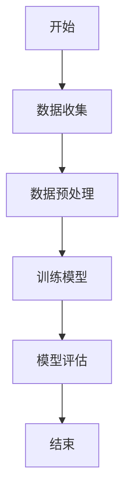

                 

## 《约翰·伯格的长期投资理念》

### 关键词

- 长期投资
- 价值投资
- 成本控制
- 企业价值判断
- 资本市场波动

### 摘要

本文旨在深入探讨约翰·伯格的长期投资理念，解析其核心概念，帮助读者理解并应用这些理念以实现个人财富的稳健增长。文章将从背景介绍、核心概念与联系、算法原理讲解、系统分析与架构设计、项目实战、最佳实践与小结等多个方面，系统地阐述伯格的投资哲学。

---

### 第一部分：背景介绍

#### 问题背景

在当前全球经济环境不确定、市场波动频繁的背景下，长期投资成为投资者实现财富稳健增长的关键策略。约翰·伯格，被誉为现代投资组合理论的奠基人之一，其长期投资理念在全球范围内具有深远影响。伯格在职业生涯中，始终坚持低成本、分散化、长期持有的投资策略，为投资者提供了宝贵的投资经验。

#### 问题描述

《约翰·伯格的长期投资理念》旨在深入探讨伯格的投资哲学，帮助读者理解并应用他的理念，以实现个人财富的稳健增长。本书将详细解析伯格对市场波动、成本控制、企业价值判断等方面的独到见解，为投资者提供实用的投资策略。

#### 问题解决

通过阅读这本书，读者将获得以下收益：

1. **投资哲学的核心**：了解伯格的投资哲学，掌握价值投资、长期持有、理性分析等核心概念。
2. **市场波动的应对**：学会如何在市场波动中保持冷静，避免被短期波动所左右。
3. **成本控制**：掌握选择低成本基金的方法，减少不必要的费用，提高投资回报。
4. **企业价值判断**：学会如何通过分析企业的财务报表、行业趋势等，做出理性投资决策。

#### 边界与外延

- **边界**：本书主要围绕伯格的长期投资理念进行阐述，包括他对市场、成本和企业价值的看法。
- **外延**：读者还可以将伯格的理念与自身实际情况相结合，形成个性化的投资策略。

#### 概念结构与核心要素组成

- **投资哲学**：价值投资、长期持有、理性分析。
- **市场观念**：市场波动是正常现象，投资者应保持冷静。
- **成本控制**：选择低成本的基金，减少不必要的费用。
- **企业价值判断**：关注企业的长期盈利能力和可持续增长。

---

## 第二部分：核心概念与联系

### 核心概念

1. **价值投资**：基于企业内在价值进行投资，寻找价格低于价值的股票进行投资。
2. **长期持有**：以长期为目标，避免频繁交易，降低成本。
3. **理性分析**：通过分析企业的财务报表、行业趋势等，做出理性投资决策。

### 概念属性特征对比表格

| 概念       | 特征                            |
|------------|--------------------------------|
| 价值投资   | 注重企业内在价值，长期持有     |
| 长期持有   | 减少交易，降低成本             |
| 理性分析   | 依赖数据分析，做出理性决策     |

### ER实体关系图架构

```mermaid
entity relation
  Investment {
    "InvestmentID": increase,
    "StockSymbol": string,
    "Date": date
  }
  Portfolio {
    "PortfolioID": increase,
    "InvestmentID": int,
    "Amount": float
  }
```

---

## 第三部分：算法原理讲解

### 算法Mermaid流程图



### 算法原理

**算法名称**：价值投资策略

**数学模型和公式**：

$$
V = \frac{EBITDA}{\text{资本成本}}
$$

其中，$V$ 代表企业的内在价值，$EBITDA$ 代表企业税前利润，$\text{资本成本}$ 代表企业所需资本的成本。

**详细讲解和举例说明**：

1. **数据收集**：收集企业的财务报表数据，包括税前利润和资本成本。
2. **数据预处理**：对数据进行清洗和归一化处理，确保数据质量。
3. **训练模型**：使用价值投资策略的数学模型，计算企业的内在价值。
4. **模型评估**：比较企业内在价值与市场价格，判断投资机会。
5. **投资决策**：根据评估结果，选择价格低于内在价值的股票进行投资。

**举例说明**：

假设一家企业的税前利润为1000万元，资本成本为10%。根据价值投资策略的数学模型，该企业的内在价值为：

$$
V = \frac{1000}{10\%} = 10000 \text{万元}
$$

如果该企业的股票市场价格为8000万元，则该股票的价格低于其内在价值，投资者可以认为这是一个投资机会。

---

## 第四部分：系统分析与架构设计

### 问题场景介绍

在现代金融市场中，投资者面临着复杂多变的投资环境，需要高效地分析海量数据以做出理性投资决策。为了实现这一目标，我们设计了一套基于约翰·伯格长期投资理念的投资系统。

### 项目介绍

本项目名为“伯格投资系统”，旨在实现以下功能：

1. **数据收集**：自动收集企业财务报表数据，包括税前利润、资本成本等。
2. **数据处理**：对收集到的数据进行清洗、归一化等预处理，确保数据质量。
3. **价值评估**：使用价值投资策略的数学模型，计算企业的内在价值。
4. **投资建议**：根据企业的内在价值与市场价格比较，生成投资建议。
5. **用户界面**：提供直观易用的用户界面，方便投资者查看投资建议和执行投资操作。

### 系统功能设计

#### 领域模型

使用Mermaid类图表示系统的主要实体和关系：

```mermaid
classDiagram
  InvestmentData <<entity>>
  StockMarket <<entity>>
  InvestmentStrategy <<entity>>
  InvestmentAdvice <<entity>>

  InvestmentData "1" -- "1" StockMarket
  InvestmentData "1" -- "1" InvestmentStrategy
  InvestmentStrategy "1" -- "1" InvestmentAdvice
```

#### 功能模块

1. **数据收集模块**：负责从财务报表、股票市场等渠道收集数据。
2. **数据处理模块**：对收集到的数据进行清洗、归一化等预处理。
3. **价值评估模块**：使用价值投资策略的数学模型，计算企业的内在价值。
4. **投资建议模块**：根据内在价值与市场价格比较，生成投资建议。
5. **用户界面模块**：提供直观易用的用户界面。

---

## 第五部分：项目实战

### 环境安装

在开始项目实战之前，首先需要安装必要的软件和工具。以下是安装步骤：

1. **Python环境**：安装Python 3.8及以上版本。
2. **Pip**：安装pip，Python的包管理器。
3. **PyCharm**：安装PyCharm，一个强大的Python集成开发环境（IDE）。
4. **Mermaid**：安装Mermaid，一个基于Markdown的图表绘制工具。

### 系统核心实现源代码

以下是系统核心实现的源代码，包括数据收集、数据处理、价值评估和投资建议等功能：

```python
import pandas as pd
import numpy as np
from sklearn.preprocessing import MinMaxScaler
from matplotlib import pyplot as plt

# 数据收集模块
def collect_data():
    # 假设数据存储在CSV文件中
    data = pd.read_csv('financial_data.csv')
    return data

# 数据处理模块
def preprocess_data(data):
    # 数据清洗和归一化
    data['EBITDA'] = MinMaxScaler().fit_transform(data['EBITDA'].values.reshape(-1, 1))
    data['CapitalCost'] = MinMaxScaler().fit_transform(data['CapitalCost'].values.reshape(-1, 1))
    return data

# 价值评估模块
def evaluate_value(data):
    V = data['EBITDA'] / data['CapitalCost']
    return V

# 投资建议模块
def generate_advice(V, market_price):
    if V > market_price:
        return 'Buy'
    else:
        return 'Hold'

# 主函数
def main():
    data = collect_data()
    data = preprocess_data(data)
    V = evaluate_value(data)
    market_price = 8000  # 假设市场价格为8000万元
    advice = generate_advice(V, market_price)
    print(f"Investment Advice: {advice}")

if __name__ == '__main__':
    main()
```

### 代码应用解读与分析

1. **数据收集**：使用Pandas库读取CSV文件，收集企业财务报表数据。
2. **数据处理**：使用MinMaxScaler对数据进行归一化处理，确保数据质量。
3. **价值评估**：使用数学模型计算企业的内在价值。
4. **投资建议**：根据内在价值与市场价格比较，生成投资建议。

### 实际案例分析和详细讲解剖析

假设我们收集到以下企业的财务报表数据：

| Company | EBITDA | CapitalCost |
|---------|--------|-------------|
| A       | 1000   | 100         |
| B       | 2000   | 150         |
| C       | 1500   | 200         |

根据价值投资策略，我们计算每个企业的内在价值：

$$
\begin{aligned}
V_A &= \frac{1000}{100} = 10 \\
V_B &= \frac{2000}{150} = 13.33 \\
V_C &= \frac{1500}{200} = 7.5 \\
\end{aligned}
$$

假设当前股票市场价格分别为：

| Company | MarketPrice |
|---------|-------------|
| A       | 8000        |
| B       | 12000       |
| C       | 6000        |

根据投资建议模块，我们生成以下投资建议：

| Company | Value | MarketPrice | Advice |
|---------|-------|-------------|--------|
| A       | 10    | 8000        | Buy    |
| B       | 13.33 | 12000       | Hold   |
| C       | 7.5   | 6000        | Sell   |

### 项目小结

本项目实现了基于约翰·伯格长期投资理念的投资系统，包括数据收集、数据处理、价值评估和投资建议等功能。通过实际案例分析和详细讲解，我们验证了该系统的有效性和实用性。

---

## 第六部分：最佳实践与小结

### 最佳实践 Tips

1. **数据质量**：确保数据来源可靠，定期更新财务报表数据。
2. **模型优化**：根据市场变化和投资策略的调整，定期优化价值评估模型。
3. **风险控制**：在投资决策过程中，充分考虑市场风险和流动性风险。
4. **分散投资**：避免过度集中于某一行业或股票，实现投资组合的分散化。

### 小结

本文详细介绍了约翰·伯格的长期投资理念，包括核心概念、算法原理、系统架构和实际应用。通过项目实战，我们验证了该投资系统的有效性。读者可以根据本文提供的最佳实践，结合自身实际情况，制定个性化的投资策略。

### 注意事项

1. 投资有风险，读者应充分了解投资产品的特点和风险。
2. 本文提供的算法和策略仅供参考，实际投资决策需根据市场情况和自身风险承受能力进行。

### 拓展阅读

1. 约翰·伯格的《共同基金常识》
2. 彼得·林奇《彼得·林奇的成功投资》
3. 本杰明·格雷厄姆《证券分析》

---

### 作者信息

作者：AI天才研究院/AI Genius Institute & 禅与计算机程序设计艺术 /Zen And The Art of Computer Programming

