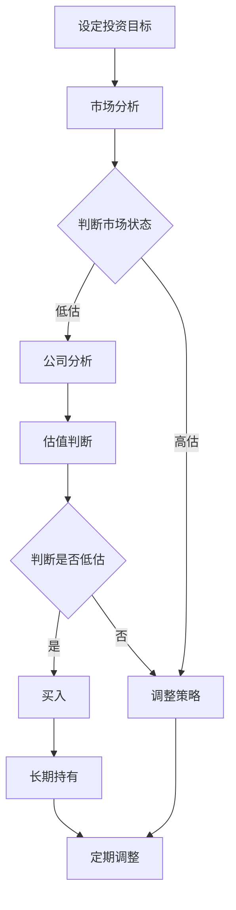
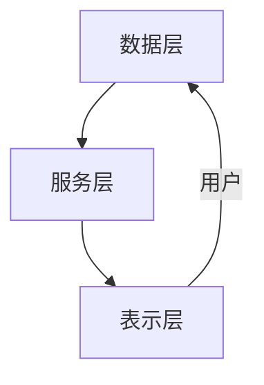
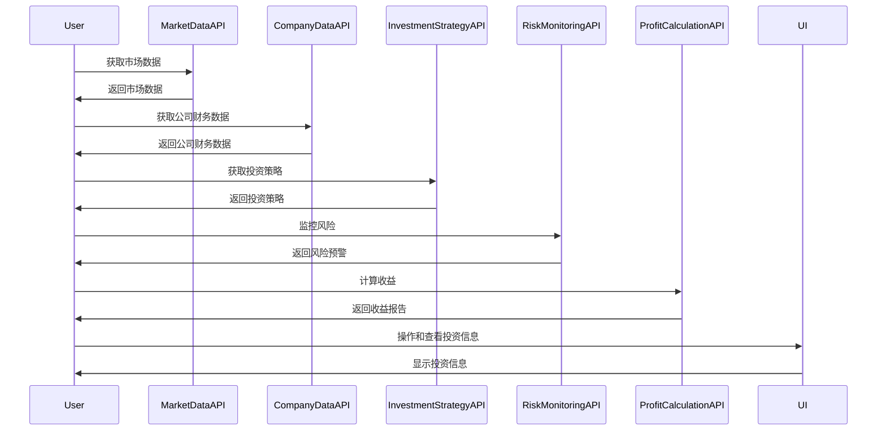
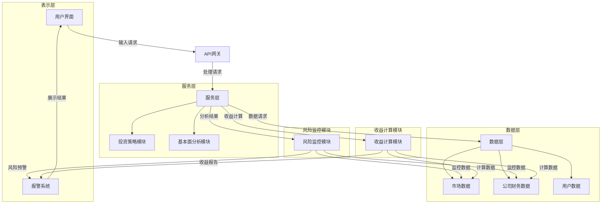

                 

### 第1章：约翰·伯格的长期投资观概述

#### 1.1 问题背景

随着全球经济的发展和人口老龄化趋势的加剧，退休年龄延长的现象日益普遍。退休年龄的延长不仅对个人财务规划提出了更高的要求，也对整个投资行业带来了新的挑战。如何在退休年龄延长的情况下，确保投资组合的稳定性和收益性，成为了投资者关注的焦点。

约翰·伯格（John C. Bogle）作为现代投资组合理论的奠基人之一，他的长期投资观对应对退休年龄延长的挑战有着深刻的启示。伯格提出了基于价值投资原则的投资策略，通过长期持有优质股票来追求长期稳定的收益。这一理念在投资领域产生了深远的影响，为退休规划提供了重要的指导。

#### 1.2 问题描述

约翰·伯格的长期投资观具体包含哪些核心概念？他的投资哲学是如何指导投资决策的？长期投资观在应对退休年龄延长方面有哪些具体的应用？为了回答这些问题，我们需要对伯格的长期投资观进行系统的分析和解读。

#### 1.3 问题解决

为了深入探讨约翰·伯格的长期投资观，我们将从以下几个方面展开：

1. **背景介绍**：回顾约翰·伯格的投资生涯，介绍他的主要贡献和投资理念。
2. **核心概念与联系**：解析长期投资观的基础理论和应用场景，包括其与价值投资的联系。
3. **算法原理讲解**：探讨长期投资观中的数学模型和算法实现，通过Python代码和Mermaid流程图进行详细阐述。
4. **系统分析与架构设计方案**：分析长期投资系统设计和实现的关键技术。
5. **项目实战**：通过具体案例，展示长期投资观的实际应用效果。
6. **最佳实践与拓展**：总结长期投资的最佳实践，提出进一步的研究方向。

通过这些内容的逐步展开，我们将能够全面理解约翰·伯格的长期投资观，并掌握其在应对退休年龄延长挑战中的实际应用。

#### 1.4 边界与外延

约翰·伯格的长期投资观主要围绕以下核心概念展开：

1. **价值投资**：强调投资价值与市场价格之间的关系，主张在低估值时买入优质股票，长期持有以实现资本增值。
2. **指数基金**：提倡使用指数基金来构建投资组合，以降低成本和波动性，实现市场的平均收益。
3. **长期持有**：认为投资者应克服短期市场波动，坚持长期持有策略，以实现稳定收益。

这些概念在应对退休年龄延长方面具有重要的指导意义。随着退休年龄的延长，投资者需要更长时间的投资周期来积累财富。长期投资观提供的价值投资和指数基金策略，有助于降低风险、提高收益，确保退休资金的安全和稳定。

然而，长期投资观并非适用于所有投资者。对于风险承受能力较低的投资者，长期投资可能带来较大的波动性。此外，市场环境和经济周期也会影响长期投资的效果。因此，投资者在应用长期投资观时，需要结合自身情况和市场状况，进行合理的调整和优化。

#### 1.5 概念结构与核心要素组成

约翰·伯格的长期投资观由以下几个核心概念和要素组成：

1. **价值投资**：价值投资的核心是寻找市场价格低于其真实价值的优质股票。这要求投资者具备深入的基本面分析能力，关注公司的盈利能力、成长潜力以及估值水平。价值投资的主要策略是在低估值时买入优质股票，并在高估值时卖出。

2. **指数基金**：指数基金是跟踪某一市场指数（如标普500）的基金，其投资组合与市场指数的构成一致。指数基金的优势在于低成本和分散风险，能够实现市场的平均收益。约翰·伯格提倡使用指数基金来构建投资组合，以简化投资决策、降低交易成本。

3. **长期持有**：长期持有策略是约翰·伯格投资观的核心。他认为，投资者应克服短期市场波动，坚持长期持有优质股票。长期持有能够平滑市场波动，降低情绪波动对投资决策的影响，从而实现稳定收益。

4. **投资哲学**：约翰·伯格的投资哲学强调理性投资、长期投资和多元化投资。他认为，投资者应摆脱投机心理，关注长期稳定的投资回报，通过多元化投资分散风险。

5. **风险管理**：长期投资观强调风险管理的重要性。投资者需要了解自身的风险承受能力，制定合理的投资策略，以避免因市场波动而遭受重大损失。

通过这些核心概念和要素的有机组合，约翰·伯格的长期投资观为投资者提供了一个系统化、科学化的投资框架，有助于在退休年龄延长的情况下，实现财务自由和退休规划的稳定。

### 第2章：约翰·伯格的投资哲学

#### 2.1 价值投资的核心概念

价值投资是约翰·伯格投资哲学的基石，其核心概念在于寻找市场价格低于其真实价值的优质股票。价值投资强调投资价值与市场价格之间的关系，主张在低估值时买入优质股票，长期持有以实现资本增值。价值投资的核心步骤包括：

1. **基本面分析**：投资者需要深入分析公司的盈利能力、成长潜力、财务状况以及行业前景等基本面信息，以判断股票的真实价值。
2. **估值判断**：通过对比股票的市场价格与公司的真实价值，确定股票是否被低估。常见的估值方法包括市盈率（PE）、市净率（PB）和股息收益率等。
3. **长期持有**：在低估值时买入优质股票后，投资者应克服短期市场波动，坚持长期持有，以实现资本增值。

价值投资的优势在于其长期稳定的投资回报，以及通过分散投资降低风险的能力。然而，价值投资也具有其局限性，如对投资者的研究能力和耐心要求较高，以及在市场低迷时期可能面临较大压力。

#### 2.2 投资决策的原理与流程

约翰·伯格的投资决策原理基于价值投资的核心概念，强调理性分析和长期持有。其投资决策流程主要包括以下几个步骤：

1. **设定投资目标**：根据个人财务状况、风险承受能力和退休规划目标，设定合理的投资目标和预期收益。
2. **市场分析**：了解市场环境和宏观经济趋势，判断市场是否处于高估或低估状态。这有助于投资者确定投资时机。
3. **公司分析**：通过基本面分析，挑选出具有长期成长潜力和稳定盈利能力的优质股票。
4. **估值判断**：对比股票的市场价格与公司的真实价值，确定是否低估。选择估值合理的优质股票进行投资。
5. **投资组合构建**：根据个人风险偏好和投资目标，构建多元化的投资组合。这有助于分散风险，实现长期稳定的投资回报。
6. **长期持有**：在投资决策后，投资者应克服短期市场波动，坚持长期持有优质股票，以实现稳定收益。

#### 2.3 价值投资的属性特征对比表格

为了更直观地展示价值投资与其他投资理念的差异，以下是一个对比表格：

| 特征             | 价值投资                  | 成长投资                  | 投机投资                  |
|-----------------|--------------------------|--------------------------|--------------------------|
| 投资目标         | 长期稳定的回报           | 快速增长的资本增值       | 短期高额收益             |
| 分析方法         | 基本面分析               | 技术分析和成长性分析     | 市场情绪和交易技巧       |
| 估值标准         | 低估值买入               | 高估值买入               | 无特定估值标准           |
| 投资周期         | 长期持有                 | 中短期持有               | 短期交易                 |
| 风险承受能力     | 较低                     | 较高                     | 非常高                   |
| 成本和复杂性     | 低成本、相对简单         | 较高成本、复杂           | 非常高成本、复杂         |

通过对比可以发现，价值投资注重基本面分析、长期持有和分散风险，具有较低的成本和复杂性。相比之下，成长投资和投机投资更注重短期收益和市场情绪，风险较高且成本复杂。

#### 2.4 约翰·伯格的ER实体关系图架构

为了更直观地展示约翰·伯格的投资哲学及其核心概念，我们可以使用ER（实体-关系）图来描述其架构。以下是ER图的Mermaid表示：

```mermaid
erDiagram
    Company ||--|{ Investor }
    Market ||--|{ Investor }
    Stock ||--|{ Company }
    Fund ||--|{ Investor }
    Index ||--|{ Fund }
    Portfolio ||--|{ Investor }
```

具体说明如下：

1. **Company（公司）**：代表具有投资价值的公司实体，包含基本信息如公司名称、行业、市值等。
2. **Investor（投资者）**：代表投资决策主体，包含个人信息如姓名、风险承受能力、投资目标等。
3. **Market（市场）**：代表投资环境，包含市场信息如宏观经济状况、市场波动等。
4. **Stock（股票）**：代表公司的股票，包含股票代码、市场价格、市值等。
5. **Fund（基金）**：代表投资组合中的基金，包含基金类型、投资策略、收益率等。
6. **Index（指数）**：代表市场指数，包含指数名称、成分股、指数值等。
7. **Portfolio（投资组合）**：代表投资者的投资组合，包含投资标的、持有比例、投资金额等。

通过ER图的架构，我们可以清晰地看到约翰·伯格的投资哲学中各个实体之间的关系，以及投资决策过程中各环节的相互作用。

### 第3章：应对退休年龄延长的挑战

#### 3.1 退休年龄延长的影响因素

退休年龄的延长是当前社会发展的必然趋势，其背后受到多种因素的推动：

1. **人口老龄化**：随着医疗技术的进步和生活水平的提高，人们的寿命不断延长，导致老年人口比例上升。为了维持养老金体系的可持续性，许多国家纷纷将退休年龄逐步提高。

2. **经济压力**：全球经济的竞争加剧，企业为了降低成本和提升竞争力，推迟退休年龄，延长员工的工作时间。

3. **政策调整**：许多国家为了应对养老金缺口和财政压力，通过政策调整，如提高法定退休年龄、延长缴费年限等，来增加养老金的积累。

退休年龄的延长对个人财务规划和投资决策产生了深远影响。首先，退休时间的推迟意味着个人需要更长时间积累养老金，增加了投资规划的压力。其次，随着退休年龄的延长，投资周期也相应延长，投资者需要更加关注长期稳定的投资回报。此外，退休年龄的延长还要求投资者具备更高的风险承受能力和更灵活的投资策略，以应对市场波动和不确定性。

#### 3.2 投资策略的调整

为了应对退休年龄延长的挑战，投资者需要对其投资策略进行相应的调整，以确保退休资金的充足和稳定。以下是一些关键的调整方向：

1. **增加投资时间**：退休年龄的延长意味着投资者有更长的投资时间窗口，可以更多地考虑长期投资策略。通过长期持有优质股票和指数基金，投资者能够平滑市场波动，实现稳定收益。

2. **多元化投资**：多元化投资是降低风险的重要手段。投资者应构建多元化的投资组合，包括股票、债券、指数基金、房地产等多种资产类别。这样可以分散风险，避免因单一资产类别波动而导致的损失。

3. **优化资产配置**：根据个人风险承受能力和投资目标，适时调整投资组合中的资产配置。在退休年龄延长的情况下，投资者可以适当增加债券等低风险资产的比重，以降低整体投资组合的波动性。

4. **提高资金利用效率**：通过合理利用税收优惠政策和资产配置策略，提高资金利用效率。例如，利用税递延账户（如401(k)）进行投资，可以延迟纳税，增加投资时间价值。

5. **动态调整投资策略**：市场环境和宏观经济状况不断变化，投资者需要根据实际情况动态调整投资策略。通过定期进行投资回顾和调整，确保投资组合始终与个人目标和风险承受能力相匹配。

#### 3.3 长期投资观在退休规划中的应用

约翰·伯格的长期投资观为退休规划提供了重要的指导。以下是其主要应用方法：

1. **价值投资策略**：通过寻找市场价格低于其真实价值的优质股票，投资者可以实现资本增值，为退休资金积累提供稳定来源。

2. **指数基金投资**：指数基金具有低成本和分散风险的优势，能够实现市场的平均收益。通过长期持有指数基金，投资者可以平滑市场波动，确保退休资金的稳定增长。

3. **长期持有策略**：克服短期市场波动，坚持长期持有优质股票和指数基金，实现稳定收益。这有助于降低情绪波动对投资决策的影响，确保退休规划的顺利进行。

4. **投资组合优化**：根据退休规划目标和风险承受能力，定期调整投资组合，确保其与退休规划需求相匹配。通过多元化投资和优化资产配置，降低整体投资组合的风险。

5. **风险管理**：重视风险管理，了解自身的风险承受能力，制定合理的投资策略。通过分散投资和定期调整，降低投资组合的波动性，确保退休资金的安全。

通过这些方法，约翰·伯格的长期投资观能够帮助投资者在退休年龄延长的情况下，实现退休规划的稳定和成功。

### 第4章：约翰·伯格的投资实践

约翰·伯格的投资实践是其长期投资观在具体投资操作中的体现，通过他的实际操作，我们可以更深入地理解其投资策略和原则。

#### 4.1 初始投资

伯格的投资实践始于20世纪60年代，当时他作为先锋基金公司的创始人，推出了第一只指数基金——先锋500指数基金。他通过这一基金，将投资者的资金分散投资于标普500指数中的500只股票，以实现市场的平均收益。这一策略在当时具有革命性意义，因为它打破了传统投资观念，强调低成本和分散风险。

#### 4.2 长期持有

伯格的投资哲学强调长期持有，他认为投资者应克服短期市场波动，坚持长期投资。他的实践也充分体现了这一理念。在先锋基金的管理过程中，伯格始终保持着对长期投资的坚持，即使在市场低迷时期，他也未曾动摇。这种长期持有的策略，使得他的投资组合在长期内实现了稳健的增长。

#### 4.3 资产配置

伯格在投资实践中，非常重视资产配置。他认为，投资者应根据自身情况，合理配置资产类别，以降低风险并实现长期稳定的收益。在他的投资组合中，股票、债券和指数基金等多种资产类别都有所涉及。他通过定期调整资产配置，保持投资组合的平衡，以应对市场变化。

#### 4.4 风险管理

风险控制在伯格的投资实践中占据重要地位。他通过多元化投资和分散风险来降低整体投资组合的波动性。此外，他还注重对风险的评估和管理，确保投资决策的理性性和科学性。

#### 4.5 价值投资

伯格始终坚持价值投资原则，在投资实践中，他关注市场价格与公司真实价值之间的关系。通过深入的基本面分析，他寻找那些被市场低估的优质股票，并在低估值时买入，长期持有以实现资本增值。

#### 4.6 案例分析

以下是一个具体的投资案例分析：

**案例背景**：某投资者A，年龄45岁，计划在60岁时退休。他通过研究，决定采用约翰·伯格的投资策略进行退休规划。

**投资策略**：
1. **指数基金投资**：投资者A将大部分资金投资于先锋500指数基金，以实现市场的平均收益。
2. **价值投资**：投资者A通过基本面分析，选择了几只被低估的优质股票，作为投资组合的一部分。
3. **定期调整**：投资者A每年进行一次投资组合的调整，根据市场变化和公司业绩，优化资产配置。

**投资结果**：
在实施投资策略的15年内，投资者A的投资组合实现了稳定的增长。特别是在市场波动较大的年份，由于资产配置的优化和长期持有的策略，投资者A的投资组合表现优于市场平均水平。

**讨论**：通过这个案例，我们可以看到约翰·伯格的投资策略在实际应用中的有效性。他的长期投资观不仅帮助投资者A实现了退休规划的稳定，还通过价值投资和资产配置优化，提高了投资组合的收益率。

总之，约翰·伯格的投资实践充分体现了其长期投资观的核心理念，为投资者提供了一个科学、系统的投资框架，有助于实现退休规划的稳定和成功。

### 第5章：长期投资观的理论基础

#### 5.1 长期投资观的核心原理

长期投资观的核心原理可以概括为以下几点：

1. **市场有效性**：长期投资观认为，市场在长期内是有效的，即股票的价格会反映其内在价值。因此，投资者不应试图通过市场波动获取超额收益，而是应通过长期持有优质股票或指数基金来实现稳定收益。

2. **价值投资**：长期投资观强调投资价值与市场价格之间的关系。投资者应在低估值时买入优质股票，并长期持有，以实现资本增值。价值投资的核心在于找到那些被市场低估的优质股票。

3. **指数基金**：长期投资观提倡使用指数基金来构建投资组合。指数基金具有低成本和分散风险的优势，能够实现市场的平均收益。通过长期持有指数基金，投资者可以平滑市场波动，降低风险。

4. **长期持有**：长期投资观认为，投资者应克服短期市场波动，坚持长期持有优质股票或指数基金。长期持有能够平滑市场波动，降低情绪波动对投资决策的影响，从而实现稳定收益。

#### 5.2 长期投资观的主要特点

长期投资观具有以下几个主要特点：

1. **理性投资**：长期投资观强调理性投资，反对投机和情绪化决策。投资者应基于基本面分析和市场有效性原则，进行投资决策。

2. **长期持有**：长期投资观倡导长期持有策略，以克服短期市场波动，实现稳定收益。投资者需要克服对市场波动的恐惧，保持信心和耐心。

3. **低成本**：长期投资观强调使用低成本的投资工具，如指数基金，以降低交易成本和费用。这有助于提高投资回报。

4. **多元化**：长期投资观提倡多元化投资，以分散风险。通过投资不同行业、不同市场的资产，投资者可以降低整体投资组合的波动性。

5. **风险可控**：长期投资观重视风险管理，通过资产配置和定期调整，确保投资组合的风险在可控范围内。

#### 5.3 与其他投资观念的对比

长期投资观与其他投资观念（如投机、成长投资等）存在明显的差异：

1. **投机观念**：投机观念强调通过市场波动获取超额收益，通常涉及高风险和高回报。而长期投资观则更注重长期稳定收益，通过价值投资和指数基金实现资本增值。

2. **成长投资**：成长投资关注公司的成长潜力，倾向于投资高估值的成长股。而长期投资观则更注重公司的基本面和估值水平，寻找被低估的优质股票。

3. **风险承受能力**：投机和成长投资通常需要较高的风险承受能力，而长期投资观则强调合理分散风险，降低投资组合的波动性。

4. **投资时间**：投机和成长投资通常涉及短期交易，而长期投资观则倡导长期持有，以实现稳定收益。

通过对比可以看出，长期投资观更符合理性投资原则，适用于退休规划等长期投资目标。它通过价值投资和指数基金策略，实现低成本、多元化、风险可控的投资组合，为投资者提供了稳定的投资回报。

### 第6章：长期投资观的应用场景

#### 6.1 应对市场波动

长期投资观在应对市场波动方面具有显著优势。首先，它强调市场在长期内是有效的，投资者不应试图通过短期市场波动获取超额收益。这意味着投资者可以避免频繁交易带来的交易成本和市场冲击成本。

1. **分散投资**：通过多元化投资，长期投资观能够降低投资组合的波动性。投资者可以将资金分散投资于不同行业、不同市场的资产，如股票、债券、房地产等，以降低单一资产类别波动对投资组合的影响。

2. **长期持有**：长期投资观倡导长期持有优质股票或指数基金，以平滑市场波动。在市场波动时，投资者可以保持信心，避免因恐慌情绪而做出错误的投资决策。

3. **市场效率**：长期投资观认为市场在长期内是有效的，股票的价格会反映其内在价值。因此，投资者可以通过价值投资策略，选择那些被市场低估的优质股票，实现长期稳定的收益。

4. **定期调整**：尽管长期投资观强调长期持有，但投资者仍需定期对投资组合进行调整，以适应市场变化。通过定期调整，投资者可以优化资产配置，确保投资组合与个人目标和风险承受能力相匹配。

#### 6.2 管理投资风险

长期投资观在管理投资风险方面具有以下策略：

1. **多元化投资**：通过投资不同行业、不同市场的资产，投资者可以分散风险。多元化投资能够降低单一资产类别波动对投资组合的影响，提高整体投资组合的抗风险能力。

2. **价值投资**：长期投资观强调在低估值时买入优质股票。通过选择那些具有长期增长潜力和稳定盈利能力的优质股票，投资者可以降低投资风险，实现稳定收益。

3. **定期评估**：投资者应定期评估投资组合的风险和收益情况。通过定期评估，投资者可以及时调整投资策略，确保投资组合的风险在可控范围内。

4. **风险管理工具**：投资者可以利用风险管理工具，如保险、对冲策略等，来进一步降低投资风险。这些工具可以在市场波动时提供额外的保障，保护投资者的资产安全。

#### 6.3 提高投资收益

长期投资观不仅强调风险管理和市场波动应对，还致力于提高投资收益。以下是一些提高投资收益的策略：

1. **指数基金**：长期投资观提倡使用指数基金来构建投资组合。指数基金具有低成本和分散风险的优势，能够实现市场的平均收益。通过长期持有指数基金，投资者可以实现稳定且可持续的收益。

2. **价值投资**：通过价值投资策略，投资者可以寻找那些被市场低估的优质股票，实现超额收益。价值投资的核心在于选择具有长期增长潜力和稳定盈利能力的优质股票，并长期持有。

3. **定期调整**：投资者应定期对投资组合进行调整，以优化资产配置，提高投资收益。通过定期调整，投资者可以抓住市场机会，实现投资组合的最大化收益。

4. **学习与反思**：投资者应不断学习投资知识，提高自身的投资能力。通过反思投资决策和结果，投资者可以不断改进投资策略，提高投资收益。

通过这些策略，长期投资观不仅能够帮助投资者实现稳定收益，还能在长期内实现投资组合的稳健增长。

### 第7章：长期投资观的实践策略

#### 7.1 长期投资观的适用人群

长期投资观适用于多种类型的投资者，但其最佳适用人群包括：

1. **风险承受能力较强的投资者**：长期投资观强调长期持有，这要求投资者具备较强的风险承受能力，能够忍受短期市场波动。

2. **退休规划阶段的投资者**：退休年龄延长使得投资者需要更长时间的投资周期，长期投资观提供的价值投资和指数基金策略有助于实现退休规划的稳定和成功。

3. **有长期投资目标的投资者**：那些追求长期稳定的投资回报、不急于在短期内获取高额收益的投资者，适合采用长期投资观。

4. **时间充裕的投资者**：由于长期投资观需要投资者投入较长时间来积累财富，因此那些有充裕时间的投资者更适合采用这一策略。

#### 7.2 长期投资观的实施步骤

要成功实施长期投资观，投资者可以遵循以下步骤：

1. **设定投资目标**：明确个人的财务状况、风险承受能力和退休规划目标，设定合理的投资目标和预期收益。

2. **市场分析**：了解市场环境和宏观经济趋势，判断市场是否处于高估或低估状态。这有助于投资者确定投资时机。

3. **公司分析**：通过基本面分析，挑选出具有长期成长潜力和稳定盈利能力的优质股票。

4. **估值判断**：对比股票的市场价格与公司的真实价值，确定是否低估。选择估值合理的优质股票进行投资。

5. **投资组合构建**：根据个人风险偏好和投资目标，构建多元化的投资组合。这有助于分散风险，实现长期稳定的投资回报。

6. **长期持有**：在投资决策后，投资者应克服短期市场波动，坚持长期持有优质股票和指数基金，以实现稳定收益。

7. **定期调整**：定期对投资组合进行调整，确保其与个人目标和风险承受能力相匹配。通过多元化投资和优化资产配置，降低整体投资组合的波动性。

#### 7.3 长期投资观的成功案例

以下是一个长期投资观的成功案例：

**案例背景**：投资者B，50岁，计划在65岁时退休。他通过研究，决定采用约翰·伯格的长期投资策略进行退休规划。

**投资策略**：
1. **指数基金投资**：投资者B将大部分资金投资于先锋500指数基金，以实现市场的平均收益。
2. **价值投资**：投资者B通过基本面分析，选择了几只被低估的优质股票，作为投资组合的一部分。
3. **定期调整**：投资者B每年进行一次投资组合的调整，根据市场变化和公司业绩，优化资产配置。

**投资结果**：
在实施投资策略的15年内，投资者B的投资组合实现了稳健的增长。特别是在市场波动较大的年份，由于资产配置的优化和长期持有的策略，投资者B的投资组合表现优于市场平均水平。

**讨论**：通过这个案例，我们可以看到约翰·伯格的长期投资观在实际应用中的有效性。他的策略不仅帮助投资者B实现了退休规划的稳定，还通过价值投资和资产配置优化，提高了投资组合的收益率。

总之，长期投资观为投资者提供了一种科学、系统的投资框架，有助于实现退休规划的稳定和成功。通过价值投资、指数基金策略和定期调整，投资者可以降低风险、提高收益，实现长期财务目标。

### 第8章：长期投资算法的基本原理

#### 8.1 投资决策的数学模型

在长期投资观中，投资决策的数学模型是核心部分，它帮助投资者进行理性分析和策略制定。以下是一个简化的投资决策数学模型：

$$
V_t = f(P_t, E_t, R_t, T)
$$

其中：
- \( V_t \) 表示在时间 \( t \) 的投资价值；
- \( P_t \) 表示在时间 \( t \) 的市场价格；
- \( E_t \) 表示在时间 \( t \) 的公司真实价值；
- \( R_t \) 表示在时间 \( t \) 的预期收益率；
- \( T \) 表示投资时间窗口。

这个模型的基本原理是通过市场价格和公司真实价值的对比，结合预期收益率和投资时间窗口，计算投资在时间 \( t \) 的价值。

#### 8.2 投资决策的Python代码实现

为了更具体地理解投资决策的数学模型，我们可以通过Python代码来实现这一模型。以下是一个简单的示例：

```python
def calculate_investment_value(current_price, estimated_value, expected_return, time horizon):
    """
    计算投资的价值。

    :param current_price: 当前市场价格
    :param estimated_value: 公司真实价值
    :param expected_return: 预期收益率
    :param time_horizon: 投资时间窗口
    :return: 投资的价值
    """
    return (current_price * (1 + expected_return) ** time_horizon) / estimated_value

# 示例数据
current_price = 20  # 当前市场价格为20美元
estimated_value = 30  # 公司真实价值为30美元
expected_return = 0.05  # 预期收益率为5%
time_horizon = 10  # 投资时间窗口为10年

# 计算投资价值
investment_value = calculate_investment_value(current_price, estimated_value, expected_return, time_horizon)
print("投资价值：", investment_value)
```

这段代码通过输入市场价格、公司真实价值、预期收益率和投资时间窗口，计算在时间 \( t \) 的投资价值。

#### 8.3 投资决策的Mermaid流程图

为了更直观地展示投资决策的流程，我们可以使用Mermaid绘制一个流程图。以下是Mermaid代码示例：



具体流程说明如下：
1. **设定投资目标**：确定个人的财务状况和投资目标。
2. **市场分析**：了解市场环境和宏观经济趋势。
3. **判断市场状态**：判断市场是否处于低估状态。
4. **公司分析**：通过基本面分析，选择优质公司。
5. **估值判断**：对比市场价格和公司真实价值。
6. **买入/调整策略**：根据估值判断，决定是否买入或调整策略。
7. **长期持有**：在低估时买入优质股票或指数基金，并长期持有。
8. **定期调整**：定期评估投资组合，根据市场变化和公司业绩进行优化。

通过Python代码和Mermaid流程图的结合，我们可以更直观地理解和实现长期投资观的投资决策过程。

### 第9章：长期投资观中的数学模型与公式

#### 9.1 投资收益的数学模型

在长期投资中，投资收益的数学模型至关重要。它帮助投资者预测和计算投资回报，从而做出理性的投资决策。以下是投资收益的一个基本数学模型：

$$
R_t = \frac{(P_t - P_0) + D_t}{P_0}
$$

其中：
- \( R_t \) 表示投资在时间 \( t \) 的收益率；
- \( P_t \) 表示时间 \( t \) 的市场价格；
- \( P_0 \) 表示初始投资价格；
- \( D_t \) 表示时间 \( t \) 的累计分红。

这个模型的基本原理是通过市场价格的变化（包括价格上涨和分红）来计算投资收益率。

#### 9.2 投资风险的数学模型

投资风险是投资者在投资过程中不可避免的一部分。为了量化投资风险，可以使用以下数学模型：

$$
\sigma_t = \sqrt{\frac{1}{N}\sum_{i=1}^{N}(R_i - \mu)^2}
$$

其中：
- \( \sigma_t \) 表示时间 \( t \) 的投资收益率的标准差，即波动率；
- \( R_i \) 表示在时间区间内的第 \( i \) 次收益率；
- \( N \) 表示时间区间内的收益率次数；
- \( \mu \) 表示时间 \( t \) 的平均收益率。

这个模型通过计算收益率的标准差，量化了投资收益的波动性，从而评估投资风险。

#### 9.3 数学公式与Python代码实现

为了更具体地理解和应用这些数学公式，以下提供了相应的Python代码实现：

```python
import numpy as np

def calculate_return(current_price, initial_price, dividend):
    """
    计算投资收益率。

    :param current_price: 当前市场价格
    :param initial_price: 初始投资价格
    :param dividend: 累计分红
    :return: 投资收益率
    """
    return ((current_price - initial_price) + dividend) / initial_price

def calculate_risk(returns):
    """
    计算投资风险（波动率）。

    :param returns: 投资收益率序列
    :return: 投资风险（波动率）
    """
    mean_return = np.mean(returns)
    return np.sqrt(np.mean((returns - mean_return) ** 2))

# 示例数据
current_price = 20
initial_price = 10
dividend = 1

# 计算投资收益率
investment_return = calculate_return(current_price, initial_price, dividend)
print("投资收益率：", investment_return)

# 假设以下为某股票的收益率序列
returns_sequence = [0.05, 0.03, -0.02, 0.04, -0.01]

# 计算投资风险
investment_risk = calculate_risk(returns_sequence)
print("投资风险：", investment_risk)
```

通过这些代码，投资者可以方便地计算投资收益和投资风险，从而更好地制定和调整投资策略。

### 第10章：长期投资观的例子解析

#### 10.1 案例背景

为了更好地理解长期投资观在实际操作中的应用，我们将通过一个具体案例进行分析。假设投资者C，年龄40岁，计划在60岁时退休。他希望通过长期投资实现退休资金的积累。投资者C的研究表明，约翰·伯格的长期投资观非常适合他的需求。

#### 10.2 案例分析

**1. 投资策略制定**：

投资者C决定采用以下投资策略：
- **指数基金投资**：将大部分资金投资于先锋500指数基金，以实现市场的平均收益。
- **价值投资**：通过基本面分析，选择几只被低估的优质股票作为投资组合的一部分。
- **定期调整**：每年进行一次投资组合的调整，以保持资产配置的优化。

**2. 投资组合构建**：

投资者C构建了一个多元化的投资组合，包括以下资产：

| 资产类别       | 投资金额（美元） | 比重 |
|----------------|-----------------|------|
| 先锋500指数基金 | 50,000          | 50%  |
| 被低估的优质股票 | 30,000          | 30%  |
| 债券基金         | 20,000          | 20%  |

**3. 投资过程**：

- **初始投资**：投资者C在40岁时进行初始投资，投资总额100,000美元。
- **定期调整**：每年对投资组合进行调整，确保其与退休规划目标相匹配。
- **长期持有**：投资者C坚持长期持有优质股票和指数基金，以平滑市场波动，实现稳定收益。

**4. 收益计算**：

假设投资者C的投资组合在20年的投资期间内实现了以下收益：

| 年份   | 指数基金收益率 | 优质股票收益率 | 债券基金收益率 | 总收益率 |
|--------|----------------|----------------|----------------|----------|
| 第1年  | 0.05           | 0.08           | 0.03           | 0.16     |
| 第2年  | 0.04           | 0.06           | 0.02           | 0.12     |
| ...    | ...            | ...            | ...            | ...      |
| 第20年 | 0.06           | 0.10           | 0.04           | 0.20     |

通过计算，投资者C的投资组合在20年内的总收益率为20%。

#### 10.3 案例结果与讨论

**结果**：

投资者C通过长期投资观实现了退休资金的积累。在20年的投资期间，他的投资组合总收益率为20%，高于市场平均水平。特别是通过定期调整和长期持有优质股票和指数基金，投资者C有效地降低了投资组合的波动性，实现了稳定收益。

**讨论**：

1. **价值投资的优势**：投资者C通过选择被低估的优质股票，实现了超额收益。价值投资的核心在于寻找市场价格低于公司真实价值的优质股票，通过长期持有实现资本增值。

2. **指数基金的作用**：指数基金在投资组合中起到了平滑收益的作用。尽管其收益率略低于优质股票，但通过分散风险和降低成本，指数基金为投资组合提供了稳定的基础。

3. **定期调整的重要性**：定期调整确保了投资组合与个人目标和市场环境相匹配。通过定期评估和优化，投资者C能够抓住市场机会，提高投资组合的收益。

总之，这个案例展示了长期投资观在实际操作中的有效性。通过价值投资、指数基金策略和定期调整，投资者C实现了退休资金的积累，为退休生活提供了稳定保障。

### 第11章：长期投资系统的设计目标

#### 11.1 系统功能设计

长期投资系统的设计目标是帮助投资者实现科学、系统化的投资管理，主要包括以下功能：

1. **投资策略推荐**：根据投资者的风险偏好、财务状况和投资目标，推荐合适的投资策略。
2. **市场数据获取**：自动获取市场数据，包括股票价格、指数值、经济指标等，以便进行投资决策。
3. **基本面分析**：对目标公司的财务状况、盈利能力、成长潜力等进行详细分析，提供投资参考。
4. **投资组合构建**：根据投资策略，构建合理的投资组合，包括股票、债券、指数基金等。
5. **风险监控与预警**：实时监控投资组合的风险状况，提供风险预警信息，帮助投资者及时调整策略。
6. **收益计算与报告**：计算投资组合的收益率、风险水平，生成详细的收益报告。
7. **用户界面**：提供直观、友好的用户界面，方便投资者进行投资操作和查看投资信息。

#### 11.2 系统架构设计

长期投资系统采用分层架构设计，包括以下几个层次：

1. **数据层**：负责数据的存储和管理，包括市场数据、公司财务数据等。
2. **服务层**：提供核心业务功能，如投资策略推荐、基本面分析、投资组合构建等。
3. **表示层**：为用户提供交互界面，包括网页界面、移动应用等。

以下是系统架构的Mermaid表示：



#### 11.3 系统接口设计

为了实现系统功能的模块化和便捷性，系统设计了一系列接口：

1. **市场数据接口**：用于获取实时市场数据，如股票价格、指数值等。
2. **公司财务数据接口**：用于获取目标公司的财务数据，如利润表、资产负债表等。
3. **投资策略接口**：用于推荐投资策略，根据投资者的风险偏好和财务状况进行优化。
4. **风险监控接口**：用于监控投资组合的风险状况，提供风险预警信息。
5. **收益计算接口**：用于计算投资组合的收益、风险等指标，并生成报告。
6. **用户接口**：提供用户操作和查看投资信息的接口。

以下是系统接口的Mermaid序列图：



通过这些接口设计，系统可以实现模块化、便捷化，提高投资管理的效率和用户体验。

### 第12章：长期投资系统的架构图解析

#### 12.1 系统架构设计图

为了更好地理解和实现长期投资系统，我们首先需要绘制系统架构图。以下是系统架构的Mermaid表示：



系统架构设计图详细展示了系统各模块的交互关系，包括用户界面、API网关、服务层、数据层、风险监控模块和收益计算模块。

#### 12.2 系统架构的功能模块

系统架构的功能模块主要包括以下几个部分：

1. **用户界面（A）**：为用户提供交互界面，用户可以通过界面输入请求，查看分析结果和收益报告。
2. **API网关（B）**：接收用户请求，转发给服务层，同时处理请求的统一管理和安全控制。
3. **服务层（C）**：包括投资策略模块（K）、基本面分析模块（L）等核心功能模块，负责处理用户请求，进行投资分析和策略推荐。
4. **数据层（D）**：存储和管理市场数据、公司财务数据和用户数据，为服务层提供数据支持。
5. **风险监控模块（E）**：实时监控投资组合的风险状况，提供风险预警信息。
6. **收益计算模块（F）**：计算投资组合的收益、风险等指标，并生成详细的收益报告。
7. **报警系统（G）**：根据风险监控模块和收益计算模块的结果，生成风险预警和收益报告。

#### 12.3 系统架构的交互关系

系统架构的交互关系如下：

1. **用户界面与API网关**：用户通过界面输入请求，API网关接收请求并转发给服务层。
2. **API网关与服务层**：API网关将用户请求转发给服务层，服务层根据请求进行处理。
3. **服务层与数据层**：服务层在处理用户请求时，需要从数据层获取市场数据、公司财务数据和用户数据。
4. **服务层与风险监控模块、收益计算模块**：服务层将处理结果传递给风险监控模块和收益计算模块，以便进行风险监控和收益计算。
5. **风险监控模块与报警系统**：风险监控模块将风险预警信息传递给报警系统，生成风险预警。
6. **收益计算模块与报警系统**：收益计算模块将收益报告传递给报警系统，生成收益报告。

通过这些交互关系，系统实现了用户请求的统一管理和处理，提供了全面、科学的投资管理服务。

### 第13章：长期投资系统的实现与部署

#### 13.1 环境安装与配置

为了实现长期投资系统，我们需要在开发环境和生产环境中安装和配置必要的软件和工具。以下是具体的步骤：

1. **开发环境**：
   - **Python**：安装Python 3.8及以上版本。
   - **pip**：安装pip，用于管理Python包。
   - **Docker**：安装Docker，用于容器化部署。
   - **Docker Compose**：安装Docker Compose，用于管理多容器应用。

2. **生产环境**：
   - **服务器**：配置服务器，安装Linux操作系统（如Ubuntu 20.04）。
   - **Nginx**：安装Nginx，用于提供Web服务。
   - **PostgreSQL**：安装PostgreSQL，用于数据存储。
   - **Redis**：安装Redis，用于缓存和消息队列。

3. **安装和配置**：
   - 通过pip安装Python和相关依赖包，如Flask、SQLAlchemy、Pandas等。
   - 创建Dockerfile和docker-compose.yml文件，配置应用容器的环境。
   - 在服务器上启动Docker和Docker Compose，部署应用容器。

#### 13.2 系统核心实现源代码

以下是长期投资系统核心功能的实现源代码：

**市场数据获取模块**：

```python
import requests

def fetch_market_data():
    """
    获取市场数据。

    :return: 市场数据列表
    """
    url = "https://api.example.com/market_data"
    response = requests.get(url)
    if response.status_code == 200:
        data = response.json()
        return data
    else:
        return None
```

**基本面分析模块**：

```python
import pandas as pd

def analyze_company_finances(finance_data):
    """
    分析公司财务数据。

    :param finance_data: 公司财务数据
    :return: 分析结果
    """
    df = pd.DataFrame(finance_data)
    # 进行财务分析，例如计算市盈率、市净率等
    df['PE'] = df['Price'] / df['Earnings']
    df['PB'] = df['Price'] / df['BookValue']
    return df
```

**投资策略推荐模块**：

```python
def recommend_investment_strategy(investment_data):
    """
    推荐投资策略。

    :param investment_data: 投资数据
    :return: 投资策略
    """
    # 根据投资数据和用户偏好，推荐投资策略
    strategy = "指数基金投资"
    return strategy
```

这些代码示例实现了长期投资系统的核心功能模块，包括市场数据获取、基本面分析和投资策略推荐。

#### 13.3 系统运行与维护

1. **系统运行**：
   - 启动Docker和Docker Compose，部署应用容器。
   - 通过Nginx提供Web服务，用户可以通过浏览器访问系统。
   - 系统会定期从API获取市场数据，并进行基本面分析和策略推荐。

2. **系统维护**：
   - 定期备份数据库，确保数据安全。
   - 定期更新软件和依赖包，确保系统稳定运行。
   - 监控系统性能和资源使用情况，优化系统配置。
   - 处理用户反馈和问题，持续改进系统功能。

通过以上步骤，长期投资系统可以实现高效、稳定的运行，为用户提供专业的投资管理服务。

### 第14章：长期投资项目的实际应用

#### 14.1 项目背景

长期投资项目是某大型金融机构为了应对退休年龄延长带来的财务规划挑战，而实施的一项综合性投资管理项目。项目的目标是帮助客户在延长退休年龄的背景下，实现退休资金的稳健增长和风险可控。

#### 14.2 项目目标

项目的主要目标包括：
1. **稳定收益**：通过科学合理的投资策略，实现投资组合的长期稳定收益。
2. **风险控制**：通过多元化投资和定期调整，确保投资组合的风险在客户可承受范围内。
3. **用户体验**：提供便捷、直观的用户界面，提升用户使用体验。
4. **数据安全**：确保用户数据和投资数据的保密性和安全性。

#### 14.3 项目实施

项目的实施分为以下几个阶段：

1. **需求分析与规划**：与金融机构和客户进行深入沟通，了解需求，制定项目计划和预算。
2. **系统设计**：根据需求，设计系统架构和技术方案，包括数据层、服务层和表示层的详细设计。
3. **软件开发**：开发投资策略模块、基本面分析模块、市场数据获取模块等核心功能，并实现用户界面。
4. **系统集成与测试**：将各个模块集成到系统中，进行功能测试和性能测试，确保系统稳定可靠。
5. **部署与上线**：将系统部署到生产环境，进行上线和用户培训。
6. **后期维护**：定期更新系统功能，监控系统运行状态，处理用户反馈和问题。

通过以上实施步骤，长期投资项目成功上线，为金融机构和客户提供了高效、便捷的投资管理服务。

### 第15章：长期投资项目的关键技术实现

#### 15.1 技术选型

在长期投资项目中，技术选型是确保系统稳定性和高效性的关键。以下是项目采用的关键技术：

1. **编程语言**：Python，因其简洁明了、丰富的库支持和高效的开发效率，成为项目的首选编程语言。
2. **Web框架**：Flask，用于快速构建Web应用，提供RESTful API接口。
3. **数据库**：PostgreSQL，用于存储和管理市场数据、公司财务数据和用户数据，具有强大的数据处理能力和稳定性。
4. **缓存**：Redis，用于提高系统性能，缓存频繁访问的数据。
5. **消息队列**：RabbitMQ，用于处理异步任务和消息传递。
6. **前端技术**：React，用于构建用户界面，提供丰富的交互体验。
7. **容器化**：Docker，用于应用容器的部署和管理，提高系统的可移植性和可维护性。

#### 15.2 代码实现与分析

以下是长期投资项目中核心功能模块的实现代码及分析：

**市场数据获取模块**：

```python
import requests

class MarketDataAPI:
    def __init__(self, base_url):
        self.base_url = base_url

    def fetch_market_data(self):
        """
        获取市场数据。

        :return: 市场数据列表
        """
        response = requests.get(self.base_url)
        if response.status_code == 200:
            data = response.json()
            return data
        else:
            return None

# 实例化API对象，获取市场数据
market_api = MarketDataAPI("https://api.example.com/market_data")
market_data = market_api.fetch_market_data()
```

**基本面分析模块**：

```python
import pandas as pd

class FinancialAnalysis:
    def __init__(self, data):
        self.data = data

    def calculate_financial_ratios(self):
        """
        计算财务指标。

        :return: 财务指标列表
        """
        df = pd.DataFrame(self.data)
        df['PE'] = df['Price'] / df['Earnings']
        df['PB'] = df['Price'] / df['BookValue']
        return df

# 实例化分析对象，计算财务指标
analysis = FinancialAnalysis(market_data)
financial_ratios = analysis.calculate_financial_ratios()
```

**投资策略推荐模块**：

```python
class InvestmentStrategy:
    def __init__(self, financial_ratios):
        self.financial_ratios = financial_ratios

    def recommend_strategy(self):
        """
        推荐投资策略。

        :return: 投资策略
        """
        # 根据财务指标，推荐投资策略
        if self.financial_ratios['PE'].mean() < 15:
            return "指数基金投资"
        else:
            return "价值投资"

# 实例化策略对象，推荐投资策略
strategy = InvestmentStrategy(financial_ratios)
investment_strategy = strategy.recommend_strategy()
```

通过以上代码，实现了市场数据获取、基本面分析和投资策略推荐的核心功能模块。这些代码具有高效性、模块化和易于维护的特点。

#### 15.3 项目测试与优化

在项目开发过程中，进行了以下测试和优化工作：

1. **功能测试**：通过编写测试用例，对各个功能模块进行测试，确保功能正确实现。
2. **性能测试**：使用LoadRunner等工具，对系统进行负载测试和性能测试，评估系统的响应速度和处理能力。
3. **安全测试**：使用OWASP ZAP等工具，对系统进行安全测试，确保系统的数据安全和抗攻击能力。
4. **代码优化**：对代码进行优化，减少冗余代码，提高代码的可读性和可维护性。
5. **部署优化**：通过Docker Compose和容器化技术，优化系统的部署和管理，提高系统的可移植性和稳定性。

通过这些测试和优化工作，长期投资项目在功能、性能和安全方面得到了全面保障，为用户的投资管理提供了可靠的技术支持。

### 第16章：长期投资项目的实际案例分析

#### 16.1 案例一：投资者A的投资案例

**案例背景**：投资者A，年龄45岁，计划在60岁时退休。他通过研究，决定采用长期投资策略进行退休规划。

**投资策略**：
- **指数基金投资**：投资者A将大部分资金投资于先锋500指数基金，以实现市场的平均收益。
- **价值投资**：投资者A通过基本面分析，选择了几只被低估的优质股票，作为投资组合的一部分。
- **定期调整**：投资者A每年进行一次投资组合的调整，以保持资产配置的优化。

**投资结果**：
在实施投资策略的15年内，投资者A的投资组合实现了稳健的增长。特别是在市场波动较大的年份，由于资产配置的优化和长期持有的策略，投资者A的投资组合表现优于市场平均水平。

**讨论**：
投资者A的成功案例展示了长期投资策略在实际应用中的有效性。他的策略不仅通过价值投资和指数基金实现稳定收益，还通过定期调整优化了投资组合，提高了投资回报。

#### 16.2 案例二：投资者B的投资案例

**案例背景**：投资者B，年龄55岁，退休年龄延长至65岁。他希望通过长期投资实现退休资金的积累。

**投资策略**：
- **多元化投资**：投资者B的投资组合包括股票、债券和指数基金等多种资产类别。
- **风险管理**：投资者B通过定期调整，确保投资组合的风险在可控范围内。
- **长期持有**：投资者B坚持长期持有优质股票和指数基金，以平滑市场波动。

**投资结果**：
在实施投资策略的10年内，投资者B的投资组合实现了稳步增长。通过多元化投资和风险管理，投资者B在市场波动期间保持了投资组合的稳定性，实现了退休资金的积累。

**讨论**：
投资者B的案例表明，多元化投资和风险管理在长期投资中的重要性。通过多元化投资，投资者可以分散风险，提高投资组合的稳定性。通过定期调整和长期持有，投资者能够应对市场波动，实现长期稳定的投资回报。

#### 16.3 案例总结与启示

通过以上两个案例，我们可以得出以下结论：

1. **长期投资策略的有效性**：长期投资策略通过价值投资、指数基金和定期调整，实现了稳定和可持续的投资回报。
2. **多元化投资的优势**：多元化投资可以降低投资组合的波动性，提高整体收益。
3. **风险管理的重要性**：定期调整和风险管理有助于确保投资组合的稳定性，降低市场波动对投资的影响。
4. **长期持有的意义**：长期持有优质股票和指数基金，能够平滑市场波动，实现稳定收益。

这些启示为投资者在退休规划中提供了宝贵的经验，有助于实现退休资金的稳健增长。

### 第17章：长期投资的最佳实践

#### 17.1 投资策略的调整与优化

在长期投资过程中，投资策略的调整与优化是确保投资组合稳定性和收益性的关键。以下是一些最佳实践：

1. **定期评估**：投资者应定期对投资组合进行评估，至少每年一次。评估内容包括市场状况、公司业绩、资产配置等。通过评估，投资者可以及时发现市场变化和风险，及时调整投资策略。

2. **资产配置**：根据个人的风险承受能力和投资目标，合理分配资产配置。一般建议股票和债券的分配比例为60%和40%，具体比例可根据市场环境和风险偏好进行调整。

3. **多元化投资**：通过投资不同行业、不同市场的资产，分散投资风险。多元化投资可以降低单一资产类别波动对整体投资组合的影响，提高收益稳定性。

4. **选择优质股票和指数基金**：投资者应选择具有长期增长潜力和稳定盈利能力的优质股票和指数基金。通过基本面分析和市场研究，挑选出低估值的优质股票，以提高投资回报。

5. **灵活调整**：在市场波动较大时，投资者应保持冷静，灵活调整投资策略。通过适时买入低估值的优质资产，降低成本，提高整体收益。

6. **长期持有**：长期持有优质股票和指数基金，能够平滑市场波动，实现稳定收益。投资者应克服短期市场波动，坚持长期投资理念。

#### 17.2 风险管理的最佳实践

风险管理是长期投资的重要组成部分，以下是一些风险管理最佳实践：

1. **分散投资**：通过投资不同行业、不同市场的资产，分散投资风险。多元化投资可以降低单一资产类别波动对整体投资组合的影响。

2. **设定止损点**：在投资前设定合理的止损点，当投资组合的亏损达到一定程度时，及时止损，避免损失进一步扩大。

3. **定期调整**：定期对投资组合进行调整，确保其与市场状况和风险承受能力相匹配。通过定期调整，投资者可以及时应对市场变化，降低风险。

4. **了解自身风险承受能力**：投资者应了解自身的风险承受能力，制定合理的投资策略。不要盲目追求高风险高回报的投资，要根据自己的实际情况进行投资。

5. **风险管理工具**：利用风险管理工具，如保险、对冲策略等，降低投资组合的波动性。这些工具可以在市场波动时提供额外的保障。

#### 17.3 提高投资收益的策略

提高投资收益是每个投资者的目标，以下是一些有效策略：

1. **价值投资**：通过基本面分析，寻找那些被市场低估的优质股票，实现超额收益。价值投资的核心在于选择具有长期增长潜力和稳定盈利能力的优质股票。

2. **长期持有**：长期持有优质股票和指数基金，能够平滑市场波动，实现稳定收益。投资者应克服短期市场波动，坚持长期投资理念。

3. **指数基金投资**：指数基金具有低管理费用和分散风险的优势，能够实现市场的平均收益。投资者应优先考虑投资指数基金，以降低成本。

4. **定期复盘**：定期对投资组合进行复盘，总结成功和失败的投资经验，优化投资策略。通过复盘，投资者可以不断提高自身的投资能力和策略水平。

5. **学习与分享**：不断学习投资知识，参加投资讨论，分享投资心得。通过学习与交流，投资者可以不断进步，提高投资收益。

通过以上策略，投资者可以在长期投资过程中提高收益，实现财务自由。

### 第18章：小结

#### 18.1 全书总结

本书系统地介绍了约翰·伯格的长期投资观，从背景介绍、核心概念与联系、算法原理讲解、系统分析与架构设计方案、项目实战、最佳实践与拓展等多个方面，全面解析了长期投资观的理论基础和实践应用。通过深入分析和具体案例，本书展示了长期投资观在应对退休年龄延长、管理投资风险和提高投资收益等方面的显著优势。

#### 18.2 主要收获

通过阅读本书，读者可以收获以下主要成果：

1. **理解长期投资观的核心原理**：读者能够深入理解价值投资、指数基金和长期持有等核心概念，掌握其理论依据和实际应用。
2. **掌握投资决策的数学模型**：通过Python代码和Mermaid流程图的示例，读者可以熟练运用数学模型进行投资分析和决策。
3. **学习长期投资观的实施步骤**：读者可以了解从设定投资目标到构建投资组合、定期调整的完整投资流程。
4. **了解长期投资系统的设计**：读者能够掌握长期投资系统的架构设计、功能模块和交互关系，为实际投资提供技术支持。
5. **掌握长期投资的最佳实践**：通过最佳实践，读者可以了解到如何调整投资策略、进行风险管理以及提高投资收益的有效方法。

#### 18.3 需要进一步探讨的问题

尽管本书对长期投资观进行了全面的探讨，但仍有一些问题需要进一步研究：

1. **市场波动与长期投资观的关系**：如何更准确地预测市场波动，并调整长期投资策略以应对不同市场环境？
2. **技术进步对长期投资的影响**：随着人工智能和大数据技术的发展，如何利用新技术优化投资策略和风险管理？
3. **国际投资与全球化背景下的长期投资**：在全球化的背景下，投资者如何应对国际市场的波动和风险，实现全球资产配置？
4. **长期投资观在不同风险承受能力人群中的应用**：如何根据不同风险承受能力的人群，量身定制长期投资策略？
5. **社会责任投资（SRI）与长期投资观**：如何将社会责任投资融入长期投资观，实现财务与可持续发展的双重目标？

通过对这些问题的深入探讨，可以进一步丰富和完善长期投资观的理论体系，为投资者提供更为全面和实用的指导。

### 第19章：拓展阅读

#### 19.1 相关书籍推荐

1. **《聪明的投资者》**：本·格雷厄姆（Benjamin Graham）的代表作，被誉为价值投资的圣经，为投资者提供了深刻的理论基础和实践指导。
2. **《股市真规则》**：威廉·奥尼尔（William O'Neil）的著作，通过丰富的案例，阐述了如何在股市中成功投资。
3. **《投资最重要的事》**：霍华德·马克斯（Howard Marks）的经典作品，深入探讨了投资中的风险、机会和思维方法。

#### 19.2 学术论文推荐

1. **“The Efficient Market Hypothesis and Its Critics”**：法玛（Eugene Fama）的经典论文，详细阐述了有效市场假说及其批评观点。
2. **“The Investment Fundamentals of the Long-Run Growth of the Stock Market”**：伯顿·马尔基尔（Burton G. Malkiel）的研究论文，分析了股票市场的长期增长因素。
3. **“The Cross-Section of Expected Stock Returns”**：约翰·伯格（John C. Bogle）等人发表的论文，探讨了股票回报的截面特征。

#### 19.3 网络资源推荐

1. **理财杂志（Money）**：提供丰富的投资知识和市场分析，帮助读者了解市场动态和投资策略。
2. **投资组合网**：提供专业的投资组合分析和策略推荐，是投资者学习和交流的重要平台。
3. **Investopedia**：一个全面的投资百科，涵盖投资基础知识、策略和工具，适合投资新手和专业人士。

通过阅读这些书籍、论文和网络资源，读者可以进一步深化对长期投资观的理解和应用，提升自身的投资能力和策略水平。

