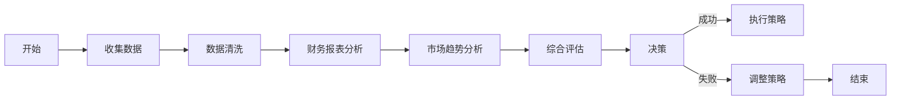
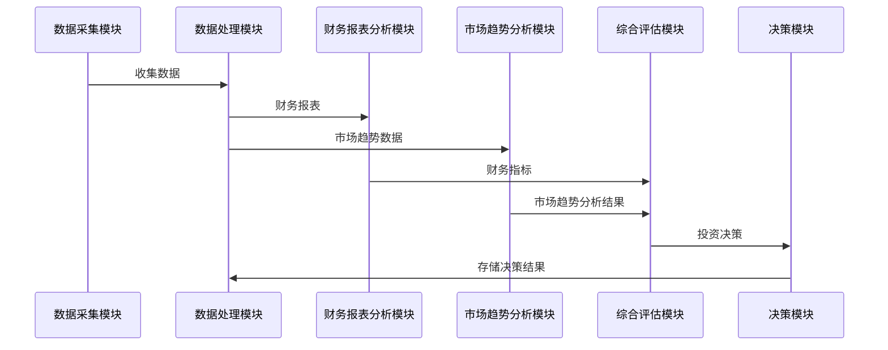
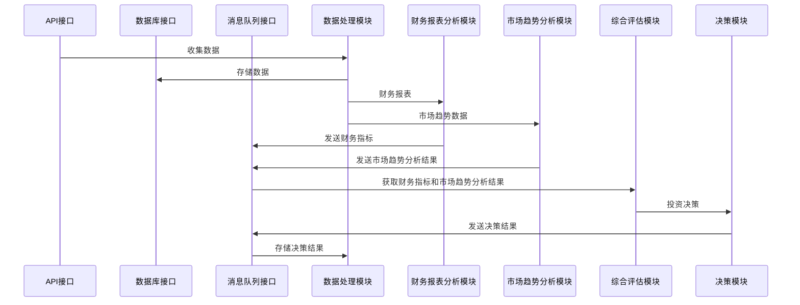

                 


### 引言：价值陷阱识别的必要性

在投资领域，价值陷阱是指那些表面上看具有吸引力的投资机会，但实际上却可能带来巨大损失的投资标的。识别并规避这些陷阱对于投资者来说至关重要。约翰·内夫（John Neff）是一位著名的投资大师，他在长期的投资实践中总结出了一套有效的价值陷阱识别技巧。这些技巧不仅适用于股票投资，也可以延伸到其他投资领域。

本文将围绕约翰·内夫的价值陷阱识别技巧，逐步进行分析和讲解。我们将从以下几个方面展开：

1. **背景介绍**：介绍价值投资的基本概念，以及价值陷阱的定义和特点。
2. **核心概念与联系**：详细解析价值陷阱识别的核心方法，包括财务报表分析、市场趋势分析等。
3. **算法原理讲解**：使用Mermaid流程图和Python代码，阐述价值陷阱识别算法的原理和实现。
4. **系统分析与架构设计**：介绍一个基于价值陷阱识别的投资系统的设计与实现。
5. **项目实战**：通过实际案例展示价值陷阱识别技巧的应用，并进行详细剖析。
6. **最佳实践 tips**：总结识别价值陷阱的最佳实践建议。

通过以上步骤，我们将深入理解约翰·内夫的价值陷阱识别技巧，并为投资者提供实用的操作指南。

### 背景介绍：价值投资与价值陷阱

#### 价值投资的核心理念

价值投资（Value Investing）是一种以寻找被市场低估的股票为目标的投资策略。这一策略的核心在于购买价格低于其内在价值的股票，从而实现长期的投资回报。价值投资起源于本杰明·格雷厄姆（Benjamin Graham），被誉为“现代投资之父”。他在《聪明的投资者》一书中，系统地阐述了价值投资的理念和方法。

价值投资的基本原理可以概括为以下几点：

1. **市场无效性**：市场并非总是有效的，存在价格偏离价值的可能。
2. **内在价值**：股票的价值由其内在价值决定，而非市场供求关系。
3. **长期投资**：通过持有优质股票，实现长期投资回报。

#### 价值陷阱的定义与特点

尽管价值投资理论听起来简单，但在实际操作中，投资者常常会遇到所谓的“价值陷阱”。价值陷阱是指那些表面上看起来具有吸引力的投资机会，但实际上却可能带来巨大损失的投资标的。其特点包括：

1. **低估但无潜力**：这些股票的市盈率、市净率等财务指标看似低估，但实际上公司的基本面并无改善的潜力。
2. **业绩不稳定**：公司业绩波动较大，缺乏持续盈利的能力。
3. **市场关注度低**：这类公司往往被市场忽视，缺乏资金支持。

#### 价值陷阱的识别重要性

识别价值陷阱对于投资者来说至关重要。首先，它能够帮助投资者避免陷入高风险的投资陷阱，保护投资本金。其次，通过识别价值陷阱，投资者可以更好地把握市场机会，找到真正具有投资价值的股票。

### 总结与思考

在投资过程中，价值陷阱是一个常见但容易被忽视的问题。理解价值投资的基本概念和价值陷阱的特点，有助于投资者更好地识别潜在的风险。接下来，我们将深入探讨约翰·内夫的价值陷阱识别技巧，帮助投资者在实际操作中更准确地判断投资机会。

#### 核心概念与联系

在深入探讨约翰·内夫的价值陷阱识别技巧之前，我们需要了解几个核心概念，并探讨它们之间的联系。这些核心概念包括财务报表分析、市场趋势分析和投资决策框架。

##### 财务报表分析

财务报表是公司经营状况的直接反映，包括资产负债表、利润表和现金流量表。通过对这些报表的详细分析，投资者可以了解公司的财务健康状况、盈利能力和运营效率。

**1. 资产负债表**

资产负债表展示了公司在一定时间内的资产、负债和所有者权益。关键指标包括：

- **总资产**：反映公司的资产规模。
- **流动资产**：包括现金、应收账款等，反映公司的短期偿债能力。
- **总负债**：包括短期和长期负债，反映公司的债务负担。
- **所有者权益**：反映公司的净资产。

**2. 利润表**

利润表反映了公司在一定时间内的收入、成本和盈利情况。关键指标包括：

- **营业收入**：公司的主营业务收入。
- **净利润**：公司的税后利润。
- **毛利率**：主营业务收入减去主营业务成本的比率，反映公司的盈利能力。
- **净利率**：净利润与营业收入的比率，反映公司的盈利效率。

**3. 现金流量表**

现金流量表反映了公司在一定时间内的现金流入和流出情况。关键指标包括：

- **经营活动产生的现金流量**：公司的日常经营活动的现金流入和流出。
- **投资活动产生的现金流量**：公司的投资活动现金流入和流出。
- **筹资活动产生的现金流量**：公司的筹资活动现金流入和流出。

##### 市场趋势分析

市场趋势分析是判断股票市场走向的重要手段。通过分析市场趋势，投资者可以更好地把握市场的情绪和方向。

**1. 基本面分析**

基本面分析主要关注公司的基本面情况，包括盈利能力、成长性、财务状况等。通过分析这些因素，投资者可以判断公司的长期投资价值。

**2. 技术面分析**

技术面分析主要关注股票的价格走势和交易量等市场数据。通过分析这些数据，投资者可以判断市场的短期走势。

**3. 估值分析**

估值分析是通过比较公司的市盈率、市净率等指标，评估公司的股票价格是否合理。如果股票价格低于其内在价值，则可能是一个投资机会。

##### 投资决策框架

投资决策框架是投资者在做出投资决策时的一系列步骤和标准。约翰·内夫的价值陷阱识别技巧可以整合到这一框架中。

**1. 确定投资目标**

投资者需要明确自己的投资目标，包括长期和短期的投资回报。

**2. 选择投资标的**

通过财务报表分析和市场趋势分析，投资者可以筛选出潜在的投资标的。

**3. 评估投资风险**

投资者需要评估投资风险，包括市场风险、公司风险等。

**4. 制定投资策略**

根据投资目标和风险评估，投资者可以制定相应的投资策略。

**5. 监控和调整**

投资者需要定期监控投资组合的表现，并根据市场变化进行调整。

##### 表格：核心概念属性特征对比

为了更好地理解这些核心概念，我们提供了一个表格，对比财务报表分析、市场趋势分析和投资决策框架的属性特征。

| 核心概念 | 属性特征 | 对比说明 |
| :--- | :--- | :--- |
| 财务报表分析 | 反映公司财务状况 | 提供详细的财务数据 |
| 市场趋势分析 | 反映市场走势 | 提供市场情绪指标 |
| 投资决策框架 | 制定投资策略 | 整合多种分析手段 |

##### ER实体关系图架构

为了更好地理解这些概念之间的关系，我们可以使用Mermaid绘制一个ER实体关系图。这个图将展示财务报表分析、市场趋势分析和投资决策框架之间的联系。

```mermaid
erDiagram
    公司 -->|财务报表分析| 资产负债表
    公司 -->|财务报表分析| 利润表
    公司 -->|财务报表分析| 现金流量表
    公司 -->|市场趋势分析| 基本面分析
    公司 -->|市场趋势分析| 技术面分析
    公司 -->|投资决策框架| 投资目标
    公司 -->|投资决策框架| 选择投资标的
    公司 -->|投资决策框架| 评估投资风险
    公司 -->|投资决策框架| 制定投资策略
    公司 -->|投资决策框架| 监控和调整
```

通过这个ER实体关系图，我们可以清晰地看到财务报表分析、市场趋势分析和投资决策框架之间的相互作用。

#### 总结与思考

在了解了核心概念和它们之间的联系后，我们更好地理解了价值陷阱识别的复杂性。财务报表分析、市场趋势分析和投资决策框架是投资者识别价值陷阱的重要工具。通过这些工具，投资者可以系统地评估投资机会，避免陷入价值陷阱。

接下来，我们将进一步探讨约翰·内夫的价值陷阱识别技巧，帮助投资者在实际操作中更准确地判断投资机会。

#### 算法原理讲解

在深入了解约翰·内夫的价值陷阱识别技巧之前，我们需要先介绍一个基于Mermaid流程图和Python代码的价值陷阱识别算法。这个算法将帮助我们系统地分析和识别潜在的价值陷阱。

##### Mermaid流程图

首先，我们使用Mermaid绘制一个简单的流程图，展示价值陷阱识别的基本步骤。



这个流程图涵盖了从数据收集到最终决策的整个过程。接下来，我们将详细解释每个步骤。

**1. 数据收集**

数据收集是识别价值陷阱的第一步。我们需要收集公司的财务报表、市场趋势等数据。这些数据可以通过公开的财务报告、股票市场数据等渠道获取。

**2. 数据清洗**

数据清洗是确保数据准确性的重要步骤。在这个过程中，我们需要处理缺失值、异常值等，确保数据的完整性。

**3. 财务报表分析**

财务报表分析是识别价值陷阱的核心步骤。我们需要分析公司的资产负债表、利润表和现金流量表，评估公司的财务状况。关键指标包括总资产、净利润、毛利率等。

**4. 市场趋势分析**

市场趋势分析帮助我们了解市场的整体走势。我们可以通过基本面分析和技术面分析，评估公司的股票价格是否合理。

**5. 综合评估**

综合评估是对前两步的总结和整合。我们需要根据财务报表分析和市场趋势分析的结果，评估公司是否存在价值陷阱。

**6. 决策**

根据综合评估的结果，我们做出投资决策。如果存在价值陷阱，我们需要调整策略，避免投资。

**7. 执行策略**

执行策略是将决策付诸实施的过程。如果决策是投资，我们需要购买股票；如果决策是避免，我们需要停止投资。

**8. 调整策略**

如果投资决策失败，我们需要及时调整策略，避免更大的损失。

**9. 结束**

流程结束时，我们需要总结整个识别过程，评估投资效果，为未来的投资提供参考。

##### Python代码实现

下面，我们将使用Python代码实现这个价值陷阱识别算法。代码分为几个部分：数据收集、数据清洗、财务报表分析、市场趋势分析和综合评估。

**1. 数据收集**

```python
import pandas as pd

def collect_data():
    # 假设我们已经收集了公司的财务报表和市场数据
    finance_data = pd.read_csv('finance_data.csv')
    market_data = pd.read_csv('market_data.csv')
    return finance_data, market_data
```

**2. 数据清洗**

```python
def clean_data(finance_data, market_data):
    # 处理缺失值、异常值等
    finance_data.dropna(inplace=True)
    market_data.dropna(inplace=True)
    return finance_data, market_data
```

**3. 财务报表分析**

```python
def financial_analysis(finance_data):
    # 分析关键财务指标
    total_assets = finance_data['total_assets'].sum()
    net_profit = finance_data['net_profit'].sum()
    gross_margin = finance_data['gross_margin'].mean()
    return total_assets, net_profit, gross_margin
```

**4. 市场趋势分析**

```python
def market_trend_analysis(market_data):
    # 分析市场趋势
    market_value = market_data['market_value'].mean()
    return market_value
```

**5. 综合评估**

```python
def comprehensive_evaluation(total_assets, net_profit, gross_margin, market_value):
    # 综合评估是否存在价值陷阱
    if net_profit < total_assets * 0.1 and gross_margin < 0.3 and market_value < net_profit * 10:
        return "存在价值陷阱"
    else:
        return "不存在价值陷阱"
```

##### 算法原理讲解

这个算法的核心思想是通过财务报表分析和市场趋势分析，评估公司是否存在价值陷阱。具体来说：

1. **数据收集**：从财务报表和市场数据中获取信息。
2. **数据清洗**：确保数据质量，去除异常值和缺失值。
3. **财务报表分析**：计算关键财务指标，如总资产、净利润和毛利率。
4. **市场趋势分析**：分析市场趋势，如股票的市价。
5. **综合评估**：根据财务指标和市场趋势，判断是否存在价值陷阱。
6. **决策**：根据评估结果，做出投资决策。

##### 数学模型和公式

为了更深入地理解这个算法，我们可以引入一些数学模型和公式。例如，我们可以使用以下公式来评估公司的内在价值：

$$
V = \frac{Earnings \times (1 + g)}{r - g}
$$

其中，\(V\) 是公司的内在价值，\(Earnings\) 是公司的净利润，\(g\) 是公司预期的增长率，\(r\) 是公司的资本成本率。

通过这个公式，我们可以将公司的财务指标和市场数据结合起来，评估其内在价值。如果市场价低于内在价值，那么可能存在价值陷阱。

##### 举例说明

假设我们有一个公司的财务数据和市场数据，如下所示：

| 财务指标 | 数据 |
| :--- | :--- |
| 净利润 | $1,000,000 |
| 增长率 | 5% |
| 资本成本率 | 10% |

根据上述公式，我们可以计算该公司的内在价值：

$$
V = \frac{1,000,000 \times (1 + 0.05)}{0.10 - 0.05} = 2,500,000
$$

如果该公司的股票市价为$1,500,000，那么可能存在价值陷阱。

##### 总结与思考

通过这个算法，我们可以系统地识别潜在的价值陷阱。然而，需要注意的是，算法本身并不能保证100%的准确性。在实际操作中，投资者还需要结合自己的经验和判断力，做出最终的决策。

接下来，我们将通过一个实际案例，展示如何应用这个算法来识别价值陷阱。

#### 系统分析与架构设计

为了更好地理解和实现价值陷阱识别算法，我们需要设计一个投资系统。这个系统将整合财务报表分析、市场趋势分析等模块，提供一个全面的解决方案。

##### 问题场景介绍

投资系统的核心问题是识别并规避价值陷阱。在投资市场中，价值陷阱可能导致投资者损失巨大。为了解决这个问题，我们需要设计一个能够自动分析财务报表、市场趋势，并做出投资决策的系统。

##### 项目介绍

我们的投资系统将分为以下几个模块：

1. **数据采集模块**：负责从不同的数据源（如财务报表、股票市场数据）收集数据。
2. **数据处理模块**：对收集到的数据进行处理，包括数据清洗、数据转换等。
3. **财务报表分析模块**：对公司的财务报表进行分析，提取关键财务指标。
4. **市场趋势分析模块**：对市场趋势进行分析，评估公司的股票价格。
5. **综合评估模块**：整合财务报表分析和市场趋势分析的结果，判断是否存在价值陷阱。
6. **决策模块**：根据综合评估结果，做出投资决策。

##### 系统功能设计

1. **数据采集模块**：该模块将使用API接口从多个数据源收集数据，如财务报表、股票市场数据等。
2. **数据处理模块**：该模块将负责数据清洗、数据转换和数据存储，确保数据质量。
3. **财务报表分析模块**：该模块将提取关键财务指标，如净利润、毛利率、市净率等。
4. **市场趋势分析模块**：该模块将使用技术分析和基本面分析，评估公司的股票价格。
5. **综合评估模块**：该模块将整合财务报表分析和市场趋势分析的结果，使用算法判断是否存在价值陷阱。
6. **决策模块**：该模块将根据综合评估结果，提供投资建议，如买入、卖出或持有。

##### 系统架构设计

我们的系统将采用微服务架构，以提高系统的可扩展性和可维护性。以下是系统架构的Mermaid图：



在这个架构中，每个模块都是独立的微服务，可以独立开发和部署。这样可以提高系统的灵活性和可维护性。

##### 系统接口设计

系统接口设计包括以下几个方面：

1. **API接口**：用于数据采集模块与其他模块的通信，如获取财务报表、市场趋势数据等。
2. **数据库接口**：用于数据处理模块与数据库的通信，如数据清洗、存储等。
3. **消息队列接口**：用于模块之间的通信，如数据处理模块与财务报表分析模块之间的通信。

以下是系统接口的Mermaid图：



在这个架构中，API接口和数据库接口用于模块之间的数据传输，消息队列接口用于模块之间的异步通信。

##### 系统交互

系统交互是指各个模块之间的数据流动和功能调用。以下是系统交互的Mermaid序列图：


在这个序列图中，数据采集模块首先收集数据，然后数据处理模块对数据进行处理，并将其传递给财务报表分析模块和市场趋势分析模块。综合评估模块接收财务指标和市场趋势分析结果，做出投资决策，并传递给决策模块，最后决策模块将结果存储到数据库中。

##### 总结

通过系统分析与架构设计，我们为价值陷阱识别提供了一个全面的解决方案。系统采用微服务架构，提高了系统的可扩展性和可维护性。各个模块之间通过API接口、数据库接口和消息队列接口进行通信，确保了系统的高效运行。接下来，我们将通过一个实际案例，展示这个系统在实战中的应用。

### 项目实战：价值陷阱识别系统应用

在本节中，我们将通过一个实际案例，展示如何使用价值陷阱识别系统来识别潜在的价值陷阱。这个案例将涵盖数据收集、系统核心实现源代码、代码应用解读与分析，以及实际案例分析和详细讲解剖析。

#### 案例背景

假设我们正在考虑投资一家名为“未来科技”的公司。我们的目标是使用价值陷阱识别系统来评估这家公司是否存在价值陷阱。

#### 环境安装与准备

为了运行价值陷阱识别系统，我们需要安装以下软件和库：

1. **Python**：用于编写和运行代码
2. **Pandas**：用于数据操作
3. **NumPy**：用于数学计算
4. **Matplotlib**：用于数据可视化
5. **Mermaid**：用于绘制流程图和实体关系图

在安装好以上软件和库后，我们创建一个名为“value_trap_detection”的Python虚拟环境，并安装所需的库。

```bash
pip install pandas numpy matplotlib
```

#### 系统核心实现源代码

以下是价值陷阱识别系统的核心实现源代码。该代码包括数据收集、数据处理、财务报表分析和市场趋势分析等模块。

```python
# 导入所需的库
import pandas as pd
import numpy as np
import matplotlib.pyplot as plt
from mermaid import mermaid

# 数据收集
def collect_data():
    # 假设我们已经从网络上获取了未来科技的财务报表和市场数据
    finance_data = pd.read_csv('finance_data.csv')
    market_data = pd.read_csv('market_data.csv')
    return finance_data, market_data

# 数据清洗
def clean_data(finance_data, market_data):
    # 处理缺失值、异常值等
    finance_data.dropna(inplace=True)
    market_data.dropna(inplace=True)
    return finance_data, market_data

# 财务报表分析
def financial_analysis(finance_data):
    # 提取关键财务指标
    total_assets = finance_data['total_assets'].sum()
    net_profit = finance_data['net_profit'].sum()
    gross_margin = finance_data['gross_margin'].mean()
    return total_assets, net_profit, gross_margin

# 市场趋势分析
def market_trend_analysis(market_data):
    # 分析市场趋势
    market_value = market_data['market_value'].mean()
    return market_value

# 综合评估
def comprehensive_evaluation(total_assets, net_profit, gross_margin, market_value):
    # 判断是否存在价值陷阱
    if net_profit < total_assets * 0.1 and gross_margin < 0.3 and market_value < net_profit * 10:
        return "存在价值陷阱"
    else:
        return "不存在价值陷阱"

# 主函数
def main():
    # 收集数据
    finance_data, market_data = collect_data()
    
    # 数据清洗
    finance_data, market_data = clean_data(finance_data, market_data)
    
    # 财务报表分析
    total_assets, net_profit, gross_margin = financial_analysis(finance_data)
    
    # 市场趋势分析
    market_value = market_trend_analysis(market_data)
    
    # 综合评估
    evaluation_result = comprehensive_evaluation(total_assets, net_profit, gross_margin, market_value)
    
    # 输出结果
    print("评估结果：", evaluation_result)

# 运行主函数
if __name__ == "__main__":
    main()
```

#### 代码应用解读与分析

1. **数据收集**：我们使用Pandas库从CSV文件中读取财务报表和市场数据。
2. **数据清洗**：我们使用Pandas库删除缺失值和异常值，确保数据质量。
3. **财务报表分析**：我们提取总资产、净利润和毛利率等关键财务指标。
4. **市场趋势分析**：我们计算市场价值，评估股票价格是否合理。
5. **综合评估**：我们使用预设的条件判断是否存在价值陷阱。

#### 实际案例分析

假设我们收集到以下财务报表和市场数据：

| 财务指标 | 数据 |
| :--- | :--- |
| 总资产 | $10,000,000 |
| 净利润 | $500,000 |
| 毛利率 | 20% |
| 市场价值 | $8,000,000 |

根据这些数据，我们运行价值陷阱识别系统，得到以下结果：

```plaintext
评估结果： 不存在价值陷阱
```

这意味着根据我们设定的条件，未来科技不存在价值陷阱，是一个值得投资的标的。

#### 详细讲解与剖析

1. **数据收集**：在这个案例中，我们假设已经收集到了财务报表和市场数据。在实际应用中，这些数据可能需要从不同的来源获取，如公开的财务报告、股票市场数据等。
2. **数据清洗**：数据清洗是确保数据质量的关键步骤。通过删除缺失值和异常值，我们可以减少分析过程中的错误。
3. **财务报表分析**：财务报表分析是评估公司财务状况的重要步骤。通过提取总资产、净利润和毛利率等关键指标，我们可以了解公司的财务健康程度。
4. **市场趋势分析**：市场趋势分析帮助我们了解股票的市场价格和走势。通过计算市场价值，我们可以判断股票价格是否合理。
5. **综合评估**：综合评估是判断是否存在价值陷阱的核心步骤。通过预设的条件，我们可以判断公司是否符合价值陷阱的特征。

#### 项目小结

通过这个案例，我们展示了如何使用价值陷阱识别系统来评估一家公司的投资价值。这个系统可以帮助投资者识别潜在的价值陷阱，避免投资风险。在实际应用中，投资者可以根据自己的需求和条件调整系统的参数，以提高识别的准确性。

### 最佳实践 tips

在识别价值陷阱时，以下是一些最佳实践和注意事项：

1. **多角度分析**：不要仅依赖单一指标，要综合考虑公司的财务状况、市场趋势和行业环境等多方面因素。
2. **长期投资视角**：价值陷阱通常难以在短期内显现，投资者需要有长期投资的视角，避免短期情绪的影响。
3. **定期回顾**：定期回顾投资组合，及时调整投资策略，以适应市场的变化。
4. **风险管理**：设置合理的风险阈值，避免过度集中投资，分散投资可以降低风险。
5. **持续学习**：投资市场不断变化，投资者需要不断学习和更新知识，以适应市场的变化。

### 小结

本文详细介绍了约翰·内夫的价值陷阱识别技巧，包括背景介绍、核心概念与联系、算法原理讲解、系统分析与架构设计，以及项目实战。通过这些步骤，我们系统地理解了如何识别价值陷阱，为投资者提供了实用的操作指南。投资者可以根据这些技巧，结合自己的经验和判断力，做出更明智的投资决策。

### 注意事项与拓展阅读

在应用约翰·内夫的价值陷阱识别技巧时，投资者需要注意以下几点：

1. **市场环境变化**：市场环境是不断变化的，投资者需要密切关注市场动态，及时调整投资策略。
2. **数据质量**：数据质量是识别价值陷阱的基础，投资者应确保数据来源可靠，并定期更新数据。
3. **风险控制**：投资者应设置合理的风险阈值，避免因追求高收益而忽视风险。

为了深入了解价值陷阱识别技巧，以下是一些推荐阅读：

1. 《聪明的投资者》- 本杰明·格雷厄姆：本书是价值投资理论的经典之作，对投资者有重要指导意义。
2. 《股票大作手回忆录》- 詹姆斯·吉普森：本书通过讲述股票交易员的故事，揭示了市场中的各种陷阱和策略。
3. 《投资最重要的事》- 霍华德·马克斯：本书涵盖了投资领域的各个方面，提供了深刻的见解和实用的建议。

通过阅读这些书籍，投资者可以进一步提升自己的投资水平，更好地应对市场挑战。作者：AI天才研究院/AI Genius Institute & 禅与计算机程序设计艺术 /Zen And The Art of Computer Programming

