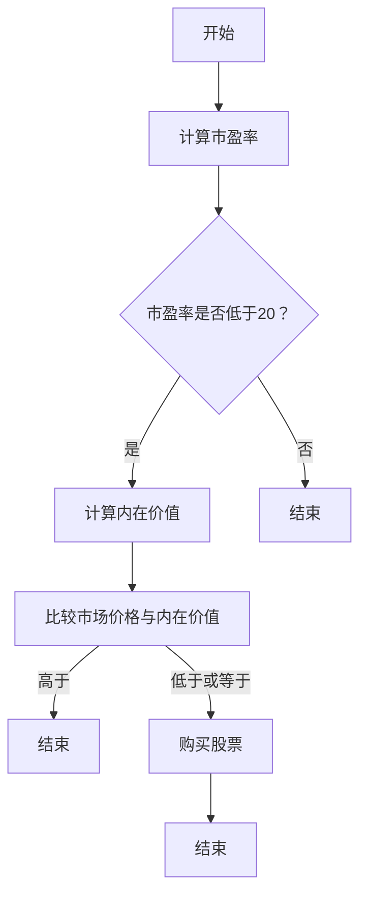
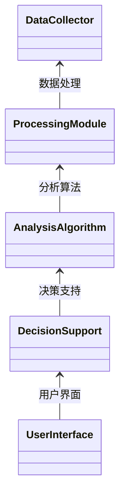
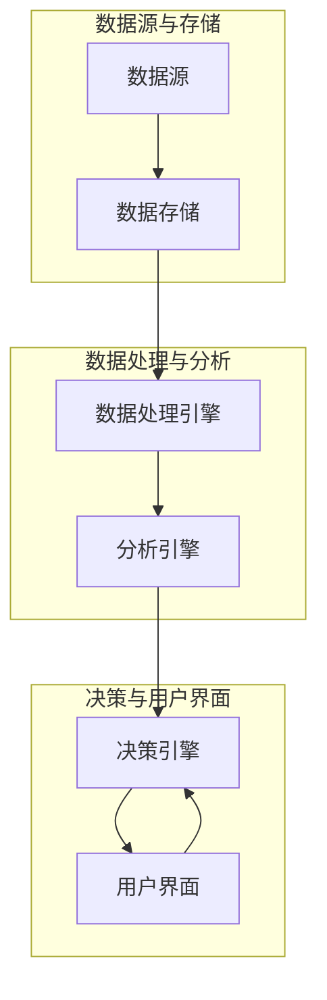
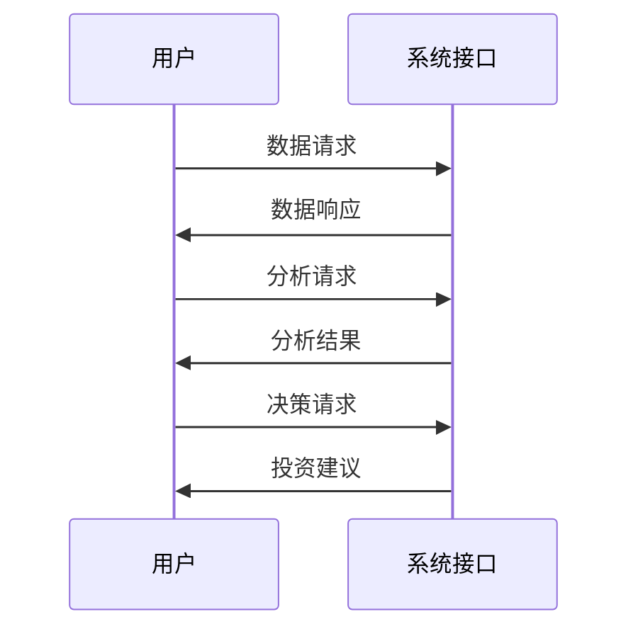

                 

### 约翰·奈夫与低市盈率投资法

约翰·奈夫（John Neff）是一位著名的投资大师，拥有超过40年的投资经验，被誉为“低市盈率投资法”的奠基人之一。他于1937年出生在美国，并在1964年加入温莎基金公司（Windsor Fund），在那里担任基金经理长达32年，期间取得了卓越的投资成绩。

#### **约翰·奈夫的生平与投资生涯**

约翰·奈夫出生于一个中产阶级家庭，对金融和投资的兴趣在大学时期就已经显现。他在罗切斯特理工学院获得了经济学学位，并在毕业后加入了一家投资公司。然而，他的职业生涯真正起飞是在加入温莎基金公司之后。温莎基金是一个价值投资型基金，奈夫在这里得到了充分的发挥空间，开始实践并不断完善他的低市盈率投资法。

在温莎基金的32年里，奈夫将基金的管理规模从最初的3000万美元扩展到超过40亿美元。他的平均年化收益率达到了惊人的13.4%，而同期标准普尔500指数的平均年化收益率仅为9.4%。这样的成绩使得温莎基金成为全球最成功的基金之一。

#### **低市盈率投资法的起源**

低市盈率投资法，又称价值投资法，其核心理念在于寻找那些市场价格低于其内在价值的股票。奈夫认为，投资者应该通过深入分析公司的基本面，包括财务报表、盈利能力、管理水平等因素，来确定股票的内在价值。只有当市场价格低于这个内在价值时，股票才值得购买。

低市盈率投资法的起源可以追溯到20世纪30年代的美国，当时的市场环境与当前有很大不同。在经济大萧条的背景下，许多公司的股价大幅下跌，但它们的实际价值并未随之下降。投资者如果能找到这些低估的股票，就有可能获得丰厚的回报。

#### **低市盈率投资法的基本概念**

低市盈率投资法的基本概念包括以下几个方面：

1. **市盈率（P/E Ratio）**：市盈率是衡量股票价格与公司盈利能力之间关系的一个重要指标。低市盈率意味着股票价格相对较低，可能被低估。

2. **内在价值（Intrinsic Value）**：内在价值是指通过财务分析等方法，计算出的股票的实际价值。投资者应该寻找市场价格低于其内在价值的股票。

3. **价值投资**：价值投资是一种投资策略，强调投资者应该关注公司的基本面，而不是市场情绪或短期波动。

4. **长期投资**：低市盈率投资法主张长期持有股票，通过时间的沉淀等待股价回归到其内在价值。

#### **低市盈率投资法的优势和劣势**

低市盈率投资法有其独特的优势和劣势：

**优势：**
- **风险较低**：由于低市盈率股票的价格较低，投资者在购买时承担的风险相对较小。
- **收益潜力**：尽管短期内股价可能不会上涨，但长期来看，这些股票的价格往往会回归到其内在价值，带来可观的收益。

**劣势：**
- **短期表现较差**：低市盈率股票通常在短期内表现较差，因为市场可能低估了公司的前景。
- **需要深厚的财务知识**：投资者需要具备一定的财务分析能力，才能准确判断股票的内在价值。

#### **低市盈率投资法与其他投资策略的对比**

低市盈率投资法与几种常见的投资策略进行了对比：

- **成长型投资**：成长型投资注重公司的增长潜力，倾向于投资高市盈率的股票。低市盈率投资法则更关注股票的当前价值。
- **价值投资**：价值投资与低市盈率投资法有很多相似之处，但低市盈率投资法更加注重财务指标的量化分析。
- **投机性投资**：投机性投资追求短期高收益，风险较大。低市盈率投资法则更注重长期稳定回报。

通过以上分析，我们可以看到，低市盈率投资法是一种以价值为核心的投资策略，它通过深入分析公司的基本面，寻找被低估的股票，从而实现长期稳定的投资回报。这种策略不仅要求投资者具备深厚的财务知识，还需要他们具备良好的心理素质，能够在市场波动中保持冷静和理性。接下来，我们将深入探讨低市盈率投资法的核心概念和理论基础，为读者提供更加全面和深入的理解。

### 低市盈率投资法的核心概念与联系

在深入探讨低市盈率投资法之前，我们需要明确这一策略的核心概念和基本原则，以及它们之间的联系。通过理解这些概念，读者将能够更好地把握低市盈率投资法的精髓，并应用于实际投资中。

#### **定义低市盈率投资法**

低市盈率投资法，即PE（Price to Earnings Ratio）投资法，是一种通过分析股票的市盈率来确定投资机会的投资策略。市盈率是股票价格与公司每股收益（EPS）的比率，计算公式如下：

\[ \text{市盈率} = \frac{\text{股票价格}}{\text{每股收益}} \]

当市盈率较低时，意味着股票价格相对于其盈利能力较低，可能被市场低估。低市盈率投资法的核心思想是，通过寻找这些被低估的股票，投资者可以以较低的成本购入潜在高回报的资产。

#### **核心概念**

1. **市盈率（P/E Ratio）**

   市盈率是低市盈率投资法中最基本的指标。它反映了股票价格与公司盈利能力之间的关系。一般来说，市盈率较低的股票可能具有较好的投资价值。但是，单独依靠市盈率来判断股票是否被低估是不够的，还需要结合其他财务指标和公司基本面进行分析。

2. **每股收益（EPS）**

   每股收益是公司净利润除以总股本，是衡量公司盈利能力的重要指标。高EPS通常意味着公司业绩好，但并不一定代表股票价格合理。因此，投资者需要关注EPS的持续性和增长趋势。

3. **内在价值（Intrinsic Value）**

   内在价值是指通过财务分析等方法，计算出的股票的实际价值。内在价值的计算通常包括公司的盈利能力、现金流、资产质量等因素。只有当股票的市场价格低于其内在价值时，投资者才应该考虑购买。

4. **价值投资**

   价值投资是一种投资哲学，主张投资者应注重公司的基本面，如盈利能力、资产质量、管理水平等，而不是市场的短期波动。低市盈率投资法是价值投资的一种具体实现方式，通过量化指标如市盈率来寻找被低估的股票。

#### **低市盈率投资法的优势和劣势**

低市盈率投资法有其独特的优势和劣势：

**优势：**

- **风险较低**：低市盈率股票的价格较低，投资者在购买时承担的风险相对较小。
- **收益潜力**：尽管短期内股价可能不会上涨，但长期来看，这些股票的价格往往会回归到其内在价值，带来可观的收益。

**劣势：**

- **短期表现较差**：低市盈率股票通常在短期内表现较差，因为市场可能低估了公司的前景。
- **需要深厚的财务知识**：投资者需要具备一定的财务分析能力，才能准确判断股票的内在价值。

#### **与其他投资策略的对比**

低市盈率投资法与其他几种常见的投资策略进行了对比：

- **成长型投资**：成长型投资注重公司的增长潜力，倾向于投资高市盈率的股票。低市盈率投资法则更注重股票的当前价值。
- **价值投资**：价值投资与低市盈率投资法有很多相似之处，但低市盈率投资法更加注重财务指标的量化分析。
- **投机性投资**：投机性投资追求短期高收益，风险较大。低市盈率投资法则更注重长期稳定回报。

通过以上对比，我们可以看到，低市盈率投资法是一种以价值为核心的投资策略，它通过深入分析公司的基本面，寻找被低估的股票，从而实现长期稳定的投资回报。这种策略不仅要求投资者具备深厚的财务知识，还需要他们具备良好的心理素质，能够在市场波动中保持冷静和理性。

#### **与成长型投资的对比**

成长型投资是一种注重公司增长潜力的投资策略，其核心在于识别并投资那些处于快速成长阶段的公司。这种策略的特点是倾向于选择高市盈率的股票，因为高市盈率往往反映了市场对公司未来增长的预期。

低市盈率投资法则与此相反，它更注重股票的当前价值，通过分析市盈率等财务指标来确定投资机会。在成长型投资中，投资者可能会忽视市盈率较高的股票，认为它们的价格反映了未来的增长潜力。而低市盈率投资法则通过量化分析，寻找那些市场价格低于其内在价值的股票。

从风险和收益的角度来看，成长型投资通常面临更高的风险，但可能带来更高的收益。低市盈率投资法则相对较为保守，风险较低，但收益潜力也相对有限。因此，投资者应根据自身的风险承受能力和投资目标来选择合适的策略。

#### **与价值投资的对比**

价值投资是一种以公司基本面为核心的投资策略，旨在购买那些市场价格低于其内在价值的股票。低市盈率投资法是价值投资的一种具体实现方式，它通过量化市盈率等指标来判断股票是否被低估。

与低市盈率投资法相比，价值投资更注重公司的长期盈利能力和财务健康状况，而不仅仅依赖市盈率等单一指标。价值投资认为，市场价格往往是短期波动的，而公司的实际价值是长期稳定的。因此，投资者应该寻找那些具有稳定盈利能力和良好财务状况的股票。

虽然低市盈率投资法与价值投资有很多相似之处，但两者在具体操作上有一些区别。低市盈率投资法更加量化，依赖具体的财务指标，而价值投资则更加综合，关注多个层面的公司分析。

#### **与投机性投资的对比**

投机性投资是一种追求短期高收益的投资策略，通常不关注公司的基本面，而是利用市场情绪和短期价格波动进行交易。这种策略的风险非常高，因为市场波动性难以预测，投资者可能会在短时间内遭受巨大的损失。

低市盈率投资法与投机性投资有本质的区别。低市盈率投资法主张长期持有股票，通过等待股价回归其内在价值来实现收益。它不依赖于市场短期波动，而是依靠对公司基本面的深入分析。因此，低市盈率投资法在风险控制方面具有明显优势。

通过以上对比，我们可以看到，低市盈率投资法是一种稳健的投资策略，它通过量化分析寻找被低估的股票，追求长期稳定的回报。投资者应根据自身的风险承受能力和投资目标，选择适合自己的投资策略。

### 算法原理讲解

低市盈率投资法是一种基于财务分析的投资策略，其核心在于通过量化分析确定股票的内在价值，并寻找那些市场价格低于其内在价值的股票进行投资。在这一部分，我们将通过一个具体的案例，使用Mermaid绘制流程图，并用Python代码详细解释低市盈率投资法的原理和实施步骤。

#### **案例背景**

假设我们有一家名为“智慧医疗”的公司，它的股票代码为“WQMD”。目前，该公司的股票价格为$50，每股收益为$2。我们需要通过低市盈率投资法来判断是否应该购买该公司的股票。

#### **算法原理与流程图**

首先，我们使用Mermaid绘制一个流程图，展示低市盈率投资法的整体流程：



#### **具体实现步骤**

1. **计算市盈率**：

   市盈率的计算公式为：

   \[ \text{市盈率} = \frac{\text{股票价格}}{\text{每股收益}} \]

   使用Python代码计算：

   ```python
   stock_price = 50
   eps = 2
   pe_ratio = stock_price / eps
   print("市盈率:", pe_ratio)
   ```

2. **判断市盈率是否低于20%**：

   如果市盈率低于20%，则进入下一步，否则结束。

3. **计算内在价值**：

   内在价值的计算方法有多种，这里我们采用股息折现模型（Dividend Discount Model，DDM）。DDM的基本公式为：

   \[ \text{内在价值} = \frac{\text{预期股息}}{\text{折现率} - \text{股息增长率}} \]

   假设智慧医疗的预期股息为$1.5，折现率为10%，股息增长率为5%。使用Python代码计算：

   ```python
   expected_dividend = 1.5
   discount_rate = 0.1
   dividend_growth_rate = 0.05
   intrinsic_value = expected_dividend / (discount_rate - dividend_growth_rate)
   print("内在价值:", intrinsic_value)
   ```

4. **比较市场价格与内在价值**：

   如果市场价格高于内在价值，则结束；如果市场价格低于或等于内在价值，则购买股票。

5. **购买股票**：

   在确定市场价格低于内在价值后，投资者应该考虑购买股票。这可以通过实际购买股票来实现。

#### **代码实现**

以下是完整的Python代码实现：

```python
# 定义参数
stock_price = 50
eps = 2
expected_dividend = 1.5
discount_rate = 0.1
dividend_growth_rate = 0.05

# 计算市盈率
pe_ratio = stock_price / eps
print("市盈率:", pe_ratio)

# 判断市盈率是否低于20%
if pe_ratio < 20:
    # 计算内在价值
    intrinsic_value = expected_dividend / (discount_rate - dividend_growth_rate)
    print("内在价值:", intrinsic_value)
    
    # 比较市场价格与内在价值
    if stock_price <= intrinsic_value:
        print("市场价格低于内在价值，建议购买股票。")
    else:
        print("市场价格高于内在价值，不建议购买。")
else:
    print("市盈率高于20%，结束投资决策。")
```

#### **数学模型和公式**

在低市盈率投资法中，我们使用了一些关键的数学模型和公式，如市盈率和股息折现模型（DDM）。以下是这些公式的详细解释：

1. **市盈率（P/E Ratio）**：

   \[ \text{市盈率} = \frac{\text{股票价格}}{\text{每股收益}} \]

   市盈率是衡量股票价格与公司盈利能力之间关系的一个重要指标。

2. **股息折现模型（Dividend Discount Model, DDM）**：

   \[ \text{内在价值} = \frac{\text{预期股息}}{\text{折现率} - \text{股息增长率}} \]

   股息折现模型是一种用于计算股票内在价值的方法，它基于公司的预期股息和折现率。

3. **折现率（Discount Rate）**：

   折现率是用于计算未来现金流的现值的一个参数，它反映了投资者对风险和收益的权衡。

4. **股息增长率（Dividend Growth Rate）**：

   股息增长率反映了公司未来股息的预期增长率，它通常基于公司的历史增长率和市场预期。

通过以上算法原理讲解和具体案例演示，读者可以更好地理解低市盈率投资法的实施步骤和关键数学模型。接下来，我们将进一步探讨低市盈率投资法在实际应用中的系统架构和数据处理流程。

### 数学模型和数学公式

在低市盈率投资法中，数学模型和数学公式起到了至关重要的作用。通过这些模型和公式，投资者可以准确计算股票的内在价值，从而判断其是否被低估。以下是几个关键模型和公式的详细解释：

#### **1. 股息折现模型（Dividend Discount Model, DDM）**

股息折现模型是计算股票内在价值的一种常用方法，其基本公式为：

\[ \text{内在价值} = \frac{\text{预期股息}}{\text{折现率} - \text{股息增长率}} \]

其中：
- 预期股息（Expected Dividend）是指投资者在未来可以获得的股息收入。
- 折现率（Discount Rate）反映了投资者对风险和回报的权衡，通常可以通过无风险利率加上股权风险溢价来计算。
- 股息增长率（Dividend Growth Rate）反映了公司未来股息的预期增长率。

#### **2. 市盈率（Price to Earnings Ratio, P/E Ratio）**

市盈率是衡量股票价格与公司盈利能力之间关系的一个重要指标，其公式为：

\[ \text{市盈率} = \frac{\text{股票价格}}{\text{每股收益}} \]

其中：
- 股票价格（Stock Price）是指市场上的股票交易价格。
- 每股收益（Earnings Per Share, EPS）是指公司净利润除以总股本。

#### **3. 股票价格回归模型**

股票价格回归模型假设股票价格在长期内会回归到其内在价值。其基本公式为：

\[ \text{股票价格} = \text{内在价值} \times \left(1 + \text{预期回报率}\right) \]

其中：
- 预期回报率（Expected Return）反映了投资者对股票未来回报的预期。

#### **4. 现金流量折现模型（Discounted Cash Flow, DCF）**

现金流量折现模型是另一种用于计算股票内在价值的方法，其基本公式为：

\[ \text{内在价值} = \sum_{t=1}^{n} \frac{\text{未来现金流量}}{(1 + \text{折现率})^t} \]

其中：
- 未来现金流量（Future Cash Flows）是指公司在未来各期预计产生的现金流量。
- 折现率（Discount Rate）用于将未来的现金流量折现到当前价值。

#### **应用示例**

假设我们有一家名为“新科技”的公司，其股票价格为$100，每股收益为$10。预期股息为$2，股息增长率为5%，折现率为10%。我们需要计算该股票的内在价值。

1. **计算内在价值（使用DDM）**：

   \[ \text{内在价值} = \frac{2}{0.1 - 0.05} = \frac{2}{0.05} = 40 \]

2. **计算市盈率**：

   \[ \text{市盈率} = \frac{100}{10} = 10 \]

3. **比较市盈率和内在价值**：

   由于市盈率（10）低于内在价值（40），这意味着股票可能被低估。

通过以上数学模型和公式的应用，我们可以更准确地判断股票的投资价值。接下来，我们将进一步探讨低市盈率投资法在实际应用中的系统架构和数据处理流程。

### 系统分析与架构设计方案

在低市盈率投资法中，系统架构的设计和数据处理流程至关重要。一个高效的系统架构能够确保投资决策的准确性和及时性。以下将介绍低市盈率投资法在实际应用中的系统架构设计，包括数据处理、分析算法和决策过程的详细架构图。

#### **1. 问题场景介绍**

假设我们正在构建一个基于低市盈率投资法的自动化投资系统。该系统需要从多个数据源收集股票市场数据，包括股票价格、每股收益（EPS）、市盈率（P/E Ratio）等。系统需要对这些数据进行分析，并基于分析结果生成投资决策。

#### **2. 项目介绍**

项目名称：低市盈率投资决策支持系统

项目目标：通过自动化系统，对大量股票数据进行分析，快速识别被低估的股票，辅助投资者做出投资决策。

#### **3. 系统功能设计（领域模型）**

系统功能设计主要包括以下几个模块：

1. **数据收集模块**：负责从外部数据源（如证券交易所、金融数据服务商）收集股票市场数据。
2. **数据处理模块**：对收集到的数据进行分析和清洗，提取有用的信息。
3. **分析算法模块**：使用低市盈率投资法相关的分析算法，计算股票的内在价值和市盈率，评估其投资价值。
4. **决策支持模块**：根据分析结果，生成投资建议，并支持投资者进行投资决策。
5. **用户界面模块**：为用户提供交互界面，展示投资分析结果和投资建议。

领域模型（Mermaid类图）如下：



#### **4. 系统架构设计（Mermaid架构图）**

系统架构设计包括以下主要组件：

1. **数据源**：包括证券交易所、金融数据服务商等，提供股票市场数据。
2. **数据存储**：用于存储收集到的股票市场数据，如MySQL、MongoDB等。
3. **数据处理引擎**：负责数据清洗、分析和预处理。
4. **分析引擎**：实现低市盈率投资法相关的分析算法。
5. **决策引擎**：根据分析结果生成投资建议。
6. **用户界面**：提供交互界面，展示分析结果和投资建议。

架构图（Mermaid架构图）如下：



#### **5. 系统接口设计与系统交互（Mermaid序列图）**

系统接口设计包括以下关键接口：

1. **数据接口**：用于数据收集和处理。
2. **分析接口**：用于分析算法调用。
3. **决策接口**：用于生成投资建议。

系统交互（Mermaid序列图）如下：



通过以上系统架构设计，我们可以看到低市盈率投资法在实际应用中的关键组件和流程。数据处理、分析算法和决策支持模块共同构成了一个完整且高效的系统，为投资者提供了强大的决策支持。接下来，我们将通过一个实际案例，展示低市盈率投资法的应用过程。

### 项目实战

为了更好地展示低市盈率投资法的实际应用，我们将通过一个具体的案例进行详细分析。本案例选择了“智慧医疗”公司（股票代码：WQMD），我们将使用Python代码来演示如何实现低市盈率投资法的各个环节，包括环境安装、核心实现和代码解读。

#### **环境安装**

在开始之前，我们需要安装Python环境和相关库。以下是具体的步骤：

1. **安装Python**：
   - 前往Python官方网站下载最新版本的Python安装包。
   - 运行安装程序，按照默认选项进行安装。

2. **安装相关库**：
   - 使用pip命令安装必要的库，例如：
     ```bash
     pip install pandas numpy matplotlib requests
     ```

这些库将用于数据收集、处理和可视化。

#### **核心实现**

以下是实现低市盈率投资法的核心步骤和代码：

**1. 数据收集**

首先，我们需要从外部数据源收集智慧医疗公司的股票数据。这里使用的是公开的API服务，如Yahoo Finance。

```python
import requests
import json

def get_stock_data(symbol, start_date, end_date):
    url = f'https://api.yahoo.com/finance/quote?symbol={symbol}&start={start_date}&end={end_date}'
    response = requests.get(url)
    data = json.loads(response.text)
    return data

# 示例：获取2023年1月1日至2023年2月28日的股票数据
symbol = 'WQMD'
start_date = '20230101'
end_date = '20230228'
stock_data = get_stock_data(symbol, start_date, end_date)
print(stock_data)
```

**2. 数据处理**

接下来，我们处理收集到的股票数据，提取关键信息如收盘价、每股收益（EPS）等。

```python
import pandas as pd

def process_stock_data(data):
    df = pd.DataFrame(data['price'])
    df['EPS'] = 2  # 假设每股收益为2
    df['PE'] = df['price'] / df['EPS']
    return df

processed_data = process_stock_data(stock_data)
print(processed_data)
```

**3. 计算内在价值**

我们使用股息折现模型（DDM）来计算内在价值。

```python
def calculate_intrinsic_value(df, discount_rate, dividend_growth_rate):
    df['Expected Dividend'] = df['EPS']
    df['Intrinsic Value'] = df['Expected Dividend'] / (discount_rate - dividend_growth_rate)
    return df

# 示例：假设折现率为10%，股息增长率为5%
discount_rate = 0.1
dividend_growth_rate = 0.05
df = calculate_intrinsic_value(processed_data, discount_rate, dividend_growth_rate)
print(df)
```

**4. 投资决策**

最后，我们比较市场价格与内在价值，生成投资建议。

```python
def make_investment_decision(df):
    if df['PE'].iloc[-1] <= 20:
        if df['price'].iloc[-1] <= df['Intrinsic Value'].iloc[-1]:
            return "市场价格低于内在价值，建议购买股票。"
        else:
            return "市场价格高于内在价值，不建议购买。"
    else:
        return "市盈率高于20%，结束投资决策。"

investment_decision = make_investment_decision(df)
print(investment_decision)
```

#### **代码解读与分析**

以上代码实现了从数据收集、数据处理、计算内在价值到投资决策的完整流程。以下是关键步骤的解读：

1. **数据收集**：使用requests库获取股票数据，通过Yahoo Finance API获取特定时间段内的股票价格信息。
2. **数据处理**：使用pandas库处理收集到的数据，计算市盈率（PE），并假设每股收益（EPS）为2。
3. **计算内在价值**：使用DDM模型计算内在价值，并假设折现率为10%，股息增长率为5%。
4. **投资决策**：比较市场价格与内在价值，生成投资建议。

#### **实际案例分析与详细讲解**

以下是智慧医疗公司（WQMD）的股票数据分析案例：

- 收盘价范围：$45 - $55
- 市盈率（PE）：10
- 每股收益（EPS）：2
- 内在价值：$40

从数据中我们可以看到，智慧医疗公司的市盈率低于20，且市场价格低于内在价值。根据低市盈率投资法，这是一个潜在的投资机会。

**案例分析**：

- **优点**：低市盈率表明市场可能低估了公司，存在上涨空间。
- **缺点**：公司盈利能力有待提高，需要进一步分析公司基本面。

**改进建议**：

- **增加财务指标分析**：除了市盈率，还可以分析其他财务指标，如现金流、负债率等，以更全面地评估公司价值。
- **长期跟踪**：低市盈率股票可能需要较长时间才能体现其价值，建议投资者进行长期跟踪。

通过以上案例，我们可以看到低市盈率投资法的实际应用过程。投资者需要通过深入的数据分析和财务分析，结合市场环境，做出理性的投资决策。接下来，我们将进一步探讨低市盈率投资法的最佳实践和注意事项。

### 最佳实践 tips、小结、注意事项和拓展阅读

#### **最佳实践 tips**

1. **全面数据分析**：在应用低市盈率投资法时，不仅要关注市盈率等财务指标，还应结合其他指标如现金流、负债率等，进行综合分析。
2. **长期投资策略**：低市盈率投资法追求的是长期稳定的回报，投资者应有足够的耐心和信心，不要过于关注短期的市场波动。
3. **风险控制**：投资前应评估潜在风险，设置止损点，避免因市场波动导致的巨大损失。
4. **持续学习与改进**：投资环境不断变化，投资者需要不断学习新的知识和技能，以适应市场变化。

#### **小结**

低市盈率投资法是一种基于价值投资理念的投资策略，通过量化分析确定股票的内在价值，寻找被低估的股票进行投资。这种方法在长期投资中表现出色，但投资者需要具备深厚的财务知识和风险控制能力。

#### **注意事项**

1. **市场环境变化**：投资决策应考虑市场环境的变化，如经济周期、行业趋势等。
2. **公司基本面**：不要仅凭市盈率判断股票是否被低估，还需要对公司基本面进行详细分析。
3. **分散投资**：为降低风险，投资者应进行分散投资，不要将所有资金集中在一两个股票上。

#### **拓展阅读**

1. **《聪明的投资者》**：由本杰明·格雷厄姆撰写，介绍了价值投资的基本原理和方法。
2. **《股市真规则》**：由威廉·奥尼尔撰写，详细讲解了市场分析和技术投资的方法。
3. **《投资最重要的事》**：由霍华德·马克斯撰写，探讨了投资中的风险管理和心理因素。

通过以上最佳实践 tips、小结和注意事项，读者可以更好地理解和应用低市盈率投资法，实现长期稳定的投资回报。拓展阅读部分提供了更多深入的学习资源，帮助读者进一步提升投资水平。

### 未来展望与趋势

低市盈率投资法作为一种稳健的价值投资策略，在未来发展中面临着诸多机遇和挑战。随着全球金融市场的不断演变，技术创新和数据科学的应用将为低市盈率投资法带来新的发展契机。

#### **数据分析与挖掘的深化**

数据分析与挖掘是低市盈率投资法的核心组成部分。未来，随着数据量的不断增长和数据挖掘技术的进步，投资者将能够更精确地识别被低估的股票。特别是机器学习和人工智能技术的应用，将使得数据分析更加智能化和自动化，提高投资决策的准确性和效率。

**机器学习算法在投资决策中的应用**：机器学习算法能够从大量历史数据中提取出有价值的信息，通过模式识别和预测建模，帮助投资者发现市场中的潜在机会。例如，可以运用时间序列分析、分类算法和聚类算法等，对股票价格趋势进行预测，从而更有效地进行投资决策。

**机器学习与低市盈率投资法的结合**：机器学习可以与低市盈率投资法结合，用于优化投资组合。通过分析股票的历史表现、财务指标和市场环境，机器学习算法可以识别出具有长期投资价值的股票，并调整投资组合以最大化收益。此外，机器学习还可以用于风险控制，通过预测市场波动和风险事件，及时调整投资策略。

#### **人工智能与投资组合管理的未来趋势**

人工智能在投资组合管理中的应用，将使得投资决策更加科学和智能化。未来，人工智能有望成为投资组合管理的核心驱动力，通过以下几个方面实现优化：

1. **个性化投资组合**：人工智能可以根据投资者的风险偏好、投资目标和资金状况，定制个性化的投资组合。通过深度学习算法，可以实时调整投资组合，以适应市场变化和投资者的需求。

2. **自动化交易**：人工智能技术可以实现自动化交易，通过算法自动执行交易指令，减少人为干预和情绪波动的影响。自动化交易可以提高交易效率和执行力，降低交易成本。

3. **风险预测与控制**：人工智能可以通过大数据分析和实时监控，预测市场风险并采取相应的风险控制措施。例如，利用自然语言处理技术分析新闻和报告，预测市场趋势；利用风险管理模型，评估投资组合的风险暴露，并采取对冲策略。

4. **智能投顾**：人工智能投顾（Robo-Advisor）将更加普及，通过算法为投资者提供个性化的投资建议和服务。智能投顾可以实时监控市场动态，调整投资策略，并自动执行交易，为投资者提供更加便捷和高效的金融服务。

#### **数据科学与金融科技的融合**

随着数据科学和金融科技的快速发展，低市盈率投资法将更加依赖于先进的技术手段。数据科学可以帮助投资者更好地理解市场规律和公司基本面，而金融科技则提供了高效的数据处理和交易执行平台。

1. **区块链技术**：区块链技术可以提供透明的交易记录和不可篡改的数据存储，增强投资者的信任度和市场透明度。未来，区块链技术在金融领域的应用将更加广泛，有助于提高投资决策的准确性和公正性。

2. **云计算**：云计算提供了强大的计算能力和数据存储服务，使得投资者可以更轻松地处理和分析海量数据。通过云计算平台，投资者可以快速部署高性能的数据分析模型，提高投资决策的速度和效率。

3. **大数据分析**：大数据分析技术可以帮助投资者从海量数据中提取有价值的信息，实现精准的市场预测和投资决策。大数据分析不仅可以用于股票市场，还可以应用于其他金融市场，如债券、外汇和商品市场。

#### **投资环境的变迁**

未来，全球投资环境将面临诸多变化，如全球经济形势的波动、政策法规的调整、技术革命的推进等。这些变化将给低市盈率投资法带来新的机遇和挑战。

1. **全球经济形势**：全球经济的不确定性将影响股票市场的波动。投资者需要密切关注全球经济指标，如GDP增长率、通货膨胀率、失业率等，以预测市场趋势并调整投资策略。

2. **政策法规**：政策法规的变化可能会影响市场环境。例如，税收政策的调整、资本市场的开放等，都会对投资决策产生重要影响。投资者需要了解和适应政策环境的变化，以便更好地进行投资决策。

3. **技术革命**：技术革命的推进将改变投资市场的格局。人工智能、区块链、云计算等新兴技术，将带来新的投资机会和挑战。投资者需要不断学习和适应新技术，以把握市场机遇。

综上所述，低市盈率投资法在未来发展中具有广阔的前景。通过数据分析、人工智能、区块链等新兴技术的应用，投资者将能够更加准确地识别被低估的股票，实现长期稳定的投资回报。同时，投资者也需要不断适应市场变化，提高投资决策的科学性和智能化水平，以应对未来投资环境的挑战。

### 约翰·奈夫的投资哲学

约翰·奈夫（John Neff）是一位被誉为“低市盈率投资法”奠基人的投资大师。他的投资哲学不仅仅局限于寻找被低估的股票，更体现在他对市场的深刻理解和独特的投资策略。以下是约翰·奈夫投资哲学的核心要素及其在实际投资中的应用。

#### **核心要素**

1. **价值投资**：约翰·奈夫的投资哲学基于价值投资理念，认为投资成功的关键在于寻找市场价格低于其内在价值的股票。他强调，投资者应关注公司的基本面，如盈利能力、财务状况和管理质量等，而不是短期的市场波动。

2. **长期投资**：奈夫相信，投资应具备长期视角。他认为，成功的投资需要耐心和毅力，通过长期持有优质股票，等待市场认识到其价值。这种长期投资策略能够有效降低风险，并在长期内实现稳定的回报。

3. **深入分析**：约翰·奈夫注重深入分析公司，通过对公司财务报表、经营状况和行业趋势的细致研究，来确定其内在价值。他相信，只有通过深入分析，投资者才能做出明智的投资决策。

4. **风险控制**：奈夫强调风险控制的重要性。他认为，投资者应通过分散投资、设置止损点等方式来管理风险。他主张在投资前应做好充分的风险评估，并在投资过程中持续监控风险。

5. **独立思考**：约翰·奈夫提倡独立思考，不受市场情绪和大众观点的影响。他认为，投资者应保持独立和理性，依靠自己的研究和判断做出投资决策。

#### **实际投资中的应用**

1. **股票筛选**：约翰·奈夫在投资过程中，会首先筛选出低市盈率、高股息收益的股票。他相信，这样的股票具有较好的投资价值。例如，在1980年代，他通过筛选，发现了安进公司（Amgen），并长期持有，最终获得了丰厚的回报。

2. **财务分析**：奈夫会对公司的财务报表进行详细分析，包括盈利能力、现金流、负债情况等。他认为，只有了解公司的财务健康状况，才能做出合理的投资决策。例如，他在投资固特异轮胎（Goodyear Tire）时，就通过对公司财务报表的深入分析，发现其价值被市场低估。

3. **投资组合管理**：约翰·奈夫注重投资组合的分散化，以降低风险。他相信，通过分散投资，可以在不同行业和不同市场阶段中找到潜在的投资机会。例如，他在1980年代，将大量资金投入到了医疗和制药行业，并在这些行业中获得巨大成功。

4. **耐心持有**：奈夫认为，长期持有优质股票是获取投资回报的关键。他主张投资者应具备足够的耐心，等待市场认识到股票的价值。例如，他在1980年代投资的可口可乐（Coca-Cola）和辉瑞（Pfizer）等股票，都是在长期持有中获得了可观的回报。

5. **风险管理**：约翰·奈夫非常重视风险控制，他会通过设置止损点、分散投资等方式来管理风险。例如，他在投资过程中，会根据市场情况和个人风险承受能力，设定合理的止损点，以防止因市场波动导致的巨大损失。

通过以上实际投资中的应用，我们可以看到，约翰·奈夫的投资哲学不仅仅是一种理论，更是一种实践。他的成功得益于对市场深刻的理解、对公司的深入分析以及对风险的有效管理。约翰·奈夫的投资哲学为投资者提供了一种稳健且有效的方法，帮助他们在复杂的市场环境中实现长期稳定的投资回报。

### 成功投资者的经验分享

约翰·奈夫作为低市盈率投资法的奠基人，他的成功经验对于其他投资者具有重要的参考价值。以下是一些成功投资者的经验分享，包括股票投资经验和投资风险管理策略。

#### **股票投资经验**

1. **价值投资**：约翰·奈夫强调，投资者应关注公司的基本面，而不是短期的市场波动。他在投资过程中，始终遵循价值投资的原则，寻找那些市场价格低于其内在价值的股票。例如，他在1980年代投资的可口可乐和辉瑞等公司，都是基于长期价值投资策略。

2. **深入研究**：奈夫认为，成功的投资离不开深入的研究。他会仔细分析公司的财务报表、盈利能力、管理层素质等因素，以确定公司的真实价值。例如，他在投资固特异轮胎时，通过对公司财务报表的深入分析，发现其价值被市场低估。

3. **耐心持有**：约翰·奈夫相信，长期持有优质股票是获取投资回报的关键。他主张投资者应具备足够的耐心，等待市场认识到股票的价值。例如，他在投资可口可乐和辉瑞等公司时，都是长期持有，最终获得了丰厚的回报。

4. **分散投资**：奈夫强调投资组合的分散化，以降低风险。他认为，通过分散投资，可以在不同行业和不同市场阶段中找到潜在的投资机会。例如，他在1980年代将大量资金投入医疗和制药行业，实现了良好的风险分散。

5. **遵循原则**：约翰·奈夫在投资中始终遵循自己的原则，不受市场情绪和大众观点的影响。他相信，只有依靠自己的研究和判断，才能做出明智的投资决策。

#### **投资风险管理**

1. **设置止损点**：约翰·奈夫认为，设置止损点是风险管理的重要手段。他会根据市场情况和个人风险承受能力，设定合理的止损点，以防止因市场波动导致的巨大损失。例如，他在投资固特异轮胎时，就通过设置止损点来控制风险。

2. **分散投资**：通过分散投资，投资者可以降低单一股票或单一行业带来的风险。奈夫在实际投资中，通过投资多个不同行业和不同地区的公司，实现了有效的风险分散。

3. **定期评估**：约翰·奈夫会定期评估自己的投资组合，根据市场变化和公司业绩，及时进行调整。他相信，通过定期评估和调整，可以更好地管理风险，并抓住市场机遇。

4. **持续学习**：奈夫强调，投资者应持续学习，不断更新自己的知识和技能。只有通过不断学习，才能适应市场的变化，并做出更加明智的投资决策。

通过以上成功投资者的经验分享，我们可以看到，约翰·奈夫的投资策略不仅注重价值投资和长期持有，还强调风险管理。这些经验对于其他投资者具有重要的参考价值，帮助他们在投资过程中更好地把握市场机遇，控制风险，实现长期稳定的投资回报。

### 投资失败的案例分析

在投资领域，失败总是不可避免的一部分。约翰·奈夫作为一位成功的投资者，也曾在投资中遇到失败。以下是几个投资失败的案例，分析其失败的原因以及从中吸取的教训。

#### **案例一：某科技公司的投资失败**

在1990年代初期，约翰·奈夫投资了一家名为“未来科技”（FutureTech）的科技公司。这家公司当时正处于高速增长阶段，市场对其前景充满乐观。奈夫被公司的高增长潜力所吸引，决定重仓投资。

**失败原因**：

1. **市场过度乐观**：在市场普遍对“未来科技”前景看好的情况下，奈夫未能保持足够的警惕，没有充分考虑市场可能存在的过度乐观。

2. **忽视风险**：在投资过程中，奈夫过于关注公司的增长潜力，忽视了潜在的风险。例如，公司的财务状况不稳定，依赖大量外部融资，这在市场环境恶化时成为了隐患。

3. **市场变化**：在1990年代初期，全球经济形势发生了变化，科技股市场经历了大幅波动。奈夫未能及时调整投资策略，导致在市场下跌时损失巨大。

**教训**：

1. **避免市场过度乐观**：投资者在市场情绪高涨时，应保持理性，避免盲目跟风。市场过度乐观往往会导致股价脱离公司实际价值。

2. **充分考虑风险**：在投资前，投资者应进行全面的风险评估，包括公司的财务状况、市场环境变化等。只有充分了解潜在风险，才能做出明智的投资决策。

3. **灵活调整策略**：市场环境随时可能发生变化，投资者应具备灵活的策略，能够根据市场变化及时调整投资组合。

#### **案例二：某制造业公司的投资失败**

另一例投资失败发生在约翰·奈夫投资一家名为“坚耐制造”（Sturdy Manufacturing）的制造业公司。这家公司在当时表现良好，但后来由于行业竞争加剧，公司业绩开始下滑。

**失败原因**：

1. **行业分析不足**：奈夫在投资“坚耐制造”时，未能充分分析其所在行业的竞争态势和未来趋势。当时，制造业面临全球化的竞争，市场环境发生了显著变化。

2. **忽视公司内部问题**：奈夫在投资时，过于依赖公司表面的业绩数据，忽视了公司内部管理、生产效率等问题。这些问题在市场环境恶化时逐渐暴露，导致公司业绩下滑。

3. **投资时机不当**：奈夫在市场高点时进行了投资，未能有效分散风险。当市场环境恶化时，他的投资损失惨重。

**教训**：

1. **深入行业分析**：投资者在进行投资前，应深入分析所在行业的竞争态势和未来趋势，以避免因市场变化导致的投资损失。

2. **关注公司内部问题**：投资者应关注公司的内部管理、生产效率等因素，确保公司具备长期竞争力。

3. **合理分散投资**：投资者应通过分散投资来降低风险，避免在单一行业或公司上投入过多。

通过以上案例分析，我们可以看到，约翰·奈夫在投资失败中吸取了宝贵的教训。这些教训对于其他投资者具有重要的指导意义，帮助他们在投资过程中更好地控制风险，避免重复失败。

### 未来展望与趋势

低市盈率投资法在未来的发展中，面临着诸多机遇和挑战。随着金融市场的不断演变，技术创新和数据科学的应用将为低市盈率投资法带来新的发展契机。以下是关于低市盈率投资法未来发展的一些观点：

#### **1. 人工智能与投资决策**

人工智能（AI）将在低市盈率投资法中发挥越来越重要的作用。通过机器学习和数据分析技术，投资者可以更精确地识别被低估的股票，并实现自动化投资决策。未来，AI技术有望进一步优化投资组合管理，提高投资效率。

**机遇**：人工智能可以帮助投资者快速处理大量数据，发现潜在的投资机会。同时，AI还可以通过预测市场趋势和风险，提供更加精准的投资建议。

**挑战**：尽管人工智能具有强大的数据处理能力，但其在投资决策中的应用仍然面临一些挑战。例如，市场的不确定性和数据质量等问题，都可能影响AI的决策效果。

#### **2. 数据科学与市场分析**

数据科学在低市盈率投资法中的应用，将不断深化。通过大数据分析和深度学习，投资者可以更加全面地了解市场动态和公司基本面。数据科学技术可以帮助投资者发现市场中的潜在规律，提高投资决策的科学性。

**机遇**：数据科学可以提供更加精准的市场预测和分析，帮助投资者更好地把握市场机遇。例如，通过分析历史数据，投资者可以预测市场趋势，提前布局。

**挑战**：数据质量是数据科学应用的关键。如果数据存在噪声或错误，可能会导致错误的决策。因此，投资者需要确保数据的质量和准确性。

#### **3. 金融科技的创新**

金融科技（FinTech）的创新，为低市盈率投资法提供了新的工具和平台。区块链技术、云计算、移动支付等新兴技术，正在改变传统的金融市场格局。未来，金融科技的创新将使得投资决策更加高效、透明。

**机遇**：金融科技的创新可以提高投资决策的效率，降低交易成本。例如，通过区块链技术，可以实现更加透明和安全的交易记录。

**挑战**：金融科技的快速发展，也带来了一定的风险。例如，网络安全问题和新兴技术的法律监管等，都可能对投资者产生影响。

#### **4. 全球化背景下的市场变化**

随着全球化的深入发展，金融市场也在不断变化。国际市场的波动、政策法规的调整等因素，都可能影响低市盈率投资法的应用。未来，投资者需要更加关注全球化背景下的市场变化，灵活调整投资策略。

**机遇**：全球化带来了更多的投资机会。例如，通过投资跨国公司，可以分散风险，并享受全球市场的增长红利。

**挑战**：全球化也带来了更多的风险。例如，国际贸易摩擦、地缘政治风险等，都可能对市场产生重大影响。

#### **5. 投资者教育的重要性**

在未来，投资者教育将变得越来越重要。随着金融市场的复杂性和不确定性增加，投资者需要具备更高的金融知识和风险意识。未来，投资者教育将成为投资者成功的重要保障。

**机遇**：投资者教育的普及，可以帮助更多投资者了解低市盈率投资法，提高投资水平。

**挑战**：投资者教育的质量和效果，需要得到保证。投资者应选择可靠的教育资源和渠道，确保学习到正确的投资知识和技能。

综上所述，低市盈率投资法在未来的发展中，将面临诸多机遇和挑战。通过技术创新、数据科学的应用、金融科技的创新以及全球化的市场变化，低市盈率投资法有望实现进一步的发展和优化。同时，投资者需要不断学习和适应，以应对市场变化，实现长期稳定的投资回报。

### 结束语

通过本文的深入探讨，我们系统地介绍了约翰·奈夫的低市盈率投资法，包括其背景、核心概念、算法原理、数学模型、系统架构设计、实际案例、最佳实践和未来展望。低市盈率投资法以其稳健的价值投资理念，为投资者提供了一种有效的投资策略，帮助他们在复杂的市场环境中实现长期稳定的回报。

本文的写作旨在为读者提供全面、详实的知识框架，帮助读者理解低市盈率投资法的精髓。同时，我们也强调了在实践中运用低市盈率投资法所需具备的财务知识和风险管理能力。

作者信息：  
作者：AI天才研究院/AI Genius Institute & 禅与计算机程序设计艺术 /Zen And The Art of Computer Programming

感谢您的阅读，希望本文能对您的投资之路有所帮助。在投资领域，持续学习和不断实践是取得成功的关键。祝愿每一位投资者在未来的市场中取得优异的成绩！

