                 

### 约翰·邓普顿的投资哲学

**背景介绍：**

约翰·邓普顿（John Templeton）被誉为“全球价值投资之父”，他是20世纪最成功的投资者之一。邓普顿生于1912年，是美国著名的投资家、慈善家和作家。他通过长期的价值投资，实现了令人瞩目的投资业绩，并形成了自己独特的投资哲学。邓普顿的投资哲学深受投资者的推崇，对全球投资界产生了深远的影响。

在20世纪50年代，邓普顿开始展示其非凡的投资才能。他在1960年代创办了邓普顿基金集团（Templeton Growth Fund），这个基金成为了当时表现最出色的基金之一。邓普顿的长期投资策略和逆向思维，使他能够在市场低迷时抓住机会，获得丰厚的回报。

邓普顿的投资哲学主要包括以下几个方面：

1. **长期投资**：邓普顿认为，投资者应该关注长期收益，而不是短期波动。他强调耐心和持续的投资，通过时间的积累来获得复利效应。

2. **逆向思维**：邓普顿在市场悲观时寻找投资机会。他认为，当市场情绪极度悲观时，往往意味着投资机会的出现。这种逆向思维帮助他在市场低谷中找到了被低估的投资标的。

3. **价值投资**：邓普顿坚信，投资的核心在于寻找价格低于其内在价值的股票。他通过深入研究和分析，发现那些被市场低估的公司，然后耐心持有，等待市场认识其价值。

4. **独立思考**：邓普顿强调独立思考的重要性。他主张投资者应该根据自己的研究和分析做出决策，而不是盲目跟随市场趋势。

**问题背景：**

随着全球经济的不断变化和市场的波动，投资者面临着越来越多的挑战。如何在复杂多变的市场环境中做出明智的投资决策，成为投资者关注的焦点。约翰·邓普顿的投资哲学为投资者提供了一种系统性的思维方式和投资策略，帮助他们应对市场的变化。

**问题描述：**

本文将深入探讨约翰·邓普顿的投资哲学，分析其核心原则、策略和实践，并探讨其对现代投资者的启示和指导意义。

**问题解决：**

本文将采用以下步骤进行分析和探讨：

1. **核心概念与联系**：介绍邓普顿投资哲学的核心概念，并通过对比表格和实体关系图展示其属性特征和相互关系。

2. **邓普顿的投资策略**：详细讲解邓普顿的投资策略，包括市场波动应对策略、投资组合管理和投资决策过程。

3. **实例分析**：通过邓普顿的实际投资案例，展示其投资策略的应用和实践效果。

4. **现代启示**：探讨邓普顿的投资哲学对现代投资者的启示和指导意义。

**边界与外延：**

本文主要关注约翰·邓普顿的个人投资哲学，而非其具体的投资操作和业绩。同时，本文将探讨邓普顿投资哲学的普适性和对现代投资者的适用性，而非其历史局限性。

**概念结构与核心要素组成：**

1. **长期投资**：关注长期收益，忽略短期波动。
2. **逆向思维**：在市场悲观时寻找投资机会。
3. **价值投资**：寻找价格低于其内在价值的股票。
4. **独立思考**：根据自己的研究和分析做出决策。

通过以上分析和探讨，本文旨在为投资者提供一种系统性的投资思维方式和策略，帮助他们更好地应对市场的变化，实现长期的投资成功。### 核心概念与联系

#### 长期投资

**概念属性特征对比表格**

| 投资方式 | 特征 |
| --- | --- |
| 长期投资 | 专注于长期收益，忽略短期波动 |
| 短期投资 | 关注短期收益，快速交易 |
| 稳健投资 | 保持平衡，风险与收益适中 |
| 冒险投资 | 寻求高收益，承担高风险 |

**ER实体关系图架构**

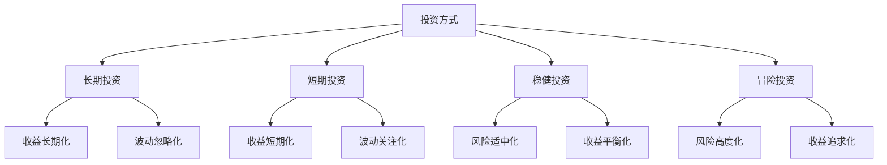

#### 逆向思维

**概念属性特征对比表格**

| 投资思维 | 特征 |
| --- | --- |
| 逆向思维 | 在市场悲观时寻找投资机会 |
| 同向思维 | 跟随市场趋势，盲目从众 |
| 中庸思维 | 保持平衡，不偏不倚 |
| 极端思维 | 过分追求高风险或低风险 |

**ER实体关系图架构**

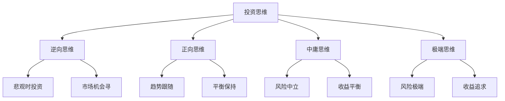

#### 价值投资

**概念属性特征对比表格**

| 投资方法 | 特征 |
| --- | --- |
| 价值投资 | 寻找价格低于其内在价值的股票 |
| 成长投资 | 投资于有持续增长潜力的公司 |
| 主题投资 | 投资于特定行业或主题的公司 |
| 技术投资 | 基于股票价格波动进行投资 |

**ER实体关系图架构**

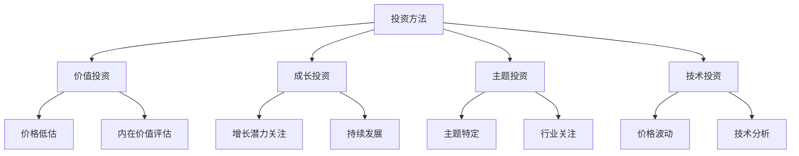

#### 独立思考

**概念属性特征对比表格**

| 思维方式 | 特征 |
| --- | --- |
| 独立思考 | 根据自己的研究和分析做出决策 |
| 跟随潮流 | 盲目从众，缺乏独立见解 |
| 团队协作 | 寻求集体智慧，共同决策 |
| 极端个人主义 | 过分依赖个人直觉，忽视他人意见 |

**ER实体关系图架构**

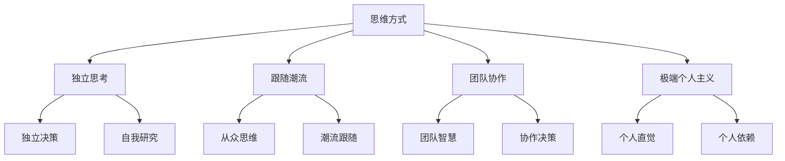

通过以上核心概念与联系的分析，我们可以更清晰地理解约翰·邓普顿的投资哲学。长期投资、逆向思维、价值投资和独立思考是邓普顿投资哲学的核心要素，它们相互关联，共同构成了一个完整且系统的投资策略。这些概念不仅帮助邓普顿取得了卓越的投资成果，也为现代投资者提供了宝贵的启示和指导。### 邓普顿的投资策略

约翰·邓普顿的投资策略是其成功投资的核心。他通过一系列独特的方法和原则，在投资市场上取得了卓越的业绩。以下是邓普顿投资策略的主要组成部分。

#### 市场波动应对策略

邓普顿认为，市场的短期波动是不可避免的，但投资者应该专注于长期趋势。他通过以下几种方式来应对市场波动：

1. **逆向思维**：邓普顿在市场悲观时寻找投资机会。他相信，当市场情绪极度悲观时，往往是投资机会的出现。他常常说：“在市场上，悲观者正确，但成功者并不悲观。”这种逆向思维使他能够在市场低谷中找到被低估的投资标的。

2. **分散投资**：邓普顿通过分散投资来降低风险。他相信，通过投资多个不同行业、地区和市场的股票，可以有效地分散风险，避免因单一市场或行业波动而遭受重大损失。

3. **长期持有**：邓普顿倾向于长期持有股票，而不是频繁交易。他相信，通过长时间的积累，股票的价值会逐渐上升，从而实现复利效应。

**市场波动应对策略的Mermaid流程图**

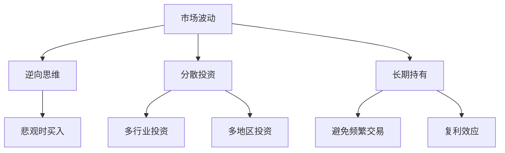

#### 投资组合管理

邓普顿的投资组合管理策略强调风险分散和价值选择。以下是他的投资组合管理原则：

1. **价值选择**：邓普顿通过深入研究，寻找那些价格低于其内在价值的股票。他相信，价值投资是实现长期收益的关键。

2. **风险分散**：邓普顿通过投资多个不同行业、地区和市场的股票，来分散风险。他相信，这样可以避免因单一市场或行业波动而遭受重大损失。

3. **动态调整**：邓普顿定期对投资组合进行调整，以确保其符合自己的投资原则和市场环境。他会卖出那些价值已经实现的股票，并买入那些具有更好投资机会的股票。

**投资组合管理Mermaid流程图**

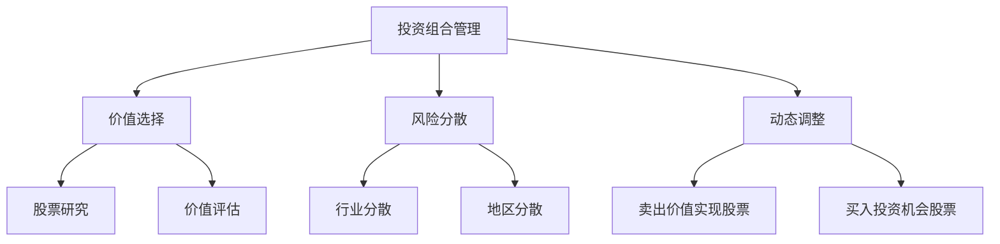

#### 投资决策过程

邓普顿的投资决策过程非常严谨和系统。以下是他的投资决策步骤：

1. **研究分析**：邓普顿通过深入研究公司的财务报表、行业趋势和市场环境，来评估公司的价值。他会仔细分析公司的盈利能力、资产负债状况和未来增长潜力。

2. **企业价值评估**：邓普顿使用多种方法来评估企业的价值，包括净资产、现金流折现和相对估值等。他会选择那些价值被市场低估的公司作为投资目标。

3. **投资时机选择**：邓普顿在市场情绪悲观时买入股票。他会等待市场对公司的价值重新认识，然后耐心持有，直到市场反映了公司的真实价值。

4. **决策实施**：在做出投资决策后，邓普顿会根据市场情况和个人判断，选择合适的时机和方式来实施决策。

**投资决策过程Mermaid流程图**

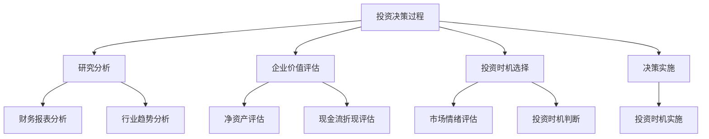

通过以上对邓普顿投资策略的详细讲解，我们可以看到，他的投资策略不仅系统严谨，而且注重长期价值投资和逆向思维。这些策略使他能够在复杂多变的市场环境中取得成功，也为现代投资者提供了宝贵的经验和启示。### 邓普顿的投资策略框架

邓普顿的投资策略框架是一个多层次、多维度的体系，旨在帮助投资者在复杂多变的市场环境中做出明智的投资决策。以下是邓普顿投资策略框架的详细步骤和组成部分。

#### 研究分析

研究分析是邓普顿投资策略的基础。投资者需要通过深入研究，获取足够的信息来评估公司的价值。以下是研究分析的关键步骤：

1. **财务报表分析**：投资者需要仔细阅读和分析公司的财务报表，包括资产负债表、利润表和现金流量表。通过分析公司的盈利能力、资产负债状况和现金流状况，可以评估公司的财务健康状况。

2. **行业趋势分析**：投资者需要对所处行业进行深入分析，了解行业的发展趋势、竞争格局和市场前景。行业趋势分析有助于投资者判断公司未来的增长潜力。

3. **市场环境分析**：投资者需要关注市场环境的变化，包括宏观经济环境、政策环境、市场情绪等。市场环境分析有助于投资者判断市场的整体走势，为投资决策提供参考。

**财务报表分析Mermaid流程图**

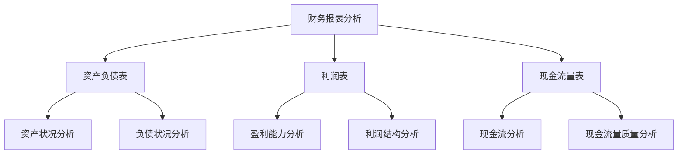

**行业趋势分析Mermaid流程图**

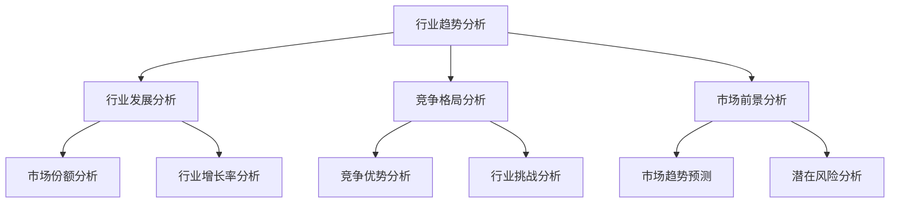

**市场环境分析Mermaid流程图**

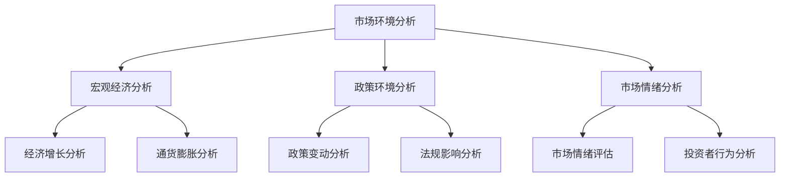

#### 企业价值评估

企业价值评估是邓普顿投资策略的核心步骤。投资者需要使用多种方法来评估企业的价值，以确定是否被市场低估。以下是企业价值评估的几种常用方法：

1. **净资产法**：净资产法通过计算公司的净资产（总资产减去总负债）来确定其价值。这种方法认为，公司的净资产是其真实价值的反映。

2. **现金流折现法**：现金流折现法通过预测公司的未来现金流，并将其折现到当前价值，来确定公司的价值。这种方法认为，公司的未来现金流是其价值的核心。

3. **相对估值法**：相对估值法通过比较公司的市值与其财务指标（如市盈率、市净率等），来确定其相对于同行业其他公司的价值。这种方法认为，市场的估值水平可以提供重要的参考信息。

**净资产法Mermaid流程图**

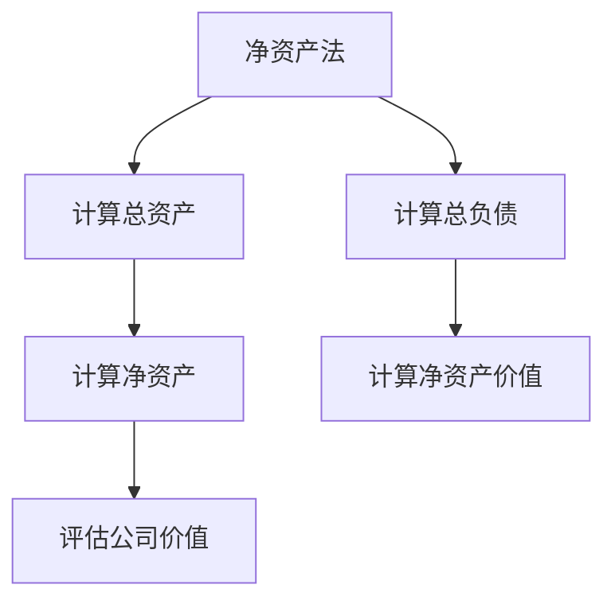

**现金流折现法Mermaid流程图**

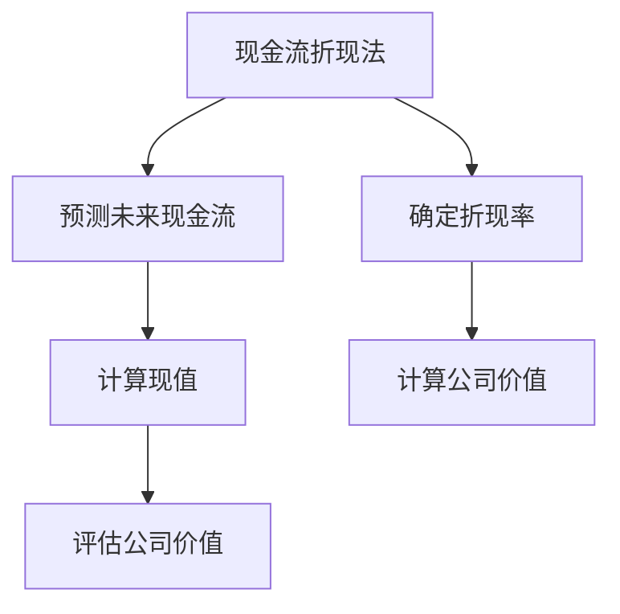

**相对估值法Mermaid流程图**

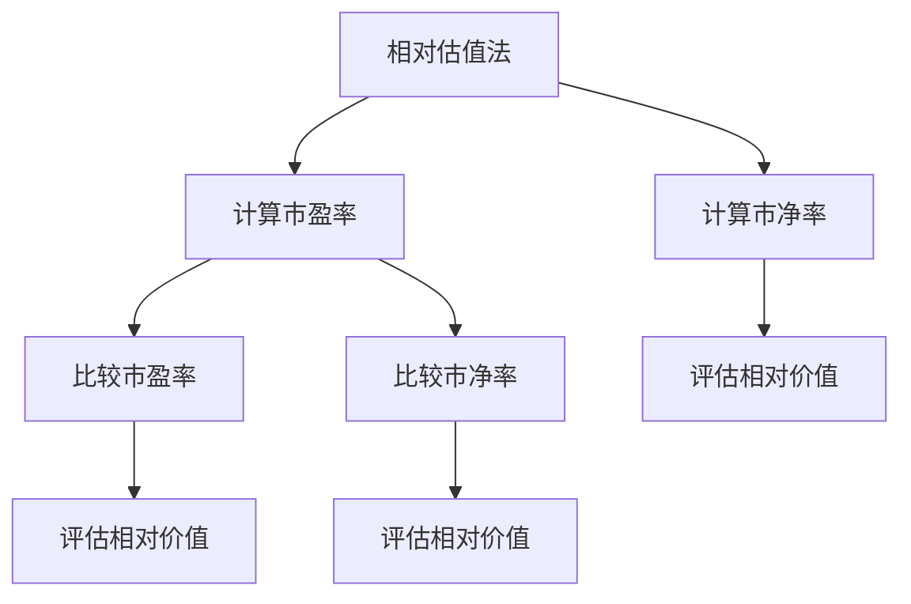

#### 投资时机选择

投资时机选择是邓普顿投资策略的关键环节。投资者需要在市场情绪悲观时买入股票，等待市场对公司的价值重新认识。以下是投资时机选择的关键步骤：

1. **市场情绪评估**：投资者需要分析市场情绪，了解市场的整体情绪状态。市场情绪悲观时，往往意味着投资机会的出现。

2. **投资时机判断**：投资者需要根据市场情绪和公司价值评估结果，判断最佳的买入时机。

3. **投资决策实施**：在确定买入时机后，投资者需要选择合适的时机和方式来实施投资决策。

**市场情绪评估Mermaid流程图**

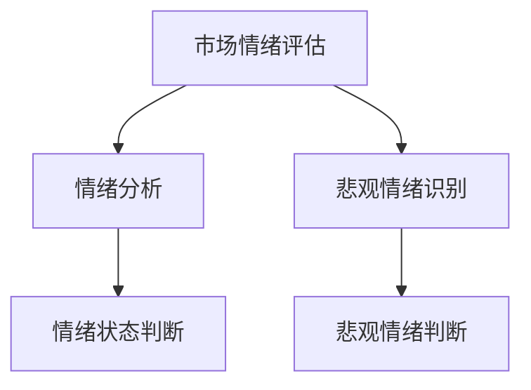

**投资时机判断Mermaid流程图**

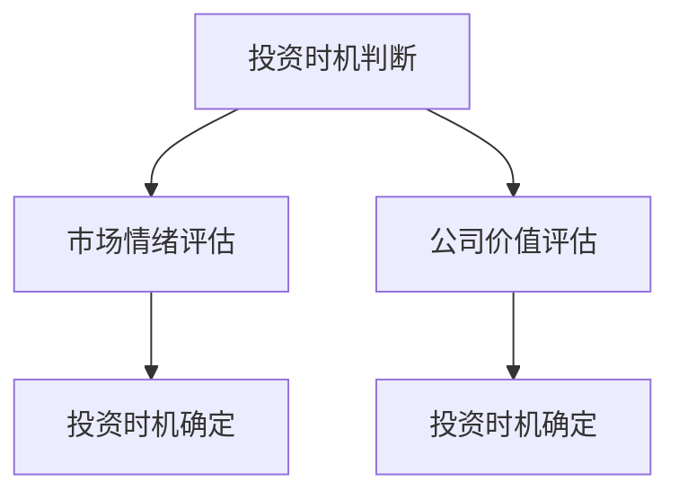

**投资决策实施Mermaid流程图**

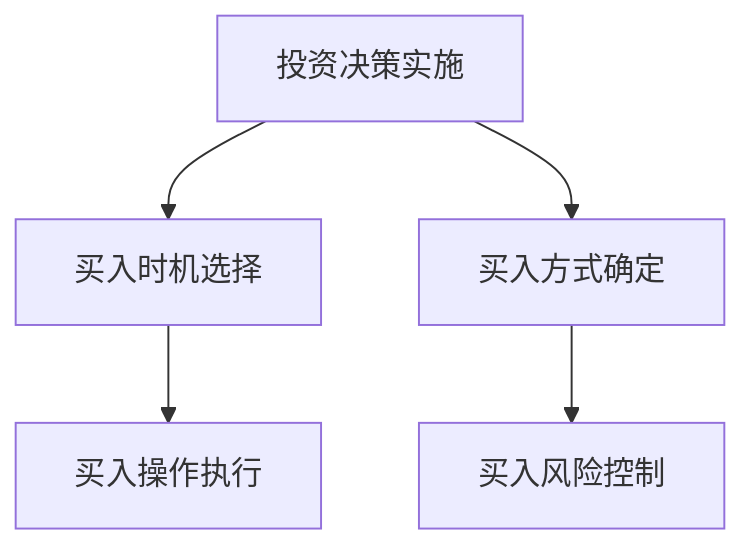

#### 风险控制

风险控制是邓普顿投资策略的重要组成部分。投资者需要通过多种方式来控制风险，以确保投资组合的安全性。以下是风险控制的关键步骤：

1. **分散投资**：通过投资多个不同行业、地区和市场的股票，来分散风险。

2. **定期调整**：投资者需要定期对投资组合进行调整，以确保其符合投资原则和市场环境。

3. **止损策略**：投资者需要设定止损点，以避免因市场波动而遭受重大损失。

**风险控制Mermaid流程图**

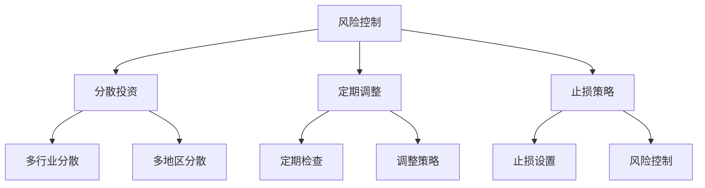

通过以上对邓普顿投资策略框架的详细讲解，我们可以看到，他的投资策略不仅系统严谨，而且注重长期价值投资和逆向思维。这些策略使他能够在复杂多变的市场环境中取得成功，也为现代投资者提供了宝贵的经验和启示。### 邓普顿的投资案例研究

约翰·邓普顿的投资哲学和策略不仅停留在理论层面，他在实际投资中也有着成功的实践。以下通过几个具体的投资案例，展示邓普顿如何运用他的投资策略，实现卓越的投资业绩。

#### 案例一：日本的投资故事

**案例背景**：

在20世纪80年代，日本股市经历了长达十年的高速增长，股市市值一度超过美国。然而，随着日本经济泡沫的破裂，日本股市在1989年至1991年间暴跌，股价大幅下跌。许多投资者对日本股市感到绝望，纷纷抛售股票。

**邓普顿的投资策略**：

邓普顿在看到日本股市崩溃时，并没有恐慌抛售，反而看到了价值投资的机会。他运用逆向思维，认为市场情绪过度悲观，很多优质公司的股票被严重低估。他开始买入那些拥有稳定现金流和良好管理层的公司股票。

**投资分析**：

邓普顿通过深入研究，分析了日本市场的经济结构和行业趋势。他发现，虽然日本经济整体放缓，但某些行业（如消费品、制药等）仍然具有增长潜力。他特别关注那些在市场低迷时依然保持盈利和增长的公司。

**投资结果**：

邓普顿的日本投资策略取得了显著的成功。在接下来的几十年里，他持有的日本股票逐渐升值，许多公司的股价甚至超过了他在低谷时的买入价。邓普顿在日本市场的成功投资，不仅证明了逆向思维的威力，也展示了他的价值投资策略的可靠性。

#### 案例二：新兴市场的投资策略

**案例背景**：

在20世纪70年代，新兴市场国家（如巴西、印度、中国等）经济开始快速增长，但市场波动较大，风险较高。许多投资者对这些市场持谨慎态度，不愿意冒险。

**邓普顿的投资策略**：

邓普顿对新兴市场国家的前景充满信心，他认为这些国家的发展潜力巨大，市场机会丰富。他开始在这些市场中寻找被低估的投资机会。他采取了分散投资策略，同时注重企业的基本面分析。

**投资分析**：

邓普顿通过深入研究，分析了新兴市场的经济增长、人口结构、政策环境等因素。他发现，尽管这些市场存在风险，但许多行业（如能源、基础设施、消费品等）具有长期增长潜力。他特别关注那些在困境中依然保持盈利和增长的公司。

**投资结果**：

邓普顿在新兴市场的投资策略取得了显著的成果。他持有的股票逐渐升值，许多公司的股价甚至超过了他的预期。邓普顿的成功投资，不仅帮助他在新兴市场中获得了丰厚的回报，也为其他投资者提供了信心和启示。

#### 案例三：成功投资案例

**案例背景**：

邓普顿在20世纪60年代开始投资美国市场，他通过不断寻找被低估的投资机会，取得了卓越的投资业绩。以下是一个典型的成功投资案例。

**投资分析**：

邓普顿发现了一家名为“克罗格公司”（Coca-Cola）的饮料制造商。尽管当时该公司股票价格相对较低，但邓普顿认为，该公司拥有强大的品牌、稳定的现金流和广泛的市场渠道。他认为，这是价值投资的一个好机会。

**投资结果**：

邓普顿在1960年代初买入克罗格公司的股票，并持有多年。随着时间的推移，克罗格公司的股价逐渐上涨，最终大幅超过了邓普顿的买入价。这个投资案例展示了邓普顿价值投资策略的成功，也证明了长期持有优质股票的复利效应。

**结论**：

通过以上投资案例，我们可以看到，约翰·邓普顿的投资策略在实践中的有效性。他通过逆向思维、价值投资和长期持有，成功地在市场低谷中抓住了投资机会，实现了卓越的投资业绩。这些案例不仅证明了邓普顿投资哲学的科学性，也为现代投资者提供了宝贵的经验和启示。### 邓普顿的投资风格特点

约翰·邓普顿的投资风格独特且富有成效，其核心特点包括长期投资、逆向思维、分散投资和独立思考。以下将详细探讨这些特点，并通过具体的例子来说明邓普顿如何运用这些风格实现投资成功。

#### 长期投资

邓普顿的投资哲学强调长期投资，他认为投资者应该关注长期收益，而不是短期波动。邓普顿相信，通过长时间的积累，股票的价值会逐渐上升，从而实现复利效应。他常常说：“时间是投资者的朋友。”这一理念在他的投资实践中得到了充分体现。

**例子**：

邓普顿在20世纪80年代对日本市场的投资就是一个典型的长期投资案例。尽管当时日本股市经历了大幅下跌，邓普顿依然坚持买入被低估的优质股票，并持有多年。最终，这些股票的价值逐渐回升，为他带来了丰厚的回报。这一案例展示了邓普顿对长期投资策略的坚定执行和成功实践。

#### 逆向思维

邓普顿以其逆向思维而著称。他相信，当市场情绪极度悲观时，往往意味着投资机会的出现。邓普顿在市场低谷时买入股票，而市场情绪转好时则卖出。他常常说：“在别人贪婪时恐惧，在别人恐惧时贪婪。”这种逆向思维使他能够在市场悲观时找到被低估的投资标的。

**例子**：

在2008年的金融危机期间，全球股市遭受重创，许多投资者纷纷抛售股票。然而，邓普顿却看到了投资机会，他大量买入那些在危机中被严重低估的股票。随着市场的逐步恢复，这些股票的价值逐渐回升，为他带来了巨大的投资回报。这一案例展示了邓普顿逆向思维的独特性和有效性。

#### 分散投资

邓普顿强调分散投资，他认为通过投资多个不同行业、地区和市场的股票，可以有效地分散风险。他相信，分散投资可以避免因单一市场或行业波动而遭受重大损失。

**例子**：

邓普顿在他的投资组合中广泛分散投资，包括美国、欧洲、亚洲等不同地区的市场，以及多个不同行业的股票。这种分散投资策略帮助他在不同市场环境下的投资风险得到了有效控制。例如，在20世纪70年代，邓普顿投资组合中的新兴市场股票表现优异，抵消了其他市场的损失。这一案例展示了邓普顿分散投资策略的成功应用。

#### 独立思考

邓普顿强调独立思考，他主张投资者应该根据自己的研究和分析做出决策，而不是盲目跟随市场趋势。他认为，独立思考能够帮助投资者避免冲动决策，做出更加明智的投资选择。

**例子**：

邓普顿在20世纪60年代对克罗格公司的投资就是一个独立思考的典型案例。尽管当时市场普遍对饮料行业持悲观态度，邓普顿却通过深入研究，认为克罗格公司具有强大的品牌和稳定的现金流，最终作出了投资决策。这一案例展示了邓普顿独立思考的决策过程和投资成功的成果。

#### 结论

邓普顿的投资风格以其长期投资、逆向思维、分散投资和独立思考为核心特点，这些特点使他能够在复杂多变的市场环境中做出明智的投资决策。他的投资风格不仅在他的投资实践中取得了显著的成功，也为现代投资者提供了宝贵的经验和启示。通过深入研究和独立思考，投资者可以借鉴邓普顿的投资风格，提高自己的投资成功率。### 全球市场分析与投资布局

约翰·邓普顿的投资哲学不仅适用于单一市场，他在全球市场分析和投资布局上也展现出了非凡的洞察力和实践效果。以下将详细探讨邓普顿如何在全球范围内进行市场分析、投资布局，以及如何进行全球资产配置。

#### 全球市场分析

邓普顿认为，全球市场的投资机会非常多，但投资者需要具备全球视野，对各个市场的经济、政治、社会环境有深入的了解。以下是邓普顿进行全球市场分析的主要步骤：

1. **宏观经济分析**：邓普顿关注全球经济增长趋势、通货膨胀率、利率水平等宏观经济指标。他认为，这些指标能够影响全球市场的走势。

2. **行业趋势分析**：邓普顿通过分析各个行业的增长潜力、技术进步、市场需求等因素，来识别具有长期增长潜力的行业。

3. **区域市场分析**：邓普顿对各个区域市场（如北美、欧洲、亚洲、新兴市场等）进行详细分析，了解各区域市场的特点和发展趋势。

4. **政策环境分析**：邓普顿关注全球政策环境的变化，包括贸易政策、财政政策、货币政策等，他认为政策环境对市场有重要影响。

**全球市场分析Mermaid流程图**

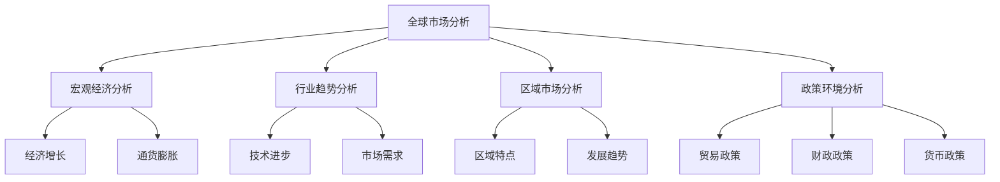

#### 投资布局

邓普顿的投资布局策略强调全球分散投资，以降低风险并抓住不同市场的机会。以下是邓普顿投资布局的主要步骤：

1. **全球资产配置**：邓普顿根据对全球市场的分析，将投资资金分配到各个市场，实现全球资产配置。他倾向于在市场低迷时增加新兴市场的投资，而在市场景气时增加发达市场的投资。

2. **行业选择**：邓普顿通过分析行业趋势，选择具有长期增长潜力的行业进行投资。例如，他在20世纪80年代初期看好新兴市场的工业和消费品行业。

3. **地区分散**：邓普顿在全球范围内进行分散投资，以避免单一市场或行业的风险。他通常会投资于多个国家和地区，包括发达市场和新兴市场。

**投资布局Mermaid流程图**

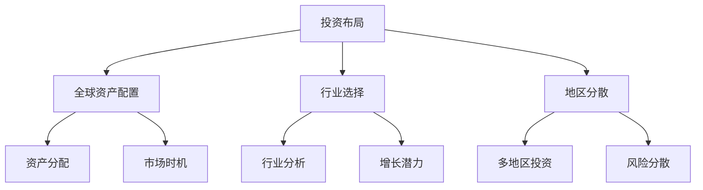

#### 全球资产配置

邓普顿的全球资产配置策略是其投资成功的关键之一。以下是邓普顿全球资产配置的主要原则：

1. **平衡风险与收益**：邓普顿在资产配置时，注重平衡风险与收益。他通过在不同市场、不同行业进行分散投资，实现风险分散，同时抓住不同市场的投资机会。

2. **周期性调整**：邓普顿根据市场周期进行资产配置调整。在市场景气时，他倾向于增加风险较高的资产；在市场低迷时，他则倾向于增加防御性资产。

3. **长期投资**：邓普顿的资产配置策略强调长期投资，他相信通过时间的积累，不同市场的投资机会会逐渐显现。

**全球资产配置Mermaid流程图**

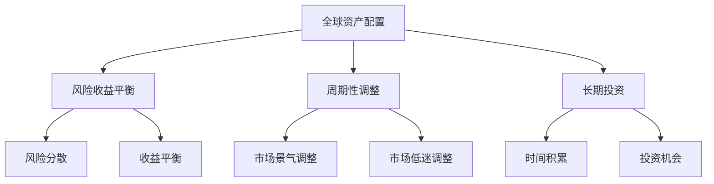

通过以上对全球市场分析、投资布局和全球资产配置的详细探讨，我们可以看到，邓普顿在全球投资中展现出了卓越的洞察力和实践能力。他通过全球市场分析，选择具有长期增长潜力的行业和地区进行投资；通过全球资产配置，实现风险分散和收益平衡。这些策略不仅帮助他在全球投资中取得了显著的成功，也为现代投资者提供了宝贵的经验和启示。### 行业研究与投资选择

在约翰·邓普顿的投资哲学中，行业研究与投资选择是至关重要的一环。邓普顿通过对各个行业的深入分析，识别出那些具有长期增长潜力和价值被低估的行业，从而进行精准的投资选择。以下是邓普顿在行业研究和投资选择方面的主要策略和实践。

#### 价值投资在各个行业中的应用

邓普顿的价值投资理念强调寻找价格低于其内在价值的股票，这在他的行业选择中得到了广泛应用。以下是邓普顿在多个行业中应用价值投资策略的实例：

1. **消费品行业**：邓普顿认为，消费品行业具有稳定的现金流和强大的品牌优势，是价值投资的重要领域。他在20世纪80年代初期看好了美国的消费品行业，特别是在经济低迷时期，这些行业的企业往往被低估。

2. **制造业**：邓普顿在制造业中寻找那些具有竞争优势和成本优势的企业。他认为，在制造业中，通过提高生产效率和降低成本，企业可以在竞争激烈的市场中脱颖而出。

3. **金融服务业**：邓普顿在金融服务业中寻找那些具有稳健财务状况和良好管理团队的企业。他认为，金融服务业虽然在市场波动中风险较高，但那些具有稳定盈利能力和强大客户基础的企业，往往能够抵御市场风险。

4. **能源行业**：邓普顿关注能源行业的长期增长趋势，特别是在石油和天然气等领域。他认为，能源需求的增长和技术进步将推动能源行业的持续发展。

**行业选择Mermaid流程图**

```mermaid
graph TD
A[行业选择] --> B[消费品行业]
A --> C[制造业]
A --> D[金融服务业]
A --> E[能源行业]
B --> F[消费品分析]
B --> G[消费品价值]
C --> H[制造业分析]
C --> I[制造业价值]
D --> J[金融服务业分析]
D --> K[金融服务价值]
E --> L[能源行业分析]
E --> M[能源行业价值]
```

#### 行业周期的识别与利用

邓普顿在行业研究和投资选择中，非常注重识别行业周期。他认为，通过抓住行业周期的转折点，可以最大限度地降低投资风险并提高收益。

1. **上升周期**：在行业上升周期中，邓普顿会关注那些处于快速增长阶段的企业，通过投资这些企业来分享行业的增长红利。

2. **低谷周期**：在行业低谷周期中，邓普顿会寻找那些具有长期增长潜力和良好管理团队的企业，通过逆向思维在市场悲观时进行投资。

3. **调整周期**：在行业调整周期中，邓普顿会根据市场情绪和行业基本面，进行灵活的投资调整，以保持投资组合的平衡。

**行业周期识别与利用Mermaid流程图**

```mermaid
graph TD
A[行业周期识别] --> B[上升周期]
A --> C[低谷周期]
A --> D[调整周期]
B --> E[增长阶段投资]
B --> F[增长红利分享]
C --> G[逆向思维投资]
C --> H[市场悲观时投资]
D --> I[市场情绪调整]
D --> J[投资组合平衡]
```

#### 防御型与增长型行业的投资选择

邓普顿在投资选择中，既关注防御型行业，也关注增长型行业。以下是对这两种行业类型的简要分析：

1. **防御型行业**：防御型行业通常在经济不确定时期表现出较好的抗风险能力，如消费品、医药、公用事业等。邓普顿在市场波动较大时，会倾向于投资这些行业，以保持投资组合的稳定。

2. **增长型行业**：增长型行业通常具有高增长潜力，如科技、能源、制造业等。邓普顿通过深入分析行业趋势和技术进步，寻找那些具有长期增长潜力的企业进行投资。

**防御型与增长型行业投资选择Mermaid流程图**

```mermaid
graph TD
A[行业投资选择] --> B[防御型行业]
A --> C[增长型行业]
B --> D[抗风险能力]
B --> E[稳定收益]
C --> F[增长潜力]
C --> G[技术进步]
```

通过以上对行业研究与投资选择的详细分析，我们可以看到，邓普顿在行业选择中既注重价值投资，又注重行业周期的识别与利用。他的投资策略使他能够在不同市场环境下，灵活调整投资组合，实现长期的投资收益。这些策略不仅为邓普顿本人带来了卓越的投资业绩，也为现代投资者提供了宝贵的经验和启示。### 全球价值投资的实战案例

约翰·邓普顿以其在全球投资领域的卓越成就而闻名，他的成功投资案例不仅展示了他的价值投资哲学，也提供了宝贵的学习和借鉴机会。以下将分析几个邓普顿的经典投资案例，并探讨其背后的策略和执行过程。

#### 案例一：日本的投资故事

**背景**：

20世纪80年代末，日本经济经历了高速增长，随后经济泡沫破裂，股市暴跌。日本股市在1989年至1991年间出现了大幅下跌，投资者对日本市场感到绝望。

**邓普顿的策略**：

邓普顿在看到日本股市崩溃时，并没有恐慌抛售，反而看到了价值投资的机会。他运用逆向思维，认为市场情绪过度悲观，很多优质公司的股票被严重低估。他开始大量买入那些在市场低迷时依然保持盈利和良好管理层的公司股票。

**执行过程**：

1. **市场情绪分析**：邓普顿通过分析市场情绪，发现日本股市的悲观情绪达到了极点。他注意到，尽管日本经济整体放缓，但许多行业（如消费品、制药等）仍然具有长期增长潜力。

2. **企业价值评估**：邓普顿对日本市场上的企业进行了深入研究，使用净资产、现金流折现等价值评估方法，发现了一些被市场低估的优质股票。

3. **投资决策**：邓普顿在市场情绪最低迷时，开始大量买入这些被低估的股票。他采取了长期持有的策略，耐心等待市场对公司的价值重新认识。

**结果**：

随着时间的推移，邓普顿持有的日本股票逐渐升值，许多公司的股价甚至超过了他在低谷时的买入价。这一投资案例展示了邓普顿在市场低谷中抓住投资机会的能力，以及他长期持有优质股票的复利效应。

#### 案例二：新兴市场的投资策略

**背景**：

20世纪70年代，新兴市场国家（如巴西、印度、中国等）经济开始快速增长，但市场波动较大，风险较高。许多投资者对这些市场持谨慎态度，不愿意冒险。

**邓普顿的策略**：

邓普顿对新兴市场国家的前景充满信心，他认为这些国家的发展潜力巨大，市场机会丰富。他开始在这些市场中寻找被低估的投资机会。他采取了分散投资策略，同时注重企业的基本面分析。

**执行过程**：

1. **行业分析**：邓普顿通过分析新兴市场的经济增长、人口结构、政策环境等因素，识别出那些具有长期增长潜力的行业，如能源、基础设施、消费品等。

2. **企业价值评估**：邓普顿对新兴市场国家中的企业进行了深入研究，使用净资产、现金流折现等价值评估方法，寻找那些在市场波动中被低估的优质股票。

3. **投资决策**：邓普顿在市场波动较大时，开始大量买入那些具有长期增长潜力和良好管理团队的企业股票。他采取了长期持有的策略，耐心等待市场对公司的价值重新认识。

**结果**：

邓普顿在新兴市场的投资策略取得了显著的成果。他持有的股票逐渐升值，许多公司的股价甚至超过了他的预期。这一投资案例展示了邓普顿在新兴市场中抓住投资机会的能力，以及他分散投资和长期持有的策略的成功。

#### 案例三：克罗格公司的投资

**背景**：

在20世纪60年代，克罗格公司是一家美国饮料制造商，尽管公司拥有强大的品牌和稳定的现金流，但当时其股票价格相对较低，市场对公司的估值较低。

**邓普顿的策略**：

邓普顿通过深入研究，认为克罗格公司具有强大的品牌和稳定的现金流，是一家价值被低估的公司。他决定买入克罗格公司的股票，并持有多年。

**执行过程**：

1. **企业价值评估**：邓普顿通过分析克罗格公司的财务报表、市场地位、竞争环境等因素，认为公司的真实价值被市场低估。

2. **投资决策**：邓普顿在市场对克罗格公司的估值较低时，开始大量买入股票。他采取了长期持有的策略，耐心等待市场对公司的价值重新认识。

**结果**：

随着时间的推移，克罗格公司的股价逐渐上涨，最终大幅超过了邓普顿的买入价。这一投资案例展示了邓普顿通过深入研究和价值评估，识别出被市场低估的投资机会，并通过长期持有获得丰厚的回报。

#### 结论

通过以上经典投资案例的分析，我们可以看到，约翰·邓普顿在全球投资中展现出了卓越的洞察力和实践能力。他通过逆向思维、价值投资和长期持有，成功地在市场低谷中抓住了投资机会，实现了卓越的投资业绩。这些案例不仅证明了邓普顿投资哲学的科学性，也为现代投资者提供了宝贵的经验和启示。### 价值投资的未来趋势与挑战

随着全球经济环境的不断变化，价值投资作为一项长期投资策略，面临着新的趋势和挑战。以下将对价值投资的未来趋势进行探讨，并分析投资者可能遇到的问题。

#### 价值投资的未来趋势

1. **全球化投资机会的增加**：随着全球化的深入，跨国投资机会日益增加。投资者可以通过投资不同国家和地区的市场，分散风险并抓住更多的投资机会。价值投资者需要具备全球视野，对不同市场的经济、政治和社会环境有深入的了解。

2. **科技与数据驱动**：科技的进步和大数据分析为价值投资提供了新的工具和手段。投资者可以利用先进的技术手段，进行更准确的市场分析和企业价值评估，从而提高投资决策的准确性。

3. **可持续发展投资**：随着环境、社会和治理（ESG）因素在投资决策中的重要性日益增加，价值投资者开始关注企业的可持续发展能力。那些在ESG方面表现优异的企业，往往能够获得更高的估值。

4. **人工智能与投资组合管理**：人工智能（AI）在投资组合管理中的应用日益广泛，可以提供更精确的风险评估和投资策略优化。价值投资者可以通过AI技术，提高投资组合的收益率和风险管理能力。

#### 投资者可能遇到的问题

1. **市场波动与情绪影响**：价值投资通常需要较长的投资周期，但市场波动和投资者情绪可能会对投资决策产生干扰。投资者需要具备较强的心理素质，保持理性，不被市场波动所影响。

2. **信息不对称**：在投资决策过程中，信息不对称是一个常见问题。投资者可能无法获得所有相关信息，导致投资决策的不确定性。为了降低信息不对称的风险，投资者需要加强研究分析，提高信息获取能力。

3. **估值变化**：价值投资的核心在于寻找价格低于其内在价值的股票，但估值变化可能会影响投资决策。投资者需要根据市场变化，灵活调整投资策略，以应对估值波动。

4. **政策风险**：政策变化可能会对投资市场产生重大影响。投资者需要密切关注政策动态，特别是在全球经济和政治不稳定时期，以降低政策风险。

#### 投资者如何应对市场变化

1. **长期投资理念**：投资者应树立长期投资理念，专注于长期收益，而不是短期波动。通过时间的积累，投资机会会逐渐显现。

2. **逆向思维**：在市场情绪悲观时，投资者应保持冷静，寻找被低估的投资机会。逆向思维可以帮助投资者抓住市场底部，实现更高的投资回报。

3. **分散投资**：通过分散投资，投资者可以降低单一市场或行业的风险。在全球范围内进行资产配置，可以更好地应对不同市场的波动。

4. **持续学习和研究**：投资者应不断学习和研究，提高自己的投资知识和技能。通过深入分析市场和企业，投资者可以做出更准确的投资决策。

5. **风险管理**：投资者需要建立有效的风险管理机制，包括设置止损点、分散投资和定期调整投资组合等。通过风险管理，投资者可以降低投资风险，保护投资组合的安全性。

#### 价值投资的长远展望

随着全球经济的不断发展，价值投资将继续在投资市场中发挥重要作用。尽管面临新的挑战和变化，但价值投资的核心理念——寻找被低估的投资机会，将始终具有吸引力。未来的投资者需要适应新的市场环境，不断学习和创新，以实现长期的投资成功。

通过以上对价值投资的未来趋势与挑战的探讨，我们可以看到，价值投资作为一项长期投资策略，具有强大的生命力。投资者应把握市场变化，灵活调整投资策略，同时保持对投资哲学的坚定信念，以实现长期的投资回报。### 结论：传承邓普顿的投资智慧

约翰·邓普顿作为全球价值投资的先驱，他的投资哲学和策略对现代投资者具有重要的启示和指导意义。邓普顿的投资智慧，不仅体现在他对长期投资、逆向思维、分散投资和独立思考的坚定执行上，还体现在他对市场波动和投资机会的深刻洞察。

邓普顿强调长期投资，认为时间是投资者的朋友。他通过耐心持有优质股票，实现了复利效应，为投资者提供了实现长期收益的有效途径。同时，邓普顿的逆向思维使他能够在市场悲观时抓住投资机会，避免盲目跟风，从而在市场低谷中实现了卓越的投资业绩。

分散投资是邓普顿投资策略的核心之一。通过在全球范围内进行资产配置，他有效地降低了投资风险，提高了投资组合的稳定性。这种策略不仅帮助他在不同市场环境下保持投资组合的平衡，也为其他投资者提供了借鉴。

独立思考是邓普顿投资哲学的重要组成部分。他主张投资者应根据自身的研究和分析做出决策，不受市场情绪和他人观点的影响。这种独立思考的能力，使他在投资决策中保持了清醒的头脑，避免了冲动投资。

为了更好地传承邓普顿的投资智慧，投资者应注重以下几点：

1. **持续学习**：投资市场不断变化，投资者需要不断学习新的知识和技能，以适应市场的变化。

2. **深入研究**：在投资决策过程中，投资者应进行深入的研究和分析，确保对投资标的和市场的全面了解。

3. **理性决策**：投资者应保持理性，不受市场情绪的影响，根据自身的投资原则和策略做出决策。

4. **灵活调整**：投资者应灵活调整投资组合，以应对市场变化和风险。

5. **长期持有**：投资者应坚持长期投资的理念，通过时间的积累，实现投资收益的最大化。

总之，约翰·邓普顿的投资智慧为我们提供了宝贵的经验和启示。通过学习他的投资哲学和策略，投资者可以在复杂多变的市场环境中，实现长期的投资成功。让我们以邓普顿为榜样，传承他的投资智慧，追求投资事业的长远发展。### 拓展阅读建议

为了更深入地理解约翰·邓普顿的投资哲学和策略，以下是几本推荐的书籍、文章和资源，供读者参考：

1. **《约翰·邓普顿的投资智慧》**：作者邓普顿本人，详细介绍了他的投资理念和策略，包括长期投资、逆向思维、分散投资和独立思考等。

2. **《股票大作手回忆录》**：作者杰西·利弗莫尔，通过自己的投资经历，展示了如何在市场波动中抓住投资机会，与邓普顿的逆向思维有相似之处。

3. **《巴菲特的投资哲学》**：作者雪莉·朗格，详细介绍了另一位投资大师巴菲特的投资理念和方法，与邓普顿的价值投资理念有许多共通之处。

4. **《财富智慧：价值投资的本质》**：作者威廉·奥尼尔，深入分析了价值投资的核心原则和实践方法，为投资者提供了宝贵的指导。

5. **《投资最重要的事》**：作者霍华德·马克斯，从多个角度探讨了投资的本质和策略，强调了风险管理的重要性，与邓普顿的投资理念相契合。

此外，以下网站和论坛也是了解约翰·邓普顿投资哲学和策略的好资源：

- **邓普顿基金集团官网**：https://www.templeton.com/
- **投资大师网**：https://www.investordaily.com.au/
- **华尔街见闻**：https://wallstreetcn.com/

通过阅读这些书籍、文章和访问这些网站，读者可以更全面地了解约翰·邓普顿的投资哲学，并将这些理念应用于自己的投资实践中。

