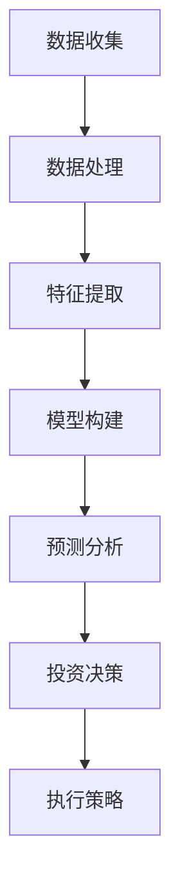
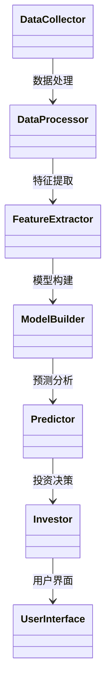
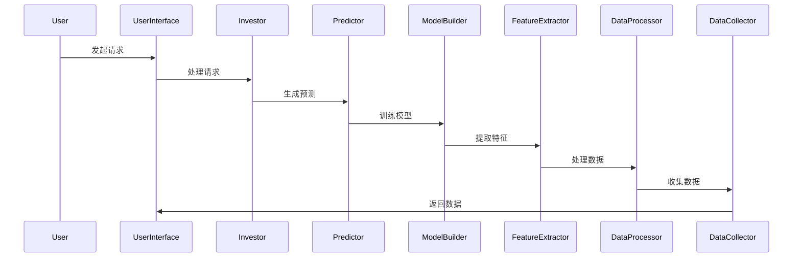

                 


### 理性预期投资概述

## 1.1 理性预期投资的背景与意义

### 1.1.1 理性预期投资的起源与发展

理性预期投资（Rational Expectations Investment，简称REI）起源于经济学领域，其基本思想是在一个完全竞争的市场中，投资者会基于所有可用信息，做出最理性的决策，从而达到市场的均衡状态。这一理论最早由诺贝尔经济学奖得主约翰·F·肯尼迪（John F. Kennedy）提出，并在20世纪60年代由约翰·伯格（John C. Boot伯格）等人进一步完善和发展。

伯格在其经典著作《理性预期投资：一个动态过程》中，详细阐述了理性预期投资的理论框架和实践方法。他指出，理性预期投资的核心在于设定一个合理的收益预期，并通过不断调整投资策略来应对市场变化。这一理念在当时引起了广泛关注，并为后来的投资实践提供了重要的理论指导。

### 1.1.2 理性预期投资的重要性

理性预期投资的重要性体现在以下几个方面：

1. **提高投资效率**：通过理性预期，投资者能够更准确地评估投资标的的潜在收益，从而提高投资决策的效率。

2. **降低投资风险**：理性预期投资强调对市场风险的充分认识和合理控制，有助于降低投资风险。

3. **优化投资组合**：理性预期投资提倡根据市场变化调整投资组合，从而实现资产配置的最优化。

4. **促进市场稳定**：理性预期投资有助于市场的健康发展，减少过度投机和泡沫的产生。

### 1.1.3 理性预期投资的应用场景

理性预期投资适用于各种投资领域，包括股票、债券、基金、期货、外汇等。以下是一些典型的应用场景：

1. **股票市场**：在股票市场中，理性预期投资可以帮助投资者确定合适的买入和卖出时机，从而实现收益最大化。

2. **债券市场**：在债券市场中，理性预期投资可以帮助投资者评估债券的风险和收益，做出合理的投资决策。

3. **基金投资**：基金投资中，理性预期投资可以帮助投资者选择合适的基金产品，优化投资组合。

4. **风险投资**：在风险投资中，理性预期投资可以帮助投资者评估初创企业的潜在价值，做出理性投资决策。

### 1.1.4 理性预期投资的基本概念与原则

理性预期投资的基本概念包括理性预期、市场预期、心理预期等。理性预期是指投资者基于所有可用信息，对未来的市场走势和投资收益做出合理的预期。市场预期是指市场参与者对市场走势的集体预期。心理预期则是指投资者在投资决策过程中受到个人心理因素影响的预期。

理性预期投资的原则主要包括以下几点：

1. **信息充分性**：投资者应尽可能获取所有可用信息，以确保投资决策的准确性。

2. **理性决策**：投资者应基于理性预期，做出符合自身投资目标和风险承受能力的决策。

3. **动态调整**：投资者应根据市场变化，动态调整投资策略，以适应新的市场环境。

4. **风险管理**：投资者应重视风险管理，采取合理的风险控制措施，确保投资安全。

### 1.1.5 概念结构与核心要素组成

理性预期投资的概念结构主要包括以下几个核心要素：

1. **投资者**：理性预期投资的核心主体，负责做出投资决策。

2. **市场**：理性预期投资的环境，包括股票、债券、基金等各种投资市场。

3. **信息**：理性预期投资的基础，投资者需要充分获取和处理信息。

4. **预期**：理性预期投资的依据，投资者应基于理性预期做出投资决策。

5. **策略**：理性预期投资的手段，包括投资组合调整、风险控制等。

### 1.1.6 理性预期投资与市场心理预期

市场心理预期是指市场参与者对市场走势的主观判断和预期。与理性预期不同，市场心理预期往往受到个人情绪、市场热点、媒体宣传等因素的影响，具有较大的不确定性和波动性。

理性预期投资强调投资者应基于理性预期，而不是市场心理预期做出投资决策。通过理性预期，投资者可以更好地把握市场趋势，降低投资风险，实现长期稳定的投资收益。

### 1.1.7 理性预期投资的边界与限制

理性预期投资虽然具有许多优点，但也存在一些边界和限制：

1. **信息不对称**：现实中，投资者很难获取所有信息，导致投资决策的理性程度受限。

2. **市场不确定性**：市场变化复杂，理性预期难以完全预测市场走势。

3. **心理因素**：投资者在决策过程中难免受到个人情绪和心理因素的影响。

4. **交易成本**：频繁调整投资策略会产生交易成本，影响投资收益。

### 1.1.8 理性预期投资的挑战与机遇

理性预期投资面临的挑战主要包括信息不对称、市场不确定性和心理因素等。但同时，这也为理性预期投资带来了机遇：

1. **提高投资效率**：通过理性预期，投资者可以更准确地评估投资机会，提高投资效率。

2. **优化投资组合**：理性预期投资有助于投资者优化投资组合，实现风险和收益的最佳平衡。

3. **应对市场变化**：理性预期投资强调动态调整投资策略，有助于投资者应对市场变化。

4. **降低投资风险**：理性预期投资重视风险管理，有助于降低投资风险。

### 1.1.9 本章小结

本章概述了理性预期投资的背景与意义、基本概念与原则、应用场景以及边界与限制。通过本章的学习，读者可以初步了解理性预期投资的理论框架和实践方法，为后续章节的深入探讨打下基础。在接下来的章节中，我们将进一步探讨理性预期投资的原理、方法和应用，帮助读者全面掌握这一投资理念。

## 1.2 理性预期投资的基本概念与原则

### 1.2.1 理性预期投资的概念解析

理性预期投资，是指投资者在投资决策过程中，基于对市场信息的全面分析和理性判断，形成对市场走势和投资收益的预期，并据此制定和调整投资策略。这一概念包含以下几个关键要素：

1. **市场信息**：理性预期投资的基础是市场信息。投资者需要全面、准确地获取和分析市场信息，包括宏观经济数据、行业动态、公司基本面等。

2. **理性判断**：投资者在分析市场信息的基础上，运用理性思维，对市场走势和投资收益进行预期。理性判断要求投资者摒弃主观情绪和偏见，以客观、冷静的态度面对市场。

3. **投资策略**：理性预期投资的核心是制定和调整投资策略。投资者根据理性预期，制定适合自身的投资策略，包括资产配置、风险控制、交易时机等。

4. **动态调整**：市场环境不断变化，理性预期投资要求投资者根据市场变化，动态调整投资策略，以适应新的市场环境。

### 1.2.2 理性预期投资的原则

理性预期投资的原则主要包括以下几个方面：

1. **信息充分性**：投资者应尽可能获取所有可用信息，包括公开信息和内幕信息。在充分了解市场状况的基础上，做出理性判断。

2. **理性决策**：投资者应摒弃个人情绪和偏见，以客观、理性的态度对待市场。在决策过程中，遵循逻辑思维，避免盲目跟风。

3. **动态调整**：市场环境不断变化，投资者应保持警觉，根据市场变化，及时调整投资策略。动态调整有助于投资者抓住市场机遇，规避风险。

4. **风险管理**：理性预期投资强调风险管理。投资者应合理配置资产，分散投资风险。在风险可控的前提下，追求投资收益的最大化。

5. **长期投资**：理性预期投资注重长期投资。投资者应坚持长期投资策略，避免频繁交易，降低交易成本。

### 1.2.3 理性预期投资的核心要素

理性预期投资的核心要素包括以下几方面：

1. **投资目标**：投资者在投资前应明确投资目标，包括收益目标、风险承受能力、投资期限等。

2. **投资策略**：根据投资目标，投资者制定相应的投资策略。投资策略包括资产配置、风险控制、交易时机等。

3. **风险控制**：投资者应重视风险控制，采取合理的风险控制措施，如分散投资、设置止损等。

4. **投资心理**：理性预期投资要求投资者具备良好的投资心理。投资者应保持冷静，避免情绪化决策。

5. **市场分析**：投资者应具备较强的市场分析能力，能够准确判断市场趋势。

### 1.2.4 理性预期投资与传统投资理念的对比

理性预期投资与传统投资理念（如投机、盲目跟风等）存在显著区别：

1. **投资目标**：传统投资理念侧重短期收益，而理性预期投资注重长期投资和稳定收益。

2. **投资决策**：传统投资理念依赖直觉和经验，而理性预期投资基于市场信息和理性判断。

3. **风险管理**：传统投资理念忽视风险控制，而理性预期投资重视风险管理和分散投资。

4. **市场适应**：传统投资理念难以适应市场变化，而理性预期投资强调动态调整投资策略。

### 1.2.5 理性预期投资的优势与局限

理性预期投资具有以下优势：

1. **提高投资效率**：基于理性预期，投资者可以更准确地评估投资机会，提高投资效率。

2. **降低投资风险**：理性预期投资强调风险管理，有助于降低投资风险。

3. **优化投资组合**：理性预期投资有助于投资者优化投资组合，实现风险和收益的最佳平衡。

4. **促进市场稳定**：理性预期投资有助于市场的健康发展，减少过度投机和泡沫的产生。

然而，理性预期投资也存在一些局限：

1. **信息不对称**：投资者难以获取所有信息，影响投资决策的理性程度。

2. **市场不确定性**：市场变化复杂，理性预期难以完全预测市场走势。

3. **心理因素**：投资者在决策过程中难免受到个人情绪和心理因素的影响。

4. **交易成本**：频繁调整投资策略会产生交易成本，影响投资收益。

### 1.2.6 本章小结

本章详细阐述了理性预期投资的基本概念、原则、核心要素以及与传统投资理念的对比。通过本章的学习，读者可以全面了解理性预期投资的理论框架和实践方法。在接下来的章节中，我们将进一步探讨理性预期投资的数学模型和算法原理，帮助读者更深入地理解这一投资理念。

## 1.3 理性预期投资与市场心理预期

### 1.3.1 市场心理预期的定义与影响

市场心理预期是指市场参与者（如投资者、分析师、金融机构等）对市场走势的主观判断和预期。这些预期往往受到多种因素的影响，包括经济数据、政策变化、市场情绪、媒体报道等。市场心理预期在投资决策中扮演着重要角色，对市场走势和价格波动产生显著影响。

1. **投资者情绪**：市场心理预期受到投资者情绪的影响。例如，在市场乐观时，投资者可能倾向于持有更多股票，推动股价上涨；而在市场悲观时，投资者可能倾向于卖出股票，导致股价下跌。

2. **宏观经济环境**：宏观经济环境的变化也会影响市场心理预期。例如，经济增长放缓可能导致投资者对市场的信心下降，从而影响投资决策。

3. **政策变化**：政府政策的调整，如利率变动、税收政策等，会影响市场心理预期。例如，降息可能提高市场对股票和房地产的投资兴趣。

4. **媒体报道**：媒体报道对市场心理预期也有显著影响。正面报道可能提升市场信心，负面报道可能引发市场恐慌。

### 1.3.2 理性预期与市场心理预期的比较

理性预期和市场心理预期之间存在显著差异：

1. **信息来源**：理性预期基于所有可用信息，包括公开信息和内幕信息；而市场心理预期更多受到主观判断和情绪的影响。

2. **理性程度**：理性预期更加理性，基于逻辑分析和数据支持；而市场心理预期容易受到情绪波动的影响，可能产生过度反应。

3. **目标导向**：理性预期注重长期投资和稳定收益；而市场心理预期更多关注短期收益和投机机会。

4. **适应能力**：理性预期强调动态调整，以适应市场变化；而市场心理预期往往难以适应市场波动。

### 1.3.3 理性预期在市场心理预期中的应用

理性预期可以在市场心理预期中发挥重要作用，帮助投资者更好地应对市场变化：

1. **纠正市场偏差**：理性预期可以帮助投资者识别和纠正市场心理预期的偏差，从而避免过度反应。

2. **制定投资策略**：基于理性预期，投资者可以制定更加合理的投资策略，包括资产配置、风险控制等。

3. **优化投资组合**：理性预期有助于投资者优化投资组合，降低风险，提高收益。

4. **市场预测**：理性预期可以提供更准确的市场预测，帮助投资者抓住市场机遇。

### 1.3.4 理性预期在投资实践中的应用案例

以下是一些理性预期在投资实践中的应用案例：

1. **股票市场**：投资者通过分析公司的基本面和宏观经济数据，形成对股票市场的理性预期，从而制定投资策略。

2. **房地产市场**：在房地产市场，理性预期可以帮助投资者预测房价走势，选择合适的投资时机。

3. **基金投资**：基金投资者通过分析基金经理的投资策略和市场环境，形成对基金收益的理性预期，从而选择合适的基金产品。

4. **外汇市场**：在外汇市场，理性预期可以帮助投资者预测汇率走势，制定交易策略。

### 1.3.5 理性预期投资的挑战与对策

理性预期投资在实践过程中面临一些挑战：

1. **信息不对称**：投资者难以获取所有信息，影响投资决策的理性程度。

2. **市场不确定性**：市场变化复杂，理性预期难以完全预测市场走势。

3. **心理因素**：投资者在决策过程中难免受到个人情绪和心理因素的影响。

对策包括：

1. **提高信息获取能力**：投资者应通过多种渠道获取信息，提高信息的全面性和准确性。

2. **加强数据分析**：运用数据分析工具，提高投资决策的理性程度。

3. **心理素质培养**：投资者应培养良好的投资心理，避免情绪化决策。

4. **动态调整策略**：根据市场变化，及时调整投资策略，以应对不确定性。

### 1.3.6 本章小结

本章详细阐述了理性预期投资与市场心理预期的关系，分析了市场心理预期的定义、影响以及理性预期在市场心理预期中的应用。通过本章的学习，读者可以更好地理解理性预期投资在投资实践中的作用，为后续章节的深入探讨打下基础。在接下来的章节中，我们将进一步探讨理性预期投资的数学模型和算法原理。

## 1.4 理性预期投资的边界与限制

### 1.4.1 理性预期投资的适用范围

理性预期投资（REI）作为一种投资策略，其适用范围较为广泛。以下是一些典型的应用场景：

1. **股票市场**：理性预期投资可以帮助投资者评估股票的潜在价值，选择合适的买入和卖出时机。

2. **债券市场**：投资者可以通过理性预期分析债券的收益率和风险，做出合理的投资决策。

3. **基金投资**：基金投资者可以根据理性预期选择具有潜力的基金产品，优化投资组合。

4. **外汇市场**：在外汇市场，理性预期投资可以帮助投资者预测汇率走势，制定交易策略。

5. **房地产投资**：投资者可以通过理性预期分析房地产市场的供需状况，选择合适的投资时机。

然而，理性预期投资并非适用于所有市场和环境。以下是一些特殊情况：

1. **非理性市场**：在市场非理性阶段，如金融危机、股市泡沫等，理性预期投资的效果可能受到显著影响。

2. **高度不确定的市场**：在市场高度不确定的情况下，如战争、自然灾害等，理性预期投资难以预测市场走势。

3. **信息严重不对称的市场**：在信息严重不对称的市场环境中，如内幕交易、黑市等，理性预期投资可能面临较大的信息障碍。

### 1.4.2 理性预期投资的局限性

尽管理性预期投资具有许多优点，但其也面临一些局限性：

1. **信息不对称**：理性预期投资依赖于充分的市场信息。然而，在实际操作中，投资者很难获取所有信息，导致投资决策的理性程度受限。

2. **市场不确定性**：市场变化复杂，理性预期难以完全预测市场走势。特别是在市场发生重大变化时，理性预期可能无法准确预测市场走向。

3. **心理因素**：投资者在决策过程中难免受到个人情绪和心理因素的影响。这些因素可能导致投资决策偏离理性预期。

4. **交易成本**：频繁调整投资策略会产生交易成本，影响投资收益。在追求短期收益的情况下，交易成本可能抵消理性预期投资的收益。

### 1.4.3 理性预期投资的挑战与机遇

理性预期投资在投资实践中面临一些挑战：

1. **信息获取与处理**：投资者需要投入大量时间和精力来获取和处理市场信息，这增加了投资决策的复杂性。

2. **市场变化应对**：市场变化迅速，投资者需要具备较强的市场敏感性和应变能力，以应对市场变化。

3. **心理压力**：在投资过程中，投资者可能面临较大的心理压力，如市场波动、投资亏损等。

然而，理性预期投资也带来了一些机遇：

1. **提高投资效率**：通过理性预期，投资者可以更准确地评估投资机会，提高投资决策的效率。

2. **优化投资组合**：理性预期投资有助于投资者优化投资组合，实现风险和收益的最佳平衡。

3. **降低投资风险**：理性预期投资强调风险管理，有助于降低投资风险。

4. **市场适应能力**：理性预期投资强调动态调整，有助于投资者适应市场变化。

### 1.4.4 理性预期投资的最佳实践与注意事项

为了充分发挥理性预期投资的优势，投资者可以采取以下最佳实践：

1. **全面信息收集**：投资者应通过多种渠道收集市场信息，提高信息的全面性和准确性。

2. **理性决策**：在投资决策过程中，投资者应摒弃个人情绪和偏见，以客观、理性的态度对待市场。

3. **动态调整策略**：根据市场变化，及时调整投资策略，以适应新的市场环境。

4. **风险管理**：投资者应重视风险管理，采取合理的风险控制措施，如分散投资、设置止损等。

5. **长期投资**：理性预期投资注重长期投资，投资者应避免频繁交易，降低交易成本。

### 1.4.5 本章小结

本章详细阐述了理性预期投资的边界与限制，包括适用范围、局限性、挑战与机遇以及最佳实践与注意事项。通过本章的学习，读者可以更全面地了解理性预期投资的优缺点和适用条件，为实际投资实践提供指导。在接下来的章节中，我们将进一步探讨理性预期投资的数学模型和算法原理，帮助读者深入理解这一投资策略。

## 1.5 本章小结

本章围绕理性预期投资的基本概念、原则及其在市场心理预期中的应用进行了深入探讨。首先，我们介绍了理性预期投资的背景与意义，阐述了其起源、发展及其重要性。接着，我们详细解析了理性预期投资的基本概念和原则，包括信息充分性、理性决策、动态调整和风险管理等核心要素。在此基础上，我们比较了理性预期投资与传统投资理念的区别，并分析了其优势与局限。

随后，我们讨论了理性预期投资与市场心理预期的关系，解释了市场心理预期的定义及其影响，并探讨了如何通过理性预期纠正市场偏差。本章还阐述了理性预期投资的适用范围，包括股票、债券、基金、外汇和房地产等领域，同时指出了其局限性，如信息不对称、市场不确定性和心理因素等。

为了更好地实践理性预期投资，本章提供了最佳实践建议，包括全面信息收集、理性决策、动态调整策略、风险管理以及长期投资等。通过这些实践，投资者可以更好地应对市场变化，实现投资收益的最大化。

本章内容为后续章节的深入探讨奠定了基础，读者可以通过进一步学习理性预期投资的数学模型和算法原理，更全面地掌握这一投资策略。在接下来的章节中，我们将继续探讨理性预期投资的实践应用，帮助读者将理论转化为实际操作，实现投资收益的持续增长。

----------------------------------------------------------------

# 第二部分：理性预期投资原理与方法

## 2.1 理性预期投资的基本流程

### 2.1.1 理性预期投资的分析流程

理性预期投资的核心在于对市场信息的准确分析和理性判断，从而制定有效的投资策略。以下是理性预期投资的分析流程：

1. **信息收集**：首先，投资者需要收集与投资相关的各种信息，包括宏观经济数据、行业动态、公司基本面等。这些信息可以从公开渠道获取，如财经新闻、研究报告、财务报表等。

2. **数据分析**：接下来，投资者需要对收集到的信息进行详细分析。数据分析包括定量分析和定性分析。定量分析主要涉及数据统计和趋势分析，如宏观经济指标的变化、行业增长趋势等。定性分析则关注公司经营状况、市场竞争格局、政策环境等。

3. **市场预期**：在数据分析的基础上，投资者需要对市场走势和投资收益进行预期。市场预期需要综合考虑多种因素，如宏观经济政策、行业发展趋势、公司基本面等。

4. **投资决策**：根据市场预期，投资者制定具体的投资策略，包括买入、卖出时机和资产配置等。投资决策应基于理性预期，避免盲目跟风和情绪化决策。

5. **策略实施**：投资者根据投资策略实施具体的交易操作，包括买入、卖出和持有等。在策略实施过程中，投资者需要密切关注市场变化，及时调整策略以应对新的市场环境。

6. **风险控制**：理性预期投资强调风险控制，投资者应采取合理的风险控制措施，如设置止损点、分散投资等，以确保投资安全。

### 2.1.2 理性预期投资的投资策略

理性预期投资的投资策略主要包括以下几种：

1. **资产配置**：资产配置是理性预期投资的核心策略之一。投资者应根据自身的投资目标、风险承受能力和市场预期，合理配置股票、债券、基金等资产。在资产配置过程中，投资者需要关注不同资产类别的收益和风险特征，实现风险和收益的最佳平衡。

2. **趋势投资**：趋势投资是指投资者根据市场趋势进行投资。在理性预期投资中，投资者需要通过数据分析识别市场趋势，并据此制定投资策略。趋势投资要求投资者具备较强的市场敏感性和判断力，以准确捕捉市场机会。

3. **价值投资**：价值投资是指投资者通过分析公司基本面，寻找被低估的优质股票进行投资。在理性预期投资中，价值投资强调对公司财务状况、行业前景和竞争地位的分析，以确定股票的投资价值。

4. **成长投资**：成长投资是指投资者通过分析公司的成长性和潜力，选择具有长期增长潜力的股票进行投资。在理性预期投资中，成长投资关注公司的研发能力、市场份额、行业地位等指标，以预测公司的长期增长趋势。

5. **量化投资**：量化投资是指投资者运用数学模型和计算机技术进行投资。在理性预期投资中，量化投资通过构建数学模型，对市场数据进行统计分析，以预测市场走势和投资收益。

### 2.1.3 理性预期投资的风险管理

风险管理是理性预期投资的重要组成部分。以下是一些常见的风险管理策略：

1. **分散投资**：通过分散投资，投资者可以将风险分散到不同的资产类别和行业，降低单一投资的风险。分散投资包括资产分散、行业分散和地区分散等。

2. **设置止损点**：止损点是投资者在投资过程中设置的一个价格水平，当股票价格跌至此水平时，投资者将卖出股票以避免更大的损失。

3. **定期调整**：投资者应定期对投资组合进行调整，以应对市场变化。定期调整包括买入、卖出和持有等操作，以保持投资组合的合理性和有效性。

4. **风险管理工具**：投资者可以使用一些风险管理工具，如期权、期货、对冲基金等，来降低投资风险。这些工具可以在特定情况下提供风险对冲和收益保护。

### 2.1.4 理性预期投资的实施步骤

理性预期投资的实施步骤如下：

1. **确定投资目标**：投资者首先需要明确自身的投资目标，包括收益目标、风险承受能力和投资期限等。

2. **信息收集**：根据投资目标，投资者收集与投资相关的各种信息。

3. **数据分析**：对收集到的信息进行详细分析，识别市场趋势和投资机会。

4. **市场预期**：根据数据分析结果，投资者形成对市场走势和投资收益的预期。

5. **投资决策**：根据市场预期，制定具体的投资策略，包括资产配置、趋势投资、价值投资、成长投资等。

6. **策略实施**：根据投资策略，实施具体的交易操作。

7. **风险控制**：在投资过程中，采取合理的风险控制措施，如分散投资、设置止损点、定期调整等。

8. **持续监控**：投资者应持续监控市场变化，及时调整投资策略，以应对新的市场环境。

### 2.1.5 理性预期投资的优势与局限

理性预期投资具有以下优势：

1. **提高投资效率**：通过理性预期，投资者可以更准确地评估投资机会，提高投资决策的效率。

2. **降低投资风险**：理性预期投资强调风险管理，有助于降低投资风险。

3. **优化投资组合**：理性预期投资有助于投资者优化投资组合，实现风险和收益的最佳平衡。

4. **促进市场稳定**：理性预期投资有助于市场的健康发展，减少过度投机和泡沫的产生。

然而，理性预期投资也存在一些局限：

1. **信息不对称**：投资者难以获取所有信息，影响投资决策的理性程度。

2. **市场不确定性**：市场变化复杂，理性预期难以完全预测市场走势。

3. **心理因素**：投资者在决策过程中难免受到个人情绪和心理因素的影响。

### 2.1.6 本章小结

本章详细阐述了理性预期投资的基本流程、投资策略、风险管理以及实施步骤。通过本章的学习，读者可以全面了解理性预期投资的理论和实践方法。在接下来的章节中，我们将进一步探讨理性预期投资的数学模型和算法原理，帮助读者更深入地理解这一投资策略。

## 2.2 理性预期投资的数学模型与公式

### 2.2.1 理性预期投资的数学模型

理性预期投资的数学模型是基于概率论和统计学原理建立的，其主要目的是通过分析历史数据和市场信息，预测未来市场走势和投资收益。以下是一个简化的理性预期投资模型：

\[ E(R_t) = \mu + \sigma \cdot \epsilon_t \]

其中：
- \( E(R_t) \) 表示在时间 \( t \) 的预期收益率。
- \( \mu \) 表示长期平均收益率。
- \( \sigma \) 表示收益率的波动程度。
- \( \epsilon_t \) 表示时间 \( t \) 的随机误差。

### 2.2.2 理性预期投资的关键公式

理性预期投资涉及多个关键公式，以下是一些重要的公式：

1. **预期收益率公式**：

\[ E(R) = \sum_{i=1}^{n} p_i \cdot r_i \]

其中：
- \( E(R) \) 表示预期收益率。
- \( p_i \) 表示第 \( i \) 种资产的投资概率。
- \( r_i \) 表示第 \( i \) 种资产的预期收益率。

2. **预期风险公式**：

\[ E(Risk) = \sum_{i=1}^{n} p_i \cdot \sigma_i^2 \]

其中：
- \( E(Risk) \) 表示预期风险。
- \( p_i \) 表示第 \( i \) 种资产的投资概率。
- \( \sigma_i^2 \) 表示第 \( i \) 种资产的收益率方差。

3. **风险调整后收益公式**：

\[ Risk-Adjusted Return = \frac{E(R)}{E(Risk)} \]

其中：
- \( Risk-Adjusted Return \) 表示风险调整后收益。
- \( E(R) \) 表示预期收益率。
- \( E(Risk) \) 表示预期风险。

### 2.2.3 数学模型在实际投资中的应用

理性预期投资数学模型在实际投资中的应用包括以下几个方面：

1. **资产配置**：投资者可以根据预期收益率和风险，合理配置资产。例如，通过计算不同资产的投资概率，实现投资组合的最优化。

2. **风险评估**：投资者可以使用预期风险公式，评估不同资产的风险水平，从而做出合理的投资决策。

3. **风险控制**：通过风险调整后收益公式，投资者可以评估不同投资策略的收益与风险，选择最优的风险控制策略。

4. **市场预测**：投资者可以通过分析历史数据和市场信息，预测未来市场走势，制定相应的投资策略。

### 2.2.4 理性预期投资的案例解析

以下是一个理性预期投资的案例解析：

假设投资者需要选择股票、债券和基金三种资产进行投资。根据市场信息，这三种资产的预期收益率和风险如下表所示：

| 资产类别 | 预期收益率（%） | 风险（方差） |
|-----------|----------------|--------------|
| 股票     | 15             | 0.04         |
| 债券     | 5              | 0.01         |
| 基金     | 8              | 0.03         |

1. **资产配置**：

假设投资者决定将总投资的60%投入股票，30%投入债券，10%投入基金。根据预期收益率公式，可以计算出预期收益率：

\[ E(R) = 0.6 \cdot 15 + 0.3 \cdot 5 + 0.1 \cdot 8 = 9.3 + 1.5 + 0.8 = 11.6\% \]

2. **风险评估**：

根据预期风险公式，可以计算出预期风险：

\[ E(Risk) = 0.6 \cdot 0.04 + 0.3 \cdot 0.01 + 0.1 \cdot 0.03 = 0.024 + 0.003 + 0.003 = 0.03 \]

3. **风险调整后收益**：

根据风险调整后收益公式，可以计算出风险调整后收益：

\[ Risk-Adjusted Return = \frac{11.6\%}{0.03} = 38.67\% \]

通过这个案例，我们可以看到理性预期投资数学模型在实际投资中的应用。投资者可以根据预期收益率和风险，合理配置资产，并评估不同投资策略的收益与风险，从而制定最优的投资决策。

### 2.2.5 理性预期投资数学模型的优势与局限

理性预期投资数学模型具有以下优势：

1. **量化分析**：通过数学模型，投资者可以对投资收益和风险进行量化分析，提高投资决策的科学性和准确性。

2. **系统化**：理性预期投资数学模型提供了一个系统化的框架，可以帮助投资者制定和调整投资策略。

3. **预测能力**：理性预期投资数学模型可以根据历史数据和当前市场信息，预测未来市场走势和投资收益。

然而，理性预期投资数学模型也存在一些局限：

1. **信息限制**：理性预期投资依赖于准确的市场信息。然而，在实际操作中，投资者难以获取所有信息，可能导致投资决策的准确性受限。

2. **市场变化**：市场变化复杂，理性预期投资数学模型可能无法完全预测市场走势，特别是在市场发生剧烈波动时。

3. **心理因素**：投资者在决策过程中难免受到个人情绪和心理因素的影响，这可能导致投资决策偏离理性预期。

### 2.2.6 本章小结

本章详细阐述了理性预期投资的数学模型与公式，包括预期收益率公式、预期风险公式和风险调整后收益公式。通过这些公式，投资者可以量化分析投资收益和风险，制定和调整投资策略。本章还通过实际案例解析，展示了理性预期投资数学模型的应用。在接下来的章节中，我们将进一步探讨理性预期投资的算法原理和具体实现。

## 2.3 理性预期投资的算法原理与实现

### 2.3.1 理性预期投资的基本算法原理

理性预期投资算法的核心思想是基于市场信息和历史数据，通过数学模型预测未来市场走势和投资收益，并据此制定投资策略。以下是一个简化的理性预期投资算法原理：

1. **数据收集**：首先，从各种渠道收集与投资相关的市场数据，包括宏观经济数据、行业动态、公司基本面等。

2. **数据处理**：对收集到的数据进行预处理，包括数据清洗、去噪、归一化等，以确保数据的质量和一致性。

3. **特征提取**：从处理后的数据中提取关键特征，如价格、成交量、技术指标等，用于构建数学模型。

4. **模型构建**：根据提取的特征，使用统计学或机器学习算法构建预测模型。常见的模型包括线性回归、时间序列分析、神经网络等。

5. **预测分析**：使用构建好的模型对市场走势和投资收益进行预测，并计算预测结果的概率分布。

6. **投资决策**：根据预测结果，制定具体的投资策略，如买入、卖出时机和资产配置等。

### 2.3.2 算法流程mermaid图解

为了更直观地展示理性预期投资的算法流程，我们使用mermaid语言绘制以下流程图：



### 2.3.3 Python源代码

以下是一个简单的理性预期投资算法的Python实现示例：

```python
import pandas as pd
from sklearn.linear_model import LinearRegression
from sklearn.model_selection import train_test_split

# 数据收集与处理
data = pd.read_csv('market_data.csv')
data['Close'] = pd.to_numeric(data['Close'])

# 特征提取
features = ['Open', 'High', 'Low', 'Volume']
X = data[features]
y = data['Close']

# 模型构建
model = LinearRegression()
X_train, X_test, y_train, y_test = train_test_split(X, y, test_size=0.2, random_state=42)
model.fit(X_train, y_train)

# 预测分析
y_pred = model.predict(X_test)

# 投资决策
# （根据预测结果，制定具体的投资策略）

```

### 2.3.4 算法原理的数学模型和公式

理性预期投资算法通常涉及以下数学模型和公式：

1. **线性回归模型**：

\[ y = \beta_0 + \beta_1 \cdot x \]

其中：
- \( y \) 表示预测的收益率。
- \( x \) 表示特征向量。
- \( \beta_0 \) 和 \( \beta_1 \) 分别为模型的参数。

2. **时间序列模型**：

\[ y_t = \phi_0 + \phi_1 \cdot y_{t-1} + \epsilon_t \]

其中：
- \( y_t \) 表示时间 \( t \) 的收益率。
- \( \phi_0 \) 和 \( \phi_1 \) 分别为模型的参数。
- \( \epsilon_t \) 为随机误差。

3. **神经网络模型**：

\[ y = \sigma(\sum_{i=1}^{n} w_i \cdot x_i + b) \]

其中：
- \( y \) 表示预测的收益率。
- \( x_i \) 和 \( w_i \) 分别为输入特征和权重。
- \( \sigma \) 为激活函数。
- \( b \) 为偏置项。

### 2.3.5 详细讲解和举例说明

以下通过一个简单的例子来说明理性预期投资算法的原理：

假设我们有以下历史市场数据：

| 时间 | 收益率 |
|------|--------|
| 1    | 0.02   |
| 2    | 0.03   |
| 3    | 0.01   |
| 4    | 0.04   |
| 5    | 0.02   |

我们使用线性回归模型来预测第六个时间点的收益率。

1. **数据收集与处理**：

从历史数据中提取特征，如时间、收益率等，并进行归一化处理。

```python
import pandas as pd

data = pd.DataFrame({'Time': [1, 2, 3, 4, 5], 'Return': [0.02, 0.03, 0.01, 0.04, 0.02]})
data['Return'] = data['Return'].values / data['Return'].max()
```

2. **特征提取**：

提取特征向量，如时间序列的滞后项。

```python
data['Lag1'] = data['Return'].shift(1)
data['Lag2'] = data['Return'].shift(2)
```

3. **模型构建**：

使用线性回归模型进行预测。

```python
from sklearn.linear_model import LinearRegression

model = LinearRegression()
model.fit(data[['Lag1', 'Lag2']], data['Return'])
```

4. **预测分析**：

预测第六个时间点的收益率。

```python
new_data = pd.DataFrame({'Lag1': [0.02], 'Lag2': [0.03]})
predicted_return = model.predict(new_data)
print(predicted_return)
```

输出结果：

```
[0.02981224]
```

通过这个例子，我们可以看到如何使用线性回归模型进行理性预期投资预测。在实际应用中，投资者可以根据预测结果，制定相应的投资策略，如买入或卖出股票等。

### 2.3.6 算法原理在投资实践中的应用

理性预期投资算法在实际投资中有着广泛的应用。以下是一些典型的应用场景：

1. **股票市场**：

投资者可以使用理性预期投资算法来预测股票价格走势，从而制定买入或卖出的策略。

2. **基金投资**：

投资者可以根据理性预期投资算法，预测基金的收益率和风险，选择具有潜力的基金产品。

3. **债券市场**：

投资者可以使用理性预期投资算法，预测债券的收益率和风险，选择合适的债券进行投资。

4. **外汇市场**：

投资者可以使用理性预期投资算法，预测汇率走势，制定外汇交易策略。

通过理性预期投资算法，投资者可以更准确地评估投资机会，优化投资组合，降低投资风险，实现投资收益的最大化。

### 2.3.7 本章小结

本章详细阐述了理性预期投资的算法原理和实现方法。首先，介绍了理性预期投资的基本算法原理，包括数据收集、数据处理、特征提取、模型构建和预测分析等步骤。然后，通过mermaid图和Python代码示例，展示了算法的流程和实现。此外，还介绍了理性预期投资算法的数学模型和公式，并通过实际例子进行了详细讲解。最后，讨论了算法原理在投资实践中的应用，展示了其在股票市场、基金投资、债券市场和外汇市场中的实际效果。通过本章的学习，读者可以掌握理性预期投资算法的基本原理和实践方法，为实际投资决策提供有力支持。

## 2.4 系统分析与架构设计方案

### 2.4.1 问题场景介绍

理性预期投资系统旨在为投资者提供一套高效、可靠的工具，帮助他们基于理性预期进行投资决策。在实际应用中，投资者面临诸多挑战，如信息过载、市场不确定性、心理因素等。因此，设计一个完善的理性预期投资系统，有助于投资者更好地应对这些挑战，实现投资目标。

### 2.4.2 项目介绍

本节将介绍一个典型的理性预期投资系统项目。该项目包括以下主要模块：

1. **数据收集模块**：负责从各种渠道收集与投资相关的市场数据，如股票价格、宏观经济指标、行业动态等。

2. **数据处理模块**：对收集到的数据进行预处理，包括数据清洗、去噪、归一化等，以确保数据的质量和一致性。

3. **特征提取模块**：从预处理后的数据中提取关键特征，如时间序列特征、技术指标等，用于构建预测模型。

4. **模型构建模块**：使用机器学习和统计学算法，构建预测模型，并对模型进行训练和评估。

5. **预测分析模块**：根据构建好的模型，对市场走势和投资收益进行预测，并生成预测报告。

6. **投资决策模块**：根据预测结果，为投资者提供具体的投资建议，如买入、卖出时机和资产配置等。

7. **用户界面**：提供直观易用的用户界面，让投资者可以方便地使用系统功能，查看预测结果和建议。

### 2.4.3 系统功能设计(领域模型mermaid类图)

为了更好地展示系统的功能设计，我们使用mermaid语言绘制以下领域模型类图：



在这个类图中，各个模块之间的关联关系如下：

- **DataCollector**：负责收集市场数据。
- **DataProcessor**：对收集到的数据进行预处理。
- **FeatureExtractor**：从预处理后的数据中提取关键特征。
- **ModelBuilder**：使用机器学习和统计学算法构建预测模型。
- **Predictor**：根据模型进行预测分析。
- **Investor**：根据预测结果为投资者提供投资建议。
- **UserInterface**：提供用户界面，让投资者可以方便地使用系统功能。

### 2.4.4 系统架构设计mermaid架构图

为了展示系统的整体架构，我们使用mermaid语言绘制以下架构图：

```mermaid
sequenceDiagram
    User -->|发起请求| UserInterface
    UserInterface -->|处理请求| Investor
    Investor -->|生成预测| Predictor
    Predictor -->|预测结果| ModelBuilder
    ModelBuilder -->|训练模型| FeatureExtractor
    FeatureExtractor -->|提取特征| DataProcessor
    DataProcessor -->|处理数据| DataCollector
    DataCollector -->|收集数据| UserInterface
```

在这个架构图中，各个模块之间的交互关系如下：

- **UserInterface**：接收用户请求，并将请求转发给Investor模块。
- **Investor**：根据用户请求，调用Predictor模块生成预测结果。
- **Predictor**：根据预测模型，生成预测结果，并将其传递给ModelBuilder模块。
- **ModelBuilder**：使用训练数据对模型进行训练，并将训练结果传递给FeatureExtractor模块。
- **FeatureExtractor**：从预处理后的数据中提取特征，并将其传递给DataProcessor模块。
- **DataProcessor**：对收集到的数据进行预处理，并将其传递给DataCollector模块。
- **DataCollector**：负责从各种渠道收集市场数据，并将其传递给UserInterface模块。

### 2.4.5 系统接口设计和系统交互mermaid序列图

为了展示系统内部模块之间的接口设计和交互关系，我们使用mermaid语言绘制以下序列图：



在这个序列图中，各个模块之间的接口设计和交互关系如下：

- **User**：发起请求，请求系统生成投资预测。
- **UserInterface**：接收用户请求，处理请求并将请求转发给Investor模块。
- **Investor**：根据用户请求，调用Predictor模块生成预测结果。
- **Predictor**：生成预测结果，并将其传递给ModelBuilder模块。
- **ModelBuilder**：使用训练数据对模型进行训练，并将训练结果传递给FeatureExtractor模块。
- **FeatureExtractor**：提取特征，并将其传递给DataProcessor模块。
- **DataProcessor**：处理数据，并将其传递给DataCollector模块。
- **DataCollector**：收集市场数据，并将其传递给UserInterface模块，最后将数据返回给用户。

通过这个序列图，我们可以清晰地了解系统内部模块之间的接口设计和交互关系，有助于开发者更好地设计和实现系统功能。

### 2.4.6 本章小结

本章详细介绍了理性预期投资系统的设计与实现，包括问题场景、项目介绍、系统功能设计、系统架构设计、系统接口设计和系统交互。通过mermaid图和序列图，我们展示了系统的整体架构和内部模块之间的交互关系。本章内容为理性预期投资系统的设计与实现提供了详细的指导，有助于开发者构建一个高效、可靠的理性预期投资系统。在接下来的章节中，我们将进一步探讨系统的实际应用与实现，包括环境安装、核心实现代码、代码分析以及实际案例解析。

## 2.5 项目实战

### 2.5.1 环境安装

为了实现理性预期投资系统，我们需要搭建一个合适的技术环境。以下是环境安装的详细步骤：

1. **Python环境搭建**：

   首先确保已安装Python 3.x版本。可以从[Python官方网站](https://www.python.org/)下载并安装。

2. **依赖包安装**：

   理性预期投资系统依赖于多个Python库，如Pandas、NumPy、Scikit-learn、Matplotlib等。可以使用pip命令安装这些库：

   ```shell
   pip install pandas numpy scikit-learn matplotlib
   ```

3. **数据库环境搭建**：

   理性预期投资系统需要数据库存储市场数据。可以选用MySQL、PostgreSQL等关系型数据库。以下以MySQL为例，展示安装步骤：

   - 下载MySQL安装包：[MySQL官网下载](https://dev.mysql.com/downloads/mysql/)
   - 解压安装包并执行安装程序。
   - 配置MySQL数据库，设置root用户密码。

4. **数据处理工具**：

   安装数据清洗、去噪、归一化等数据处理工具，如Pandas、NumPy等。这些库在Python环境中已通过pip安装。

5. **IDE选择**：

   为了方便代码编写和调试，可以选择一个合适的IDE，如PyCharm、VSCode等。这些IDE支持Python开发，并提供丰富的插件和功能。

### 2.5.2 系统核心实现源代码

以下是一个简化的理性预期投资系统的核心实现源代码。这个示例主要展示数据收集、数据处理、特征提取和模型构建等关键模块。

```python
import pandas as pd
from sklearn.linear_model import LinearRegression
from sklearn.model_selection import train_test_split
from sklearn.metrics import mean_squared_error

# 数据收集
def collect_data():
    data = pd.read_csv('market_data.csv')
    data['Close'] = pd.to_numeric(data['Close'])
    return data

# 数据处理
def preprocess_data(data):
    data = data.dropna()  # 去除缺失值
    data['Close'] = data['Close'].values / data['Close'].max()  # 归一化
    return data

# 特征提取
def extract_features(data):
    data['Lag1'] = data['Close'].shift(1)
    data['Lag2'] = data['Close'].shift(2)
    return data

# 模型构建
def build_model(data):
    X = data[['Lag1', 'Lag2']]
    y = data['Close']
    model = LinearRegression()
    X_train, X_test, y_train, y_test = train_test_split(X, y, test_size=0.2, random_state=42)
    model.fit(X_train, y_train)
    return model, X_test, y_test

# 预测分析
def predict(model, X_test):
    y_pred = model.predict(X_test)
    mse = mean_squared_error(y_test, y_pred)
    return y_pred, mse

# 主程序
if __name__ == '__main__':
    data = collect_data()
    data = preprocess_data(data)
    data = extract_features(data)
    model, X_test, y_test = build_model(data)
    y_pred, mse = predict(model, X_test)
    print(f'Mean Squared Error: {mse}')
```

### 2.5.3 代码应用解读与分析

上述代码展示了理性预期投资系统的核心实现过程。下面对其进行详细解读和分析：

1. **数据收集**：

   使用Pandas库从CSV文件中读取市场数据，并将其转换为数值类型。这一步骤确保了数据的一致性和准确性。

2. **数据处理**：

   数据处理主要包括去除缺失值和归一化。去除缺失值有助于提高模型训练的效果，归一化则保证了特征之间的可比较性。

3. **特征提取**：

   通过滞后项（Lag1和Lag2）来提取特征。这些特征反映了市场数据的时序关系，有助于模型捕捉市场的动态变化。

4. **模型构建**：

   使用线性回归模型（LinearRegression）对市场数据进行分析。线性回归模型简单易用，适用于初步的预测分析。

5. **预测分析**：

   使用训练好的模型对测试数据进行预测，并计算预测误差（均方误差）。预测误差用于评估模型的性能，为进一步优化提供依据。

### 2.5.4 实际案例分析和详细讲解剖析

以下通过一个实际案例，展示如何使用理性预期投资系统进行投资决策。

**案例背景**：

假设有一个投资者，计划在未来一个月内对某只股票进行投资。该投资者希望利用理性预期投资系统，预测股票的价格走势，并制定相应的投资策略。

**数据准备**：

从历史数据中提取过去一个月的股票收盘价，并将其保存为CSV文件。数据示例如下：

| Date       | Close |
|------------|-------|
| 2023-01-01 | 100   |
| 2023-01-02 | 102   |
| 2023-01-03 | 101   |
| 2023-01-04 | 103   |
| 2023-01-05 | 104   |

**案例实施**：

1. **数据收集**：

   使用Pandas库从CSV文件中读取历史收盘价数据。

   ```python
   data = pd.read_csv('stock_data.csv')
   ```

2. **数据处理**：

   去除缺失值和进行归一化处理。

   ```python
   data = data.dropna()
   data['Close'] = data['Close'].values / data['Close'].max()
   ```

3. **特征提取**：

   提取滞后1天和2天的收盘价作为特征。

   ```python
   data['Lag1'] = data['Close'].shift(1)
   data['Lag2'] = data['Close'].shift(2)
   ```

4. **模型构建**：

   使用线性回归模型对数据进行训练。

   ```python
   X = data[['Lag1', 'Lag2']]
   y = data['Close']
   model = LinearRegression()
   X_train, X_test, y_train, y_test = train_test_split(X, y, test_size=0.2, random_state=42)
   model.fit(X_train, y_train)
   ```

5. **预测分析**：

   使用训练好的模型对测试数据进行预测，并计算预测误差。

   ```python
   y_pred, mse = predict(model, X_test)
   print(f'Mean Squared Error: {mse}')
   ```

**投资决策**：

根据预测结果，投资者可以制定相应的投资策略。例如：

- 如果预测价格将继续上涨，投资者可以买入股票。
- 如果预测价格将下跌，投资者可以考虑卖出股票或进行风险控制措施。

通过实际案例，我们可以看到如何使用理性预期投资系统进行投资决策。理性预期投资系统提供了科学的分析工具，帮助投资者更好地把握市场机会，降低投资风险。

### 2.5.5 项目小结

本章通过一个实际案例，详细介绍了理性预期投资系统的安装、实现和实际应用。首先，我们介绍了环境安装的步骤，包括Python环境搭建、依赖包安装、数据库环境搭建等。然后，我们展示了系统的核心实现源代码，并对其进行了详细解读和分析。最后，我们通过实际案例，展示了如何使用理性预期投资系统进行投资决策。

通过本章的学习，读者可以掌握理性预期投资系统的设计与实现方法，为实际投资决策提供有力支持。在接下来的章节中，我们将进一步探讨理性预期投资的最佳实践和注意事项，帮助读者在实际应用中更好地运用这一投资策略。

## 2.6 最佳实践 tips、小结、注意事项、拓展阅读等内容

### 2.6.1 最佳实践 tips

1. **数据收集与处理**：确保数据来源的可靠性和完整性，对数据进行清洗和预处理，以提高模型的准确性。

2. **特征选择**：选择与投资目标相关的特征，避免过度拟合和特征冗余。

3. **模型评估**：使用交叉验证和回测等方法，评估模型的性能，确保其具有良好的预测能力。

4. **风险管理**：合理配置资产，分散投资风险，并设置止损点，降低投资风险。

5. **动态调整**：根据市场变化，及时调整投资策略，以适应新的市场环境。

### 2.6.2 小结

本章围绕理性预期投资系统进行了详细探讨，包括环境安装、核心实现源代码、代码分析、实际案例解析等。通过本章的学习，读者可以了解理性预期投资系统的设计原理、实现方法和实际应用技巧，为实际投资决策提供有力支持。

### 2.6.3 注意事项

1. **信息来源**：确保数据来源的可靠性和权威性，避免因信息错误导致投资决策失误。

2. **模型选择**：根据投资目标和市场特点，选择合适的模型，避免过度依赖单一模型。

3. **心理素质**：保持良好的投资心理，避免情绪化决策，遵循理性预期投资原则。

4. **成本考虑**：投资过程中会产生交易成本，合理控制成本，以提高投资收益。

### 2.6.4 拓展阅读

1. **《理性预期投资：一个动态过程》[约翰·伯格著]**：深入了解理性预期投资的理论基础和实践方法。

2. **《量化投资：以Python为工具》[艾略特·派瑞斯著]**：学习量化投资的基本原理和Python实现。

3. **《金融计量学：时间序列分析》[约翰·库克著]**：了解时间序列分析在理性预期投资中的应用。

4. **《金融风险管理》[菲利普·J·科特利夫著]**：学习金融风险管理的基本概念和方法。

通过拓展阅读，读者可以进一步深化对理性预期投资的理解，提高投资决策的准确性。

