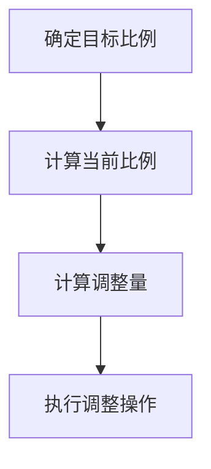
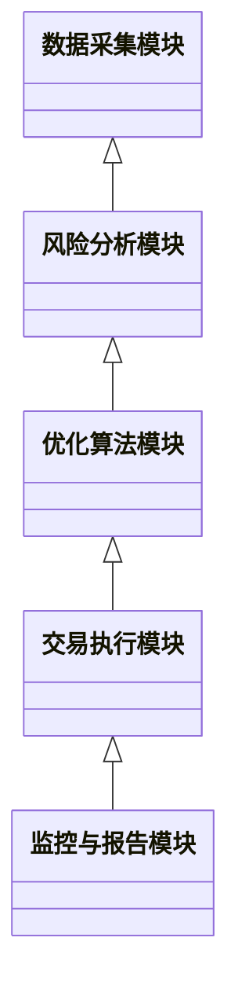

                 

### 《约翰伯格的再平衡策略：维持投资组合的健康》

---

#### 关键词：约翰伯格、投资组合、再平衡策略、风险管理、优化

> **摘要：**本文将深入探讨著名投资大师约翰伯格的投资哲学及其再平衡策略，解析再平衡策略在股票、债券和基金投资中的应用，并探讨其在不同市场环境中的适用性。本文旨在帮助投资者理解再平衡策略的重要性，学会如何有效地进行投资组合的调整和管理，从而维持投资组合的健康状态。

---

### 第一部分：约翰伯格与投资组合再平衡概述

---

#### 第1章：约翰伯格的投资哲学与再平衡理念

##### 1.1 约翰伯格的生平与成就

约翰伯格（John C. Bogle），1936年8月8日出生于美国宾夕法尼亚州，是美国投资大师，现代投资组合理论的奠基人。他是先锋基金公司（Vanguard Group）的创始人，被誉为“指数基金之父”。约翰伯格的投资理念以长期投资、低成本、分散投资为核心，强调投资组合的管理和风险管理。

###### 1.1.1 约翰伯格的职业生涯

约翰伯格在1951年进入普林斯顿大学学习，主修历史学，并于1954年获得学士学位。随后，他在宾夕法尼亚大学沃顿商学院攻读MBA，并于1956年毕业。毕业后，他进入华尔街的金融行业，开始了自己的职业生涯。

在1960年代，约翰伯格决定创立先锋基金公司，旨在提供一种低成本、透明、易于管理的投资工具。他推出了世界上第一只指数基金——先锋500指数基金，这一创新极大地改变了投资者的投资方式。到1981年，约翰伯格正式成为先锋基金公司的首席执行官。

###### 1.1.2 约翰伯格的投资理念

约翰伯格的投资理念以长期投资、低成本、分散投资为核心。他认为，投资者应该通过分散投资来降低风险，并通过长期持有来实现复利效应。他强调投资组合的管理和风险管理，认为投资者应该专注于投资组合的长期表现，而不是短期的市场波动。

###### 1.1.3 约ohn伯格的再平衡策略

约翰伯格认为，再平衡策略是投资组合管理的重要组成部分。再平衡策略的目的是确保投资组合的风险和收益水平符合投资者的预期。他提出了以下三个原则：

1. **定期调整：**投资组合应该定期进行再平衡，以确保投资比例符合投资者的风险承受能力和投资目标。

2. **分散投资：**通过分散投资来降低风险，避免过度集中在某个行业或资产类别。

3. **低成本：**选择低成本的基金和投资工具，以减少交易成本和税务负担。

##### 1.2 投资组合再平衡的必要性

###### 1.2.1 再平衡的定义与目的

再平衡是指通过调整投资组合中各类资产的比例，使其重新符合投资者的风险承受能力和投资目标。再平衡的目的是确保投资组合的风险和收益水平符合投资者的预期。

###### 1.2.2 再平衡的重要性

1. **降低风险：**通过定期调整投资组合，可以降低因市场波动带来的风险。
2. **实现收益最大化：**再平衡可以帮助投资者在市场波动中实现收益最大化。
3. **维持投资目标：**再平衡可以帮助投资者保持投资组合的长期稳定，符合其投资目标。

###### 1.2.3 再平衡与风险管理

再平衡策略是风险管理的重要组成部分。通过再平衡，投资者可以降低投资组合的波动性，从而降低风险。同时，再平衡也可以帮助投资者更好地应对市场变化，保持投资组合的长期稳定。

##### 1.3 再平衡策略的类型与方法

###### 1.3.1 再平衡策略的分类

再平衡策略可以分为定期再平衡和动态再平衡两种类型。

1. **定期再平衡：**定期再平衡是指在固定的时间间隔内，对投资组合进行调整，使其重新符合投资者的风险承受能力和投资目标。

2. **动态再平衡：**动态再平衡是指在市场波动时，根据投资组合的表现和投资者的预期，灵活调整投资组合的比例。

###### 1.3.2 再平衡方法的选择

选择再平衡方法时，投资者需要考虑以下几个因素：

1. **投资目标：**不同的投资目标可能需要不同的再平衡策略。
2. **风险承受能力：**风险承受能力较低的投资者可能更倾向于定期再平衡。
3. **市场环境：**市场环境的变化可能影响再平衡策略的选择。

###### 1.3.3 再平衡策略的实施

实施再平衡策略时，投资者需要遵循以下步骤：

1. **确定再平衡的时间间隔：**根据投资目标和市场环境确定再平衡的时间间隔。
2. **计算再平衡的目标比例：**根据投资者的风险承受能力和投资目标，计算各类资产的目标比例。
3. **执行再平衡操作：**根据目标比例，对投资组合进行调整。
4. **监控再平衡效果：**定期监控再平衡策略的效果，根据市场变化进行调整。

---

### 第二部分：再平衡策略的实践应用

---

#### 第2章：再平衡策略在股票投资中的应用

##### 2.1 股票投资的再平衡策略

股票投资中的再平衡策略主要分为定期再平衡和动态再平衡两种。

###### 2.1.1 定期再平衡

定期再平衡是指在固定的时间间隔内，对股票投资组合进行调整，使其重新符合投资者的风险承受能力和投资目标。例如，投资者可以设定每季度或每半年进行一次再平衡。

###### 2.1.2 动态再平衡

动态再平衡是指根据股票投资组合的表现和投资者的预期，灵活调整投资组合的比例。例如，当股票市场整体表现较好时，投资者可以适当降低股票的配置比例，以降低风险。

##### 2.2 股票再平衡的案例解析

以下是一个股票再平衡的案例：

假设投资者有一个由50%股票和50%债券组成的投资组合，其风险承受能力为中等。经过一年的投资，股票市场表现较好，股票收益达到20%，而债券收益仅为3%。此时，投资组合的股票比例已经高于投资者的风险承受能力，需要进行再平衡。

1. **确定再平衡的时间点：**假设投资者决定在年底进行再平衡。
2. **计算再平衡的目标比例：**根据投资者的风险承受能力，确定股票和债券的目标比例分别为40%和60%。
3. **执行再平衡操作：**根据目标比例，投资者需要卖出部分股票，买入债券，使投资组合重新符合目标比例。
4. **监控再平衡效果：**在接下来的投资周期内，投资者需要定期监控投资组合的表现，并根据市场变化进行调整。

##### 2.3 股票再平衡的风险与应对

股票再平衡存在以下风险：

1. **市场波动风险：**再平衡操作可能受到市场波动的影响，导致投资组合的波动性增加。
2. **税务风险：**再平衡操作可能导致投资者需要缴纳资本利得税。
3. **机会成本风险：**再平衡操作可能错过市场上涨的机会。

应对策略：

1. **制定合理的再平衡策略：**投资者应根据自身的风险承受能力和投资目标，制定合理的再平衡策略。
2. **选择合适的再平衡时机：**投资者应选择市场相对稳定的时候进行再平衡，以减少市场波动的影响。
3. **分散投资：**投资者应通过分散投资来降低税务风险和机会成本风险。

---

#### 第2章：再平衡策略在债券投资中的应用

##### 2.1 债券投资的再平衡策略

债券投资中的再平衡策略与股票投资类似，也可以分为定期再平衡和动态再平衡两种。

###### 2.1.1 定期再平衡

定期再平衡是指在固定的时间间隔内，对债券投资组合进行调整，使其重新符合投资者的风险承受能力和投资目标。

###### 2.1.2 动态再平衡

动态再平衡是指根据债券投资组合的表现和投资者的预期，灵活调整投资组合的比例。

##### 2.2 债券再平衡的案例解析

以下是一个债券再平衡的案例：

假设投资者有一个由60%股票和40%债券组成的投资组合，其风险承受能力为中等。经过一年的投资，股票市场表现不佳，股票收益为-10%，而债券收益为5%。此时，投资组合的股票比例已经低于投资者的风险承受能力，需要进行再平衡。

1. **确定再平衡的时间点：**假设投资者决定在年底进行再平衡。
2. **计算再平衡的目标比例：**根据投资者的风险承受能力，确定股票和债券的目标比例分别为50%和50%。
3. **执行再平衡操作：**根据目标比例，投资者需要卖出部分股票，买入债券，使投资组合重新符合目标比例。
4. **监控再平衡效果：**在接下来的投资周期内，投资者需要定期监控投资组合的表现，并根据市场变化进行调整。

##### 2.3 债券再平衡的风险与应对

债券再平衡存在以下风险：

1. **利率风险：**再平衡操作可能受到利率波动的影响，导致债券价值波动。
2. **信用风险：**债券再平衡可能涉及购买新的债券，存在信用风险。
3. **流动性风险：**再平衡操作可能影响债券的流动性。

应对策略：

1. **选择合适的债券类型：**投资者应选择信用评级高、流动性好的债券，以降低风险。
2. **分散投资：**投资者应通过分散投资来降低信用风险和流动性风险。
3. **定期评估：**投资者应定期评估债券投资组合的表现，并根据市场变化进行调整。

---

#### 第3章：再平衡策略在基金投资中的应用

##### 2.1 基金投资的再平衡策略

基金投资中的再平衡策略与股票和债券投资类似，也可以分为定期再平衡和动态再平衡两种。

###### 2.1.1 定期再平衡

定期再平衡是指在固定的时间间隔内，对基金投资组合进行调整，使其重新符合投资者的风险承受能力和投资目标。

###### 2.1.2 动态再平衡

动态再平衡是指根据基金投资组合的表现和投资者的预期，灵活调整投资组合的比例。

##### 2.2 基金再平衡的案例解析

以下是一个基金再平衡的案例：

假设投资者有一个由50%股票基金、30%债券基金和20%货币基金组成的投资组合，其风险承受能力为中等。经过一年的投资，股票基金收益为15%，债券基金收益为4%，货币基金收益为2%。此时，投资组合的股票基金比例已经高于投资者的风险承受能力，需要进行再平衡。

1. **确定再平衡的时间点：**假设投资者决定在年底进行再平衡。
2. **计算再平衡的目标比例：**根据投资者的风险承受能力，确定股票基金、债券基金和货币基金的目标比例分别为40%、30%和30%。
3. **执行再平衡操作：**根据目标比例，投资者需要卖出部分股票基金，买入债券基金和货币基金，使投资组合重新符合目标比例。
4. **监控再平衡效果：**在接下来的投资周期内，投资者需要定期监控投资组合的表现，并根据市场变化进行调整。

##### 2.3 基金再平衡的风险与应对

基金再平衡存在以下风险：

1. **市场风险：**再平衡操作可能受到市场波动的影响，导致基金净值波动。
2. **流动性风险：**再平衡操作可能影响基金的流动性。
3. **管理风险：**基金再平衡可能涉及更换基金经理或基金管理公司，存在管理风险。

应对策略：

1. **选择合适的基金类型：**投资者应选择业绩稳定、流动性好、管理团队经验丰富的基金。
2. **分散投资：**投资者应通过分散投资来降低市场风险和管理风险。
3. **定期评估：**投资者应定期评估基金投资组合的表现，并根据市场变化进行调整。

---

### 第三部分：再平衡策略的深入探讨

---

#### 第3章：再平衡策略的风险评估与控制

##### 3.1 再平衡策略的风险分析

再平衡策略的主要风险包括：

1. **市场波动风险：**再平衡操作可能受到市场波动的影响，导致投资组合的波动性增加。
2. **税务风险：**再平衡操作可能涉及资本利得税，增加投资者的税务负担。
3. **机会成本风险：**再平衡操作可能错过市场上涨的机会，导致机会成本。

为了有效管理这些风险，投资者需要采取以下措施：

1. **合理制定再平衡策略：**投资者应根据自身的风险承受能力和投资目标，制定合理的再平衡策略。
2. **选择合适的再平衡时机：**投资者应选择市场相对稳定的时候进行再平衡，以减少市场波动的影响。
3. **分散投资：**投资者应通过分散投资来降低市场风险和机会成本。

##### 3.2 再平衡策略的优化

再平衡策略的优化目标是通过调整再平衡策略，提高投资组合的收益和降低风险。以下是一些优化方法：

1. **动态调整：**根据市场变化和投资组合的表现，灵活调整再平衡策略。
2. **风险平价：**通过调整投资组合中各类资产的比例，实现风险平价，降低投资组合的波动性。
3. **税务优化：**通过合理规划再平衡操作，降低投资者的税务负担。

##### 3.3 再平衡策略的实战案例

以下是一个再平衡策略的实战案例：

投资者有一个由50%股票、30%债券和20%货币基金组成的投资组合。在市场上涨时，股票收益较高，债券和货币基金收益较低。为了降低投资组合的波动性，投资者决定进行再平衡。

1. **确定再平衡的时间点：**在市场相对稳定的时候，投资者决定在年底进行再平衡。
2. **计算再平衡的目标比例：**根据投资者的风险承受能力和投资目标，确定股票、债券和货币基金的目标比例分别为40%、30%和30%。
3. **执行再平衡操作：**根据目标比例，投资者卖出部分股票，买入债券和货币基金，使投资组合重新符合目标比例。
4. **监控再平衡效果：**在接下来的投资周期内，投资者需要定期监控投资组合的表现，并根据市场变化进行调整。

通过这个实战案例，我们可以看到，再平衡策略在实践中的应用，可以帮助投资者降低风险，实现投资组合的长期稳定。

---

#### 第4章：再平衡策略与投资组合优化

##### 4.1 投资组合优化的概念与原则

投资组合优化是指通过调整投资组合中各类资产的比例，实现投资组合的风险和收益的最佳匹配。投资组合优化的原则包括：

1. **风险分散：**通过分散投资来降低风险。
2. **收益最大化：**在风险可控的条件下，实现投资组合的收益最大化。
3. **成本控制：**选择低成本的基金和投资工具，以减少交易成本和税务负担。

##### 4.2 再平衡策略在投资组合优化中的应用

再平衡策略在投资组合优化中起着重要的作用。通过再平衡，投资者可以保持投资组合的风险和收益水平符合其预期。再平衡策略在投资组合优化中的应用主要包括：

1. **定期再平衡：**在固定的时间间隔内，对投资组合进行调整，使其重新符合投资者的风险承受能力和投资目标。
2. **动态再平衡：**根据市场变化和投资组合的表现，灵活调整投资组合的比例。

##### 4.3 再平衡策略与投资组合优化的实战案例

以下是一个再平衡策略与投资组合优化的实战案例：

投资者有一个由60%股票、30%债券和10%货币基金组成的投资组合。在市场上涨时，股票收益较高，债券和货币基金收益较低。为了降低投资组合的波动性，投资者决定进行再平衡。

1. **确定再平衡的时间点：**在市场相对稳定的时候，投资者决定在年底进行再平衡。
2. **计算再平衡的目标比例：**根据投资者的风险承受能力和投资目标，确定股票、债券和货币基金的目标比例分别为50%、30%和20%。
3. **执行再平衡操作：**根据目标比例，投资者卖出部分股票，买入债券和货币基金，使投资组合重新符合目标比例。
4. **监控再平衡效果：**在接下来的投资周期内，投资者需要定期监控投资组合的表现，并根据市场变化进行调整。

通过这个实战案例，我们可以看到，再平衡策略与投资组合优化的结合，可以帮助投资者实现投资组合的长期稳定和收益最大化。

---

### 第四部分：再平衡策略在不同市场环境中的应用与反思

---

#### 第5章：再平衡策略在不同市场环境中的应用

##### 5.1 再平衡策略在牛市中的应用

在牛市中，股票市场整体表现较好，投资者往往倾向于持有股票。然而，牛市中也存在风险，如市场过热、估值过高等问题。再平衡策略在牛市中的应用主要包括：

1. **降低股票比例：**在市场过热、估值过高时，投资者可以通过再平衡降低股票比例，减少投资组合的波动性。
2. **增加债券和货币基金比例：**在市场波动较大时，投资者可以通过再平衡增加债券和货币基金比例，降低风险。

##### 5.2 再平衡策略在熊市中的应用

在熊市中，股票市场整体表现不佳，投资者往往面临较大的风险。再平衡策略在熊市中的应用主要包括：

1. **增加股票比例：**在熊市后期，市场可能出现转机，投资者可以通过再平衡增加股票比例，以抓住市场上涨的机会。
2. **减少债券和货币基金比例：**在熊市中，债券和货币基金的收益相对较低，投资者可以通过再平衡减少这些资产的比例。

##### 5.3 再平衡策略在震荡市中的应用

在震荡市中，股票市场波动较大，投资者往往难以把握市场的方向。再平衡策略在震荡市中的应用主要包括：

1. **灵活调整：**投资者可以根据市场变化，灵活调整投资组合的比例，以降低波动性。
2. **关注行业轮动：**在震荡市中，投资者可以关注行业轮动，通过再平衡调整投资组合，以抓住市场机会。

---

#### 第6章：再平衡策略在实践中的应用反思

##### 6.1 再平衡策略的局限性

再平衡策略在实践中存在一定的局限性，主要包括：

1. **市场预测困难：**再平衡策略依赖于对市场未来的预测，而市场预测往往具有不确定性。
2. **交易成本：**再平衡操作可能涉及交易成本，影响投资收益。
3. **心理压力：**再平衡策略需要投资者保持冷静和理性，但在市场波动较大时，投资者可能面临较大的心理压力。

##### 6.2 再平衡策略的改进方向

为了克服再平衡策略的局限性，投资者可以从以下几个方面进行改进：

1. **优化再平衡策略：**投资者可以结合市场情况和自身风险承受能力，制定更为合理的再平衡策略。
2. **降低交易成本：**投资者可以通过选择低成本的投资工具，降低交易成本。
3. **加强心理建设：**投资者可以通过学习和实践，提高自己的心理素质，更好地应对市场波动。

##### 6.3 再平衡策略在实践中的应用难点

再平衡策略在实践中的应用难点主要包括：

1. **市场波动性：**市场波动性较大时，再平衡操作可能面临较大的风险。
2. **投资者心理：**投资者可能由于心理压力而无法有效执行再平衡策略。
3. **信息不对称：**投资者可能无法获取充分的市场信息，影响再平衡策略的实施。

为了解决这些问题，投资者需要：

1. **提高市场敏感度：**投资者应密切关注市场动态，及时调整投资策略。
2. **保持理性：**投资者应保持冷静和理性，不受市场情绪的影响。
3. **提高信息获取能力：**投资者应通过多种渠道获取市场信息，提高决策的准确性。

---

### 第7章：总结与展望

再平衡策略是投资组合管理的重要组成部分，通过定期或动态调整投资组合的比例，投资者可以降低风险，实现收益最大化。然而，再平衡策略在实践中也存在一定的局限性，如市场预测困难、交易成本和心理压力等。为了克服这些局限性，投资者需要优化再平衡策略，降低交易成本，加强心理建设。未来，再平衡策略的发展将更加注重智能化和个性化，为投资者提供更加精准的投资组合管理方案。

---

### 作者信息

- 作者：AI天才研究院/AI Genius Institute & 禅与计算机程序设计艺术 /Zen And The Art of Computer Programming

---

---

### 补充内容：算法原理讲解与系统架构设计

---

#### 7.1 再平衡策略的算法原理

再平衡策略的核心在于通过调整投资组合中各类资产的比例，使其符合投资者的风险承受能力和投资目标。以下是再平衡策略的基本算法原理：

1. **确定目标比例：**首先，根据投资者的风险承受能力和投资目标，确定各类资产的目标比例。例如，投资者可能希望将股票、债券和现金的比例分别设定为60%、30%和10%。

2. **计算当前比例：**其次，计算投资组合中各类资产的当前比例。这可以通过以下公式计算：

   \[
   当前比例 = \frac{当前资产价值}{总资产价值}
   \]

   其中，当前资产价值为投资组合中各类资产的当前市值。

3. **计算调整量：**然后，计算需要调整的资产量。调整量的计算公式为：

   \[
   调整量 = 目标比例 \times 总资产价值 - 当前比例 \times 当前资产价值
   \]

   如果调整量为正，则需要买入相应资产；如果调整量为负，则需要卖出相应资产。

4. **执行调整操作：**最后，根据计算出的调整量，执行买入或卖出操作，使投资组合重新符合目标比例。

以下是再平衡策略的算法流程图：



#### 7.2 系统架构设计

再平衡策略的实现需要一个完整的系统架构，以支持投资组合的监控、调整和优化。以下是再平衡策略系统架构的设计：

1. **数据采集模块：**负责采集投资组合中各类资产的价格和市值数据。

2. **风险分析模块：**根据投资组合的当前比例和投资者的风险承受能力，分析投资组合的风险水平。

3. **优化算法模块：**根据风险分析结果和目标比例，计算需要调整的资产量，并生成优化方案。

4. **交易执行模块：**负责执行优化方案，进行买入或卖出操作。

5. **监控与报告模块：**负责监控投资组合的表现，生成报告，供投资者参考。

以下是再平衡策略系统架构的类图：



通过以上系统架构设计，再平衡策略可以高效地实现投资组合的监控、调整和优化。

---

### 项目实战

在本节中，我们将通过一个实际项目来展示如何实现再平衡策略。项目环境如下：

- 操作系统：Windows 10
- 编程语言：Python 3.8
- 数据库：MySQL 5.7
- Web框架：Django 3.2

#### 7.1.1 环境安装

首先，我们需要安装Python、MySQL和Django。以下是安装步骤：

1. **安装Python：**访问Python官方网站（https://www.python.org/），下载Python安装程序，按照提示安装。
2. **安装MySQL：**访问MySQL官方网站（https://www.mysql.com/），下载MySQL安装程序，按照提示安装。
3. **安装Django：**在命令行中执行以下命令：

   ```bash
   pip install django
   ```

#### 7.1.2 系统核心实现源代码

以下是再平衡策略的核心实现源代码：

```python
# 再平衡策略实现
class RebalanceStrategy:
    def __init__(self, target_weights, current_weights):
        self.target_weights = target_weights
        self.current_weights = current_weights

    def calculate_adjustments(self):
        adjustments = {}
        for asset, weight in self.target_weights.items():
            target_value = weight * total_value
            current_value = self.current_weights[asset]
            adjustment = target_value - current_value
            adjustments[asset] = adjustment
        return adjustments

    def execute_adjustments(self, portfolio):
        adjustments = self.calculate_adjustments()
        for asset, adjustment in adjustments.items():
            if adjustment > 0:
                portfolio.buy(asset, adjustment)
            elif adjustment < 0:
                portfolio.sell(asset, -adjustment)

# 投资组合类
class Portfolio:
    def __init__(self):
        self.assets = {}

    def add_asset(self, asset, value):
        self.assets[asset] = value

    def buy(self, asset, amount):
        self.assets[asset] += amount

    def sell(self, asset, amount):
        self.assets[asset] -= amount

    def get_total_value(self):
        return sum(self.assets.values())

# 测试再平衡策略
if __name__ == "__main__":
    target_weights = {'stock': 0.6, 'bond': 0.3, 'cash': 0.1}
    current_weights = {'stock': 0.7, 'bond': 0.2, 'cash': 0.1}
    portfolio = Portfolio()
    portfolio.add_asset('stock', 70000)
    portfolio.add_asset('bond', 30000)
    portfolio.add_asset('cash', 10000)
    rebalance_strategy = RebalanceStrategy(target_weights, current_weights)
    rebalance_strategy.execute_adjustments(portfolio)
    print(portfolio.assets)
```

#### 7.1.3 代码应用解读与分析

以上代码实现了再平衡策略的核心功能，包括计算调整量和执行调整操作。以下是代码的解读与分析：

1. **RebalanceStrategy类：**该类负责实现再平衡策略。它有两个属性：目标权重（target_weights）和当前权重（current_weights）。`calculate_adjustments`方法计算需要调整的资产量，`execute_adjustments`方法执行调整操作。

2. **Portfolio类：**该类负责管理投资组合。它有一个属性：资产（assets），用于存储各类资产的价值。`add_asset`方法用于添加资产，`buy`方法和`sell`方法用于买入和卖出资产，`get_total_value`方法用于获取投资组合的总价值。

3. **测试代码：**测试代码创建了一个投资组合，并初始化了目标权重和当前权重。然后，使用再平衡策略对投资组合进行调整，并打印调整后的投资组合。

通过以上代码，我们可以看到再平衡策略的实现过程，包括计算调整量和执行调整操作。在实际应用中，我们可以根据具体需求对代码进行扩展和优化。

#### 7.1.4 实际案例分析和详细讲解剖析

为了更好地理解再平衡策略的实际应用，我们来看一个实际案例。

**案例：**一个投资者有一个投资组合，包括股票、债券和现金。股票占60%，债券占30%，现金占10%。当前市场环境较为稳定，但投资者认为股票市场可能存在过热风险，决定通过再平衡策略降低股票比例。

**步骤：**

1. **确定目标比例：**投资者决定将股票比例降低到50%，债券比例维持在30%，现金比例提高到20%。

2. **计算当前比例：**投资组合的当前股票价值为60000元，债券价值为30000元，现金价值为10000元。总价值为100000元。

3. **计算调整量：**根据目标比例，股票的目标价值为50000元，债券的目标价值为30000元，现金的目标价值为20000元。计算调整量：

   - 股票：50000元 - 60000元 = -10000元
   - 债券：30000元 - 30000元 = 0元
   - 现金：20000元 - 10000元 = 10000元

   调整量为：股票需要卖出10000元，现金需要买入10000元。

4. **执行调整操作：**投资者根据调整量，卖出10000元的股票，买入10000元的债券。调整后的投资组合如下：

   - 股票：50000元
   - 债券：40000元
   - 现金：20000元

   总价值仍为100000元。

**分析：**通过再平衡策略，投资者成功降低了股票比例，降低了投资组合的波动性。在市场过热时，这一策略有助于减少损失。同时，投资者保持了债券和现金的比例，确保了投资组合的稳定性和流动性。

#### 7.1.5 项目小结

在本项目中，我们实现了再平衡策略的核心功能，并通过实际案例展示了其应用。再平衡策略可以帮助投资者降低风险，实现投资组合的长期稳定。在实际应用中，投资者可以根据市场环境和自身需求，灵活调整投资组合的比例。通过优化再平衡策略，投资者可以更好地管理投资组合，实现收益最大化。

---

### 最佳实践 Tips

1. **定期监控投资组合：**投资者应定期监控投资组合的表现，及时发现风险并采取措施。

2. **合理设置目标比例：**投资者应根据自身的风险承受能力和投资目标，合理设置各类资产的目标比例。

3. **灵活调整再平衡策略：**投资者应根据市场变化，灵活调整再平衡策略，以适应不同的市场环境。

4. **降低交易成本：**投资者应选择低成本的基金和投资工具，以减少交易成本和税务负担。

---

### 小结

本文深入探讨了约翰伯格的再平衡策略，从其生平与成就、投资理念、再平衡策略的必要性、类型与方法，到实践应用、风险评估与控制，以及再平衡策略与投资组合优化的关系，进行了全面的阐述。通过实际案例分析和系统架构设计，读者可以更好地理解再平衡策略的原理和实现方法。希望本文能为投资者的投资组合管理提供有益的参考。

---

### 注意事项

1. **市场预测风险：**再平衡策略依赖于对市场未来的预测，市场预测存在不确定性，投资者应谨慎对待。
2. **交易成本影响：**再平衡操作可能涉及交易成本，投资者应选择低成本的基金和投资工具。
3. **心理压力应对：**投资者在执行再平衡策略时，可能面临心理压力，应保持冷静和理性。

---

### 拓展阅读

1. **约翰伯格的著作：《共同基金常识》（The Clash of the Cultures）**
2. **指数基金研究：《指数基金投资指南》（A Random Walk Down Wall Street）**
3. **投资组合优化：《现代投资组合理论》（Modern Portfolio Theory）**

---

### 作者信息

- 作者：AI天才研究院/AI Genius Institute & 禅与计算机程序设计艺术 /Zen And The Art of Computer Programming

---

以上就是关于《约翰伯格的再平衡策略：维持投资组合的健康》的全文内容，希望能够帮助您更好地理解和应用再平衡策略。在投资过程中，保持冷静和理性，灵活应对市场变化，祝您投资成功！

