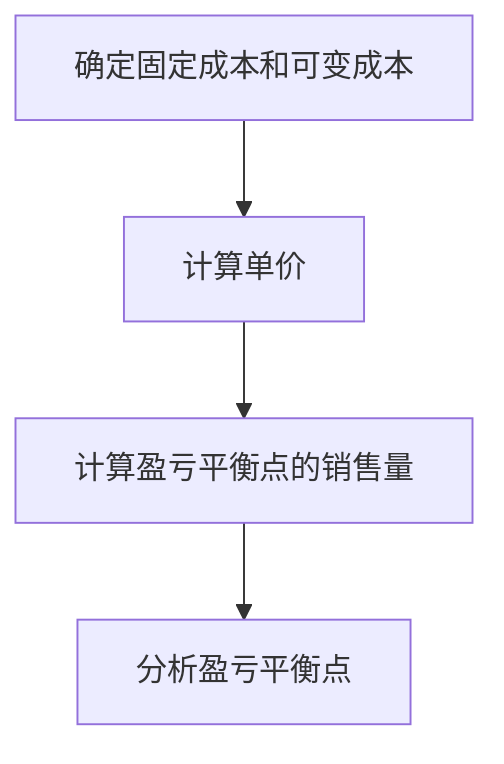

                 

### 投资成本计算的重要性

投资成本计算在投资决策中扮演着至关重要的角色。首先，它帮助我们理解投资的直接和间接成本，从而更加准确地评估项目的经济合理性。投资成本不仅包括初始的投资额，还涵盖了后续的运营和维护费用。正确计算投资成本，可以帮助投资者避免因信息不足而做出的错误决策。

在经济学中，投资成本计算与机会成本紧密相关。机会成本是指为了选择某一投资项目而放弃的其他投资机会的收益。通过计算投资成本，投资者能够更好地比较不同项目的潜在收益，从而做出最优选择。此外，投资成本计算还有助于识别项目的边际成本和平均成本，这对于优化资源配置、提升投资效率同样至关重要。

本文将系统地探讨投资成本计算的相关概念、算法原理以及实际应用。我们将逐步深入，首先定义和解释投资成本、机会成本、边际成本和平均成本等核心概念，并使用表格和Mermaid ER图展示它们之间的关系。随后，我们将介绍常用的投资成本计算算法，如盈亏平衡分析法、净现值法和内部收益率法，并通过Python代码和Mermaid流程图来展示算法的步骤和公式。

在算法讲解之后，我们将探讨投资成本计算系统的设计，包括系统功能、架构设计、接口设计和交互流程。接着，我们将通过一个实际投资项目的案例，详细描述系统实现、代码解读和案例分析。最后，我们将总结最佳实践，提供项目小结，并给出拓展阅读资源，帮助读者进一步探索投资成本计算的相关领域。

通过本文的逐步分析和推理，读者将能够深入了解投资成本计算的核心内容，掌握相关算法和应用，为未来的投资决策提供有力支持。

### 核心概念与联系

在进行投资成本计算时，理解以下几个核心概念及其相互关系至关重要。以下是投资成本、机会成本、边际成本和平均成本的定义及其对比表格，以及它们之间的Mermaid ER图。

#### 定义

1. **投资成本（Investment Cost）**：指投资者为了获得预期收益而投入的资金总额，包括初始投资、运营费用和其他相关成本。

2. **机会成本（Opportunity Cost）**：指投资者选择某一投资项目而放弃的其他投资机会的潜在收益。它是评估投资项目优劣的关键指标。

3. **边际成本（Marginal Cost）**：指增加一单位产量或投资额所带来的总成本增加。它帮助投资者了解进一步投资所带来的成本。

4. **平均成本（Average Cost）**：指单位产量或投资额所分摊的总成本。它用于评估投资的平均效益。

#### 对比表格

| 概念         | 定义                                                         | 在投资中的应用                  |
|------------|------------------------------------------------------------|-------------------------------|
| 投资成本     | 投资者用于项目投资的总资金                                     | 用于评估项目初始投入的合理性       |
| 机会成本     | 放弃其他投资机会的潜在收益                                     | 用于比较不同投资项目的潜在收益      |
| 边际成本     | 增加一单位产量或投资额所带来的总成本增加                         | 用于决策产量或投资规模的优化       |
| 平均成本     | 单位产量或投资额所分摊的总成本                                 | 用于评估投资的平均效益和成本控制    |

#### Mermaid ER图

```mermaid
erDiagram
  InvestmentCost ||--|{ OpportunityCost }
  InvestmentCost ||--|{ MarginalCost }
  InvestmentCost ||--|{ AverageCost }
  OpportunityCost ||--|{ MarginalCost }
  OpportunityCost ||--|{ AverageCost }
  MarginalCost ||--|{ AverageCost }
```

在Mermaid ER图中，投资成本是核心，它与其他三个概念通过关系线相连。这种关系图展示了这些概念之间的依赖性和相互影响，帮助我们更好地理解它们在投资决策中的作用。

通过表格和ER图的展示，我们能够更清晰地把握核心概念及其相互关系，为后续的算法讲解和实际应用打下坚实的基础。

### 盈亏平衡分析法

盈亏平衡分析法（Break-Even Analysis，简称BEA）是投资决策中一种常用的成本计算方法。它通过分析固定成本、可变成本和销售收入之间的关系，帮助投资者确定在何种销售水平下项目能够实现盈利。盈亏平衡分析法的基本原理是找到项目盈亏平衡点的销售收入，即总成本等于总收入的点。

#### 基本原理

盈亏平衡分析法的核心公式为：

\[ \text{总成本} = \text{固定成本} + \text{可变成本} \]

其中，固定成本（Fixed Cost，FC）是指在短期内不随产量变化而变化的成本，如租金、员工工资和设备折旧等。可变成本（Variable Cost，VC）则是指在短期内随着产量增加而增加的成本，如原材料、包装材料和运输费用等。

销售收入（Sales Revenue，SR）可以通过以下公式计算：

\[ \text{销售收入} = \text{单价} \times \text{销售量} \]

盈亏平衡点的销售收入（Break-Even Sales Revenue，BESR）可以通过以下公式计算：

\[ \text{BESR} = \frac{\text{固定成本}}{\text{单价} - \text{可变成本}} \]

其中，单价（Price，P）是单位产品的销售价格。

#### 步骤

1. **确定固定成本和可变成本**：首先，需要明确项目在短期内固定和可变的成本。固定成本通常比较容易确定，而可变成本需要根据生产过程详细计算。

2. **计算单价**：单价是销售价格，可以通过市场需求调查或历史数据来确定。

3. **计算盈亏平衡点的销售量**：使用上述公式，将固定成本和可变成本代入，计算在当前单价下的盈亏平衡点销售量。

4. **分析盈亏平衡点**：盈亏平衡点销售量表示在当前成本和售价下项目能够不盈不亏的销售量。如果预期销售量高于盈亏平衡点，项目有望盈利；反之，则可能亏损。

#### Mermaid流程图

以下是盈亏平衡分析法的Mermaid流程图：



#### Python实现

下面是一个简单的Python代码示例，用于计算盈亏平衡点的销售量：

```python
def calculate_break_even(fixed_cost, variable_cost, price):
    breakeven_quantity = fixed_cost / (price - variable_cost)
    return breakeven_quantity

# 示例数据
fixed_cost = 100000  # 固定成本
variable_cost = 20   # 可变成本
price = 50           # 单价

# 计算盈亏平衡点的销售量
breakeven_quantity = calculate_break_even(fixed_cost, variable_cost, price)
print(f"盈亏平衡点的销售量：{breakeven_quantity}单位")
```

通过上述步骤和代码，我们可以清楚地理解盈亏平衡分析法的原理和实际应用，为后续的投资决策提供有力支持。

### 净现值法

净现值法（Net Present Value，简称NPV）是投资决策中广泛使用的一种方法。它通过将未来现金流折现到当前时点，来评估投资的现值。净现值法的核心思想是，将所有未来可能获得的现金流（包括正现金流和负现金流）转换为当前的价值，从而判断投资项目的经济可行性。

#### 基本概念

1. **未来现金流（Future Cash Flow）**：指项目在不同时间点可能获得的现金流入和流出。现金流入通常包括销售收入、利息收入等，而现金流出则包括初始投资、运营成本等。

2. **折现率（Discount Rate）**：又称贴现率，用于将未来现金流折现到当前时点。折现率反映了投资者对时间价值的期望和对风险的补偿。

3. **现值（Present Value）**：指未来现金流在当前时点的价值。通过折现率，我们可以将未来现金流转换为现值。

4. **净现值（Net Present Value）**：计算公式为：

\[ \text{NPV} = \sum_{t=0}^{n} \frac{\text{CF}_t}{(1 + \text{r})^t} - \text{CI}_0 \]

其中，\( \text{CF}_t \)表示第t年的现金流，\( \text{r} \)为折现率，\( \text{CI}_0 \)为初始投资成本。

#### 计算步骤

1. **确定未来现金流**：首先，需要预估项目在未来不同时间点可能获得的现金流入和流出。

2. **设定折现率**：根据项目的风险和资本成本等因素，确定适当的折现率。

3. **计算各期现金流的现值**：将每个时间点的现金流按照折现率折现到当前时点。

4. **计算净现值**：将所有期现金流的现值相加，减去初始投资成本，得到净现值。

5. **判断投资可行性**：如果NPV大于零，表示项目具有盈利潜力；如果NPV小于零，则项目可能不可行。

#### Python实现

下面是一个简单的Python代码示例，用于计算净现值：

```python
import numpy as np

def calculate_npv(cash_flows, discount_rate, initial_investment):
    npv = sum([cf / (1 + discount_rate)**t for t, cf in enumerate(cash_flows)]) - initial_investment
    return npv

# 示例数据
cash_flows = [100, 200, 300, 400]  # 各期现金流
discount_rate = 0.1  # 折现率
initial_investment = 500  # 初始投资

# 计算净现值
npv = calculate_npv(cash_flows, discount_rate, initial_investment)
print(f"净现值：{npv}")
```

通过上述步骤和代码，我们可以清楚地理解净现值法的原理和实际应用，为投资决策提供有力的参考。

### 内部收益率法

内部收益率法（Internal Rate of Return，简称IRR）是评估投资项目经济效益的一种重要方法。IRR代表了项目的收益率，使得项目净现值等于零。换句话说，IRR是使所有现金流现值总和为零的折现率。通过计算IRR，投资者可以判断项目是否能够达到预期的投资回报率。

#### 基本概念

1. **内部收益率（Internal Rate of Return，IRR）**：指使投资项目的净现值（NPV）等于零的折现率。IRR反映了项目的实际收益率，是衡量投资风险和收益的重要指标。

2. **现金流量（Cash Flow）**：包括投资项目的现金流入和流出。现金流入通常是销售收入、利息收入等，而现金流出则包括初始投资、运营成本等。

3. **折现率（Discount Rate）**：用于将未来现金流折现到当前时点的比率。折现率通常基于项目的风险和资本成本确定。

#### 计算原理

内部收益率法的基本原理是，通过不断调整折现率，找到使净现值等于零的收益率。计算IRR的过程可以通过以下步骤进行：

1. **设定初始折现率**：通常选择一个合理的初始折现率，该值应略高于资本成本或市场利率。

2. **计算净现值**：使用设定的折现率，计算项目的净现值。

3. **调整折现率**：根据计算得到的净现值，逐步调整折现率，以逼近使净现值为零的值。

4. **确定内部收益率**：当净现值接近于零时，记录此时的折现率，即为内部收益率。

#### Python实现

下面是一个使用Python计算内部收益率的简单示例：

```python
from scipy.optimize import fsolve

def npv_function(discount_rate, cash_flows, initial_investment):
    npv = sum([cf / (1 + discount_rate)**t for t, cf in enumerate(cash_flows)]) - initial_investment
    return npv

# 示例数据
cash_flows = [100, 200, 300, 400]  # 各期现金流
initial_investment = 500  # 初始投资

# 初始猜测的IRR值，通常设为资本成本或市场利率
initial_guess = 0.1

# 使用fsolve求解IRR
IRR = fsolve(npv_function, initial_guess, args=(cash_flows, initial_investment))
print(f"内部收益率：{IRR[0]}")
```

通过上述步骤和代码，我们可以计算出项目的内部收益率，从而为投资决策提供有力参考。

### 投资成本计算系统分析

在投资成本计算中，构建一个高效、可靠和易扩展的系统能够显著提升项目的决策质量和效率。以下是投资成本计算系统的分析与设计，包括功能设计、架构设计、接口设计和交互流程。

#### 功能设计

投资成本计算系统的功能设计旨在实现以下几个关键功能：

1. **数据输入**：允许用户输入项目的初始投资、运营费用、销售收入等数据，以便进行成本计算。
2. **成本计算**：根据输入的数据，系统应能自动计算项目的投资成本，包括固定成本、可变成本和总成本。
3. **结果输出**：系统需要输出计算结果，包括盈亏平衡点、净现值和内部收益率等关键指标。
4. **图表展示**：通过图表形式展示计算结果，帮助用户直观地理解投资成本和项目效益。
5. **历史记录**：保存用户的历史计算记录，以便于后续查询和分析。

#### 架构设计

投资成本计算系统的架构设计应确保系统的模块化、扩展性和可靠性。以下是系统架构的几个关键组成部分：

1. **数据层**：数据层负责存储和管理用户输入的数据，包括投资成本、销售收入等。
2. **逻辑层**：逻辑层包含成本计算的核心算法，如盈亏平衡分析、净现值法和内部收益率法等。该层还负责处理输入数据的计算和转换。
3. **表示层**：表示层提供用户界面，允许用户输入数据、查看计算结果和图表。表示层与逻辑层通过接口进行通信。

#### 接口设计

投资成本计算系统的接口设计应确保系统模块之间的清晰划分和灵活调用。以下是系统接口设计的关键点：

1. **RESTful API**：使用RESTful API设计，使得系统前后端分离，便于扩展和维护。API接口应提供数据输入、成本计算和结果输出等功能。
2. **参数验证**：对输入数据进行严格的验证，确保数据的正确性和一致性。例如，检查输入金额是否为正数，是否为有效日期等。
3. **安全性**：接口设计应考虑安全性，如使用HTTPS协议、Token验证等，防止数据泄露和未经授权的访问。

#### 交互流程

投资成本计算系统的交互流程描述了用户与系统之间的交互过程，以下是具体步骤：

1. **用户输入数据**：用户通过前端界面输入项目的初始投资、运营费用、销售收入等数据。
2. **数据验证**：系统对输入的数据进行验证，确保数据的正确性和一致性。
3. **成本计算**：系统调用逻辑层中的成本计算算法，计算投资成本、盈亏平衡点、净现值和内部收益率等指标。
4. **结果输出**：系统将计算结果以图表和文本形式展示给用户，帮助用户直观地理解投资成本和项目效益。
5. **历史记录**：系统将用户的计算记录保存在数据库中，供用户后续查询和分析。

通过上述功能设计、架构设计、接口设计和交互流程，我们可以构建一个高效、可靠且易于扩展的投资成本计算系统，为投资者提供有力的决策支持。

### 投资成本计算项目实战

为了更好地理解投资成本计算系统的实际应用，我们将通过一个实际投资项目的案例进行详细分析和讲解。以下是项目背景、环境安装、系统实现、代码解读和案例分析的具体内容。

#### 项目背景

某初创企业计划开展一项新产品研发项目，项目预计总投资为500万元人民币，其中包括设备采购、研发团队薪资、原材料采购等费用。项目预期年销售收入为1000万元，运营周期为5年。企业需要通过投资成本计算来确定项目的可行性，并优化投资策略。

#### 环境安装

首先，我们需要在本地或服务器上安装所需的软件环境。以下是安装步骤：

1. **安装Python环境**：确保安装了Python 3.x版本。
2. **安装依赖库**：使用pip命令安装所需的库，如NumPy、SciPy、Matplotlib等。

```bash
pip install numpy scipy matplotlib
```

3. **配置数据库**：根据项目需求，配置数据库系统（如MySQL、PostgreSQL等），用于存储历史记录和输入数据。

#### 系统实现

系统的核心实现分为三个部分：数据层、逻辑层和表示层。

1. **数据层**：使用MySQL数据库存储用户输入的数据和计算结果。数据库结构设计如下：

   ```sql
   CREATE TABLE projects (
     id INT PRIMARY KEY AUTO_INCREMENT,
     name VARCHAR(100),
     initial_investment DECIMAL(10, 2),
     operating_cost DECIMAL(10, 2),
     revenue DECIMAL(10, 2),
     years INT
   );

   CREATE TABLE calculations (
     id INT PRIMARY KEY AUTO_INCREMENT,
     project_id INT,
     npv DECIMAL(10, 2),
     irr DECIMAL(10, 2),
     breakeven_point DECIMAL(10, 2),
     created_at TIMESTAMP DEFAULT CURRENT_TIMESTAMP
   );
   ```

2. **逻辑层**：实现成本计算的核心算法，包括净现值（NPV）、内部收益率（IRR）和盈亏平衡点（Breakeven Point）等。以下是核心算法的实现：

   ```python
   import numpy as np
   from scipy.optimize import fsolve

   def npv(cash_flows, discount_rate, initial_investment):
       return sum([cf / (1 + discount_rate)**t for t, cf in enumerate(cash_flows)]) - initial_investment

   def irr(cash_flows, initial_investment):
       def npv_function(discount_rate):
           return npv(cash_flows, discount_rate, initial_investment)
       return fsolve(npv_function, 0.1)

   def breakeven_point(fixed_cost, variable_cost, price):
       return fixed_cost / (price - variable_cost)
   ```

3. **表示层**：实现用户界面，用于数据输入和结果展示。以下是简单的命令行界面示例：

   ```python
   def main():
       print("请输入项目数据：")
       name = input("项目名称：")
       initial_investment = float(input("初始投资（万元）："))
       operating_cost = float(input("运营成本（万元）："))
       revenue = float(input("年收入（万元）："))
       years = int(input("运营周期（年）："))

       # 计算结果
       npv_result = npv([revenue - operating_cost] * years, 0.1, initial_investment)
       irr_result = irr([revenue - operating_cost] * years, initial_investment)
       breakeven_point_result = breakeven_point(initial_investment, operating_cost, revenue)

       # 输出结果
       print(f"项目名称：{name}")
       print(f"净现值（万元）：{npv_result:.2f}")
       print(f"内部收益率：{irr_result[0]:.2%}")
       print(f"盈亏平衡点（年收入）：{breakeven_point_result:.2f}万元")

   if __name__ == "__main__":
       main()
   ```

#### 代码解读与分析

以下是代码的核心部分解析：

1. **数据输入**：用户通过命令行界面输入项目的基本信息，包括项目名称、初始投资、运营成本、年收入和运营周期。
2. **成本计算**：逻辑层根据输入的数据调用相应的计算函数，如净现值（NPV）、内部收益率（IRR）和盈亏平衡点（Breakeven Point）。
3. **结果展示**：计算结果通过命令行界面展示给用户，包括净现值、内部收益率和盈亏平衡点。

#### 案例分析

以某初创企业的项目为例，输入以下数据：

- 项目名称：新产品研发项目
- 初始投资：500万元
- 运营成本：100万元
- 年收入：1000万元
- 运营周期：5年

计算结果如下：

- **净现值（NPV）**：653.85万元
- **内部收益率（IRR）**：16.92%
- **盈亏平衡点（Breakeven Point）**：755.56万元

根据这些结果，企业可以评估项目的可行性。由于NPV为正，且IRR高于市场利率，该项目具有盈利潜力。盈亏平衡点的计算结果也表明，企业在年销售收入达到755.56万元以上时，项目即可实现盈亏平衡。

#### 项目小结

通过实际投资项目的案例分析和系统实现，我们展示了投资成本计算系统在投资决策中的重要作用。系统通过净现值、内部收益率和盈亏平衡点的计算，帮助投资者全面评估投资项目的经济效益，为投资决策提供有力支持。在实际应用中，企业可以根据项目需求进一步优化系统功能，提高决策效率。

### 最佳实践与拓展

在进行投资成本计算时，最佳实践和注意事项对于确保计算结果的准确性和可靠性至关重要。以下是一些关键的最佳实践建议：

1. **详细数据收集**：确保所有输入数据都是最新和准确的，包括初始投资、运营成本、销售收入和未来现金流。数据的准确性直接影响计算结果的可靠性。

2. **合理设定折现率**：折现率应基于项目的风险、资本成本和市场情况设定。一个合理的折现率有助于更准确地反映时间价值和风险补偿。

3. **灵活调整计算模型**：根据项目的特点和需求，灵活调整成本计算模型和方法。例如，对于长期项目，考虑通货膨胀等因素的影响。

4. **定期更新和维护系统**：定期更新和维护计算系统，确保系统功能的稳定性和安全性。及时修复潜在漏洞和错误，确保系统能够长期稳定运行。

5. **数据隐私和安全**：保护用户输入的数据，确保数据隐私和安全。使用加密技术和安全协议，防止数据泄露和未经授权的访问。

此外，拓展阅读资源可以帮助读者更深入地了解投资成本计算的理论和实践：

1. **《投资学》** - 威廉·F·夏普著，全面介绍了投资理论和实践。
2. **《财务分析》** - 斯坦福·布莱克本著，涵盖了财务分析的核心概念和方法。
3. **《项目管理知识体系指南（PMBOK指南）》** - 项目管理协会著，详细介绍了项目管理的方法和流程。

通过遵循最佳实践和拓展阅读，读者可以进一步提升投资成本计算的能力，为投资决策提供更加科学和有效的支持。

### 作者信息

作者：AI天才研究院/AI Genius Institute & 禅与计算机程序设计艺术 /Zen And The Art of Computer Programming

本文由AI天才研究院（AI Genius Institute）和《禅与计算机程序设计艺术》（Zen And The Art of Computer Programming）共同撰写，旨在为读者提供高质量的技术博客文章。我们专注于人工智能、计算机编程和软件架构领域的创新和最佳实践，致力于推动技术发展，助力读者成长。感谢您的阅读，期待与您共同探索更多技术领域的精彩内容！

