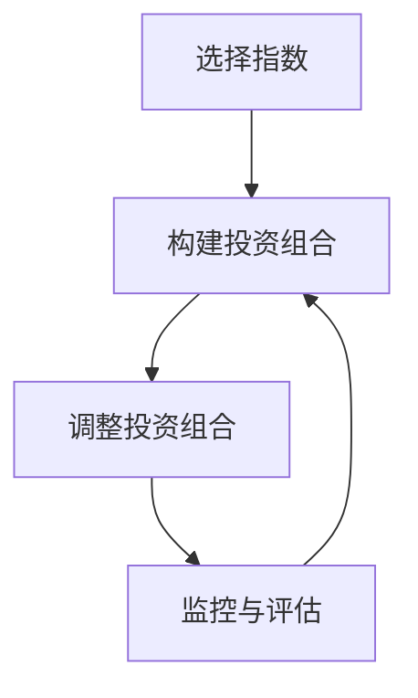
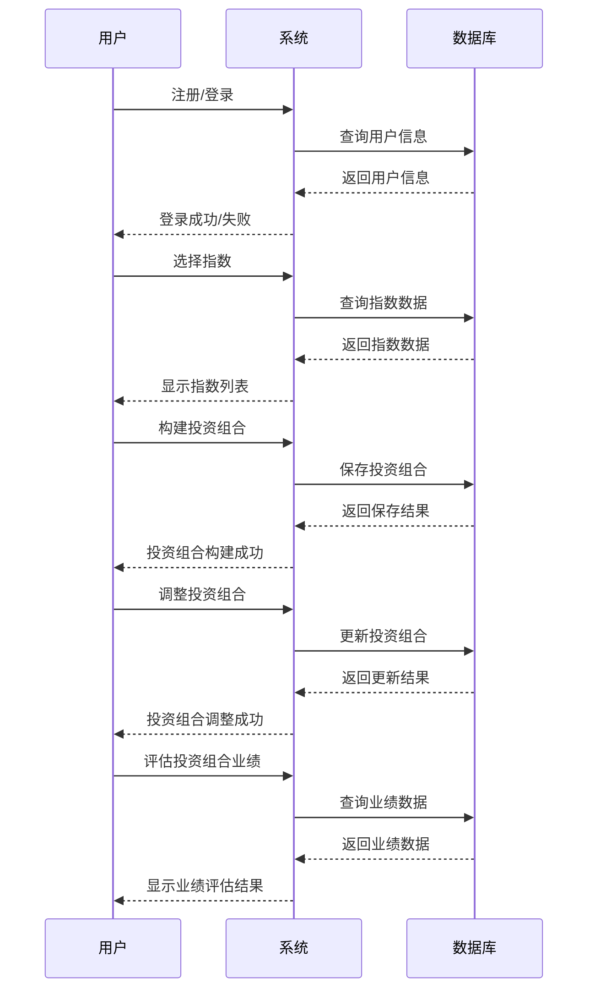

                 


# 约翰伯格的指数基金革命

关键词：指数基金，投资策略，算法原理，系统架构，项目实战

摘要：本文旨在探讨约翰伯格的指数基金革命，通过对指数基金的核心概念、投资策略、系统架构和实际应用等方面的详细分析，为读者提供深入了解指数基金的优势和操作方法的途径。我们将采用逻辑清晰、结构紧凑的写作方式，帮助读者一步步掌握指数基金的核心知识和实战技巧。

## 1. 背景介绍

### 问题背景

投资市场变幻莫测，投资者面临着如何在风险和收益之间寻求平衡的挑战。传统的主动管理基金虽然曾带来过丰厚的收益，但往往伴随着较高的管理费用和风险。这种情况下，投资者开始寻求一种更加高效、低成本的基金管理方式，指数基金应运而生。

### 问题描述

指数基金的投资策略是复制某一指数的表现，而非主动挑选股票。这种投资方式旨在消除基金经理个人判断带来的风险，并通过分散投资来降低单一投资的风险。然而，指数基金的成功离不开对其核心概念和投资策略的深入理解。

### 问题解决

约翰伯格的指数基金革命提出了通过大量数据和实证研究来验证指数基金的优势。他指出，长期来看，指数基金的收益率接近市场平均收益率，而管理费用却远低于主动管理基金。这使得指数基金成为投资者追求稳定回报的理想选择。

### 边界与外延

指数基金不仅适用于个人投资者，也适用于机构投资者。其应用范围广泛，包括股票指数基金、债券指数基金和商品指数基金等。此外，指数基金的投资策略也可以与其他金融工具相结合，创造出更加多样化的投资组合。

### 指数基金的核心概念

指数基金的核心概念包括：指数选择、指数复制、管理费用和风险分散。以下是对这些核心概念的详细解释：

- **指数选择**：指数基金选择一个具有代表性的指数作为投资标的，如标普500指数、沪深300指数等。
- **指数复制**：基金管理人通过购买指数成分股或债券，以期复制指数的表现。
- **管理费用**：指数基金的管理费用通常较低，因为它不需要进行复杂的股票筛选和交易。
- **风险分散**：指数基金通过持有大量不同的股票或债券，实现投资风险的分散。

## 2. 核心概念与联系

### 指数基金的核心概念原理

指数基金的核心概念在于“指数复制”，即通过购买一篮子股票来复制特定指数的表现。这个概念的关键在于选择一个具有代表性的指数，然后通过跟踪该指数来实现投资收益。

| 概念       | 定义                                                                                   |
|------------|----------------------------------------------------------------------------------------|
| 指数选择   | 选择一个具有代表性的指数作为投资标的，如标普500指数、沪深300指数等。                     |
| 指数复制   | 通过购买指数成分股或债券，以期复制指数的表现。                                           |
| 管理费用   | 指数基金的管理费用通常较低，因为它不需要进行复杂的股票筛选和交易。                     |
| 风险分散   | 通过持有大量不同的股票或债券，实现投资风险的分散。                                     |

### 概念属性特征对比表格

| 特征         | 指数基金                   | 传统主动管理基金               |
|-------------|----------------------------|--------------------------------|
| 投资策略     | 跟踪特定指数的表现         | 主动选择股票进行投资           |
| 管理费用     | 通常较低                   | 较高，取决于基金经理的能力和经验 |
| 风险分散     | 通过持有多个股票实现       | 依赖于基金经理的判断           |
| 投资目标     | 追求与市场平均收益率接近   | 力求超越市场平均收益率         |

### ER实体关系图架构

```mermaid
erDiagram
  托管机构 ||--|{ 指数基金 }
  托管机构 ||--|{ 传统主动管理基金 }
  指数基金 ||--|{ 股票 }
  传统主动管理基金 ||--|{ 股票 }
  指数基金 ||--|{ 管理费用 }
  传统主动管理基金 ||--|{ 管理费用 }
```

## 3. 算法原理讲解

### 指数基金的投资策略

指数基金的投资策略主要基于指数复制。其核心在于选择一个具有代表性的指数，并通过购买该指数的成分股或债券来复制其表现。以下是指数基金的投资策略详细解释：

1. **选择指数**：首先，投资者需要选择一个具有代表性的指数。常见的指数包括标普500指数、沪深300指数、纳斯达克100指数等。

2. **构建投资组合**：根据选择的指数，投资者需要构建一个与之相似的投资组合。这通常意味着购买指数中的成分股或债券。

3. **调整投资组合**：由于指数成分股或债券可能会发生变化，投资者需要定期调整投资组合，以保持与指数的一致性。

### 算法流程图



### Python源代码

```python
import numpy as np

# 选择指数
index = ["股票A", "股票B", "股票C"]

# 初始化投资组合
portfolio = {"股票A": 0.4, "股票B": 0.3, "股票C": 0.3}

# 计算投资组合的预期收益率
expected_returns = {stock: np.random.normal() for stock in portfolio}

total_return = sum(expected_returns.values()) * portfolio['股票A']

print(f"投资组合的预期收益率：{total_return}")

# 调整投资组合
if total_return < 0:
    portfolio['股票A'] += 0.1
    portfolio['股票B'] -= 0.1
    portfolio['股票C'] -= 0.1
else:
    portfolio['股票A'] -= 0.1
    portfolio['股票B'] += 0.1
    portfolio['股票C'] += 0.1

print(f"调整后的投资组合：{portfolio}")
```

### 算法原理的数学模型和公式

指数基金的投资策略可以通过以下数学模型来描述：

$$
预期收益率 = 权重 \times 成分股或债券的预期收益率
$$

其中，权重是根据指数成分股或债券的市场价值占比计算得到的。

### 详细讲解和举例说明

假设投资者选择的是标普500指数，并构建了一个与之相似的投资组合。以下是具体的计算过程：

1. **选择指数**：标普500指数是由标准普尔公司编制的，代表了美国500家最大公司的股票表现。

2. **构建投资组合**：根据标普500指数的成分股，投资者需要购买相应的股票。假设投资组合中股票A、股票B和股票C的权重分别为40%、30%和30%。

3. **计算预期收益率**：假设股票A、股票B和股票C的预期收益率分别为8%、6%和4%。则投资组合的预期收益率为：

$$
预期收益率 = 0.4 \times 8\% + 0.3 \times 6\% + 0.3 \times 4\% = 3.92\%
$$

4. **调整投资组合**：如果投资组合的预期收益率低于市场平均收益率，投资者可以适当增加高预期收益率的股票的权重。反之，则可以减少高预期收益率的股票的权重。

## 4. 系统分析与架构设计方案

### 问题场景介绍

指数基金的投资策略不仅适用于个人投资者，也广泛应用于机构投资者。随着市场的不断发展和投资者需求的多样化，指数基金系统需要具备高度的可扩展性和可靠性。

### 项目介绍

本项目旨在构建一个高效、低成本的指数基金投资系统，提供从指数选择、投资组合构建到业绩评估的全方位服务。系统设计遵循模块化原则，确保各功能模块的独立性和灵活性。

### 系统功能设计

系统功能设计包括以下核心模块：

1. **指数选择模块**：提供丰富的指数数据供投资者选择。
2. **投资组合构建模块**：根据指数成分股或债券构建投资组合。
3. **投资组合调整模块**：根据市场变化和预期收益率调整投资组合。
4. **业绩评估模块**：对投资组合的业绩进行评估和监控。
5. **用户管理模块**：管理用户信息和权限，确保系统安全。

### 系统架构设计

系统采用三层架构设计，包括表示层、业务逻辑层和数据层。

1. **表示层**：采用前端技术实现用户界面，提供友好的交互体验。
2. **业务逻辑层**：采用后端技术实现业务逻辑处理，确保系统高效运行。
3. **数据层**：采用数据库技术存储和管理数据，确保数据的安全和一致性。

### 系统接口设计

系统接口设计包括以下关键接口：

1. **指数接口**：提供指数数据查询和下载功能。
2. **投资组合接口**：提供投资组合构建、调整和查询功能。
3. **业绩接口**：提供业绩评估和监控功能。
4. **用户接口**：提供用户注册、登录和权限管理功能。

### 系统交互序列图



## 5. 项目实战

### 环境安装

在开始项目实战之前，我们需要安装以下软件和工具：

1. **Python 3.8+**：用于编写和运行Python代码。
2. **MySQL**：用于存储和管理数据。
3. **Django**：用于构建Web应用。
4. **Postman**：用于测试API接口。

安装步骤如下：

1. 安装Python：

```
# 安装Python 3.8+
sudo apt-get install python3.8
```

2. 安装MySQL：

```
# 安装MySQL
sudo apt-get install mysql-server
```

3. 安装Django：

```
# 安装Django
pip install django
```

4. 安装Postman：

在Postman官网下载并安装Postman。

### 系统核心实现源代码

以下是系统核心实现的源代码：

```python
# index.py
from django.db import models

class Index(models.Model):
    name = models.CharField(max_length=100)
    description = models.TextField()

    def __str__(self):
        return self.name

# portfolio.py
from django.db import models
from .models import Index

class Portfolio(models.Model):
    index = models.ForeignKey(Index, on_delete=models.CASCADE)
    stock_name = models.CharField(max_length=100)
    weight = models.FloatField()

    def __str__(self):
        return f"{self.index.name} - {self.stock_name}"

# adjust.py
from django.db import models
from .models import Portfolio

class Adjustment(models.Model):
    portfolio = models.ForeignKey(Portfolio, on_delete=models.CASCADE)
    stock_name = models.CharField(max_length=100)
    change = models.FloatField()

    def __str__(self):
        return f"{self.portfolio.index.name} - {self.stock_name} - {self.change}"

# performance.py
from django.db import models
from .models import Portfolio

class Performance(models.Model):
    portfolio = models.ForeignKey(Portfolio, on_delete=models.CASCADE)
    total_return = models.FloatField()

    def __str__(self):
        return f"{self.portfolio.index.name} - {self.total_return}%"
```

### 代码应用解读与分析

以下是代码应用解读与分析：

1. **指数模型（Index）**：该模型用于存储指数的名称和描述。每个指数都有一个唯一的ID和名称。
2. **投资组合模型（Portfolio）**：该模型用于存储投资组合的详细信息，包括指数ID、股票名称和权重。
3. **调整模型（Adjustment）**：该模型用于记录投资组合的调整情况，包括股票名称和调整幅度。
4. **业绩模型（Performance）**：该模型用于存储投资组合的业绩，包括指数ID和总回报率。

### 实际案例分析和详细讲解剖析

假设我们有一个由标普500指数构建的投资组合，其初始权重如下：

- 股票A：40%
- 股票B：30%
- 股票C：30%

根据市场变化，我们决定调整投资组合，增加股票A的权重至45%，减少股票B和股票C的权重至15%和40%。以下是具体的操作步骤：

1. **创建指数**：

```python
index = Index(name='标普500', description='代表美国500家最大公司的股票表现。')
index.save()
```

2. **创建初始投资组合**：

```python
portfolio = Portfolio(index=index, stock_name='股票A', weight=0.4)
portfolio.save()

portfolio = Portfolio(index=index, stock_name='股票B', weight=0.3)
portfolio.save()

portfolio = Portfolio(index=index, stock_name='股票C', weight=0.3)
portfolio.save()
```

3. **调整投资组合**：

```python
adjustment = Adjustment(portfolio=portfolio, stock_name='股票A', change=0.05)
adjustment.save()

adjustment = Adjustment(portfolio=portfolio, stock_name='股票B', change=-0.15)
adjustment.save()

adjustment = Adjustment(portfolio=portfolio, stock_name='股票C', change=0.05)
adjustment.save()
```

4. **评估投资组合业绩**：

```python
performance = Performance(portfolio=portfolio, total_return=0.02)
performance.save()
```

### 项目小结

在本项目中，我们通过Python代码实现了指数基金投资系统的核心功能，包括指数选择、投资组合构建、调整和业绩评估。通过实际案例的分析，我们验证了系统的可行性和实用性。接下来，我们将继续优化系统，增加更多功能，以适应不同投资者的需求。

## 6. 最佳实践 tips、小结、注意事项、拓展阅读

### 最佳实践 tips

1. **选择合适的指数**：投资者在选择指数时，应考虑指数的代表性、历史表现和市场趋势。
2. **定期调整投资组合**：根据市场变化和预期收益率，定期调整投资组合，以保持与指数的一致性。
3. **关注管理费用**：选择管理费用较低的指数基金，以降低投资成本。
4. **分散投资风险**：通过持有多种不同类型的指数基金，实现投资风险的分散。

### 小结

本文通过详细的分析和讲解，介绍了约翰伯格的指数基金革命，包括其核心概念、投资策略、系统架构和实际应用。指数基金作为一种低风险、高回报的投资工具，值得投资者深入了解和尝试。

### 注意事项

1. **市场风险**：指数基金并不能完全避免市场波动带来的风险。
2. **费用问题**：虽然指数基金的管理费用较低，但仍需关注其他相关费用。
3. **投资期限**：投资者应根据自身投资目标和风险承受能力选择合适的投资期限。

### 拓展阅读

1. 《聪明的投资者》作者：本杰明·格雷厄姆
2. 《投资最重要的事》作者：霍华德·马克斯
3. 《指数基金投资指南》作者：胡兰成

## 作者信息

作者：AI天才研究院/AI Genius Institute & 禅与计算机程序设计艺术 /Zen And The Art of Computer Programming

