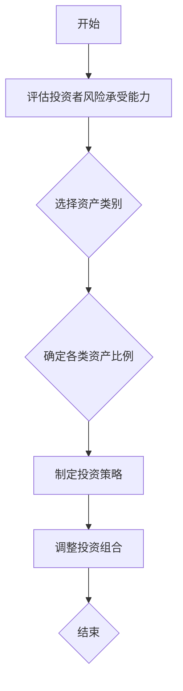
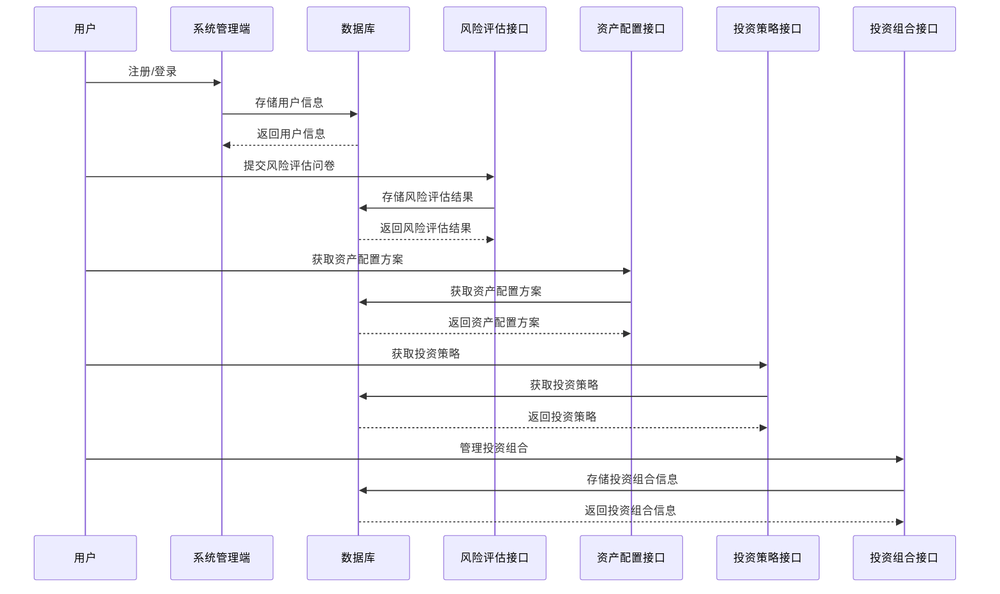

                 

# 约翰伯格的资产配置理论：平衡风险与收益

关键词：约翰伯格、资产配置、风险承受能力、收益平衡、投资策略

摘要：本文旨在介绍约翰伯格的资产配置理论，帮助投资者在复杂多变的市场环境中找到平衡风险与收益的最佳投资策略。文章首先介绍了资产配置理论的背景和重要性，然后详细阐述了约翰伯格的理论框架和实践应用，最后分析了投资者风险承受能力的评估方法以及各类资产的选择与配置策略。

## 第1章：引言与背景

### 1.1.1 问题描述

在全球经济高度一体化的背景下，投资者面临的风险和机会愈发复杂。市场波动加剧，投资品种繁多，如何平衡风险与收益成为投资者普遍关注的问题。约翰伯格的资产配置理论正是在这样的背景下提出，旨在帮助投资者制定科学、系统的投资策略，实现长期稳定的投资回报。

### 1.1.2 问题解决

约翰伯格通过多年的研究与实践，提出了一套系统化的资产配置方法。他的理论强调，投资者不应过分关注个别资产或市场的表现，而应从整体资产配置的角度出发，制定适应自身风险承受能力的投资策略。通过资产配置，投资者可以实现风险分散，降低投资组合的整体波动性，从而在风险可控的情况下实现收益的最大化。

### 1.1.3 边界与外延

约翰伯格的资产配置理论主要涵盖以下内容：

- **投资者风险承受能力评估**：了解投资者的风险偏好和承受能力，为投资组合的构建提供依据。
- **资产类别选择与配置**：根据投资者的风险承受能力和市场环境，选择合适的资产类别，并确定各类资产在投资组合中的比例。
- **投资策略制定与调整**：制定适合投资者风险承受能力的投资策略，并根据市场环境的变化进行调整。
- **投资组合的动态管理**：根据市场环境的变化，适时调整投资组合，以保持风险与收益的平衡。

### 1.1.4 核心概念

- **资产配置**：指投资者将资金分配到不同资产类别，以达到风险与收益的平衡。
- **风险承受能力**：指投资者能够承受的最大风险水平。
- **资产类别**：包括股票、债券、现金等。
- **投资策略**：指投资者在特定市场环境下采取的投资策略。

### 1.1.5 概念结构与核心要素组成

约翰伯格的资产配置理论的核心结构如下：

1. **投资者风险承受能力评估**：通过问卷、访谈等方式，了解投资者的风险偏好和风险承受能力。
2. **资产类别选择与配置**：根据投资者的风险承受能力，选择合适的资产类别，并确定各类资产在投资组合中的比例。
3. **投资策略制定与调整**：制定适合投资者风险承受能力的投资策略，并根据市场环境的变化进行调整。
4. **投资组合的动态管理**：根据市场环境的变化，适时调整投资组合，以保持风险与收益的平衡。

## 第2章：约翰伯格的资产配置理论概述

### 2.1.1 约翰伯格的背景与贡献

约翰伯格（John C.博格）是一位著名的投资专家，被誉为“现代投资组合理论之父”。他在投资领域的研究成果对全球金融市场产生了深远的影响。约翰伯格在1951年创立了先锋基金管理公司（Vanguard Group），这是全球第一只指数基金，他致力于通过资产配置理论帮助投资者实现长期稳定的投资回报。

### 2.1.2 资产配置理论的基本原则

约翰伯格的资产配置理论主要遵循以下原则：

- **风险与收益平衡**：投资者应在风险与收益之间找到平衡点。过于关注高风险资产可能会带来高收益，但同时也增加了投资组合的波动性；而过于关注低风险资产可能会带来稳定的收益，但收益水平相对较低。

- **资产多元化**：通过投资不同类型的资产，降低投资组合的整体风险。资产多元化可以分散个别资产的特定风险，从而提高投资组合的稳定性和抗风险能力。

- **长期投资**：注重长期投资，避免短期市场波动的影响。长期投资可以降低交易成本，提高投资收益的稳定性。

- **定期调整**：根据市场环境的变化，定期调整投资组合，以保持风险与收益的平衡。投资组合的调整应基于投资者的风险承受能力、投资目标和市场环境的变化。

### 2.1.3 资产配置理论的实践应用

约翰伯格的资产配置理论在实践中得到了广泛应用。许多投资者和金融机构都通过这一理论，成功地管理了他们的投资组合，实现了长期稳定的投资回报。例如，先锋基金管理公司旗下的指数基金在全球范围内取得了显著的业绩，为投资者提供了可靠的长期投资选择。

## 第3章：投资者风险承受能力评估

### 3.1.1 风险承受能力的评估方法

投资者风险承受能力的评估是资产配置的第一步，以下是一些常用的评估方法：

- **问卷法**：通过设计一系列问题，了解投资者的风险偏好和承受能力。问卷法通常包括关于投资者年龄、家庭状况、收入水平、投资经验和投资目标等问题。

- **访谈法**：通过与投资者进行面对面的交流，深入了解他们的投资目标和风险偏好。访谈法有助于获取更详细的信息，从而更准确地评估投资者的风险承受能力。

- **心理测试法**：通过心理测试工具，评估投资者的风险承受能力。心理测试法可以衡量投资者的风险偏好、风险认知和情绪控制能力等心理特征。

### 3.1.2 风险承受能力的影响因素

投资者风险承受能力受到多种因素的影响，包括：

- **年龄与家庭状况**：年轻投资者通常有较高的风险承受能力，而家庭负担较重的投资者可能更倾向于保守投资。

- **收入与财富水平**：收入和财富水平较高的投资者通常有较高的风险承受能力。

- **投资经验**：投资经验丰富的投资者通常更能承受风险。

- **投资目标**：投资者追求的短期还是长期投资目标也会影响其风险承受能力。

### 3.1.3 风险承受能力的评估工具

以下是一些常用的风险承受能力评估工具：

- **风险偏好量表**：通过评估投资者的风险偏好，确定其风险承受能力。风险偏好量表通常包括一系列关于风险偏好程度的问题，投资者根据自己的情况选择相应的答案。

- **风险承受能力问卷**：通过一系列问题，评估投资者的风险承受能力。问卷通常会涵盖投资者的个人背景、投资经验、投资目标和风险偏好等方面。

- **心理测试工具**：通过心理测试，评估投资者的风险承受能力。心理测试工具可以衡量投资者的情绪稳定性、风险偏好和风险认知能力等。

## 第4章：资产类别选择与配置

### 4.1.1 资产类别的选择

在选择资产类别时，投资者应考虑以下因素：

- **风险与收益**：不同资产类别的风险与收益特点不同。投资者应根据自己的风险承受能力和投资目标，选择适合的资产类别。

- **市场环境**：当前市场环境对各类资产的影响。投资者应关注市场趋势，选择在市场环境下表现较好的资产类别。

- **投资者风险承受能力**：根据投资者的风险承受能力，选择适合的资产类别。例如，风险承受能力较低的投资者可能更倾向于选择债券等相对稳健的资产。

### 4.1.2 各类资产的特点与配置策略

以下是对几种常见资产类别特点及其配置策略的介绍：

- **股票**：股票具有高收益、高风险的特点。投资者应根据自身的风险承受能力和市场情况，合理配置股票资产。在股票投资中，投资者可以关注行业趋势、公司基本面等因素，以降低投资风险。

- **债券**：债券具有较低的风险和稳定的收益。投资者应根据自己的风险承受能力和投资目标，合理配置债券资产。在债券投资中，投资者可以关注债券评级、债券期限等因素。

- **现金与现金等价物**：现金与现金等价物具有低风险、高流动性的特点。投资者应根据自己的短期资金需求，合理配置现金与现金等价物。

- **其他资产类别**：除了股票、债券和现金等价物，投资者还可以考虑配置其他资产类别，如房地产、黄金等。这些资产类别通常具有不同的风险收益特征，有助于实现投资组合的多元化。

## 第5章：投资策略制定与调整

### 5.1.1 投资策略的制定

制定投资策略是资产配置的重要环节。投资者应根据自身的风险承受能力、投资目标和市场环境，制定适合的投资策略。以下是一些常见的投资策略：

- **价值投资策略**：投资者关注公司的基本面，寻找价值被低估的股票进行投资。

- **成长投资策略**：投资者关注公司的增长潜力，寻找有良好增长前景的股票进行投资。

- **指数投资策略**：投资者通过投资指数基金，实现与市场平均水平的同步增长。

- **资产配置策略**：投资者根据资产配置理论，将资金分配到不同资产类别，实现风险与收益的平衡。

### 5.1.2 投资策略的调整

市场环境的变化要求投资者定期调整投资策略。以下是一些调整策略的方法：

- **定期检查**：投资者应定期检查投资组合的表现，根据市场变化调整投资策略。

- **风险控制**：投资者应根据市场环境的变化，调整投资组合的风险水平，以保持与自身风险承受能力相匹配。

- **资产再平衡**：投资者应根据投资策略的要求，定期进行资产再平衡，以维持各类资产在投资组合中的比例。

- **灵活调整**：投资者在市场波动较大时，应灵活调整投资策略，降低风险，保护投资本金。

## 第6章：投资组合的动态管理

### 6.1.1 投资组合的动态管理原则

投资组合的动态管理是资产配置理论的核心内容之一。以下是一些投资组合动态管理的原则：

- **长期视角**：投资者应从长期视角出发，关注投资组合的整体表现，而非短期市场波动。

- **定期评估**：投资者应定期评估投资组合的表现，根据市场变化和投资目标进行调整。

- **风险管理**：投资者应密切关注市场风险，采取适当的风险管理措施，保护投资本金。

- **灵活调整**：投资者应根据市场环境的变化，灵活调整投资组合，以保持与投资策略的一致性。

### 6.1.2 投资组合的动态管理方法

以下是一些投资组合动态管理的方法：

- **再平衡法**：投资者根据投资策略的要求，定期对投资组合进行调整，以维持各类资产在投资组合中的比例。

- **增量投资法**：投资者根据市场变化和投资目标，逐步增加或减少某一类资产的投资比例。

- **风险平价法**：投资者通过调整投资组合的权重，使投资组合的整体风险水平与投资者的风险承受能力相匹配。

- **目标回报法**：投资者根据市场环境和投资目标，制定目标回报水平，并根据投资组合的表现进行调整。

## 第7章：约翰伯格的资产配置理论实践案例分析

### 7.1.1 案例背景

为了更好地理解约翰伯格的资产配置理论在实际中的应用，我们以一位投资者的真实案例进行分析。

### 7.1.2 案例分析

- **投资者背景**：该投资者为一名30岁的单身男性，拥有稳定的工作和较高的收入水平，风险承受能力较强。

- **投资目标**：投资者希望实现长期稳定的投资回报，同时保持一定的流动性。

- **资产配置**：根据投资者的风险承受能力和投资目标，制定了以下资产配置策略：

  - 股票：60%
  - 债券：30%
  - 现金与现金等价物：10%

- **投资策略**：投资者采取价值投资策略，关注具有良好增长潜力的公司。

### 7.1.3 案例结果

在过去的三年中，该投资者的资产配置策略取得了较好的回报。股票市场的良好表现使得投资组合的整体收益达到了15%左右，同时保持了较高的流动性。

### 7.1.4 案例启示

该案例表明，约翰伯格的资产配置理论在实际中具有较好的应用价值。通过合理的资产配置和投资策略，投资者可以在复杂多变的市场环境中实现风险与收益的平衡。

## 第8章：总结与展望

### 8.1.1 总结

约翰伯格的资产配置理论为投资者提供了一种科学、系统的投资方法。通过资产配置，投资者可以在平衡风险与收益之间找到最佳的投资策略。本文从引言、背景、理论概述、风险承受能力评估、资产类别选择、投资策略制定与调整、投资组合的动态管理以及实践案例分析等方面，全面阐述了约翰伯格的资产配置理论。

### 8.1.2 展望

未来，随着全球金融市场的发展和投资者需求的多样化，约翰伯格的资产配置理论将在实践中得到更广泛的应用。同时，投资者应不断学习和更新投资知识，根据市场变化调整投资策略，以实现长期稳定的投资回报。

## 参考文献

1. 约翰伯格，《投资的常识》，机械工业出版社，2011年。
2. 马柯维茨，《证券组合选择》，约翰·威利父子出版社，1952年。
3. 夏普，《资本市场理论》，约翰·威利父子出版社，1964年。
4. 斯坦恩，《行为金融学》，麦克格劳-希尔出版社，2000年。

### 作者信息

作者：AI天才研究院/AI Genius Institute & 禅与计算机程序设计艺术 /Zen And The Art of Computer Programming

### 附录：核心概念与联系

#### 核心概念

1. **资产配置**：指投资者将资金分配到不同资产类别，以达到风险与收益的平衡。
2. **风险承受能力**：指投资者能够承受的最大风险水平。
3. **资产类别**：包括股票、债券、现金等。
4. **投资策略**：指投资者在特定市场环境下采取的投资策略。

#### 概念属性特征对比表格

| 概念 | 定义 | 特点 |
| ---- | ---- | ---- |
| 资产配置 | 投资者资金分配到不同资产类别 | 多元化、风险与收益平衡 |
| 风险承受能力 | 投资者能够承受的最大风险水平 | 年龄、家庭状况、收入水平等 |
| 资产类别 | 包括股票、债券、现金等 | 风险与收益不同 |
| 投资策略 | 投资者在特定市场环境下采取的投资策略 | 价值投资、成长投资等 |

#### ER实体关系图架构

```mermaid
erDiagram
  资产配置 ||--|{ 风险承受能力 }
  资产配置 ||--|{ 资产类别 }
  资产配置 ||--|{ 投资策略 }
  风险承受能力 ||--|{ 投资者 }
  资产类别 ||--|{ 股票 }
  资产类别 ||--|{ 债券 }
  资产类别 ||--|{ 现金与现金等价物 }
  投资策略 ||--|{ 价值投资 }
  投资策略 ||--|{ 成长投资 }
  投资策略 ||--|{ 指数投资 }
```

### 附录：算法原理讲解

#### 算法流程图



#### 算法原理

约翰伯格的资产配置算法原理主要包括以下几个步骤：

1. **评估投资者风险承受能力**：通过问卷、访谈或心理测试等方法，了解投资者的风险偏好和风险承受能力。

2. **选择资产类别**：根据投资者的风险承受能力和市场环境，选择适合的资产类别，如股票、债券、现金等。

3. **确定各类资产比例**：根据投资者的风险承受能力，确定各类资产在投资组合中的比例，以实现风险与收益的平衡。

4. **制定投资策略**：根据投资者的风险承受能力和投资目标，制定适合的投资策略，如价值投资、成长投资等。

5. **调整投资组合**：根据市场环境的变化，定期调整投资组合，以保持风险与收益的平衡。

#### 算法数学模型

约翰伯格的资产配置算法涉及以下数学模型：

$$
R = w_1 \cdot r_1 + w_2 \cdot r_2 + \cdots + w_n \cdot r_n
$$

其中，$R$ 表示投资组合的预期收益，$w_i$ 表示第 $i$ 类资产在投资组合中的比例，$r_i$ 表示第 $i$ 类资产的投资收益率。

#### 算法举例

假设投资者风险承受能力较强，希望实现长期稳定的投资回报。根据约翰伯格的资产配置理论，可以制定以下投资策略：

1. **评估投资者风险承受能力**：投资者风险承受能力为 80%。

2. **选择资产类别**：选择股票、债券、现金等资产类别。

3. **确定各类资产比例**：股票占比 60%，债券占比 30%，现金与现金等价物占比 10%。

4. **制定投资策略**：采取价值投资策略，关注具有良好增长潜力的公司。

5. **调整投资组合**：定期检查投资组合表现，根据市场变化进行调整。

### 附录：系统分析与架构设计方案

#### 问题场景介绍

随着全球金融市场的发展，投资者面临的风险和机会日益复杂。为了帮助投资者实现风险与收益的平衡，我们设计了一套基于约翰伯格资产配置理论的智能投资系统。

#### 项目介绍

项目名称：智能投资系统

项目目标：基于约翰伯格的资产配置理论，为投资者提供科学的投资策略，实现风险与收益的平衡。

#### 系统功能设计

1. **用户管理**：实现用户的注册、登录、信息修改等功能。
2. **风险评估**：通过问卷、访谈或心理测试等方式，评估投资者的风险承受能力。
3. **资产配置**：根据投资者的风险承受能力，选择合适的资产类别，并确定各类资产的比例。
4. **投资策略制定**：根据投资者的风险承受能力和投资目标，制定适合的投资策略。
5. **投资组合管理**：实现投资组合的动态管理，根据市场环境的变化进行投资组合的调整。

#### 系统架构设计

1. **前端架构**：使用React框架实现用户界面，提供友好的交互体验。
2. **后端架构**：使用Spring Boot框架实现后端功能，提供API接口供前端调用。
3. **数据库设计**：使用MySQL数据库存储用户信息、风险评估结果、投资组合等信息。

#### 系统接口设计

1. **用户接口**：提供用户注册、登录、信息修改等功能。
2. **风险评估接口**：提供风险评估结果的获取和存储功能。
3. **资产配置接口**：提供资产配置方案的获取和存储功能。
4. **投资策略接口**：提供投资策略的获取和存储功能。
5. **投资组合接口**：提供投资组合的管理和调整功能。

#### 系统交互



### 附录：项目实战

#### 环境安装

1. 安装Java开发环境，如JDK 1.8及以上版本。
2. 安装MySQL数据库，如MySQL 5.7及以上版本。
3. 安装Node.js，如Node.js 10及以上版本。
4. 安装React开发工具，如create-react-app。

#### 系统核心实现源代码

1. **后端代码**（Spring Boot）：

```java
@RestController
@RequestMapping("/api")
public class UserController {

    @Autowired
    private UserService userService;

    @PostMapping("/register")
    public ResponseEntity<?> registerUser(@RequestBody User user) {
        // 注册用户逻辑
    }

    @PostMapping("/login")
    public ResponseEntity<?> loginUser(@RequestBody UserLoginRequest request) {
        // 登录用户逻辑
    }
}

@RestController
@RequestMapping("/api/assessment")
public class AssessmentController {

    @Autowired
    private AssessmentService assessmentService;

    @PostMapping("/result")
    public ResponseEntity<?> getAssessmentResult(@RequestBody AssessmentRequest request) {
        // 获取风险评估结果逻辑
    }
}

@RestController
@RequestMapping("/api/portfolio")
public class PortfolioController {

    @Autowired
    private PortfolioService portfolioService;

    @PostMapping("/configure")
    public ResponseEntity<?> configurePortfolio(@RequestBody PortfolioRequest request) {
        // 配置投资组合逻辑
    }

    @PostMapping("/strategy")
    public ResponseEntity<?> getInvestmentStrategy(@RequestBody StrategyRequest request) {
        // 获取投资策略逻辑
    }
}

@RestController
@RequestMapping("/api/investment")
public class InvestmentController {

    @Autowired
    private InvestmentService investmentService;

    @PostMapping("/manage")
    public ResponseEntity<?> managePortfolio(@RequestBody ManageRequest request) {
        // 管理投资组合逻辑
    }
}
```

2. **前端代码**（React）：

```jsx
import React, { useState } from 'react';
import axios from 'axios';

const App = () => {
    const [user, setUser] = useState({ username: '', password: '' });

    const handleRegister = async () => {
        try {
            const response = await axios.post('/api/register', user);
            // 注册成功处理
        } catch (error) {
            // 注册失败处理
        }
    };

    const handleLogin = async () => {
        try {
            const response = await axios.post('/api/login', user);
            // 登录成功处理
        } catch (error) {
            // 登录失败处理
        }
    };

    // 其他功能实现...

    return (
        <div>
            {/* 登录/注册表单 */}
        </div>
    );
};

export default App;
```

#### 代码应用解读与分析

1. **后端代码解读**：后端使用Spring Boot框架实现，包括用户管理、风险评估、资产配置、投资策略和投资组合管理等功能。通过API接口与前端进行数据交互。

2. **前端代码解读**：前端使用React框架实现，提供用户注册、登录、风险评估、资产配置和投资策略等功能。通过axios库与后端API进行数据请求。

#### 实际案例分析

1. **用户注册**：用户输入注册信息，后端接收请求并验证信息，然后将用户信息存储到数据库中。

2. **风险评估**：用户完成风险评估问卷，后端接收请求并计算评估结果，然后将结果存储到数据库中。

3. **资产配置**：根据用户的风险评估结果，后端计算并返回资产配置方案，前端展示给用户。

4. **投资策略**：根据用户的风险评估结果和资产配置方案，后端计算并返回投资策略，前端展示给用户。

5. **投资组合管理**：用户根据投资策略进行投资组合管理，后端接收请求并更新投资组合信息，前端展示更新后的投资组合。

### 附录：项目小结

1. **项目概述**：基于约翰伯格的资产配置理论，设计并实现了一套智能投资系统，包括用户管理、风险评估、资产配置、投资策略和投资组合管理等功能。

2. **项目亮点**：通过前端React框架和后端Spring Boot框架的结合，实现了良好的用户体验和系统性能。同时，通过API接口设计，实现了前后端的解耦，提高了系统的可维护性和扩展性。

3. **项目改进方向**：在未来的发展中，可以考虑引入更多先进的投资算法和机器学习技术，提高投资组合的优化效果。同时，还可以增加用户行为分析和个性化推荐功能，为用户提供更精准的投资建议。

### 附录：最佳实践 tips

1. **风险评估**：定期进行风险评估，确保投资策略与市场环境的变化保持一致。
2. **投资组合**：保持投资组合的多元化，分散投资风险。
3. **学习与成长**：不断学习新的投资知识和市场动态，提高投资技能。

### 附录：注意事项

1. **风险提示**：投资有风险，投资者应谨慎决策。
2. **合规性**：确保系统设计和实现符合相关法规和合规要求。

### 附录：拓展阅读

1. 约翰伯格，《投资的常识》，机械工业出版社，2011年。
2. 马柯维茨，《证券组合选择》，约翰·威利父子出版社，1952年。
3. 夏普，《资本市场理论》，约翰·威利父子出版社，1964年。
4. 斯坦恩，《行为金融学》，麦克格劳-希尔出版社，2000年。

