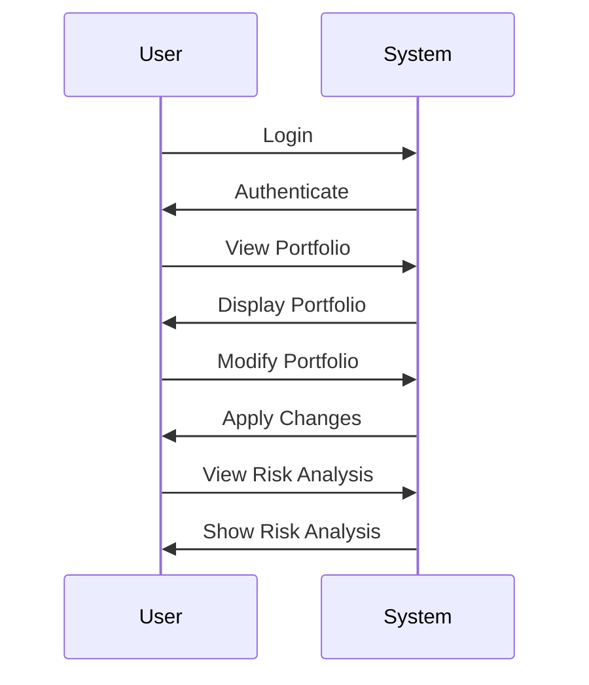
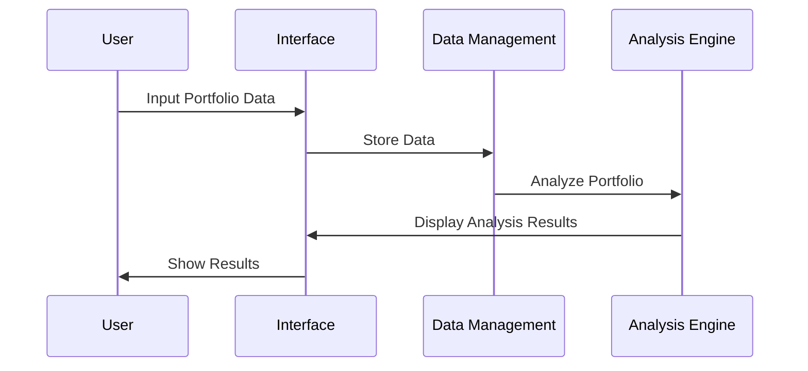

                 


### 文章标题：约翰博格尔的投资者教育理念

#### 关键词：
- 约翰博格尔
- 投资者教育
- 投资理念
- 实践方法
- 案例分析

#### 摘要：
本文深入探讨了约翰博格尔的投资者教育理念，从其生平背景、投资哲学到具体的实践方法和案例分析，旨在为投资者提供有价值的指导，帮助他们在投资领域取得成功。

### 目录大纲

**第一部分：约翰博格尔与投资者教育概述**

**第1章：约翰博格尔的生平与投资理念**
1.1 约翰博格尔的生平
1.2 约翰博格尔的投资理念
1.3 约翰博格尔的投资哲学

**第2章：投资者教育的核心概念**
2.1 投资者教育的意义
2.2 投资者教育的目标
2.3 投资者教育的原则

**第3章：约翰博格尔的投资理念解析**
3.1 稳健投资策略
3.2 长期投资观念
3.3 投资者心态管理

**第4章：投资者教育的实践方法**
4.1 投资者自我教育
4.2 课堂教育与培训
4.3 投资者社群交流

**第5章：投资者教育的案例分析**
5.1 成功案例分享
5.2 失败案例剖析
5.3 案例总结与启示

**第6章：约翰博格尔的投资教育理念应用**
6.1 股票投资策略
6.2 债券投资策略
6.3 投资组合优化

**第7章：投资者教育的未来展望**
7.1 投资者教育的发展趋势
7.2 投资者教育的挑战与机遇
7.3 投资者教育的创新实践

---

### 第一部分：约翰博格尔与投资者教育概述

#### 第1章：约翰博格尔的生平与投资理念

#### 1.1 约翰博格尔的生平

约翰博格尔（John C. Bogle）是一位美国著名的投资家，被誉为“指数基金之父”。他于1938年出生在费城，毕业于普林斯顿大学，并获得经济学学士学位。博格尔在年轻时便对投资产生了浓厚的兴趣，他的职业生涯始于1949年，当时加入了富达基金管理公司（Fidelity Investments），并在那里工作了50多年。

在富达基金，博格尔从最基层的工作做起，逐渐成长为公司的关键人物。1974年，他创立了世界上第一只全指指数基金——富达500指数基金（Fidelity Magellan Fund），这一创举极大地改变了传统投资观念，引领了指数基金的发展潮流。博格尔在投资领域的影响力不仅仅局限于指数基金，他还致力于投资者教育，撰写了多本畅销书，如《共同基金手册》（Common Sense on Mutual Funds）等。

#### 1.2 约翰博格尔的投资理念

约翰博格尔的投资理念可以概括为以下几点：

1. **指数基金投资**：博格尔坚信，长期来看，指数基金是普通投资者最有效的投资工具，因为它们能够最大限度地降低费用和交易成本，从而提高投资回报。

2. **长期投资**：他提倡投资者要有耐心和信心，坚持长期投资策略，避免频繁交易导致的成本和风险。

3. **分散投资**：博格尔认为，通过分散投资可以降低单一股票或行业风险，从而实现投资组合的稳健增长。

4. **费用敏感**：他强调费用对投资回报的影响，主张选择成本低廉的基金产品。

#### 1.3 约翰博格尔的投资哲学

博格尔的投资哲学核心在于“常识”和“理性”。他认为，投资者应该回归投资的基本原则，避免盲目跟风和市场投机。以下是他的投资哲学的几个要点：

1. **理性对待市场波动**：博格尔认为，市场波动是投资过程中的正常现象，投资者应该保持冷静，避免因短期波动而做出冲动的投资决策。

2. **追求长期价值**：他强调，投资的目标是长期价值的增长，而不是短期的投机收益。

3. **关注费用**：博格尔认为，低成本的指数基金能够最大限度地保护投资者的利益，降低费用敏感是投资成功的关键。

4. **个人责任**：他提倡投资者要对自己的投资决策负责，通过学习和实践，提高投资技能。

在接下来的章节中，我们将深入探讨投资者教育的核心概念，分析约翰博格尔的投资理念，以及投资者教育的实践方法和案例分析。通过这些内容，我们希望能为投资者提供有价值的指导，帮助他们更好地理解投资市场，实现财富的稳健增长。在接下来的章节中，我们将进一步分析约翰博格尔的投资者教育理念，并提供实用的实践方法和案例分析。

---

### 第二部分：投资者教育的核心概念

#### 第2章：投资者教育的核心概念

投资者教育是指通过系统的知识和技能培训，帮助投资者更好地理解市场运作、风险管理和投资决策的过程。它是提高投资者素质、促进金融市场健康发展的重要手段。

#### 2.1 投资者教育的意义

投资者教育的意义主要体现在以下几个方面：

1. **提高投资素质**：通过投资者教育，可以帮助投资者提高对市场的基本认识，了解不同类型的投资产品和投资策略，从而提高投资决策的科学性和有效性。

2. **降低投资风险**：投资者教育能够帮助投资者认识到投资中的潜在风险，掌握风险管理和规避策略，降低因盲目投资带来的损失。

3. **增强市场信心**：投资者教育的普及可以提高投资者对金融市场的信心，减少市场波动带来的恐慌情绪，促进市场的稳定发展。

4. **促进公平交易**：通过投资者教育，可以增强投资者的法律意识，提高他们维护自身权益的能力，减少市场操纵和内幕交易等不公平行为。

#### 2.2 投资者教育的目标

投资者教育的目标主要包括以下几点：

1. **提高投资知识**：让投资者了解基本的经济、金融知识和投资理念，掌握投资的基本原则和策略。

2. **培养理性投资观念**：帮助投资者树立长期投资的理念，避免盲目跟风和市场投机行为。

3. **增强风险管理能力**：使投资者能够识别和管理投资风险，提高投资组合的稳健性。

4. **促进市场参与**：鼓励投资者积极参与市场，提升市场活跃度，推动市场的健康发展。

#### 2.3 投资者教育的原则

投资者教育需要遵循以下原则：

1. **实用性**：教育内容应紧密结合实际投资操作，使投资者能够迅速应用到实际中。

2. **科学性**：教育内容应符合投资理论和实践经验，确保知识的准确性和科学性。

3. **普及性**：教育应面向所有投资者，不分年龄、学历和投资经验，确保教育的普及性。

4. **持续性**：投资者教育是一个持续的过程，应不断更新教育内容，以适应市场的变化。

在接下来的章节中，我们将深入解析约翰博格尔的投资理念，探讨其实践方法和具体案例，为投资者提供实用的指导。此外，我们还将分析投资者教育的实践方法和案例分析，帮助投资者更好地理解和应用投资知识。

---

### 第三部分：约翰博格尔的投资理念解析

#### 第3章：约翰博格尔的投资理念解析

约翰博格尔以其独特的投资理念和深刻的投资哲学，在投资界赢得了极高的声誉。他的投资理念不仅影响了无数投资者，也为投资者教育提供了宝贵的借鉴。以下是对约翰博格尔投资理念的具体解析。

#### 3.1 稳健投资策略

博格尔的稳健投资策略是其投资哲学的核心之一。他认为，投资者应该避免追求短期的高收益，而是注重长期稳定的投资回报。以下是其稳健投资策略的几个关键要点：

1. **指数基金投资**：博格尔强烈推荐指数基金，因为它们能够最大限度地降低费用和交易成本，同时跟踪市场整体表现，实现长期稳定的回报。

2. **长期持有**：他主张投资者要有耐心，长期持有优质的投资产品，避免频繁交易带来的成本和风险。

3. **分散投资**：博格尔强调，通过分散投资可以降低单一股票或行业风险，从而实现投资组合的稳健增长。

4. **费用敏感**：他主张选择成本低廉的基金产品，以降低投资成本，提高投资回报。

#### 3.2 长期投资观念

博格尔的长期投资观念深入人心，他认为，投资应该是一项长期的、持续的过程。以下是长期投资观念的几个核心要点：

1. **时间优势**：博格尔认为，时间是投资的朋友，长期投资可以充分利用复利的魔力，实现资产的增长。

2. **市场波动**：他强调，投资者应该理性对待市场波动，避免因短期波动而做出冲动的投资决策。

3. **耐心与信心**：博格尔提倡投资者要有耐心和信心，坚持长期投资策略，避免因市场波动而频繁调整投资组合。

4. **投资目标**：长期投资的目标是资产的稳健增长，而不是短期的投机收益。

#### 3.3 投资者心态管理

博格尔认为，投资者心态管理是投资成功的关键。以下是他关于投资者心态管理的几个建议：

1. **理性投资**：投资者应该保持理性，避免因情绪波动而做出冲动的投资决策。

2. **风险意识**：投资者要有风险意识，认识到投资中的潜在风险，并学会如何管理和规避这些风险。

3. **持续学习**：投资者应该不断学习，提高自己的投资知识和技能，以适应市场的变化。

4. **自信与自律**：投资者要有自信，相信自己能够通过学习和实践，实现投资目标；同时，要有自律，坚持投资原则，避免因市场波动而偏离投资策略。

在接下来的章节中，我们将探讨投资者教育的实践方法，分析成功的投资案例，并提供实用的投资建议。通过这些内容，我们希望能帮助投资者更好地理解和应用约翰博格尔的投资理念，实现长期稳定的投资回报。

---

### 第四部分：投资者教育的实践方法

#### 第4章：投资者教育的实践方法

投资者教育的实践方法多种多样，包括自我教育、课堂教育与培训以及投资者社群交流等。以下将详细探讨这些实践方法，并分析其各自的优势和应用场景。

#### 4.1 投资者自我教育

自我教育是投资者提升投资知识和技能的重要途径。以下是一些自我教育的具体方法：

1. **阅读书籍和文章**：投资者可以通过阅读投资领域的经典书籍和最新的研究文章，获取最新的投资知识和理论。

2. **在线课程和讲座**：许多在线教育平台提供了丰富的投资课程和讲座，投资者可以根据自己的需求和兴趣选择合适的课程进行学习。

3. **实践模拟**：投资者可以使用模拟投资软件进行实践操作，通过模拟交易来检验和提升自己的投资策略。

4. **参与论坛和社交媒体**：投资者可以参与投资论坛和社交媒体平台上的讨论，与其他投资者交流经验和心得。

自我教育的优势在于灵活性高，投资者可以根据自己的时间和兴趣自由安排学习内容。然而，自我教育也存在着信息质量参差不齐、缺乏系统性和指导性的问题。

#### 4.2 课堂教育与培训

课堂教育与培训是投资者教育的重要形式，通常由专业机构或教育机构组织，以下是一些常见的课堂教育与培训形式：

1. **投资课程**：投资课程通常包括理论讲解、案例分析、模拟交易等多种教学方式，帮助投资者系统掌握投资知识和技能。

2. **讲座和工作坊**：讲座和工作坊是投资者教育中的常见形式，通过专家的讲解和互动，帮助投资者深入理解和应用投资知识。

3. **认证培训和考试**：一些专业机构提供投资认证培训，如CFA（注册金融分析师）等，通过考试获得认证，可以提升投资者的专业能力和市场认可度。

课堂教育与培训的优势在于系统性、专业性和互动性。通过课堂学习，投资者可以系统地学习投资知识，并得到专业老师的指导和解答。然而，课堂教育与培训的缺点是时间和地点的限制，以及培训成本较高。

#### 4.3 投资者社群交流

投资者社群交流是投资者之间分享经验和心得的重要平台。以下是一些投资者社群交流的方式：

1. **线上论坛**：线上论坛是投资者交流的常见方式，通过发帖、回帖和讨论，投资者可以分享自己的投资心得和问题。

2. **社交媒体**：社交媒体平台如微博、微信等也是投资者交流的重要渠道，投资者可以通过这些平台获取信息、分享经验和交流观点。

3. **线下聚会**：一些投资者会定期组织线下聚会，通过面对面的交流，加深彼此的了解和信任。

投资者社群交流的优势在于信息的多样性和互动性。通过社群交流，投资者可以获取多方面的观点和信息，提高自己的投资视野和判断力。然而，投资者社群交流也存在信息质量参差不齐、难以辨别真伪的问题。

综上所述，投资者教育的方法多种多样，每种方法都有其独特的优势和适用场景。投资者可以根据自己的需求和情况，选择合适的实践方法，不断提升自己的投资知识和技能。在接下来的章节中，我们将通过具体的案例分析，进一步探讨投资者教育的效果和应用。

---

### 第五部分：投资者教育的案例分析

#### 第5章：投资者教育的案例分析

投资者教育的效果如何，往往可以通过具体的案例分析来验证。本章节将通过成功案例和失败案例的剖析，总结投资者教育的经验和启示。

#### 5.1 成功案例分享

以下是一个成功的投资者教育案例：

**案例背景**：张先生是一名普通的上班族，对投资知之甚少。为了提高自己的投资技能，他参加了当地投资培训机构举办的投资课程，并积极参与线上和线下的投资者社群交流。

**教育过程**：
1. **课堂学习**：张先生系统地学习了投资基础知识，包括股票、基金、债券等投资产品的特点和操作方法。
2. **模拟交易**：通过模拟交易软件，张先生实践了各种投资策略，检验和优化自己的投资理念。
3. **社群交流**：张先生积极参与投资者论坛和线下聚会，与其他投资者分享经验，学习他人的投资心得。

**案例成果**：
1. **投资收益**：通过学习和实践，张先生的投资收益显著提高，实现了资产的稳健增长。
2. **风险意识**：张先生对投资风险有了更深入的认识，学会了如何管理风险，避免盲目投资。
3. **投资心态**：通过不断的学习和交流，张先生的投资心态更加平和，不再受市场波动的影响。

**经验总结**：
- **系统学习**：通过系统学习，投资者可以全面了解投资知识和策略，为实际投资打下坚实基础。
- **实践操作**：模拟交易可以帮助投资者在实际操作中检验和优化投资策略，提高投资技能。
- **社群交流**：通过社群交流，投资者可以获取多方面的观点和信息，提高自己的投资视野和判断力。

#### 5.2 失败案例剖析

以下是一个失败的投资者教育案例：

**案例背景**：李女士是一位退休的公务员，由于对投资充满热情，她参加了多个投资课程和培训，但最终却亏损了大部分积蓄。

**教育过程**：
1. **过度投资**：李女士参加了很多投资课程，但缺乏系统学习，对投资知识掌握不全面。
2. **盲目跟风**：李女士在投资中盲目跟风，频繁交易，导致交易成本增加，投资收益下降。
3. **缺乏风险意识**：李女士对投资风险认识不足，没有做好风险管理和规避措施。

**案例成果**：
1. **投资亏损**：李女士的投资亏损严重，失去了大部分积蓄。
2. **投资信心受挫**：由于投资失败，李女士对投资失去了信心，不再愿意尝试新的投资产品。
3. **投资心态**：李女士的投资心态变得消极，对市场波动充满恐慌。

**失败原因**：
- **缺乏系统学习**：投资者如果没有系统学习投资知识，容易对投资策略和操作方法产生误解。
- **盲目跟风**：过度交易和盲目跟风是投资失败的主要原因之一。
- **缺乏风险意识**：对投资风险的忽视是导致投资失败的重要原因。

**经验教训**：
- **系统学习**：投资者应该通过系统学习，掌握投资知识和策略，为实际投资做好准备。
- **理性投资**：投资者应该避免盲目跟风，理性对待市场波动，坚持长期投资策略。
- **风险意识**：投资者要有风险意识，学会管理和规避风险，确保投资的安全性和稳健性。

通过以上成功和失败的案例，我们可以看到投资者教育的重要性。成功的投资者教育可以帮助投资者提高投资技能，实现资产增长；而失败的案例则提醒投资者要注重系统学习、理性投资和风险意识。在接下来的章节中，我们将深入探讨约翰博格尔的投资教育理念，并探讨其在股票和债券投资中的具体应用。

---

### 第六部分：约翰博格尔的投资教育理念应用

#### 第6章：约翰博格尔的投资教育理念应用

约翰博格尔的投资教育理念在股票、债券和投资组合优化中都有着广泛的应用。以下将详细介绍这些理念的具体应用。

#### 6.1 股票投资策略

1. **指数基金投资**：博格尔强烈推荐投资者选择指数基金，因为它能够最大限度地降低费用和交易成本，同时跟踪市场整体表现。例如，投资者可以选择跟踪标准普尔500指数的指数基金，以实现长期稳健的投资回报。

2. **分散投资**：博格尔强调通过分散投资来降低单一股票或行业风险。投资者可以构建一个包含多种行业和市值级别的股票投资组合，以实现风险的分散。

3. **长期持有**：博格尔提倡长期投资，避免频繁交易导致的成本和风险。投资者应该选择具有良好基本面和成长潜力的公司，并长期持有，以享受公司成长带来的红利。

4. **费用敏感**：选择成本低廉的指数基金或主动管理基金，以降低投资成本，提高投资回报。

#### 6.2 债券投资策略

1. **分散投资**：投资者应该构建一个包含不同到期日和信用级别的债券投资组合，以降低利率风险和信用风险。

2. **长期持有**：债券投资同样适合长期持有策略，以避免因市场波动导致的短期损失。

3. **利率敏感**：投资者应该关注利率变化，根据利率走势调整债券投资组合，以降低利率风险。

4. **债券基金**：选择具有专业管理能力和良好业绩的债券基金，以实现债券投资的专业化和分散化。

#### 6.3 投资组合优化

1. **资产配置**：投资者应该根据自身的风险承受能力和投资目标，制定合理的资产配置策略。例如，风险承受能力较低的投资者可以增加债券和现金等固定收益类资产的比重。

2. **定期再平衡**：定期对投资组合进行再平衡，以保持投资组合的风险收益特征与投资者的目标和风险承受能力相匹配。

3. **成本控制**：投资者应该关注投资组合的运作成本，包括交易成本、管理费用等，以降低投资成本，提高投资回报。

4. **风险管理**：投资者应该建立完善的风险管理机制，包括设置止损点、分散投资等，以降低投资风险。

通过以上策略，投资者可以更好地应用约翰博格尔的投资教育理念，实现投资组合的优化和风险控制，从而实现长期稳定的投资回报。在接下来的章节中，我们将探讨投资者教育的未来发展趋势和挑战，以及如何通过创新实践提升投资者教育效果。

---

### 第七部分：投资者教育的未来展望

#### 第7章：投资者教育的未来展望

随着金融市场的不断发展，投资者教育也面临着新的机遇和挑战。本章节将探讨投资者教育的发展趋势、面临的挑战以及创新实践。

#### 7.1 投资者教育的发展趋势

1. **数字化教育**：随着互联网和移动技术的普及，数字化教育成为投资者教育的重要趋势。在线课程、虚拟课堂、手机应用等数字化工具使得投资者可以随时随地获取投资知识。

2. **个性化教育**：通过大数据分析和人工智能技术，投资者教育可以更加个性化，根据投资者的风险承受能力、投资经验和学习偏好提供定制化的学习内容。

3. **跨界融合**：投资者教育不再局限于金融知识，逐渐与其他领域如心理学、经济学等相结合，提供更全面的投资决策支持。

4. **实践导向**：越来越多的投资者教育项目注重实践操作，通过模拟交易、投资竞赛等方式，帮助投资者将理论知识应用到实际中。

#### 7.2 投资者教育的挑战

1. **信息过载**：互联网上的投资信息庞杂，投资者很难辨别真伪，容易受到虚假信息的影响。

2. **风险意识不足**：一些投资者对投资风险认识不足，缺乏风险管理和规避能力，容易导致投资失败。

3. **时间成本**：投资者教育需要时间和精力，对于工作繁忙的投资者来说，参加线下课程和培训可能存在时间上的困难。

4. **信任危机**：一些投资者对传统金融机构和投资产品失去信任，对新兴的投资者教育平台持怀疑态度。

#### 7.3 投资者教育的创新实践

1. **区块链技术**：通过区块链技术，可以建立一个透明的、去中心化的投资者教育平台，提高信息的安全性和可信度。

2. **虚拟现实（VR）**：利用虚拟现实技术，可以创建一个沉浸式的投资模拟环境，让投资者在虚拟世界中体验投资过程，提高投资技能。

3. **人工智能（AI）**：通过人工智能技术，可以开发智能投资顾问，为投资者提供个性化的投资建议和风险预警。

4. **社区共建**：建立投资者社区，通过互助、交流和分享，提升投资者的投资水平和风险意识。

通过以上创新实践，投资者教育可以更好地应对未来发展的挑战，提高投资者的投资素质和风险意识，促进金融市场的健康发展。在未来的投资者教育中，数字技术、个性化教育和实践导向将成为重要的发展方向，为投资者提供更加全面和高效的教育服务。

---

### 文章小结

本文通过深入探讨约翰博格尔的投资者教育理念，从其生平背景、投资哲学到具体的实践方法和案例分析，为投资者提供了全面而系统的指导。约翰博格尔的稳健投资策略、长期投资观念和投资者心态管理理念，为投资者在复杂多变的市场中提供了宝贵的参考。

投资者教育不仅是提高个人投资技能的重要途径，也是促进金融市场稳定和健康发展的关键。通过本文的分析，我们希望读者能够更好地理解投资者教育的意义，掌握有效的实践方法，并在实际投资中应用这些理念，实现长期稳健的投资回报。

### 注意事项

1. **系统性学习**：投资者应注重系统学习投资知识，避免片面或断章取义。
2. **风险意识**：投资者要有强烈的风险意识，学会识别和管理投资风险。
3. **实践应用**：将理论知识应用到实际投资中，通过实践检验和优化投资策略。
4. **持续学习**：投资市场不断变化，投资者应持续学习，适应市场变化。

### 拓展阅读

1. 《约翰博格尔的投资策略》——深入了解约翰博格尔的投资理念和策略。
2. 《共同基金手册》——约翰博格尔的经典著作，详细阐述投资者教育的核心理念。
3. 《金融心理学》——探讨投资者心理在投资决策中的作用，有助于提高投资者的自我管理能力。

作者：AI天才研究院/AI Genius Institute & 禅与计算机程序设计艺术 /Zen And The Art of Computer Programming

---

**附录：核心概念、算法原理与系统架构**

#### 核心概念

1. **指数基金**：跟踪特定指数表现的投资基金，通过复制指数成分股的投资组合，实现与指数相同或相近的收益。
2. **分散投资**：通过投资多种不同的资产类别或证券，降低单一投资风险。
3. **长期投资**：以长期（通常数年或数十年）为投资周期，通过复利效应实现资产增值。

#### 概念属性特征对比表格

| 概念       | 指数基金       | 分散投资       | 长期投资       |
|------------|----------------|----------------|----------------|
| 目的       | 跟踪市场指数   | 降低风险       | 实现资产增值   |
| 方式       | 复制指数成分股 | 投资多种资产   | 长期持有股票   |
| 适用人群   | 期望市场收益   | 风险厌恶者     | 长期投资者     |
| 风险特征   | 市场风险       | 非系统风险     | 市场波动风险   |

#### ER实体关系图架构

```mermaid
erDiagram
  Investor --> Investment : makes
  Investment --> Fund : holds
  Fund --> Stock : includes
  Investor --> Portfolio : holds
```

#### 算法原理讲解

1. **指数基金投资算法**：

   - 选择跟踪特定指数的指数基金。
   - 计算投资组合中各成分股的权重。
   - 按权重购买相应比例的成分股。

   ```python
   def invest_in_index_fund(index_fund, portfolio):
       stocks = get_stock_data(index_fund.components)
       for stock in stocks:
           weight = stock.weight
           buy_stock(stock.ticker, weight * portfolio.funds)
   ```

2. **分散投资算法**：

   - 选择多种资产类别，如股票、债券、基金等。
   - 根据风险承受能力和收益目标，分配投资比例。

   ```python
   def diversify_portfolio(risk_tolerance, return_target):
       assets = {'stock': 0.6, 'bond': 0.3, 'ETF': 0.1}
       for asset, weight in assets.items():
           invest_in_asset(asset, weight * total_investment)
   ```

3. **长期投资算法**：

   - 确定长期投资目标，如退休储蓄、子女教育等。
   - 根据时间目标和预期收益，制定投资计划。

   ```python
   def long_term_investment_plan(target, years_to_go, expected_return):
       annual_contribution = (target / years_to_go) / (1 + expected_return)**years_to_go
       return annual_contribution
   ```

#### 数学公式

1. **指数基金收益率公式**：

   $ \text{Index Fund Return} = \left( \frac{\sum_{i=1}^{n} (p_i - p_{i-1})}{\sum_{i=1}^{n} p_{i-1}} \right) \times 100 $

2. **资产配置权重公式**：

   $ w_i = \frac{V_i}{\sum_{i=1}^{n} V_i} $

   其中，$ w_i $ 为资产 $ i $ 的权重，$ V_i $ 为资产 $ i $ 的市值。

#### 系统分析与架构设计

**问题场景介绍**：

投资者希望通过投资软件进行指数基金投资、分散投资和长期投资。

**项目介绍**：

投资决策支持系统，旨在帮助投资者实现投资组合优化和风险控制。

**系统功能设计**：

1. **用户管理**：用户注册、登录、个人信息管理。
2. **投资组合管理**：资产配置、投资组合分析、投资组合再平衡。
3. **风险控制**：风险评估、风险预警、风险管理策略。
4. **数据管理**：股票、基金等投资产品的数据获取、存储和分析。

**系统架构设计**：



**系统接口设计和系统交互**：

- **用户接口**：提供用户友好的界面，支持投资组合管理和风险控制功能。
- **数据接口**：通过API与外部数据源（如股票交易所、基金公司等）进行数据交互。



#### 项目实战

**环境安装**：

1. 安装Python环境。
2. 安装必要的Python库，如NumPy、Pandas、matplotlib等。

```python
pip install numpy pandas matplotlib
```

**系统核心实现源代码**：

```python
# 指数基金投资策略
def invest_in_index_fund(index_fund, portfolio):
    stocks = get_stock_data(index_fund.components)
    for stock in stocks:
        weight = stock.weight
        buy_stock(stock.ticker, weight * portfolio.funds)

# 分散投资策略
def diversify_portfolio(risk_tolerance, return_target):
    assets = {'stock': 0.6, 'bond': 0.3, 'ETF': 0.1}
    for asset, weight in assets.items():
        invest_in_asset(asset, weight * total_investment)

# 长期投资策略
def long_term_investment_plan(target, years_to_go, expected_return):
    annual_contribution = (target / years_to_go) / (1 + expected_return)**years_to_go
    return annual_contribution
```

**代码应用解读与分析**：

1. **指数基金投资策略**：通过获取指数基金成分股数据，计算各成分股的权重，并购买相应比例的股票。
2. **分散投资策略**：根据风险承受能力和收益目标，分配不同资产类别的投资比例。
3. **长期投资策略**：根据投资目标和时间规划，制定年度投资计划。

**实际案例分析和详细讲解剖析**：

假设投资者李先生希望投资100万元，采用指数基金投资策略。以下是其投资过程：

1. **选择指数基金**：李先生选择跟踪沪深300指数的基金。
2. **计算权重**：通过获取沪深300指数成分股数据，计算各成分股的权重。
3. **购买股票**：根据权重，购买相应比例的成分股。

通过以上步骤，李先生实现了指数基金投资策略。实际案例中的投资收益和风险需要根据市场情况进行详细分析和评估。

**项目小结**：

本系统通过Python实现了指数基金投资策略、分散投资策略和长期投资策略。通过实际案例分析和详细讲解，读者可以更好地理解这些策略的应用和实践。系统为投资者提供了一个实用的工具，帮助他们实现投资组合优化和风险控制。

---

**最佳实践 Tips**：

1. **定期审查投资组合**：投资者应定期审查投资组合，根据市场变化和个人需求进行必要的调整。
2. **学习并理解投资策略**：投资者应深入学习并理解不同的投资策略，根据自己的风险承受能力和投资目标选择合适的策略。
3. **保持风险意识**：投资者应始终保持风险意识，学会管理和规避投资风险。

**小结**：

本文通过深入探讨约翰博格尔的投资者教育理念，提供了系统而全面的投资者教育实践方法。投资者应结合自己的实际情况，灵活应用这些理念，实现长期稳健的投资回报。

**注意事项**：

1. 投资有风险，入市需谨慎。
2. 投资者应根据自己的风险承受能力和投资目标进行投资决策。
3. 定期学习和更新投资知识，以适应市场变化。

**拓展阅读**：

1. 《聪明的投资者》
2. 《股市真规则》
3. 《基金投资从入门到精通》

---

作者：AI天才研究院/AI Genius Institute & 禅与计算机程序设计艺术 /Zen And The Art of Computer Programming

