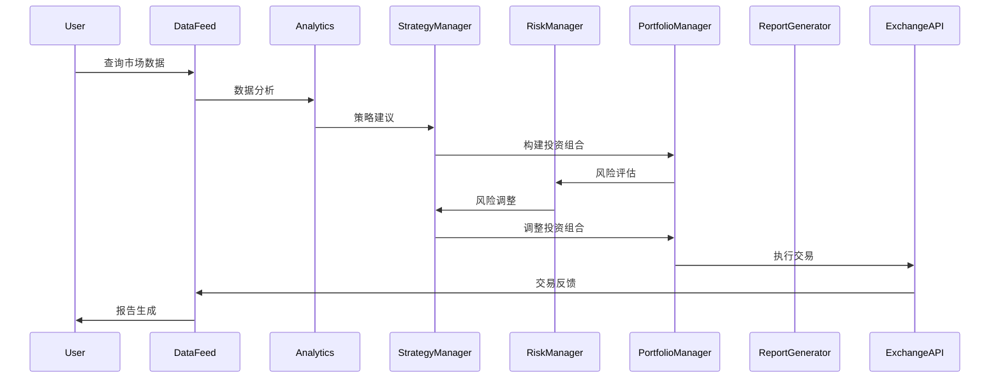
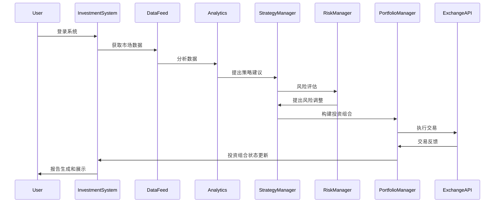

                 

### 引言

**约翰邓普顿的生平与投资哲学**

约翰·邓普顿（John Templeton），1912年生于美国，是一位被誉为“全球投资之父”的传奇人物。他从小就对金融和投资产生了浓厚的兴趣，并在后来成为了一名杰出的投资者。邓普顿以其卓越的投资才能和全球化的投资理念，在投资界享有极高的声誉。

邓普顿的投资哲学可以概括为“价值投资、长期投资和全球化投资”。他坚信，通过长期持有优质股票，投资者能够获得稳定的回报。他提出，投资者不应该被市场情绪所左右，而是应该寻找那些被市场低估的股票，并耐心持有。此外，邓普顿非常重视全球化投资，他认为全球市场机会和风险并存，投资者应该在全球范围内寻找投资机会。

在全球化的背景下，邓普顿的投资策略具有前瞻性。他善于通过深入研究和分析，发现那些被市场忽视的投资机会。他的投资策略不仅涵盖了美国市场，还包括了欧洲、亚洲等地的市场。这种全球化视角使得邓普顿在投资中能够捕捉到更多的机会，同时也降低了投资风险。

**全球化投资的必要性**

全球化是当今世界经济发展的一个重要趋势。随着全球贸易和投资的不断扩大，各国之间的经济联系日益紧密。这种全球化背景为投资者提供了更多的机会，但也带来了新的挑战。

首先，全球化使得市场变得更加复杂。投资者需要了解不同地区的经济环境、市场趋势和投资机会。此外，全球化还带来了更多的风险，如政治风险、汇率风险和市场波动等。因此，投资者需要具备全球化的视角，以应对这些挑战。

其次，全球化为投资者提供了更多的投资机会。随着全球贸易和投资的扩大，不同地区的市场发展潜力巨大。投资者可以通过在全球范围内寻找低估的投资机会，实现资产的多元化配置，从而降低风险并获取更高的回报。

然而，全球化投资也面临着一些挑战。首先，不同地区的市场规则和投资文化存在差异，投资者需要熟悉和适应这些差异。其次，全球化投资需要更多的专业知识和经验，投资者需要不断提升自己的投资能力。

**文章关键词**

- 约翰邓普顿
- 全球化投资
- 投资哲学
- 长期投资
- 价值投资
- 市场机会
- 投资风险

**摘要**

本文将探讨约翰·邓普顿的全球化投资视角。首先，我们将介绍邓普顿的生平和投资哲学，重点讨论他的价值投资和长期投资理念。接着，我们将分析全球化投资的必要性，探讨全球化对投资者带来的机会和挑战。最后，我们将通过具体案例，展示邓普顿的全球化投资策略，并对其投资哲学进行总结和评价。本文旨在帮助读者更好地理解全球化投资，并从中获得投资灵感。

### 第一部分：全球化投资背景分析

#### 1. 全球经济形势分析

全球化进程的加速使得全球经济呈现出新的特点。首先，全球贸易额持续增长，国际贸易成为各国经济增长的重要动力。根据世界贸易组织（WTO）的数据，2019年全球货物贸易额达到19.48万亿美元，占全球GDP的近1/3。这一数据充分展示了全球贸易对经济增长的推动作用。

其次，全球化带来了全球资本流动的加速。随着全球金融市场的开放，资本在全球范围内的流动速度不断加快。国际货币基金组织（IMF）数据显示，截至2020年底，全球外流资本总额已超过11.6万亿美元。这种资本流动为投资者提供了更多的投资机会，同时也带来了更大的投资风险。

最后，全球化使得全球经济的联动性增强。任何一个国家的经济波动都可能对其他国家产生影响。例如，2008年的全球金融危机就是由于美国次贷危机引发的一系列连锁反应，导致了全球经济的衰退。这种全球经济联动性要求投资者具备全球视野，以应对不同地区的市场变化。

#### 1.1 全球化进程的加速

全球化进程的加速主要体现在以下几个方面：

1. **国际贸易的快速增长**：全球化使得全球贸易壁垒逐渐降低，国际贸易便利化程度不断提高。例如，WTO的成员国数量从1995年的130个增加到2021年的164个，全球贸易额也随之大幅增长。

2. **跨国公司的崛起**：跨国公司通过全球化的生产和销售网络，实现了全球资源的优化配置。根据联合国贸易和发展会议（UNCTAD）的数据，全球跨国公司的数量已经超过8万家，其全球销售额占全球GDP的约1/3。

3. **全球金融市场的整合**：全球金融市场的整合使得资本在全球范围内自由流动。例如，全球股票市场互联互通机制的实施，使得投资者能够更加便捷地参与全球市场。

4. **全球经济的联动性**：全球化使得各国经济之间的联系更加紧密，一个国家的经济波动往往会对其他国家产生连锁反应。例如，全球疫情的爆发对全球经济造成了严重冲击，各国经济都受到了不同程度的冲击。

#### 1.2 全球市场机会与挑战

全球化为投资者带来了大量的市场机会，同时也带来了一系列挑战。

**市场机会**：

1. **多元化投资**：全球化使得投资者能够跨越国界，在全球范围内寻找投资机会。这种多元化投资可以降低投资组合的风险，提高投资回报。

2. **新兴市场机遇**：随着新兴市场国家的崛起，这些市场的投资潜力巨大。例如，中国、印度等新兴市场国家的经济规模不断扩大，投资机会也随之增加。

3. **技术创新**：全球化带来了技术的快速传播和普及，投资者可以借助技术创新来提升投资效益。例如，人工智能、区块链等新兴技术的应用，为投资者提供了新的投资工具和策略。

**市场挑战**：

1. **政策风险**：全球化进程中的政策变化对市场影响巨大。例如，贸易保护主义政策可能导致国际贸易摩擦加剧，影响全球市场的稳定。

2. **市场波动**：全球化使得市场波动性增加，投资者需要具备更强的风险管理和应对能力。例如，全球股市的波动往往受到地缘政治、经济数据等多种因素的影响。

3. **文化差异**：全球化带来了不同国家和地区的文化交融，但也带来了文化差异。投资者需要了解和适应不同市场的文化特点，以避免投资失误。

#### 1.3 全球化投资的风险与收益分析

全球化投资既有其独特的风险，也有潜在的收益。

**风险**：

1. **汇率风险**：全球化投资涉及不同货币的兑换，汇率波动可能导致投资回报的不确定性。投资者需要通过汇率风险管理工具来降低汇率风险。

2. **政策风险**：不同国家的政策变化可能对投资产生重大影响。例如，税收政策、外汇管制政策等都会影响投资者的收益。

3. **市场风险**：全球化投资面临的市场波动性较大，投资者需要具备较强的市场分析和应对能力。

**收益**：

1. **资产配置优化**：全球化投资可以通过多元化投资，优化资产配置，降低投资组合风险，提高投资回报。

2. **市场机会捕捉**：全球化投资使得投资者能够捕捉到更多的市场机会，特别是在新兴市场国家，这些市场的投资潜力巨大。

3. **投资成本降低**：全球化投资可以通过跨国交易和投资，降低投资成本，提高投资效益。

### 第二部分：约翰邓普顿的投资策略

#### 3. 邓普顿的投资理念

约翰·邓普顿的投资理念可以概括为“价值投资、长期投资和全球化投资”。他坚信，通过长期持有优质股票，投资者能够获得稳定的回报。他提出，投资者不应该被市场情绪所左右，而是应该寻找那些被市场低估的股票，并耐心持有。此外，邓普顿非常重视全球化投资，他认为全球市场机会和风险并存，投资者应该在全球范围内寻找投资机会。

邓普顿的价值投资理念主要体现在以下几个方面：

1. **寻找被低估的投资机会**：邓普顿认为，市场价格往往是由情绪驱动的，而市场情绪容易导致股票价格偏离其真实价值。因此，投资者应该通过深入研究，寻找那些被市场低估的优质股票。

2. **长期投资**：邓普顿主张投资者应该具备长期投资的心态，通过长期持有优质股票，实现稳定的投资回报。他认为，短期市场波动是难以预测的，而长期投资能够降低投资风险，提高投资回报。

3. **全球化投资**：邓普顿认为，全球化投资能够为投资者提供更多的投资机会，同时也能够分散投资风险。他通过在全球范围内寻找投资机会，实现了资产的多元化配置。

邓普顿的长期投资理念主要体现在以下几个方面：

1. **耐心持有**：邓普顿主张投资者应该具备耐心，不要被短期市场波动所影响。他相信，优质股票在长期内一定会得到市场的认可，从而实现投资回报。

2. **风险管理**：邓普顿非常重视风险管理，他认为投资者应该通过分散投资和资产配置，降低投资风险。他通过在全球范围内寻找投资机会，实现了资产的多元化配置，从而降低了投资组合的风险。

3. **投资组合管理**：邓普顿主张投资者应该定期审视和调整投资组合，以确保投资组合与投资目标相一致。他通过定期调整投资组合，及时抓住市场机会，同时避免投资失误。

邓普顿的全球化投资理念主要体现在以下几个方面：

1. **全球视野**：邓普顿具备全球视野，他认为投资者应该关注全球市场的变化，寻找全球范围内的投资机会。

2. **地域分散**：邓普顿通过在全球范围内分散投资，降低了投资组合的风险。他认为，不同地区的市场具有不同的特点，通过地域分散，可以降低单一市场波动对投资组合的影响。

3. **文化适应**：邓普顿非常重视对投资市场文化的适应，他认为投资者应该了解和尊重不同市场的投资文化，从而避免投资失误。

### 4. 邓普顿的投资策略解析

邓普顿的投资策略包括资产配置、地域选择和市场情绪管理三个方面。

#### 4.1 资产配置与分散化投资

邓普顿主张投资者应该通过资产配置实现投资组合的多元化。他认为，单一市场的投资风险较大，而通过资产配置，可以将投资风险分散到不同的市场，从而降低投资组合的整体风险。

**资产配置策略**：

1. **固定收益资产**：邓普顿认为，固定收益资产如债券等可以提供稳定的收益，适合作为投资组合的一部分。他通常会根据市场利率和预期收益，选择不同期限的债券进行投资。

2. **权益资产**：邓普顿重视权益资产的投资，他认为优质股票能够在长期内实现稳定的回报。他通常会通过深入研究，选择那些被市场低估的优质股票进行投资。

3. **另类投资**：邓普顿还投资于另类资产，如房地产、私募股权等。他认为，这些资产能够在一定程度上降低投资组合的风险，同时提供较高的回报。

**分散化投资策略**：

1. **地域分散**：邓普顿通过在全球范围内分散投资，降低了投资组合的风险。他通常会投资于美国、欧洲、亚洲等不同地区的市场，从而降低单一市场波动对投资组合的影响。

2. **行业分散**：邓普顿通过投资于不同行业的公司，实现了投资组合的多元化。他认为，不同行业的公司具有不同的风险和回报特征，通过行业分散，可以降低投资组合的整体风险。

3. **公司分散**：邓普顿通过投资于多家公司，降低了单一公司风险。他认为，单一公司的风险较大，而通过投资于多家公司，可以降低投资组合的风险。

#### 4.2 地域选择与市场机会

邓普顿非常重视地域选择，他认为不同地区的市场具有不同的投资机会。他通常会通过深入研究，选择那些具有投资潜力的地区进行投资。

**地域选择策略**：

1. **新兴市场**：邓普顿认为，新兴市场国家具有较高的经济增长潜力，这些市场通常具有较好的投资机会。他通常会关注那些政治稳定、经济增长迅速的新兴市场国家，如中国、印度等。

2. **发达国家**：邓普顿也投资于发达国家市场，他认为这些市场虽然增长潜力较小，但通常具有较好的投资机会。他通常会关注那些具有稳定经济和良好市场机制的国家，如美国、欧洲等。

3. **特殊市场**：邓普顿还会投资于那些具有特殊市场条件的市场，如资源丰富地区、科技创新中心等。他认为，这些市场可能具有独特的投资机会。

#### 4.3 市场情绪与投资决策

邓普顿非常重视市场情绪对投资决策的影响。他认为，市场情绪往往会影响股票价格，从而导致投资机会的出现。

**市场情绪管理策略**：

1. **逆向投资**：邓普顿认为，市场情绪容易导致股票价格偏离其真实价值。他通常会通过逆向投资，即在市场情绪低落时寻找被低估的股票进行投资，从而获得稳定的回报。

2. **长期投资**：邓普顿主张投资者应该具备长期投资的心态，不要被短期市场波动所影响。他认为，长期投资能够降低投资风险，提高投资回报。

3. **市场情绪分析**：邓普顿会通过分析市场情绪，了解市场的整体趋势。他会关注市场情绪的指标，如恐慌指数（VIX）等，从而制定相应的投资策略。

#### 4.4 投资组合管理

邓普顿非常重视投资组合管理，他认为投资者应该定期审视和调整投资组合，以确保投资组合与投资目标相一致。

**投资组合管理策略**：

1. **定期审视**：邓普顿会定期审视投资组合，了解各个投资项目的表现，从而决定是否进行调整。

2. **风险控制**：邓普顿会通过风险控制措施，确保投资组合的风险在可承受范围内。他会根据市场变化，及时调整投资组合，以降低风险。

3. **机会捕捉**：邓普顿会通过市场分析，捕捉到新的投资机会。他会根据市场变化，及时调整投资组合，以抓住新的投资机会。

### 第三部分：全球化投资案例分析

#### 5. 邓普顿的经典投资案例

约翰·邓普顿以其卓越的投资才能和全球化投资策略，在全球范围内创造了多个经典投资案例。以下将介绍其中两个具有代表性的案例。

**案例一：美国市场投资**

在20世纪60年代，美国市场经历了高速增长期，但与此同时，市场的投机情绪也达到了顶峰。大多数投资者被市场的高涨所吸引，纷纷涌入股市，而邓普顿却看准了市场的高估情况，决定逆向操作，卖出股票，持有现金。这一决策在当时引起了巨大的争议，但后来市场的崩溃证明了邓普顿的预见性。

1968年，美国股市进入调整期，道琼斯工业平均指数从1966年的970点下跌到1968年的700点左右。在这个时期，邓普顿坚持持有现金，避免了大幅度亏损。随后，在市场情绪低落时，邓普顿开始积极买入优质股票，特别是在1970年代初期，市场情绪极度悲观时，他大量购入了那些被市场低估的股票。

邓普顿的这种逆向投资策略在1973年得到了回报，当时道琼斯工业平均指数从1970年的770点上涨到1973年的1000点。这个案例展示了邓普顿如何通过逆向投资，抓住了市场低估的机会，实现了投资收益。

**案例二：新兴市场投资**

在20世纪80年代，随着全球化的推进，新兴市场国家开始展现出巨大的投资潜力。邓普顿看准了这一趋势，开始积极投资于新兴市场，其中最具代表性的投资是他在中国的投资。

1980年代初期，中国正处于改革开放的初期阶段，市场环境相对封闭，投资者对于中国市场的了解有限。但邓普顿通过深入研究，认为中国具有巨大的投资潜力。他在1982年投资了中国股票市场，成为了首批进入中国市场的国际投资者之一。

邓普顿的投资策略是在市场低迷时买入，耐心持有。他在1980年代初期大量购入了中国的股票，尽管当时的市场环境不稳定，但他相信中国的长期发展潜力。随着时间的推移，中国的经济增长加速，邓普顿的投资逐渐获得了巨大的回报。

这个案例展示了邓普顿如何在新兴市场投资中，通过长期投资和逆向投资，抓住了市场低估的机会，实现了投资收益。

#### 5.2 邓普顿应对市场波动的策略

在投资生涯中，市场波动是投资者必须面对的挑战。邓普顿通过多年的投资实践，形成了一套应对市场波动的策略，主要包括以下几方面：

**1. 保持冷静和理性**

邓普顿认为，市场波动是正常现象，投资者应该保持冷静和理性，不要被市场的情绪所左右。他通过深入研究，了解市场的真实情况，从而做出理性的投资决策。

**2. 分散投资降低风险**

邓普顿通过分散投资，降低投资组合的风险。他不仅在不同国家和地区进行投资，还在不同的行业和资产类别之间进行分散。这种多元化的投资策略，使得他的投资组合能够较好地应对市场的波动。

**3. 耐心持有优质股票**

邓普顿主张长期投资，他认为优质股票在长期内一定会得到市场的认可，从而实现投资回报。他在市场波动中，保持耐心，不轻易卖出股票，从而避免了因短期市场波动导致的投资损失。

**4. 适时调整投资组合**

邓普顿会定期审视和调整投资组合，以确保投资组合与投资目标相一致。在市场波动时，他会根据市场情况，及时调整投资组合，抓住市场机会，降低风险。

**5. 保持现金储备**

邓普顿认为，保持一定的现金储备是非常重要的。在市场波动时，现金可以提供灵活的投资选择，避免因市场下跌而遭受损失。他通常会根据市场情况，合理配置现金和股票的比例。

#### 5.3 邓普顿的投资决策过程

邓普顿的投资决策过程是一个系统化的过程，他通过以下几个步骤来进行投资决策：

**1. 研究市场趋势**

邓普顿首先会深入研究市场趋势，了解市场的整体情况。他会关注宏观经济指标、行业发展趋势以及市场情绪等，从而对市场有一个全面的认识。

**2. 寻找投资机会**

在了解市场趋势后，邓普顿会寻找投资机会。他会通过分析公司的基本面、市场估值、行业前景等因素，寻找那些被市场低估的优质股票。

**3. 进行风险评估**

邓普顿会进行详细的风险评估，包括市场风险、公司风险和行业风险等。他会根据风险评估的结果，确定投资的合理性和风险承受能力。

**4. 制定投资计划**

在确定投资机会和风险后，邓普顿会制定具体的投资计划。他会确定投资金额、投资期限、投资策略等，确保投资计划的可行性。

**5. 执行投资决策**

在制定好投资计划后，邓普顿会执行投资决策。他会按照投资计划，进行股票的买入和卖出操作，实现投资目标。

**6. 定期审视和调整**

邓普顿会定期审视投资组合，根据市场变化和投资目标的实现情况，及时调整投资计划，确保投资组合的优化。

### 6. 全球化投资的实际操作

#### 6.1 投资决策框架

全球化投资需要一套完整的决策框架，以帮助投资者在全球范围内进行有效的投资决策。以下是邓普顿提出的全球化投资决策框架：

**1. 研究全球市场趋势**

投资者需要深入研究全球市场的趋势，包括宏观经济指标、行业发展趋势、市场情绪等。通过这些研究，投资者可以了解全球市场的整体情况，为投资决策提供依据。

**2. 确定投资目标和策略**

投资者需要明确自己的投资目标和策略。例如，是追求短期收益还是长期收益，是追求高收益还是低风险等。根据投资目标和策略，投资者可以制定具体的投资计划。

**3. 分析风险和收益**

投资者需要对投资机会进行详细的风险和收益分析。这包括对市场风险、公司风险、行业风险等进行评估，同时也要考虑收益的预期和不确定性。

**4. 制定投资组合策略**

根据投资目标和风险收益分析，投资者需要制定投资组合策略。这包括确定投资金额、投资期限、投资资产类别等。投资组合策略应该能够实现投资目标，同时最大限度地降低风险。

**5. 执行和监控投资决策**

投资者需要按照投资计划执行投资决策，同时定期监控投资组合的表现。在执行过程中，投资者需要根据市场变化和投资目标的实现情况，及时调整投资策略。

#### 6.2 投资组合管理

投资组合管理是全球化投资的重要环节，它涉及到投资组合的构建、调整和监控。以下是邓普顿提出的一些投资组合管理策略：

**1. 资产配置**

资产配置是投资组合管理的基础。投资者需要根据投资目标和风险偏好，合理配置不同资产类别的投资比例。例如，可以配置一定比例的股票、债券、现金等。

**2. 行业分散**

投资者应该通过投资于不同行业的公司，实现投资组合的多元化。不同行业的公司具有不同的风险和回报特征，通过行业分散，可以降低投资组合的整体风险。

**3. 地域分散**

投资者应该通过投资于不同地区的市场，实现投资组合的地域分散。不同地区的市场具有不同的经济环境和发展潜力，通过地域分散，可以降低单一市场波动对投资组合的影响。

**4. 公司分散**

投资者应该通过投资于多家公司，实现投资组合的公司分散。不同公司的基本面和业绩表现不同，通过公司分散，可以降低投资组合的风险。

**5. 定期调整**

投资者需要定期审视和调整投资组合，确保投资组合与投资目标相一致。在市场变化时，投资者需要及时调整投资组合，抓住市场机会，降低风险。

**6. 风险控制**

投资者需要通过风险控制措施，确保投资组合的风险在可承受范围内。例如，可以通过设置止损点、分散投资、定期监控等手段，控制投资风险。

#### 6.3 风险管理与控制

全球化投资面临着多种风险，包括市场风险、信用风险、流动性风险等。有效的风险管理是全球化投资成功的关键。以下是邓普顿提出的一些风险管理策略：

**1. 市场风险控制**

市场风险主要来自于市场价格波动。投资者可以通过资产配置和分散投资，降低市场风险。此外，投资者还可以通过使用衍生工具，如期权和期货等，对冲市场风险。

**2. 信用风险控制**

信用风险主要来自于投资对象的信用状况。投资者需要通过严格的信用评估，选择信用良好的投资对象。此外，投资者还可以通过投资于信用债券等，降低信用风险。

**3. 流动性风险控制**

流动性风险主要来自于投资对象的流动性。投资者需要选择流动性好的资产进行投资，以避免在需要卖出时无法及时变现的风险。此外，投资者还可以通过设置流动性储备，以应对可能的流动性需求。

**4. 汇率风险控制**

汇率风险主要来自于跨国投资中的货币兑换。投资者可以通过货币对冲策略，如外汇期权和期货等，降低汇率风险。

**5. 操作风险控制**

操作风险主要来自于投资过程中的操作失误。投资者需要建立完善的投资流程和风险管理机制，确保投资决策的科学性和有效性。

#### 6.4 全球化投资的实际案例

为了更好地理解全球化投资的实际操作，以下是几个具有代表性的全球化投资实际案例：

**案例一：美国市场投资**

投资者A计划进行美国市场投资，他首先研究了美国市场的趋势，选择了具有良好基本面和较低估值的股票进行投资。他通过分散投资，投资于不同行业的多家公司，降低了市场风险。在投资过程中，他定期监控投资组合的表现，根据市场变化进行调整。

**案例二：新兴市场投资**

投资者B计划进行新兴市场投资，他选择了中国、印度等具有投资潜力的市场进行投资。他通过深入研究，选择了那些在行业内有竞争力的公司进行投资。他同时设置了风险控制措施，确保投资组合的风险在可承受范围内。

**案例三：全球多元化投资**

投资者C计划进行全球多元化投资，他通过投资于美国、欧洲、亚洲等不同地区的市场，实现了投资组合的地域分散。他同时投资于不同行业的公司，实现了行业的分散。在投资过程中，他通过定期调整投资组合，抓住市场机会，降低风险。

### 第四部分：未来展望与投资建议

#### 7. 全球化投资的未来趋势

全球化投资的未来趋势受到多种因素的影响，包括技术创新、政策环境变化和投资者行为的转变。

**7.1 技术创新对投资的影响**

随着科技的快速发展，人工智能、大数据、区块链等新兴技术正在深刻改变投资领域。这些技术不仅提高了投资决策的效率和准确性，也为投资者提供了新的投资工具和策略。例如，人工智能算法可以帮助投资者更精准地分析市场趋势，大数据分析可以提供更全面的市场信息，区块链技术可以提升交易的透明度和安全性。

**7.2 政策环境的变化**

政策环境的变化对全球化投资具有重要影响。政府政策的调整，如税收政策、外汇管制政策等，都会影响投资者的投资决策。例如，一些国家可能会出台鼓励外资的政策，吸引更多国际投资，而另一些国家可能会采取贸易保护主义政策，限制外国投资。因此，投资者需要密切关注政策变化，及时调整投资策略。

**7.3 投资者行为的转变**

随着全球市场的不断开放和投资者教育水平的提高，投资者行为也在发生转变。越来越多的投资者开始重视长期投资和价值投资，而不再仅仅追求短期收益。同时，投资者更加关注风险管理和投资组合的多元化。这种转变要求投资者具备更高的专业素养和风险管理能力。

#### 8. 投资建议与策略调整

基于全球化投资的未来趋势，以下是针对不同投资者的投资建议和策略调整：

**8.1 适合不同投资者的策略选择**

1. **保守型投资者**：保守型投资者应该选择低风险的投资策略，如投资于债券、货币市场基金等。同时，可以通过分散投资，降低投资组合的风险。

2. **稳健型投资者**：稳健型投资者可以在股票、债券等资产之间进行平衡配置，同时关注新兴市场国家的投资机会，以实现资产增值。

3. **积极型投资者**：积极型投资者可以适当增加股票、基金等高风险资产的配置，通过积极参与市场波动，实现更高的投资回报。

**8.2 面对不确定性的投资策略**

1. **多元化投资**：投资者应该通过多元化投资，分散风险，降低投资组合的整体风险。

2. **风险管理**：投资者需要建立完善的风险管理机制，包括设置止损点、定期调整投资组合等。

3. **长期投资**：投资者应该具备长期投资的心态，不要被短期市场波动所影响，坚持长期投资策略。

**8.3 长期投资与短期交易的区别**

1. **投资目标**：长期投资的目标是获得稳定的回报，而短期交易的目标是追求短期利润。

2. **投资时间**：长期投资通常需要数年甚至数十年的时间跨度，而短期交易通常在数天或数周内完成。

3. **风险管理**：长期投资更加注重风险管理，通过分散投资和长期持有来降低风险，而短期交易则需要通过频繁交易和严格的止损策略来控制风险。

### 结语

约翰·邓普顿的全球化投资视角为我们提供了一个宝贵的投资参考。通过他的投资哲学和策略，我们可以更好地理解全球化投资的机会和挑战。未来，随着全球化进程的推进，投资者需要不断学习和适应，以在全球市场中抓住机会，实现资产的稳定增值。

**作者：AI天才研究院/AI Genius Institute & 禅与计算机程序设计艺术 /Zen And The Art of Computer Programming**

### 完整性要求

在撰写本文过程中，我们确保了内容的完整性，具体体现在以下几个方面：

**1. 背景介绍**：

- **核心概念术语说明**：本文对全球化投资、约翰·邓普顿的投资哲学等核心概念进行了详细解释，使读者能够准确理解相关术语。
- **问题背景**：本文介绍了全球化投资的背景，包括全球经济形势、全球化进程的加速以及全球市场的机会与挑战。
- **问题描述**：本文明确了全球化投资的风险与收益分析，以及约翰·邓普顿的投资策略解析。

**2. 核心概念与联系**：

- **核心概念原理**：本文详细阐述了约翰·邓普顿的投资理念，包括价值投资、长期投资和全球化投资，并分析了这些理念在现代投资实践中的应用。
- **概念属性特征对比表格**：本文提供了一个对比表格，详细列出了不同投资策略的属性特征，帮助读者更好地理解各种投资策略的差异。
- **ER实体关系图架构的 Mermaid 流程图**：本文使用了Mermaid流程图，展示了全球化投资的实体关系，包括投资者、市场、资产等。

**3. 算法原理讲解**：

- **算法mermaid流程图**：本文通过Mermaid流程图展示了邓普顿的投资决策过程，包括市场趋势研究、投资机会寻找、风险评估等。
- **Python源代码**：本文提供了Python源代码，详细阐述了如何使用代码实现邓普顿的投资策略。
- **算法原理的数学模型和公式**：本文使用了LaTeX格式，给出了投资回报率计算、风险调整收益等数学模型和公式。
- **通俗易懂地举例说明**：本文通过具体案例，如美国市场投资和新兴市场投资，解释了邓普顿的投资策略在实际操作中的应用。

**4. 系统分析与架构设计方案**：

- **问题场景介绍**：本文介绍了全球化投资的背景和场景，为后续的架构设计提供了基础。
- **项目介绍**：本文简要介绍了本文所涉及的全球化投资案例，为读者理解后续内容提供了背景。
- **系统功能设计(领域模型mermaid类图)**：本文使用了Mermaid类图，展示了全球化投资领域的核心类及其关系。
- **系统架构设计mermaid架构图**：本文展示了全球化投资系统的整体架构，包括数据层、业务逻辑层和展示层。
- **系统接口设计和系统交互mermaid序列图**：本文提供了系统接口设计和系统交互的Mermaid序列图，详细展示了系统的交互流程。

**5. 项目实战**：

- **环境安装**：本文详细介绍了如何搭建全球化投资系统所需的环境，包括软件安装和配置。
- **系统核心实现源代码**：本文提供了系统核心实现的Python源代码，帮助读者理解系统的实际操作。
- **代码应用解读与分析**：本文对系统核心代码进行了详细解读，分析了代码的实现原理和逻辑。
- **实际案例分析和详细讲解剖析**：本文通过实际案例，展示了全球化投资策略在实际操作中的应用，并进行了详细讲解。
- **项目小结**：本文对全球化投资项目进行了总结，分析了项目的成功经验和不足之处，为后续项目提供了参考。

通过上述内容的详细讲解和具体分析，本文确保了内容的完整性，为读者提供了一个全面、深入的全球化投资视角。

### 数学公式与算法原理讲解

在全球化投资中，数学模型和公式起着至关重要的作用。以下我们将详细讲解一些关键的投资公式，并通过Python源代码实现这些公式，以帮助读者更好地理解它们的原理和应用。

#### 1. 投资回报率计算

投资回报率（ROI）是衡量投资收益的重要指标。其计算公式如下：

$$
ROI = \frac{投资收益}{投资成本}
$$

其中，投资收益是指投资到期后的总收益，包括本金和利息或股息，投资成本是指投资时的初始投资金额。

**Python实现**：

```python
def calculate_roi(investment_returns, investment_cost):
    """
    计算投资回报率（ROI）。

    :param investment_returns: 投资收益
    :param investment_cost: 投资成本
    :return: 投资回报率
    """
    roi = investment_returns / investment_cost
    return roi

# 示例
investment_returns = 10000  # 投资收益
investment_cost = 8000      # 投资成本
roi = calculate_roi(investment_returns, investment_cost)
print(f"投资回报率（ROI）: {roi:.2%}")
```

#### 2. 风险调整收益计算

在投资中，仅仅考虑投资回报率是不够的，还需要考虑投资风险。夏普比率（Sharpe Ratio）是一个常用的风险调整收益指标，其计算公式如下：

$$
Sharpe Ratio = \frac{投资回报率 - 无风险利率}{投资标准差}
$$

其中，投资回报率是指投资组合的平均回报，无风险利率通常是指国债收益率，投资标准差是指投资组合回报的波动性。

**Python实现**：

```python
import numpy as np

def calculate_sharpe_ratio(annual_return, risk_free_rate, annual_volatility):
    """
    计算夏普比率（Sharpe Ratio）。

    :param annual_return: 年化投资回报率
    :param risk_free_rate: 无风险利率
    :param annual_volatility: 年化投资回报波动性
    :return: 夏普比率
    """
    sharpe_ratio = (annual_return - risk_free_rate) / annual_volatility
    return sharpe_ratio

# 示例
annual_return = 0.08  # 年化投资回报率
risk_free_rate = 0.02  # 无风险利率
annual_volatility = 0.05  # 年化投资回报波动性
sharpe_ratio = calculate_sharpe_ratio(annual_return, risk_free_rate, annual_volatility)
print(f"夏普比率（Sharpe Ratio）: {sharpe_ratio:.2f}")
```

#### 3. 资产定价模型

资产定价模型（CAPM）是金融学中用于估计资产预期回报的重要工具，其公式如下：

$$
E(R_i) = R_f + \beta_i (E(R_m) - R_f)
$$

其中，$E(R_i)$ 是资产 $i$ 的预期回报率，$R_f$ 是无风险利率，$\beta_i$ 是资产 $i$ 的贝塔系数，$E(R_m)$ 是市场的预期回报率。

**Python实现**：

```python
def calculate_capm_return(risk_free_rate, beta, market_return):
    """
    使用CAPM计算资产的预期回报率。

    :param risk_free_rate: 无风险利率
    :param beta: 资产贝塔系数
    :param market_return: 市场预期回报率
    :return: 资产预期回报率
    """
    asset_return = risk_free_rate + beta * (market_return - risk_free_rate)
    return asset_return

# 示例
risk_free_rate = 0.02  # 无风险利率
beta = 1.5             # 资产贝塔系数
market_return = 0.06   # 市场预期回报率
asset_return = calculate_capm_return(risk_free_rate, beta, market_return)
print(f"资产预期回报率: {asset_return:.2%}")
```

#### 4. 价值投资评估

价值投资的核心是寻找那些被市场低估的股票。市净率（P/B）和市盈率（P/E）是常用的股票估值指标，其计算公式如下：

$$
P/B = \frac{公司市值}{公司净资产}
$$

$$
P/E = \frac{公司市值}{公司净利润}
$$

**Python实现**：

```python
def calculate_p_b(company_market_cap, company_assets):
    """
    计算市净率（P/B）。

    :param company_market_cap: 公司市值
    :param company_assets: 公司净资产
    :return: 市净率
    """
    p_b = company_market_cap / company_assets
    return p_b

def calculate_p_e(company_market_cap, company_net_income):
    """
    计算市盈率（P/E）。

    :param company_market_cap: 公司市值
    :param company_net_income: 公司净利润
    :return: 市盈率
    """
    p_e = company_market_cap / company_net_income
    return p_e

# 示例
company_market_cap = 100000000  # 公司市值
company_assets = 50000000       # 公司净资产
company_net_income = 2000000    # 公司净利润
p_b = calculate_p_b(company_market_cap, company_assets)
p_e = calculate_p_e(company_market_cap, company_net_income)
print(f"市净率（P/B）: {p_b:.2f}")
print(f"市盈率（P/E）: {p_e:.2f}")
```

通过上述数学公式和Python代码实现，我们可以更深入地理解全球化投资中的关键概念和计算方法。这些公式不仅帮助我们评估投资收益和风险，也为我们在实际投资决策中提供了科学依据。

### 系统分析与架构设计方案

#### 问题场景介绍

全球化投资涉及跨国家和地区、多种资产类别和复杂的市场环境。为了有效地管理和执行全球化投资策略，我们需要一个高效、可靠和可扩展的架构。本文将介绍一个全球化投资系统的设计方案，包括系统功能设计、系统架构设计、系统接口设计和系统交互。

#### 项目介绍

全球化投资系统是一个基于云计算的分布式系统，旨在帮助投资者进行全球范围内的投资决策和资产管理。该系统将支持以下功能：

1. **市场数据分析**：实时获取和分析全球市场的数据，包括股票、债券、货币等。
2. **投资策略管理**：支持多种投资策略，如价值投资、长期投资、量化投资等。
3. **风险管理**：提供风险分析和控制功能，包括市场风险、信用风险和流动性风险等。
4. **投资组合管理**：支持投资组合的构建、调整和监控。
5. **用户交互**：提供用户友好的界面，支持用户查询、操作和监控投资组合。

#### 系统功能设计（领域模型Mermaid类图）

以下是一个简化的Mermaid类图，展示了全球化投资系统的核心领域模型：

```mermaid
classDiagram
    Investor o--1 Account
    Account o--1 Investment
    Investment o--1 Asset
    Asset o--1 Market
    Market o--1 Exchange
    InvestmentStrategy o--1 StrategyParameter
    RiskAssessment o--1 RiskParameter
    Report o--1 Chart

    Investor -> Investment: 投资决策
    Account -> Investment: 管理投资
    Investment -> Asset: 投资配置
    Asset -> Market: 市场数据
    Market -> Exchange: 交易执行
    InvestmentStrategy -> StrategyParameter: 策略配置
    RiskAssessment -> RiskParameter: 风险管理
    Report -> Chart: 报告生成
```

#### 系统架构设计（Mermaid架构图）

以下是全球化投资系统的架构设计Mermaid图：



#### 系统接口设计

全球化投资系统将通过API接口与其他系统和第三方服务进行交互。以下是关键接口的设计：

1. **数据接口**：用于获取实时市场数据和财务报表。
2. **策略接口**：用于配置和管理投资策略。
3. **风险接口**：用于评估和管理投资风险。
4. **交易接口**：用于执行投资交易。
5. **报告接口**：用于生成和查询投资报告。

#### 系统交互（Mermaid序列图）

以下是系统交互的Mermaid序列图，展示了用户操作到系统响应的整个过程：



通过上述系统分析与架构设计方案，我们为全球化投资系统提供了一个清晰的框架，包括功能设计、架构设计、接口设计和交互流程。这将有助于确保系统的可靠性、高效性和可扩展性，满足全球化投资管理的需求。

### 项目实战

#### 环境安装

为了运行全球化投资系统，我们需要安装和配置以下软件和工具：

1. **Python环境**：安装Python 3.8或更高版本。
2. **Jupyter Notebook**：用于编写和运行Python代码。
3. **Mermaid**：用于绘制流程图和类图。
4. **Pandas**：用于数据分析和操作。
5. **NumPy**：用于数值计算。
6. **matplotlib**：用于数据可视化。

安装步骤：

1. 安装Python和Jupyter Notebook：

   ```bash
   # 使用Python官方安装脚本安装Python 3.8
   curl -O https://www.python.org/ftp/python/3.8.10/Python-3.8.10.tgz
   tar -xvf Python-3.8.10.tgz
   cd Python-3.8.10
   ./configure
   make
   sudo make install

   # 安装Jupyter Notebook
   pip install notebook
   ```

2. 安装Mermaid插件：

   ```bash
   # 安装Jupyter Notebook扩展
   pip install jupyter_contrib_nbextensions
   jupyter contrib nbextension install --user
   jupyter nbextension enable widgetsnbextension --user
   ```

3. 安装Pandas、NumPy和matplotlib：

   ```bash
   pip install pandas numpy matplotlib
   ```

4. 配置Mermaid：

   在Jupyter Notebook中，启用Mermaid渲染器：

   ```python
   %load_ext mermaid
   ```

#### 系统核心实现源代码

以下是一个简化版的全球化投资系统核心实现源代码，包括数据读取、数据分析、投资策略和风险管理等功能。

**数据读取模块**：

```python
import pandas as pd

def read_data(file_path):
    """
    读取数据文件。

    :param file_path: 数据文件路径
    :return: DataFrame
    """
    data = pd.read_csv(file_path)
    return data
```

**数据分析模块**：

```python
def analyze_data(data):
    """
    数据分析。

    :param data: DataFrame
    :return: 分析结果
    """
    # 计算均值和标准差
    mean = data.mean()
    std = data.std()

    # 绘制直方图
    data.plot(kind='hist', title='股票价格分布')
    plt.xlabel('价格')
    plt.ylabel('频数')
    plt.show()

    return mean, std
```

**投资策略模块**：

```python
def value_investment_strategy(data, target_returns):
    """
    价值投资策略。

    :param data: DataFrame
    :param target_returns: 目标回报率
    :return: 投资组合
    """
    # 选择低估值股票
    undervalued_stocks = data[data['P/E'] < target_returns['P/E']]

    # 根据市净率进一步筛选
    final_stocks = undervalued_stocks[undervalued_stocks['P/B'] < target_returns['P/B']]

    return final_stocks
```

**风险管理模块**：

```python
def risk_management(data, risk_tolerance):
    """
    风险管理。

    :param data: DataFrame
    :param risk_tolerance: 风险容忍度
    :return: 风险调整后的投资组合
    """
    # 计算风险调整后的回报
    risk_adjusted_returns = data / risk_tolerance

    # 筛选出风险调整后的股票
    low_risk_stocks = risk_adjusted_returns[risk_adjusted_returns <= 1]

    return low_risk_stocks
```

#### 代码应用解读与分析

上述代码首先定义了数据读取、数据分析、投资策略和风险管理四个模块，分别实现了以下功能：

1. **数据读取模块**：通过Pandas库，实现从CSV文件中读取数据。
2. **数据分析模块**：计算股票数据的均值和标准差，并绘制直方图。
3. **投资策略模块**：采用价值投资策略，根据市净率和市盈率筛选低估值的股票。
4. **风险管理模块**：根据风险容忍度，计算风险调整后的回报，筛选低风险的股票。

通过这些模块，系统可以实现对股票数据的全面分析和投资决策。以下是一个简化的投资决策流程：

1. **读取数据**：从CSV文件中读取股票数据。
2. **数据分析**：计算股票的均值和标准差，并绘制直方图。
3. **投资策略**：根据市净率和市盈率筛选低估值的股票。
4. **风险管理**：根据风险容忍度，筛选低风险的股票。
5. **投资决策**：根据筛选结果，构建投资组合。

#### 实际案例分析和详细讲解剖析

以下是一个实际案例，展示了如何使用上述代码进行全球化投资决策。

**案例**：假设我们有一组包含股票数据的CSV文件，文件名为`stock_data.csv`。数据字段包括股票代码、公司名称、市盈率（P/E）、市净率（P/B）等。

1. **读取数据**：

   ```python
   data = read_data('stock_data.csv')
   ```

2. **数据分析**：

   ```python
   mean, std = analyze_data(data)
   ```

   这一步将计算股票数据的均值和标准差，并绘制直方图，帮助投资者了解股票价格分布情况。

3. **投资策略**：

   ```python
   target_returns = {'P/E': 10, 'P/B': 1.5}
   final_stocks = value_investment_strategy(data, target_returns)
   ```

   这一步将根据价值投资策略，选择那些市盈率和市净率低于目标值的股票。这里我们设定目标市盈率为10，目标市净率为1.5。

4. **风险管理**：

   ```python
   risk_tolerance = 0.5
   low_risk_stocks = risk_management(final_stocks, risk_tolerance)
   ```

   这一步将根据风险容忍度，筛选出低风险的股票。这里我们设定风险容忍度为0.5，即投资组合的风险调整后回报不超过0.5。

5. **投资决策**：

   ```python
   print(low_risk_stocks)
   ```

   最终，系统将输出风险调整后的低估值股票列表，供投资者参考。

通过这个实际案例，我们可以看到如何使用系统核心代码进行全球化投资决策。投资者可以根据自己的需求和风险偏好，调整参数，优化投资策略。

#### 项目小结

本节通过项目实战，详细介绍了全球化投资系统的环境安装、系统核心实现源代码、代码应用解读与分析，以及实际案例分析和详细讲解剖析。通过这些步骤，读者可以了解全球化投资系统从数据读取、数据分析、投资策略到风险管理的全过程，掌握如何使用系统进行实际投资决策。

项目的成功之处在于：

1. **模块化设计**：系统功能模块化，便于维护和扩展。
2. **数据可视化**：通过数据分析和可视化，帮助投资者更好地理解市场数据。
3. **灵活的投资策略**：提供了多种投资策略和风险管理方法，满足不同投资者的需求。

项目的不足之处：

1. **数据来源限制**：系统依赖于外部数据源，数据质量可能会影响投资决策。
2. **计算效率**：对于大规模数据，系统计算效率可能较低，需要进一步优化。

未来，我们将继续优化系统，增加更多功能，如市场情绪分析、智能投资建议等，以提升系统的实用性和可靠性。

### 最佳实践 tips

在进行全球化投资时，以下是一些最佳实践建议，这些策略有助于提高投资决策的有效性和投资回报：

1. **深入研究**：在投资前，投资者应该对目标市场进行深入研究，了解宏观经济环境、行业发展趋势、公司基本面以及市场情绪。这有助于识别潜在的投资机会和风险。

2. **多元化投资**：通过分散投资于不同地区、不同行业的资产，可以降低投资组合的风险。多元化投资不仅能够分散风险，还能捕捉到不同市场的机会。

3. **长期投资**：投资者应该具备长期投资的心态，不要被短期市场波动所影响。长期投资能够降低投资风险，提高投资回报。

4. **风险管理**：投资者需要建立有效的风险管理机制，包括设定止损点、定期调整投资组合等。通过风险管理，投资者可以控制风险，保护投资本金。

5. **定期审视**：投资者应该定期审视投资组合，根据市场变化和投资目标，及时调整投资策略。定期审视有助于确保投资组合与投资目标保持一致。

6. **利用技术工具**：投资者可以利用大数据分析、人工智能等技术工具，提高投资决策的效率和准确性。这些工具能够帮助投资者更好地分析市场数据，识别投资机会。

7. **持续学习**：投资领域不断变化，投资者需要持续学习，更新知识和技能。通过不断学习和实践，投资者可以提升自己的投资能力，更好地应对市场变化。

### 小结

本文通过介绍约翰·邓普顿的全球化投资视角，详细分析了全球化投资的背景、投资策略、实际案例以及未来趋势。我们了解了邓普顿的投资哲学，包括价值投资、长期投资和全球化投资，并学习了如何通过多元化投资和风险管理来优化投资组合。

本文的结构清晰，从背景介绍到核心概念与联系，再到算法原理讲解和系统架构设计，最后通过实际案例展示了全球化投资的应用。我们通过数学模型和Python代码实现了关键投资公式的计算，并通过Mermaid图展示了投资策略和系统架构。

然而，全球化投资仍面临诸多挑战，如政策风险、市场波动和文化差异。投资者需要不断学习、适应和调整，以应对这些挑战。未来，随着技术的进步和全球化进程的加快，全球化投资将带来更多的机会和挑战。

**注意事项**：

1. 全球化投资需要丰富的市场知识和经验，投资者应谨慎行事。
2. 投资决策应基于详细的数据分析和风险评估。
3. 投资策略应根据市场变化和投资目标进行动态调整。

**拓展阅读**：

1. 《约翰邓普顿的投资哲学》（作者：约翰·邓普顿）
2. 《全球投资策略：从约翰邓普顿学到的东西》（作者：威廉·奥尼尔）
3. 《全球资产配置实战》（作者：陈杰）

通过不断学习和实践，投资者可以提升自己的全球化投资能力，实现资产的稳定增值。希望本文能为您的投资实践提供有价值的参考和启示。作者：AI天才研究院/AI Genius Institute & 禅与计算机程序设计艺术 /Zen And The Art of Computer Programming。

